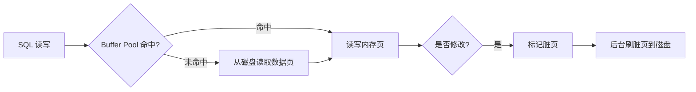
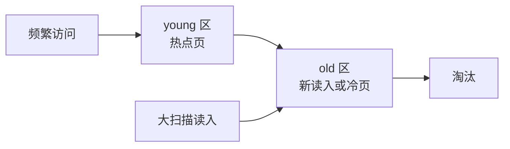
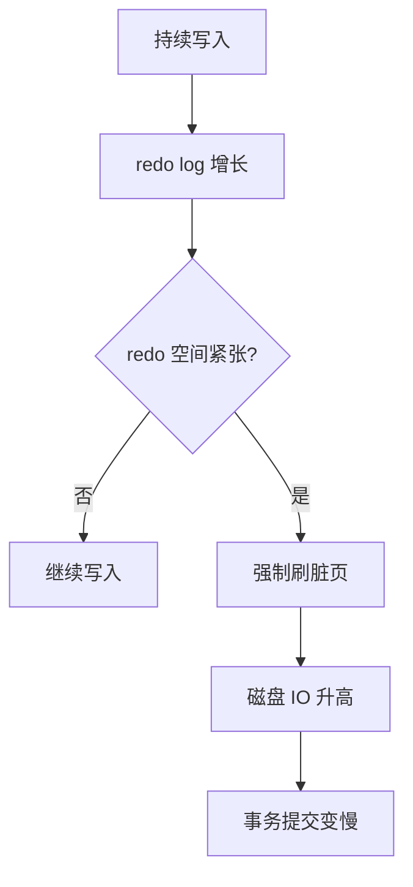

# InnoDB Buffer Pool

> Buffer Pool 是 InnoDB 性能的核心：MySQL 不是每次都直接读写磁盘，而是尽量在内存页里完成读写，再异步刷盘。

## 一、核心原理

### 1. Buffer Pool 是什么

Buffer Pool 是 InnoDB 的内存缓存区，用来缓存：

- 数据页。
- 索引页。
- undo 页。
- 插入缓冲、自适应哈希索引等内部结构。

简化理解：

```text
磁盘上的表和索引被切成一页一页。
查询时先看 Buffer Pool。
命中就直接读内存。
未命中再从磁盘读页进 Buffer Pool。
更新时先改 Buffer Pool 中的页，并把页标记为脏页。
```



### 2. 页和脏页

InnoDB 以页为基本 IO 单位，常见页大小是 16KB。

脏页：

```text
Buffer Pool 中的数据页已经被修改，但还没刷回磁盘。
```

为什么可以不立刻刷盘？

- 事务提交时 redo log 已经记录了修改。
- 宕机后可以用 redo log 恢复。
- 数据页随机写成本高，延迟刷盘能提升性能。

### 3. LRU 和冷热数据

Buffer Pool 容量有限，需要淘汰旧页。

普通 LRU 的问题：

- 一次大查询可能把大量冷数据读入 Buffer Pool。
- 热点页被挤出去。
- 后续核心查询命中率下降。

InnoDB 使用改进版 LRU，把链表分为 young 区和 old 区，减少全表扫描对热点页的冲击。



### 4. 刷脏页

脏页会在后台刷盘，但某些情况下会触发明显抖动：

- redo log 空间快写满，需要推进 checkpoint。
- Buffer Pool 空闲页不足，需要淘汰脏页。
- 脏页比例过高。
- MySQL 正常关闭。

redo log 写满时，InnoDB 必须把一部分脏页刷回磁盘，释放 redo log 可覆盖空间。这个过程可能导致写入突然变慢。



## 二、高频面试题

### Buffer Pool 为什么能提升性能？

因为数据库访问有大量局部性：

- 热点数据会被反复访问。
- 索引页频繁使用。
- 内存访问远快于磁盘 IO。

Buffer Pool 让读请求尽量命中内存，让写请求先写内存和 redo log，减少同步随机写数据页。

### 脏页什么时候刷盘？

常见时机：

- 后台线程周期性刷。
- 脏页比例过高。
- redo log 空间不足。
- Buffer Pool 空闲页不足。
- 正常关闭实例。

答题要点：

> 事务提交不等于数据页立刻落盘，只要 redo log 按策略持久化，就可以保证崩溃恢复。

### MySQL 为什么会突然变慢？

一个常见原因是刷脏页压力突然上来：

- 写入高峰导致 redo log 快满。
- 后台刷脏页跟不上。
- InnoDB 被迫同步刷脏页。
- 磁盘 IO 飙升。
- 事务提交延迟上升。

其他原因还包括：

- Buffer Pool 命中率下降。
- 大查询冲刷缓存。
- 锁等待。
- 主从延迟。
- 连接池耗尽。

### 全表扫描为什么可能影响线上？

全表扫描会读入大量数据页：

- 占用 Buffer Pool。
- 挤出热点页。
- 增加磁盘 IO。
- 导致核心查询命中率下降。

所以大查询、报表、导出不应该直接跑在线上主库或核心从库。

## 三、典型场景

### 场景 1：活动后数据库写入突然抖动

现象：

- 写入 RT 突然升高。
- 磁盘 IO 飙升。
- CPU 不一定最高。
- 慢 SQL 不一定明显增加。

可能链路：

```text
写入高峰
  -> 脏页快速增加
  -> redo log 空间紧张
  -> checkpoint 推进
  -> 同步刷脏页
  -> 写入抖动
```

排查：

- 看磁盘 IO。
- 看 Buffer Pool 命中率。
- 看脏页比例。
- 看 redo log checkpoint 推进相关指标。
- 看是否有大事务、大批量写入。

处理：

- 拆大事务。
- 控制批量写入速度。
- 提升磁盘 IO 能力。
- 调整刷脏页相关参数。
- 削峰填谷，避免瞬时写爆。

### 场景 2：报表查询影响核心接口

现象：

- 报表查询执行期间，核心接口变慢。
- Buffer Pool 命中率下降。
- 从库复制延迟或查询延迟升高。

原因：

- 大范围扫描把冷数据读入 Buffer Pool。
- 热点页被淘汰。
- 磁盘 IO 被报表查询占用。

解决：

- 报表走专用从库。
- 复杂查询同步到数仓或 ClickHouse。
- 导出任务异步分批。
- 限制查询时间范围和并发。

## 四、常见坑

- 认为事务提交就是数据页立刻刷盘。
- 只看 SQL，不看 Buffer Pool 和磁盘 IO。
- 在线上主库跑大查询、导出、报表。
- 大批量写入不拆批，导致 redo 和脏页压力集中。
- 只关注 CPU，不关注 IO、脏页比例、命中率。

## 五、答题模板

```text
InnoDB 通过 Buffer Pool 缓存数据页和索引页。
读请求先查 Buffer Pool，命中就读内存；未命中才读磁盘。
更新时先改内存页并标记为脏页，同时写 redo log。
事务提交不要求数据页立刻刷盘，因为宕机后可以通过 redo log 恢复。
如果写入太快导致 redo 空间紧张或脏页比例过高，InnoDB 会强制刷脏页，这时 MySQL 可能突然抖动。
```
