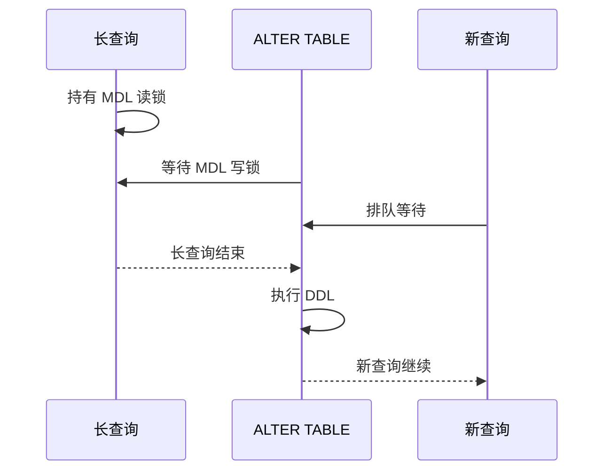
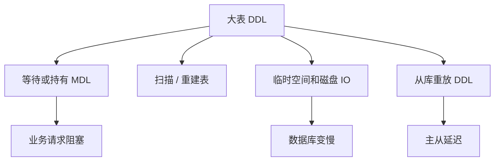
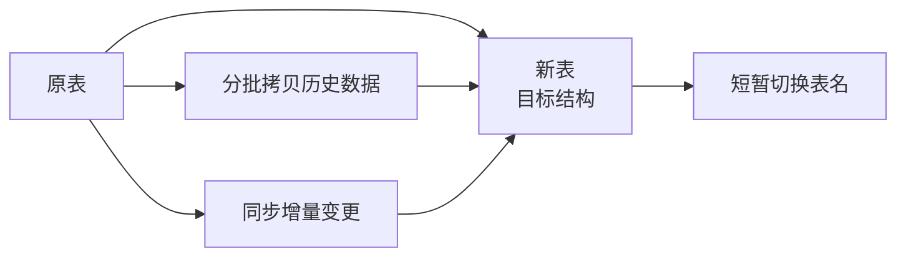

# Online DDL 与 MDL

> 线上 DDL 的风险不只是“执行慢”，更常见的是元数据锁阻塞请求、从库延迟、磁盘和 IO 暴涨。

## 一、核心原理

### 1. MDL 是什么

MDL 是 Metadata Lock，元数据锁。

MySQL 为了保证表结构和查询执行的一致性，会在访问表时加 MDL：

- 普通 `select`、`insert`、`update`、`delete` 会持有 MDL 读锁。
- `alter table` 这类 DDL 需要 MDL 写锁。

MDL 写锁和读锁互斥，所以 DDL 可能被长查询阻塞；同时后续新来的查询也可能排在 DDL 后面，形成阻塞雪崩。



### 2. Online DDL 不等于无锁

Online DDL 的意思是很多 DDL 可以降低对读写的阻塞，但不代表完全没有锁。

DDL 可能涉及：

- 获取 MDL。
- 扫描原表。
- 构建新索引。
- 临时文件和磁盘空间。
- 主从复制重放。

不同 MySQL 版本、不同 DDL 语句、不同表结构，行为差异很大。

### 3. 大表 DDL 风险



## 二、高频面试题

### 为什么简单加字段也可能阻塞线上？

因为 DDL 要获取 MDL 写锁。如果当前有长事务或长查询持有 MDL 读锁，DDL 会等待。

更危险的是：

```text
长查询持有 MDL 读锁
  -> DDL 等 MDL 写锁
  -> 后续新查询排在 DDL 后
  -> 大量请求被阻塞
```

### 如何安全做大表 DDL？

步骤：

1. 确认 MySQL 版本和 DDL 语句是否支持 online / instant。
2. 评估表大小、索引数量、写入 QPS。
3. 检查是否有长事务。
4. 低峰执行，设置锁等待超时。
5. 观察锁等待、磁盘、主从延迟。
6. 高风险大表使用在线变更工具。
7. 应用代码先兼容新旧结构。

### gh-ost / pt-online-schema-change 大致原理是什么？

它们核心思想都是影子表迁移：



大致流程：

- 创建一张目标结构的新表。
- 分批复制老表数据。
- 同步增量变更。
- 校验后短时间切换表名。

注意：

- 它们也不是零成本。
- 仍会消耗 IO、CPU、磁盘。
- 切换阶段仍需要短暂锁。
- 要关注主从延迟和失败回滚。

## 三、典型场景

### 场景 1：ALTER 被长事务阻塞

现象：

- 执行 `alter table` 后，业务查询开始卡住。
- 查看 processlist，发现 DDL 在等 metadata lock。
- 前面有一个长查询或未提交事务。

处理：

- 先判断影响范围。
- 必要时 kill 长查询或 DDL。
- 后续执行 DDL 前检查长事务。
- 设置 DDL 锁等待超时，避免无限等待。

### 场景 2：从库 DDL 重放导致延迟

现象：

- 主库 DDL 完成。
- 从库复制延迟升高。
- 读从库的数据不新。

原因：

- DDL 在从库也要执行。
- 大表 DDL 重放耗时。
- 从库期间可能无法及时重放后续 binlog。

处理：

- DDL 前评估从库影响。
- 避开业务高峰。
- 监控复制延迟。
- 必要时分批或用在线工具。

## 四、常见坑

- 认为 Online DDL 就是完全不阻塞。
- 变更前不查长事务。
- 大表 DDL 不评估磁盘临时空间。
- DDL 只看主库完成，不看从库延迟。
- 应用代码不兼容新旧字段，导致灰度期间报错。
- 没有回滚方案。
- 多个 DDL 同时执行，互相影响。

## 五、答题模板

```text
线上 DDL 最大风险之一是 MDL 元数据锁。
普通查询会持有 MDL 读锁，alter table 需要 MDL 写锁。
如果前面有长查询，DDL 会等待；后续新查询又可能排在 DDL 后面，造成业务阻塞。
所以大表 DDL 前要检查长事务，确认 MySQL 版本和 DDL 算法，低峰执行并监控锁等待、磁盘和主从延迟。
高风险变更可以用 gh-ost 或 pt-online-schema-change 这类在线变更工具，但它们也不是零成本。
```
