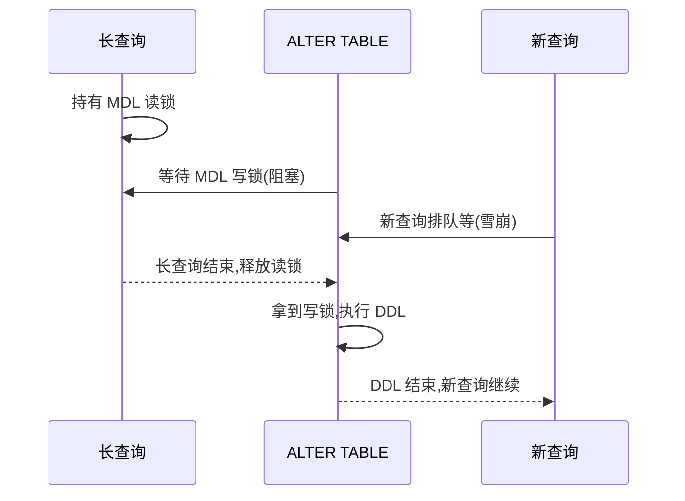
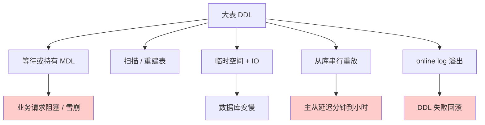

# Online DDL 与 MDL

> 线上 DDL 的风险不只是"执行慢",更常见的是元数据锁阻塞请求、从库延迟、磁盘和 IO 暴涨。
>
> **一句话先记住**:DDL 改表结构,DML 改数据。Online DDL 解决线上改表时尽量不阻塞 DML。InnoDB 三种算法 **INSTANT(只改字典)< INPLACE(原表重建)< COPY(整表拷贝)**,风险递增;开始/结束阶段仍需 MDL 写锁,所以**长事务、主从延迟、磁盘空间**永远要看。

## 一、核心原理

### 1.0 三种算法对比(资深必背)⭐

```sql
ALTER TABLE t ADD COLUMN c INT, ALGORITHM=INSTANT, LOCK=NONE;
```

显式指定 `ALGORITHM` 和 `LOCK`,**MySQL 不支持就报错**,避免静默退化为 COPY 把库打挂。

| 维度 | **INSTANT** | **INPLACE** | **COPY** |
| --- | --- | --- | --- |
| 谁来做 | Server 层改 frm | InnoDB 引擎层 | Server 层 |
| 是否重写历史行 | **否**,只改数据字典 | **可能**(重建聚簇要重写) | **是**,整表复制到新表 |
| 是否扫原表 | 否 | 可能 | 是 |
| 是否锁表 | 极短 MDL 写锁 | 开始/结束 MDL 写锁,中间 MDL 读锁 | 开始/结束 MDL 写锁,中间禁写或允许 DML |
| DML 并发 | ✅ 全程允许 | ✅ 大部分阶段允许(online log 缓冲增量) | ❌ 经典模式禁写;5.6+ Online INPLACE 替代 |
| 磁盘开销 | 几乎为零 | 索引/重建有临时文件 | **2 倍原表空间** |
| 主从延迟 | 极低 | 中等(看表大小) | 高(从库串行重放) |
| 典型场景 | 加列(尾部)、改默认值、加/删除虚拟列 | 加索引、改 VARCHAR 长度同类型、修改主键 | 改字段类型跨类、改字符集、降版本兼容 |
| 速度 | **毫秒级** | 分钟到小时 | 小时到天 |
| 失败回滚 | 几乎不可能失败 | 中途崩可回滚 | 中途崩留垃圾临时表 |

> **一句话总结**:**INSTANT 改字典、INPLACE 改数据、COPY 拷整表**——按风险从小到大,**能 INSTANT 不 INPLACE,能 INPLACE 不 COPY**。

### 1.1 INSTANT 算法(MySQL 8.0+,最轻)

**核心机制**:
- 只修改表的**数据字典**(`.frm` 已被 InnoDB 内部字典取代),**不动数据文件**
- 历史行查询时**根据元数据补默认值**,新写入按新结构存
- 表头维护"列增加位置 + 版本号",查询根据行版本动态拼装

**版本演进**(高频考点):

| 版本 | 支持的 INSTANT 操作 |
| --- | --- |
| 8.0.12 | 末尾加列(`ADD COLUMN` 必须在最后) |
| 8.0.29 | **任意位置加列**、加/删除虚拟列、改默认值 |
| 8.0.29 | 删除列(但仍受限,如不能删主键列) |

**限制**(必须知道):
- 加列**有数量上限**(单表累计 INSTANT 加列 < 64 次,超了报错,得 OPTIMIZE TABLE 整理)
- 不能改字段类型、长度、字符集
- 不能 INSTANT 改主键

```sql
-- INSTANT 加列(8.0.12+)
ALTER TABLE orders ADD COLUMN tag VARCHAR(32) DEFAULT '', ALGORITHM=INSTANT;

-- 改默认值(任意版本支持的 INSTANT)
ALTER TABLE orders ALTER COLUMN status SET DEFAULT 0, ALGORITHM=INSTANT;
```

> **一句话总结**:INSTANT 只改字典不动数据,**毫秒级完成**,适合加列/改默认值这类轻操作,但**累计 64 次限额、不能改类型/主键**,大表加列首选但不是万能。

### 1.2 INPLACE 算法(原表重建,主力)

**核心机制**:
- 在 InnoDB 内部就地执行,**不创建新表**(可能创建新索引文件)
- 分**两种情况**:
  - **rebuild = false**(轻量):只构建辅助索引,如 `ADD INDEX`、`DROP INDEX`
  - **rebuild = true**(重建聚簇):改主键、改字段类型同类、`OPTIMIZE TABLE` — **要重写所有行**
- 大部分阶段允许并发 DML,通过 **online log**(增量日志)记录 DDL 期间的写入,结束时回放

**Online log 的关键风险**:
- 默认大小 `innodb_online_alter_log_max_size = 128MB`
- DDL 期间业务写入太大 → online log 溢出 → **直接报错 DDL 失败**(不会退化,8.0 保留行为)
- 大表 DDL 前要**调大 online log**:`SET GLOBAL innodb_online_alter_log_max_size = 1024*1024*1024;`

**典型场景**:

```sql
-- 加索引(rebuild=false,快)
ALTER TABLE orders ADD INDEX idx_user (user_id), ALGORITHM=INPLACE, LOCK=NONE;

-- 改主键(rebuild=true,慢)
ALTER TABLE orders DROP PRIMARY KEY, ADD PRIMARY KEY (new_id), ALGORITHM=INPLACE;
```

> **一句话总结**:INPLACE 在 InnoDB 内部就地改,**加索引快、重建聚簇慢**,大部分阶段允许 DML 但靠 **online log 缓冲增量**(默认 128MB,大表必须调大,否则溢出 DDL 失败)。

### 1.3 COPY 算法(最重,尽量避免)

**核心机制**:
- Server 层创建一张新表(目标结构)
- **逐行复制**老表数据到新表
- 复制期间**禁止 DML**(经典模式)或允许但要排队
- 重建所有索引
- 重命名切换:`RENAME old TO old_bak, new TO old`

**为什么风险大**:
- 需要 **2 倍磁盘空间**(原表 + 新表)
- 全程禁写,业务感知严重
- 失败回滚困难,留垃圾表
- 主从延迟从分钟到小时

**什么时候会触发 COPY**(没显式指定 ALGORITHM 时的退化):
- 改字段类型跨类(INT → VARCHAR)
- 改字符集(latin1 → utf8mb4)
- 删除主键且不立即加新主键
- 部分老版本的特殊 DDL

```sql
-- 显式拒绝 COPY,失败比静默执行强
ALTER TABLE orders MODIFY name VARCHAR(255), ALGORITHM=INPLACE, LOCK=NONE;
-- 如果不支持 INPLACE 直接报错,而不是默默走 COPY
```

> **一句话总结**:COPY 创建新表 + 整表复制 + 切换,**全程禁写、要 2 倍磁盘、风险最高**,生产**绝不允许静默退化**——必须显式 `ALGORITHM=INPLACE/INSTANT`,不支持就用 gh-ost / pt-osc。

### 1.4 MDL 元数据锁

MDL 是 Metadata Lock,元数据锁。MySQL 为了保证表结构和查询执行的一致性,会在访问表时加 MDL:

- 普通 `select` / `insert` / `update` / `delete` 持有 **MDL 读锁**
- `alter table` 这类 DDL 需要 **MDL 写锁**

MDL 读写锁互斥,所以 DDL 可能被长查询阻塞;**更危险的是**后续新查询排在 DDL 后面,形成**阻塞雪崩**。


```mermaid
sequenceDiagram
    participant T1 as 长查询
    participant DDL as ALTER TABLE
    participant T2 as 新查询

    T1->>T1: 持有 MDL 读锁
    DDL->>T1: 等待 MDL 写锁(阻塞)
    T2->>DDL: 新查询排队等(雪崩)
    T1-->>DDL: 长查询结束,释放读锁
    DDL->>DDL: 拿到写锁,执行 DDL
    DDL-->>T2: DDL 结束,新查询继续
```

**安全配置**:

```sql
SET lock_wait_timeout = 5;  -- DDL 等 MDL 最多 5 秒,避免无限阻塞
```

> **一句话总结**:**MDL 读写互斥**,DDL 要写锁所以怕长查询,**且 DDL 后面排队的新查询会一起卡住**——这是 Online DDL 雪崩的根因,必须设 `lock_wait_timeout` 短超时 + 变更前 kill 长事务。

### 1.5 Online DDL 不等于无锁

Online DDL 的意思是**降低**对读写的阻塞,**不是完全没有锁**。任何 DDL 都涉及:

- **开始**:拿 MDL 写锁(瞬时,但被长事务阻塞)
- **中间**:扫表 / 构建索引 / 重建聚簇(占 CPU、IO、磁盘临时空间)
- **online log**:DDL 期间的 DML 增量记录(可能溢出)
- **结束**:再次拿 MDL 写锁回放 online log 并切换(瞬时,但同样可能被新查询阻塞)
- **从库重放**:DDL 在从库串行重放,**主从延迟必定上升**

> **一句话总结**:Online DDL 是"**两头加锁中间放行**"——开始/结束的 MDL 写锁很短但躲不掉,中间用 online log 缓冲增量,**所谓"在线"不是无锁,是"锁的时间窗口被压缩"**。

### 1.6 大表 DDL 风险全景


```mermaid
flowchart TB
    DDL["大表 DDL"] --> MDL["等待或持有 MDL"]
    DDL --> Scan["扫描 / 重建表"]
    DDL --> Disk["临时空间 + IO"]
    DDL --> Repl["从库串行重放"]
    DDL --> OLog["online log 溢出"]

    MDL --> Block["业务请求阻塞 / 雪崩"]
    Disk --> Slow["数据库变慢"]
    Repl --> Delay["主从延迟分钟到小时"]
    OLog --> Fail["DDL 失败回滚"]

    style Block fill:#fcc
    style Delay fill:#fcc
    style Fail fill:#fcc
```

> **一句话总结**:大表 DDL 的五大风险是 **MDL 阻塞 / 临时空间 / 主从延迟 / online log 溢出 / 失败回滚**,任何一个翻车都可能 P0,必须**低峰 + 显式 ALGORITHM + 监控全开 + 备好工具兜底**。

## 二、高频面试题

### 2.1 INSTANT / INPLACE / COPY 怎么选?⭐

```
1. 默认尝试 INSTANT(只改字典,毫秒级)
2. INSTANT 不支持 → 显式指定 INPLACE(大部分能 online)
3. INPLACE 不支持或表太大(> 100GB) → 用 gh-ost / pt-osc
4. 永远显式写 ALGORITHM= 和 LOCK=NONE,不支持就报错,绝不静默走 COPY
```

| 操作 | 优先算法 | 备选 |
| --- | --- | --- |
| 加列(尾部 / 任意位置 8.0.29+) | INSTANT | INPLACE |
| 加索引 | INPLACE(rebuild=false) | — |
| 改主键 | INPLACE(rebuild=true) | gh-ost(大表) |
| 改字段类型同类(INT 长度) | INPLACE | gh-ost |
| 改字段类型跨类(INT→VARCHAR) | gh-ost(InnoDB 必走 COPY) | 业务双写迁移 |
| 改字符集(latin1→utf8mb4) | gh-ost | 业务双写迁移 |
| 删除大量历史数据 | 不要用 DDL,用分批 DELETE 或分区表 DROP PARTITION | — |

> **一句话总结**:选型口诀 **INSTANT > INPLACE > gh-ost > COPY**,前三个能用就别让它退化到 COPY。

### 2.2 为什么简单加字段也可能阻塞线上?

因为 DDL 要 MDL 写锁。即使是 INSTANT(本身毫秒级),前面长事务持有 MDL 读锁就得等;**等待期间后续新查询排在 DDL 后**,形成阻塞雪崩。

```
长查询持有 MDL 读锁(几分钟没提交)
  → DDL 等 MDL 写锁(被卡住)
  → 后续 SELECT/UPDATE 排在 DDL 后(全部卡)
  → 几秒内连接池打满 → 业务雪崩
```

> **一句话总结**:**INSTANT 自己很快,但前置 MDL 写锁躲不掉**——长事务 + DDL + 排队查询三件套必雪崩,变更前**先 kill 长事务、设短 lock_wait_timeout**。

### 2.3 如何安全做大表 DDL?

```
1. 确认 MySQL 版本 + 算法支持(查官方表)
2. 评估表大小、索引数、写入 QPS、磁盘剩余空间
3. 检查长事务(information_schema.innodb_trx)
4. 低峰执行 + lock_wait_timeout = 5s
5. 显式 ALGORITHM=INSTANT/INPLACE LOCK=NONE
6. 调大 innodb_online_alter_log_max_size(避免溢出)
7. 监控:锁等待 / IO / 临时空间 / 主从延迟
8. 高风险大表用 gh-ost / pt-osc
9. 应用代码先兼容新旧结构(双写期)
10. 备好回滚预案(尤其工具变更)
```

> **一句话总结**:大表 DDL 安全 = **算法显式 + 长事务清理 + 监控全开 + 工具兜底**,九成事故都源于"想当然觉得 Online DDL 不会出事"。

### 2.4 gh-ost / pt-online-schema-change 大致原理

它们核心思想都是**影子表迁移**:


```mermaid
flowchart LR
    Old["原表"] --> Copy["分批拷贝历史数据"]
    Old -.binlog/触发器.-> Inc["同步增量变更"]
    Copy --> New["新表 (目标结构)"]
    Inc --> New
    New --> Cut["短暂切换表名 (秒级)"]
```

- 创建一张目标结构的新表
- **分批**复制老表数据(限速,不打满 IO)
- **同步增量**:gh-ost 读 binlog(无侵入)、pt-osc 用触发器(主表轻微开销)
- 校验后**秒级切换**表名

**注意**:
- 不是零成本,仍消耗 IO / CPU / 磁盘空间
- 切换阶段需要**短暂的元数据锁**
- 失败回滚要保留中间表
- gh-ost 比 pt-osc 更安全(无触发器,可暂停)

> **一句话总结**:gh-ost / pt-osc = **影子表 + 分批拷贝 + binlog/触发器同步增量 + 秒级切表**,代价是 IO 翻倍 + 切换瞬时元数据锁,**gh-ost 优于 pt-osc**(无触发器、可暂停、靠 binlog)。

## 三、典型场景

### 场景 1:ALTER 被长事务阻塞

**现象**:
- 执行 `alter table` 后,业务查询开始卡住
- `show processlist` 看到 DDL 在 `Waiting for metadata lock`
- 前面有一个长查询或未提交事务

**处理**:
```sql
-- 找到 DDL 阻塞者
SELECT * FROM performance_schema.metadata_locks WHERE LOCK_STATUS = 'PENDING';

-- 找未提交长事务
SELECT * FROM information_schema.innodb_trx WHERE TIME_TO_SEC(TIMEDIFF(NOW(), trx_started)) > 60;

-- 必要时 kill
KILL <thread_id>;
```

**预防**:
- 变更前先扫长事务
- `SET lock_wait_timeout = 5;` 避免 DDL 无限等
- 业务侧禁止超长事务(超时回滚)

> **一句话总结**:ALTER 被长事务卡是经典 P1 事故,**根因不是 DDL 慢,是前面有人不提交**,处理顺序 **kill 长事务 → 让 DDL 走完 → 排查代码为啥有长事务**。

### 场景 2:从库 DDL 重放导致延迟

**现象**:主库 DDL 完成,从库延迟从 0 涨到几十分钟,读从库的业务读到旧数据。

**原因**:DDL 在从库**串行**重放,期间 binlog 后续事件全部堆积。

**处理**:
- DDL 前评估从库影响(看表大小 / 索引数)
- 避开业务高峰
- 监控 `Seconds_Behind_Master`
- 大表必须用 gh-ost(支持先在从库执行)

> **一句话总结**:**主库 DDL 完成 ≠ 从库完成**,从库串行重放期间所有读从业务必受影响,大表必走 gh-ost 或滚动执行(先从库后主库)。

### 场景 3:online log 溢出 DDL 失败

**现象**:大表加索引执行到 80%,突然报错 `Creating index 'xxx' required more than 'innodb_online_alter_log_max_size' bytes of modification log. Please try again.`

**原因**:DDL 期间业务写入超过 online log 容量(默认 128MB)。

**处理**:
```sql
-- 先调大 online log
SET GLOBAL innodb_online_alter_log_max_size = 1073741824;  -- 1GB

-- 再重试
ALTER TABLE orders ADD INDEX idx_user (user_id), ALGORITHM=INPLACE, LOCK=NONE;
```

> **一句话总结**:online log 溢出 = **DDL 期间写入太猛缓冲不下**,默认 128MB 大表必撑爆,**变更前调到 1GB+**,实在不行降业务写入压力或用 gh-ost。

## 四、常见坑

| 坑 | 原因 | 一句话总结 |
| --- | --- | --- |
| 认为 Online DDL 完全不阻塞 | 忽视 MDL 和 online log | **Online 是"减锁"不是"无锁"** |
| 变更前不查长事务 | 不知道 MDL 怎么被阻塞 | **DDL 前必扫长事务** |
| 不评估磁盘临时空间 | INPLACE 重建要临时文件,COPY 要 2 倍空间 | **磁盘<剩余 30% 别动手** |
| 只看主库完成不看从库 | DDL 在从库串行重放 | **从库延迟才是真完成** |
| 应用不兼容新旧字段 | 灰度期间读到旧结构 | **DDL 前应用先双兼容** |
| 多个 DDL 并发执行 | 互抢 MDL + IO | **DDL 一次只动一张表** |
| 没设 lock_wait_timeout | DDL 卡住整库 | **必设 5-10s 短超时** |
| 静默退化为 COPY | 没显式 ALGORITHM | **永远显式写 ALGORITHM=** |
| INSTANT 累计加列超 64 次 | 8.0 INSTANT 有限额 | **加多了得 OPTIMIZE 整理** |

## 五、答题模板(口述背诵版)

```text
DDL 改表结构,DML 改数据。Online DDL 解决线上改表时尽量不阻塞 DML。
InnoDB 主要有 INSTANT、INPLACE、COPY 三种算法。

INSTANT 最轻,只改数据字典不重写历史行,历史行查询时按元数据补默认值,
新数据按新结构写入,毫秒级完成,适合加列和改默认值,但累计加列有 64 次限额。

INPLACE 在 InnoDB 内部就地执行,可能扫原表构建索引,也可能重建聚簇,
大部分阶段允许并发 DML,通过 online log 记录增量,结束时回放;online log
默认 128MB,大表必须调大避免溢出。

COPY 最重,创建新表 + 逐行复制 + 切换表名,要 2 倍磁盘 + 全程禁写,
生产绝不允许静默退化——必须显式 ALGORITHM=INSTANT/INPLACE LOCK=NONE,
不支持就用 gh-ost 或 pt-osc。

Online DDL 不是完全无锁,开始和结束阶段仍要拿 MDL 写锁,所以要关注
长事务、锁等待、主从延迟、磁盘空间和 online log 溢出。

线上大表变更我会:① 显式指定算法和锁;② 先扫长事务;③ 设 lock_wait_timeout=5s;
④ 调大 online log;⑤ 监控主从延迟;⑥ 高风险用 gh-ost(无触发器、可暂停、靠 binlog,
比 pt-osc 安全)。
```

> **一句话核心**:Online DDL = **算法选型 + MDL 管控 + online log 调优 + 工具兜底**,口诀 **INSTANT > INPLACE > gh-ost > COPY**,死磕"显式 + 监控 + 长事务清理"才不翻车。
