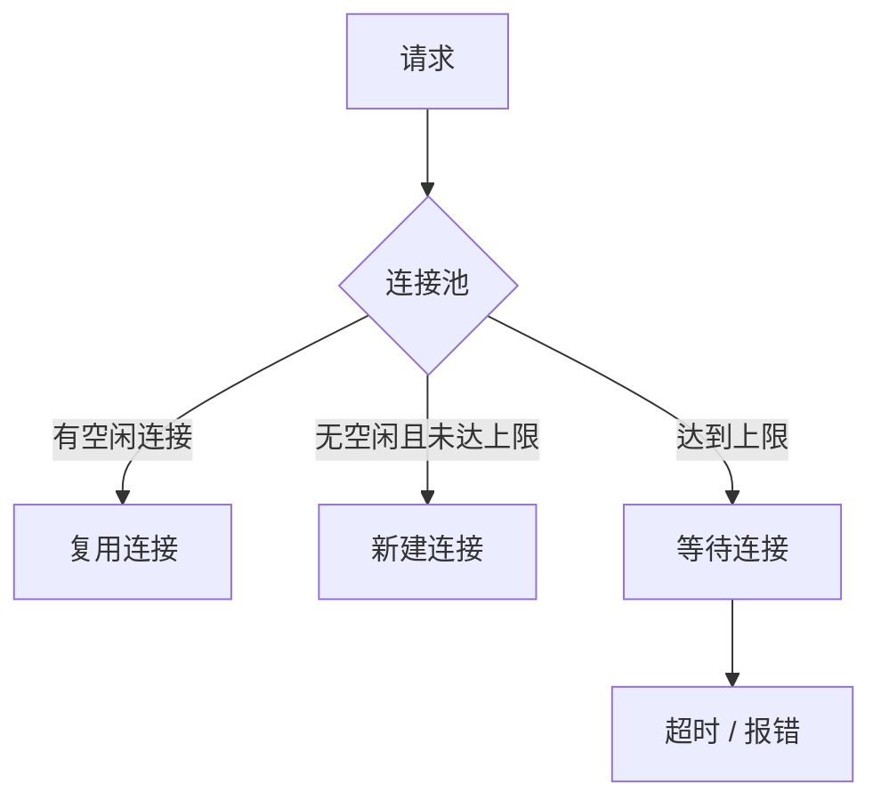
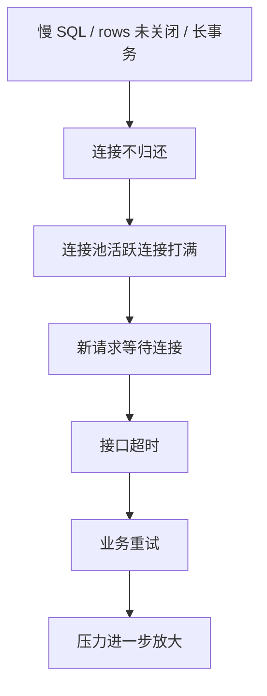

# Go 使用 MySQL 实战坑

> Go 后端面试里，MySQL 不只问数据库原理，还会问应用侧怎么用：连接池、事务、超时、重试、Rows 关闭、幂等。

## 一、database/sql 连接池

Go 的 `database/sql` 不是一个连接，而是连接池管理器。

常用参数：

```go
db.SetMaxOpenConns(100)
db.SetMaxIdleConns(20)
db.SetConnMaxLifetime(30 * time.Minute)
db.SetConnMaxIdleTime(5 * time.Minute)
```

含义：

- `SetMaxOpenConns`：最大打开连接数。
- `SetMaxIdleConns`：最大空闲连接数。
- `SetConnMaxLifetime`：连接最长生命周期。
- `SetConnMaxIdleTime`：连接最大空闲时间。



## 二、高频坑

### 1. rows 没关闭导致连接泄漏

错误示例：

```go
rows, err := db.QueryContext(ctx, query, userID)
if err != nil {
    return err
}

for rows.Next() {
    // scan
}
```

问题：

- `rows.Close()` 没调用。
- 连接可能长时间不归还连接池。
- 高并发下连接池被耗尽。

正确示例：

```go
rows, err := db.QueryContext(ctx, query, userID)
if err != nil {
    return err
}
defer rows.Close()

for rows.Next() {
    // scan
}
if err := rows.Err(); err != nil {
    return err
}
```

### 2. 事务里调用外部服务

错误模式：

```text
begin
  update order
  call payment rpc
  update payment_status
commit
```

问题：

- RPC 慢会导致事务持锁时间变长。
- 外部服务超时，数据库锁不释放。
- 更容易死锁和连接池耗尽。

正确思路：

- 事务里只做必要 DB 操作。
- 外部调用放事务外。
- 需要异步一致时用本地消息表或事务消息。

### 3. 没有超时控制

所有数据库操作都应该带 context：

```go
ctx, cancel := context.WithTimeout(parent, 200*time.Millisecond)
defer cancel()

row := db.QueryRowContext(ctx, query, id)
```

没有超时的风险：

- 慢 SQL 长时间占用连接。
- 请求取消后 DB 操作仍在跑。
- 连接池被慢请求拖满。

### 4. 盲目重试

重试不是越多越好。

危险场景：

- 写请求超时后重试，但数据库可能已经成功。
- 支付回调重复处理。
- 下单接口重复创建订单。

正确做法：

- 写操作必须有幂等键。
- 超时后查询最终状态。
- 对死锁、短暂连接错误可以有限重试。
- 重试要有退避和上限。

### 5. Scan NULL 报错

数据库字段允许 NULL，但 Go 用普通类型接收：

```go
var name string
err := row.Scan(&name)
```

如果值是 NULL，可能报错。

解决：

- 数据库字段尽量 `NOT NULL`。
- Go 中使用 `sql.NullString`、`sql.NullInt64`。
- 或在 SQL 中 `coalesce`。

## 三、事务写法

推荐事务模板：

```go
tx, err := db.BeginTx(ctx, nil)
if err != nil {
    return err
}
defer tx.Rollback()

if _, err := tx.ExecContext(ctx, updateOrderSQL, orderID); err != nil {
    return err
}
if _, err := tx.ExecContext(ctx, insertLogSQL, orderID); err != nil {
    return err
}

if err := tx.Commit(); err != nil {
    return err
}
return nil
```

说明：

- `defer tx.Rollback()` 是兜底，commit 成功后 rollback 会无效。
- 所有 SQL 使用同一个 `tx`。
- 不要事务中混用 `db.ExecContext`。
- 事务内不做 RPC、HTTP、文件 IO。

## 四、典型场景

### 场景 1：连接池打满

链路：



排查：

- 看 `db.Stats()`。
- 看 `OpenConnections`、`InUse`、`WaitCount`、`WaitDuration`。
- 查慢 SQL 和长事务。
- 查代码是否漏 `rows.Close()`。

处理：

- 修复连接泄漏。
- 优化慢 SQL。
- 缩短事务。
- 设置合理超时。
- 限制重试和并发。

### 场景 2：支付回调重复处理

解决：

- 第三方交易号建唯一索引。
- 更新订单状态带前置条件。
- 消息消费做幂等记录。

SQL：

```sql
update orders
set pay_status = 1,
    status = 2
where order_no = ?
  and pay_status = 0;
```

影响行数为 0 时，说明已经处理过或状态不允许变更。

## 五、常见坑

- 不关闭 `rows`。
- 不检查 `rows.Err()`。
- 事务内调用外部服务。
- 事务内混用 `tx` 和 `db`。
- 数据库操作不带 context timeout。
- 盲目重试写请求。
- 连接池参数照抄，不结合 MySQL 最大连接数和实例能力。
- `NULL` 字段直接 scan 到普通类型。
- 拼接 SQL，导致 SQL 注入风险。

## 六、答题模板

```text
Go 里 database/sql 是连接池，不是单连接。
我会设置 MaxOpenConns、MaxIdleConns、ConnMaxLifetime 和 ConnMaxIdleTime，
同时所有 DB 操作都带 context 超时。
查询 rows 必须 close，并检查 rows.Err，否则连接可能不归还连接池。
事务里只做必要的数据库操作，不调用外部服务，避免长时间持锁。
写请求重试前必须有幂等设计，比如唯一索引、状态机前置条件或幂等表。
```
