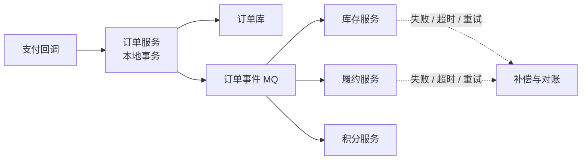
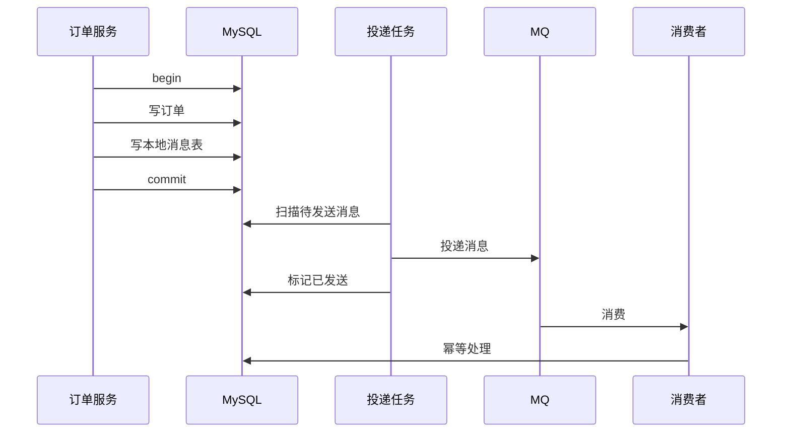
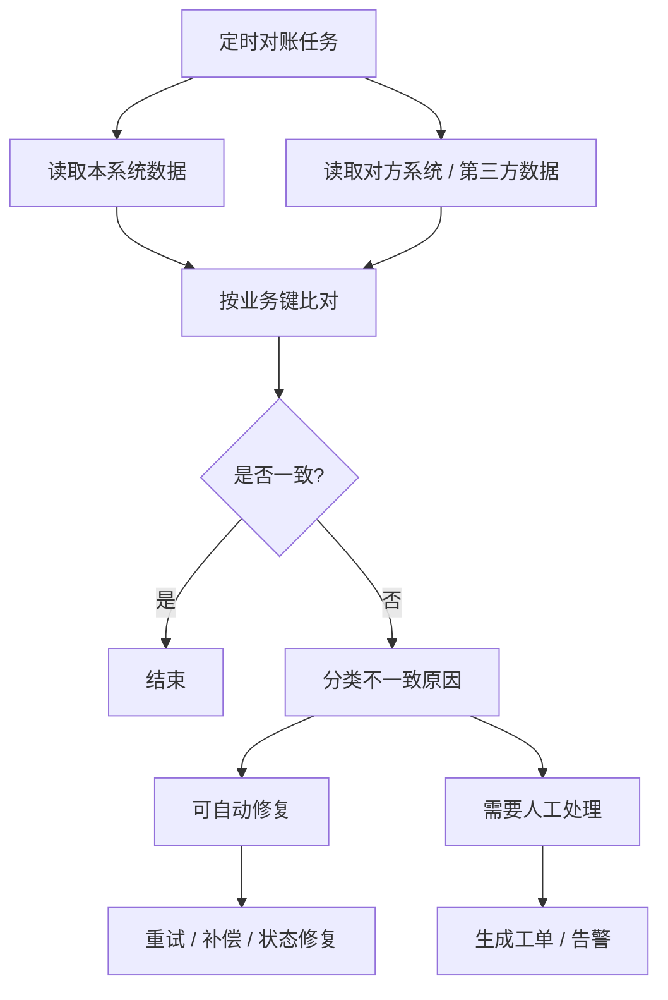
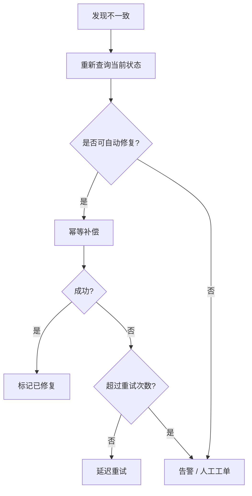

# 数据一致性与对账

> 最终一致不是“不管一致性”，而是通过可靠事件、幂等、重试、补偿、对账和人工兜底，让跨系统状态最终收敛。

## 一、核心问题

订单、支付、库存这类系统通常跨多个资源：

```text
订单库
支付库
库存库
MQ
第三方支付
履约系统
```

单个 MySQL 本地事务只能保证一个库内的一致性，不能天然保证跨服务一致。

典型问题：

- 订单创建成功，但库存扣减失败。
- 支付成功，但订单状态没更新。
- MQ 消息发送失败，其他系统不知道状态变化。
- 消费者重复消费，导致重复发货或重复发积分。
- 某个服务超时，但实际已经执行成功。



## 二、本地事务 + MQ 如何保证最终一致

### 1. 问题：数据库提交了，消息没发出去

错误流程：

```text
写订单库成功
  -> 发送 MQ 失败
  -> 库里有订单，但下游不知道
```

解决方案：

- 本地消息表。
- 事务消息。
- Outbox 模式。

### 2. 本地消息表

核心思想：

```text
业务数据和待发送消息在同一个本地事务里提交。
```



关键设计：

- 消息表有状态：待发送、已发送、发送失败。
- 投递任务定时扫描。
- 投递失败可重试。
- 消费方必须幂等。
- 消息有唯一业务键。

### 3. 事务消息

适合 MQ 支持事务消息的场景：

```text
发送半消息
  -> 执行本地事务
  -> 提交或回滚消息
  -> MQ 必要时回查本地事务状态
```

它解决的是可靠事件发布问题，但消费者仍然要做幂等和重试。

## 三、对账系统怎么设计

### 1. 为什么需要对账

只靠实时链路不够，因为一定会有：

- 网络超时。
- 消息丢失或堆积。
- 消费失败。
- 第三方回调延迟。
- 人工操作。
- 程序 bug。

对账的目标：

```text
发现不一致 -> 定位原因 -> 自动修复 -> 不能自动修复则人工兜底
```

### 2. 对账维度

订单系统常见对账：

| 对账对象 | 对账内容 |
| --- | --- |
| 订单 vs 支付 | 支付成功但订单未支付，订单已支付但无支付流水 |
| 订单 vs 库存 | 订单创建但库存未扣，订单取消但库存未释放 |
| 订单 vs 履约 | 已支付但未发货，已取消但仍履约 |
| 本地消息表 vs MQ 消费 | 消息已发送但下游未处理 |
| 本系统 vs 第三方 | 支付渠道、物流、退款渠道状态不一致 |

### 3. 对账流程



### 4. 对账表设计

可以有对账记录表：

```sql
create table reconciliation_records (
    id bigint not null,
    biz_type varchar(64) not null,
    biz_id varchar(128) not null,
    check_date date not null,
    local_status varchar(64) not null,
    remote_status varchar(64) not null,
    diff_type varchar(64) not null,
    fix_status tinyint not null,
    fix_count int not null,
    last_error varchar(512) not null,
    created_at datetime not null,
    updated_at datetime not null,
    primary key (id),
    unique key uk_biz_check (biz_type, biz_id, check_date)
);
```

核心字段：

- 业务类型。
- 业务 ID。
- 本地状态。
- 对方状态。
- 差异类型。
- 修复状态。
- 修复次数。
- 错误原因。

## 四、补偿任务怎么设计

补偿任务不是简单无限重试。

需要考虑：

- 幂等。
- 最大重试次数。
- 重试间隔和退避。
- 失败告警。
- 人工处理入口。
- 修复前再次查询当前状态，避免旧任务覆盖新状态。



## 五、典型场景

### 场景 1：支付成功但订单未支付

现象：

```text
第三方支付显示成功，但订单仍是待支付。
```

可能原因：

- 支付回调丢失。
- 回调处理失败。
- 订单状态更新 SQL 失败。
- 消息消费失败。

修复：

- 对账任务拉取支付渠道账单。
- 找到支付成功但本地未支付订单。
- 校验金额、订单号、支付流水。
- 幂等更新订单状态。
- 补发支付成功事件。

关键 SQL：

```sql
update orders
set pay_status = 1,
    status = 2,
    paid_at = ?
where order_no = ?
  and pay_status = 0;
```

### 场景 2：订单取消但库存未释放

原因：

- 取消订单消息未发送。
- 库存服务消费失败。
- 库存释放接口超时。

修复：

- 对账订单取消状态和库存冻结记录。
- 如果订单已取消且库存仍冻结，调用库存释放。
- 库存释放必须幂等。

### 场景 3：消息已发送但下游未处理

处理：

- 消费方维护消费记录。
- 对账本地消息表和消费记录。
- 对未消费消息重新投递。
- 如果多次失败，进入死信和人工处理。

## 六、常见坑

- 认为用了 MQ 就天然一致。
- 只做重试，不做幂等。
- 只做实时链路，不做对账。
- 补偿任务不查当前状态，导致旧补偿覆盖新状态。
- 没有最大重试次数，失败任务无限打爆系统。
- 没有人工兜底，异常数据长期挂起。
- 对账只比数量，不比金额、状态、时间和流水。

## 七、答题模板

```text
跨订单、支付、库存这种场景，我一般不会只依赖一个分布式强事务。
核心是本地事务保证本服务内一致，本地消息表或事务消息保证事件可靠发布，
消费方用唯一键和状态机保证幂等。
同时必须有对账任务，定期比对订单、支付、库存、履约状态。
发现不一致后先分类，能自动修复的走补偿任务，不能自动修复的告警和人工工单。
所以最终一致不是不保证一致，而是通过可靠消息、幂等、重试、补偿、对账和人工兜底保证最终收敛。
```
