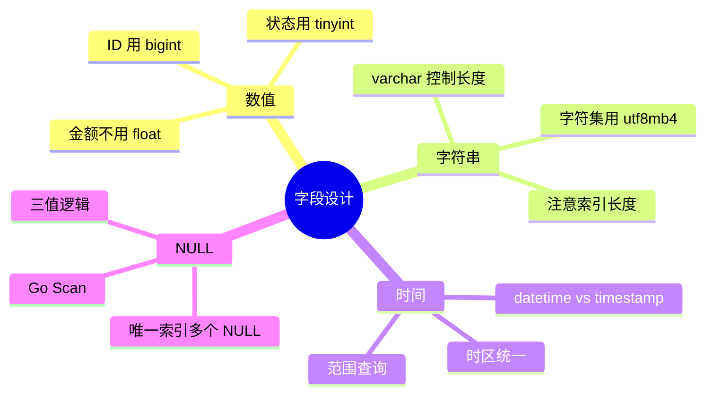

# 字段类型、字符集与时间坑

> 很多 MySQL 线上问题不是复杂原理，而是字段类型、字符集、NULL、时间和索引长度这些基础设计没处理好。

## 一、字段类型设计原则

基本原则：

- 能用小类型不用大类型。
- 能用整数不用字符串。
- 金额不用浮点数。
- 高频查询字段尽量 `NOT NULL`。
- 字段类型要和查询参数类型一致。
- 大字段和低频字段考虑拆表。



## 二、金额为什么不用 float

`float` 和 `double` 是浮点数，存在精度误差。

错误示例：

```text
0.1 + 0.2 != 0.3
```

金额推荐：

- 用 `bigint` 存分。
- 或使用 `decimal`。

订单、支付、账务系统更常用整数分：

```sql
pay_amount bigint not null
```

优点：

- 精确。
- 比较和计算简单。
- 适合对账。

面试表达：

> 金额字段不能用 float/double，核心交易系统通常用 bigint 存分，或者用 decimal，避免精度误差导致对账问题。

## 三、NULL 的坑

### 1. 查询逻辑

`NULL` 不是空字符串，也不是 0。

错误写法：

```sql
where deleted_at = null
```

正确写法：

```sql
where deleted_at is null
```

### 2. 三值逻辑

SQL 里有 true、false、unknown。

例如：

```sql
where status != 1
```

如果 `status` 是 `NULL`，这行不一定会被查出来。

### 3. 唯一索引允许多个 NULL

MySQL 唯一索引中，多个 `NULL` 不认为冲突。

如果业务要求唯一，字段应该：

```sql
not null
```

### 4. Go Scan 坑

数据库字段允许 NULL，Go 用普通类型接收可能报错：

```go
var name string
err := row.Scan(&name)
```

解决：

- 数据库尽量 `NOT NULL`。
- Go 使用 `sql.NullString`、`sql.NullInt64`。
- SQL 用 `coalesce`。

## 四、varchar 长度和索引长度

### 1. varchar 不是越大越好

问题：

- 字段过长会增加行大小。
- 索引更大。
- 排序、临时表、内存使用增加。
- 影响 Buffer Pool 命中率。

建议：

- 根据业务真实长度设置。
- 手机号、订单号、邮箱等不要无脑 `varchar(255)`。
- 大文本用 `text` 并拆到详情表或扩展表。

### 2. 字符集会影响索引长度

`utf8mb4` 一个字符最多 4 字节。

所以：

```text
varchar(255) utf8mb4
```

最多可能接近 1020 字节。

联合索引如果放多个长字符串字段，会导致索引很大，甚至超过索引长度限制。

### 3. 前缀索引

长字符串可以考虑前缀索引：

```sql
key idx_email_prefix (email(20))
```

但前缀索引的问题：

- 区分度可能不够。
- 不能完全覆盖排序。
- 不能完整替代唯一约束。

## 五、utf8 vs utf8mb4

MySQL 里的 `utf8` 历史上通常是 3 字节 UTF-8，不能完整支持 4 字节字符，比如 emoji。

推荐：

```text
utf8mb4
```

常见线上坑：

- 用户昵称包含 emoji，写入失败。
- 评论、备注、地址包含特殊字符失败。
- 不同表字符集或排序规则不一致，join 或比较异常。

字符集和排序规则要统一：

```text
character set: utf8mb4
collation: utf8mb4_xxx
```

注意：

- 排序规则会影响大小写敏感。
- 不同 collation 的比较可能导致隐式转换和索引问题。

## 六、datetime vs timestamp

### 1. timestamp

特点：

- 和时区相关。
- 存储范围较小。
- 会随 session time_zone 转换。

适合：

- 需要明确时间点并和时区转换相关的场景。

### 2. datetime

特点：

- 存储字面时间。
- 不随时区自动转换。
- 范围更大。

适合：

- 业务时间。
- 订单创建时间。
- 支付时间。

团队要统一标准，不要混用导致理解混乱。

### 3. 时区坑

常见问题：

- 应用服务器和 MySQL 时区不同。
- JVM/Go 连接参数时区不一致。
- `timestamp` 自动转换导致时间偏移。
- 跨时区业务用本地时间存储导致统计混乱。

建议：

- 统一使用 UTC 存储，展示时转换。
- 或全链路统一固定业务时区。
- 明确连接串时区参数。
- 时间范围查询使用半开区间。

```sql
where created_at >= '2026-05-03 00:00:00'
  and created_at <  '2026-05-04 00:00:00'
```

不要：

```sql
where date(created_at) = '2026-05-03'
```

因为对索引列使用函数会影响索引利用。

## 七、字段类型不一致导致索引问题

例子：

```sql
-- phone 是 varchar
where phone = 13800138000
```

可能发生隐式类型转换，影响索引使用。

正确：

```sql
where phone = '13800138000'
```

常见场景：

- 字符串 ID 用数字参数查。
- 不同表 join 字段类型不同。
- 字符集或 collation 不同。
- 时间字段和字符串混用。

## 八、典型场景

### 场景 1：用户昵称 emoji 写入失败

原因：

- 表或字段使用 MySQL `utf8`。
- emoji 需要 4 字节。

解决：

- 表、字段、连接字符集统一改为 `utf8mb4`。
- 检查排序规则。
- 变更前评估 DDL 风险。

### 场景 2：订单金额对账差 1 分

原因：

- 金额用浮点数计算或存储。
- 多次计算后精度误差累积。

解决：

- 金额用 `bigint` 存分。
- 计算逻辑统一。
- 对账按整数金额比对。

### 场景 3：按日期查询很慢

错误 SQL：

```sql
where date(created_at) = '2026-05-03'
```

问题：

- 对索引列使用函数。
- 不能有效利用 `created_at` 索引范围。

正确：

```sql
where created_at >= '2026-05-03 00:00:00'
  and created_at <  '2026-05-04 00:00:00'
```

### 场景 4：Go Scan NULL 报错

原因：

- 数据库字段允许 NULL。
- Go 用普通类型接收。

解决：

- 字段设计为 `NOT NULL`。
- 或 Go 使用 `sql.NullXXX`。
- 或 SQL 里使用 `coalesce`。

## 九、常见坑

- 金额用 `float` / `double`。
- 字段无脑允许 `NULL`。
- 手机号、订单号用数字类型。
- `varchar(255)` 到处使用。
- 长字符串字段直接建完整索引。
- 表字符集不是 `utf8mb4`，emoji 写入失败。
- 不同表 join 字段类型或 collation 不一致。
- `datetime` 和 `timestamp` 混用但没有统一时区规范。
- 对时间字段使用函数查询。

## 十、答题模板

```text
字段设计我会先考虑业务语义和查询方式。
金额不用 float/double，通常用 bigint 存分或 decimal。
核心字段尽量 NOT NULL，避免 SQL 三值逻辑和 Go Scan NULL 问题。
字符串字段控制长度，字符集统一用 utf8mb4，避免 emoji 和 collation 问题。
时间字段要统一时区和类型，范围查询用半开区间，不对索引列套 date 函数。
字段类型还要和查询参数一致，否则隐式转换可能导致索引失效。
```
