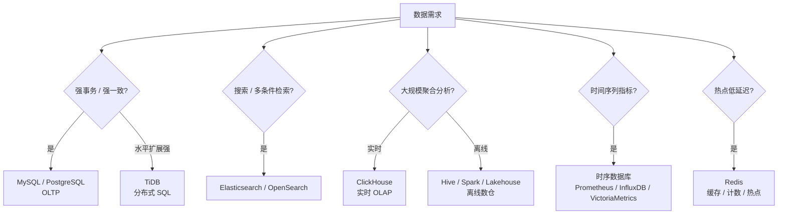
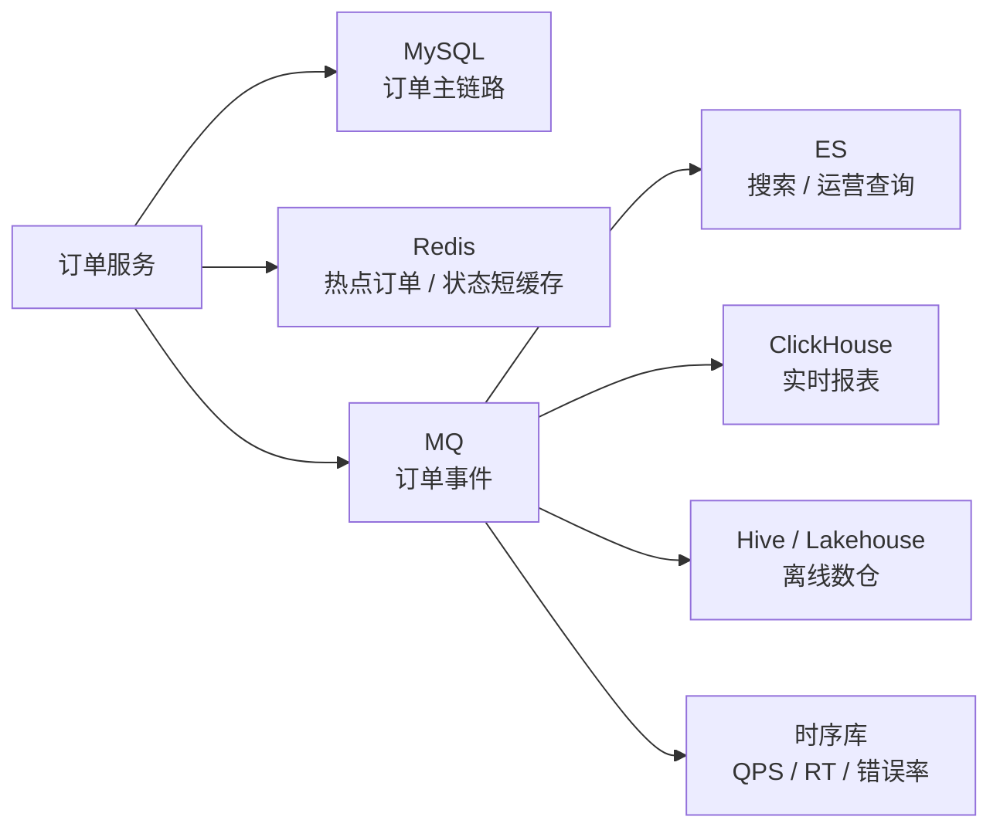
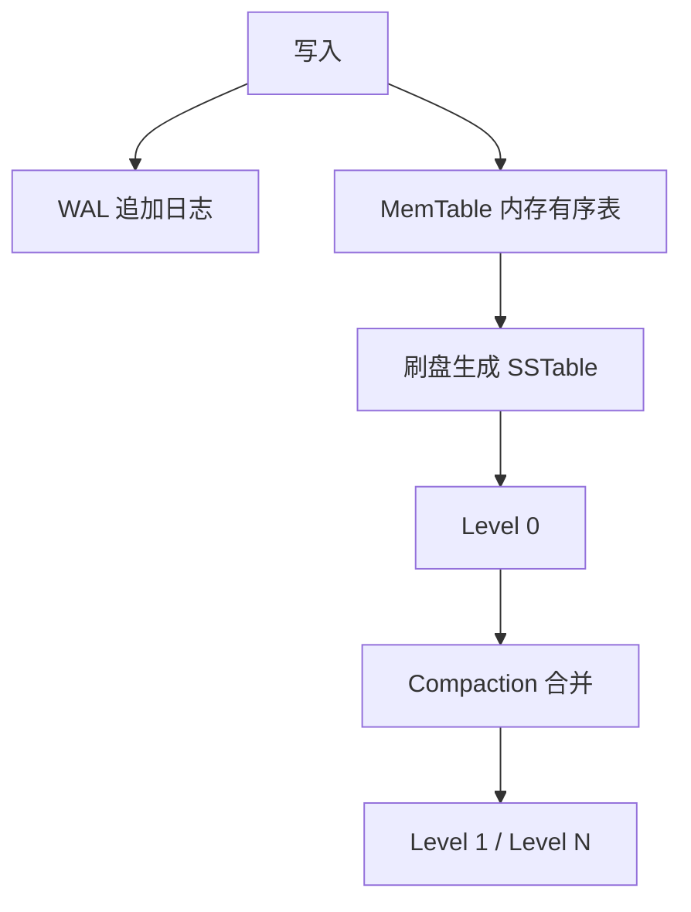
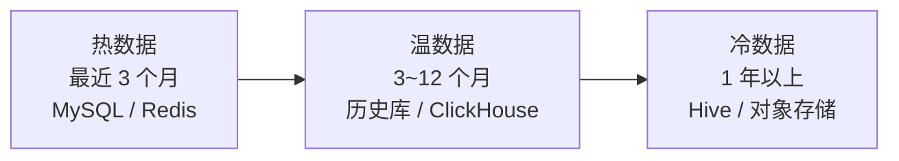

# 存储选型对比与未来趋势

> MySQL 是核心 OLTP 存储，但不是所有数据问题都该塞进 MySQL。面试里能讲清“边界”和“选型”，比只会分库分表更有架构感。

## 一、核心判断

先按问题类型选存储：



一句话：

> MySQL 适合交易主链路；分析、搜索、时序、缓存、离线计算应该交给更合适的存储系统。

## 二、常见存储对比

| 存储 | 适合场景 | 不适合场景 | 关键词 |
| --- | --- | --- | --- |
| MySQL | 订单、支付、用户、库存、强事务 OLTP | 海量聚合分析、全文搜索、时序高写入 | 事务、索引、主从、分库分表 |
| TiDB | 分布式 SQL、MySQL 协议兼容、水平扩展 | 极致低延迟热点交易、复杂强热点写 | HTAP、Raft、分布式事务 |
| ClickHouse | 报表、宽表聚合、实时 OLAP、明细分析 | 高频事务更新、强一致交易 | 列式、向量化、压缩 |
| Hive | 离线数仓、T+1 报表、海量历史数据 | 实时查询、低延迟接口 | 离线、批处理、低成本 |
| 时序数据库 | 监控、IoT、指标、按时间聚合 | 复杂事务、关系 join | 时间线、压缩、降采样 |
| Elasticsearch | 搜索、多条件筛选、运营后台检索 | 资金账务、强一致交易 | 倒排索引、搜索、近实时 |
| Redis | 缓存、热点数据、计数、限流、分布式锁辅助 | 持久交易主存储、大规模复杂查询 | 内存、低延迟、缓存 |

## 三、MySQL 的边界

### 1. MySQL 适合什么

适合：

- 订单主表。
- 支付流水。
- 用户账户。
- 库存扣减。
- 状态机流转。
- 幂等记录。
- 强约束和唯一索引。

原因：

- 支持事务。
- 支持唯一约束。
- 支持二级索引。
- 生态成熟。
- 运维和排障经验丰富。

### 2. MySQL 不适合什么

不适合：

- 大规模明细聚合。
- 复杂多维报表。
- 海量全文搜索。
- 高基数时序指标写入。
- 大量历史冷数据低频查询。
- 多维 ad-hoc 分析。

原因：

- 行存更适合 OLTP，不适合大宽表聚合扫描。
- 分库分表后跨分片聚合复杂。
- 大查询会影响 Buffer Pool。
- 报表查询容易拖慢主从复制。

## 四、典型架构：订单系统多存储协同



解释：

- **MySQL**：保存订单事实和交易状态。
- **Redis**：缓存热点订单详情、用户最近订单状态。
- **ES**：支持运营后台按手机号、订单号、商家、状态、地址等多条件检索。
- **ClickHouse**：支持实时 GMV、商家经营分析、转化漏斗。
- **Hive / Lakehouse**：保存历史明细，跑 T+1 报表和离线模型。
- **时序库**：保存系统指标，不保存业务交易事实。

面试表达：

```text
订单主链路我会放 MySQL，因为需要事务、唯一索引、状态机和可靠持久化。
但运营搜索不直接扫订单分片，而是同步到 ES。
实时经营分析进入 ClickHouse，历史离线分析进入 Hive 或湖仓。
监控指标进入时序数据库，热点状态可以用 Redis 短缓存。
这样 MySQL 只承担它擅长的 OLTP，不把搜索、报表、时序都压到一个库里。
```

## 五、TiDB：分布式 SQL

TiDB 可以理解为兼容 MySQL 协议的分布式 SQL 数据库，常见特点：

- SQL 接入体验接近 MySQL。
- 底层数据自动分片。
- 通过 Raft 做多副本一致性。
- 适合水平扩展和一定 HTAP 场景。

适合：

- 单机 MySQL 容量和扩展压力明显。
- 希望保留 SQL 能力。
- 不想在业务层做复杂分库分表。
- 查询维度比较多，需要分布式 SQL 能力。

不适合盲目替代 MySQL 的场景：

- 极致低延迟核心交易。
- 强热点行频繁更新。
- 团队没有分布式数据库运维经验。
- 原 SQL 和事务模型不适合分布式执行。

面试表达：

> TiDB 能降低业务分库分表复杂度，但不是“无限扩展的 MySQL”。分布式事务、热点、跨 Region 延迟、执行计划和运维复杂度仍然要评估。

## 六、ClickHouse：实时 OLAP

ClickHouse 是列式 OLAP 数据库。

适合：

- 大宽表聚合。
- 实时报表。
- 明细数据分析。
- 按时间、商家、地区、类目聚合。

为什么快：

- 列式存储，只读需要的列。
- 压缩率高。
- 向量化执行。
- 适合批量写入和大范围扫描。

不适合：

- 高频单行更新。
- 强事务。
- 订单主链路。
- 高并发点查替代 MySQL。

订单场景：

```text
MySQL 保存订单状态。
订单变更通过 MQ 同步到 ClickHouse。
ClickHouse 做 GMV、订单量、商家经营、实时看板。
```

## 七、Hive / 湖仓：离线大数据

Hive 更偏离线数仓，常和 HDFS、Spark、Iceberg、Hudi、Delta Lake 等生态一起出现。

适合：

- 海量历史数据。
- T+1 报表。
- 离线模型训练。
- 明细长期留存。
- 低成本存储。

不适合：

- 低延迟接口查询。
- 高频更新。
- 强事务交易。

常见分层：

```text
ODS：原始明细
DWD：清洗后的明细
DWS：按主题汇总
ADS：应用层报表
```

面试表达：

> MySQL 热库只保留在线业务需要的数据，历史明细通过 CDC 或离线同步进入 Hive/湖仓，用于报表、审计和模型分析。

## 八、时序数据库

时序数据库适合带时间戳的指标数据。

典型数据：

```text
接口 QPS
接口 RT
错误率
CPU / 内存 / 磁盘
IoT 设备指标
业务指标曲线
```

特点：

- 按时间写入。
- 写入量大。
- 查询通常按时间范围聚合。
- 需要降采样和压缩。
- 数据有保留周期。

不适合：

- 复杂关系 join。
- 交易事务。
- 订单主数据。

常见能力：

- Retention：保留最近 N 天。
- Downsampling：高精度数据降采样为分钟、小时级。
- Tag 查询：按实例、接口、业务线过滤。

面试表达：

> 监控指标不适合放 MySQL。时序数据库更适合高频时间序列写入、按时间聚合、压缩和自动过期。

## 九、LSM Tree 是什么

LSM Tree，全称 Log-Structured Merge Tree，是很多现代存储系统的核心思想。

核心思路：

```text
写入先进入内存结构
  -> 追加写 WAL
  -> 内存表满后刷成磁盘有序文件
  -> 后台不断合并文件
```



优势：

- 写入吞吐高。
- 顺序写友好。
- 适合大规模写入。

代价：

- 读可能需要查多个层级文件。
- 需要 Bloom Filter、索引、缓存优化。
- 后台 Compaction 会带来写放大和抖动。

常见应用：

- RocksDB。
- LevelDB。
- HBase。
- Cassandra。
- TiKV 底层也和 LSM/RocksDB 相关。

和 B+Tree 的粗略对比：

| 结构 | 写入 | 读取 | 典型系统 |
| --- | --- | --- | --- |
| B+Tree | 原地更新，随机写较多 | 点查和范围查询稳定 | MySQL InnoDB |
| LSM Tree | 顺序写，写吞吐高 | 读放大、Compaction 成本 | RocksDB、HBase、Cassandra |

## 十、冷热分层

冷热分层是未来存储设计里非常重要的方向。



核心思想：

- 热数据：在线业务高频访问，要求低延迟。
- 温数据：低频查询，允许稍慢。
- 冷数据：主要用于审计、归档、离线分析。

订单例子：

- 最近 3 个月订单在 MySQL 热库。
- 3 到 12 个月订单放历史库或 ClickHouse。
- 1 年以上明细进入 Hive 或对象存储。

收益：

- 控制 MySQL 热表规模。
- 降低索引膨胀。
- 降低备份恢复压力。
- 报表和历史查询不影响交易链路。

## 十一、未来存储发展方向

### 1. 云原生存储

趋势：

- 计算存储分离。
- 弹性扩缩容。
- Serverless 数据库。
- 自动备份、容灾、迁移。

价值：

- 降低运维成本。
- 按需扩容。
- 更强的多可用区容灾能力。

风险：

- 成本不可控。
- 云厂商绑定。
- 性能抖动和网络延迟要评估。

### 2. HTAP

HTAP 希望同时支持：

- OLTP：在线交易。
- OLAP：分析查询。

代表方向：

- TiDB。
- OceanBase。
- PolarDB-X 等分布式数据库。

面试表达：

> HTAP 的目标是减少交易库和分析库之间的数据同步成本，但在线交易和复杂分析天然资源诉求不同，仍然要看隔离能力、延迟和成本。

### 3. 湖仓一体

湖仓方向把数据湖的低成本和数仓的管理能力结合起来。

关键词：

- Iceberg。
- Hudi。
- Delta Lake。
- 对象存储。
- 表格式。
- ACID 元数据。

适合：

- 海量历史数据。
- 离线 + 近实时分析。
- 数据治理。

### 4. 多模数据库

一个系统同时支持多种模型：

- 文档。
- 图。
- 时序。
- KV。
- SQL。

优点：

- 降低系统数量。
- 接入统一。

风险：

- 每种模型都未必做到最好。
- 复杂场景仍要专用系统。

### 5. 存储智能化

趋势：

- 自动索引推荐。
- 自动冷热分层。
- 自动参数调优。
- 自动异常诊断。
- AI 辅助 SQL 优化。

但面试里要保持清醒：

> 自动化能降低运维成本，但核心链路仍然要理解数据模型、查询路径和一致性边界。

## 十二、面试答题模板

### 问为什么不用 MySQL 做所有事情

```text
MySQL 适合 OLTP，比如订单、支付、用户、库存这些需要事务和唯一约束的核心链路。
但它不适合大规模报表聚合、全文搜索、时序指标和海量历史离线分析。
所以我会让 MySQL 承担交易事实，搜索走 ES，实时分析走 ClickHouse，离线历史走 Hive 或湖仓，监控指标走时序数据库，热点数据走 Redis。
这样每个存储承担自己擅长的部分，避免把所有压力都压到 MySQL。
```

### 问 LSM Tree

```text
LSM Tree 的核心是写入先进入内存结构并追加 WAL，之后刷成磁盘有序文件，再由后台 compaction 合并。
它把随机写变成顺序写，适合高写入吞吐场景。
代价是读可能要查多个层级文件，且 compaction 会带来写放大和抖动。
MySQL InnoDB 更典型的是 B+Tree，点查和范围查询稳定；LSM 更常见于 RocksDB、HBase、Cassandra 这类系统。
```

### 问冷热分层

```text
冷热分层是按访问频率和数据生命周期选择存储。
热数据放 MySQL 或 Redis，保证低延迟；
温数据放历史库或 ClickHouse，支持低频查询和分析；
冷数据放 Hive、湖仓或对象存储，降低长期留存成本。
这样可以控制 MySQL 热表规模，减少索引膨胀和备份恢复压力。
```
