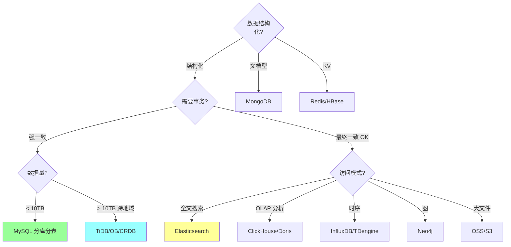

# MySQL 设计边界与取舍

> 资深面试的"反问题"：**MySQL 什么时候不该用？** 能讲清边界的人，才是真懂 MySQL 的人。
>
> 本篇聚焦设计取舍：MySQL 的能力边界、与其他存储的职责区分、危险选型、"为什么不该 MySQL 一把梭"。
>
> 与 [04-redis/19-redis-design-tradeoffs.md](../04-redis/19-redis-design-tradeoffs.md) 对偶。

---

## 一、为什么这篇很重要

```
初级:  能讲 MySQL 能干什么
中级:  能讲 MySQL 怎么调优
资深:  能讲 MySQL 什么时候不该用 / 什么时候换

设计题本质是取舍：
  - 数据量 / 访问模式 / 一致性 / 成本 / 团队能力
  - 没有最好的存储，只有最合适的
```

**一句话**：MySQL 是**OLTP 事务 DB 的标准答案**，但不是**全文搜索、时序、图、列存分析、海量 KV、超高并发写**的正确选择。

---

## 二、MySQL 适合做什么

### 2.1 真正的强项

| 场景 | 为什么适合 |
| --- | --- |
| **OLTP 事务** | ACID 完整 / InnoDB 行锁 / MVCC |
| **单表千万级内查询** | B+ 树 3-4 层稳定 < 10ms |
| **强一致事务** | redo/undo/binlog 2PC 保证 |
| **结构化数据** | schema / 外键 / 约束 |
| **复杂查询** | SQL 优化器 + 索引 + JOIN |
| **中等规模数据仓** | 配合分区 / 归档 |
| **主从读扩展** | 5-10 从库分担读 |
| **数据持久化 source of truth** | 真正的"真相" |
| **业务建模** | 关系型表达业务最自然 |

### 2.2 共同特征

```
✓ 数据有 schema
✓ 业务需要事务 / 强一致
✓ 单表 < 5000万行 / 单库 < 500GB
✓ 中等 QPS（< 5000 单库）
✓ 复杂查询 / 统计分析不密集
✓ 团队熟悉 SQL
```

---

## 三、MySQL 不适合做什么

### 3.1 绝对禁区

| 场景 | 为什么不适合 | 用什么 |
| --- | --- | --- |
| **全文搜索（LIKE / 中文分词）** | LIKE 全表扫 / 无分词 / 无评分 | Elasticsearch / Solr |
| **时序数据（监控 / IoT）** | 无专门压缩 / 聚合 / 降采样 | InfluxDB / TDengine / Prometheus |
| **列式 OLAP 分析** | 行存不适合聚合 / 无向量化 | ClickHouse / Doris / StarRocks |
| **图查询（社交 / 推荐路径）** | JOIN 深度受限 / 无图算法 | Neo4j / NebulaGraph |
| **海量 KV（TB+）** | 内存 buffer 装不下索引 | Redis / HBase / TiKV |
| **高写入 IoT 日志** | InnoDB 写放大 | InfluxDB / Cassandra / Kafka |
| **大文件 / BLOB** | 行锁 + 备份成本爆炸 | OSS / S3 / HDFS |
| **地理空间复杂查询** | MySQL GIS 弱 | PostGIS / Elasticsearch |
| **高频缓存** | 磁盘 vs 内存差 100x | Redis / 本地缓存 |

### 3.2 灰色地带

```
数据量 5000w-1 亿单表:
  单库 MySQL 能撑，但慢查询风险大
  → 优先拆分表 / 按时间分区

单库 QPS > 1w:
  MySQL 单库吃力
  → 读写分离 + 分库分表 或 TiDB

强一致分布式事务:
  MySQL XA 能做，但性能差
  → TCC / Saga / 事务消息 组合方案

复杂报表:
  MySQL 能跑，但影响 OLTP
  → binlog → 数仓（ClickHouse / Hive）
```

---

## 四、MySQL vs 其他存储

### 4.1 MySQL vs PostgreSQL

```
相同: 都是成熟 OLTP 关系型数据库
不同:

MySQL 强项:
  ✓ 互联网生态（云厂商 / 运维工具 / 教程）
  ✓ 主从复制成熟
  ✓ 性能稳定（默认配置）
  ✓ MySQL Cluster / Vitess

PostgreSQL 强项:
  ✓ SQL 标准更严 / 功能更丰富
  ✓ JSON 支持强（JSONB + GIN 索引）
  ✓ 窗口函数 / CTE 更完善
  ✓ PostGIS 地理空间无敌
  ✓ 扩展生态强（TimescaleDB 等）
  ✓ 并发 MVCC 无 undo 膨胀

选择:
  互联网 OLTP → MySQL（生态成熟）
  复杂业务 / GIS / JSON 重 → PostgreSQL
  云上托管 → 都行（RDS 都支持）
```

### 4.2 MySQL vs TiDB / OceanBase / CockroachDB

```
MySQL:
  - 单机强 / 分库分表 + 中间件扩展
  - 成熟 / 生态广
  - 扩容手工

TiDB (PingCAP):
  - 兼容 MySQL 协议
  - 自动分片 + 强一致（Raft）
  - HTAP（TiKV + TiFlash）
  - 运维复杂 / 对大小事务都有影响

OceanBase (阿里):
  - 兼容 MySQL / Oracle
  - 强一致 + 高可用（Paxos）
  - 金融级（蚂蚁内部大规模使用）
  - 商业授权 / 外部用得少

CockroachDB:
  - 兼容 PostgreSQL
  - 跨地域强一致（Raft + 时钟同步）
  - 适合全球业务

何时切换:
  - 数据量 > 10TB 单库不行 → 分库分表 or NewSQL
  - 跨地域强一致 → CockroachDB / Spanner
  - 分库分表运维受不了 → TiDB
  - 金融级 + 国产化 → OceanBase

陷阱:
  盲目迁移 NewSQL:
    - 性能 P99 可能不如 MySQL
    - 小事务延迟高（几十 ms vs MySQL < 10ms）
    - 运维学习成本高
    - 生态不如 MySQL
```

### 4.3 MySQL vs Redis

详见 [04-redis/19-redis-design-tradeoffs.md](../04-redis/19-redis-design-tradeoffs.md) 第 4.1 节。

```
MySQL: 业务数据真相（source of truth）
Redis: 加速 MySQL 读取（性能层）

永远是: 先写 MySQL 再删 Redis
永远不是: Redis 替代 MySQL
```

### 4.4 MySQL vs MongoDB

```
MySQL:
  ✓ 强一致事务
  ✓ JOIN / 复杂查询
  ✓ 成熟运维

MongoDB:
  ✓ Schema-less（字段灵活）
  ✓ 嵌套文档（一对多嵌套存）
  ✓ 分片天然（自动 sharding）
  ✗ 事务 4.0 前单文档 / 4.0+ 跨文档但性能差
  ✗ JOIN 弱（lookup 性能差）

选择:
  结构化 + 事务 → MySQL
  文档型 / 字段灵活 / 弱事务 → MongoDB
  日志 / CMS / IoT 数据 → MongoDB
```

### 4.5 MySQL vs ES

```
MySQL:
  ✓ 精确查询（WHERE id = 1）
  ✗ 全文 / 模糊 / 多维聚合

ES:
  ✓ 全文搜索 / 分词 / 评分
  ✓ 聚合（terms / histogram）
  ✓ 水平扩展
  ✗ 不是事务 DB / 实时性有延迟
  ✗ JOIN 弱

实战组合:
  MySQL 主存 + ES 检索:
    MySQL → binlog → Canal / DTS → ES
    查询: 关键字走 ES，详情查 MySQL
```

### 4.6 MySQL vs ClickHouse / Doris

```
MySQL:
  ✓ OLTP（事务 / 点查）
  ✗ OLAP 大聚合慢

ClickHouse:
  ✓ 列存 / 向量化 / 压缩
  ✓ 十亿行聚合秒级
  ✗ 不支持事务 / 单行更新差
  ✗ JOIN 弱 / 不适合实时更新

典型架构:
  业务库 MySQL + 分析库 ClickHouse
  实时同步（Canal / Flink CDC）
```

### 4.7 MySQL vs HBase / Cassandra

```
MySQL:
  ✓ 事务 / SQL / JOIN
  ✗ TB+ 数据 / 单机瓶颈

HBase (Hadoop 生态):
  ✓ PB 级 / 线性扩展
  ✓ 强一致（行级）
  ✗ 只 KV / 无二级索引
  ✗ 运维重（依赖 ZK / HDFS）

Cassandra:
  ✓ 跨地域多主
  ✓ 高写入
  ✗ 最终一致 / 读需要权衡
  ✗ 无 JOIN / 设计要反范式化

选择:
  传统 OLTP → MySQL
  超大 KV + 扫描 → HBase
  全球多活 + 高写 → Cassandra
```

### 4.8 完整选型对照表

| 需求 | 首选 | 备选 | 不选 |
| --- | --- | --- | --- |
| 订单 / 支付 / 用户表 | MySQL | PostgreSQL | MongoDB |
| 商品搜索 | ES | MySQL + 全文索引 | MySQL LIKE |
| 日志 / IoT | ClickHouse / InfluxDB | Cassandra | MySQL |
| 图 / 社交关系 | Neo4j | NebulaGraph | MySQL |
| 报表分析 | ClickHouse / Doris | Hive | MySQL |
| 缓存 | Redis | 本地缓存 | MySQL |
| KV 海量 | HBase / TiKV | Redis Cluster | MySQL |
| 全球分布式 | CockroachDB / Spanner | TiDB | MySQL |
| 简单配置存储 | etcd / Redis | MySQL | MongoDB |

---

## 五、单库 MySQL 的容量边界

### 5.1 单表容量红线

```
行数:
  < 500w:    性能无忧
  500w-1000w: 大部分场景 OK
  1000w-5000w: 索引设计重要 / 部分查询可能慢
  5000w-1 亿:  必须精细优化 / 考虑拆分
  > 1 亿:    必须拆分

磁盘:
  < 50GB:  无忧
  50-200GB: 备份时间长
  > 200GB:  必须考虑拆分 / 归档
  > 500GB:  强制拆分

物理行大小:
  单行 < 8KB 最佳（InnoDB 默认页 16KB）
  大 BLOB 单独存 OSS
```

### 5.2 单库容量红线

```
连接数:
  max_connections 默认 151
  生产 500-2000
  > 5000 要特别注意

QPS:
  读: 单机 1-2 万
  写: 单机 2-5 千
  超过 → 读写分离 / 分库

数据量:
  < 200GB:   无忧
  200GB-1TB: 备份 / 迁移要周期性规划
  > 1TB:    建议拆库
  > 5TB:    必须拆 / NewSQL

CPU / 内存 / IO:
  CPU 使用率 > 70% → 优化慢 SQL / 扩容
  innodb_buffer_pool_size 命中率 > 99%
  IO wait > 20% → 磁盘瓶颈
```

### 5.3 何时分库分表

详见 [12-sharding.md](12-sharding.md) 和 [20-mysql-senior-answers.md 第十节](20-mysql-senior-answers.md)。

```
触发条件:
  - 单表 > 1000w 且查询慢
  - 单库 > 500GB 备份困难
  - 单库 QPS > 5000 读写分离撑不住
  - 单库写入 TPS > 2000

优先级:
  1. 优化 SQL / 索引（可能解决 80%）
  2. 读写分离（解决读多场景）
  3. 归档历史数据（冷热分层）
  4. 垂直拆分（按业务拆库）
  5. 水平拆分（分库分表）
  6. 上 NewSQL（5 步都不够再考虑）
```

---

## 六、为什么 MySQL 不该"一把梭"

### 6.1 滥用 MySQL 的典型代价

```
案例 1: 用 MySQL 做全文搜索
  SELECT * FROM products WHERE name LIKE '%手机%'
  → 全表扫 / 性能差 / 无分词 / 无排序
  → 用 ES

案例 2: 用 MySQL 做时序监控
  每秒写 1 万条监控数据
  → 写入瓶颈 / 表爆炸 / 查询慢
  → 用 Prometheus / InfluxDB

案例 3: 用 MySQL 做缓存
  每次查都走 DB / P99 50ms
  → 用 Redis 降到 1ms

案例 4: 用 MySQL 存大文件
  存 10MB 图片在 BLOB
  → 备份慢 / 网络传输慢 / 行锁重
  → 用 OSS + MySQL 存 URL

案例 5: 用 MySQL 做消息队列
  表 + 状态字段 + 定时扫
  → 扫描慢 / 锁冲突 / 可靠性差
  → 用 Kafka / RocketMQ

案例 6: 用 MySQL 做 OLAP
  每小时跑聚合 SQL
  → 影响 OLTP / 锁 / 性能抖动
  → binlog → ClickHouse 离线
```

### 6.2 好的系统 = 组合

```
订单系统:
  MySQL     主数据（订单 / 用户 / 商品）
  Redis     缓存 + 限流 + 分布式锁
  ES        搜索 / 筛选
  Kafka     异步通知 / 事件驱动
  ClickHouse 报表分析
  OSS       图片 / 附件

各司其职，不是 MySQL 一把梭
```

---

## 七、最危险的设计反模式

### 反模式 1：OLTP + OLAP 同库

```
❌
  MySQL 主库既跑业务又跑报表
  → 一个大聚合 SQL 打挂主库

✓
  binlog → ClickHouse / 数仓
  OLTP OLAP 分离
```

### 反模式 2：把 MySQL 当 KV 用

```
❌
  只用主键查询，表设计就两列
  → 行存开销大 / 锁粒度粗
  → 数据量一大就瓶颈

✓
  海量 KV → Redis / HBase / TiKV
  确实要存 MySQL → 评估是否合适
```

### 反模式 3：字段 NULL 泛滥

```
❌
  大多字段可 NULL
  → 索引失效 / Go scan 出错 / COUNT 跳行

✓
  NOT NULL DEFAULT ''/0
  真需要 NULL 才用
```

### 反模式 4：超宽表

```
❌
  user 表 200+ 字段
  → 行大 / Buffer Pool 效率低 / 备份慢

✓
  拆基础表 + 扩展表（按字段冷热）
```

### 反模式 5：大 VARCHAR

```
❌
  varchar(4000) 到处用
  → 行溢出 / 磁盘 IO 高

✓
  按实际长度定义 / 超长走 TEXT 单独存 / 图片走 OSS
```

### 反模式 6：外键约束滥用

```
❌
  所有关联表都加外键
  → 写性能差 / 分库分表后失效 / 不能水平扩展

✓
  应用层维护关系
  MySQL 外键关闭（互联网标准做法）
```

### 反模式 7：大事务

```
❌
  tx.Begin()
  循环 10w 次 INSERT
  tx.Commit()
  → undo 爆 / 主从延迟 / 锁持有久

✓
  拆批（每批 500-1000）
  循环短事务
```

### 反模式 8：索引过多

```
❌
  每个查询加一个索引 → 10+ 索引
  → 写性能下降 / 存储翻倍 / Buffer Pool 浪费

✓
  联合索引 + 覆盖索引设计
  通常 3-5 个索引够用
```

### 反模式 9：SELECT * 到处用

```
❌
  SELECT * FROM users WHERE id = ?
  → 字段多 / 大 BLOB / 覆盖索引失效

✓
  显式字段
  只查需要的列
```

### 反模式 10：DB 做业务计算

```
❌
  SUM(CASE WHEN ... THEN ...)  复杂嵌套
  → 数据库 CPU 打满 / 水平扩展难

✓
  DB 负责存取，计算在应用层或数仓
```

---

## 八、RR 默认是"对"的选择吗

### 8.1 历史包袱

```
MySQL 默认 RR（Repeatable Read）是历史原因:
  - binlog STATEMENT 格式需要 RR（防主从不一致）
  - 老应用兼容

但业内大多数互联网业务用 RC（Read Committed）:
  ✓ 锁范围小（无间隙锁）
  ✓ 死锁少
  ✓ 大事务影响小
  ✓ 主从延迟小
```

### 8.2 RR vs RC 选型

```
继续用 RR:
  - 业务依赖事务内一致快照
  - 严格防幻读
  - 金融严格一致

换 RC:
  - 互联网高并发
  - 死锁痛
  - 主从延迟痛
  - binlog 用 ROW 格式（不依赖 RR 保一致）

切换代价:
  - 需要全面评估业务是否依赖 RR 特性
  - 灰度验证
  - 大部分业务换 RC 无影响
```

---

## 九、决策树



---

## 十、面试表达模板

### 10.1 "你们为什么用 MySQL"

```
MySQL 在我们系统里承担三个角色：

1. 业务核心数据
   - 订单 / 支付 / 用户 / 商品 主表
   - 事务 + 强一致
   - 所有业务真相来源

2. 中等规模查询
   - 单表 2000w 内稳定 < 10ms
   - 配合索引 + 覆盖索引
   - 读写分离扩展读

3. 数据流源头
   - binlog → 数仓 / ES / Redis
   - 事件驱动架构的起点

但我们也清楚边界：
  - 搜索走 ES
  - 缓存走 Redis
  - 分析走 ClickHouse
  - 消息走 Kafka
  - 大文件走 OSS

MySQL 是"OLTP 标准答案"，不是"所有数据的答案"。
```

### 10.2 "MySQL 不行怎么办"

```
分情况:

单表过大 → 读写分离 + 分库分表
  (能撑到 5-10TB)

复杂查询慢 → 写到 ES / ClickHouse
  (离线分析)

高并发写 → 异步化 + MQ 削峰
  (先入 MQ 再落 DB)

超大规模 → TiDB / OceanBase
  (> 10TB 跨地域强一致)

关键是：业务驱动 + 分阶段演进
不要一上来就 TiDB，先把 MySQL 压榨到极限
```

---

## 十一、面试加分点

- **MySQL 擅长 OLTP，不擅长 OLAP / 全文 / 时序 / 图 / 海量 KV**
- **各种场景的替代方案** 能对得上号
- **单表 1000w / 单库 500GB 是关注线**
- **RR vs RC 选型**（互联网多数用 RC）
- **MySQL 外键关闭** 是互联网标准
- **binlog → ES / 数仓 / Redis** 数据流架构
- **OLTP + OLAP 一定要分离**
- **不盲目上 TiDB / NewSQL**
- **10 大反模式**（SELECT * / NULL / 大事务 / 外键 / 宽表...）
- **业务驱动 + 分阶段演进**

---

## 十二、口袋速查表

```
❓ 要不要用 MySQL？

YES:
  □ 结构化数据
  □ 事务 / 强一致
  □ 单库 < 5TB
  □ 单表 < 5000w
  □ 中等 QPS
  □ 复杂查询 / JOIN
  □ 团队熟

NO（用替代）:
  □ 全文搜索 → Elasticsearch
  □ 时序 → InfluxDB / TDengine
  □ OLAP 分析 → ClickHouse / Doris
  □ 图 → Neo4j / NebulaGraph
  □ 海量 KV → HBase / TiKV
  □ 大文件 → OSS / S3
  □ 缓存 → Redis
  □ 消息 → Kafka / RocketMQ
  □ 跨地域强一致 → CockroachDB / Spanner
  □ > 10TB 单库 → TiDB / OceanBase

配合（强烈推荐）:
  MySQL + Redis    (Cache-Aside)
  MySQL + ES       (Canal 同步)
  MySQL + ClickHouse (binlog → 数仓)
  MySQL + Kafka    (事件驱动)
  MySQL + OSS      (大文件分离)
```

---

## 十三、关联阅读

```
本目录:
- 01-architecture.md         架构原理（优势）
- 08-comparison.md           引擎对比
- 12-sharding.md             分库分表
- 19-storage-comparison.md   存储对比
- 20-mysql-senior-answers.md 资深答题

跨模块:
- 04-redis/19-redis-design-tradeoffs.md  Redis 边界（对偶）
- 05-message-queue/00-mq-map.md          MQ 边界
- 06-distributed/11-newsql-tcc-frameworks.md NewSQL / TCC
```
