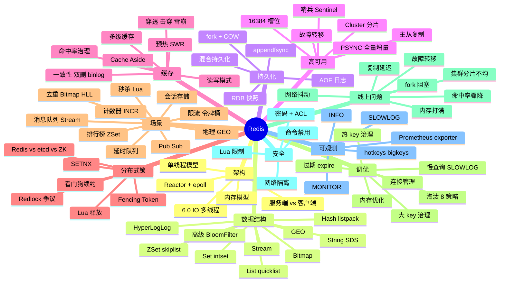
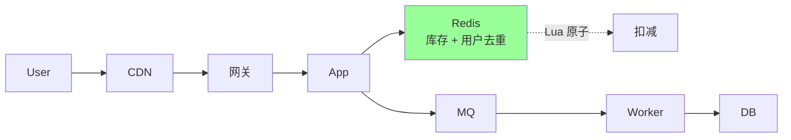
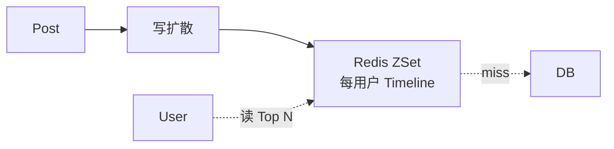
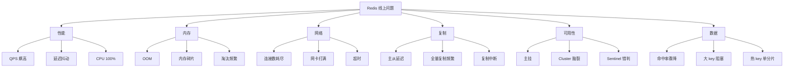
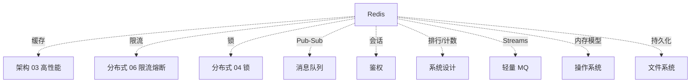

# Redis 知识地图

> 后端面试里 Redis 不只是"快的 KV"。它解释**性能、一致性、并发、分布式协调、系统设计**多个维度。
>
> 这份地图是 04-redis 目录的总览：知识树 / 题型分类 / 学习路径 / 系统设计中的角色 / 排查地图 / 答题方式

---

## 一、整体知识树



---

## 二、后端视角的 Redis

| Redis 能力 | 后端解决的问题 |
| --- | --- |
| 内存 KV + 单线程 | 高 QPS（10 万级单机） |
| 多种数据结构 | 排行榜 / 计数 / 限流 / 队列 / 去重 一站式 |
| AOF / RDB | 持久化 + 重启恢复 |
| 主从 + 哨兵 / Cluster | 高可用 + 分片扩容 |
| 缓存模式 | 减 DB 压力（穿透/击穿/雪崩） |
| Lua 脚本 | 原子性（防超卖 / 限流） |
| 分布式锁 | 跨进程协调 |
| Pub/Sub / Stream | 消息广播 / 队列 |
| Pipeline / 批量 | 减 RTT，吞吐倍增 |
| Geo / Bitmap / HLL | 特殊场景一行解决 |
| TTL + 淘汰 | 自动管理热数据 |
| Cluster 分片 | 水平扩容到 TB 级 |
| 监控指标 | INFO / SLOWLOG / hotkeys / bigkeys |

---

## 三、能力分层（资深 Go 后端）

```text
L1 概念
  数据结构、命令、TTL、持久化、主从、哨兵

L2 机制
  SDS / listpack / skiplist 实现
  RDB fork + COW
  AOF rewrite
  PSYNC 全量+增量
  Cluster 16384 槽位
  Lua 原子性

L3 缓存模式
  Cache Aside / Read-Through / Write-Through / Write-Behind / SWR
  穿透 / 击穿 / 雪崩 三大问题
  双删 / binlog 订阅 / 多级缓存

L4 分布式锁与协调
  SETNX + Lua + 看门狗
  Redlock 争议（Martin Kleppmann）
  Fencing Token
  Redis vs etcd vs ZK 选型

L5 线上问题
  大 key / 热 key / 慢查询 / fork 抖动 / 内存打满 / 复制延迟 / 命中率骤降

L6 系统设计中的 Redis
  秒杀 / 排行榜 / 限流 / Feed / 推送 / 计数 / 去重 / Geo

L7 治理
  过期淘汰策略 / 监控告警 / 容量规划 / 集群运维 / 安全
```

**晋升判断**：能从 L1 → L7 级级答出来，就到资深。


---

## 四、题型分类

### 4.1 基础题（P5 / 入门）

```
□ Redis 是什么？为什么快？
□ 5 种数据结构 + 命令
□ TTL / 过期
□ 主从复制
□ 持久化 RDB vs AOF
```

对应：[01-architecture](01-architecture.md) / [02-data-structures](02-data-structures.md) / [03-persistence](03-persistence.md) / [04-replication-cluster](04-replication-cluster.md)

### 4.2 中级题（P6）

```
□ 单线程模型 + 6.0 多线程
□ 哨兵 vs Cluster
□ Cluster 16384 槽位为什么
□ 缓存读写模式（5 种）
□ 缓存穿透 / 击穿 / 雪崩
□ 分布式锁（SETNX + Lua）
□ 看门狗续约
□ 大 key / 热 key
□ 慢查询排查
□ 排行榜 / 计数 / 限流 实现
```

对应：[01](01-architecture.md) / [04](04-replication-cluster.md) / [05](05-cache-patterns.md) / [06](06-distributed-lock.md) / [07](07-pitfalls-tuning.md) / [08](08-scenarios.md)

### 4.3 资深题（P7+）

```
□ SDS / listpack / skiplist 内部实现
□ Cluster 数据迁移 + 重新平衡
□ 缓存一致性方案对比（双删 vs binlog vs 强一致）
□ 多级缓存设计 + 本地缓存（Ristretto / BigCache）
□ Redlock 安全性争议（Martin Kleppmann 反驳）
□ Fencing Token 的必要性
□ 三方分布式锁对比（Redis vs etcd vs ZK）
□ 大 key / 热 key 自动治理
□ 内存碎片 + jemalloc
□ fork + COW 阻塞 + huge page
□ 复制延迟优化（diskless / 多线程同步）
□ 大促容量规划
□ 跨地域容灾
```

对应：[02](02-data-structures.md) / [04](04-replication-cluster.md) / [06](06-distributed-lock.md) / [07](07-pitfalls-tuning.md) / [10](10-cache-consistency-design.md) / [11](11-multi-tier-cache.md) / [../06-distributed/04-lock](../06-distributed/04-lock.md)

### 4.4 综合场景题（P7-P8）

```
□ 设计一个秒杀系统（Redis 怎么用）
□ 设计排行榜（实时 + 历史）
□ 限流系统（多机一致）
□ 双 11 大促 Redis 怎么准备
□ 缓存 + DB 一致性整体方案
□ 跨地域多活 Redis 怎么搞
```

对应：[08-scenarios](08-scenarios.md) / [../10-system-design/03-seckill-system](../10-system-design/03-seckill-system.md) / [../10-system-design/16-high-concurrency-scenarios](../10-system-design/16-high-concurrency-scenarios.md)

### 4.5 线上排查题

```
□ Redis QPS 飙到 100 万怎么排查？
□ 缓存命中率从 95% 骤降到 40% 怎么定位？
□ 单分片 CPU 100% 怎么办？
□ 主从延迟越来越大怎么办？
□ 内存用完不释放怎么办？
□ 大促 Redis OOM 怎么应急？
```

对应：[09-production-cases](09-production-cases.md) / [07-pitfalls-tuning](07-pitfalls-tuning.md)

---

## 五、目录文件全览

| # | 文件 | 行数 | 重点 |
| --- | --- | --- | --- |
| 01 | [architecture](01-architecture.md) | 433 | 单线程 / Reactor / 6.0 多线程 / 内存模型 |
| 02 | [data-structures](02-data-structures.md) | 477 | SDS / listpack / quicklist / skiplist / hashtable |
| 03 | [persistence](03-persistence.md) | 459 | RDB / AOF / fork+COW / 混合持久化 |
| 04 | [replication-cluster](04-replication-cluster.md) | 595 | 主从 / 哨兵 / Cluster / 故障转移 |
| 05 | [cache-patterns](05-cache-patterns.md) | 578 | 5 种读写模式 + 三大问题 + 一致性 + TTL + 多级 |
| 06 | [distributed-lock](06-distributed-lock.md) | 517 | SETNX / Lua / 看门狗 / Redlock / 可重入 |
| 07 | [pitfalls-tuning](07-pitfalls-tuning.md) | 654 | 过期 / 淘汰 / 大 key / 热 key / 慢查询 / 监控 |
| 08 | [scenarios](08-scenarios.md) | 696 | 11 大场景：排行 / 计数 / 限流 / 队列 / 秒杀 / Geo |
| 09 | [production-cases](09-production-cases.md) | 258 | 6 个生产事故案例 |
| 10 | [cache-consistency-design](10-cache-consistency-design.md) | 230 | 缓存一致性深度专题 |
| 11 | [multi-tier-cache](11-multi-tier-cache.md) | 824 | 多级缓存 + Go 本地缓存全栈对比 |

总 5762 行（不含本 map）。

---

## 六、Redis 在系统设计中的角色

资深面试常被追问"X 系统里你怎么用 Redis"。下面是经典系统中 Redis 的位置：

### 6.1 秒杀



Redis 角色：**核心防超卖**（Lua 扣减 + Set 去重）。

### 6.2 Feed 流



Redis 角色：**Timeline ZSet**（按时间戳排序）。

### 6.3 排行榜

```
KEY: rank:daily:2026-05-09
TYPE: ZSet
ZADD rank uid score
ZREVRANGE rank 0 99 WITHSCORES   # Top 100
```

Redis 角色：**核心存储**（实时排序）。

### 6.4 限流

```
方案 1: Redis INCR + EXPIRE（固定窗口）
方案 2: Redis ZSet（滑动窗口）
方案 3: Redis Lua + 时间戳（令牌桶）
方案 4: Redis-Cell 模块（CL.THROTTLE）
```

Redis 角色：**分布式限流核心**。

### 6.5 推送 / IM

```
- 在线状态: Redis Hash / Set
- 未读数: Redis INCR
- 实时消息: Redis Stream / Pub-Sub
- 离线消息: Redis List
```

### 6.6 计数器

```
点赞 / 浏览 / 评论:
  Redis INCR / HINCRBY
  + 异步落 DB
  + Bitmap / HLL 大数据量
```

### 6.7 会话存储

```
JWT 无状态（不需要 Redis）
有状态 Session: SET sessionid {data} EX 1800
```

### 6.8 防重 / 去重

```
- Set 精确（小数据）
- Bitmap（user_id 紧凑）
- HyperLogLog（亿级 12KB）
- Bloom Filter（亿级 100MB，假阳性）
```

### 6.9 分布式锁

```
SET key value NX PX 10000
+ Lua 释放
+ Redisson 看门狗
+ 关键链路加 Fencing Token
```

### 6.10 缓存（最常见）

```
本地缓存 + Redis + DB 多级
Cache-Aside 标准模式
TTL 随机化防雪崩
```

详见 [08-scenarios](08-scenarios.md)、[../10-system-design/16-high-concurrency-scenarios](../10-system-design/16-high-concurrency-scenarios.md)。

---

## 七、线上问题分类地图



### 7.1 排查工具

```bash
# 慢查询
SLOWLOG GET 100
SLOWLOG RESET

# 大 key
redis-cli --bigkeys
redis-cli --memkeys

# 热 key（4.0+，需 LFU）
redis-cli --hotkeys

# 实时监控（生产慎用）
MONITOR

# 全局指标
INFO ALL
INFO clients
INFO memory
INFO replication
INFO stats

# 延迟历史
redis-cli --latency
redis-cli --latency-history
redis-cli --latency-dist

# 客户端列表
CLIENT LIST

# 排队检查
INFO clients      # blocked_clients
```

### 7.2 排查路径

```
症状（哪个指标异常）
  ↓
分类（性能/内存/网络/复制）
  ↓
工具（INFO / SLOWLOG / hotkeys）
  ↓
证据（哪些 key / 哪些命令）
  ↓
止血（限流 / 切流 / 重启）
  ↓
根因（业务原因）
  ↓
修复（治理 / 改 SQL / 加索引 / 拆 key）
  ↓
复盘（防再发）
```

详见 [09-production-cases](09-production-cases.md)。

---

## 八、学习路径推荐

### 8.1 入门 → 资深

```
Week 1: 基础
  01 architecture
  02 data-structures
  03 persistence

Week 2: 高可用
  04 replication-cluster
  + 部署单机/主从/Cluster 实操

Week 3: 缓存核心
  05 cache-patterns
  10 cache-consistency-design
  11 multi-tier-cache

Week 4: 分布式锁
  06 distributed-lock
  ../06-distributed/04-lock

Week 5: 调优 + 场景
  07 pitfalls-tuning
  08 scenarios

Week 6: 实战
  09 production-cases
  ../10-system-design/16-high-concurrency-scenarios

Week 7: 综合 + 索引
  ../99-meta/redis-20
  ../99-meta/01-cross-topic-index
```

### 8.2 面试前 1 周快速过

```
1 天: 99-meta/redis-20（背诵版 + 标准答案）
1 天: 04-redis/05 缓存模式 + 10 一致性
1 天: 04-redis/06 分布式锁 + ../06-distributed/04 三方对比
1 天: 04-redis/07 调优 + 09 案例
1 天: 04-redis/08 场景
1 天: 综合场景串联（10-system-design/16）
1 天: 模拟面试
```

### 8.3 大厂特化

```
字节系（高并发）:
  重点 06-lock / 08-scenarios / 11-multi-tier-cache
  + 自己跑一下 Lua 脚本压测

阿里系（中台）:
  重点 04-cluster / 10-consistency / 多活 Redis
  + Tair（阿里自研 Redis）了解

美团 / 拼多多（电商）:
  重点 08-scenarios（秒杀/限流/排行）/ 10-consistency
  + 双 11 容量规划

金融 / 银行（强一致）:
  重点 06-lock 但要质疑 Redis 强一致
  + 推荐用 etcd / ZK 替代
```

---

## 九、答题模板

### 9.1 概念题（"Redis 为什么快"）

```
3 步:
1. 定义: Redis 是基于内存的 KV 数据库
2. 原因（多个）:
   - 内存操作（vs 磁盘 100x）
   - 单线程（避免锁 + 上下文切换）
   - 多路复用（Reactor + epoll）
   - 高效数据结构（SDS / listpack / skiplist）
   - C 语言 + 紧凑布局
3. 代价 / 边界:
   - 单线程瓶颈在 IO（不在 CPU）
   - 6.0 引入 IO 多线程（仅读写 socket）
   - 命令执行仍单线程，保证无锁
```

### 9.2 设计题（"用 Redis 实现限流"）

```
4 步:
1. 需求: 单接口 100 QPS / 跨多机
2. 算法: 固定窗口 / 滑动窗口 / 令牌桶 / 漏桶
3. 实现:
   - Lua 原子操作（防并发）
   - Hash Tag 让 key 同 slot
   - 配 Redis-Cell 模块（生产推荐）
4. 取舍:
   - 单机 vs 集群
   - 精度 vs 性能
   - 故障降级（Redis 挂了限流策略）
```

### 9.3 排查题（"缓存命中率从 95% 骤降到 40%"）

```
4 步:
1. 现象: 命中率骤降，回源 QPS 上升 5x
2. 排查路径:
   - 看时间点（发版前后）
   - 看影响范围（全局 vs 单 URL）
   - 查最近变更（缓存键 / TTL / Vary）
3. 工具:
   - INFO stats（hits/misses）
   - SLOWLOG（慢查询）
   - 监控按 URL 看分布
4. 解决:
   - 缓存键归一化（去随机参数）
   - 延长 TTL
   - 立即预热热点
```

### 9.4 取舍题（"分布式锁选 Redis 还是 etcd"）

```
3 步:
1. 业务对一致性的要求:
   - 偶发不一致可接受 → Redis
   - 强一致需求 → etcd / ZK
2. 现有基础设施:
   - 已有 Redis → 优先 Redis
   - 已有 etcd（K8s）→ etcd
3. 实战兜底:
   - 业务幂等 + Fencing Token
   - 不要纯依赖锁的正确性
```

---

## 十、面试表达

```text
Redis 面试题不是孤立的命令记忆，而是后端性能 / 缓存 / 协调 / 系统设计 的核心组件。

我把 Redis 知识分成 7 层：
- L1 概念（数据结构 / 命令）
- L2 机制（SDS / RDB / Cluster 槽位）
- L3 缓存模式（Cache-Aside / 三大问题 / 一致性）
- L4 分布式协调（锁 / 限流 / Pub-Sub）
- L5 线上问题（大 key / 热 key / 慢查询 / 内存）
- L6 系统设计（秒杀 / 排行 / 限流）
- L7 治理（监控 / 容量 / 安全）

回答时我会优先讲机制 + 代价 + 边界，再结合实战场景。
线上问题题，我会按"现象 → 分类 → 工具 → 证据 → 止血 → 根因 → 修复 → 复盘"流程走。
设计题，我会先确认需求，再给方案，最后讲取舍和演进路径。
```

---

## 十一、常见疑问与误区

### 误区 1：Redis 单线程 = 慢

错。瓶颈在 IO 不在 CPU。10 万 QPS 单核足够。

### 误区 2：Cache-Aside 是先删缓存再改 DB

错。应该是**先改 DB，再删缓存**（详见 [10-cache-consistency-design](10-cache-consistency-design.md)）。

### 误区 3：Redlock 完全安全

错。Martin Kleppmann 论证有理论缺陷（详见 [06-distributed-lock](06-distributed-lock.md) + [../06-distributed/04-lock](../06-distributed/04-lock.md)）。

### 误区 4：所有热点都用本地缓存

错。本地缓存有跨实例不一致问题，TTL 短才安全。详见 [11-multi-tier-cache](11-multi-tier-cache.md)。

### 误区 5：sync.Map 等于 Redis 替代

错。sync.Map 是进程内 + 易 GC，远不能替代 Redis。详见 [11-multi-tier-cache](11-multi-tier-cache.md)。

### 误区 6：Redis Cluster 用于强一致

错。Cluster 是 AP（分区时可能丢数据）。强一致用 etcd / ZK。

### 误区 7：缓存挂了业务就挂

错。缓存是性能优化，**业务必须有 fallback**（限流 + DB 直读 + 降级）。

---

## 十二、Redis 与其他模块的关系



跨模块查找：[../99-meta/01-cross-topic-index#一-缓存专题](../99-meta/01-cross-topic-index.md)

---

## 十三、面试加分点

- 能从 **L1（命令）→ L7（治理）** 7 层级级答出
- 知道 **Redis 单线程瓶颈在 IO 不在 CPU**
- **Cache-Aside 先改 DB 再删缓存**（很多人答反）
- 缓存三大问题**每个都给 2-3 种解法**
- **Redlock 安全争议**（Martin Kleppmann 论证）
- **多级缓存 + 本地缓存**（Ristretto / BigCache）
- **Cluster 16384 槽位** 的原因（心跳包大小）
- **大 key UNLINK 异步删**（替代 DEL）
- **热点检测 + 自动迁移本地**
- **fork + COW 阻塞** + huge page 关闭
- **Redis vs etcd vs ZK 锁对比** + Fencing Token
- **生产事故 STAR + 5 Whys** 复盘
- 系统设计题能讲清 **Redis 的位置和角色**
- 不教条主义：缓存挂业务有 fallback / 强一致用 etcd

---

## 十四、推荐阅读路径（一站式）

```
入门:
  □ Redis 官方文档（5 种数据结构）
  □ 黄健宏《Redis 设计与实现》
  □ 04-redis/01-04（架构 / 数据结构 / 持久化 / 集群）

进阶:
  □ Redis Cluster spec
  □ Antirez 博客（Redis 作者）
  □ 04-redis/05-08（缓存 / 锁 / 调优 / 场景）

资深:
  □ Martin Kleppmann《How to do distributed locking》
  □ 阿里 Tair / 字节 Abase 设计
  □ 04-redis/09-11（案例 / 一致性 / 多级缓存）
  □ 99-meta/redis-20（速记题集）

实战:
  □ 自己部署主从 / 哨兵 / Cluster
  □ 跑 redis-benchmark
  □ 用 redis-cli --bigkeys / --hotkeys
  □ 模拟故障演练
```

---

## 十五、与 99-meta 的关联

```
背诵 + 速记: 99-meta/redis-20.md
跨主题索引: 99-meta/01-cross-topic-index.md（缓存专题）
综合实战:   10-system-design/16-high-concurrency-scenarios.md
```
