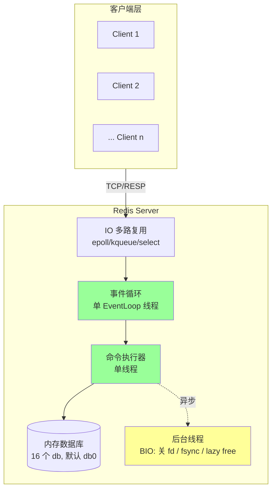
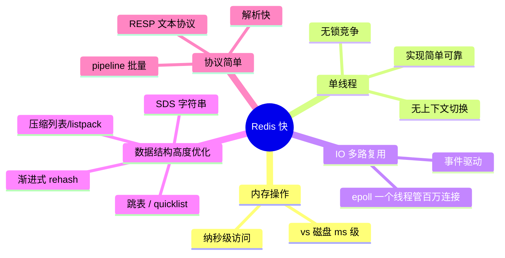
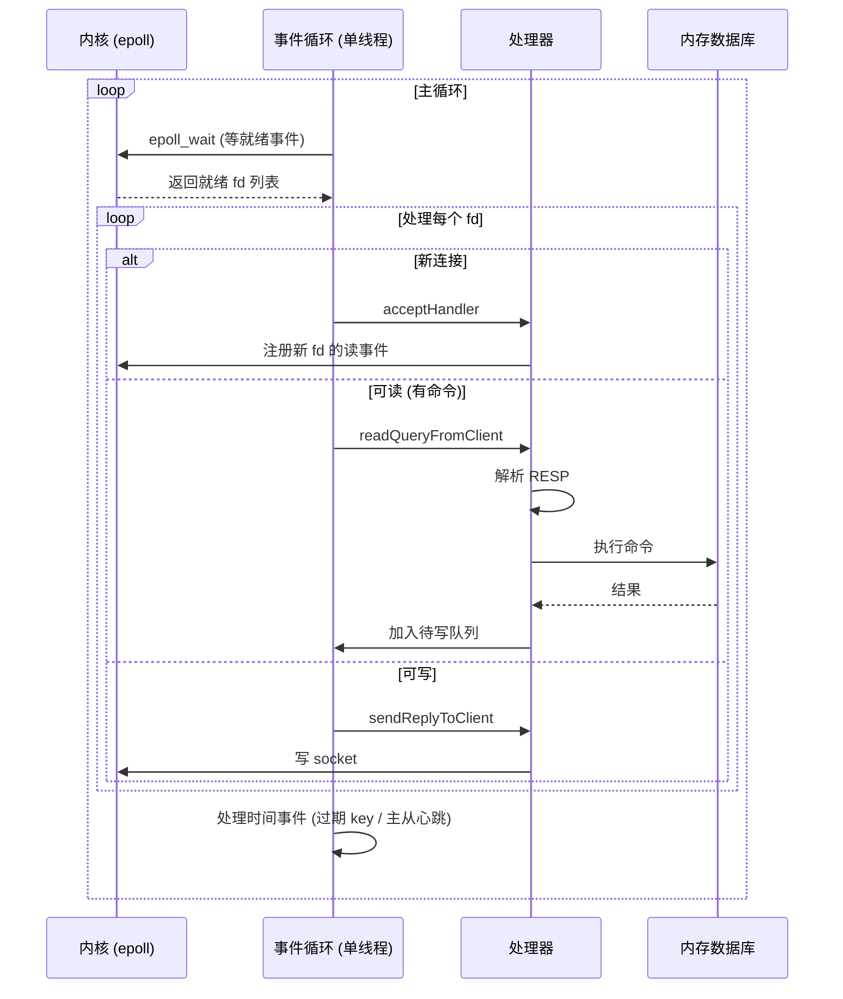
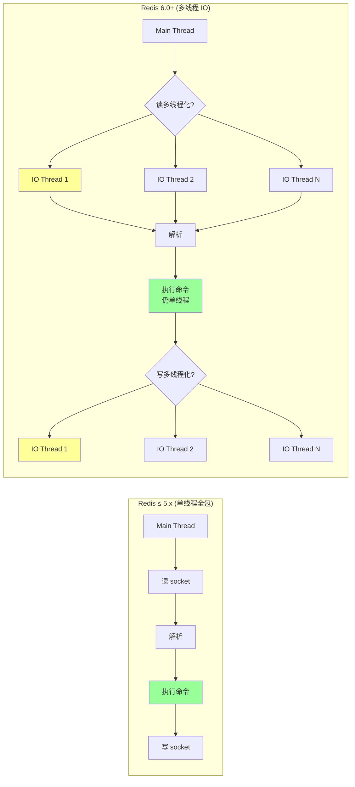
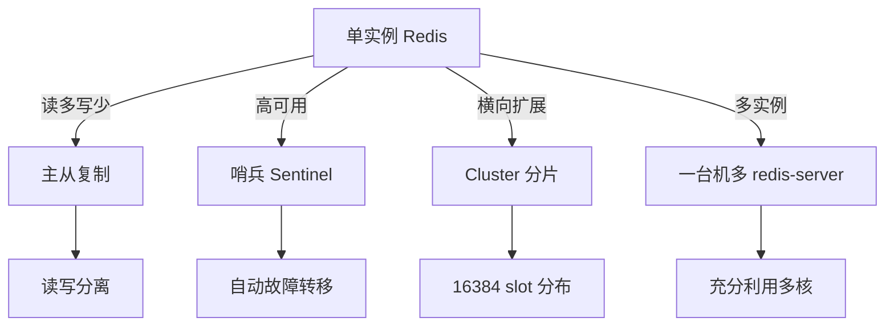

# Redis · 架构与原理

> 单线程模型 / Reactor 事件循环 / 为什么这么快 / IO 多路复用 / 6.0 多线程 IO / 内存数据库本质

## 一、整体架构



**关键事实**：
- **命令执行单线程**（避免锁，简单可靠）
- **IO 单线程**（6.0 前），**6.0+ 可启用多线程读写网络 IO**（命令执行仍单线程）
- **后台有几个 BIO 线程**做 close fd / fsync / 异步删除（lazy free）
- **数据全在内存**，磁盘只用于持久化

## 二、为什么单线程还这么快？（高频题）

### 2.1 五个核心原因



### 2.2 详细解释

**① 内存操作**：所有数据在 RAM，单次操作 ~100ns，一个 CPU 核每秒可执行 1000 万次简单命令。瓶颈基本不在 CPU，而在网络 IO。

**② 单线程避免锁**：
- 不需要锁同步 → 没有锁竞争开销
- 没有线程上下文切换（OS 切换约 1~10μs）
- 代码简单，bug 少

**③ IO 多路复用（最关键）**：
一个线程靠 `epoll` 同时管理几万到几百万 TCP 连接。**事件驱动**：哪个 socket 有数据 → 哪个被处理。

**④ 高度优化的数据结构**：每种类型针对不同场景有不同底层编码（小数据用紧凑编码，大数据用高效编码）。

**⑤ 简单的协议**：RESP（Redis Serialization Protocol）是文本协议，但格式极简，解析极快。

### 2.3 反过来问：为什么不用多线程？

设计权衡：
- **避免锁** = 简单 + 无 lock contention
- **CPU 不是瓶颈**：1 核都用不满，多线程意义不大
- **网络才是瓶颈**��6.0 才在网络 IO 引入多线程（命令执行仍单线程）
- **多线程的代价**：复杂度、bug、调试难

### 2.4 单线程的局限

- **单核利用**：一个 redis 实例只用一个核（CPU 浪费）
- **慢命令阻塞**：`KEYS *` / `HGETALL` 大 hash → 阻塞所有其他请求
- **解决**：
  - 多实例部署（一台机器跑多个 redis 实例）
  - Redis Cluster 横向扩展
  - 6.0+ 多线程 IO 提升网络吞吐
  - 慎用慢命令，大集合用 SCAN 系列

## 三、Reactor 事件循环

### 3.1 模型

Redis 是经典的 **单线程 Reactor 模式**：



### 3.2 ae 事件库

Redis 自己实现了 `ae`（async event）抽象层，根据平台选择：
- **Linux**：epoll（首选）
- **macOS/BSD**：kqueue
- **Solaris**：evport
- **兜底**：select

**两类事件**：
1. **文件事件 fileEvent**：socket 可读/可写
2. **时间事件 timeEvent**：定时任务（过期 key、统计、bgsave 触发）

每次 `aeProcessEvents` 先处理文件事件，再处理到期的时间事件。

### 3.3 epoll 简述（Linux）

```c
// 注册 fd
epoll_ctl(epfd, EPOLL_CTL_ADD, fd, &event);

// 等待 (阻塞或带超时)
int n = epoll_wait(epfd, events, MAX_EVENTS, timeout);

// events[i] 是已就绪的 fd
```

vs select / poll：
- **O(1) 通知**：内核维护就绪链表，不需要遍历所有 fd
- **无 fd 数量上限**（受 ulimit 限制，可调到百万）
- **边缘触发 ET / 水平触发 LT**：Redis 用 LT（简单不易丢事件）

## 四、6.0 多线程 IO

### 4.1 什么变了



**核心**：
- **网络 IO（read/write socket）多线程化**
- **命令执行仍然单线程**（不破坏无锁假设）
- 默认**关闭**，需要在 redis.conf 启用：

```
io-threads 4              # 总线程数 (含主)
io-threads-do-reads yes   # 读也多线程, 默认只写多线程
```

### 4.2 为什么这样设计

性能瓶颈分析（Redis 5）：
- **小数据 + 高 QPS**：网络 IO 占 50%+ CPU（系统调用 + 数据拷贝）
- **命令执行**：纳秒级，不是瓶颈

→ 把网络 IO 拆给多线程，命令执行依然单线程保持无锁优势。

### 4.3 性能提升

官方测试：
- 4 线程：QPS 提升 **2x**
- 8 线程：提升 ~2.5x（边际收益递减）
- 超过 CPU 核数无意义

### 4.4 何时启用

- **网络 IO 是瓶颈**：高并发、小命令、多客户端
- **多核机器空闲**
- 中小命令场景，大命令本身就慢，IO 多线程帮不大

## 五、内存数据库本质

### 5.1 数据全在内存

- 所有 key/value 在内存
- 持久化 = 把内存快照/操作日志落盘（RDB/AOF）
- **重启时**：从持久化文件加载到内存

### 5.2 内存模型

```
Redis 进程
├── 数据库字典 (16 个 db, 默认 db0)
│   └── dict (hash table)
│       ├── key1 → robj(SDS, int, ziplist, ...)
│       ├── key2 → robj
│       └── ...
├── 过期字典 (key → expire_ts)
├── 客户端列表 (TCP 连接 + 缓冲)
├── AOF 缓冲 / RDB 进程
└── 各种内部数据结构
```

**robj**（redisObject）是所有 value 的统一封装：

```c
typedef struct redisObject {
    unsigned type:4;       // string / list / hash / set / zset / stream
    unsigned encoding:4;   // 底层编码 (raw / int / embstr / ziplist / hashtable / ...)
    unsigned lru:LRU_BITS; // LRU/LFU 信息
    int refcount;          // 引用计数
    void *ptr;             // 指向真正数据
} robj;
```

→ 详见 `02-data-structures.md`。

### 5.3 内存上限

```
maxmemory 4gb           # 最大内存
maxmemory-policy allkeys-lru  # 满了怎么办 (8 种策略, 详见 07)
```

## 六、单实例瓶颈与扩展

### 6.1 单实例上限（经验值）

- **QPS**：10~20 万（单线程）
- **连接数**：最多 ~1 万（受 ulimit 和内存限制）
- **内存**：单机几十 GB（再大不推荐，fork 慢，故障恢复慢）

### 6.2 扩展方案



详见 `04-replication-cluster.md`。

## 七、核心配置速览

| 配置 | 作用 | 推荐 |
| --- | --- | --- |
| `port` | 端口 | 6379 |
| `bind` | 绑定 IP | 内网 IP，**不要 0.0.0.0** |
| `requirepass` | 密码 | 必设 |
| `maxmemory` | 内存上限 | 物理内存 80% |
| `maxmemory-policy` | 淘汰策略 | `allkeys-lru` 缓存场景 |
| `appendonly` | 启用 AOF | yes |
| `appendfsync` | AOF 落盘策略 | `everysec` |
| `save` | RDB 触发条件 | 默认或自定义 |
| `tcp-keepalive` | TCP 保活 | 300 |
| `timeout` | 客户端空闲超时 | 0 (不超时) 或按需 |
| `io-threads` | 6.0+ IO 线程 | CPU 核数的 1/2 |
| `databases` | db 数量 | 16 (够用) |

## 八、高频面试题

**Q1：Redis 为什么单线程？为什么这么快？**
→ 见第 2 节。三句话总结：
- **单线程**：避免锁竞争 + 无上下文切换 + 实现简单
- **快的关键**：内存操作 + IO 多路复用 + 优化的数据结构 + 简单协议
- CPU 不是瓶颈（用不满 1 核），网络 IO 才是 → 6.0 在 IO 引入多线程

**Q2：单线程 vs Memcached 多线程谁更快？**
- **小数据 + 高并发**：差不多
- **多核机器**：Memcached 有优势（多线程）；Redis 6.0 后 IO 多线程拉近差距
- **数据结构丰富度 / 持久化 / 复制 / 集群**：Redis 完胜
现在没人选 Memcached 了。

**Q3：Redis 6.0 多线程是怎么回事？**
- 网络 IO（read/write socket、解析 RESP）多线程
- 命令执行**仍然单线程**（不破坏无锁假设）
- 默认关闭，需要 `io-threads 4` + `io-threads-do-reads yes`
- 适合：高并发小命令场景，2~3x 吞吐提升

**Q4：单线程怎么处理高并发连接？**
**IO 多路复用 + 事件驱动**。一个线程靠 epoll 监听几万 fd，哪个就绪就处理哪个。

事件循环：
1. epoll_wait 拿到就绪 fd 列表
2. 依次处理：accept / 读命令 / 执行 / 写响应
3. 处理时间事件（过期、定时任务）
4. 回到 1

**Q5：什么操作会阻塞 Redis？**
单线程意味着任何**慢命令**都会阻塞所有其他请求：

| 慢操作 | 替代 |
| --- | --- |
| `KEYS *` | `SCAN` |
| `HGETALL` 大 hash | `HSCAN` |
| `SMEMBERS` 大 set | `SSCAN` |
| `LRANGE 0 -1` 大 list | 分页 / `LRANGE 0 99` |
| `DEL bigkey` | `UNLINK`（4.0+，异步删除） |
| `FLUSHDB/FLUSHALL` | 慎用，加 `ASYNC` |
| 大 Lua 脚本 | 拆分 |

排查：`SLOWLOG GET 10`（详见 07）。

**Q6：Redis 适合什么场景，不适合什么？**

适合：
- 缓存（最常用）
- 会话存储
- 排行榜、计数器
- 限流
- 分布式锁
- 消息队列（轻量场景）
- 实时统计（HyperLogLog）

不适合：
- 主存储（数据要持久可靠）
- 大数据量（TB 级）
- 复杂查询、事务（弱事务）
- 重型消息队列（用 Kafka/RocketMQ）

**Q7：Redis 实例最多放多少数据？**
经验：**单实例 < 50GB**。再大问题：
- fork 慢（写时复制需要复制页表）→ 影响 RDB / AOF 重写
- 重启加载慢（RDB 几分钟，AOF 更慢）
- 主从全量同步慢
- 故障恢复慢

> 大数据量用 Cluster 分片。

**Q8：Pipeline 和事务区别？**

| | Pipeline | MULTI/EXEC |
| --- | --- | --- |
| 目的 | 批量减少 RTT | 原子执行（不可分割） |
| 原子性 | 不保证（可能交叉） | 保证（队列+EXEC） |
| 错误处理 | 单条独立 | 出错也继续，不回滚 |
| 客户端 | 客户端缓存命令再批发 | 服务端缓存命令再批执行 |

实战 pipeline 比事务用得多（性能优化）。

**Q9：Lua 脚本的作用？**
1. **原子性**：脚本执行期间不会被其他命令打断
2. **减少 RTT**：多命令打包一次发送
3. **复杂逻辑**：客户端不能简单串起来的逻辑（如分布式锁解锁）

```lua
-- 释放锁: 检查值 + 删除
if redis.call('GET', KEYS[1]) == ARGV[1] then
    return redis.call('DEL', KEYS[1])
end
return 0
```

⚠️ 脚本本身是慢命令，**别在脚本里循环大数据**。

**Q10：Redis 和 MySQL 谁快？为什么？**
Redis 快几个数量级。原因：
- **内存 vs 磁盘**：100ns vs 10ms（HDD）/ 100μs（SSD）
- **数据结构**：哈希 O(1) vs B+树 O(log n)
- **协议**：RESP 极简 vs MySQL Binary Protocol 复杂
- **无 SQL 解析、优化器、事务、锁等开销**

但 Redis 数据**易丢**（重启），MySQL **持久可靠**。各有所长。

## 九、面试加分点

- 说出"6.0 多线程 IO 是网络层，命令执行仍单线程"
- 说出"epoll 是 O(1) 通知，select/poll 是 O(n)"
- 说出"Redis 单核 QPS 10w+，瓶颈在网络不在 CPU"
- 区分清楚"单线程"指的是**命令执行**线程，后台有 BIO 线程
- 提到"慢命令阻塞"和 SCAN/UNLINK 等替代
- 知道"内存数据库本质，所有数据在内存，持久化只是为了重启恢复"
