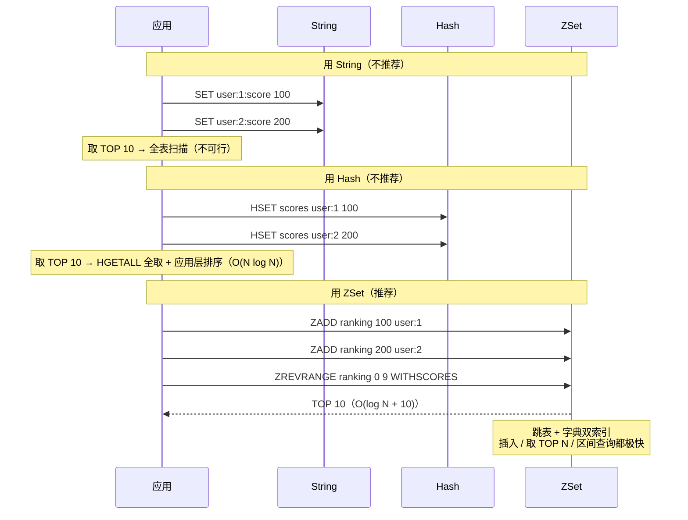
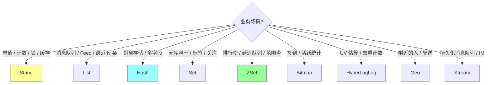
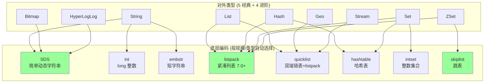
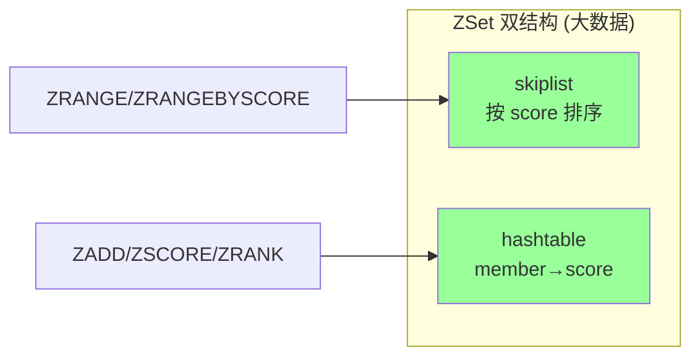
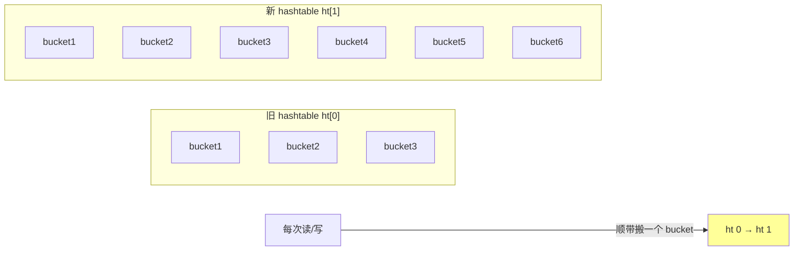

# Redis · 数据结构

> 5 经典（String/List/Hash/Set/ZSet）+ 4 进阶（Bitmap/HyperLogLog/Geo/Stream）/ 底层编码（SDS/listpack/quicklist/skiplist/intset/hashtable）/ 场景选型

## 〇、多概念对比：9 大 Redis 数据结构（D 模板）

### 一句话定位

| 数据结构 | 一句话定位 |
| --- | --- |
| **String** | **二进制安全字符串**（SDS），最通用，**缓存 / 计数 / 分布式锁 / Session** |
| **List** | **双端队列**（listpack / quicklist），**消息队列 / 时间轴 / 最近 N 条**，LPUSH+BRPOP |
| **Hash** | **字段集合**（listpack / hashtable），**对象存储**（user:1 → name/age/email），节省键空间 |
| **Set** | **无序唯一集合**（intset / hashtable），**标签 / 好友 / 共同关注**（SINTER 求交集）|
| **ZSet** | **有序集合**（listpack / skiplist + dict），**排行榜 / 延迟队列 / 范围查询** by score |
| **Bitmap** | **位图**（基于 String），**签到 / 用户活跃统计 / Bloom Filter**，1 亿 bit = 12MB |
| **HyperLogLog** | **基数估计**（~0.81% 误差），固定 12KB 内存计**亿级 UV**，PFADD/PFCOUNT |
| **Geo** | **地理位置**（基于 ZSet），**附近的人 / 配送范围**，GEOADD/GEORADIUS |
| **Stream** | **消息流**（5.0+，类 Kafka），**消费者组 + ACK + 持久化**，IM / 事件溯源 |

### 多维度对比（18 维度，必背）

| 维度 | String | List | Hash | Set | ZSet | Bitmap | HLL | Geo | Stream |
| --- | --- | --- | --- | --- | --- | --- | --- | --- | --- |
| **底层编码** | int / embstr / raw（SDS）| listpack / quicklist | listpack / hashtable | intset / listpack / hashtable | listpack / skiplist+dict | String（位操作）| 稀疏 / 密集 16384 桶 | ZSet（geohash 编码）| Radix Tree |
| **容量** | 512MB | 2^32-1 | 2^32-1 字段 | 2^32-1 | 2^32-1 | 2^32 bit = 512MB | 固定 12KB | 同 ZSet | 内存允许范围 |
| **元素唯一** | - | ❌（可重复）| key 唯一 | ✅ 唯一 | ✅ 唯一（按 member）| - | ✅ 去重估算 | ✅（member 唯一）| - |
| **元素有序** | - | ✅（插入顺序）| ❌ | ❌ | ✅（按 score）| 位顺序 | ❌ | ✅（按地理）| ✅（按 ID）|
| **核心命令** | SET / GET / INCR / DECR | LPUSH / RPUSH / LRANGE / BRPOP | HSET / HGET / HGETALL | SADD / SMEMBERS / SINTER | ZADD / ZRANGE / ZRANGEBYSCORE | SETBIT / GETBIT / BITCOUNT / BITOP | PFADD / PFCOUNT / PFMERGE | GEOADD / GEORADIUS / GEODIST | XADD / XREAD / XGROUP / XACK |
| **典型操作复杂度** | O(1) | O(1) 两端 / O(N) 中间 | O(1) 单字段 | O(1) 单元素 / O(N) 求交 | O(log N) | O(1) 单位 | O(1) | O(log N) | O(1) 添加 |
| **典型大小（编码切换）** | - | 128 / 64B | 128 / 64B | intset 512 / listpack 128 | listpack 128 / 64B | - | - | - | - |
| **节省内存** | 中 | listpack 极省 | listpack 极省 | intset 极省 | listpack 中 | **极省**（10w 用户 12KB）| **极省**（12KB / key）| 中 | 中 |
| **使用频次** | **极高**（90% 业务）| 高 | **极高** | 高 | **极高** | 中 | 中 | 中 | 中（5.0+）|
| **典型业务** | 缓存 / 计数 / 锁 / Session | 消息队列 / Feed 流 | 用户对象 / 配置 | 标签 / 好友 / 抽奖 | 排行榜 / 延迟队列 | 签到 / 活跃统计 | UV 估算 | 附近的人 | IM / 事件流 |
| **持久化** | RDB+AOF | RDB+AOF | RDB+AOF | RDB+AOF | RDB+AOF | RDB+AOF | RDB+AOF | RDB+AOF | RDB+AOF |
| **过期粒度** | key 级 | key 级 | key 级（**不支持 field 级**）| key 级 | key 级 | key 级 | key 级 | key 级 | key 级 |
| **范围查询** | ❌ | ✅ LRANGE | ❌ | ❌ | **✅ ZRANGEBYSCORE 强大** | BITCOUNT 区间 | ❌ | ✅ GEORADIUS | ✅ XRANGE |
| **去重** | - | ❌（自己控制）| field 级 | ✅ 天然 | ✅ 天然 + 排序 | - | ✅ 估算 | ✅ | - |
| **并发安全** | INCR 原子 | LPUSH/BRPOP 原子 | HSET 原子 | SADD 原子 | ZADD 原子 | SETBIT 原子 | PFADD 原子 | GEOADD 原子 | XADD 原子 |
| **典型 OOM 风险** | 大 Value | 长 List | 大 Hash | 大 Set | 大 ZSet | 极大 Bitmap | 几乎无 | 大 Geo | 长 Stream |
| **跨节点（Cluster）支持** | ✅ | ✅ | ✅ | ✅ | ✅ | ✅ | ✅ | ✅ | ✅ |

### 编码切换条件（必背）

| 类型 | 紧凑编码 | 切换条件 | 大编码 |
| --- | --- | --- | --- |
| **String** | int / embstr（< 44B）| value > 44B | raw（SDS）|
| **List** | listpack | 元素 > 128 个 / 单元素 > 64B | quicklist（listpack 链表）|
| **Hash** | listpack | 字段 > 128 / 单值 > 64B | hashtable |
| **Set（整数）** | intset | 元素 > 512 / 非整数 | hashtable |
| **Set（字符串）** | listpack（7.2+）| 元素 > 128 / 单元素 > 64B | hashtable |
| **ZSet** | listpack | 元素 > 128 / 单元素 > 64B | skiplist + hashtable |

**切换不可逆**：从紧凑升到大编码后，即使数据缩小也不回退。

### 协作时序对比（同一业务：排行榜 TOP 10）



### 内部编码深度解析

```
String 三种编码:
  int:     value 是 long 整数（< 2^63）→ 直接存 int64
  embstr:  value ≤ 44B → SDS + RedisObject 内嵌一块（一次 malloc）
  raw:     value > 44B → SDS + RedisObject 分开（两次 malloc）

  SDS（Simple Dynamic String）:
    struct sdshdr {
      uint64_t len;     // 当前长度
      uint64_t alloc;   // 已分配
      unsigned char flags;
      char buf[];       // 数据
    }
    优势: O(1) 取长度 + 二进制安全 + 杜绝缓冲区溢出 + 预分配

listpack（7.0+ 替代 ziplist）:
  连续内存 + 每元素 [encoding|length|value] 三段
  优势:
    - CPU 缓存友好
    - 内存极省（无指针开销）
  劣势:
    - 修改要重新分配整块
    - 查找 O(N)
  → 用于小数据（List / Hash / Set 小集合）

quicklist（List 大编码）:
  双向链表，每节点是 listpack
  
  [listpack1] ←→ [listpack2] ←→ [listpack3]
  
  优势: 大 List 性能 + 内存平衡
  默认: 每 listpack 8KB

hashtable（Set / Hash 大编码）:
  开链 + 渐进式 rehash（拆分到多次操作）
  
  ht[0]: 老表
  ht[1]: 新表（rehash 时创建）
  rehashidx: 当前迁移位置
  
  → 不会一次性阻塞主线程

skiplist（ZSet 大编码）:
  跳表 = 多层有序链表
  查询 / 插入 / 删除: O(log N)
  + 并行用 dict（hashtable）做 member→score 反向查询
  
  优势:
    - 范围查询极快（ZRANGEBYSCORE）
    - 实现简单 vs 红黑树
  
  注意: 跳表层数随机生成（1/4 概率升层）

intset（小 Set 整数集合）:
  有序 int 数组，二分查找 O(log N)
  自动升级 int16 → int32 → int64
  全是整数才用，混入字符串立即升 hashtable
```

### 缺一不可分析

| 假设 | 后果 |
| --- | --- |
| **没 String** | 缓存 / 分布式锁 / 计数器失去最通用方案 |
| **没 List** | 消息队列 / 时间轴失去原生队列结构 |
| **没 Hash** | 对象存储退化为多个 key（key 数量爆炸 + 内存浪费）|
| **没 Set** | 标签 / 共同关注退化为应用层求交集（O(N²)）|
| **没 ZSet** | 排行榜 / 延迟队列失去 O(log N) 方案 |
| **没 Bitmap** | 签到 / 活跃统计内存暴涨（10w 用户 12KB vs 几 MB）|
| **没 HLL** | 亿级 UV 估算无原生方案（精确去重存不下）|
| **没 Geo** | 附近的人退化为 SQL 全表扫 |
| **没 Stream** | 持久化消息队列退化为 List（无消费者组 / 无 ACK）|

### 内存对比（10 万用户的不同存储方式）

```
用 String 存对象（每用户 3 字段）:
  user:1:name → "alice"
  user:1:age → "25"
  user:1:email → "..."
  10w × 3 key × ~100B = 30MB

用 Hash 存对象（HSET user:1 name alice age 25 ...）:
  10w × 1 key × ~150B = 15MB（节省 50%）
  → 用 Hash 更省 key 空间

用 Set 存标签（10w 用户每人 10 标签）:
  intset 全整数: ~100MB
  hashtable: ~300MB
  → 整数 ID 用 intset 节省 3x

用 Bitmap 存签到（10w 用户 365 天）:
  Bitmap: 10w × 365 bit = 4.5 MB
  Hash:   10w × 365 key × ~30B = 1 GB
  → Bitmap 节省 200x

用 HLL 存 UV（1 亿 UV 估算）:
  HLL:    12 KB（固定）
  Set:    1 亿 × ~50B = 5 GB
  → HLL 节省 40w 倍（牺牲 0.81% 精度）
```

### 怎么选（决策树）



**实战推荐表**：

| 业务 | 推荐 | 备注 |
| --- | --- | --- |
| 验证码 / Token | **String** + TTL | INCR 防刷 |
| 用户对象（id → name/age/email）| **Hash** | 节省 key 空间 |
| 点赞 / 收藏列表 | **Set** | SADD 去重 |
| 共同关注（双方好友）| **Set** + SINTER | 求交集 |
| 排行榜 TOP N | **ZSet** + ZREVRANGE | O(log N + N) |
| 延迟队列（按时间）| **ZSet** with timestamp score | ZRANGEBYSCORE 取到期 |
| 签到统计（连续 30 天）| **Bitmap** + BITCOUNT | 内存极省 |
| 大 V 文章 UV（亿级）| **HLL** | 0.81% 误差 |
| 外卖配送范围 | **Geo** + GEORADIUS | 内置经纬度 |
| 业务消息流 | **Stream** | 消费者组 + ACK |
| 最近 50 条动态 | **List** + LTRIM 0 49 | 自动裁剪 |
| 全局 ID 生成 | **String** + INCR | 原子递增 |

### 反模式（生产不要踩）

```
❌ 大 Hash / 大 Set / 大 ZSet（单 key > 10MB）→ 阻塞主线程 + 迁移慢
❌ String 存 JSON 大对象 → 反序列化开销 + 不能局部更新（用 Hash 代替）
❌ List 当队列但没 ACK 机制 → 消费失败丢消息（用 Stream）
❌ Set 求交集 SINTER 大集合（百万级）→ 阻塞主线程
❌ ZSet 用作排行榜但元素数 > 100w → 内存爆 + 慢
❌ Bitmap 但用户 ID 不连续 / 稀疏 → 浪费空间（用 HLL）
❌ HLL 用于精确计数 → 0.81% 误差，金融场景不能用
❌ Hash 期望字段级过期 → Redis 不支持（key 级 TTL 才有）
❌ Cluster 模式下用 SINTER 跨 key → 需 hash tag 强制同 slot
❌ Stream 无限增长不清理 → 内存爆（用 XTRIM）
```

### 一句话总结（D 模板专属）

> 9 大 Redis 数据结构的核心是 **"业务场景驱动选择 + 编码自动切换"**：
> **5 经典**（String / List / Hash / Set / ZSet）覆盖 90% 业务，**4 进阶**（Bitmap / HLL / Geo / Stream）解决特殊场景。
> **缺一不可**：String 通用 / Hash 对象 / Set 去重 / ZSet 排序 / List 队列 / Bitmap 签到 / HLL 去重估算 / Geo 地理 / Stream 持久化消息流。
> **内存优势**：Bitmap 比 Hash 节省 200x（签到）/ HLL 比 Set 节省 40w 倍（UV）/ Hash 比 String 节省 50%（对象）。
> **关键事实**：类型 = 编码无关，**Redis 自动按数据量切换编码**（listpack → quicklist / hashtable / skiplist）。

---

## 〇、核心提炼（5 段式）

### 核心机制（4 条必背）

1. **类型 vs 编码分离** - 同一个类型（如 List）根据数据量自动选不同底层编码（listpack / quicklist）
2. **小数据用紧凑编码** - listpack / intset 连续内存，省空间 + CPU 缓存友好
3. **大数据用专用结构** - hashtable / skiplist / quicklist，O(1) 或 O(log N) 性能
4. **编码升级单向不可逆** - 从紧凑升级到专用后，即使数据缩小也不会回退

### 核心本质（必懂）

> Redis 数据结构的本质是 **"内存效率 + 操作复杂度"的双重优化**：
>
> - **小数据**：连续内存（listpack / intset）→ 省空间 + 缓存友好（CPU L1/L2/L3 命中率）
> - **大数据**：专用结构（hashtable / skiplist）→ O(1) / O(log N) 性能
> - **自动升级**：根据数据规模动态选择，对用户透明
>
> **关键事实**：
> - **redisObject 是统一外壳**：所有类型都有 type + encoding 两个字段
> - **SDS 是字符串基础**：所有字符串场景用 SDS（不是 C 字符串）
> - **编码升级阈值可配**：list-max-listpack-size / hash-max-listpack-entries 等
> - **跳表 vs 红黑树**：Redis 选跳表是因为**实现简单 + 范围查询友好 + 并发友好**
>
> **设计哲学**：
> - 不是"一种结构走天下"
> - 而是"按数据规模动态选最优"
> - 用户无感知，只用类型 API

### 完整流程（面试必背）

```
String 编码自动选择:
  整数（< long）→ int 编码（直接存数字，0 内存开销）
  短字符串（≤ 44 字节）→ embstr（与 redisObject 一起分配，1 次 alloc）
  长字符串（> 44 字节）→ raw（独立 SDS，2 次 alloc）

List 编码:
  小列表（少 + 短）→ listpack（连续内存）
  大列表 → quicklist（双向链表 + 每个节点是 listpack）

Hash 编码:
  小 hash（≤ 128 entry + 值 ≤ 64B）→ listpack
  大 hash → hashtable（数组 + 链表 + 渐进式 rehash）

Set 编码:
  全是整数 + 数量少 → intset（有序整数数组，二分查找）
  其他 → hashtable（值为 NULL 的 dict）

ZSet 编码:
  小 zset → listpack（key + score 紧凑存）
  大 zset → skiplist + dict 双结构
    - skiplist: 按 score 排序，范围查询 O(log N)
    - dict: member → score 的 O(1) 查找

升级触发示例:
  1. HSET hash field val      # 初始 listpack
  2. HSET ... × 100 次          # 加到 130 项
  3. 触发: 130 > 128 listpack 上限 → 自动升级 hashtable
  4. 后续即使 HDEL 到 1 项也不会回退（单向）
```

### 4 条核心机制 - 逐点讲透

#### 1. SDS（Simple Dynamic String）

```
为什么不用 C 字符串:
  C 字符串 \0 结尾:
    - strlen O(N) 遍历
    - 不能存二进制（含 \0 截断）
    - 缓冲区溢出风险（strcpy）

SDS 结构:
  struct sdshdr {
      uint64 len;      // 当前长度（O(1) strlen）
      uint64 alloc;    // 分配空间
      char[] buf;      // 实际数据（不依赖 \0）
  }

优势:
  - O(1) 获取长度
  - 二进制安全（按 len 读取）
  - 预分配（小于 1MB 翻倍 / 大于 1MB 加 1MB） → 减少 realloc
  - 惰性释放 → 减少 free
```

#### 2. listpack（连续内存的紧凑结构）

```
代替老的 ziplist（5.0+）:
  ziplist 有"连锁更新"问题（中间元素改变长度导致后续全部重排）
  listpack 修复了这个

结构:
  连续内存块:
  [总字节数][元素数][元素1][元素2]...[元素n][结束符]
  每个元素: [编码 + 数据 + 长度]
    - 编码: 整数 / 短字符串 / 长字符串
    - 长度: 反向存（从前往后能跳，从后往前也能跳）

优势:
  - 紧凑（无指针开销）
  - CPU 缓存友好（连续内存）
  - 适合小集合（< 100 项）

劣势:
  - 插入删除 O(N)（要移动）
  - 不能快速定位（必须从头扫）
  - 大集合性能差 → 升级为专用结构
```

#### 3. 跳表（skiplist，ZSet 核心）

```
为什么 Redis 选跳表（不是红黑树）:

vs 红黑树:
  树平衡操作复杂（旋转）
  范围查询要中序遍历（递归）
  → 跳表实现简单 + 范围查询直观（链表遍历）

vs B+ 树:
  B+ 树为磁盘场景设计（多叉省 IO）
  内存场景不需要多叉
  → 跳表更适合内存

vs 哈希表:
  哈希不支持排序、范围
  ZSet 需要按 score 排序

跳表结构:
  最底层: 完整有序链表
  上层: 索引层（每两个节点一个上层指针）
  查找: 从最高层向右走，无法走时降一层
  → 平均 O(log N)

为什么"概率平衡":
  插入时随机决定层数（每层 1/2 概率）
  期望树高 log N
  实现简单，无旋转
```

#### 4. dict 渐进式 rehash（哈希表扩容）

```
问题:
  hashtable 满了要扩容（2x）
  100w key 扩容 → 一次 rehash 2 秒卡顿

渐进式 rehash:
  1. 分配新 hashtable（2x 大小）
  2. 不立即迁移，标记 rehashidx = 0
  3. 之后每次操作（GET / SET / DEL）顺带迁移 1 个 bucket:
     - 从 ht[0][rehashidx] 迁移到 ht[1]
     - rehashidx++
  4. 迁移完成 → 释放老 hashtable

期间访问规则:
  GET: 先查 ht[0]，没找到查 ht[1]
  SET: 写到 ht[1]（不写老表）
  DEL: 从 ht[0] 和 ht[1] 都删

代价:
  - rehash 期间内存翻倍
  - 操作稍慢（要查两个表）
  - 但避免单次卡顿
```

### 一句话总结

> Redis 数据结构的核心是：**类型 vs 编码分离 + 小数据紧凑（listpack/intset）+ 大数据专用（skiplist/hashtable）+ 渐进式 rehash 防卡顿**，
> 本质是 **"内存效率 + 操作复杂度"的双重优化**：根据数据规模动态选最优编码，对用户透明。
> **关键基础**：SDS（O(1) 长度 + 二进制安全 + 预分配）支撑所有字符串场景；
> **关键设计**：跳表代替红黑树（实现简单 + 范围友好 + 并发友好）；
> **关键技巧**：渐进式 rehash 把扩容代价摊到每次操作。

---

## 一、全景图



> Redis 7.0 用 **listpack** 替代了大部分 ziplist 场景（修复 ziplist 级联更新性能问题）。本文以 7.0+ 为准。

## 二、5 大经典类型

### 2.1 String（最常用）

**最大 512MB**。底层三种编码：

| 编码 | 触发 | 特点 |
| --- | --- | --- |
| `int` | 值是数字且能用 long 表示 | 共享 0~9999 整数对象 |
| `embstr` | ≤ 44 字节 | sds + redisObject 一次分配，连续内存 |
| `raw` | > 44 字节 | sds 和 redisObject 分开分配 |

**SDS（Simple Dynamic String）**：

```c
struct sdshdr {
    int len;     // 已用长度 (O(1) 取长)
    int alloc;   // 总分配长度
    char flags;  // 类型标志
    char buf[];  // 实际数据 (二进制安全)
};
```

vs C 字符串：
- O(1) 取长（不需要遍历）
- **二进制安全**（含 \0 也能存）
- **预分配 + 惰性释放**（减少内存重分配）
- 杜绝缓冲区溢出

**典型场景**：
- 缓存对象（JSON/Protobuf 序列化后存）
- 计数器（`INCR/DECR` 原子）
- 分布式锁（`SET key val NX PX ttl`）
- session（key 是 sessionID）
- Bitmap（实际是 String 上的位操作）

### 2.2 List（双端列表）

**编码**（7.0+）：
- **quicklist**：双向链表，每个节点是一个 listpack
- 旧版本：小用 ziplist，大用 linkedlist


**特点**：
- 双端 O(1)：`LPUSH`/`RPUSH`/`LPOP`/`RPOP`
- 中间访问 O(n)：`LINDEX`/`LSET`
- `BLPOP`/`BRPOP` 阻塞读 → 简易消息队列

**典型场景**：
- 消息队列（轻量，不可靠 → 用 Stream / Kafka 替代）
- 时间线 Feed（最新 N 条）
- 任务列表
- 历史记录

### 2.3 Hash（键值对集合）

**编码**：
- 字段数 ≤ `hash-max-listpack-entries`（默认 128）且每个值 ≤ `hash-max-listpack-value`（默认 64B）→ **listpack**
- 否则 → **hashtable**（链式哈希）

**特点**：
- 字段级原子：`HINCRBY` / `HSET`
- 比"用 String 存 JSON"更省内存（小数据量时 listpack 极紧凑）
- 比 String 多一层维度（`key + field → value`）

**典型场景**：
- 对象存储（用户信息：`HSET user:1 name alice age 18`）
- 购物车（`HSET cart:user1 sku1 2`）
- 配置项分组

### 2.4 Set（无序集合）

**编码**：
- 元素都是整数 + 数量 ≤ `set-max-intset-entries`（默认 512）→ **intset**
- 元素少且短（默认 ≤ 128 个、每个 ≤ 64B）→ **listpack**（7.2+）
- 否则 → **hashtable**

**特点**：
- 唯一 + 无序
- 集合运算：`SINTER`（交）`SUNION`（并）`SDIFF`（差）
- O(1) 判断存在 `SISMEMBER`

**典型场景**：
- 标签系统
- 共同好友（求交集）
- 抽奖（`SRANDMEMBER`、`SPOP` 随机）
- 去重统计（小数据量；大数据用 HyperLogLog）

### 2.5 ZSet（有序集合，重头戏）

**编码**：
- 元素少（≤ 128）且短（≤ 64B）→ **listpack**
- 否则 → **skiplist + hashtable**（双结构）

**为什么 skiplist + hashtable 双结构？**
- skiplist：按 score 排序，范围查询 O(log n)
- hashtable：member → score 的 O(1) 查找



**跳表（skiplist）原理**：

跳表的精髓：**同一个节点垂直贯穿多层**，高层是低层的稀疏索引。每个节点的层数随机生成（指数衰减，平均高度 1/(1-p) ≈ 2 层）。

```text
最高层（稀疏，跳跃远）
    L4   head ──────────────────────────────► 50 ─────────────────────► NIL
    L3   head ──────────► 20 ──────────────► 50 ─────────────────────► NIL
    L2   head ──► 10 ──► 20 ──────────────► 50 ─────────► 80 ────────► NIL
    L1   head ──► 10 ──► 15 ──► 20 ──► 30 ► 50 ──► 70 ──► 80 ────────► NIL
最底层（包含所有节点 + 反向指针）

         ▲              ▲       ▲       ▲       ▲       ▲
         │              │       │       │       │       │
       同一节点 10    节点 15  节点 20  节点 30 节点 50  节点 70/80
       (高度 2)       (高度 1) (高度 3) (高度 1)(高度 4) (高度 1/2)
```

**关键说明**：
- 节点 `50` 高度 = 4，从 L1 到 L4 都有它的 forward 指针
- 节点 `20` 高度 = 3，从 L1 到 L3 有它
- 节点 `15`/`30`/`70` 高度 = 1，只在底层
- 底层 L1 是完整有序链表，包含所有节点

**Redis skiplist 节点结构（zskiplistNode）**：

```c
typedef struct zskiplistNode {
    sds ele;                        // member
    double score;                   // score（按它排序）
    struct zskiplistNode *backward; // 反向指针（仅 L1 有，支持 ZREVRANGE）
    struct zskiplistLevel {
        struct zskiplistNode *forward; // 该层下一节点
        unsigned long span;            // 到下一节点跨越的节点数（用于 ZRANK）
    } level[];                      // 每层一个 forward + span
} zskiplistNode;
```

**查找 score=30 的过程**（O(log n)）：

```text
              查找路径（从最高层向下、向右）

    L4   head ───────────────────────────► 50    ① head.L4.forward = 50, 50 > 30, 下降
                                            ▼
    L3   head ─────────► 20 ─────────────► 50    ② head.L3.forward = 20, 20 ≤ 30 前进
                          ▼                       ③ 20.L3.forward = 50, 50 > 30, 下降
    L2   head ──► 10 ──► 20 ─────────────► 50    ④ 20.L2.forward = 50, 50 > 30, 下降
                          ▼
    L1   head ──► 10 ──► 20 ► 30 ► 50            ⑤ 20.L1.forward = 30 ✓ 命中

    总共比较 4 次，跳过了 10/15
```

**插入随机层数算法**（每次随机到下一层概率 p = 0.25）：

```c
int zslRandomLevel(void) {
    int level = 1;
    while ((random()&0xFFFF) < (ZSKIPLIST_P * 0xFFFF))  // p = 0.25
        level += 1;
    return (level < ZSKIPLIST_MAXLEVEL) ? level : ZSKIPLIST_MAXLEVEL;
}
// 期望层高 = 1/(1-p) ≈ 1.33
// 节点数 N=10000 时最高层约 log_4(N) ≈ 7
// MAXLEVEL = 32（足够支撑 2^64 个节点）
```

**为什么 backward 指针只在 L1**：
- 反向遍历（ZREVRANGE）只需要在底层走
- 高层不需要反向，省内存

**为什么有 span 字段**：
- 用于 O(log n) 计算排名（ZRANK）
- 累加经过节点的 span = 排名

**为什么用跳表不用红黑树？**（高频题）
1. **范围查询友好**：底层是有序链表，`ZRANGE` 直接顺序遍历
2. **实现简单**：树的旋转复杂度高，跳表只有插入/删除
3. **并发友好**：跳表局部修改影响小（虽然 Redis 单线程不需要这个）
4. **空间换时间**：跳表多消耗一些指针，但常数小

**特点**：
- 按 score 排序（小到大）
- O(log n) 增删查改
- 范围查询 `ZRANGEBYSCORE` 高效
- 字典序 `ZRANGEBYLEX`（同分数下按字典序）

**典型场景**：
- 排行榜（最经典）
- 延时队列（score 是执行时间戳，定时拉取）
- 优先级队列
- 时间线（score 是时间戳）

## 三、4 个进阶类型

### 3.1 Bitmap（位图）

**本质**：String 上的位操作。最大 2^32 位 = 512MB。

```bash
SETBIT user:active:20240101 12345 1   # 用户 12345 今天活跃
GETBIT user:active:20240101 12345     # 查询
BITCOUNT user:active:20240101         # 今天活跃用户数
BITOP AND result key1 key2            # 与运算
```

**典型场景**：
- 用户签到（每天一个 key，bit 偏移=用户 id）
- 用户在线状态
- 布隆过滤器底层（结合多个 hash）
- AB 测试分组

**优势**：极省空间。1 亿用户的活跃状态 = 12.5MB（vs Set 几个 GB）。

### 3.2 HyperLogLog（基数统计）

**用途**：估算**去重数量**（基数 cardinality），有损但**误差 < 1%**。

```bash
PFADD page:uv:2024010 user1 user2 user3
PFCOUNT page:uv:20240101                  # 估算 UV
PFMERGE total user1 user2                  # 合并多个
```

**核心**：固定 12KB 内存可估算 2^64 个不同元素。

**原理**：基于伯努利试验和概率统计（前导零位数估算）。**不存原始数据**，所以省内存但有误差。

**典型场景**：
- UV 统计（独立访客）
- 大数据去重计数
- 不需要精确数字的统计

vs Set：精确但耗内存（千万 UV 需要几百 MB）。
vs Bitmap：可以精确，但需要 ID 是连续整数。

### 3.3 Geo（地理位置）

**本质**：基于 ZSet（GeoHash 编码作为 score）。

```bash
GEOADD bikes:pos 116.404 39.915 "bike1"
GEORADIUSBYMEMBER bikes:pos "bike1" 100 m
GEOSEARCH bikes:pos FROMLONLAT 116.4 39.9 BYRADIUS 100 m
```

**典型场景**：
- 附近的人/车/店
- 同城配送
- 打车地图

### 3.4 Stream（5.0+ 消息流）

类似 Kafka 的轻量级实现：

```bash
XADD orders * order_id 1 amount 100      # 追加消息
XREAD COUNT 10 STREAMS orders 0          # 读
XGROUP CREATE orders consumer1 $         # 创建消费者组
XREADGROUP GROUP consumer1 c1 COUNT 10 STREAMS orders >
XACK orders consumer1 message_id         # 确认
```

**特点**：
- **持久化**消息（vs Pub/Sub 不持久）
- **消费者组**（vs Pub/Sub 广播）
- **ACK 机制**
- **回溯消费**
- 支持百万级 QPS

**典型场景**：
- 轻量消息队列（不想引入 Kafka 时）
- 事件溯源
- 数据变更通知

> 重型场景仍推荐 Kafka / RocketMQ。Stream 适合中小规模、希望少一个组件的场景。

## 四、底层编码切换

### 4.1 编码与配置

| 类型 | 小编码 | 切换阈值（默认） | 大编码 |
| --- | --- | --- | --- |
| List | listpack | `list-max-listpack-size -2`（每节点 8KB）`list-max-listpack-entries 128` | quicklist |
| Hash | listpack | `hash-max-listpack-entries 128` `hash-max-listpack-value 64` | hashtable |
| Set | intset/listpack | `set-max-intset-entries 512` `set-max-listpack-entries 128` | hashtable |
| ZSet | listpack | `zset-max-listpack-entries 128` `zset-max-listpack-value 64` | skiplist+hashtable |
| String | int/embstr | 数字或 ≤ 44B | raw |

**切换是单向的**：小 → 大后，即使删除元素回到小规模，也不会切回小编码（避免抖动）。

### 4.2 listpack vs ziplist

老版本用 ziplist，**Redis 7.0 全面替换为 listpack**。

**ziplist 缺陷**：每个 entry 存"前一节点长度"。前节点变长可能引发**级联更新**（cascade update），最坏 O(n²)。

**listpack 改进**：每个 entry 存"自己长度 + 类型"，不依赖前节点。**无级联更新**，性能稳定。

### 4.3 渐进式 rehash

Hash 满载因子高时扩容（×2）。Redis 用**渐进式 rehash**：



- **不是一次性搬**：避免单次操作 STW
- 期间**两个 ht 都查**（写新数据写到 ht[1]）
- 搬完释放 ht[0]

## 五、场景选型速查

| 场景 | 数据结构 | 命令 |
| --- | --- | --- |
| 缓存对象 JSON | String | `SET/GET` |
| 缓存对象按字段 | Hash | `HSET/HGET/HMGET` |
| 计数器 | String | `INCR/INCRBY` |
| 限流 token | String | `INCR + EXPIRE` |
| 分布式锁 | String | `SET key val NX PX ms` |
| 消息队列（轻量） | List / Stream | `LPUSH/BRPOP` / `XADD/XREADGROUP` |
| 排行榜 | ZSet | `ZADD/ZRANGE WITHSCORES` |
| 延时队列 | ZSet | `ZADD score=execTime` + 定时拉 |
| 标签 / 集合运算 | Set | `SADD/SINTER/SUNION` |
| 用户签到 | Bitmap | `SETBIT/BITCOUNT` |
| UV 统计 | HyperLogLog | `PFADD/PFCOUNT` |
| 附近的人 | Geo | `GEOADD/GEOSEARCH` |
| 实时排行 / 多维 score | ZSet | `ZADD + ZINCRBY` |
| 抽奖 | Set | `SPOP/SRANDMEMBER` |
| 频率控制 | ZSet (滑窗) / String (固定窗) | 见 08 |
| 会话 | Hash 或 String + JSON | `HSET/HGETALL` |
| 布隆过滤器 | Bitmap + 多 hash | RedisBloom 模块或自实现 |

## 六、高频面试题

**Q1：Redis 5 大类型底层编码？**

| 类型 | 编码（7.0+） |
| --- | --- |
| String | int / embstr / raw |
| List | listpack / quicklist |
| Hash | listpack / hashtable |
| Set | intset / listpack / hashtable |
| ZSet | listpack / skiplist+hashtable |

**Q2：跳表为什么不用红黑树？**

- **范围查询**：跳表底层是有序链表，`ZRANGE` 直接顺序遍历，红黑树要中序遍历
- **实现简单**：跳表无旋转操作，红黑树旋转复杂
- **并发友好**：跳表局部修改易加锁（虽 Redis 单线程不需要）
- **代码量小**：跳表 ~200 行，红黑树 ~1000 行

性能：理论都是 O(log n)，跳表常数稍大但实现简单可读。

**Q3：ZSet 为什么是 skiplist + hashtable 双结构？**
- **skiplist**：按 score 排序，支持 `ZRANGE` 范围 O(log n + m)
- **hashtable**：`ZSCORE` / `ZRANK` 取 score O(1)

只用一个就慢一边。两个组合各取所长，代价是双倍内存。

**Q4：String 最大多大？为什么是 512MB？**
512MB（2^29 字节）。SDS 的 `len` 字段最大 2^32-1 但实现限制是 512MB（防滥用）。

**实践**：单 value > 10KB 就要警惕（大 key），> 1MB 强烈不建议。

**Q5：listpack 和 ziplist 区别？为什么换？**
ziplist 每个 entry 存"前一节点长度"，前节点变长可能**级联更新**（最坏 O(n²)）。listpack 每个 entry 自描述（含自己长度），**无级联更新**。

7.0 全面替换。功能等价但性能稳定。

**Q6：渐进式 rehash 为什么需要？**
Hash 扩容是 O(n)，单线程模式下一次性搬几百万 entry 会**阻塞所有请求**几秒。

渐进式：每次读/写顺带搬 1 个 bucket，搬完释放旧表。期间双表共存，读两表写新表。

**Q7：Bitmap 适合什么？1 亿用户活跃统计要多大内存？**
适合：**布尔状态 + 海量用户**（用户 ID 做偏移）。

1 亿用户：1 亿 bit = 12.5MB（vs Set 几 GB）。

但要求 ID 是连续整数（或能映射）。稀疏数据用 Bitmap 反而浪费。

**Q8：HyperLogLog 怎么用 12KB 估算几亿基数？**

原理：伯努利试验。每个元素 hash 后，看二进制前导零的最大长度 → 反推总数。

12KB = 16384 个 6-bit 桶，每桶记录该桶内最大前导零数，调和平均 + 修正得到估算值。

**误差 < 1%，标准方差 0.81%**。

**Q9：消息队列用 List 还是 Stream？**

| | List (BLPOP) | Stream (5.0+) |
| --- | --- | --- |
| 持久化 | 是 | 是 |
| ACK | 否 | 是 |
| 消费者组 | 否 | 是 |
| 回溯消费 | 否（POP 即删） | 是 |
| 多消费者 | 竞争消费 | 组内竞争，组间广播 |
| 体量 | 简单场景 | 中等规模 |

**简单"通知" 用 List/Pub-Sub，要可靠用 Stream，重型用 Kafka**。

**Q10：Hash 和 String 存对象怎么选？**

| | String + JSON | Hash |
| --- | --- | --- |
| 取整对象 | 一次反序列化 | `HGETALL`（或 listpack 编码下也是顺序读） |
| 取单字段 | 取整再解析（慢） | `HGET` 高效 |
| 改单字段 | 取整改全 | `HSET` 字段级 |
| 内存 | 序列化后 + 字段名重复 | listpack 极省 |
| 原子性 | 整体替换 | 字段级 `HINCRBY` 等 |

经验：
- **整体读写为主** → String + JSON（简单）
- **频繁改单字段 / 取单字段** → Hash
- **小对象**（< 128 字段）Hash 更省内存（listpack）

**Q11：set / zset / list 都能存元素，怎么选？**

- **去重 + 无序** → Set
- **去重 + 排序** → ZSet
- **可重复 + 顺序保留** → List
- **需要排行 / 范围查询** → ZSet
- **简单队列** → List

**Q12：内存对比**
存 100 万个对象（每个 100 字节）：
- String + JSON：~140MB（每 key 有 SDS overhead + redisObject）
- Hash（field 都是字段名）：取决于编码。listpack 节省 60%，hashtable 反而更费

实测前用 `MEMORY USAGE key` 看实际内存。

## 七、面试加分点

- 讲清"5 大类型 + 多种底层编码动态切换"的设计哲学：用空间换时间，小数据用紧凑结构，大数据用高效结构
- 知道 7.0 用 listpack 替换 ziplist 修复级联更新
- 跳表为什么不用红黑树（4 点理由）
- ZSet 双结构的 trade-off
- HyperLogLog 概率算法 + 12KB 上限
- 渐进式 rehash 思想（用空间分摊时间，避免 STW）
- 编码切换是单向的（避免抖动）
- 用 `OBJECT ENCODING key` / `MEMORY USAGE key` 实战观察
