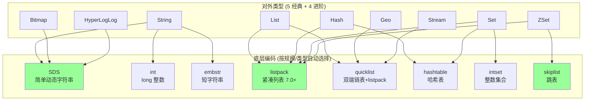
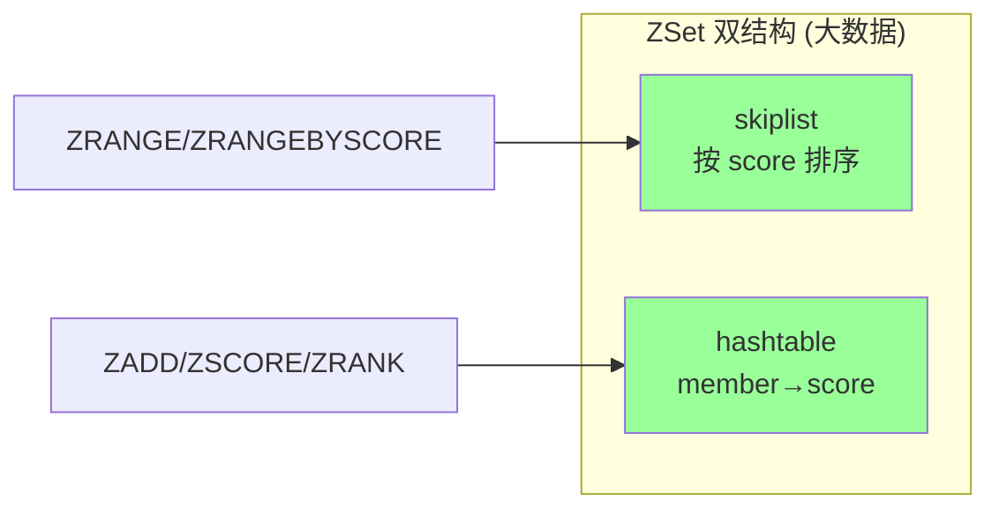
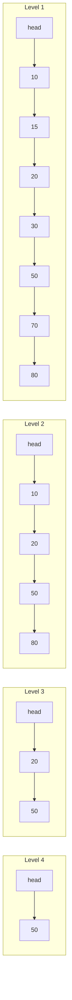
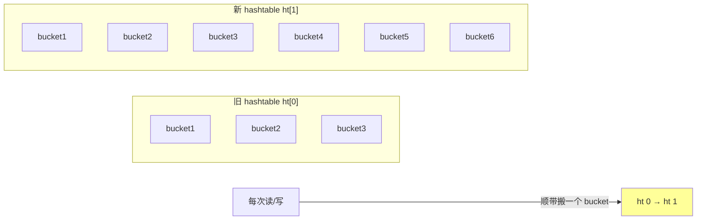

# Redis · 数据结构

> 5 经典（String/List/Hash/Set/ZSet）+ 4 进阶（Bitmap/HyperLogLog/Geo/Stream）/ 底层编码（SDS/listpack/quicklist/skiplist/intset/hashtable）/ 场景选型

## 一、全景图



> Redis 7.0 用 **listpack** 替代了大部分 ziplist 场景（修复 ziplist 级联更新性能问题）。本文以 7.0+ 为准。

## 二、5 大经典类型

### 2.1 String（最常用）

**最大 512MB**。底层三种编码：

| 编码 | 触发 | 特点 |
| --- | --- | --- |
| `int` | 值是数字且能用 long 表示 | 共享 0~9999 整数对象 |
| `embstr` | ≤ 44 字节 | sds + redisObject 一次分配，连续内存 |
| `raw` | > 44 字节 | sds 和 redisObject 分开分配 |

**SDS（Simple Dynamic String）**：

```c
struct sdshdr {
    int len;     // 已用长度 (O(1) 取长)
    int alloc;   // 总分配长度
    char flags;  // 类型标志
    char buf[];  // 实际数据 (二进制安全)
};
```

vs C 字符串：
- O(1) 取长（不需要遍历）
- **二进制安全**（含 \0 也能存）
- **预分配 + 惰性释放**（减少内存重分配）
- 杜绝缓冲区溢出

**典型场景**：
- 缓存对象（JSON/Protobuf 序列化后存）
- 计数器（`INCR/DECR` 原子）
- 分布式锁（`SET key val NX PX ttl`）
- session（key 是 sessionID）
- Bitmap（实际是 String 上的位操作）

### 2.2 List（双端列表）

**编码**（7.0+）：
- **quicklist**：双向链表，每个节点是一个 listpack
- 旧版本：小用 ziplist，大用 linkedlist


**特点**：
- 双端 O(1)：`LPUSH`/`RPUSH`/`LPOP`/`RPOP`
- 中间访问 O(n)：`LINDEX`/`LSET`
- `BLPOP`/`BRPOP` 阻塞读 → 简易消息队列

**典型场景**：
- 消息队列（轻量，不可靠 → 用 Stream / Kafka 替代）
- 时间线 Feed（最新 N 条）
- 任务列表
- 历史记录

### 2.3 Hash（键值对集合）

**编码**：
- 字段数 ≤ `hash-max-listpack-entries`（默认 128）且每个值 ≤ `hash-max-listpack-value`（默认 64B）→ **listpack**
- 否则 → **hashtable**（链式哈希）

**特点**：
- 字段级原子：`HINCRBY` / `HSET`
- 比"用 String 存 JSON"更省内存（小数据量时 listpack 极紧凑）
- 比 String 多一层维度（`key + field → value`）

**典型场景**：
- 对象存储（用户信息：`HSET user:1 name alice age 18`）
- 购物车（`HSET cart:user1 sku1 2`）
- 配置项分组

### 2.4 Set（无序集合）

**编码**：
- 元素都是整数 + 数量 ≤ `set-max-intset-entries`（默认 512）→ **intset**
- 元素少且短（默认 ≤ 128 个、每个 ≤ 64B）→ **listpack**（7.2+）
- 否则 → **hashtable**

**特点**：
- 唯一 + 无序
- 集合运算：`SINTER`（交）`SUNION`（并）`SDIFF`（差）
- O(1) 判断存在 `SISMEMBER`

**典型场景**：
- 标签系统
- 共同好友（求交集）
- 抽奖（`SRANDMEMBER`、`SPOP` 随机）
- 去重统计（小数据量；大数据用 HyperLogLog）

### 2.5 ZSet（有序集合，重头戏）

**编码**：
- 元素少（≤ 128）且短（≤ 64B）→ **listpack**
- 否则 → **skiplist + hashtable**（双结构）

**为什么 skiplist + hashtable 双结构？**
- skiplist：按 score 排序，范围查询 O(log n)
- hashtable：member → score 的 O(1) 查找



**跳表（skiplist）原理**：



每个节点随机层数（指数衰减，约 1/2 概率上一层），平均查找 O(log n)。

**为什么用跳表不用红黑树？**（高频题）
1. **范围查询友好**：底层是有序链表，`ZRANGE` 直接顺序遍历
2. **实现简单**：树的旋转复杂度高，跳表只有插入/删除
3. **并发友好**：跳表局部修改影响小（虽然 Redis 单线程不需要这个）
4. **空间换时间**：跳表多消耗一些指针，但常数小

**特点**：
- 按 score 排序（小到大）
- O(log n) 增删查改
- 范围查询 `ZRANGEBYSCORE` 高效
- 字典序 `ZRANGEBYLEX`（同分数下按字典序）

**典型场景**：
- 排行榜（最经典）
- 延时队列（score 是执行时间戳，定时拉取）
- 优先级队列
- 时间线（score 是时间戳）

## 三、4 个进阶类型

### 3.1 Bitmap（位图）

**本质**：String 上的位操作。最大 2^32 位 = 512MB。

```bash
SETBIT user:active:20240101 12345 1   # 用户 12345 今天活跃
GETBIT user:active:20240101 12345     # 查询
BITCOUNT user:active:20240101         # 今天活跃用户数
BITOP AND result key1 key2            # 与运算
```

**典型场景**：
- 用户签到（每天一个 key，bit 偏移=用户 id）
- 用户在线状态
- 布隆过滤器底层（结合多个 hash）
- AB 测试分组

**优势**：极省空间。1 亿用户的活跃状态 = 12.5MB（vs Set 几个 GB）。

### 3.2 HyperLogLog（基数统计）

**用途**：估算**去重数量**（基数 cardinality），有损但**误差 < 1%**。

```bash
PFADD page:uv:2024010 user1 user2 user3
PFCOUNT page:uv:20240101                  # 估算 UV
PFMERGE total user1 user2                  # 合并多个
```

**核心**：固定 12KB 内存可估算 2^64 个不同元素。

**原理**：基于伯努利试验和概率统计（前导零位数估算）。**不存原始数据**，所以省内存但有误差。

**典型场景**：
- UV 统计（独立访客）
- 大数据去重计数
- 不需要精确数字的统计

vs Set：精确但耗内存（千万 UV 需要几百 MB）。
vs Bitmap：可以精确，但需要 ID 是连续整数。

### 3.3 Geo（地理位置）

**本质**：基于 ZSet（GeoHash 编码作为 score）。

```bash
GEOADD bikes:pos 116.404 39.915 "bike1"
GEORADIUSBYMEMBER bikes:pos "bike1" 100 m
GEOSEARCH bikes:pos FROMLONLAT 116.4 39.9 BYRADIUS 100 m
```

**典型场景**：
- 附近的人/车/店
- 同城配送
- 打车地图

### 3.4 Stream（5.0+ 消息流）

类似 Kafka 的轻量级实现：

```bash
XADD orders * order_id 1 amount 100      # 追加消息
XREAD COUNT 10 STREAMS orders 0          # 读
XGROUP CREATE orders consumer1 $         # 创建消费者组
XREADGROUP GROUP consumer1 c1 COUNT 10 STREAMS orders >
XACK orders consumer1 message_id         # 确认
```

**特点**：
- **持久化**消息（vs Pub/Sub 不持久）
- **消费者组**（vs Pub/Sub 广播）
- **ACK 机制**
- **回溯消费**
- 支持百万级 QPS

**典型场景**：
- 轻量消息队列（不想引入 Kafka 时）
- 事件溯源
- 数据变更通知

> 重型场景仍推荐 Kafka / RocketMQ。Stream 适合中小规模、希望少一个组件的场景。

## 四、底层编码切换

### 4.1 编码与配置

| 类型 | 小编码 | 切换阈值（默认） | 大编码 |
| --- | --- | --- | --- |
| List | listpack | `list-max-listpack-size -2`（每节点 8KB）`list-max-listpack-entries 128` | quicklist |
| Hash | listpack | `hash-max-listpack-entries 128` `hash-max-listpack-value 64` | hashtable |
| Set | intset/listpack | `set-max-intset-entries 512` `set-max-listpack-entries 128` | hashtable |
| ZSet | listpack | `zset-max-listpack-entries 128` `zset-max-listpack-value 64` | skiplist+hashtable |
| String | int/embstr | 数字或 ≤ 44B | raw |

**切换是单向的**：小 → 大后，即使删除元素回到小规模，也不会切回小编码（避免抖动）。

### 4.2 listpack vs ziplist

老版本用 ziplist，**Redis 7.0 全面替换为 listpack**。

**ziplist 缺陷**：每个 entry 存"前一节点长度"。前节点变长可能引发**级联更新**（cascade update），最坏 O(n²)。

**listpack 改进**：每个 entry 存"自己长度 + 类型"，不依赖前节点。**无级联更新**，性能稳定。

### 4.3 渐进式 rehash

Hash 满载因子高时扩容（×2）。Redis 用**渐进式 rehash**：



- **不是一次性搬**：避免单次操作 STW
- 期间**两个 ht 都查**（写新数据写到 ht[1]）
- 搬完释放 ht[0]

## 五、场景选型速查

| 场景 | 数据结构 | 命令 |
| --- | --- | --- |
| 缓存对象 JSON | String | `SET/GET` |
| 缓存对象按字段 | Hash | `HSET/HGET/HMGET` |
| 计数器 | String | `INCR/INCRBY` |
| 限流 token | String | `INCR + EXPIRE` |
| 分布式锁 | String | `SET key val NX PX ms` |
| 消息队列（轻量） | List / Stream | `LPUSH/BRPOP` / `XADD/XREADGROUP` |
| 排行榜 | ZSet | `ZADD/ZRANGE WITHSCORES` |
| 延时队列 | ZSet | `ZADD score=execTime` + 定时拉 |
| 标签 / 集合运算 | Set | `SADD/SINTER/SUNION` |
| 用户签到 | Bitmap | `SETBIT/BITCOUNT` |
| UV 统计 | HyperLogLog | `PFADD/PFCOUNT` |
| 附近的人 | Geo | `GEOADD/GEOSEARCH` |
| 实时排行 / 多维 score | ZSet | `ZADD + ZINCRBY` |
| 抽奖 | Set | `SPOP/SRANDMEMBER` |
| 频率控制 | ZSet (滑窗) / String (固定窗) | 见 08 |
| 会话 | Hash 或 String + JSON | `HSET/HGETALL` |
| 布隆过滤器 | Bitmap + 多 hash | RedisBloom 模块或自实现 |

## 六、高频面试题

**Q1：Redis 5 大类型底层编码？**

| 类型 | 编码（7.0+） |
| --- | --- |
| String | int / embstr / raw |
| List | listpack / quicklist |
| Hash | listpack / hashtable |
| Set | intset / listpack / hashtable |
| ZSet | listpack / skiplist+hashtable |

**Q2：跳表为什么不用红黑树？**

- **范围查询**：跳表底层是有序链表，`ZRANGE` 直接顺序遍历，红黑树要中序遍历
- **实现简单**：跳表无旋转操作，红黑树旋转复杂
- **并发友好**：跳表局部修改易加锁（虽 Redis 单线程不需要）
- **代码量小**：跳表 ~200 行，红黑树 ~1000 行

性能：理论都是 O(log n)，跳表常数稍大但实现简单可读。

**Q3：ZSet 为什么是 skiplist + hashtable 双结构？**
- **skiplist**：按 score 排序，支持 `ZRANGE` 范围 O(log n + m)
- **hashtable**：`ZSCORE` / `ZRANK` 取 score O(1)

只用一个就慢一边。两个组合各取所长，代价是双倍内存。

**Q4：String 最大多大？为什么是 512MB？**
512MB（2^29 字节）。SDS 的 `len` 字段最大 2^32-1 但实现限制是 512MB（防滥用）。

**实践**：单 value > 10KB 就要警惕（大 key），> 1MB 强烈不建议。

**Q5：listpack 和 ziplist 区别？为什么换？**
ziplist 每个 entry 存"前一节点长度"，前节点变长可能**级联更新**（最坏 O(n²)）。listpack 每个 entry 自描述（含自己长度），**无级联更新**。

7.0 全面替换。功能等价但性能稳定。

**Q6：渐进式 rehash 为什么需要？**
Hash 扩容是 O(n)，单线程模式下一次性搬几百万 entry 会**阻塞所有请求**几秒。

渐进式：每次读/写顺带搬 1 个 bucket，搬完释放旧表。期间双表共存，读两表写新表。

**Q7：Bitmap 适合什么？1 亿用户活跃统计要多大内存？**
适合：**布尔状态 + 海量用户**（用户 ID 做偏移）。

1 亿用户：1 亿 bit = 12.5MB（vs Set 几 GB）。

但要求 ID 是连续整数（或能映射）。稀疏数据用 Bitmap 反而浪费。

**Q8：HyperLogLog 怎么用 12KB 估算几亿基数？**

原理：伯努利试验。每个元素 hash 后，看二进制前导零的最大长度 → 反推总数。

12KB = 16384 个 6-bit 桶，每桶记录该桶内最大前导零数，调和平均 + 修正得到估算值。

**误差 < 1%，标准方差 0.81%**。

**Q9：消息队列用 List 还是 Stream？**

| | List (BLPOP) | Stream (5.0+) |
| --- | --- | --- |
| 持久化 | 是 | 是 |
| ACK | 否 | 是 |
| 消费者组 | 否 | 是 |
| 回溯消费 | 否（POP 即删） | 是 |
| 多消费者 | 竞争消费 | 组内竞争，组间广播 |
| 体量 | 简单场景 | 中等规模 |

**简单"通知" 用 List/Pub-Sub，要可靠用 Stream，重型用 Kafka**。

**Q10：Hash 和 String 存对象怎么选？**

| | String + JSON | Hash |
| --- | --- | --- |
| 取整对象 | 一次反序列化 | `HGETALL`（或 listpack 编码下也是顺序读） |
| 取单字段 | 取整再解析（慢） | `HGET` 高效 |
| 改单字段 | 取整改全 | `HSET` 字段级 |
| 内存 | 序列化后 + 字段名重复 | listpack 极省 |
| 原子性 | 整体替换 | 字段级 `HINCRBY` 等 |

经验：
- **整体读写为主** → String + JSON（简单）
- **频繁改单字段 / 取单字段** → Hash
- **小对象**（< 128 字段）Hash 更省内存（listpack）

**Q11：set / zset / list 都能存元素，怎么选？**

- **去重 + 无序** → Set
- **去重 + 排序** → ZSet
- **可重复 + 顺序保留** → List
- **需要排行 / 范围查询** → ZSet
- **简单队列** → List

**Q12：内存对比**
存 100 万个对象（每个 100 字节）：
- String + JSON：~140MB（每 key 有 SDS overhead + redisObject）
- Hash（field 都是字段名）：取决于编码。listpack 节省 60%，hashtable 反而更费

实测前用 `MEMORY USAGE key` 看实际内存。

## 七、面试加分点

- 讲清"5 大类型 + 多种底层编码动态切换"的设计哲学：用空间换时间，小数据用紧凑结构，大数据用高效结构
- 知道 7.0 用 listpack 替换 ziplist 修复级联更新
- 跳表为什么不用红黑树（4 点理由）
- ZSet 双结构的 trade-off
- HyperLogLog 概率算法 + 12KB 上限
- 渐进式 rehash 思想（用空间分摊时间，避免 STW）
- 编码切换是单向的（避免抖动）
- 用 `OBJECT ENCODING key` / `MEMORY USAGE key` 实战观察
