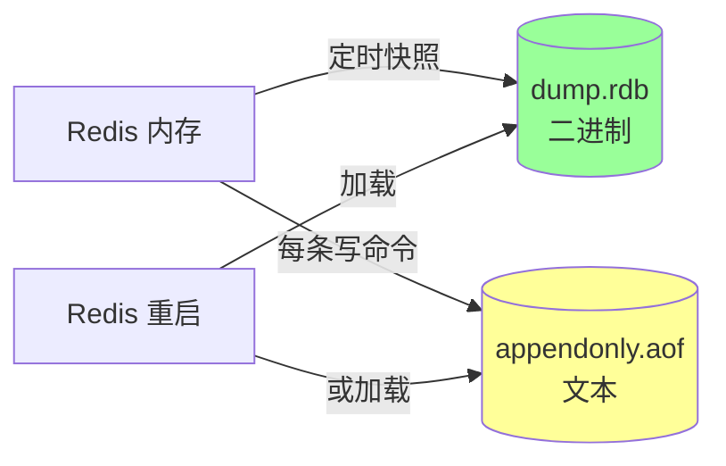
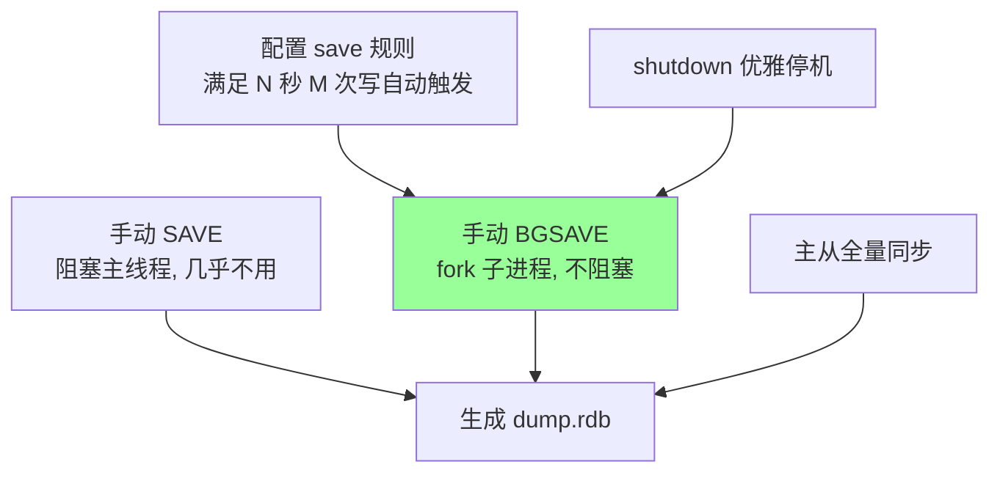
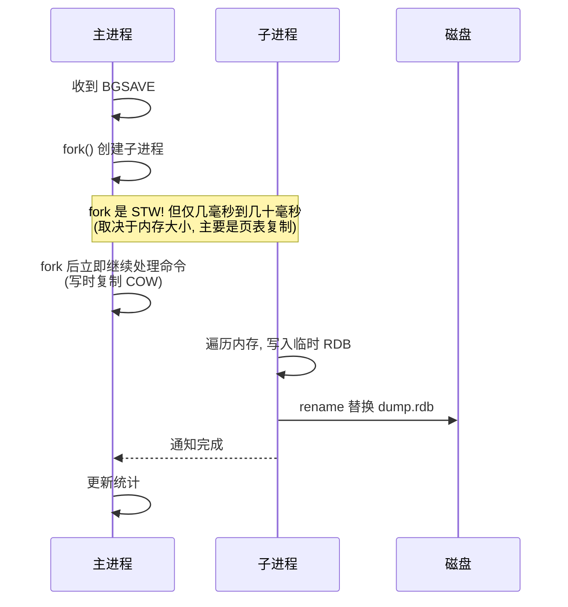
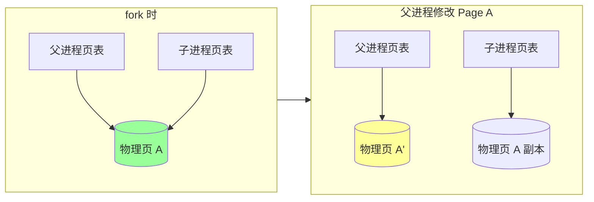
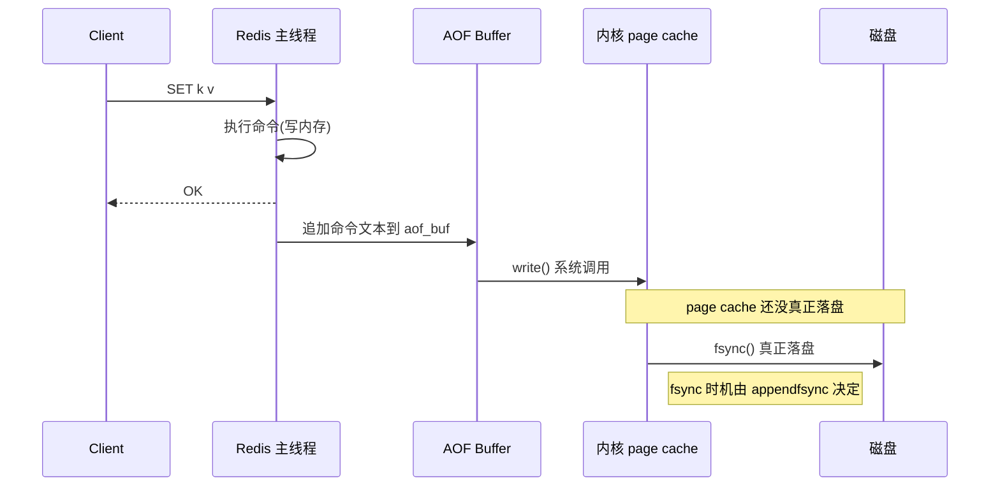
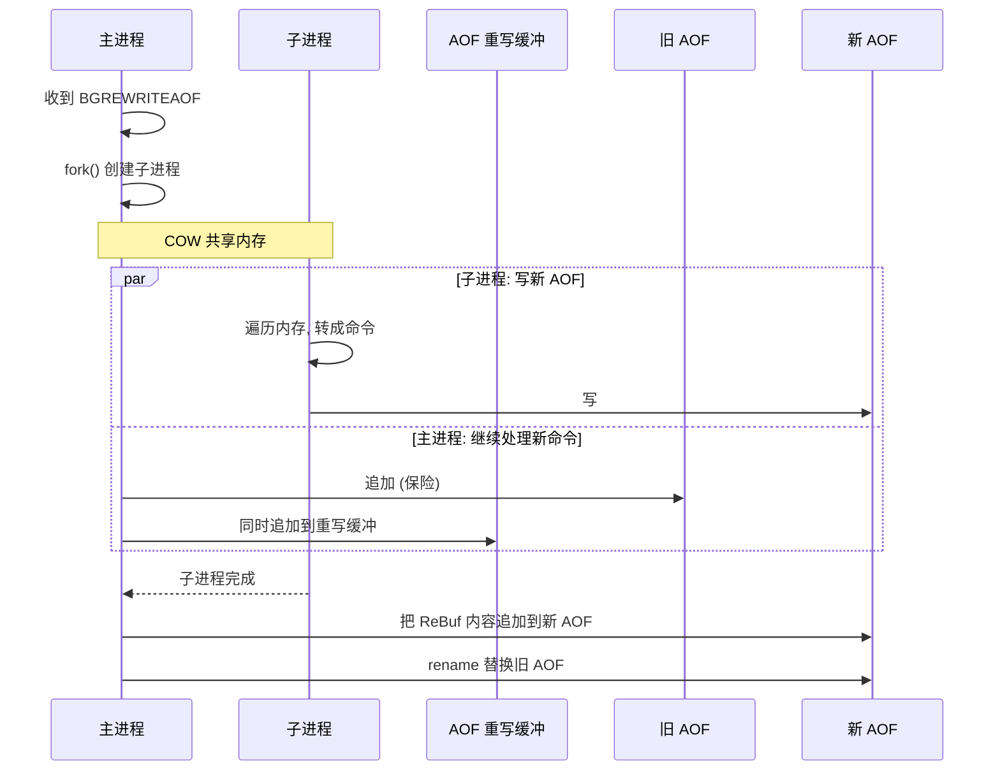
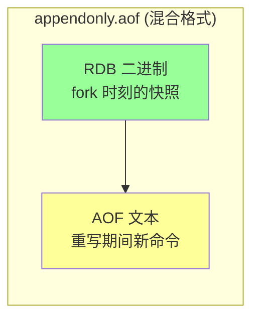
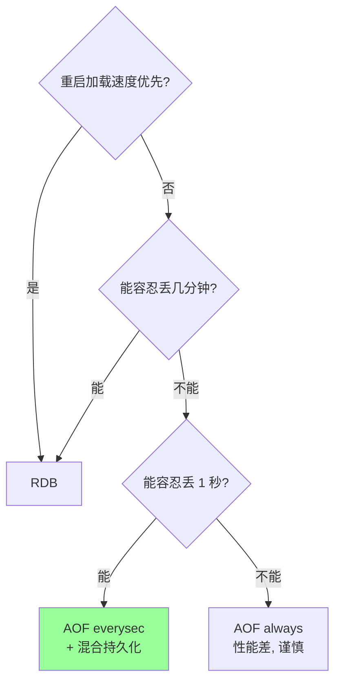

# Redis · 持久化

> RDB（快照） + AOF（日志） + 混合持久化 / fork 与 COW / 重写机制 / 选型与坑

## 一、为什么需要持久化

Redis 是内存数据库。**进程退出 → 数据全丢**。
持久化的目的：**重启后能恢复数据**。

两种方案：
- **RDB（Redis DataBase）**：定时把内存快照写到磁盘
- **AOF（Append Only File）**：把每条写命令追加到文件



## 二、RDB（快照）

### 2.1 触发方式



**默认 save 规则**（Redis 7+ 默认 `save 3600 1 300 100 60 10000`）：
```
save 3600 1     # 1 小时内 ≥1 次写
save 300 100    # 5 分钟内 ≥100 次写
save 60 10000   # 1 分钟内 ≥1 万次写
```

任意条件满足即触发 BGSAVE。

### 2.2 BGSAVE 流程（核心）



**关键**：
- **fork 一次**：父子进程共享物理内存（COW）
- 子进程**只读**遍历内存写文件
- 主进程继续处理写入，**写入触发 COW**复制相应页

### 2.3 写时复制（COW, Copy-On-Write）



- fork 时**只复制页表**，物理页共享
- 写入时**操作系统按页（4KB）复制**，父进程拿新页
- 子进程始终看到 fork 那一刻的**冻结快照**

**含义**：
- fork 后 RDB 内容 = fork 那一刻的内存
- 父进程的写入不影响 RDB 一致性
- **极端情况**：父进程写入很猛，几乎所有页都被复制 → 内存翻倍 → 可能 OOM

### 2.4 RDB 文件格式

二进制紧凑格式：

```
REDIS<version> | <db_selector> | <key, value, expire>* | EOF | <checksum>
```

- 含版本号、CRC64 校验
- 同种数据类型用专门编码（int 直接存，short string 用 listpack 等）
- 比 AOF **小很多**（字节级压缩）

### 2.5 RDB 优缺点

**优点**：
- **文件小**：紧凑二进制，比 AOF 小 5~10x
- **恢复快**：直接 mmap + 反序列化
- **冷备友好**：单文件方便备份/拷贝
- **fork 后子进程异步写**，不阻塞主线程（除 fork 瞬间）

**缺点**：
- **可能丢数据**：两次 BGSAVE 间的写入会丢（数十秒到几分钟）
- **fork 开销**：大内存（几十 GB）实例 fork 慢（页表复制）
- **不支持秒级一致性**

## 三、AOF（追加日志）

### 3.1 工作机制

每条**写命令**追加到 AOF 文件（含 SET、DEL、EXPIRE 等，读命令不写）。



### 3.2 三种 fsync 策略

```
appendfsync always     # 每条命令都 fsync, 最安全, 极慢
appendfsync everysec   # 每秒 fsync 一次, 默认, 推荐
appendfsync no         # 由 OS 决定 (~30s), 最快, 不安全
```

| 策略 | 性能 | 最多丢失 |
| --- | --- | --- |
| always | 慢（每写都 fsync） | 0 |
| everysec | 快 | 1 秒（重启时） |
| no | 极快 | 30 秒+ |

**实战默认 everysec**：性能和可靠性平衡。

### 3.3 AOF 重写（rewrite）

**问题**：AOF 文件随时间增长，重启加载慢。

**解决**：定期生成"等价但更短"的 AOF。

```
原始 AOF:
SET k 1
SET k 2
SET k 3
INCR counter
INCR counter

重写后:
SET k 3        # 只保留最终状态
SET counter 2  # 直接写最终值
```

### 3.4 BGREWRITEAOF 流程



**关键**：重写期间主进程的新写入既写旧 AOF（保险）也写**重写缓冲**，子进程完成后把缓冲里的命令补到新 AOF 末尾。

### 3.5 自动重写

```
auto-aof-rewrite-percentage 100   # 比上次重写后大 100% 触发
auto-aof-rewrite-min-size 64mb    # 至少 64MB
```

例：上次重写后 100MB，下次到 200MB 自动 BGREWRITEAOF。

### 3.6 AOF 优缺点

**优点**：
- **数据完整性高**：everysec 最多丢 1 秒
- **可读**：文本格式，必要时可手改
- **不易损坏**：损坏可用 `redis-check-aof --fix` 修复（截断到最后正确处）

**缺点**：
- **文件大**：5~10x 于 RDB（虽有重写）
- **恢复慢**：要重放所有命令，几十 GB AOF 重启可能几十分钟
- **fsync 性能**：always 模式很慢

## 四、混合持久化（4.0+）

```
aof-use-rdb-preamble yes  # 默认开启
```

**机制**：AOF 重写时，**前半段用 RDB 二进制格式**，重写期间的新命令用 AOF 追加。



**优势**：
- **加载快**（前半段是 RDB，秒级）
- **数据完整**（后半段是 AOF）
- **文件小**（RDB 部分压缩）

**等于 RDB + AOF 各取所长**。生产推荐开启。

## 五、选型决策



### 5.1 实战配置（推荐）

```
# RDB 兜底
save 3600 1
save 300 100

# AOF 主力
appendonly yes
appendfsync everysec
auto-aof-rewrite-percentage 100
auto-aof-rewrite-min-size 64mb

# 混合持久化 (4.0+)
aof-use-rdb-preamble yes
```

→ **既有 RDB 快照（备份/迁移友好），又有 AOF 实时性（最多丢 1 秒）**。

### 5.2 何时只 RDB

- 缓存场景，**数据可重新生成**（DB 是真源）
- 重启加载快是首要诉求
- 容忍数十秒到几分钟丢失

### 5.3 何时只 AOF

- 不能丢数据（金融、订单中间结果）
- 不在乎重启慢

### 5.4 何时都不开

- 纯缓存且重启不需要预热
- 容忍冷启动后慢（先打 DB 再缓存）

## 六、坑与排查

### 坑 1：fork 阻塞

**现象**：BGSAVE / BGREWRITEAOF 时 RT 突然飙高几十毫秒。

**原因**：fork 时**复制页表**（几十 GB 内存可能几十毫秒）。

**应对**：
- 单实例**控制内存**（< 10GB 友好，< 50GB 可控）
- 凌晨低峰期触发
- 主从架构下**关闭主节点持久化**，从节点做（持久化压力转移）

### 坑 2：COW 内存翻倍

**现象**：fork 后内存使用从 4GB 涨到 8GB。

**原因**：父进程写入触发 COW，最坏情况几乎所有页被复制。

**应对**：
- 物理内存**预留 50%+** 余量
- `vm.overcommit_memory=1`（允许超额申请，OOM 时再 kill）
- 控制单实例大小

### 坑 3：AOF 加载慢

**现象**：100GB AOF 重启加载几小时。

**应对**：
- 开**混合持久化**（前半段 RDB 加载秒级）
- 定期触发重写（自动或手动 `BGREWRITEAOF`）
- 单实例数据控制在 10GB 内（再大用 Cluster 分片）

### 坑 4：磁盘 IO 抖动影响 fsync

**现象**：偶发 RT 高，看 SLOWLOG 是写命令慢。

**原因**：`appendfsync everysec` 但 fsync 卡住时（磁盘 IO 高），主线程会等待。

**应对**：
- 用 SSD（NVMe 更好）
- 监控 disk util，超阈值告警
- 极端场景考虑 `appendfsync no`（接受丢更多数据）

### 坑 5：磁盘满

**现象**：Redis 进程报错或 OOM-killed。

**应对**：
- 监控磁盘空间
- AOF 文件 = 内存的 5~10x，预估磁盘
- 定期清理旧 RDB 备份

### 坑 6：bgsave 时主从全量同步触发

主从同步在没 backlog 时会触发 BGSAVE。**短时间多个全量同步会让父进程 fork 多次**。

**应对**：调大 `repl-backlog-size`（默认 1MB → 100MB+）。

### 坑 7：持久化文件损坏

**RDB**：CRC 校验失败，无法加载。
**AOF**：尾部命令不完整。

**修复**：
```bash
redis-check-rdb dump.rdb         # 检查
redis-check-aof --fix appendonly.aof  # 修复 AOF (会截断损坏部分)
```

## 七、高频面试题

**Q1：RDB 和 AOF 怎么选？**
- **缓存场景**（可重建）：RDB 即可
- **生产数据库场景**：AOF + 混合持久化
- **极致性能**：禁用持久化（接受冷启动）
- **金融级零容忍**：AOF always（性能差）

**主流方案：AOF everysec + 混合持久化**。

**Q2：BGSAVE 怎么做到不阻塞主线程？**
- **fork 子进程**：复制页表（仅 fork 瞬间几毫秒到几十毫秒阻塞）
- 子进程**只读**遍历内存写 RDB 文件
- 父进程**继续处理命令**，写入触发 COW（操作系统页级复制）
- 子进程看到的是 fork 那一刻的"冻结"快照

**Q3：写时复制（COW）是什么？**
fork 时父子进程共享物理内存（仅复制页表）。父进程写某页时，OS 把那页复制一份给父进程，子进程仍指向旧页。

最坏情况：父进程把所有页都改了 → 物理内存翻倍。

**Q4：AOF 三种 fsync 策略？**
- `always`：每写都 fsync，0 丢失，慢
- `everysec`：每秒 fsync，最多丢 1 秒，**默认推荐**
- `no`：OS 决定，~30 秒丢失风险，最快

**Q5：AOF 重写为什么需要？怎么做？**
**为什么**：AOF 持续追加，文件越来越大，重启加载慢。

**怎么做**：
- fork 子进程
- 子进程**遍历内存**生成"等价但短"的命令序列写到新 AOF
- 期间主进程的新命令同时写**旧 AOF + 重写缓冲**
- 子进程完成后，把重写缓冲追加到新 AOF，rename 替换旧文件

**Q6：什么是混合持久化？**

`aof-use-rdb-preamble yes`（4.0+ 默认开）。AOF 重写时：
- 前半段：RDB 二进制（fork 时的快照）
- 后半段：AOF 文本（重写期间的新命令）

**优势**：加载快（RDB 段）+ 数据完整（AOF 段）。

**Q7：fork 慢的根本原因？**
fork 系统调用要**复制页表**。页表大小约为内存的 1/512（每 4KB 页 8 字节 PTE）：
- 10GB 内存 → 20MB 页表
- 100GB 内存 → 200MB 页表（fork 可能几十毫秒）

**应对**：单实例 < 10GB，主从架构下让 slave 做持久化。

**Q8：Redis 重启加载 RDB 和 AOF 哪个优先？**
**AOF 优先**（如果开启）。因为 AOF 数据更新。

混合持久化下：加载混合 AOF = 前段 RDB + 后段命令重放，速度快又新。

**Q9：bgsave 期间挂了数据会丢吗？**
- bgsave 失败：旧的 dump.rdb 不变，子进程的临时文件丢弃
- 主进程在 fork 后崩溃：dump.rdb 不变（rename 是原子的）
- AOF 同时开着 → 没问题

只 RDB 的话：fork 失败丢失从上次成功 BGSAVE 到现在的所有写入。

**Q10：怎么做 Redis 数据迁移？**
- **小数据**：`MIGRATE` 命令（key 级）
- **整库**：BGSAVE 生成 RDB → scp → 目标机加载
- **大数据 + 不停机**：主从复制（先把目标作为 slave，同步完再切）
- **Cluster 间**：`redis-cli --cluster reshard`

## 八、面试加分点

- 解释清楚 fork + COW 的工作原理（页表复制 + 页级复制）
- 知道 fork 阻塞与内存大小相关（页表复制时间）
- 主从架构下持久化压力放从节点
- 混合持久化是 RDB + AOF 各取所长
- AOF 重写期间双写（旧 AOF + 重写缓冲）保证不丢
- everysec 实际可能丢 2 秒（fsync 在另一个线程，万一 fsync 卡住）
- 提到 `repl-backlog-size` 防止反复全量同步
- 知道用 `redis-check-aof --fix` 修复
