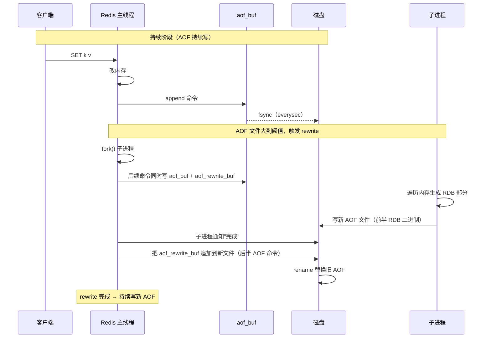
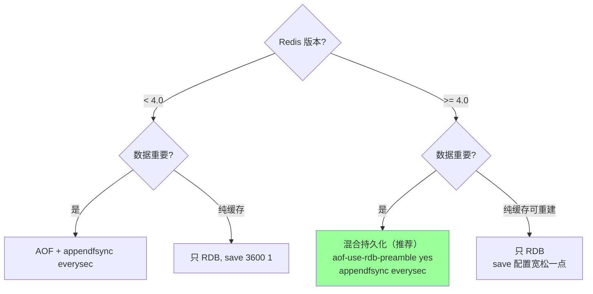
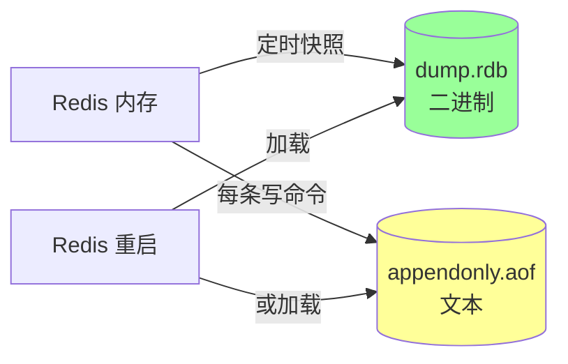
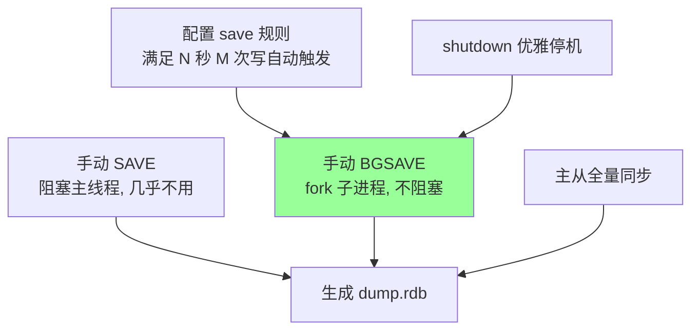
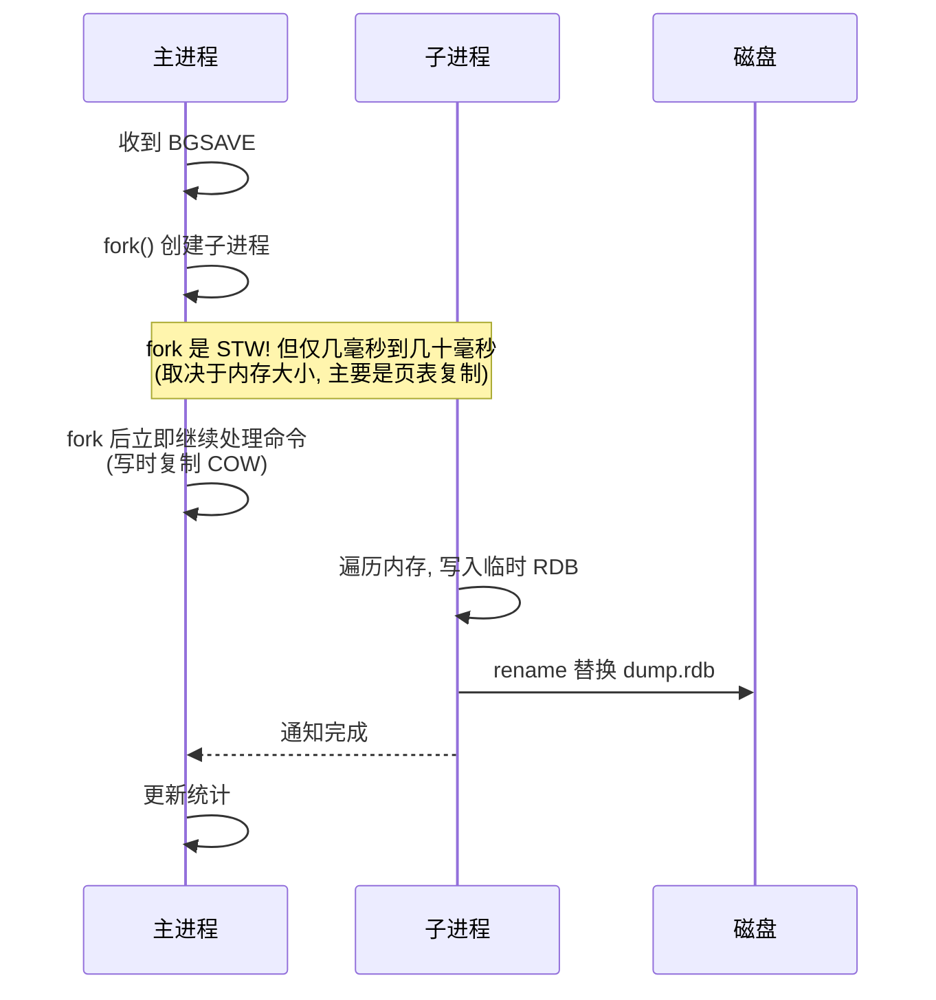
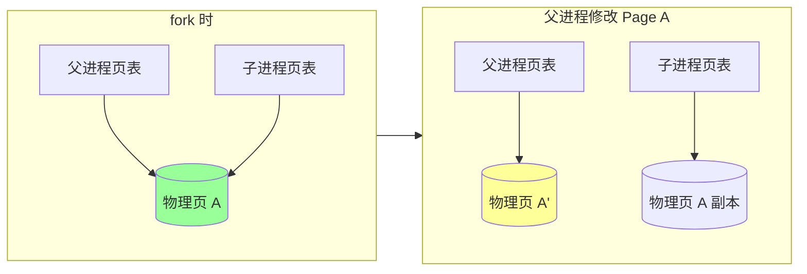
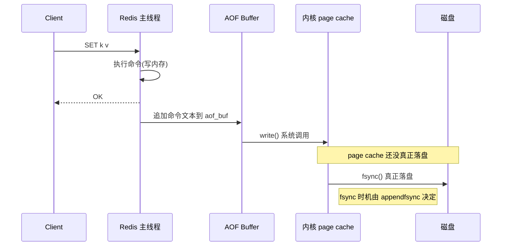
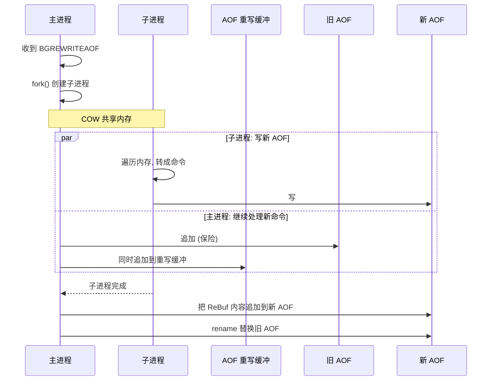
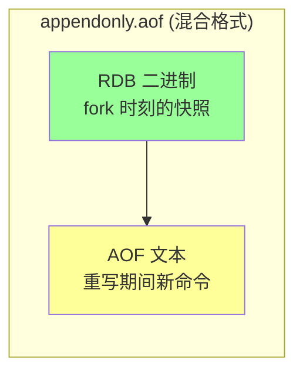
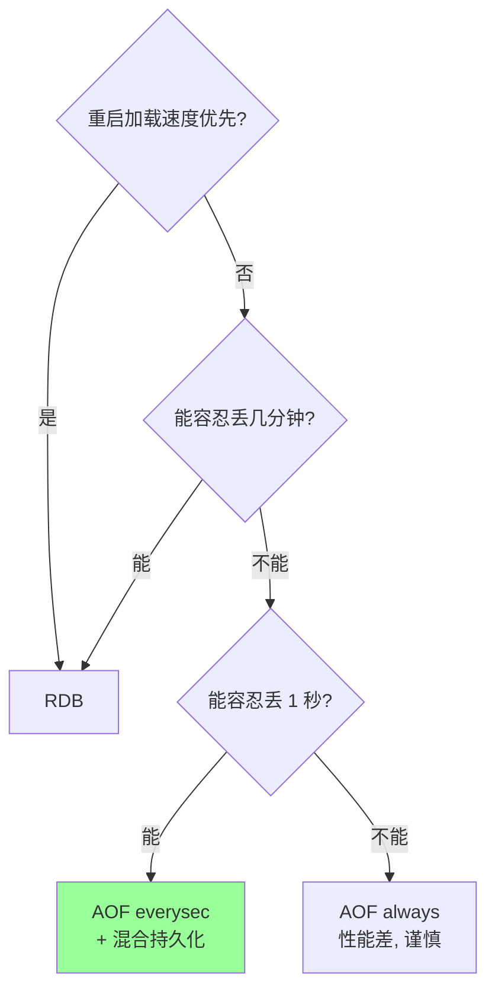

# Redis · 持久化

> RDB（快照） + AOF（日志） + 混合持久化 / fork 与 COW / 重写机制 / 选型与坑

## 〇、核心提炼（5 段式）

### 核心机制（4 条必背）

1. **RDB（快照）** - fork 子进程定期 BGSAVE，把内存全量数据写成二进制文件（紧凑 + 恢复快）
2. **AOF（日志）** - 每条写命令追加到 .aof 文件，按 fsync 策略落盘（默认 everysec）
3. **混合持久化（4.0+）** - AOF rewrite 时前半 RDB 二进制 + 后半增量 AOF 命令，融合两者优点
4. **fork + COW（写时复制）** - 子进程通过页表共享父进程内存，主进程写时才复制 → 避免阻塞主线程

### 核心本质（必懂）

> Redis 持久化的本质是 **"性能 vs 数据安全"的取舍**：
>
> - **RDB 是空间快照**：紧凑、恢复快，但**两次快照之间的数据会丢**
> - **AOF 是操作日志**：粒度细、安全性高，但**文件大、恢复慢**
> - **fork + COW 是核心技术**：让"持久化不阻塞业务"成为可能，但 **fork 时机不当会卡顿**（大内存 + 高写入时尤其严重）
>
> **CAP 视角**：
> - Redis 默认 RDB everysec → AP 选择（可丢秒级数据）
> - AOF appendfsync always → 接近强持久化但 TPS 损失 80%+
> - **业内主流**：RDB + AOF 混合 + everysec → "几乎不丢 + 性能可接受"
>
> **关键事实**：Redis 持久化永远不可能保证零丢失（除非每次写都 fsync，性能崩盘）。

### 完整流程（面试必背）

```
RDB BGSAVE 完整流程:
  1. 主进程触发 BGSAVE（save 配置 / SHUTDOWN / 主从全量同步）
  2. 主进程 fork 子进程
     - fork 系统调用复制页表（不复制实际数据）
     - 父子进程指向相同物理页
  3. 子进程遍历内存，写入临时 RDB 文件
  4. 父进程继续处理请求
     - 修改某页时触发 COW：复制该页给子进程旧版本
     - 父进程在新页上写入
  5. 子进程写完 → 原子替换旧 RDB 文件
  6. 子进程退出，主进程清理

AOF 写入完整流程:
  1. 主进程执行写命令
  2. 命令追加到 aof_buf 内存缓冲
  3. 按 appendfsync 策略调用 fsync:
     - always: 每条命令 fsync（最安全，最慢）
     - everysec: 每秒 fsync（默认，平衡）
     - no: 由 OS 决定（最快，丢失最多）
  4. AOF 文件持续增长 → 定期 rewrite
     - fork 子进程
     - 子进程读当前内存生成最小命令集
     - rewrite 期间新命令进 aof_rewrite_buf
     - 子进程完成 → 主进程把 buf 追加 → 替换旧文件

恢复流程:
  - 同时存在 RDB + AOF → 优先 AOF（更全）
  - 只有 RDB → 加载 RDB
  - 只有 AOF → 重放 AOF
  - 都没有 → 空数据库
```

### 4 条核心机制 - 逐点讲透

#### 1. RDB（紧凑 + 快恢复）

```
触发方式:
  - save N M: N 秒内 M 次写就触发（如 save 60 10000）
  - BGSAVE 命令: 手动触发
  - SHUTDOWN: 关机前
  - 主从全量同步: 主节点为新从节点生成

文件格式:
  二进制 + LZF 压缩
  比 AOF 小 5-10x

优势:
  - 文件小 → 备份 / 传输快
  - 加载快（直接内存映射）
  - 适合大数据量 + 容忍丢秒级数据

劣势:
  - 两次快照之间的数据会丢（极端情况丢几分钟）
  - fork 大内存进程会卡顿（毫秒级到秒级）
```

#### 2. AOF（细粒度 + 安全）

```
3 种 fsync 策略对比:

| 策略       | 性能       | 数据安全           | 场景       |
| ---------- | ---------- | ------------------ | ---------- |
| always     | 最差       | 不丢（理论上）     | 金融/极严  |
| everysec   | 好（默认） | 最多丢 1 秒        | 主流       |
| no         | 最好       | 由 OS 决定（30s+） | 缓存场景   |

文件持续增长 → AOF rewrite:
  - 不读旧 AOF，而是读当前内存生成最小命令集
  - 例: 100 次 INCR counter → rewrite 为 SET counter 100
  - rewrite 期间新命令同时写到 aof_buf 和 aof_rewrite_buf
  - 完成时合并到新文件
```

#### 3. 混合持久化（Redis 4.0+）

```
开启:
  aof-use-rdb-preamble yes（默认）

文件结构:
  [RDB 全量二进制部分] + [增量 AOF 命令]

优势:
  - 加载快（前半 RDB 二进制）
  - 数据安全（后半 AOF 增量）
  - 文件大小适中

劣势:
  - 兼容性差（老版 Redis 读不了）
```

#### 4. fork + COW（避免阻塞的核心）

```
fork() 系统调用:
  - 创建子进程
  - 不复制实际内存，只复制页表
  - 父子进程共享物理页

写时复制（COW）:
  父进程修改某页 → OS 检测到该页被共享 → 复制一份给父进程 → 父进程在新页写
  → 子进程仍看老页（快照一致性）

性能影响:
  - fork 本身: O(进程页表大小) → 内存越大越慢（10GB 内存 fork ~100ms）
  - COW 期间: 父进程写得越多，复制开销越大（极端可放大 2x 内存）
  - 对策: 关闭 transparent huge pages（THP），用 jemalloc

致命场景:
  - 大内存 + 高写入 + RDB 频繁 → fork 不断 → 主线程频繁卡顿
  - → 监控 latest_fork_usec
  - → 调整 save 策略 / 拆分实例
```

### 一句话总结

> Redis 持久化的核心是：**RDB 全量快照 + AOF 增量日志 + 混合持久化 + fork + COW 避免阻塞**，
> 本质是**性能 vs 数据安全的取舍**（RDB 紧凑快恢复但丢秒级，AOF 安全但文件大恢复慢）。
> 业内主流是 **RDB + AOF 混合 + everysec**，"几乎不丢 + 性能可接受"。
> 零丢失不可能（appendfsync always 损失 80%+ TPS）。

---

## 〇.5 多概念对比：RDB vs AOF vs 混合（D 模板）

### 一句话定位

| 方案 | 一句话定位 |
| --- | --- |
| **RDB（快照）** | **某时刻全量数据的二进制快照**，紧凑、恢复快，但**两次快照之间数据可能丢** |
| **AOF（日志）** | **每条写命令追加到文件**，细粒度、安全性高，但**文件大、恢复慢** |
| **混合（RDB+AOF）** | **RDB 全量 + 增量 AOF 命令**，融合两者优点，是 **4.0+ 推荐方案** |

### 多维度对比（15 维度，必背）

| 维度 | RDB | AOF | 混合 |
| --- | --- | --- | --- |
| **数据形式** | 二进制快照（内存 dump）| 命令日志（追加写）| 前半 RDB + 后半 AOF |
| **触发时机** | save 配置 / BGSAVE / SHUTDOWN | 每条写命令 | AOF rewrite 时 |
| **写入方式** | fork 子进程 + 全量遍历内存 | append 到 aof_buf → fsync | rewrite 时 fork + 增量 append |
| **文件大小** | 小（LZF 压缩，5-10x 小于 AOF）| 大（每条命令明文）| 中（RDB 紧凑 + 少量增量）|
| **恢复速度** | **快**（直接 mmap 加载）| 慢（重放百万命令）| **快**（前半 RDB） |
| **数据安全性** | 低（两次快照间丢）| 高（everysec 最多丢 1s）| 高（与 AOF 相同）|
| **fsync 策略** | 不涉及（一次性写完文件）| always / everysec / no | rewrite 完成时 + 后续 AOF 同 AOF |
| **fork 阻塞** | 触发时 fork（大内存卡顿）| 仅 rewrite 时 fork | 仅 rewrite 时 fork |
| **CPU 占用** | 子进程压缩 → CPU 短峰 | 持续写盘 → CPU 平稳 | 同 AOF |
| **磁盘 IO 模式** | 短时大量顺序写 | 持续顺序写 + fsync | rewrite 大写 + 持续小写 |
| **主从同步用途** | **全量同步用 RDB**（PSYNC 全量）| 不用于主从 | 全量同步仍用 RDB |
| **加载兼容性** | 高（跨版本好）| 高 | **低**（老版 Redis 不识别）|
| **适用版本** | 所有 | 1.0+ | 4.0+ |
| **典型场景** | 备份 / 灾备 / 主从全量同步 | 安全要求高的业务 | **生产首选**（4.0+）|
| **配置参数** | `save 3600 1` | `appendonly yes` + `appendfsync everysec` | `aof-use-rdb-preamble yes`（默认）|

### 协作时序图（生产典型配置）



### 职责分层（数据流视角）

```
┌─────────────────────────────────────────────────────┐
│                  Redis 主进程                         │
│  ┌───────────────────────────────────────────────┐  │
│  │           内存数据库（dict + skiplist）         │  │
│  │                       │                        │  │
│  │       写命令          │                        │  │
│  │           ↓                                    │  │
│  │      ┌────────┐                                │  │
│  │      │ aof_buf │ ───────────► fsync ────► AOF 文件│
│  │      └────────┘                                │  │
│  └──────────┼────────────────────────────────────┘  │
│             │ fork                                  │
│  ┌──────────▼────────────────────────────────────┐  │
│  │    子进程（BGSAVE / AOF Rewrite）              │  │
│  │    遍历父进程内存（COW 共享页）                  │  │
│  │           ↓                                    │  │
│  │     生成 RDB / 重写 AOF                         │  │
│  └────────────────────────────────────────────────┘  │
└─────────────────────────────────────────────────────┘

关键设计:
  - 主进程不阻塞业务（fork 子进程异步写盘）
  - 写时复制（COW）让父子进程共享内存
  - 主进程继续接请求 → 修改的页 OS 自动复制
```

### 缺一不可分析（每个角色为什么必须有）

| 假设 | 后果 |
| --- | --- |
| **没 RDB** | 全量备份 / 主从同步失去高效手段，AOF 文件极大（重放慢 + 体积大）|
| **没 AOF** | 数据安全性差（依赖快照间隔，最多丢分钟级数据）|
| **没混合** | 用户必须二选一（RDB 安全性差 / AOF 恢复慢），无法兼得 |
| **没 fork + COW** | 主线程被阻塞 → 业务卡几秒到几分钟（大内存场景）|
| **没 fsync 策略** | 数据完全在 OS PageCache → 宕机丢秒级到分钟级 |

### fsync 策略深度对比（AOF 三种）

| 策略 | TPS 损失 | 最坏丢失 | 适用场景 |
| --- | --- | --- | --- |
| **always**（每条 fsync）| 80%+ | 0（理论上）| 金融 / 极严苛 |
| **everysec**（每秒 fsync，默认）| 5-10% | 1 秒 | **主流** |
| **no**（OS 决定）| 0 | 30s+ | 缓存场景（可重建）|

### 怎么选（决策树）



**生产推荐配置（Redis 4.0+）**：

```conf
# 混合持久化（默认开启）
aof-use-rdb-preamble yes

# AOF
appendonly yes
appendfsync everysec
auto-aof-rewrite-percentage 100   # AOF 大小翻倍触发 rewrite
auto-aof-rewrite-min-size 64mb

# RDB（保留，主从全量同步要用）
save 3600 1                       # 1 小时 1 次写 → 触发
save 300 100                      # 5 分钟 100 次写
save 60 10000                     # 1 分钟 1w 次写
```

**反模式（生产不要用）**：

```
❌ appendfsync always: TPS 损失太大（80%+）
❌ 只 RDB + save 配置稀疏: 数据丢失风险大
❌ 只 AOF + 没 rewrite: AOF 文件无限增长
❌ no-appendfsync-on-rewrite=yes: rewrite 时不 fsync → 极端可能丢更多
❌ 大内存 + 频繁 save: fork 抖动严重
```

### 实战指标（必看）

```bash
# RDB
redis-cli INFO persistence | grep rdb_
  rdb_changes_since_last_save: 距上次 save 后写命令数
  rdb_bgsave_in_progress: 0/1（是否正在 BGSAVE）
  rdb_last_bgsave_time_sec: 上次 BGSAVE 耗时
  rdb_last_bgsave_status: ok/err

# AOF
redis-cli INFO persistence | grep aof_
  aof_enabled: 1
  aof_rewrite_in_progress: 0/1
  aof_last_rewrite_time_sec: 上次 rewrite 耗时
  aof_current_size: 当前 AOF 大小

# fork 监控（关键）
redis-cli INFO stats | grep latest_fork_usec
  latest_fork_usec: 最近一次 fork 耗时（微秒）
  > 1_000_000（1 秒）→ 业务可感知卡顿
  → 调整 save 策略 / 减小实例
```

### 一句话总结（D 模板专属）

> RDB / AOF / 混合的核心是 **"性能 vs 数据安全"的三档取舍**：
> RDB 快但丢分钟级 / AOF 安全但文件大恢复慢 / 混合（4.0+）融合两者，是**生产首选**。
> **fork + COW** 让持久化不阻塞主线程，**fsync 策略**决定数据丢失窗口（**everysec 是 95% 业务的最佳点**）。
> **缺一不可**：没 RDB → 主从同步效率差；没 AOF → 数据安全差；没 COW → 业务卡顿。
> **金融场景**仍建议主从 + 跨地域备份（持久化只是单机保障）。

---

## 一、为什么需要持久化

Redis 是内存数据库。**进程退出 → 数据全丢**。
持久化的目的：**重启后能恢复数据**。

两种方案：
- **RDB（Redis DataBase）**：定时把内存快照写到磁盘
- **AOF（Append Only File）**：把每条写命令追加到文件



## 二、RDB（快照）

### 2.1 触发方式



**默认 save 规则**（Redis 7+ 默认 `save 3600 1 300 100 60 10000`）：
```
save 3600 1     # 1 小时内 ≥1 次写
save 300 100    # 5 分钟内 ≥100 次写
save 60 10000   # 1 分钟内 ≥1 万次写
```

任意条件满足即触发 BGSAVE。

### 2.2 BGSAVE 流程（核心）



**关键**：
- **fork 一次**：父子进程共享物理内存（COW）
- 子进程**只读**遍历内存写文件
- 主进程继续处理写入，**写入触发 COW**复制相应页

### 2.3 写时复制（COW, Copy-On-Write）



- fork 时**只复制页表**，物理页共享
- 写入时**操作系统按页（4KB）复制**，父进程拿新页
- 子进程始终看到 fork 那一刻的**冻结快照**

**含义**：
- fork 后 RDB 内容 = fork 那一刻的内存
- 父进程的写入不影响 RDB 一致性
- **极端情况**：父进程写入很猛，几乎所有页都被复制 → 内存翻倍 → 可能 OOM

### 2.4 RDB 文件格式

二进制紧凑格式：

```
REDIS<version> | <db_selector> | <key, value, expire>* | EOF | <checksum>
```

- 含版本号、CRC64 校验
- 同种数据类型用专门编码（int 直接存，short string 用 listpack 等）
- 比 AOF **小很多**（字节级压缩）

### 2.5 RDB 优缺点

**优点**：
- **文件小**：紧凑二进制，比 AOF 小 5~10x
- **恢复快**：直接 mmap + 反序列化
- **冷备友好**：单文件方便备份/拷贝
- **fork 后子进程异步写**，不阻塞主线程（除 fork 瞬间）

**缺点**：
- **可能丢数据**：两次 BGSAVE 间的写入会丢（数十秒到几分钟）
- **fork 开销**：大内存（几十 GB）实例 fork 慢（页表复制）
- **不支持秒级一致性**

## 三、AOF（追加日志）

### 3.1 工作机制

每条**写命令**追加到 AOF 文件（含 SET、DEL、EXPIRE 等，读命令不写）。



### 3.2 三种 fsync 策略

```
appendfsync always     # 每条命令都 fsync, 最安全, 极慢
appendfsync everysec   # 每秒 fsync 一次, 默认, 推荐
appendfsync no         # 由 OS 决定 (~30s), 最快, 不安全
```

| 策略 | 性能 | 最多丢失 |
| --- | --- | --- |
| always | 慢（每写都 fsync） | 0 |
| everysec | 快 | 1 秒（重启时） |
| no | 极快 | 30 秒+ |

**实战默认 everysec**：性能和可靠性平衡。

### 3.3 AOF 重写（rewrite）

**问题**：AOF 文件随时间增长，重启加载慢。

**解决**：定期生成"等价但更短"的 AOF。

```
原始 AOF:
SET k 1
SET k 2
SET k 3
INCR counter
INCR counter

重写后:
SET k 3        # 只保留最终状态
SET counter 2  # 直接写最终值
```

### 3.4 BGREWRITEAOF 流程



**关键**：重写期间主进程的新写入既写旧 AOF（保险）也写**重写缓冲**，子进程完成后把缓冲里的命令补到新 AOF 末尾。

### 3.5 自动重写

```
auto-aof-rewrite-percentage 100   # 比上次重写后大 100% 触发
auto-aof-rewrite-min-size 64mb    # 至少 64MB
```

例：上次重写后 100MB，下次到 200MB 自动 BGREWRITEAOF。

### 3.6 AOF 优缺点

**优点**：
- **数据完整性高**：everysec 最多丢 1 秒
- **可读**：文本格式，必要时可手改
- **不易损坏**：损坏可用 `redis-check-aof --fix` 修复（截断到最后正确处）

**缺点**：
- **文件大**：5~10x 于 RDB（虽有重写）
- **恢复慢**：要重放所有命令，几十 GB AOF 重启可能几十分钟
- **fsync 性能**：always 模式很慢

## 四、混合持久化（4.0+）

```
aof-use-rdb-preamble yes  # 默认开启
```

**机制**：AOF 重写时，**前半段用 RDB 二进制格式**，重写期间的新命令用 AOF 追加。



**优势**：
- **加载快**（前半段是 RDB，秒级）
- **数据完整**（后半段是 AOF）
- **文件小**（RDB 部分压缩）

**等于 RDB + AOF 各取所长**。生产推荐开启。

## 五、选型决策



### 5.1 实战配置（推荐）

```
# RDB 兜底
save 3600 1
save 300 100

# AOF 主力
appendonly yes
appendfsync everysec
auto-aof-rewrite-percentage 100
auto-aof-rewrite-min-size 64mb

# 混合持久化 (4.0+)
aof-use-rdb-preamble yes
```

→ **既有 RDB 快照（备份/迁移友好），又有 AOF 实时性（最多丢 1 秒）**。

### 5.2 何时只 RDB

- 缓存场景，**数据可重新生成**（DB 是真源）
- 重启加载快是首要诉求
- 容忍数十秒到几分钟丢失

### 5.3 何时只 AOF

- 不能丢数据（金融、订单中间结果）
- 不在乎重启慢

### 5.4 何时都不开

- 纯缓存且重启不需要预热
- 容忍冷启动后慢（先打 DB 再缓存）

## 六、坑与排查

### 坑 1：fork 阻塞

**现象**：BGSAVE / BGREWRITEAOF 时 RT 突然飙高几十毫秒。

**原因**：fork 时**复制页表**（几十 GB 内存可能几十毫秒）。

**应对**：
- 单实例**控制内存**（< 10GB 友好，< 50GB 可控）
- 凌晨低峰期触发
- 主从架构下**关闭主节点持久化**，从节点做（持久化压力转移）

### 坑 2：COW 内存翻倍

**现象**：fork 后内存使用从 4GB 涨到 8GB。

**原因**：父进程写入触发 COW，最坏情况几乎所有页被复制。

**应对**：
- 物理内存**预留 50%+** 余量
- `vm.overcommit_memory=1`（允许超额申请，OOM 时再 kill）
- 控制单实例大小

### 坑 3：AOF 加载慢

**现象**：100GB AOF 重启加载几小时。

**应对**：
- 开**混合持久化**（前半段 RDB 加载秒级）
- 定期触发重写（自动或手动 `BGREWRITEAOF`）
- 单实例数据控制在 10GB 内（再大用 Cluster 分片）

### 坑 4：磁盘 IO 抖动影响 fsync

**现象**：偶发 RT 高，看 SLOWLOG 是写命令慢。

**原因**：`appendfsync everysec` 但 fsync 卡住时（磁盘 IO 高），主线程会等待。

**应对**：
- 用 SSD（NVMe 更好）
- 监控 disk util，超阈值告警
- 极端场景考虑 `appendfsync no`（接受丢更多数据）

### 坑 5：磁盘满

**现象**：Redis 进程报错或 OOM-killed。

**应对**：
- 监控磁盘空间
- AOF 文件 = 内存的 5~10x，预估磁盘
- 定期清理旧 RDB 备份

### 坑 6：bgsave 时主从全量同步触发

主从同步在没 backlog 时会触发 BGSAVE。**短时间多个全量同步会让父进程 fork 多次**。

**应对**：调大 `repl-backlog-size`（默认 1MB → 100MB+）。

### 坑 7：持久化文件损坏

**RDB**：CRC 校验失败，无法加载。
**AOF**：尾部命令不完整。

**修复**：
```bash
redis-check-rdb dump.rdb         # 检查
redis-check-aof --fix appendonly.aof  # 修复 AOF (会截断损坏部分)
```

## 七、高频面试题

**Q1：RDB 和 AOF 怎么选？**
- **缓存场景**（可重建）：RDB 即可
- **生产数据库场景**：AOF + 混合持久化
- **极致性能**：禁用持久化（接受冷启动）
- **金融级零容忍**：AOF always（性能差）

**主流方案：AOF everysec + 混合持久化**。

**Q2：BGSAVE 怎么做到不阻塞主线程？**
- **fork 子进程**：复制页表（仅 fork 瞬间几毫秒到几十毫秒阻塞）
- 子进程**只读**遍历内存写 RDB 文件
- 父进程**继续处理命令**，写入触发 COW（操作系统页级复制）
- 子进程看到的是 fork 那一刻的"冻结"快照

**Q3：写时复制（COW）是什么？**
fork 时父子进程共享物理内存（仅复制页表）。父进程写某页时，OS 把那页复制一份给父进程，子进程仍指向旧页。

最坏情况：父进程把所有页都改了 → 物理内存翻倍。

**Q4：AOF 三种 fsync 策略？**
- `always`：每写都 fsync，0 丢失，慢
- `everysec`：每秒 fsync，最多丢 1 秒，**默认推荐**
- `no`：OS 决定，~30 秒丢失风险，最快

**Q5：AOF 重写为什么需要？怎么做？**
**为什么**：AOF 持续追加，文件越来越大，重启加载慢。

**怎么做**：
- fork 子进程
- 子进程**遍历内存**生成"等价但短"的命令序列写到新 AOF
- 期间主进程的新命令同时写**旧 AOF + 重写缓冲**
- 子进程完成后，把重写缓冲追加到新 AOF，rename 替换旧文件

**Q6：什么是混合持久化？**

`aof-use-rdb-preamble yes`（4.0+ 默认开）。AOF 重写时：
- 前半段：RDB 二进制（fork 时的快照）
- 后半段：AOF 文本（重写期间的新命令）

**优势**：加载快（RDB 段）+ 数据完整（AOF 段）。

**Q7：fork 慢的根本原因？**
fork 系统调用要**复制页表**。页表大小约为内存的 1/512（每 4KB 页 8 字节 PTE）：
- 10GB 内存 → 20MB 页表
- 100GB 内存 → 200MB 页表（fork 可能几十毫秒）

**应对**：单实例 < 10GB，主从架构下让 slave 做持久化。

**Q8：Redis 重启加载 RDB 和 AOF 哪个优先？**
**AOF 优先**（如果开启）。因为 AOF 数据更新。

混合持久化下：加载混合 AOF = 前段 RDB + 后段命令重放，速度快又新。

**Q9：bgsave 期间挂了数据会丢吗？**
- bgsave 失败：旧的 dump.rdb 不变，子进程的临时文件丢弃
- 主进程在 fork 后崩溃：dump.rdb 不变（rename 是原子的）
- AOF 同时开着 → 没问题

只 RDB 的话：fork 失败丢失从上次成功 BGSAVE 到现在的所有写入。

**Q10：怎么做 Redis 数据迁移？**
- **小数据**：`MIGRATE` 命令（key 级）
- **整库**：BGSAVE 生成 RDB → scp → 目标机加载
- **大数据 + 不停机**：主从复制（先把目标作为 slave，同步完再切）
- **Cluster 间**：`redis-cli --cluster reshard`

## 八、面试加分点

- 解释清楚 fork + COW 的工作原理（页表复制 + 页级复制）
- 知道 fork 阻塞与内存大小相关（页表复制时间）
- 主从架构下持久化压力放从节点
- 混合持久化是 RDB + AOF 各取所长
- AOF 重写期间双写（旧 AOF + 重写缓冲）保证不丢
- everysec 实际可能丢 2 秒（fsync 在另一个线程，万一 fsync 卡住）
- 提到 `repl-backlog-size` 防止反复全量同步
- 知道用 `redis-check-aof --fix` 修复
