# Redis · 复制与集群

> 主从复制 / 哨兵高可用 / Cluster 分片（16384 slot） / 脑裂 / 故障转移 / 选型

## 一、三级架构演进

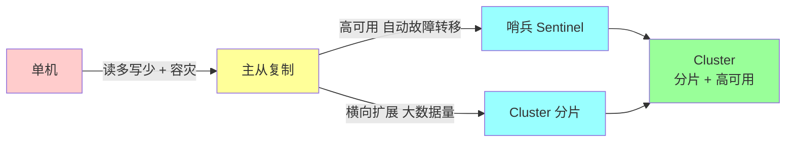

| 方案 | 解决 | 局限 |
| --- | --- | --- |
| 单机 | 简单 | 容量、可用性、读吞吐 |
| 主从 | 读扩展 + 容灾 | 写仍单机；故障要人工切 |
| 哨兵 | 自动故障转移 | 写仍单机；存储仍单机 |
| Cluster | 容量 + 写吞吐扩展 + HA | 复杂；跨 slot 操作受限 |

## 二、主从复制

### 2.1 拓扑

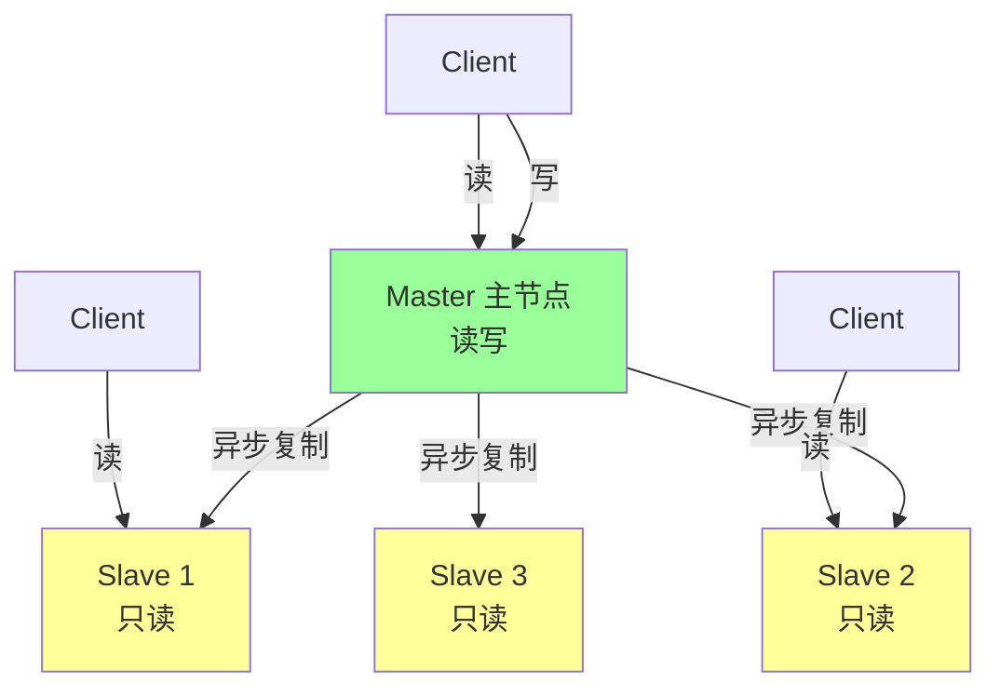

**核心**：
- 主**只能一个**，从**可多个**
- 默认**异步复制**（性能优先；可能丢数据）
- 从节点**默认只读**
- 复制是**单向**的（主→从），从节点不能写

### 2.2 全量 vs 增量复制

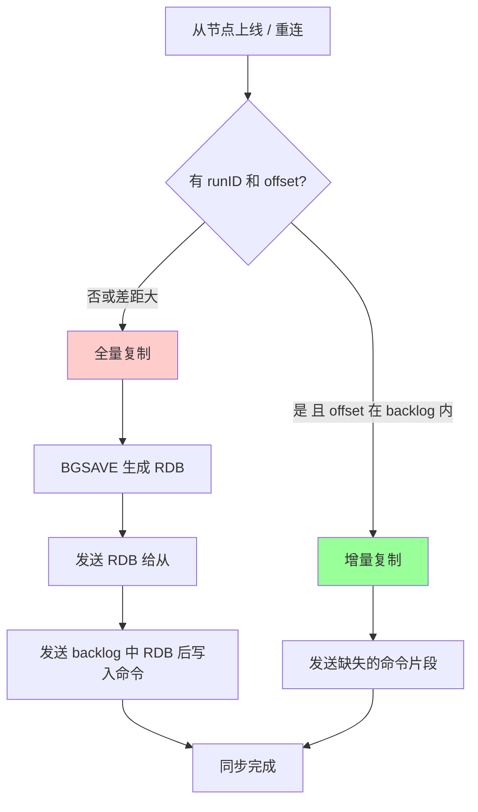

**全量同步流程**：

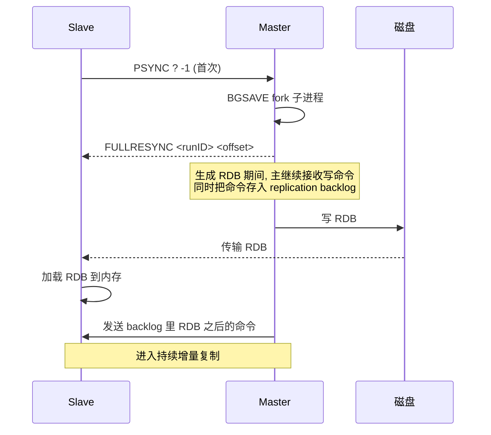

**增量同步**：从节点 PSYNC 携带上次 offset，主节点检查 **replication backlog**（环形缓冲，默认 1MB）：
- offset 还在 backlog 里 → 推送缺失部分
- offset 已被覆盖 → 退化为全量同步

### 2.3 关键参数

```
replicaof <master-ip> <master-port>     # 配置主节点 (从节点配���)
repl-backlog-size 100mb                  # 增量复制环形缓冲, 默认 1MB
repl-backlog-ttl 3600                    # 无从节点连接多久后释放 backlog
repl-timeout 60                          # 复制超时
masterauth <password>                    # 主节点密码
replica-read-only yes                    # 从只读 (默认)
replica-serve-stale-data yes             # 主断开时仍服务陈旧数据
```

**`repl-backlog-size` 是关键**：默认 1MB 太小，主从断开几秒就要全量。生产建议 64MB ~ 256MB。

### 2.4 复制风暴

**问题**：1 主带太多从（如 10 个），主节点同时给所有从发 RDB → 网络打爆。

**方案**：**树形复制**

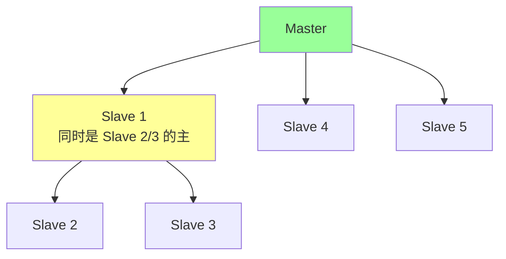

二级从挂在一级从下面，分担主节点压力。

### 2.5 主从复制为什么异步？

**性能 vs 一致性**的权衡：
- **异步**：主写完立即返回，从节点稍后追上 → 可能丢数据，但延迟低
- **同步**：主等所有从写完才返回 → 不丢，但延迟高、可用性差（一个从慢全慢）

Redis 选**异步**为默认。提供 `WAIT n timeout` 命令做"半同步"：等至少 n 个从确认。

### 2.6 主从场景

- **读写分离**：读请求走从节点（注意从可能延迟）
- **数据冗余**：主挂了从顶上（需哨兵自动化）
- **持久化分离**：主关持久化，从开持久化（减轻主 fork 压力）
- **数据恢复**：从是热备
- **跨机房灾备**：异地从节点

## 三、哨兵（Sentinel）

### 3.1 解决什么问题

主从架构下：**主挂了怎么办？**
- 手动切？凌晨告警 → 起床改配置 → 重启所有客户端连接
- **哨兵**：自动监控 + 自动故障转移 + 通知客户端

### 3.2 拓扑

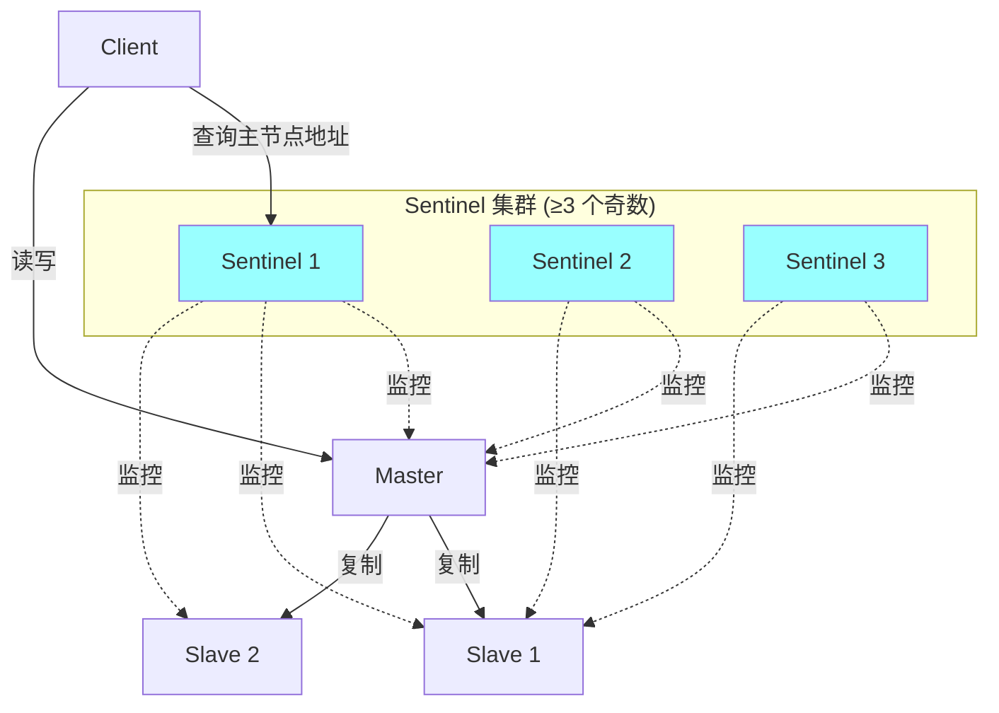

**哨兵职责**（4 个）：
1. **监控**：定期 PING 主从节点
2. **故障判定**：主观下线（SDOWN）→ 客观下线（ODOWN）
3. **故障转移**：选新主 + 让其他从复制新主 + 通知客户端
4. **配置中心**：客户端通过哨兵查找当前主节点

### 3.3 故障判定


- **SDOWN（主观下线）**：单个哨兵在 `down-after-milliseconds`（默认 30s）内 ping 不通
- **ODOWN（客观下线）**：超过 quorum（配置数，常 N/2+1）个哨兵都说下线 → 触发故障转移

### 3.4 故障转移流程

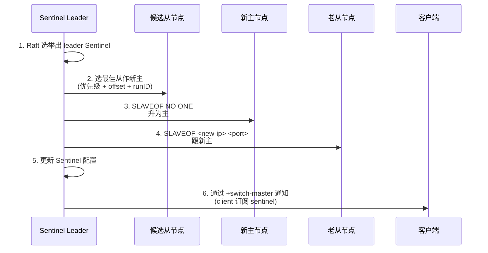

**新主选择**：
1. 排除下线 / 长时间不通的从
2. 选 **slave-priority** 最大的（默认 100，0 = 不参选）
3. 选 **复制 offset 最大**的（数据最新）
4. 选 **runID 最小**的（稳定）

### 3.5 哨兵数量为什么奇数？

**Quorum 需要多数派**：
- 3 个：容忍 1 个挂
- 5 个：容忍 2 个挂
- 偶数（如 4）：容忍 1 个挂（和 3 个一样），但成本更高 → 不划算

最小 3 个，常用 3 或 5。

### 3.6 哨兵局限

- **写仍单机**：哨兵只解决高可用，没解决写扩展
- **存储仍单机**：单主上限是单机内存
- 大规模业务用 **Cluster**

## 四、Redis Cluster（分片集群）

### 4.1 拓扑

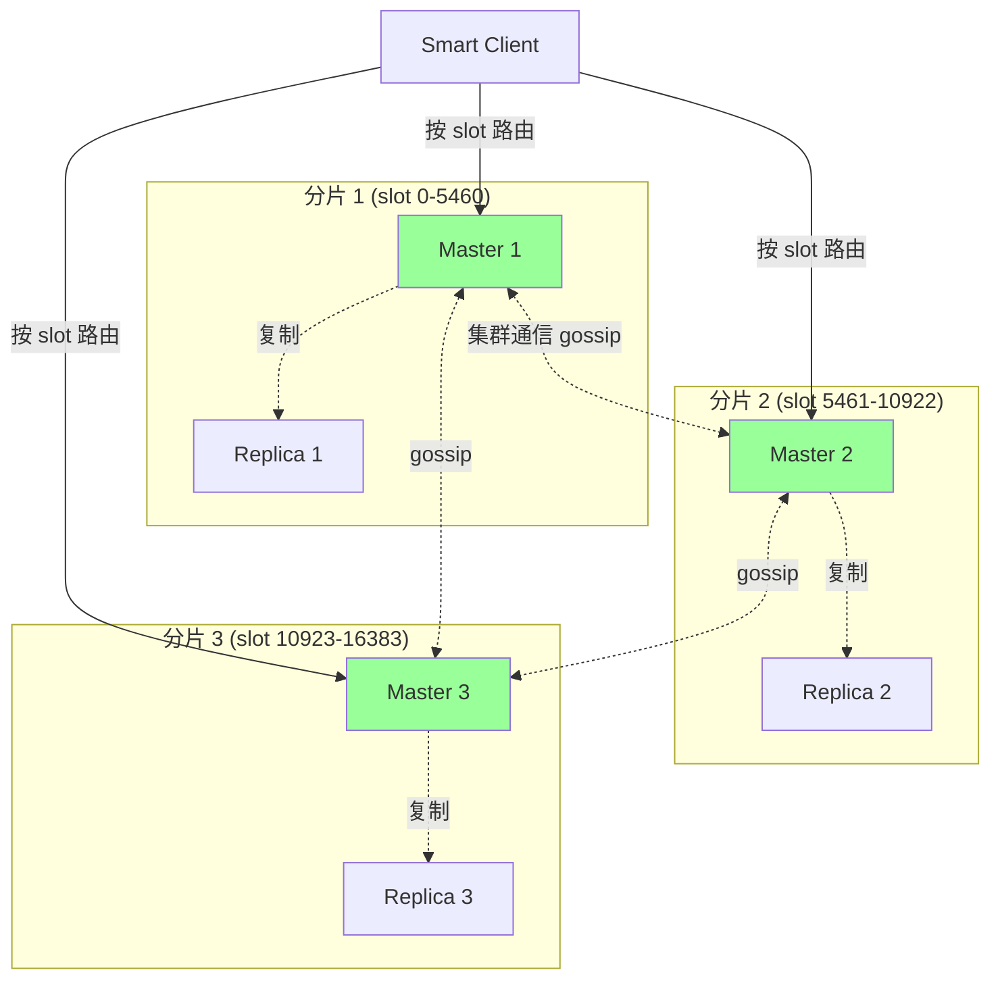

**核心特性**：
- **去中心化**：每个节点平等，无主控
- **数据分片**：16384 个 slot 分布在多个 master
- **每分片可有从**：master 挂了从自动切
- **客户端直连**：根据 slot 算路由（smart client）
- **Gossip 协议**：节点间状态同步

### 4.2 16384 slot 怎么定的？

`slot = CRC16(key) % 16384`

**为什么 16384 = 2^14 而不是 65536？**（高频题）

作者 antirez 说明：
1. **心跳包大小**：节点间互发的 ping 包含位图，每节点一个 bit。16384 bit = 2KB，65536 bit = 8KB。**4x 差异**
2. **集群规模**：Redis Cluster 推荐 ≤ 1000 节点。16384 / 1000 ≈ 16 slot/节点，足够细粒度
3. **CRC16 输出范围**：CRC16 是 16 bit = 65536，对 16384 取模损失不大

### 4.3 hash slot 路由


**MOVED 与 ASK 重定向**：

```bash
redis-cli> SET k v
(error) MOVED 12345 192.168.1.2:6379    # 重定向到正确节点
```

- **MOVED**：永久重定向（client 应更新缓存）
- **ASK**：临时重定向（slot 正在迁移中）

智能 client（go-redis、jedis cluster mode）会**缓存 slot 路由表**，根据 MOVED 自动更新。

### 4.4 hash tag

**问题**：cluster 不支持跨 slot 操作。`MSET k1 v1 k2 v2` 如果 k1/k2 不在同 slot 报错。

**hash tag**：用 `{...}` 强制相同 slot：

```bash
SET {user:1}:profile alice
SET {user:1}:cart [...]
SADD {user:1}:tags vip
# 三个 key 的 hash 只看 {user:1}, 必然落同 slot
```

实战：业务相关的 key 用 hash tag 让它们落同节点，可一起执行 MGET / MULTI 等。

### 4.5 集群命令限制

| 操作 | 单节点 | Cluster |
| --- | --- | --- |
| `MSET k1 v1 k2 v2` | ✓ | 跨 slot 报错（用 hash tag） |
| `MGET k1 k2` | ✓ | 跨 slot 报错 |
| Lua 脚本（多 key） | ✓ | 必须同 slot |
| MULTI/EXEC | ✓ | 必须同 slot |
| Pub/Sub | ✓ | Sharded Pub/Sub（7.0+）解决 |
| 跨 db | ✓ | Cluster 只支持 db0 |

### 4.6 故障转移

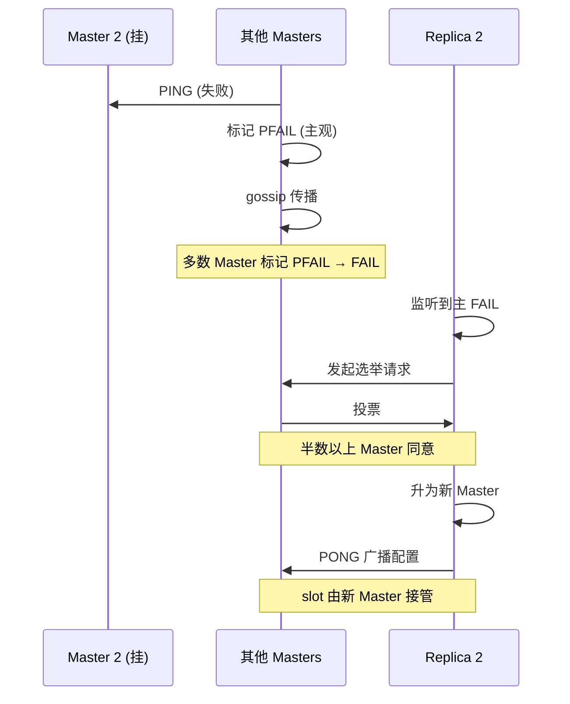

无需哨兵，**集群内部完成**。

### 4.7 扩缩容

```bash
# 添加节点
redis-cli --cluster add-node 新节点 已有节点
redis-cli --cluster reshard 已有节点  # 重新分配 slot

# 删除节点
redis-cli --cluster reshard 节点 --cluster-from 节点ID --cluster-to 目标
redis-cli --cluster del-node 节点 节点ID
```

**slot 迁移过程**：源节点逐 key 迁移到目标，迁移中的 slot 用 ASK 重定向。

### 4.8 客户端模式

| 模式 | 描述 |
| --- | --- |
| **Smart Client** | 客户端缓存 slot 路由，直接路由到正确节点（go-redis、jedis cluster mode） |
| **Dummy Client** | 不缓存，每次按 MOVED 重定向（多一跳） |
| **Proxy** | 中间件代理（如 twemproxy / Codis），客户端无感知 |

主流是 Smart Client。

## 五、脑裂（Split-Brain）

### 5.1 什么是脑裂

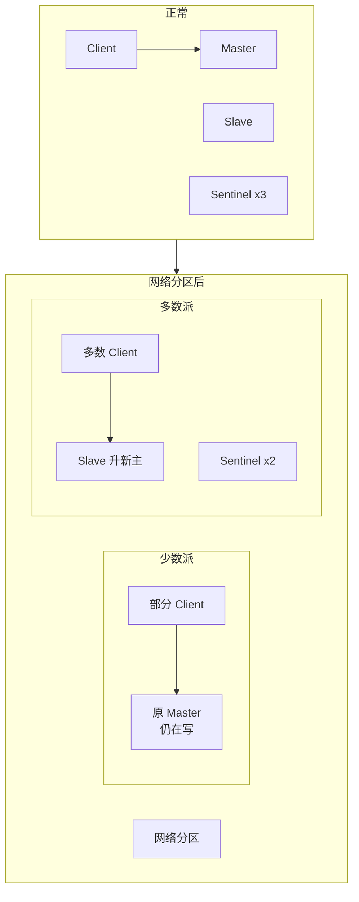

网络分区导致：
- 少数派的 Client 还在写老主
- 多数派的 Sentinel 选了新主
- **网络恢复后**，老主变 Slave，丢失分区期间的写入

### 5.2 防御

```
# 主节点配置 (Sentinel 模式)
min-slaves-to-write 1            # 至少 1 个从可达才接受写
min-slaves-max-lag 10            # 从延迟 ≤ 10s

# Cluster
cluster-require-full-coverage no  # 不要求全 slot 覆盖也能写
```

`min-slaves-to-write` 让主在失去多数从时**拒绝写**，避免脑裂期间老主接受写。

代价：偶尔的网络抖动会让主短暂不可写。

### 5.3 主从一致性的本质

Redis 复制是**异步**的，**任何主从架构都无法 100% 防丢数据**。要强一致：
- 业务用 binlog 双写到 DB（Redis 是缓存）
- 重要数据不只放 Redis
- 用 `WAIT n timeout` 半同步（性能损耗）

## 六、选型决策

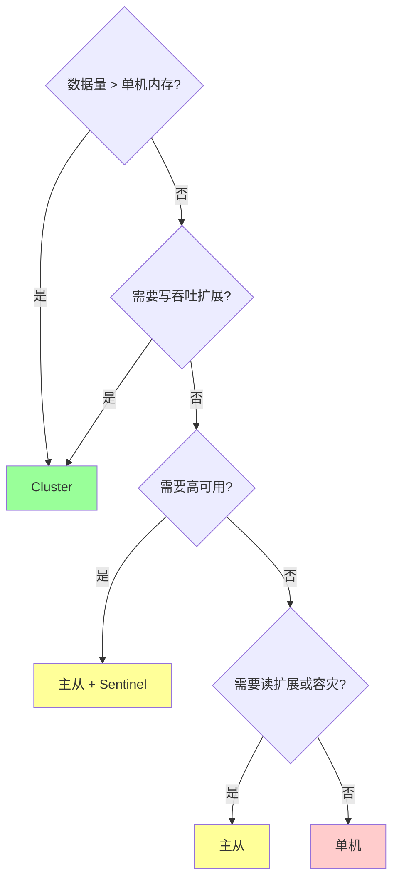

实战：
- **小项目**：主从 + Sentinel
- **中大项目**：Cluster（3 主 3 从起步）
- **极简场景**：单机 + 持久化备份

## 七、高频面试题

**Q1：主从复制全量和增量怎么决定？**
从节点重连时发 `PSYNC <runID> <offset>`：
- 没 runID（首次）→ 全量
- runID 不匹配（主切换过）→ 全量
- offset 在主的 backlog 内 → 增量
- offset 不在 backlog → 全量

`repl-backlog-size` 决定能容忍多长时间断连，默认 1MB 太小，建议 64MB+。

**Q2：BGSAVE 和复制什么关系？**
全量同步时，主节点 BGSAVE 生成 RDB 发给从。所以**主从架构下持久化压力**通常放从节点：主节点关闭 RDB/AOF，从节点开持久化，主只复制。

**Q3：哨兵几个？为什么奇数？**
最少 3 个，常用 3/5/7。奇数因为：
- Quorum 需要多数派
- 偶数容错能力 = 偶数-1，和小一个奇数一样
- 偶数有"脑裂"风险（4 个分成 2:2 没法多数）

**Q4：Cluster 为什么 16384 slot 不是 65536？**

作者解释：
1. 节点间 PING 包含 slot 位图。16384 bit = 2KB，65536 bit = 8KB。**消息开销 4x**
2. Cluster 推荐 ≤ 1000 节点，16384 slot 足够细分
3. CRC16 是 16 bit（65536）但取模 16384 损失小

总结：**性能优化 + 实际够用**。

**Q5：Cluster 为什么不能跨 slot MGET？**
Cluster 节点不知道对方数据，跨 slot 要多次网络往返。Redis 哲学是"快"，所以禁止单命令跨 slot。

**绕过**：用 hash tag `{user:1}` 让相关 key 落同 slot。

**Q6：Cluster 节点挂了流程？**
1. 其他节点 PING 失败 → 标 PFAIL
2. gossip 传播 PFAIL，多数 Master 同意 → FAIL
3. 该节点的 Slave 发起选举（半数 Master 投票同意）
4. Slave 升 Master，接管 slot
5. gossip 广播新配置

整个过程 **15~30 秒**（默认 `cluster-node-timeout 15000`）。

**Q7：Sentinel 和 Cluster 区别？**

| | Sentinel | Cluster |
| --- | --- | --- |
| 解决 | 主从高可用 | 分片 + 高可用 |
| 拓扑 | 一主多从 | 多主多从 |
| 写吞吐 | 单机 | 多机 |
| 数据上限 | 单机内存 | N 倍单机 |
| 复杂度 | 中 | 高 |

**Cluster = Sentinel + 分片**。中大型项目直接 Cluster。

**Q8：脑裂怎么防？**

```
# Sentinel 模式
min-slaves-to-write 1     # 至少 1 个从可写
min-slaves-max-lag 10
```

主在失去多数从时**拒绝新写**，避免少数派老主接受写然后丢失。代价：偶尔网络抖动写失败。

**Q9：Cluster 读能从从节点读吗？**
默认所有读写都路由到 master。开启**只读模式**：

```bash
READONLY  # 在 slave 上执行后,可读
```

Smart Client（go-redis 等）支持配置 `RouteRandomly` / `RouteByLatency`。

注意：从有复制延迟，不能读敏感新数据。

**Q10：Cluster 跨 slot 事务怎么办？**
不能。**事务必须同 slot**。方案：
- 用 hash tag 让相关 key 同 slot
- 业务上拆事务（先 A 节点的，再 B 节点的，自己处理一致性）
- 用 Lua 脚本（脚本内的 key 也必须同 slot）
- 重要场景上 RedLock（详见 06）

## 八、面试加分点

- 主从异步复制是性能与一致性 trade-off，不能 100% 防丢
- `repl-backlog-size` 默认 1MB 太小要调大
- 主从架构下持久化放从节点（减轻主 fork 压力）
- 树形复制解决 1 主多从的复制风暴
- 哨兵奇数原因：多数派 + 偶数容错效率低
- 16384 slot 是 ping 包大小考虑（2KB vs 8KB）
- hash tag `{...}` 让相关 key 落同 slot
- Cluster 默认 db0，不支持多 db
- 脑裂防御 `min-slaves-to-write` 但要权衡可用性
- Smart Client 缓存 slot 路由 + MOVED 自动更新
