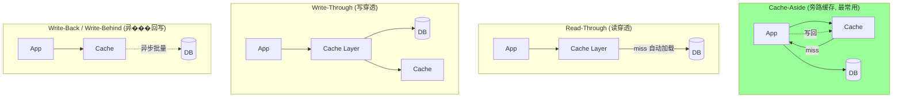
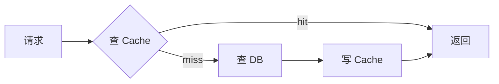
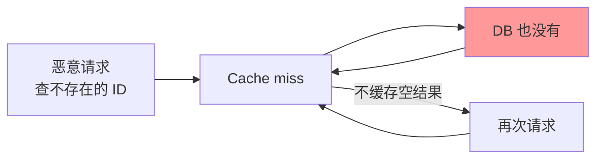
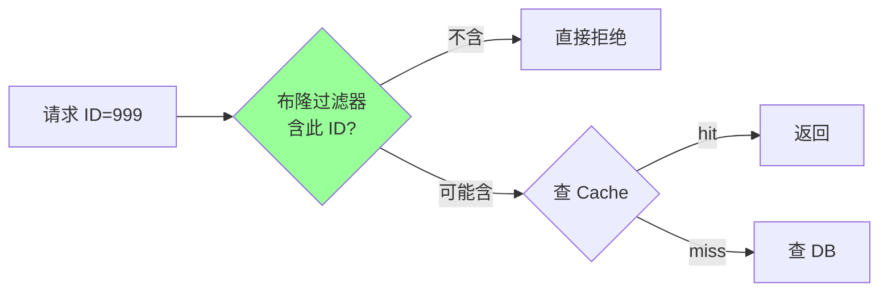
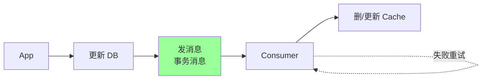
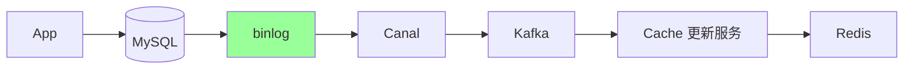
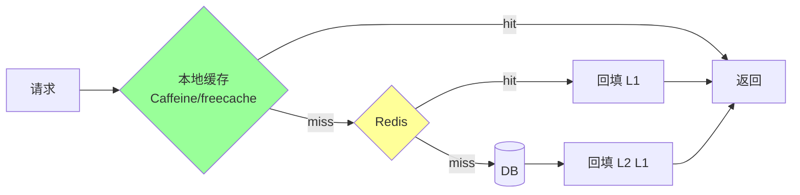
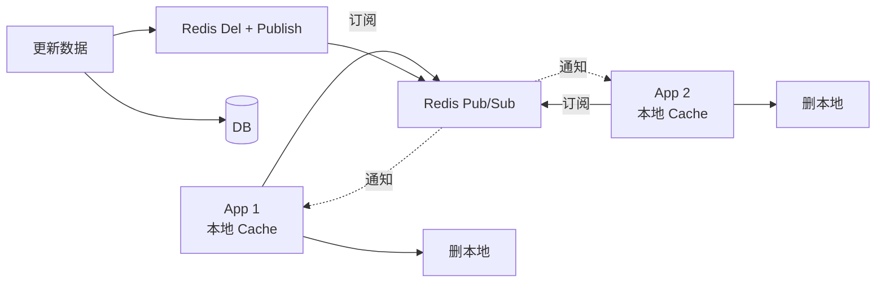

# Redis · 缓存模式

> Cache-Aside / Read-Through / Write-Through / Write-Back / 击穿穿透雪崩 / 一致性方案 / 双删原理与局限

## 〇、核心提炼（5 段式）

### 核心机制（4 条必背）

1. **Cache-Aside 是工业标准** - 应用层显式管理缓存：读 miss 回源 + 回填；写 → 写 DB → **删缓存**（不是更新）
2. **三大问题 + 三种解法**：穿透（Bloom + 空值缓存）/ 击穿（互斥锁 + singleflight）/ 雪崩（TTL 随机化 + 多级缓存）
3. **删缓存而不是更新** - 避免并发覆盖 + 幂等 + lazy load 减少不必要写
4. **一致性方案 4 档** - 先写 DB 再删缓存 / 延迟双删 / binlog 订阅 / 强一致读 DB（按业务取舍）

### 核心本质（必懂）

> 缓存的本质是 **"性能优化层，不是数据存储层"**：
>
> - **缓存可以丢，DB 不能丢**：DB 是 source of truth，缓存只是加速副本
> - **一致性永远是窗口问题**：写 DB 和操作缓存是两个步骤，必然有不一致窗口
> - **业务必须容忍最终一致**：要强一致就别用缓存（直接读 DB + 限流）
>
> **关键事实**：
> - **Cache-Aside 仍非完美**：极小概率"读 miss + 写 DB + 回填旧值"窗口让缓存留下脏数据
> - **延迟双删不彻底**：只能减小窗口，不能消除
> - **binlog 订阅最可靠**：但运维复杂（Canal / Debezium）
>
> **CAP 视角**：
> - 缓存系统天然 AP（牺牲 C 保 A）
> - 强一致 → 不要缓存 / 或加分布式锁（极少用）

### 完整流程（面试必背）

```
Cache-Aside 标准流程:

读路径:
  1. 查缓存 → 命中 → 返回
  2. 缓存 miss → 查 DB
  3. 回填缓存（设 TTL）
  4. 返回

写路径（先写 DB 再删缓存）:
  1. 写 DB
  2. 删缓存（不是更新）
  3. 下次读 miss → 重新加载

为什么"先写 DB 再删缓存":
  情况 A: 写 DB 失败 → 不删缓存 → 缓存仍是旧值 → 一致
  情况 B: 写 DB 成功 + 删缓存失败 → 缓存脏（短暂） → 业务异常 / 等 TTL 过期
  情况 C: 写 DB 成功 + 删缓存成功 → 一致

为什么"删"不是"更新":
  - 并发更新可能覆盖（A 写 v1 → 准备更新缓存 → B 写 v2 → 更新缓存 v2 → A 才更新成 v1 → 缓存脏）
  - 删除幂等（删多次 = 删一次）
  - lazy load: 不一定有读，何必更新

不一致窗口（小概率）:
  T1: A 读 miss → 查 DB 得 V1 → 准备回填
  T2: B 写 DB V2 → 删缓存（缓存空）
  T3: A 把 V1 回填缓存（脏）
  → 缓存永远脏直到 TTL 过期
  → 概率极低（要求读 miss + 写恰好交错）
```

### 4 条核心机制 - 逐点讲透

#### 1. Cache-Aside（为什么是工业标准）

```
对比 5 种模式:

Cache-Aside（旁路）:
  ✓ 简单清晰，应用层完全控制
  ✓ 缓存可选（缓存挂了走 DB）
  ✗ 应用层要写 if/else 逻辑
  → 95% 业务用这个

Read-Through:
  缓存层封装"miss 自动回源"
  应用层只管查缓存
  ✓ 应用层简单
  ✗ 框架要求高（多数 Redis 不支持）

Write-Through（写穿）:
  写缓存 → 缓存层同步写 DB
  ✓ 强一致
  ✗ 写延迟高
  → 写少读多场景偶尔用

Write-Back（写回）:
  写缓存就返回，异步刷 DB
  ✓ 写性能极高
  ✗ 缓存挂了 → 数据丢失
  → 极少业务用（除非允许丢数据）

Refresh-Ahead:
  TTL 快到期前主动刷新
  ✓ 防击穿
  ✗ 实现复杂
  → 热数据预热场景
```

#### 2. 三大问题 + 三种解法

```
缓存穿透（Penetration）:
  问题: 查询不存在的 key → 缓存 miss → 全部打 DB
  攻击: 恶意构造无效 key 打垮 DB

  方案 1: Bloom Filter 过滤
    优点: 内存极省（亿级仅 100MB）
    缺点: 假阳性（极小概率漏过）

  方案 2: 空值缓存
    SET key NULL EX 5min
    优点: 简单
    缺点: 占缓存空间

  实战: 两者结合（Bloom 兜大流量 + 空值兜小漏网）

缓存击穿（Breakdown）:
  问题: 热 key 过期瞬间 → 大量并发 miss → 同时打 DB
  特征: 单 key 高并发

  方案 1: 互斥锁（singleflight）
    miss 时只允许 1 个请求查 DB，其他等待
    Go 用 golang.org/x/sync/singleflight
    1000 并发同 key miss → 1 次回源 DB

  方案 2: 永不过期 + 异步刷新
    设置物理永不过期
    后台定时刷新
    → 适合超热点

缓存雪崩（Avalanche）:
  问题: 大量 key 同时过期 / Redis 整体挂 → DB 被打垮
  特征: 大规模 miss

  方案 1: TTL 随机化
    base + rand(0, 300s)
    避免同时过期

  方案 2: 多级缓存
    本地缓存 → Redis → DB
    Redis 挂时本地缓存兜一会

  方案 3: 熔断降级
    DB QPS 超阈值 → 返回默认值 / 限流
```

#### 3. 删缓存而不是更新（重要细节）

```
为什么"先写 DB 再删缓存"是主流:

vs 先删缓存再写 DB（错）:
  T1: A 删缓存
  T2: B 读 miss → 查 DB（旧值 V1）
  T3: A 写 DB V2
  T4: B 把旧值 V1 回填缓存
  → 缓存永久脏（直到 TTL）

vs 先写 DB 再更新缓存（错）:
  并发更新: A v1, B v2 → 可能 A 后到覆盖成 v1
  操作不幂等

vs 先写 DB 再删缓存（推荐）:
  ✓ 极小不一致窗口
  ✓ 删除幂等
  ✓ lazy load（下次读才回填）

延迟双删（兜底）:
  1. 删缓存
  2. 写 DB
  3. sleep 500ms（等读流量回填完）
  4. 再删一次缓存
  → 减小窗口，但仍不彻底
  代价: 写路径慢 500ms
```

#### 4. 一致性方案 4 档

```
档 1: 先写 DB 再删缓存（主流，95% 业务）
  优: 简单 / 性能好
  缺: 极小概率脏（TTL 兜底）

档 2: 延迟双删
  优: 减小窗口
  缺: 写慢 500ms / 仍不彻底

档 3: binlog 订阅删缓存（大规模推荐）
  Canal / Debezium 监听 binlog
  推送到 MQ → 消费端删缓存
  优: 业务零侵入 / 可靠 / 解耦
  缺: 运维复杂 / 100ms-1s 延迟

档 4: 强一致读（绕过缓存）
  关键路径直接查 DB
  优: 真正强一致
  缺: 性能差 / DB 压力大
  适用: 金融对账等

实战推荐:
  90% 业务: 档 1
  高并发读写: 档 3
  金融关键路径: 档 4
```

### 一句话总结

> Redis 缓存模式的核心是：**Cache-Aside 旁路缓存 + 三大问题三种解法 + "先写 DB 再删缓存" + 删而不更新**，
> 本质是**性能优化层不是数据存储层**：缓存可丢（DB 是真相），一致性永远是窗口问题（业务必须容忍最终一致）。
> **CAP 视角**：缓存天然 AP，要强一致就别用缓存（或绕过缓存读 DB）。
> 95% 业务用"先写 DB 再删缓存 + TTL 兜底"，高并发用 binlog 订阅 + 多级缓存。

---

## 一、缓存读写模式（5 种）



### 1.1 Cache-Aside（旁路缓存）

**业界主流**。应用层显式管理缓存。

**读**：



**写**：


> **写为什么是"删 Cache"而不是"更新 Cache"？** 见第三节。

**优点**：简单，应用层完全可控。
**缺点**：业务代码侵入；并发下有一致性问题。

### 1.2 Read-Through

应用只调缓存层，缓存层负责 miss 时自动从 DB 加载。

例：本地缓存框架（Caffeine 的 `LoadingCache`）。

**优点**：业务无感。
**缺点**：需要专门的缓存层（少有现成产品对接 Redis）。

### 1.3 Write-Through

写时同时更新缓存和 DB（同步）。

**优点**：缓存永远最新。
**缺点**：写性能差（两次写）。

### 1.4 Write-Back / Write-Behind

写只到缓存，异步批量刷 DB。

**优点**：写性能极高。
**缺点**：**可能丢数据**（缓存挂前没刷盘）。仅适合允许丢的场景（统计、日志）。

### 1.5 Refresh-Ahead

定时主动刷新即将过期的热 key。

**优点**：避免击穿（key 不真过期）。
**缺点**：刷不必要的 key 浪费资源。

## 二、缓存三件套：穿透 / 击穿 / 雪崩

### 2.1 缓存穿透（Penetration）

**问题**：查询**根本不存在**的 key，每次都打到 DB。



**风险**：DB 被打爆。

**解决方案**：

#### 方案 1：缓存空值（推荐，简单）

```go
v, err := cache.Get(key)
if err == cache.Nil {
    v, err = db.Get(key)
    if errors.Is(err, sql.ErrNoRows) {
        cache.Set(key, "<NULL>", 5*time.Minute)  // 缓存空值, TTL 较短
        return nil, nil
    }
    cache.Set(key, v, 1*time.Hour)
}
```

**坑**：可能被穷举攻击吃满内存。配合限流。

#### 方案 2：布隆过滤器（防大规模穿透）



启动时把所有合法 ID 灌入布隆过滤器。**100% 不会漏判存在的**，但**有少量误判（实际不存在但说存在）**，可接受（少量穿透到 DB）。

布隆过滤器在 Redis 中：
- **RedisBloom 模块**：`BF.ADD bf id`、`BF.EXISTS bf id`
- 自实现：用 Bitmap + 多个 hash 函数

#### 方案 3：参数校验

ID 范围、格式、签名校验。明显非法的直接 400。

### 2.2 缓存击穿（Hot Key Breakdown）

**问题**：**单个热 key 在过期瞬间**，大量并发请求同时打 DB。


**解决方案**：

#### 方案 1：互斥锁（singleflight）

```go
v, err := cache.Get(key)
if err == cache.Nil {
    // 抢锁
    if cache.SetNX("lock:"+key, "1", 10*time.Second) {
        defer cache.Del("lock:" + key)
        v, _ = db.Get(key)
        cache.Set(key, v, 1*time.Hour)
    } else {
        time.Sleep(50 * time.Millisecond)
        return Get(key)  // 重试 (此时大概率有缓存)
    }
}
```

或用 **`golang.org/x/sync/singleflight`**：进程内多个请求同 key 只发一次 DB。

```go
v, err, _ := sf.Do(key, func() (any, error) {
    return db.Get(key)
})
```

singleflight 是**进程内**的，跨进程仍要分布式锁（用 SETNX）。

#### 方案 2：热 key 不过期 + 后台刷新

```go
// 永不过期, 用业务字段判断"逻辑过期"
type CacheValue struct {
    Data       any
    ExpireAt   time.Time
}

// 读时检查逻辑过期
v := cache.Get(key)
if v.ExpireAt.Before(time.Now()) {
    // 异步刷新, 仍返回老数据
    go refresh(key)
}
return v.Data
```

适合**绝对热的 key**（首页、配置）。代价：可能短暂返回老数据。

### 2.3 缓存雪崩（Avalanche）

**问题**：**大量 key 同时过期** 或 **Redis 整体挂掉**，DB 瞬间被打爆。


**两种场景，对应不同方案**：

#### 场景 A：大量 key 同时过期

**原因**：批量加载缓存时 TTL 都设了一样。

**解决**：**TTL 加随机抖动**

```go
ttl := baseTTL + time.Duration(rand.Intn(300)) * time.Second  // 1h ± 5min
cache.Set(key, v, ttl)
```

#### 场景 B：Redis 集群挂

**解决**：
- **多级缓存**：本地 LRU（Caffeine/freecache）+ Redis
- **熔断 + 限流**：保护 DB
- **降级**：返回兜底数据
- **Redis 高可用**：Cluster + 哨兵

### 2.4 三者对比

| | 穿透 | 击穿 | 雪崩 |
| --- | --- | --- | --- |
| key 是否存在 | **不存在** | 存在但过期 | 大批���期或 Redis 挂 |
| 影响范围 | 单个/少量 key | **单个热 key** | **大量 key** |
| 解决核心 | 缓存空值 + 布隆过滤器 | 互斥锁 + 永不过期 | TTL 抖动 + 多级缓存 + 限流 |

## 三、缓存与 DB 一致性（最高频）

### 3.1 为什么是难题

只要**缓存和 DB 是两个数据源**，就存在一致性问题。两个写操作（写 DB、写/删 Cache）：
- 顺序问题：先写哪个？
- 失败问题：第一步成功第二步失败？
- 并发问题：A 在中间，B 也在中间？

### 3.2 4 种组合分析

#### 方案 A：先更新 DB，再更新 Cache

```
线程 A: 更新 DB (val=1)
线程 B: 更新 DB (val=2)
线程 B: 更新 Cache (val=2)
线程 A: 更新 Cache (val=1)   ← 错! Cache 是旧值
```

**问题**：并发下 cache 可能是旧值。**不推荐**。

#### 方案 B：先更新 Cache，再更新 DB

更糟。Cache 更新成功 DB 失败 → Cache 是脏数据。**绝对不用**。

#### 方案 C：先删 Cache，再更新 DB

```
线程 A: 删 Cache
线程 B: 读 Cache (miss)
线程 B: 读 DB 拿到旧值
线程 B: 写回 Cache (旧值)
线程 A: 更新 DB (新值)
→ Cache 旧, DB 新, 不一致
```

**问题**：读会把旧值写回。

#### 方案 D：先更新 DB，再删 Cache（**Cache-Aside 推荐**）

```
线程 A: 更新 DB
线程 A: 删 Cache
→ 后续读 miss → 读 DB → 写 Cache (新值)
```

**仍有少数极端情况不一致**：

```
T0: 线程 B 读 Cache (miss)
T1: 线程 B 读 DB (旧值)
T2: 线程 A 更新 DB (新值)
T3: 线程 A 删 Cache (本来就空)
T4: 线程 B 写 Cache (旧值)
→ 不一致
```

**但这种情况极罕见**：要求"读"在"写"之前发生且写 Cache 在删 Cache 之后，时间窗很小。

**生产基本用方案 D**。

### 3.3 为什么是"删"不是"更新"？

1. **避免并发更新乱序**（方案 A 的问题）
2. **懒加载**：删了下次读再 load，简单可靠
3. **避免不必要计算**：写完就删，万一这个 key 再没人读，省了计算成本
4. **复杂 value**：value 可能不是简单字段，是聚合结果，更新逻辑复杂

### 3.4 延迟双删（解决方案 C 的问题）

```go
func update(id int, v any) error {
    cache.Del(key(id))           // 删 1
    db.Update(id, v)             // 更新 DB
    time.Sleep(500 * time.Millisecond)  // 等待"读到旧值的请求"完成
    cache.Del(key(id))           // 删 2 (兜底)
    return nil
}
```

**思路**：第二次删除清理掉"在第一次删和 DB 更新之间被读出旧值并写回 Cache"的脏数据。

**问题**：
- sleep 多久不好定（依赖业务读耗时）
- sleep 期间数据是不一致的
- 第二次删可能也失败

**实战通常异步删**：把第二次删丢消息队列，失败重试。

### 3.5 真正强一致方案

Redis + DB 异步本质上**最终一致**。要强一致：

#### 方案 1：分布式事务（XA / 2PC）

性能差，几乎不用。

#### 方案 2：消息队列保证最终一致



**优势**：解耦 + 重试保障 + 顺序消费。
**坑**：MQ 自己的可靠性、消息顺序、重复消费。

#### 方案 3：订阅 binlog（Canal / Debezium）



**优势**：业务无感（不需要业务代码删 cache）；DB 侧的所有变更（包括手动改 SQL）都能同步。
**适用**：异构系统、多源同步、复杂业务。

#### 方案 4：读主写主（强一致场景）

直接放弃缓存，强一致数据走 DB（带 SQL 优化、连接池、读写分离）。

### 3.6 一致性方案选型

| 方案 | 一致性 | 性能 | 复杂度 | 场景 |
| --- | --- | --- | --- | --- |
| Cache-Aside（更新 DB → 删 Cache） | 最终一致（延迟极短） | 高 | 低 | **绝大多数业务** |
| 延迟双删 | 最终一致（更稳） | 高 | 中 | 对一致性要求略高 |
| MQ 异步 | 最终一致（毫秒级延迟） | 高 | 中 | 复杂业务 |
| Canal binlog | 最终一致 | 高 | 中 | 多源、异构 |
| 不用缓存 | 强一致 | 低 | 低 | 强一致 + 数据量小 |
| 分布式事务 | 强一致 | 极低 | 高 | 几乎不用 |

## 四、TTL 策略

### 4.1 必设 TTL

**禁止永不过期**（除明确热点）。原因：
- 防数据不一致累积
- 防内存被冷数据占满
- LRU 淘汰策略需要

```bash
SET key val EX 3600        # 设置时带 TTL
EXPIRE key 3600            # 单独设
TTL key                    # 查剩余
```

### 4.2 TTL 加抖动

```go
ttl := baseTTL + time.Duration(rand.Intn(300))*time.Second
```

防雪崩。

### 4.3 不同热度不同 TTL

- 极热：永不过期 + 后台刷新
- 热：1 小时
- 普通：10 分钟
- 低频：1 分钟

## 五、多级缓存



**好处**：
- L1 本地 ns 级，比 Redis 网络 IO 快 100x
- 减轻 Redis 压力
- Redis 挂了 L1 还能撑一阵

**坑**：
- L1 各机器不一致（短 TTL 缓解）
- 内存膨胀（限制 L1 大小）
- 失效广播（订阅 Redis Pub/Sub 通知所有节点删 L1）

## 六、高频面试题

**Q1：缓存击穿、穿透、雪崩区别和方案？**

| | 现象 | 方案 |
| --- | --- | --- |
| 穿透 | 查不存在的 key | 缓存空值 + 布隆过滤器 |
| 击穿 | 单个热 key 失效 | 互斥锁 + 永不过期 |
| 雪崩 | 大批 key 同时失效或 Redis 挂 | TTL 抖动 + 多级缓存 + 限流 |

**Q2：为什么先更新 DB 再删 Cache？**
4 种组合中**先 DB 后删 Cache 极端不一致最少**。其他三种：
- 先更新 Cache 后 DB：DB 失败留脏数据
- 先 Cache 后 DB（更新）：并发顺序乱
- 先删 Cache 后 DB：读会把旧值写回

且**删而非更新**：避免计算复杂 value，懒加载更可靠。

**Q3：双删能彻底解决一致性吗？**
不能，只能减少不一致窗口。原因：
- sleep 间隔难定
- 第二次删可能失败
- sleep 期间数据本就不一致

要更可靠用 MQ 异步重试。

**Q4：缓存空值 vs 布隆过滤器怎么选？**

| | 缓存空值 | 布隆过滤器 |
| --- | --- | --- |
| 实现 | 简单 | 复杂 |
| 误判 | 无 | 有少量（可接受） |
| 内存 | 攻击下可能膨胀 | 极省（1 亿 key 几十 MB） |
| 适用 | 一般业务 | 大规模或防恶意 |

可组合：先布隆过滤器拒明显不存在的，剩下的查 Cache（含空值）。

**Q5：为什么用 Redis 而不是直接查 DB？**
- DB 单条查询 ms 级 vs Redis ns~μs 级
- DB 连接池有限（几百），Redis 几万 QPS 单机
- 复杂查询（join、聚合）DB 几百 ms vs Redis 直接拿结果

**代价**：一致性问题、运维复杂、内存成本。

**Q6：什么数据适合缓存？**
- **读多写少**（核心）
- 计算昂贵
- 数据可重建（DB 是源）
- 不需要强一致

**不适合**：
- 写多于读
- 数据持续在变（每秒变）
- 强一致要求
- 单条很大（> 几 MB）

**Q7：缓存大小怎么估？**
- key 数量 × 平均 value 大小 × 1.2（overhead）
- 或：保 80% 命中率所需的工作集（用 LFU 看热点分布）

监控 `keyspace_hits / (hits + misses)`，命中率 > 95% 才算好。

**Q8：怎么处理缓存与 DB 强一致需求？**
- **数据量小**：放弃缓存，直接 DB（DB 加索引、读写分离）
- **业务可接受最终一致**（多数）：Cache-Aside + MQ 异步重试
- **必须强一致**：走 DB，缓存只用于性能优化但需要 invalidate（如 OAuth token，先 invalidate cache 再写 DB，业务能接受短暂不可用）

**Q9：本地缓存 + Redis 怎么协同失效？**



**或用 Redis 6.0 的 client-side caching**（自动通知）。

**Q10：怎么解决"缓存击穿 + 重建很慢"？**
**互斥锁** + **逻辑过期**：

```go
v := cache.Get(key)
if v.LogicalExpireAt.Before(time.Now()) {
    // 异步重建, 同步返回老数据
    if cache.SetNX("lock:"+key, "1", 10*time.Second) {
        go func() {
            defer cache.Del("lock:" + key)
            newV := db.Get(key)
            cache.Set(key, newV)  // 永不过期
        }()
    }
}
return v.Data
```

短暂返回老数据，但保护 DB。适合首页等"数据稍旧 OK"的场景。

## 七、面试加分点

- 区分"读策略"（Cache-Aside / Read-Through）和"写策略"（Write-Through / Write-Back）
- 知道双删的局限性（sleep 难定、第二次删失败）
- 提到 Canal binlog 订阅方案（业务无感）
- 强一致要么不用缓存要么走 MQ 重试
- TTL 抖动防雪崩
- 多级缓存 + Pub/Sub 失效广播
- 缓存命中率指标 `hits/(hits+misses)`
- 布隆过滤器误判方向（说"不存在"100% 准）
- singleflight 是进程内的，跨进程要分布式锁
- 永不过期不是真不过期，是逻辑过期 + 后台刷新
