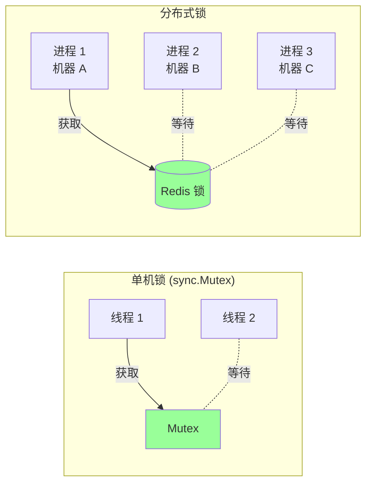
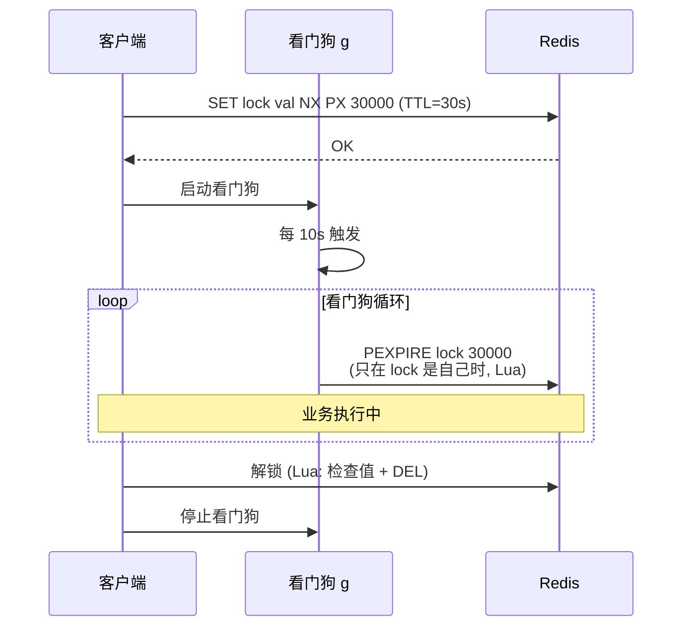
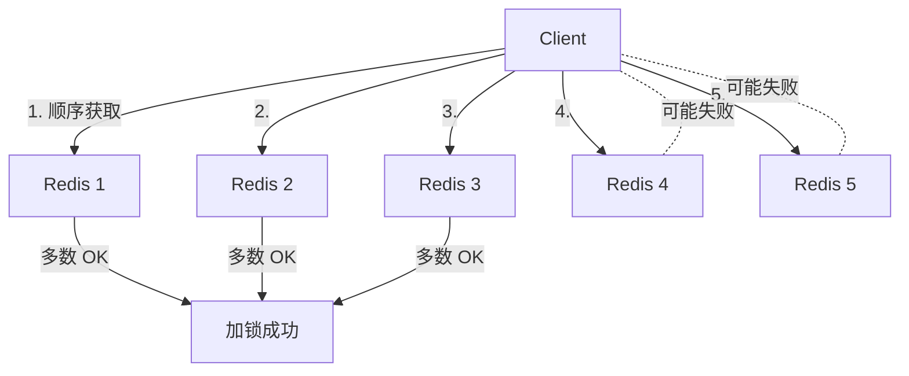
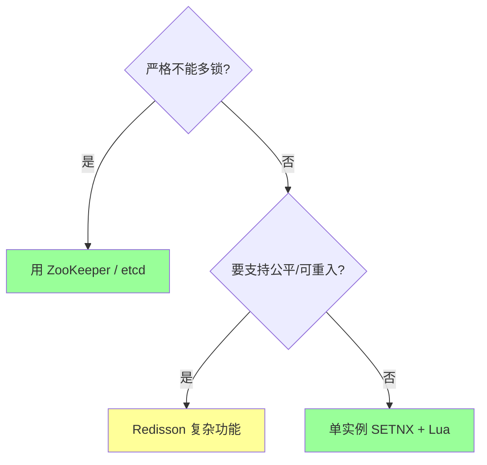
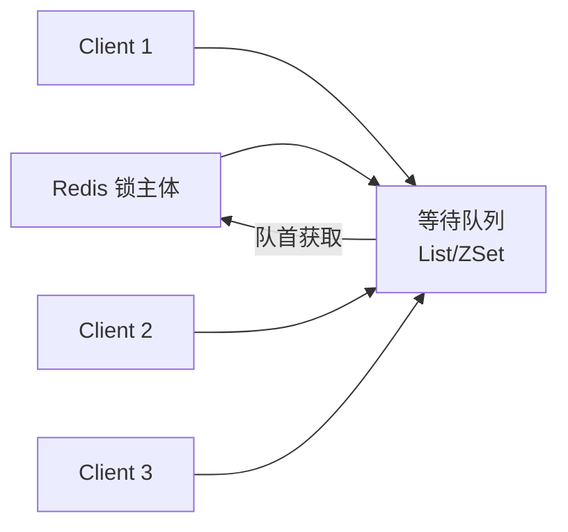

# Redis · 分布式锁

> SETNX / Redlock 算法 / 看门狗续约 / 公平锁 / 红锁争议 / Redisson / 实战陷阱

## 一、为什么需要分布式锁



**典型场景**：
- 防超卖（多实例同时扣库存）
- 定时任务防多次执行（只让一个实例跑）
- 避免重复处理消息
- 配置/缓存初始化（singleflight）

**核心要求**：
1. **互斥**：同一时刻只一个客户端持有
2. **防死锁**：客户端崩溃不能让锁永远占着
3. **加锁解锁同一客户端**：A 加的锁 B 不能解
4. **可靠**：尽量在网络故障下也对

## 二、最简单的实现：SET NX

### 2.1 错误版本（教训）

```bash
SETNX lock 1     # 加锁
EXPIRE lock 30   # 设过期
DEL lock         # 解锁
```

**问题**：SETNX 和 EXPIRE 不是原子的。SETNX 后崩溃��锁永久占用。

### 2.2 正确版本（2.8+）

```bash
SET lock <unique_id> NX PX 30000  # 原子
```

`NX` = 不存在才设；`PX 30000` = 30 秒过期。

**`<unique_id>` 必须唯一**（如 UUID + 客户端 ID）：解锁时检查是不是自己的锁。

### 2.3 解锁要原子

```bash
# 错: 两步, 中间可能锁被别人拿了
GET lock
DEL lock

# 对: Lua 脚本原子执行
EVAL "if redis.call('GET', KEYS[1]) == ARGV[1] then return redis.call('DEL', KEYS[1]) else return 0 end" 1 lock <unique_id>
```

为什么要检查值？

```
T0: A 获取锁 (val=A, TTL 30s)
T1: A 因 GC 暂停 35s
T2: 锁过期, B 获取锁 (val=B)
T3: A 恢复, 直接 DEL → 删的是 B 的锁!
```

不检查值会**误删**。

### 2.4 完整 Go 实现

```go
type Lock struct {
    client *redis.Client
    key    string
    value  string  // 唯��� ID
    ttl    time.Duration
}

func NewLock(c *redis.Client, key string, ttl time.Duration) *Lock {
    return &Lock{
        client: c,
        key:    key,
        value:  uuid.NewString(),
        ttl:    ttl,
    }
}

func (l *Lock) Acquire(ctx context.Context) (bool, error) {
    return l.client.SetNX(ctx, l.key, l.value, l.ttl).Result()
}

const unlockScript = `
if redis.call('GET', KEYS[1]) == ARGV[1] then
    return redis.call('DEL', KEYS[1])
else
    return 0
end`

func (l *Lock) Release(ctx context.Context) error {
    _, err := l.client.Eval(ctx, unlockScript, []string{l.key}, l.value).Result()
    return err
}
```

## 三、看门狗续约（防业务超时）

### 3.1 问题

锁 TTL 怎么定？
- **太短**：业务还没做完锁就过期，别的进程进来 → 不互斥
- **太长**：客户端崩溃后等很久才能再获取

### 3.2 解决：看门狗（watchdog）

后台 goroutine 定期延长 TTL：



```go
func (l *Lock) startRenewal(ctx context.Context) {
    ticker := time.NewTicker(l.ttl / 3)
    go func() {
        for {
            select {
            case <-ctx.Done(): return
            case <-l.stopCh: return
            case <-ticker.C:
                l.renew(ctx)
            }
        }
    }()
}

const renewScript = `
if redis.call('GET', KEYS[1]) == ARGV[1] then
    return redis.call('PEXPIRE', KEYS[1], ARGV[2])
else
    return 0
end`

func (l *Lock) renew(ctx context.Context) {
    l.client.Eval(ctx, renewScript, []string{l.key}, l.value, l.ttl.Milliseconds())
}
```

`Redisson`（Java）默认开看门狗。Go 用 `redsync` 或 `go-redsync/redsync` 库。

### 3.3 看门狗的坑

- **客户端崩溃**：看门狗 g 也死了，锁正常超时释放（这是好事）
- **GC 暂停**：看门狗也暂停，可能错过续约 → 锁过期 → 别人拿 → 客户端恢复后不知道
- **网络分区**：续约 RPC 失败，锁可能过期

→ 看门狗能减少超时但**不能根除**异常情况下的锁丢失。

## 四、Redlock（红锁，争议算法）

### 4.1 单实例的问题

主从架构下：
1. 客户端在 master 拿锁（异步复制还没到 slave）
2. master 挂了，slave 提升为新 master（**没有锁**）
3. 别的客户端在新 master 拿到同一把锁
4. **两个客户端同时持有**

### 4.2 Redlock 算法（antirez 提出）

**核心**：用**多个独立 Redis 实例**（不是主从），多数派同意才算获取成功。



**步骤**：
1. 当前时间戳 T1
2. 依次向 N 个独立实例（推荐 5）请求加锁，每个用相同 key + 唯一 ID + 短超时（避免一个挂等很久）
3. 当前时间戳 T2
4. **判断成功**：≥ N/2+1 个实例加锁成功 **AND** 总耗时 (T2-T1) < TTL
5. **真正 TTL** = 设定 TTL - (T2-T1)（扣掉花掉的时间）
6. 失败：在所有节点（包括���获取的）发起释放（防部分成功）

### 4.3 Redlock 争议

**Martin Kleppmann（《DDIA》作者）批评**：
- 依赖**时钟一致**（NTP 跳变会破坏正确性）
- 依赖**进程暂停**（GC、虚拟机迁移会让客户端误以为还持有）
- 不比单实例 SETNX 强多少

**antirez 反驳**：
- 时钟假设是合理的（生产环境 NTP 已成标配）
- GC 暂停问题任何分布式锁都有
- Redlock 解决了主从切换的边缘 case

**结论**：
- **业务**：单实例 SETNX 足够（接受主从切换的小概率风险）
- **金融级**：Redis 不是合适选择，用 ZooKeeper / etcd（基于一致性协议）

### 4.4 实战建议



**95% 业务用单实例 SETNX 够了**。Redlock 用得不多（实现复杂、收益有限）。

## 五、可重入锁

```go
// 同一线程多次加锁

// 方法 1: ThreadLocal 计数 (Java/Go 不天然支持)
// 方法 2: 用 Hash 记录持有者和重入次数

const acquireScript = `
if redis.call('EXISTS', KEYS[1]) == 0 or redis.call('HGET', KEYS[1], 'owner') == ARGV[1] then
    redis.call('HINCRBY', KEYS[1], 'count', 1)
    redis.call('HSET', KEYS[1], 'owner', ARGV[1])
    redis.call('PEXPIRE', KEYS[1], ARGV[2])
    return 1
end
return 0`

const releaseScript = `
if redis.call('HGET', KEYS[1], 'owner') ~= ARGV[1] then
    return 0
end
local count = redis.call('HINCRBY', KEYS[1], 'count', -1)
if count > 0 then
    return 1
end
redis.call('DEL', KEYS[1])
return 1`
```

Redisson 的可重入锁就是这么做的。

## 六、公平锁



实现思路：用 List/ZSet 维护等待队列，按入队顺序唤醒。Redisson 有现成实现。

实战：**一般业务不需要公平锁**（公平=慢）。仅在极少场景考虑。

## 七、典型用法

### 7.1 防超卖（电商秒杀）

```go
func deduct(ctx context.Context, sku string, count int) error {
    lock := NewLock(rdb, "stock_lock:"+sku, 5*time.Second)

    for i := 0; i < 3; i++ {  // 重试
        ok, _ := lock.Acquire(ctx)
        if ok { break }
        time.Sleep(50 * time.Millisecond)
    }
    defer lock.Release(ctx)

    stock, _ := db.GetStock(sku)
    if stock < count { return ErrNoStock }
    db.UpdateStock(sku, stock-count)
    return nil
}
```

**实际秒杀更倾向**：
- 库存放 Redis（DECR 原子）
- 加 Lua 脚本判断（不需要锁）
- DB 异步同步

### 7.2 定时任务防重

```go
func cron(ctx context.Context) {
    lock := NewLock(rdb, "cron:daily-report", 10*time.Minute)
    ok, _ := lock.Acquire(ctx)
    if !ok { return }  // 别的实例在跑
    defer lock.Release(ctx)

    runReport()
}
```

每个实例都跑这段代码，但只有一个能拿到锁。

### 7.3 缓存击穿（详见 05）

```go
v, err := cache.Get(key)
if err == cache.Nil {
    lock := NewLock(rdb, "rebuild:"+key, 30*time.Second)
    ok, _ := lock.Acquire(ctx)
    if ok {
        defer lock.Release(ctx)
        v = db.Get(key)
        cache.Set(key, v, 1*time.Hour)
    } else {
        time.Sleep(100 * time.Millisecond)
        return Get(key)  // 重试
    }
}
```

## 八、常见坑

### 坑 1：忘加 NX

```bash
SET lock 1 PX 30000   # 没 NX, 直接覆盖!
```

任何人都能"抢"锁，不互斥。

### 坑 2：解锁不检查值

```bash
DEL lock   # 不管是不是自己的, 直接删
```

可能删了别人的锁。必须 Lua 检查 + DEL。

### 坑 3：业务超过 TTL

```go
lock.Acquire(ctx)
defer lock.Release(ctx)
expensiveWork(60 * time.Second)  // 超过 30s TTL
// 期间锁过期, 别人拿到, 也在做这个
```

**修复**：看门狗续约，或评估业务时间设合理 TTL。

### 坑 4：Redis 主从切换

主拿到锁但还没复制到从。主挂了从顶上，**新实例上没锁**，别人能拿。

**修复**：单 Redis 加 AOF + everysec（最多丢 1 秒）；金融场景用 ZooKeeper。

### 坑 5：客户端 GC 暂停

```
T0: A 拿到锁 (TTL 30s)
T1: A GC 暂停 40s
T2: 锁过期, B 拿到锁
T3: A 恢复, 不知道锁丢了, 继续操作
→ 实际两个客户端同时操作!
```

**修复**：
- 业务幂等（最重要！）
- 严苛场景用栅栏 token（每次锁拿到一个递增 token，操作时带上 token，DB 校验）

### 坑 6：try once 不重试

```go
ok, _ := lock.Acquire(ctx)
if !ok { return ErrBusy }
```

短暂竞争就报错。**修复**：带超时的重试。

### 坑 7：用 Redisson 的可重入锁但 Go 端用 SETNX

不兼容！Redisson 用 Hash + 计数，SETNX 用 String。**约定一种实现**。

### 坑 8：用错的 lock key

```go
lock := NewLock(rdb, "lock", ...)   // 太通用
// 应该: "lock:sku:" + skuID
```

key 要精确到资源粒度，避免不同业务互相阻塞。

## 九、高频面试题

**Q1：Redis 怎么实现分布式锁？**

```bash
# 加锁
SET lock <unique_id> NX PX 30000

# 解锁 (Lua 原子)
if GET == unique_id then DEL else 0
```

要点：
- 原子加锁（NX + PX 一条命令）
- 唯一 ID（防误删）
- Lua 脚本解锁（检查 + 删原子）
- TTL 防死锁
- 看门狗续约（业务长时）

**Q2：为什么 SETNX + EXPIRE 不行？**
两条命令不原子。SETNX 后客户端崩溃，EXPIRE 没执行，锁永远占。

**Q3：解锁为什么要 Lua？**
GET + DEL 两步之间锁可能过期被别人拿到，DEL 会误删。Lua 保证原子。

**Q4：怎么避免业务超时？**

- 评估业务时间设 TTL（充裕但不过分）
- 看门狗续约（每 TTL/3 秒延长）
- 业务幂等（兜底，即使锁丢了重复执行也不出错）

**Q5：Redlock 是什么？为什么有争议？**

Redlock：在多个独立 Redis 上获取锁，多数派同意才算获取成功，解决主从切换丢锁问题。

争议（Martin Kleppmann）：
- 依赖时钟同步（NTP 跳变破坏正确性）
- 依赖进程不暂停（GC 让"持有"的客户端实际过期）
- 复杂度高，收益有限

业务：单实例 SETNX 够；金融用 ZooKeeper / etcd。

**Q6：Redis 分布式锁能保证强一致吗？**
**不能**。单实例：Redis 挂数据丢；主从：异步复制延迟；Redlock：时钟和暂停问题。

要强一致：
- ZooKeeper / etcd（基于 Raft / Paxos）
- 业务幂等设计（最重要）
- 栅栏 token 防过期客户端误操作

**Q7：Redis 锁怎么实现可重入？**
String 不能。改用 Hash 存（owner, count）：
- 加锁：owner 是自己 → count+1；否则 SETNX owner=自己
- 解锁：count-1，归零再 DEL

Redisson 是这么做的。

**Q8：为什么要看门狗？怎么实现？**

为什么：业务时间难估，TTL 设短了业务没做完锁过期。

实现：后台 g 每 TTL/3 秒触发，用 Lua 检查"锁还是自己的吗"，是就 PEXPIRE 重新延长。

**Q9：怎么实现公平锁？**
用 List 或 ZSet 维护等待队列，加锁时入队，按队首顺序唤醒。Redisson 自��。

实战很少需要，公平 = 慢。

**Q10：分布式锁和单机锁、DB 行锁怎么选？**

| | 适用 | 性能 |
| --- | --- | --- |
| sync.Mutex | 单进程内 | 极高 |
| DB 行锁（SELECT FOR UPDATE） | 强一致，且有 DB 操作 | 中 |
| Redis SETNX | 跨进程，性能要求高，最终一致 | 高 |
| ZooKeeper / etcd | 强一致，关键业务 | 中低 |

业务侧：**能用业务幂等避免锁，就不用锁**。锁是补救。

## 十、面试加分点

- 强调"业务幂等"是分布式锁的兜底（任何分布式锁都不能 100% 防异常）
- 看门狗续约的具体实现（Lua 检查 + PEXPIRE）
- Redlock 的 5 步流程 + 时钟和暂停的争议
- 提到栅栏 token（fencing token）防 GC 暂停
- 主从异步复制是 Redis 锁的根本缺陷
- 知道 Redisson 是 Java 标杆，Go 是 redsync
- 解锁两步必 Lua，加锁一步可以不 Lua
- Redis 锁不是为强一致设计的
