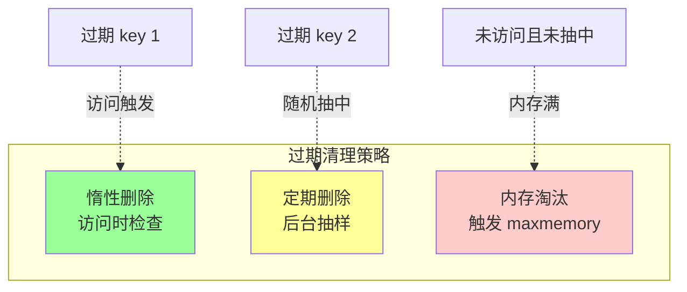
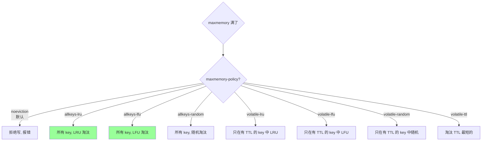
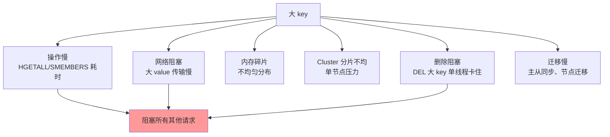

# Redis · 踩坑与调优

> 大 key / 热 key / 内存淘汰 8 策略 / 慢查询 / 过期机制（惰性+定期） / 内存优化 / 排查工具

## 一、过期机制（必懂）

### 1.1 三种过期策略



### 1.2 惰性删除

**机制**：访问 key 时检查是否过期，过期就删除并返回 nil。

**优点**：CPU 友好（按需）。
**缺点**：过期但不被访问的 key **永远占内存**。

### 1.3 定期删除

**机制**：每 100ms（`hz 10`）做一次：
1. 随机抽 20 个**有 TTL 的** key
2. 删除其中已过期的
3. 如果过期比例 > 25%，再抽（直到 < 25% 或超时）

**配置**：

```
hz 10                    # 每秒触发次数 (默认 10)
active-expire-effort 1   # 努力程度 1-10 (默认 1, 越大越积极)
```

**优缺点**：
- 平衡 CPU 和内存
- 不能保证立即清理所有过期 key

### 1.4 为什么两种结合？

只用惰性：过期不访问的 key 占内存
只用定期：CPU 浪费 + 仍可能漏掉
**结合**：互补

### 1.5 过期 key 在主从复制中的行为

- **主**：删除过期 key 后，**广播 DEL 命令**给从
- **从**：自己**不主动删过期 key**（避免数据不一致），等主的 DEL
- 读取从节点时：**Redis 3.2+ 的从节点会过滤过期 key**（返回 nil 但不删）

### 1.6 EXPIRE 的细节

```bash
SET k v EX 60     # 设置 + 过期一步
EXPIRE k 60       # 单独设过期
PEXPIRE k 60000   # 毫秒
EXPIREAT k 1700000000  # 时间戳
TTL k             # 剩余秒
PTTL k            # 剩余毫秒
PERSIST k         # 移除过期
```

**坑**：
- `SET k v` （不带 EX）会**清除原 TTL**
- `RENAME k1 k2` 把 k1 的 TTL 带到 k2
- `DEL k` 后再 `SET k v` TTL 重新计算

## 二、内存淘汰（maxmemory-policy）

### 2.1 8 种策略



| 策略 | 范围 | 算法 | 适用 |
| --- | --- | --- | --- |
| `noeviction` | - | 拒绝写 | 必须保留所有数据 |
| `allkeys-lru` | 所有 | LRU | **缓存（推荐）** |
| `allkeys-lfu` | 所有 | LFU | 缓存（热点稳定） |
| `allkeys-random` | 所有 | 随机 | 用得少 |
| `volatile-lru` | 有 TTL | LRU | 部分持久部分缓存 |
| `volatile-lfu` | 有 TTL | LFU | 同上 |
| `volatile-random` | 有 TTL | 随机 | 同上 |
| `volatile-ttl` | 有 TTL | 最短 TTL | 短期数据 |

### 2.2 LRU vs LFU

**LRU（Least Recently Used）**：淘汰最久没访问的。
**LFU（Least Frequently Used）**：淘汰访问次数最少的。

| | LRU | LFU |
| --- | --- | --- |
| 突发流量 | 突发热点驻留 | 不易留下（频次低） |
| 长期热点 | 偶尔被刷掉 | 稳定保留 |
| 适用 | 时效性强的数据 | 热点稳定的缓存 |

**LFU 升级版**：Redis 4.0+ 用 **LFU 计数器衰减**（`lfu-decay-time 1`），避免历史热点永久占用。

### 2.3 Redis 不是真 LRU

**真 LRU 需要全局排序**（链表 + 哈希），开销大。Redis 用**近似 LRU**：
- 每个 key 记录访问时间戳
- 淘汰时**随机抽 N 个 key**（默认 5），淘汰最久的
- N 越大越接近真 LRU，但 CPU 越高

```
maxmemory-samples 5   # 抽样数, 默认 5, 一般够用
```

### 2.4 缓存场景推荐

```
maxmemory 4gb
maxmemory-policy allkeys-lru
maxmemory-samples 5
```

## 三、大 key

### 3.1 什么是大 key

经验阈值：
- **String**：> 10KB（极限 100KB+）
- **List/Hash/Set/ZSet**：元素数 > 5000

### 3.2 危害



### 3.3 排查

#### 工具 1：`redis-cli --bigkeys`

```bash
redis-cli --bigkeys
# 扫描全库, 报告每种类型最大的 key
```

**注意**：扫全库可能影响性能。低峰期跑，或在从节点跑。

#### 工具 2：`MEMORY USAGE`

```bash
MEMORY USAGE user:1   # 查单个 key 占用字节
```

#### 工具 3：RDB 分析

```bash
# rdb-tools
rdb -c memory dump.rdb > out.csv
# 分析 csv, 按 size 排序
```

不影响线上。

#### 工具 4：自定义扫描

```bash
SCAN 0 MATCH '*' COUNT 100
# 然后对每个 key MEMORY USAGE
```

### 3.4 解决

#### 拆分

```
# 大 Hash 拆成多个小 Hash
user:1 → user:1:profile + user:1:settings + user:1:cart

# 大 List 分页
order:1:items → order:1:items:0 (前 100 条) + order:1:items:1 + ...

# 大 ZSet 按分段
ranking:global → ranking:0-100 + ranking:100-200 + ...
```

#### 压缩 value

JSON → Protobuf / MessagePack / 自定义二进制。

#### 异步删除

```bash
DEL big_key       # 阻塞主线程! 大 key 可能几百 ms
UNLINK big_key    # 4.0+ 异步删除, 立即返回, 后台 BIO 线程清理
```

`FLUSHDB ASYNC` / `FLUSHALL ASYNC` 同理。

### 3.5 预防

- 设计阶段评估单 key 上限
- Code review 关注 SADD / LPUSH 循环
- 定期扫描 + 告警

## 四、热 key

### 4.1 什么是热 key

单个 key 的 QPS 远高于平均（如商品详情页 key 占总流量 30%）。

### 4.2 危害

- 单分片 CPU 打满（Cluster 下单节点压力）
- 网络打满
- 击穿风险（key 过期瞬间 DB 崩）

### 4.3 排查

```bash
# 4.0+ 内置
redis-cli --hotkeys           # 需要 maxmemory-policy 是 LFU 类
MONITOR                        # 实时打印所有命令(超慢, 仅排查用)
```

第三方工具：facebook 的 `redis-faina`、阿里云的 redis hot key 实时分析。

### 4.4 解决

#### 方案 1：本地缓存

热 key 在每台业务机本地缓存（Caffeine / freecache），命中本地则不走 Redis。

#### 方案 2：副本分片

```
key: hot_product:1  →  hot_product:1:0 / hot_product:1:1 / ... / hot_product:1:N
```

读时随机选一个副本（散列到不同 Cluster 分片）。写时全部副本更新。

适合**读远多于写**的极热 key。

#### 方案 3：增加分片

Cluster 加节点 + 重新分片，让热 key 分布到独立节点。

#### 方案 4：限流 + 降级

热 key 接口加限流（如 1000 QPS / IP），超限返回降级。

## 五、慢查询

### 5.1 慢查询日志

```
slowlog-log-slower-than 10000   # 单位微秒, 10ms (默认)
slowlog-max-len 128              # 保留最近 128 条
```

```bash
SLOWLOG GET 10        # 看最近 10 条
SLOWLOG RESET         # 清空
SLOWLOG LEN           # 数量
```

输出含：耗时、命令、参数、客户端 IP。

### 5.2 常见慢命令

| 命令 | 复杂度 | 替代 |
| --- | --- | --- |
| `KEYS *` | O(n) 全扫 | `SCAN cursor` |
| `HGETALL` 大 hash | O(n) | `HSCAN` |
| `SMEMBERS` 大 set | O(n) | `SSCAN` |
| `LRANGE 0 -1` | O(n) | 分页 `LRANGE 0 99` |
| `DEL big_key` | O(n) | `UNLINK`（4.0+） |
| `FLUSHDB` / `FLUSHALL` | O(n) | 加 `ASYNC` |
| `SUNION/SINTER` 大 set | O(n*m) | 拆 |
| 大 Lua 脚本 | O(脚本) | 拆 |

### 5.3 SCAN 系列

```bash
# 渐进式扫描, 不阻塞
SCAN 0 MATCH user:* COUNT 100
# 返回: 下一个 cursor + 一批 key
# 直到 cursor 返回 0
```

特点：
- **非阻塞**：每次只扫一批
- **可能重复**：不保证唯一（要客户端去重）
- **可能漏**：rehash 期间新写入可能漏（业务可接受）
- **COUNT 是建议值**，不是严格

类似 `HSCAN/SSCAN/ZSCAN` 用于大集合内部扫描。

### 5.4 Lua 脚本

Lua 脚本期间**阻塞所有其他命令**（单线程）。**禁止脚本里大循环 / 慢操作**。

```
# 设置 Lua 超时, 超过 kill
lua-time-limit 5000   # 5 秒
```

超时后用 `SCRIPT KILL` 终止（脚本未做写操作时）；做了写操作只能 `SHUTDOWN NOSAVE` 重启（损失数据）。

## 六、内存优化

### 6.1 监控指标

```bash
INFO memory
# used_memory: 已用内存
# used_memory_rss: 操作系统看到的物理内存 (含碎片)
# mem_fragmentation_ratio: rss/used 比例
```

| 比例 | 含义 |
| --- | --- |
| > 1.5 | 碎片严重 |
| 1.0 ~ 1.5 | 正常 |
| < 1.0 | swap 了，性能差 |

### 6.2 减少内存的技巧

#### 技巧 1：用合适的数据结构

- 小对象用 Hash + listpack（比 String + JSON 省）
- 计数用 String 整数（`int` 编码）
- 状态用 Bitmap（vs Set 省 100x）
- 去重统计用 HyperLogLog（vs Set 省千倍）

#### 技巧 2：控制 listpack/hashtable 切换阈值

```
hash-max-listpack-entries 128
hash-max-listpack-value 64
```

让小对象保持紧凑编码。但**编码切换是单向的**（一旦升级到 hashtable 不会回退）。

#### 技巧 3：value 压缩

大 String 用 gzip / snappy 压缩后存。代价：CPU。

#### 技巧 4：合理 TTL

冷数据有 TTL → LRU/LFU 能淘汰。
永不过期的数据慎用，会积累。

#### 技巧 5：碎片整理

```
activedefrag yes               # 4.0+ 主动碎片整理
active-defrag-ignore-bytes 100mb
active-defrag-threshold-lower 10
```

或重启实例（粗暴）。

### 6.3 估算公式

```
单 key 占用 ≈ key 长度 + redisObject (~16B) + value 实际大小 + 编码 overhead
```

100 万个 100 字节 String：约 200~300MB（含 overhead）。

## 七、网络与连接

### 7.1 连接数限制

```
maxclients 10000   # 默认 10000
```

超过返回 `max number of clients reached`。

OS 层 `ulimit -n` 也要相应调大。

### 7.2 Pipeline

减少 RTT，批量发送：

```go
pipe := rdb.Pipeline()
for i := 0; i < 1000; i++ {
    pipe.Set(ctx, fmt.Sprintf("k%d", i), i, 0)
}
pipe.Exec(ctx)  // 一次发送 1000 命令, 一次接收所有结果
```

**性能提升**：原 1000 RTT → 1 RTT（QPS ×100+）。

**注意**：Pipeline 不是事务，命令间可能交错（其他客户端的命令穿插），但**单个客户端的命令保持顺序**。

### 7.3 连接池

```go
rdb := redis.NewClient(&redis.Options{
    Addr:         "localhost:6379",
    PoolSize:     100,           // 默认 10*CPU 数
    MinIdleConns: 10,
    PoolTimeout:  4 * time.Second,
    IdleTimeout:  5 * time.Minute,
})
```

**经验值**：PoolSize = QPS / (1000 / RTT_ms)。
比如 10000 QPS、RTT 1ms → 10 个连接够。但留余量到 50~100。

### 7.4 keepalive

```
tcp-keepalive 300   # 默认 300s
```

防中间件（NAT、LB）断空闲连接。

## 八、安全

### 8.1 密码

```
requirepass <strong_password>
```

不设密码 + 暴露公网 = 灾难（被挖矿）。

### 8.2 不要暴露公网

```
bind 127.0.0.1 内网 IP
# 绝不要 bind 0.0.0.0 + 无密码
```

### 8.3 命令重命名 / 禁用

```
rename-command FLUSHDB ""      # 禁用
rename-command CONFIG admin_config_safe   # 改名
rename-command KEYS ""
```

防止误操作或入侵。

### 8.4 ACL（6.0+）

```
ACL SETUSER alice on >password ~user:* +get +set
# alice 只能 GET/SET 以 user: 开头的 key
```

精细化权限控制，替代单密码。

## 九、监控指标

### 9.1 必看指标

```bash
INFO
```

- **内存**：used_memory, used_memory_rss, fragmentation_ratio
- **客户端**：connected_clients
- **命令**：total_commands_processed, instantaneous_ops_per_sec
- **延迟**：`LATENCY LATEST`, `LATENCY HISTORY`
- **复制**：role, connected_slaves, master_link_status
- **持久化**：rdb_last_save_time, aof_pending_bio_fsync
- **键**：keyspace_hits, keyspace_misses（命中率 = hits/(hits+misses)）

### 9.2 关键告警

- 内存使用率 > 80%
- 命中率 < 90%
- 延迟 > 100ms
- 连接数接近上限
- 主从断连
- bgsave 失败

## 十、高频面试题

**Q1：Redis 过期 key 怎么删除？**
两种结合：
- **惰性删除**：访问时检查
- **定期删除**：每 100ms 抽 20 个 key 检查

只惰性 → 不访问的占内存；只定期 → CPU 浪费。结合最佳。

**Q2：内存淘汰 8 种策略？**
- noeviction（默认，拒绝写）
- allkeys-lru / allkeys-lfu / allkeys-random
- volatile-lru / volatile-lfu / volatile-random / volatile-ttl

缓存推荐 `allkeys-lru`，热点稳定可用 `allkeys-lfu`。

**Q3：Redis 的 LRU 是真 LRU 吗？**
不是，是**近似 LRU**：随机抽 N 个 key（默认 5）淘汰最久的。
真 LRU 需要全局有序链表，开销大。
增大 `maxmemory-samples` 越接近真 LRU 但 CPU 越高。

**Q4：什么是大 key？怎么找？**
经验：String > 10KB，集合元素 > 5000。

排查：
- `redis-cli --bigkeys`（线上慎用）
- `MEMORY USAGE`
- RDB 离线分析（rdb-tools）
- 业务监控

**Q5：删除大 key 怎么办？**
`DEL` 是阻塞的（O(n)），大 key 可能几百 ms 卡住所有请求。
**用 `UNLINK`**（4.0+），异步删除，主线程立即返回，BIO 线程后台清理。

**Q6：怎么处理热 key？**
- **本地缓存**（应用进程内）
- **副本分片**（key 加后缀散到多个节点）
- **Cluster 加节点**
- **限流 + 降级**

**Q7：怎么实现滑动窗口限流？**
ZSet 存请求时间戳：

```bash
# 每次请求
ZADD limit:user:1 <now> <unique_id>
ZREMRANGEBYSCORE limit:user:1 0 <now-window>
ZCARD limit:user:1
# 超过阈值就拒绝
```

详见 08。

**Q8：Pipeline 和事务区别？**

| | Pipeline | MULTI/EXEC |
| --- | --- | --- |
| 目的 | 减少 RTT | 原子执行 |
| 原子性 | ❌（可能与其他命令交错） | ✓ |
| 客户端 | 客户端缓存命令再批发 | 服务端排队再批执行 |
| 性能 | 极快 | 一般 |

90% 用 Pipeline 优化。

**Q9：Redis 怎么检测慢命令？**

```
slowlog-log-slower-than 10000  # 10ms
SLOWLOG GET 10
```

监控告警：慢日志数突增 → 某个命令出问题。

**Q10：内存碎片严重怎么办？**

`mem_fragmentation_ratio > 1.5`：
- 4.0+ 开 `activedefrag yes`（主动整理）
- 旧版本：重启实例（最粗暴）
- 长期：减小数据波动（避免大量过期+新增）

## 十一、配置速查（生产模板）

```
# 网络
bind 127.0.0.1 192.168.1.10   # 内网 IP
port 6379
requirepass StrongPwd@123
tcp-keepalive 300
timeout 0
maxclients 10000

# 内存
maxmemory 4gb
maxmemory-policy allkeys-lru
maxmemory-samples 5

# 持久化
save 3600 1
save 300 100
appendonly yes
appendfsync everysec
auto-aof-rewrite-percentage 100
auto-aof-rewrite-min-size 64mb
aof-use-rdb-preamble yes

# 复制
repl-backlog-size 100mb
min-slaves-to-write 1
min-slaves-max-lag 10

# 慢查询
slowlog-log-slower-than 10000
slowlog-max-len 1000

# 安全
rename-command FLUSHDB ""
rename-command FLUSHALL ""
rename-command KEYS ""
rename-command CONFIG admin_config_safe

# IO 多线程 (6.0+)
io-threads 4
io-threads-do-reads yes

# 碎片整理 (4.0+)
activedefrag yes
```

## 十二、面试加分点

- 过期机制是惰性 + 定期组合
- 主从复制时从节点不主动删过期 key（避免不一致）
- LRU 是近似的（抽样），不是真 LRU
- LFU 衰减（lfu-decay-time）防止历史热点永久占用
- `UNLINK` vs `DEL` 区别（异步删除）
- listpack/hashtable 编码切换是**单向的**
- bigkeys 命令可能影响性能，建议从节点跑
- Pipeline 不是事务（可能交错）
- `SLOWLOG` 是排障神器
- 监控关键：内存使用率、命中率、延迟、复制状态
- 安全：bind 内网 + 密码 + 命令 rename
