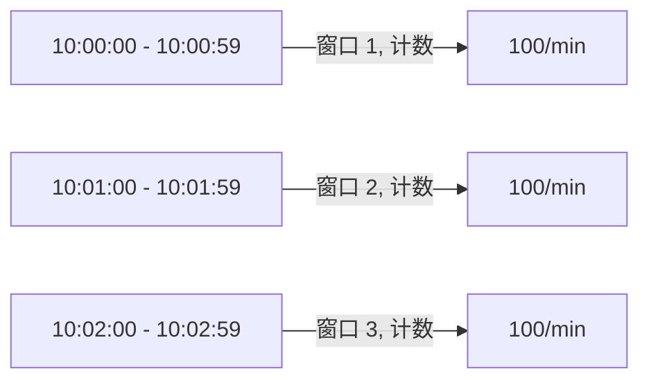
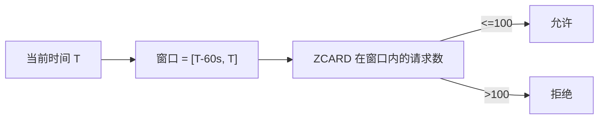
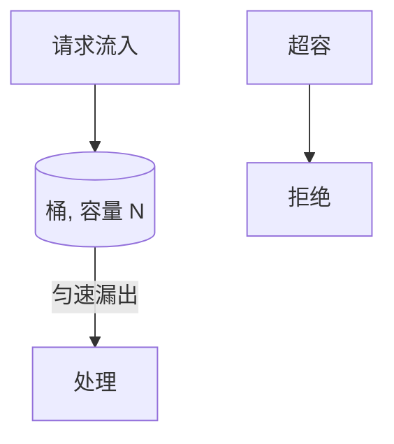
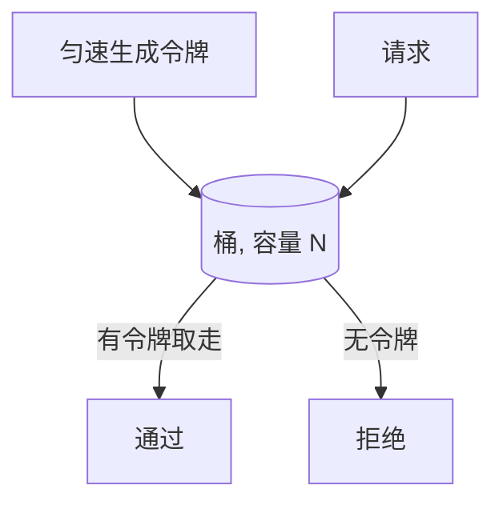
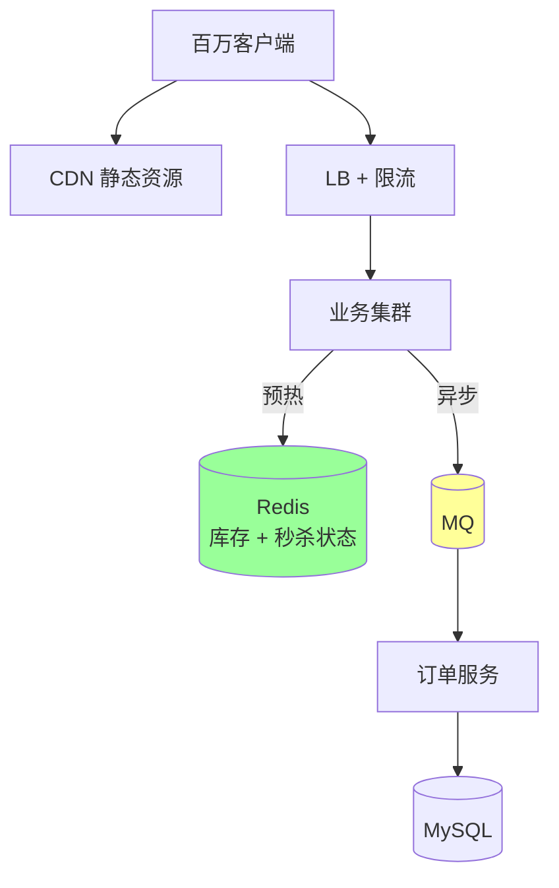

# Redis · 场景实战

> 排行榜 / 计数器 / 限流（4 种） / 延时队列 / 消息队列 / 布隆过滤器 / 地理位置 / Pub-Sub / 会话 / 秒杀

> 每个场景：用什么数据结构 + 核心命令 + 完整实现 + 踩坑

## 一、排行榜（Leaderboard）

### 1.1 数据结构：ZSet

```bash
ZADD rank:game 1500 user1
ZADD rank:game 2000 user2
ZADD rank:game 1800 user3

ZREVRANGE rank:game 0 9 WITHSCORES   # Top 10
ZREVRANK rank:game user1              # 我的排名 (从 0 开始)
ZSCORE rank:game user1                # 我的分数
ZINCRBY rank:game 100 user1           # 加分
ZRANGEBYSCORE rank:game 1500 2000     # 1500-2000 分段
```

### 1.2 多维排行（按时间过滤）

```bash
# Daily 排行: 每天一个 key, 周期性归档
ZADD rank:daily:20240101 1500 user1

# 实时排行: ZSet score 编码 (高 32 位时间戳, 低 32 位分数, 同分数按时间排)
score = (timestamp << 32) | score
```

### 1.3 海量数据分页

```bash
ZREVRANGEBYSCORE rank:game +inf 0 LIMIT 0 20    # 第一页
ZREVRANGEBYSCORE rank:game (last_score 0 LIMIT 0 20  # 下一页
```

按 score 游标翻页（避免 LIMIT offset 在 ZSet 上 O(log n + offset) 慢）。

### 1.4 实战坑

- **ZSet 节点过大**：百万级用户实时排行 + 高频 ZADD，单实例热点 → 分段（按地区/服等）或 `ZSet score 用 hash tag`
- **同分排序**：同 score 时按 member 字典序，业务可能不期望 → score 编码方案（见上）

## 二、计数器

### 2.1 普通计数

```bash
INCR pv:page:1            # 页面 PV
INCRBY counter 5
DECR / DECRBY
GET pv:page:1
```

**原子**：单线程保证。

**适用**：PV、点赞、下载、API 调用次数。

### 2.2 多维计数（Hash）

```bash
HINCRBY user:1:stats login 1
HINCRBY user:1:stats post 1
HGETALL user:1:stats
```

**优势**：一个 key 多个计数，省 key 数量 + 节省内存。

### 2.3 UV 统计

精确：用 Set（耗内存）

```bash
SADD uv:page:1:20240101 userid_1 userid_2 ...
SCARD uv:page:1:20240101
```

**有损但极省**：HyperLogLog（详见 02）

```bash
PFADD uv:page:1:20240101 userid_1 userid_2 ...
PFCOUNT uv:page:1:20240101
PFMERGE uv:total uv:page:1:20240101 uv:page:2:20240101
```

12KB 估亿级 UV，误差 < 1%。

### 2.4 实时统计（每秒/每分钟）

时间作为 key 后缀：

```bash
INCR pv:20240101:14:30   # 每分钟一个 key
EXPIRE pv:20240101:14:30 86400   # TTL 1 天
```

聚合时累加多个 key（或预聚合存 daily key）。

## 三、限流（核心场景，4 种实现）

### 3.1 固定窗口



```go
func allow(ctx context.Context, userID int64) bool {
    key := fmt.Sprintf("limit:%d:%d", userID, time.Now().Unix()/60)
    count, _ := rdb.Incr(ctx, key).Result()
    if count == 1 {
        rdb.Expire(ctx, key, 70*time.Second)  // 略大于窗口
    }
    return count <= 100
}
```

**优点**：简单。
**缺点**：**临界突刺**——59 秒和 1 分 0 秒之间 200 次请求都允许。

### 3.2 滑动窗口（ZSet 实现）



```go
const slidingScript = `
local key = KEYS[1]
local now = tonumber(ARGV[1])
local window = tonumber(ARGV[2])
local limit = tonumber(ARGV[3])

redis.call('ZREMRANGEBYSCORE', key, 0, now - window)  -- 清理过期
local count = redis.call('ZCARD', key)
if count < limit then
    redis.call('ZADD', key, now, now)
    redis.call('EXPIRE', key, math.ceil(window / 1000))
    return 1
end
return 0`

func slidingAllow(ctx context.Context, key string, window, limit int) bool {
    now := time.Now().UnixMilli()
    res, _ := rdb.Eval(ctx, slidingScript, []string{key},
        now, window, limit).Int()
    return res == 1
}
```

**优点**：精确，无临界突刺。
**缺点**：内存高（每个请求一个 ZSet 元素）。

### 3.3 漏桶（Leaky Bucket）



匀速处理，超过容量丢弃。**严格平滑流量**。

```go
// 简化实现: Lua 脚本
const leakyScript = `
local key = KEYS[1]
local now = tonumber(ARGV[1])
local rate = tonumber(ARGV[2])     -- 漏速 个/秒
local capacity = tonumber(ARGV[3])

local last = tonumber(redis.call('HGET', key, 'last') or now)
local water = tonumber(redis.call('HGET', key, 'water') or 0)

water = math.max(0, water - (now - last) * rate / 1000)
if water + 1 > capacity then return 0 end
water = water + 1

redis.call('HSET', key, 'last', now, 'water', water)
redis.call('EXPIRE', key, math.ceil(capacity / rate))
return 1`
```

### 3.4 令牌桶（Token Bucket）



**vs 漏桶**：允许突发（桶里攒了令牌可一次消耗）。

```lua
local key = KEYS[1]
local now = tonumber(ARGV[1])
local rate = tonumber(ARGV[2])
local capacity = tonumber(ARGV[3])
local tokens = tonumber(ARGV[4])  -- 本次需要的令牌数

local last = tonumber(redis.call('HGET', key, 'last') or now)
local cur = tonumber(redis.call('HGET', key, 'tokens') or capacity)

cur = math.min(capacity, cur + (now - last) * rate / 1000)
if cur < tokens then return 0 end
cur = cur - tokens

redis.call('HSET', key, 'last', now, 'tokens', cur)
redis.call('EXPIRE', key, math.ceil(capacity / rate))
return 1
```

### 3.5 选型

| | 简单度 | 精确度 | 突发支持 | 适用 |
| --- | --- | --- | --- | --- |
| 固定窗口 | 极简 | 差（突刺） | 否 | 粗略限制 |
| 滑动窗口 | 中 | 高 | 否 | 精确限制 |
| 漏桶 | 中 | 高 | 否 | 严格平滑 |
| 令牌桶 | 中 | 高 | **是** | **大多场景** |

业务多用**令牌桶**（允许突发，平均不超）。

## 四、延时队列

### 4.1 ZSet 实现

**核心**：score 是执行时间戳（毫秒）。

```bash
ZADD delay_queue 1700000000000 task_payload
```

后台 worker 轮询：

```bash
# Lua 原子: 拿到期任务 + 删除
EVAL "local ts = tonumber(ARGV[1])
local items = redis.call('ZRANGEBYSCORE', KEYS[1], 0, ts, 'LIMIT', 0, 10)
if #items > 0 then
    redis.call('ZREM', KEYS[1], unpack(items))
end
return items" 1 delay_queue <now_ms>
```

```go
func consumer(ctx context.Context) {
    ticker := time.NewTicker(time.Second)
    for range ticker.C {
        items, _ := rdb.Eval(ctx, popScript,
            []string{"delay_queue"}, time.Now().UnixMilli()).StringSlice()
        for _, item := range items {
            go process(item)
        }
    }
}
```

### 4.2 适用

- 订单超时关闭（30 分钟未支付取消）
- 延迟通知（24 小时后提醒）
- 重试任务（失败 5 分钟后重试）

### 4.3 坑

- **轮询间隔**：太短浪费 CPU，太长延迟大
- **任务太多**：百万级 ZSet 可能成大 key
- **可靠性**：消费 crash 任务丢失 → 用 Stream / RocketMQ 延时消息更可靠

## 五、消息队列

### 5.1 List 实现（最简）

```bash
# 生产
LPUSH queue msg1

# 消费 (阻塞)
BRPOP queue 0   # 阻塞直到有消息
```

**特点**：
- 简单
- **不可靠**：BRPOP 拿走就删，处理失败消息丢失
- 无消费者组（一个消息只能一个消费者拿）

### 5.2 Stream 实现（5.0+，推荐）

```bash
# 生产
XADD orders * order_id 1 amount 100

# 创建消费者组
XGROUP CREATE orders consumer1 $ MKSTREAM

# 消费
XREADGROUP GROUP consumer1 c1 COUNT 10 STREAMS orders >

# ACK
XACK orders consumer1 message_id
```

**特点**：
- 持久化
- 消费者组
- ACK 机制（不 ACK 的会留 PEL，可重投）
- 回溯消费

### 5.3 选型

| | List | Stream | Pub/Sub | Kafka |
| --- | --- | --- | --- | --- |
| 持久化 | 是 | 是 | **否** | 是 |
| ACK | 否 | 是 | 否 | 是 |
| 消费组 | 否 | 是 | 否 | 是 |
| 广播 | 否 | 是（多组） | 是 | 是 |
| 体量 | 小 | 中 | 小 | 大 |

简单通知 → List/Pub-Sub
中等可靠 → Stream
重型 → Kafka/RocketMQ

## 六、布隆过滤器

### 6.1 用途

防止缓存穿透（详见 05）：判断"key 一定不存在"。

### 6.2 实现

#### 方式 1：RedisBloom 模块

```bash
BF.RESERVE bf 0.01 1000000      # 误判率 1%, 1M 元素
BF.ADD bf user_1
BF.EXISTS bf user_1
BF.MADD / BF.MEXISTS
```

#### 方式 2：自实现（Bitmap + 多 hash）

```go
type BloomFilter struct {
    rdb    *redis.Client
    key    string
    hashes []hash.Hash64
    bits   uint64
}

func (b *BloomFilter) Add(item string) {
    pipe := b.rdb.Pipeline()
    for _, h := range b.hashes {
        h.Reset()
        h.Write([]byte(item))
        offset := h.Sum64() % b.bits
        pipe.SetBit(ctx, b.key, int64(offset), 1)
    }
    pipe.Exec(ctx)
}

func (b *BloomFilter) Maybe(item string) bool {
    pipe := b.rdb.Pipeline()
    cmds := make([]*redis.IntCmd, len(b.hashes))
    for i, h := range b.hashes {
        h.Reset()
        h.Write([]byte(item))
        cmds[i] = pipe.GetBit(ctx, b.key, int64(h.Sum64() % b.bits))
    }
    pipe.Exec(ctx)
    for _, c := range cmds {
        if c.Val() == 0 { return false }
    }
    return true
}
```

### 6.3 计算公式

```
m = -(n * ln(p)) / (ln 2)^2     # 位数组大小
k = (m / n) * ln 2              # hash 函数数量
```

例：n=1M, p=1% → m≈9.6M bit (1.2MB), k≈7。

### 6.4 局限

- 不能删除元素（删了影响其他元素的判断）→ 用 Cuckoo Filter 解决
- 误判率与位数组大小、hash 数有关
- **永远不会漏判存在**（说"不存在"100% 准），可能误判不存在的为存在

## 七、地理位置

### 7.1 GEO 命令

```bash
# 添加
GEOADD bikes:pos 116.404 39.915 "bike1"
GEOADD bikes:pos 116.405 39.916 "bike2"

# 查询附近
GEOSEARCH bikes:pos FROMLONLAT 116.4 39.9 BYRADIUS 100 m ASC COUNT 10 WITHCOORD WITHDIST

# 计算距离
GEODIST bikes:pos bike1 bike2 m

# 获取坐标
GEOPOS bikes:pos bike1

# 删除 (用 ZREM)
ZREM bikes:pos bike1
```

### 7.2 原理

底层是 ZSet，score 是 GeoHash 编码（52 bit）。GeoHash 把二维坐标编码成一维字符串，邻近点 GeoHash 也接近，可用 ZSet 范围查询。

### 7.3 适用

- 附近的人/车/店
- 同城配送（限定半径）
- 实时位置追踪

### 7.4 坑

- **大数据集慢**：百万级 GEO 全表扫描慢，用 hash tag 分区域存
- **精度限制**：GeoHash 52 bit 在地球上约 1 米精度
- **跨节点查询**：Cluster 下 GEO 数据要在同节点（hash tag）

## 八、Pub/Sub（发布订阅）

### 8.1 命令

```bash
# 订阅
SUBSCRIBE news
PSUBSCRIBE news.*    # 模式订阅

# 发布
PUBLISH news "hello"
```

### 8.2 特点

- **不持久化**：发布时无订阅者 → 消息丢失
- **不 ACK**：发了就完
- **广播**：所���订阅者都收到

### 8.3 适用

- 实时通知（在线状态变化）
- 缓存失效通知（删本地缓存）
- 简单广播

### 8.4 不适用

可靠消息 → 用 Stream/Kafka。

### 8.5 Cluster 下

普通 PUBLISH 在 Cluster 中**广播到所有节点**（性能差）。
**Sharded Pub/Sub**（7.0+）：`SPUBLISH/SSUBSCRIBE`，按 channel hash 到 slot 上，只广播到该 slot 所属节点。

## 九、会话存储

### 9.1 实现

```bash
# 写
HSET session:abc123 user_id 1 name alice expires_at 1700000000
EXPIRE session:abc123 3600    # 1 小时

# 读
HGETALL session:abc123

# 续期
EXPIRE session:abc123 3600
```

### 9.2 vs JWT

| | Redis Session | JWT |
| --- | --- | --- |
| 服务端状态 | 有 | 无 |
| 撤销 | 易（DEL） | 难（要黑名单） |
| 大小 | 服务端任意 | 受 cookie 大小限制 |
| 性能 | 每次请求查 Redis | 验签即可 |
| 扩展 | 需要 Redis | 无依赖 |

业务多用 **Redis Session**（撤销方便）；移动端 / 微服务用 JWT。

## 十、秒杀

### 10.1 难点

- 瞬时百万 QPS
- 防超卖
- 防黄牛

### 10.2 架构



**核心**：Redis 扛流量 + MQ 削峰 + DB 异步处理。

### 10.3 库存扣减（Lua 原子）

```lua
local stock = tonumber(redis.call('GET', KEYS[1]))
if stock <= 0 then return 0 end
redis.call('DECR', KEYS[1])
return 1
```

```go
const deductScript = `
local stock = tonumber(redis.call('GET', KEYS[1]))
if not stock or stock <= 0 then return 0 end
redis.call('DECR', KEYS[1])
return 1`

func deduct(ctx context.Context, sku string) bool {
    res, _ := rdb.Eval(ctx, deductScript, []string{"stock:" + sku}).Int()
    return res == 1
}
```

成功扣减 → 写订单消息到 MQ → 订单服务异步落 DB。

### 10.4 防重复购买

```bash
# 用户已购集合
SADD seckill:bought:sku1 user_id

# 扣库存前检查
SISMEMBER seckill:bought:sku1 user_id   # 已买就拒绝
```

或用 SETNX：

```bash
SET seckill:user_sku:{user_id}:{sku_id} 1 NX EX 86400
```

### 10.5 防刷

- IP 限流
- 用户限流
- 验证码 / 风控
- 接口签名

## 十一、其他常见

### 11.1 实时点赞

```bash
# 点赞
SADD post:1:likes user_id    # 集合, 自然去重
SCARD post:1:likes            # 总数

# 取消
SREM post:1:likes user_id

# 检查我点过吗
SISMEMBER post:1:likes user_id
```

### 11.2 推荐 / 协同过滤

```bash
# 你和我的共同关注
SINTER user:1:followers user:2:followers

# 你关注的人也关注的（你可能感兴趣）
SUNION user:friend1:followers user:friend2:followers
SDIFF result user:1:followers   # 排除我已关注的
```

### 11.3 标签系统

```bash
# 文章 → 标签
SADD post:1:tags golang redis backend

# 标签 → 文章 (反向索引)
SADD tag:golang:posts 1 5 7

# 多标签查询: 同时有 golang AND redis
SINTER tag:golang:posts tag:redis:posts
```

### 11.4 抽奖

```bash
# 候选池
SADD lottery:pool user1 user2 ... user100

# 随机抽 1 个 (不删除)
SRANDMEMBER lottery:pool

# 随机抽 + 删除 (一次性)
SPOP lottery:pool 3   # 抽 3 个不重复
```

### 11.5 用户在线状态

```bash
# 简单: SET + TTL
SET online:user:1 1 EX 300
EXISTS online:user:1

# 海量: Bitmap
SETBIT online_users <user_id> 1
BITCOUNT online_users        # 总在线数
GETBIT online_users <user_id>
```

### 11.6 IP 黑名单

```bash
SADD blacklist:ip 1.2.3.4 5.6.7.8
SISMEMBER blacklist:ip 1.2.3.4
```

或 Bitmap（IP 转 long）。

### 11.7 配置中心

```bash
# 配置存 Hash
HSET config:user-service db.host 10.0.0.1 db.port 3306

# 监听变更 (Pub/Sub)
PUBLISH config:user-service updated
# 订阅者: 收到通知后重新 HGETALL
```

## 十二、命令速查

| 场景 | 数据结构 | 关键命令 |
| --- | --- | --- |
| 缓存对象 | String/Hash | SET/GET, HSET/HMGET |
| 计数器 | String | INCR/INCRBY |
| 限流 | String/ZSet | INCR + EXPIRE / ZADD+ZREMRANGEBYSCORE |
| 排行榜 | ZSet | ZADD/ZREVRANGE/ZRANK |
| 延时队列 | ZSet | ZADD score=time, ZRANGEBYSCORE |
| 简单队列 | List | LPUSH/BRPOP |
| 可靠队列 | Stream | XADD/XREADGROUP/XACK |
| 去重统计 | Set/HyperLogLog | SADD/PFADD |
| 用户标签 | Set | SADD/SINTER |
| 签到/在线 | Bitmap | SETBIT/BITCOUNT |
| 附近的人 | Geo | GEOADD/GEOSEARCH |
| 分布式锁 | String | SET NX PX + Lua |
| 通知 | Pub/Sub | PUBLISH/SUBSCRIBE |
| 会话 | Hash + EXPIRE | HSET/EXPIRE |

## 十三、面试加分点

- 排行榜用 ZSet + score 编码（同分按时间）
- UV 选 HyperLogLog（12KB 估亿级 1% 误差）
- 限流首选**令牌桶**（允许突发 + 平均控制）
- 滑动窗口比固定窗口精确（无突刺）
- 延时队列用 ZSet 但大量任务要分散
- Stream 比 List 可靠，比 Kafka 轻量
- 布隆过滤器**只能加不能删**（要删用 Cuckoo Filter）
- Pub/Sub 在 Cluster 用 Sharded Pub/Sub（7.0+）
- 秒杀核心：Redis 扛流量 + Lua 原子扣减 + MQ 削峰
- Bitmap 适合稀疏属性（在线/签到），密集属性反而费
- 用 hash tag 让相关 key 落同 Cluster 节点（特别是事务/Lua/MGET）
