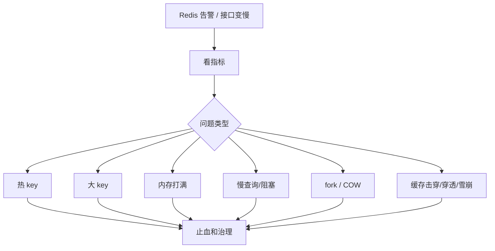

# Redis 线上案例与排查

> Redis 线上问题通常不是“Redis 慢”这么简单，而是热 key、大 key、内存、阻塞命令、fork、网络、缓存一致性共同作用。

## 一、排查总入口



核心指标：

- QPS、RT、P99。
- `used_memory`、`maxmemory`、内存碎片率。
- `connected_clients`、`blocked_clients`。
- `instantaneous_ops_per_sec`。
- `keyspace_hits` / `keyspace_misses`。
- slowlog。
- 主从复制延迟。
- fork 耗时、AOF/RDB 状态。

## 二、案例 1：热 key 打爆单分片

### 现象

- 某个 Redis 分片 CPU 高。
- 单个 key QPS 极高。
- 业务接口 P99 升高。
- Redis 集群整体没满，但某个节点满了。

### 常见原因

- 爆款商品库存、活动配置。
- 热门直播间信息。
- 大 V 主页或 Feed。
- 全站配置 key 被所有请求读取。

### 排查

```text
redis-cli --hotkeys
redis-cli monitor   # 谨慎，生产短时间使用
业务埋点统计 key 访问量
代理层 / SDK 侧统计 key 维度 QPS
```

### 处理

- 本地缓存：进程内缓存短 TTL。
- 多级缓存：本地缓存 + Redis。
- key 拆分：`hot_key:{0..N}` 随机读。
- 异步刷新：热点数据提前预热。
- 限流和降级：热点接口保护。

### 面试表达

```text
热 key 的问题是集群总容量够，但单分片被打爆。
我会先通过 Redis hotkeys、代理层统计或业务埋点定位 key，再用本地缓存、key 拆分、预热和限流治理。
```

## 三、案例 2：大 key 导致阻塞和网络抖动

### 现象

- Redis RT 偶发升高。
- 网络出口流量突然增大。
- 删除某个 key 时卡顿。
- 主从同步、迁移变慢。

### 常见大 key

- 一个 Hash 放几十万字段。
- 一个 List / ZSet 非常大。
- String 存几 MB JSON。
- bitmap / set 无限增长。

### 排查

```text
redis-cli --bigkeys
MEMORY USAGE key
SCAN + TYPE + STRLEN/HLEN/LLEN/SCARD/ZCARD
```

注意：

- 避免生产直接 `KEYS *`。
- `SCAN` 也要控制频率。

### 处理

- 拆 key：按业务维度、时间、分片拆。
- 分页读取：避免一次拉全量。
- 异步删除：`UNLINK` 替代 `DEL`。
- 限制 value 大小。
- 数据归档或改用更合适存储。

## 四、案例 3：Redis 内存打满

### 现象

- 写入失败。
- 命中率下降。
- 淘汰 key 增多。
- 主从复制异常。
- 延迟升高。

### 排查

```text
INFO memory
INFO stats
INFO keyspace
CONFIG GET maxmemory
CONFIG GET maxmemory-policy
```

重点看：

- `used_memory`。
- `used_memory_rss`。
- `mem_fragmentation_ratio`。
- `evicted_keys`。
- `expired_keys`。

### 常见原因

- 缓存没有 TTL。
- 大 key 增长。
- 热点业务流量突增。
- AOF/RDB fork 期间 COW 放大。
- 内存碎片。
- 淘汰策略不符合业务。

### 处理

- 临时扩容或提高 maxmemory。
- 清理无 TTL key。
- 拆分大 key。
- 设置合理淘汰策略。
- 分业务隔离 Redis 实例。
- 控制 fork 时机。

## 五、案例 4：慢查询和阻塞命令

### 慢查询来源

- `KEYS`、`FLUSHALL`、`FLUSHDB`。
- 大集合 `SMEMBERS`、`HGETALL`、`LRANGE 0 -1`。
- 大 key 删除。
- Lua 脚本执行过久。
- 排序、交并差大集合。

### 排查

```text
SLOWLOG GET 128
INFO commandstats
LATENCY DOCTOR
LATENCY LATEST
```

### 处理

- 禁止线上 `KEYS`。
- 大集合分页读取。
- `UNLINK` 异步删除。
- Lua 控制复杂度和执行时间。
- 大 key 拆分。
- 对高风险命令做 ACL 或代理层拦截。

## 六、案例 5：fork / COW 导致延迟抖动

Redis RDB、AOF rewrite 需要 fork。

问题：

```text
数据量大
  -> fork 耗时增加
  -> COW 内存放大
  -> 主线程短暂阻塞
  -> 延迟抖动
```

排查：

```text
INFO persistence
INFO memory
LATENCY LATEST
```

重点：

- `latest_fork_usec`
- `rdb_bgsave_in_progress`
- `aof_rewrite_in_progress`
- `used_memory_rss`

治理：

- 控制实例内存大小。
- 低峰做 rewrite。
- 主从分离备份。
- 关闭不必要持久化。
- 预留 COW 内存。

## 七、案例 6：缓存击穿、穿透、雪崩

| 类型 | 现象 | 治理 |
| --- | --- | --- |
| 击穿 | 热点 key 失效，大量请求打 DB | 互斥重建、逻辑过期、热点预热 |
| 穿透 | 请求不存在数据，缓存不住 | 空值缓存、布隆过滤器、参数校验 |
| 雪崩 | 大量 key 同时失效或 Redis 故障 | TTL 随机化、多级缓存、限流降级 |

止血：

- 限流。
- 临时延长热点 key TTL。
- 返回旧值。
- 熔断非核心接口。
- DB 保护。

## 八、常见坑

- 生产使用 `KEYS *`。
- 大 key 一次性读取或删除。
- 热点 key 没有本地缓存。
- 缓存 TTL 同一时间过期。
- Redis 连接池过小或无超时。
- 把 Redis 当数据库，长期存全量业务数据。
- fork 期间没有预留内存。

## 九、面试表达

```text
Redis 线上问题我会先看 CPU、RT、slowlog、内存、命中率、blocked_clients 和主从延迟。
热 key 是单分片被打爆，大 key 是单次操作和网络传输太重，内存打满要看 maxmemory、淘汰策略和 COW。
慢查询重点看 slowlog、commandstats 和 latency doctor，避免 KEYS、HGETALL、大集合全量读取和大 key DEL。
缓存击穿、穿透、雪崩要分别用互斥重建/逻辑过期、空值缓存/布隆、TTL 随机化/多级缓存/限流降级治理。
```

