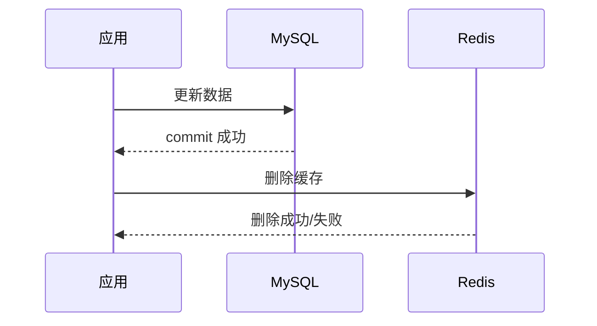
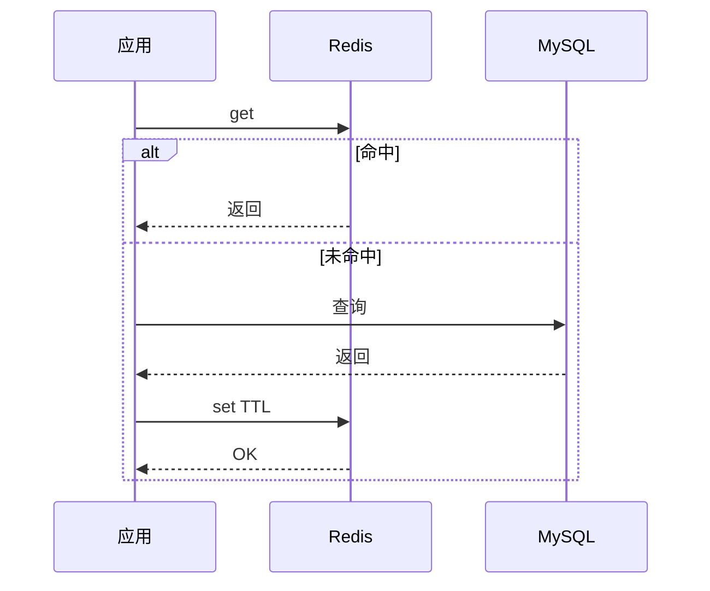

# 缓存一致性设计

> 缓存一致性没有银弹。大多数互联网业务追求“最终一致 + 可控不一致窗口 + 补偿”，核心是明确读写链路和失败处理。

## 一、先说结论

常用方案：

```text
Cache Aside：先写 DB，再删缓存
```

为什么不是先更新缓存？

- 缓存可能有复杂结构，更新容易漏字段。
- 并发写下更新顺序难控制。
- 删除比更新更简单，下一次读回源重建。

## 二、常见模式

| 模式 | 写路径 | 适用 |
| --- | --- | --- |
| Cache Aside | 业务写 DB，再删缓存 | 最常用 |
| Read Through | 应用读缓存，由缓存组件加载 DB | 组件封装场景 |
| Write Through | 写缓存时同步写 DB | 写路径简单但耦合高 |
| Write Behind | 先写缓存，异步写 DB | 高吞吐但一致性风险高 |

## 三、Cache Aside 流程



读路径：



## 四、为什么是“先写 DB，再删缓存”

### 先删缓存，再写 DB 的问题

```text
T1 删除缓存
T2 另一个请求读缓存 miss
T3 读 DB 旧值
T4 把旧值写回缓存
T5 T1 写 DB 新值
结果：缓存长期是旧值
```

### 先写 DB，再删缓存的问题

仍有窗口：

```text
T1 读缓存 miss
T2 读 DB 旧值
T3 T2 准备 set 缓存
T4 T1 写 DB 新值并删除缓存
T5 T2 把旧值 set 回缓存
```

这个窗口通常较小，可以通过：

- 设置短 TTL。
- 延迟双删。
- 版本号。
- binlog 异步删除。
- 强制读主库。

降低风险。

## 五、延迟双删

流程：

```text
写 DB
删除缓存
sleep 一小段时间
再次删除缓存
```

作用：

- 处理并发读把旧值回填的问题。

局限：

- sleep 时间难定。
- 增加写链路耗时。
- 不是强一致。

适合：

- 读写并发高。
- 可接受短暂不一致。
- 不想引入复杂异步订阅链路。

## 六、binlog 异步删缓存

流程：


优点：

- 业务写链路更简单。
- 可重试。
- 可补偿。
- 能统一处理缓存删除。

风险：

- 删除延迟。
- binlog 消费积压。
- key 映射复杂。
- 消息重复，需要幂等。

## 七、强一致读怎么办

如果业务要求读到最新值：

- 读 DB，不读缓存。
- 写后短时间强制读主库。
- 缓存带版本号，旧版本拒绝回填。
- 对核心状态用 DB 条件查询。

典型强一致场景：

- 支付状态。
- 订单状态。
- 库存扣减结果。
- 账户余额。

不要为了所有读都强一致，牺牲全局性能。要区分：

```text
核心状态强一致
展示数据最终一致
统计数据异步一致
```

## 八、缓存重建并发控制

缓存 miss 后不要所有请求都查 DB。

方案：

- 互斥锁重建。
- singleflight。
- 逻辑过期。
- 返回旧值。
- 限流。

逻辑过期：

```text
缓存 value 内带 expire_at
读到过期数据时：
  一个线程异步重建
  其他请求先返回旧值
```

适合热点数据，牺牲短暂新鲜度保护 DB。

## 九、删除失败怎么办

写 DB 成功，删缓存失败是高频坑。

治理：

- 删除缓存失败写入重试队列。
- MQ 异步重试。
- binlog 订阅兜底。
- 缓存 TTL 兜底。
- 定时校验和修复。

不要只写日志就结束。

## 十、常见坑

- 更新 DB 后直接更新缓存，字段不完整导致脏数据。
- 先删缓存再写 DB，旧值被回填。
- 删除缓存失败没有重试。
- 热点 key 重建没有互斥，打爆 DB。
- 核心状态盲目走缓存，读到旧值。
- 缓存没有 TTL，脏数据长期存在。
- binlog 删除缓存不处理积压和重复。

## 十一、面试表达

```text
缓存一致性我一般用 Cache Aside：读缓存 miss 查 DB 回填，写先更新 DB，再删除缓存。
它不是强一致，但能把不一致窗口控制在较小范围，并通过 TTL、延迟双删、删除重试、binlog 订阅和对账补偿兜底。
对于支付状态、订单状态、库存这种核心状态，我不会完全依赖缓存，而是走 DB 或写后读主。
展示类数据可以接受最终一致，重点是防止缓存击穿和删除失败后长期脏读。
```

