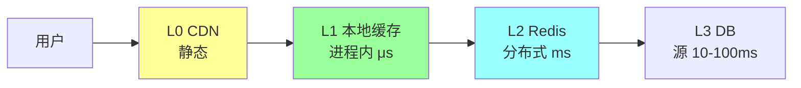
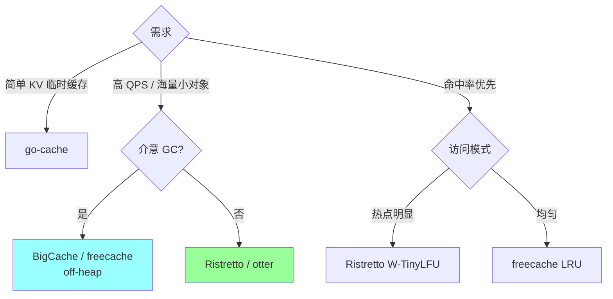
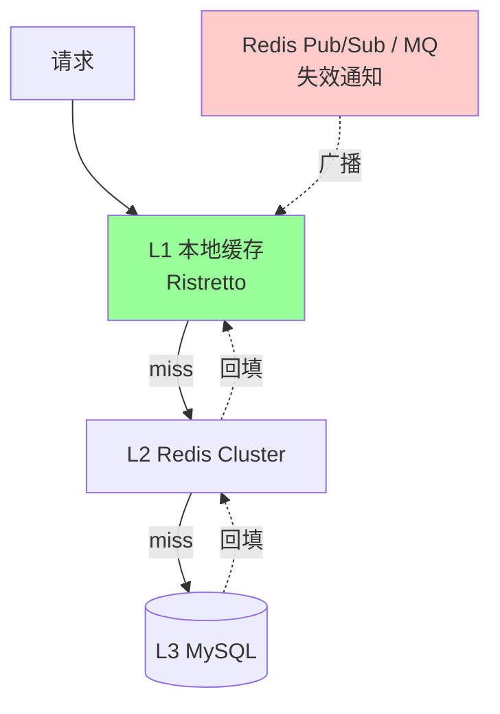
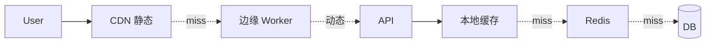

# 多级缓存与本地缓存（Go 实战）

> 深化 Redis 篇的"多级缓存"话题：为什么 / 怎么设计 / Caffeine / Ristretto / BigCache / freecache / go-cache / sync.Map 对比 / 一致性 / 真实案例
>
> 配合 [04-redis/05-cache-patterns](../04-redis/05-cache-patterns.md) + [04-redis/10-cache-consistency-design](../04-redis/10-cache-consistency-design.md)

---

## 一、为什么需要多级缓存

### 1.1 单级 Redis 的问题

```
问题:
1. 网络开销（RTT 0.5-2ms）
2. Redis 单机 QPS 上限 ~10 万
3. 热点 key 打爆单分片
4. 大促峰值 Redis 扛不住
5. Redis 挂了全挂
```

### 1.2 多级缓存的收益

```
本地缓存命中: μs 级（内存访问）
Redis 命中:   ms 级（含 RTT）
DB 命中:      10-100ms

热点命中率:
  L1（本地）90%
  L2（Redis）9%
  L3（DB）1%

→ 整体延迟大幅降低 + DB 压力降低
```

### 1.3 经典多级架构



---

## 二、Go 本地缓存库对比

### 2.1 主流库对比表

| 库 | 类型 | 淘汰算法 | 过期 | 统计 | 分片 | 性能 | 内存效率 | Star |
| --- | --- | --- | --- | --- | --- | --- | --- | --- |
| **sync.Map** | 标准库 | 无 | 无 | 无 | 无 | 高 | 差（GC 压力） | - |
| **go-cache** | patrickmn/go-cache | 简单（无 LRU） | ✅ | 无 | 无 | 中 | 中 | 8k+ |
| **BigCache** | allegro/bigcache | FIFO | ✅ | 基础 | ✅ | 高 | **好**（免 GC）| 8k+ |
| **freecache** | coocood/freecache | LRU | ✅ | 基础 | ✅ | 高 | **好**（免 GC） | 5k+ |
| **Ristretto** | dgraph-io/ristretto | **TinyLFU** | ✅ | 详细 | ✅ | **极高** | 好 | 5k+ |
| **groupcache** | golang/groupcache | LRU | ❌ | 基础 | ✅ | 中 | 中 | 13k+ |
| **otter** | maypok86/otter | **W-TinyLFU** | ✅ | 详细 | ✅ | **极高** | 好 | 2k+ |
| **bbolt-cache** | - | LRU | ✅ | - | ✅ | 中 | - | - |

### 2.2 选型决策



**实战推荐**：
- **Ristretto**（Dgraph 出品）：综合首选，现代设计，TinyLFU 命中率高
- **BigCache**：海量小对象（> 千万 entries），避免 GC 压力
- **freecache**：想要 LRU 且免 GC 压力
- **go-cache**：简单场景，临时缓存
- **otter**：新兴，Ristretto 替代品，性能和命中率更好

### 2.3 Ristretto 实战

```go
import "github.com/dgraph-io/ristretto/v2"

cache, err := ristretto.NewCache[string, *User](&ristretto.Config[string, *User]{
    NumCounters: 1e7,     // 计数器数 = 最大 items 的 10 倍
    MaxCost:     1 << 30, // 1GB
    BufferItems: 64,
})

// 写入
cache.Set("user:123", user, 1)  // cost = 1

// 读
val, found := cache.Get("user:123")

// 带 TTL
cache.SetWithTTL("user:456", user, 1, time.Hour)

// 删除
cache.Del("user:123")
```

**TinyLFU 特点**：
- 频率 + 新近性（LRU 只看新近）
- 对突发流量适应好
- Bloom Filter 过滤一次性访问

### 2.4 BigCache 实战

```go
import "github.com/allegro/bigcache/v3"

config := bigcache.Config{
    Shards:             1024,
    LifeWindow:         10 * time.Minute,  // 过期
    CleanWindow:        5 * time.Minute,
    MaxEntriesInWindow: 1000 * 10 * 60,
    MaxEntrySize:       500,
    Verbose:            true,
    HardMaxCacheSize:   8192,  // MB
}
cache, _ := bigcache.New(context.Background(), config)

cache.Set("key", []byte("value"))
val, _ := cache.Get("key")
```

**为什么免 GC 压力**：
- 所有数据存 `[]byte` 大块（off-heap 理念）
- GC 不扫描 map 里的几百万指针
- 适合 key 多（> 100 万）场景

### 2.5 sync.Map 什么时候用

```go
// sync.Map 只适合特定场景:
// 1. 读多写少 + key 基本不变
// 2. key 集合有限
// 3. 多 goroutine 读写同一 key

// ❌ 不适合高频更新（比普通 map + mutex 慢）
// ❌ 不适合大量 key（GC 压力大）
```

详见 [01-go-language/02-concurrency/sync-package](../01-go-language/02-concurrency/sync-package.md)。

---

## 三、多级缓存完整设计

### 3.1 典型架构



### 3.2 Go 完整实现

```go
package cache

import (
    "context"
    "encoding/json"
    "time"

    "github.com/dgraph-io/ristretto/v2"
    "github.com/redis/go-redis/v9"
)

type MultiTier[T any] struct {
    local  *ristretto.Cache[string, T]
    redis  *redis.Client
    loader func(ctx context.Context, key string) (T, error)

    l1TTL time.Duration
    l2TTL time.Duration
}

func New[T any](
    local *ristretto.Cache[string, T],
    redis *redis.Client,
    loader func(ctx context.Context, key string) (T, error),
) *MultiTier[T] {
    return &MultiTier[T]{
        local: local, redis: redis, loader: loader,
        l1TTL: 10 * time.Second,  // 本地短
        l2TTL: 5 * time.Minute,   // Redis 长
    }
}

func (c *MultiTier[T]) Get(ctx context.Context, key string) (T, error) {
    // L1 本地
    if v, found := c.local.Get(key); found {
        return v, nil
    }

    // L2 Redis
    if s, err := c.redis.Get(ctx, key).Result(); err == nil {
        var v T
        if err := json.Unmarshal([]byte(s), &v); err == nil {
            c.local.SetWithTTL(key, v, 1, c.l1TTL)  // 回填 L1
            return v, nil
        }
    }

    // L3 DB（加防击穿锁）
    v, err := c.loadWithLock(ctx, key)
    if err != nil {
        var zero T
        return zero, err
    }

    // 回填
    c.local.SetWithTTL(key, v, 1, c.l1TTL)
    b, _ := json.Marshal(v)
    c.redis.Set(ctx, key, b, c.l2TTL)

    return v, nil
}

// 用 singleflight 防击穿
var group singleflight.Group

func (c *MultiTier[T]) loadWithLock(ctx context.Context, key string) (T, error) {
    result, err, _ := group.Do(key, func() (interface{}, error) {
        return c.loader(ctx, key)
    })
    if err != nil {
        var zero T
        return zero, err
    }
    return result.(T), nil
}

// 失效（更新数据时调用）
func (c *MultiTier[T]) Invalidate(ctx context.Context, key string) {
    c.local.Del(key)
    c.redis.Del(ctx, key)
    // + 广播 Pub/Sub 让其他实例也删 L1
    c.redis.Publish(ctx, "cache:invalidate", key)
}
```

### 3.3 本地缓存同步

本地缓存跨实例不一致是最大挑战：

```go
// 实例 A 更新数据 → 删本地 + Redis
// 但 实例 B 的本地还在（不知道更新了）

// 解法：Redis Pub/Sub 广播失效
func subscribeInvalidation(ctx context.Context) {
    pubsub := redis.Subscribe(ctx, "cache:invalidate")
    defer pubsub.Close()

    for msg := range pubsub.Channel() {
        key := msg.Payload
        localCache.Del(key)
    }
}

// 启动时订阅
go subscribeInvalidation(ctx)
```

**替代方案**：
- **短 TTL**（L1 只缓存 10 秒）— 最简单，接受短暂不一致
- **binlog 订阅**（Canal → MQ → 各实例删 L1）— 最准
- **版本号 / 时间戳**（每次 key 带版本）

### 3.4 TTL 策略

```
L1 本地:  10-60 秒  （短，容忍不一致）
L2 Redis: 5-30 分钟 （中，命中率高）
L3 CDN:   30 分钟-1 天 （长，静态资源）

为什么 L1 短:
  - 不一致可恢复快
  - 本地内存有限
  - 失效成本低（下次重新读 L2 即可）
```

### 3.5 容量配比

```
L1 本地: 几百 MB - 几 GB（per 实例）
L2 Redis: 几 GB - 几百 GB
L3 DB: TB 级

热点分布:
  Top 1% key 占 80% 访问 → L1 几千个 key 够用
  Top 10% key 占 95% 访问 → L2 容纳
  其他 → 走 DB
```

---

## 四、缓存三大问题的本地缓存方案

### 4.1 穿透（查不存在的 key）

**多级方案**：
```go
// 布隆过滤器放本地（判断 key 是否可能存在）
localBloom := bloom.New(1000000, 5)

// 预加载
for id := range allExistingIDs {
    localBloom.Add([]byte(id))
}

func Get(id string) {
    if !localBloom.Test([]byte(id)) {
        return nil  // 一定不存在
    }
    // 走 L1 → L2 → L3
}
```

**vs 缓存空值**：
```go
// L1/L2 都缓存空值
if val == nil {
    localCache.SetWithTTL(key, nil, 1, 30*time.Second)  // 短 TTL
}
```

### 4.2 击穿（热点过期）

**本地 + singleflight**：
```go
var group singleflight.Group

func Get(key string) {
    if v, found := localCache.Get(key); found {
        return v
    }

    // 多 goroutine 并发查同 key → 合并为 1 次
    result, _, _ := group.Do(key, func() (interface{}, error) {
        return loadFromDB(key)
    })

    localCache.Set(key, result, 1)
    return result
}
```

**或"永不过期"**（后台异步刷新）：
```go
// L1 永不过期（或极长）
// 后台 ticker 定期刷新
ticker := time.NewTicker(5 * time.Minute)
go func() {
    for range ticker.C {
        refreshHotKeys()
    }
}()
```

### 4.3 雪崩（大量同时过期）

**TTL 随机化 + 分级**：
```go
// 不让 L1 / L2 同时过期
l1TTL := 10 * time.Second + time.Duration(rand.Intn(10))*time.Second
l2TTL := 5 * time.Minute + time.Duration(rand.Intn(5))*time.Minute
```

---

## 五、本地缓存预热

### 5.1 为什么需要

```
应用重启 → L1 空 → 流量全走 L2 / L3
→ L2 / L3 压力骤增 → 可能打爆

或者
大促开始 → 热点数据还没在 L1
→ 前几秒大量用户查 L2 → Redis 压力大
```

### 5.2 预热方案

**启动时预加载**：
```go
func init() {
    hot := loadTopHotKeys(1000)  // 从历史访问日志取 Top 1000
    for _, key := range hot {
        v, _ := loadFromDB(key)
        localCache.Set(key, v, 1)
    }
}
```

**定时预热**（定期刷新）：
```go
ticker := time.NewTicker(10 * time.Minute)
go func() {
    for range ticker.C {
        refreshHotKeys()
    }
}()
```

**优雅关闭 → 保存状态**（极端）：
```go
// 关闭前 dump 热点到磁盘
os.WriteFile("/tmp/cache-snapshot.json", data, 0644)

// 启动时 load
data, _ := os.ReadFile("/tmp/cache-snapshot.json")
// ...
```

---

## 六、热点检测

### 6.1 识别热点 key

```go
// 用滑动窗口 + 计数器
type HotKeyDetector struct {
    counts sync.Map  // key -> count
}

func (h *HotKeyDetector) Record(key string) {
    c, _ := h.counts.LoadOrStore(key, new(atomic.Int64))
    c.(*atomic.Int64).Add(1)
}

// 定时检测
ticker := time.NewTicker(time.Minute)
go func() {
    for range ticker.C {
        hot := h.topN(100)
        for _, key := range hot {
            // 热点 key 自动迁移到本地缓存
            v, _ := redis.Get(ctx, key)
            localCache.Set(key, v, 1)
        }
        h.counts = sync.Map{}  // 重置
    }
}()
```

### 6.2 Redis Hot Key 发现

```bash
# Redis 4.0+
redis-cli --hotkeys

# 或监控每个 key 的访问频率（MEMORY USAGE / OBJECT FREQ）
```

### 6.3 阿里 / 字节做法

**阿里 JedisCluster + Caffeine**：
- Redis 内置热点 key 探测 API
- 返回热点 key 列表
- Client 本地缓存 Top N

**字节自研**：
- 采样统计 + 实时热点识别
- 自动缓存到本地 + 推送更新

---

## 七、CDN + 本地缓存组合（Web 应用）

### 7.1 典型架构



### 7.2 CDN 缓存策略

```
Cache-Control:
  静态资源（JS/CSS/图片）: max-age=31536000, immutable
  HTML:                  max-age=300, s-maxage=600
  API:                   private, no-cache
```

详见 [11-cdn/02-cache-strategy](../11-cdn/02-cache-strategy.md)。

---

## 八、特殊场景

### 8.1 Tag 失效

某个分类下所有 key 一起失效：
```go
// 存 key + tag 映射
// tag 改动时批量失效所有 tagged keys

type TaggedCache struct {
    cache *ristretto.Cache
    tags  map[string]map[string]bool  // tag -> keys
}

func (c *TaggedCache) InvalidateTag(tag string) {
    for key := range c.tags[tag] {
        c.cache.Del(key)
    }
    delete(c.tags, tag)
}
```

### 8.2 版本化缓存

```go
// 用版本号代替删除
type Cache struct {
    version atomic.Uint64  // 全局版本
}

func Set(key string, v T) {
    versionedKey := fmt.Sprintf("%s:v%d", key, c.version.Load())
    ristretto.Set(versionedKey, v, 1)
}

func InvalidateAll() {
    c.version.Add(1)  // 所有旧 key 自动失效（查不到新 versionedKey）
}
```

### 8.3 压缩存储

大 value 场景：
```go
// 本地缓存存压缩的 []byte
import "github.com/golang/snappy"

func SetCompressed(key string, v []byte) {
    compressed := snappy.Encode(nil, v)
    cache.Set(key, compressed, 1)
}

func GetCompressed(key string) []byte {
    compressed, _ := cache.Get(key)
    original, _ := snappy.Decode(nil, compressed.([]byte))
    return original
}
```

---

## 九、性能对比（Benchmark）

```
基准测试：100 万 key，QPS 测试

sync.Map:         100 万 ops/s   内存 5 GB   GC 压力大
go-cache:         50 万 ops/s    内存 2 GB   简单够用
BigCache:         500 万 ops/s   内存 1 GB   免 GC
freecache:        400 万 ops/s   内存 1 GB   免 GC
Ristretto:       1000 万 ops/s   内存 1.5 GB GC 小
otter:           1200 万 ops/s   内存 1.2 GB GC 极小

命中率（Zipf 分布）:
  LRU:      75%
  TinyLFU:  85%+  ← Ristretto / otter
```

---

## 十、真实案例

### 10.1 字节抖音推荐

```
用户特征缓存（每用户几 KB）:
  L1 本地（Ristretto）1 万用户特征（热门）
  L2 分布式（Redis Cluster）全部用户
  TTL: L1 10秒 / L2 1小时

命中率:
  L1 85% / L2 12% / 回源 3%
```

### 10.2 阿里电商商品

```
商品详情（每个几 KB）:
  L0 CDN: 静态部分
  L1 本地: 1000 热门商品
  L2 Redis: 1000 万商品
  L3 DB: 1 亿商品

热点检测 + 自动升级到 L1
```

### 10.3 B 站视频元数据

```
视频元数据（5 KB/个）:
  L1 本地: 5 万热门视频
  L2 Redis: 500 万
  binlog → MQ → 各实例 L1 失效
```

---

## 十一、避坑

### 坑 1：本地缓存无上限

```
❌ 没有 Max entries → 内存爆
```

**修复**：设 MaxCost / MaxEntries。

### 坑 2：跨实例不一致

```
❌ A 改了 DB，B 的 L1 还是老数据
```

**修复**：
- 短 TTL（10-30s）
- Pub/Sub 广播失效
- binlog 订阅

### 坑 3：预热太激进

```
❌ 启动时预加载 100 万 key → 启动慢 + Redis 压力
```

**修复**：
- 只预热 Top N 热点
- 异步预热（不阻塞启动）
- 限速

### 坑 4：用错淘汰算法

```
❌ 热点数据用 LRU → 热点被新来的挤出
```

**修复**：用 TinyLFU / W-TinyLFU（Ristretto / otter）。

### 坑 5：忽视 GC 压力

```
❌ go-cache 存 1000 万对象 → GC 扫描一次几秒
```

**修复**：用 BigCache / freecache（off-heap）。

### 坑 6：热点击穿

```
❌ 热点 key 过期瞬间 1000 并发查 DB
```

**修复**：
- singleflight 合并
- 永不过期 + 后台刷新
- 两级防护（L1 + L2 都存）

### 坑 7：缓存污染

```
❌ 不常用的长尾 key 占满本地缓存
```

**修复**：
- W-TinyLFU（过滤一次性访问）
- LRU 配合权重

---

## 十二、面试 / 实战高频问

### Q1: 为什么要多级缓存？

**答**：
- 降低延迟（本地 μs / Redis ms）
- 减少网络（本地免 RTT）
- 扛热点（Redis 分片单点打不爆）
- 提高命中率（组合命中）
- Redis 挂掉有兜底

### Q2: Go 本地缓存怎么选？

**答**：
- 简单 → go-cache
- 海量小对象 → BigCache / freecache（免 GC）
- 高性能 + 命中率 → Ristretto / otter

### Q3: Ristretto 为什么命中率高？

**答**：
- TinyLFU 算法（频率 + 新近性）
- Bloom Filter 过滤一次访问
- 比纯 LRU 更智能

### Q4: 本地缓存跨实例怎么保一致？

**答**：
- 短 TTL（10-30s，最简单）
- Redis Pub/Sub 广播失效
- binlog 订阅删缓存

### Q5: 什么时候用 BigCache 不用 Ristretto？

**答**：
- 对象数 > 1000 万
- GC 压力大
- 业务接受 FIFO 淘汰（非 LFU）

### Q6: singleflight 解决什么？

**答**：并发请求合并，防缓存击穿 + 重复加载。

### Q7: 热点 key 怎么自动迁移到本地？

**答**：
- 采样统计 + 阈值检测
- Redis hotkeys API
- 识别后主动预加载 + 更新订阅

### Q8: L1 vs L2 TTL 怎么设？

**答**：
- L1 短（10-60s）：本地，容忍短暂不一致
- L2 长（5-30min）：分布式，命中率优先
- L0 CDN：更长（小时-天）

### Q9: 本地缓存容量怎么定？

**答**：
- Top 1% key 占 80% 访问 → L1 几千 key 够
- 配 Max Cost / Entries 限制
- 监控命中率调整

### Q10: 如果 Redis 挂了本地缓存够吗？

**答**：
- 部分够（热点还在 L1）
- 冷数据要走 DB → 限流保护
- 启动降级开关
- 异步 fallback

---

## 十三、推荐阅读

```
库:
  □ Ristretto README（Dgraph）
  □ BigCache README（Allegro）
  □ otter README（新秀）
  □ groupcache（Go 作者 Brad Fitzpatrick）

论文:
  □ "TinyLFU: A Highly Efficient Cache Admission Policy"
  □ "W-TinyLFU: Caffeine（Java）原理"

实战:
  □ 《Caffeine 官方文档》（Java 但思路通用）
  □ 各大厂技术博客热点识别案例
```

---

## 十四、面试加分点

- **多级缓存 L1 + L2 + L3** 是生产标配
- Go **Ristretto / otter** 综合首选（TinyLFU）
- **BigCache / freecache** 海量小对象（免 GC）
- **singleflight** 防击穿 + 合并请求
- **短 TTL + Pub/Sub 广播** 保本地一致
- **热点检测 + 自动迁移** 是进阶玩法
- **W-TinyLFU > LRU > FIFO**（命中率）
- **GC 压力**：对象数 > 100 万必须用 off-heap
- **TTL 随机化** 防雪崩
- **预热 / 降级 / 兜底** 是完整方案
- 真实案例：**字节抖音 / 阿里商品 / B 站视频** 都用多级
