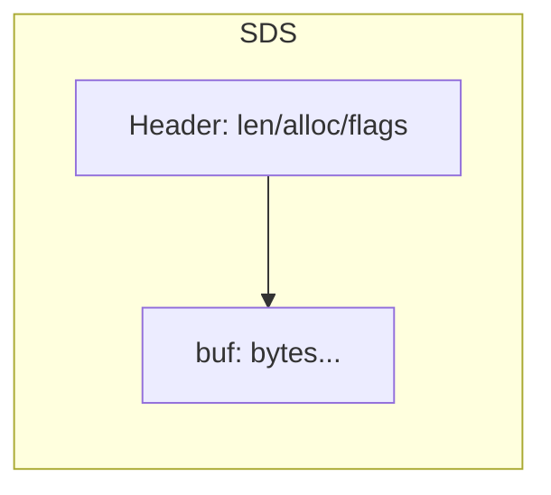
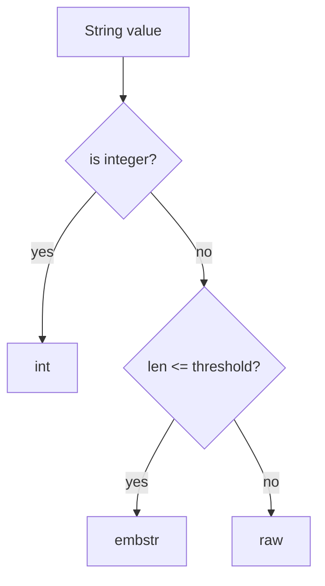
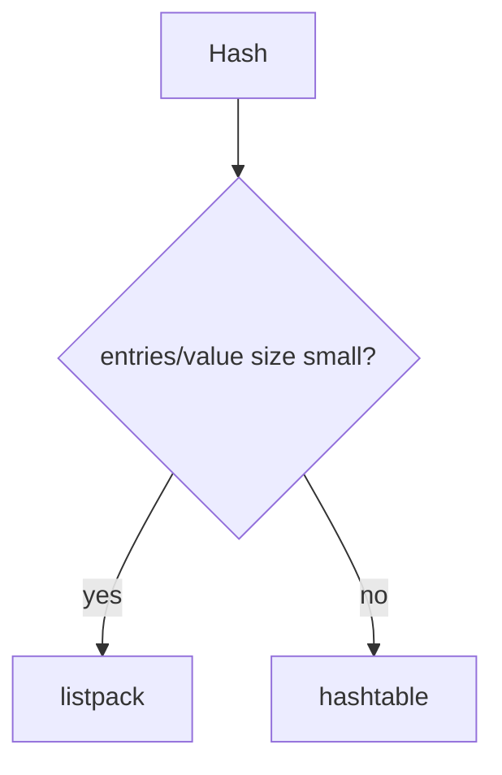
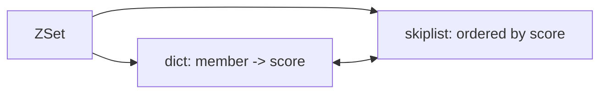

# Redis 源码深水区（一）：对象模型与编码（面试向）

> 面试目标：能把“为什么这么设计、换来什么收益、代价是什么、线上怎么踩坑”讲清楚。
>
> 本文聚焦：
>
> - SDS 为什么比 C 字符串更适合 Redis
> - redisObject 与对象编码（int/embstr/raw…）
> - listpack / intset / hashtable / skiplist / quicklist 的边界
> - dict 渐进式 rehash 是怎么做的、为什么必须渐进
> - skiplist 为什么适合 ZSet
>
> 建议配合阅读：
>
> - 基础：[`02-data-structures.md`](02-data-structures.md)
> - 调优：[`07-pitfalls-tuning.md`](07-pitfalls-tuning.md)
> - 集群：[`04-replication-cluster.md`](04-replication-cluster.md)

---

## 一、Redis 的对象模型（redisObject）

### 标准回答

Redis 对外表现是 String/List/Hash/Set/ZSet 等类型，但内部统一抽象为 **redisObject**：

- 对象头保存：类型（type）、编码（encoding）、引用计数（refcount）以及指向底层数据结构的指针（ptr）
- 同一种对外类型可以用多种编码表示（例如 String 可能是 int/embstr/raw），以实现**不同规模下的性能与内存最优**

### 追问点

- 为什么要“类型 + 编码”两层？
- encoding 的切换规则是什么？为什么多数是单向升级？
- refcount 在 Redis 里用于什么？（共享对象、对象生命周期管理）

### 一句话背诵

> Redis 内部用 redisObject 统一表示数据，对外类型不变，但会根据数据规模选择不同编码，在性能与内存之间做动态取舍。

### Mermaid：对象模型示意

```mermaid
flowchart LR
  subgraph Obj[redisObject]
    T[type]
    E[encoding]
    R[refcount]
    P[ptr -> 底层结构]
  end

  Obj -->|String| S1[int / embstr / raw]
  Obj -->|Hash| H1[listpack / hashtable]
  Obj -->|Set|  SE1[intset / hashtable]
  Obj -->|ZSet| Z1[listpack / skiplist]
  Obj -->|List| L1[quicklist]
```

---

## 二、SDS：为什么比 C 字符串更适合 Redis

### 标准回答

Redis 使用 SDS（Simple Dynamic String）替代 C 字符串，主要为了：

1. **O(1) 获取长度**：SDS 头部记录 len，避免 `strlen` O(n)
2. **二进制安全**：C 字符串以 `\0` 结尾，无法安全存储任意二进制；SDS 用 len 标记内容长度
3. **避免缓冲区溢出**：SDS 扩容时会检查空间并自动扩容
4. **减少频繁 realloc**：SDS 有预分配策略（空间换时间）

### 追问点

- SDS 的头部结构是什么？为什么有多种 header（sdshdr8/16/32/64）？
- 预分配策略怎么做？为什么能减少碎片/复制？
- SDS 和 jemalloc 的关系？

### 一句话背诵

> SDS 用“记录长度 + 二进制安全 + 预分配”的方式替代 C 字符串，让 Redis 既快又安全。

### Mermaid：SDS 结构示意



### 关键伪代码：append 时的扩容

```text
func sdsAppend(s, data):
  if free(s) < len(data):
    newCap = grow(alloc(s), len(data))
    s = realloc(s, newCap)
  copy(data -> s.buf[len(s):])
  s.len += len(data)
  return s
```

---

## 三、String 编码：int / embstr / raw

### 标准回答

Redis 的 String 为了兼顾小对象内存与大对象性能，常见编码：

- **int**：能解析为整数的字符串，直接用整数存，省内存、运算快
- **embstr**：短字符串（常见阈值 44 字节级别，具体实现随版本），对象头和字符串内容一次性分配，减少 malloc 次数
- **raw**：长字符串，分别分配对象头与 SDS，更灵活

### 追问点

- embstr 为什么更省？为什么更新 embstr 通常要转 raw？
- int 编码什么时候会退化？（范围溢出、写入非数字）

### 一句话背诵

> String 用 int/embstr/raw 三种编码：小整数用 int，短字符串用 embstr（一次分配），长字符串用 raw。

### Mermaid：String 编码选择



---

## 四、Hash 编码：listpack vs hashtable

### 标准回答

Hash 为了小对象节省内存，会优先用 **listpack（紧凑结构）**；当字段数或字段值变大后升级到 **hashtable**。

listpack 优点：
- 紧凑连续内存，内存占用小
- 小对象 CPU 缓存友好

hashtable 优点：
- 查询/更新平均 O(1)
- 适合字段多、字段值大

切换阈值常由配置控制（示例）：

- `hash-max-listpack-entries`
- `hash-max-listpack-value`

### 追问点

- 为什么编码切换通常是“单向升级”不回退？（回退成本高、碎片/拷贝成本）
- listpack 在字段很多时，访问复杂度会变成什么？（线性扫描）

### 一句话背诵

> 小 Hash 用 listpack 省内存，大到一定程度升级 hashtable 保证性能，编码切换通常单向不可逆。

### Mermaid：Hash 编码升级



---

## 五、Set 编码：intset vs hashtable

### 标准回答

Set 小且全是整数时，用 **intset**（紧凑整数数组）省内存；否则用 **hashtable**。

- intset：适合小集合、纯整数，连续内存，省空间
- hashtable：适合元素多、包含字符串等复杂类型

### 追问点

- intset 的升级过程？（16→32→64 位）升级是否要整体重分配？
- intset 插入/查找复杂度？（二分/线性，具体实现点）

### 一句话背诵

> 小整数集合用 intset 省内存，一旦元素变多或出现非整数就升级成 hashtable。

---

## 六、ZSet 编码：listpack vs skiplist（为什么跳表适合）

### 标准回答

ZSet 小规模时用 listpack 省内存；大规模时用 **skiplist + dict**：

- dict：member -> score，便于 O(1) 查 score
- skiplist：按 score 有序，便于范围查询、排名（rank）、topN

跳表适合 ZSet 的原因：

- 支持有序集合的插入/删除/查找平均 O(log n)
- 结构相对简单，代码复杂度低于平衡树
- 范围查询天然友好（沿 level 指针快速定位）

### 追问点

- 为什么不用红黑树？（实现复杂度、范围查询/排名实现方式）
- skiplist 最坏复杂度？（概率结构，最坏 O(n)，但工程上可接受）
- 为什么需要 dict + skiplist 两套结构？只用 skiplist 行不行？（member 查找）

### 一句话背诵

> 大 ZSet 用 dict 提供 member 查找，用 skiplist 提供有序与范围查询，跳表比平衡树更简单、实现成本更低。

### Mermaid：ZSet 双结构



---

## 七、List 编码：quicklist（为什么需要它）

### 标准回答

Redis List 早期是 linkedlist，但指针开销太大。后来引入 **quicklist**：

- quicklist = 双向链表 + 每个节点是一个 listpack（紧凑数组）

这样做的收益：
- 小元素连续存储，减少指针开销
- 仍然支持两端 push/pop 的 O(1) 操作
- 在内存效率与操作效率之间折中

### 追问点

- quicklist 的节点大小如何影响性能？（太大导致拷贝/移动成本，太小导致指针开销）
- listpack 的插入删除成本？（数组移动）

### 一句话背诵

> quicklist 用“链表节点里塞紧凑数组”的方式，减少 List 的指针开销，同时保留两端操作的高效性。

---

## 八、dict 渐进式 rehash：怎么做？为什么必须渐进？

### 标准回答

Redis 的 dict（哈希表）在扩容/缩容时会 rehash。若一次性搬迁所有 bucket，会造成长时间阻塞。

因此 Redis 使用 **渐进式 rehash**：

- 同时维护两张表 ht[0] 和 ht[1]
- rehash 期间，每次对 dict 的读写/迭代操作都会“顺便搬迁”一小部分 bucket
- 当 ht[0] 迁空后，切换 ht[1] 成为新表

这样避免了 O(n) 的一次性阻塞，平滑延迟。

### 追问点

- 渐进式 rehash 期间查找怎么做？（两张表都查）
- rehashIndex 的含义？
- 迭代（SCAN）在 rehash 期间为什么可能重复/漏？

### 一句话背诵

> Redis 用两张哈希表做渐进式 rehash，把一次性 O(n) 搬迁拆成很多小步，避免阻塞主线程。

### Mermaid：渐进式 rehash

```mermaid
flowchart TD
  Start[need rehash] --> Two[create ht[1], keep ht[0]]
  Two --> Step[each op moves a few buckets]
  Step --> Done{ht[0] empty?}
  Done -->|no| Step
  Done -->|yes| Swap[ht[1] becomes ht[0], release old]
```

### 关键伪代码：查找

```text
func dictFind(key):
  if rehashing:
    v = findIn(ht0, key)
    if v != nil: return v
    return findIn(ht1, key)
  else:
    return findIn(ht0, key)
```

---

## 九、面试 2 分钟总结

```text
Redis 内部用 redisObject 抽象对象，外部类型不变但内部会按数据规模选择编码，比如 String 的 int/embstr/raw，Hash 的 listpack/hashtable。
SDS 相比 C 字符串能 O(1) 取长度且二进制安全，并通过预分配减少 realloc。
ZSet 大规模用 dict + skiplist：dict 负责 member->score 的 O(1) 查找，skiplist 负责有序和范围查询/排名，跳表实现复杂度低且平均 O(log n)。
dict 扩容采用渐进式 rehash，通过两张表分步搬迁避免一次性阻塞主线程。
```
