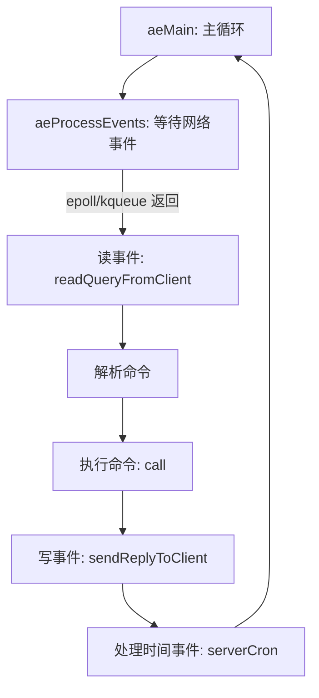
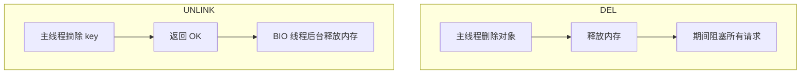
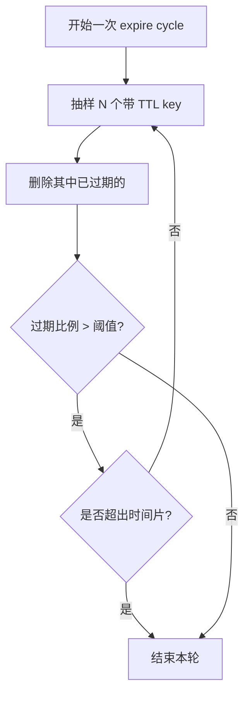
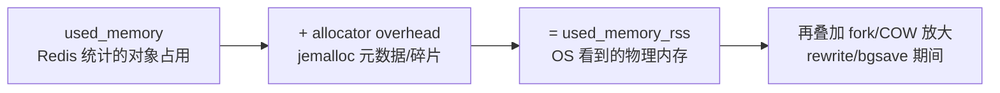

# Redis 源码深水区（二）：事件循环、IO 线程、BIO、过期与内存（面试向）

> 面试目标：能把“Redis 单线程为什么能扛住、为什么 6.0 引入 IO threads、BIO 线程做什么、过期循环怎么控 CPU、LFU 如何近似、内存碎片与 jemalloc 怎么看”讲成**有结构的 2~5 分钟答案**。
>
> 本文风格：先讲原理（带 Mermaid 流程图）→ 再给高频 Q/A（标准回答 + 追问点 + 一句话背诵）。
>
> 前置阅读：
>
> - 调优与指标：[`07-pitfalls-tuning.md`](07-pitfalls-tuning.md)
> - 对象与编码：[`17-object-encoding-internals.md`](17-object-encoding-internals.md)

---

## 一、单线程事件循环：Redis 到底在“循环”什么？

### 1.1 核心原理

Redis 的核心是一个事件驱动的主循环（event loop）：

- **网络事件**：连接可读/可写（基于 epoll/kqueue 等）
- **时间事件**：定时任务（例如 active expire cycle、AOF 刷盘、复制定时任务等）

主线程的典型处理流程是：

1. 等待 IO 事件（阻塞在多路复用上）
2. IO 就绪 → 读请求 → 解析命令
3. 执行命令（单线程串行）
4. 写回响应（可能延迟写）
5. 周期性处理时间事件（过期、AOF、复制…）

### 1.2 Mermaid：主线程事件循环示意



### 1.3 工程结论（面试常用）

- Redis “单线程”指的是：**命令执行路径单线程**，避免锁竞争，保证简单的原子性（单命令原子）
- Redis 的高性能来自：
  - 内存数据结构
  - 单线程避免锁
  - epoll/kqueue 高效处理大量连接
  - 批量/流水线（pipeline）降低 RTT

### 版本差异

- Redis 6.0+ 引入 IO 多线程（后文详述），但仍然不改变“命令执行单线程”的核心设计。

---

## 二、Redis 6.0+ IO Threads：为什么只多线程 IO，不多线程执行命令？

### 2.1 核心原理

在高连接数/大吞吐场景下，瓶颈可能从“执行命令”变成：

- 读 socket（read）
- 写 socket（write）
- 数据拷贝与协议解析

Redis 6.0+ 引入 **IO threads**，把“网络读写”拆出去并行化：

- 多线程负责：读请求/写响应（以及部分解析/拷贝）
- 主线程仍负责：命令执行（保证数据结构无需加锁）

### 2.2 Mermaid：IO threads 工作分工


### 2.3 为什么不直接多线程执行命令？

主要是工程权衡：

- 多线程执行命令意味着：
  - 所有核心数据结构需要加锁/或分段锁
  - 事务/Lua/脚本的原子性语义更复杂
  - bug 风险与维护复杂度显著上升
- Redis 的主目标是：
  - 在保持简单一致语义的同时，吃掉“网络 IO”瓶颈

### 版本差异

- Redis 6.0 引入 `io-threads`、`io-threads-do-reads`。
- 即使开启 IO threads，**慢命令/大 key/阻塞命令仍然会卡主线程**。

---

## 三、BIO 线程：为什么 UNLINK 不会阻塞主线程？

### 3.1 核心原理

Redis 主线程必须尽量避免做“长耗时操作”，否则会阻塞所有请求。

因此 Redis 把部分“可异步化”的重任务放到后台线程（BIO threads），典型包括：

- 异步释放大对象内存（如 `UNLINK`）
- `FLUSHDB ASYNC` / `FLUSHALL ASYNC`
- AOF fsync 等

从面试角度，最重要的结论是：

- `DEL`：同步删除，可能 O(n) 阻塞
- `UNLINK`：逻辑删除 + 后台线程异步释放内存

### 3.2 Mermaid：DEL vs UNLINK



### 版本差异

- `UNLINK` 在 Redis 4.0+ 提供。
- Redis 4.0+ 的 `FLUSHDB ASYNC` / `FLUSHALL ASYNC` 也是同一类设计。

---

## 四、过期删除：为什么不能实时精确删除？active expire cycle 如何控 CPU？

### 4.1 核心原理：三种过期处理拼起来

Redis 过期 key 的删除是工程折中，通常是三类机制结合：

1. **惰性删除（lazy）**：访问 key 时发现过期再删（CPU 友好，但不访问会占内存）
2. **定期删除（active expire cycle）**：后台定期抽样删除（平衡 CPU 与内存，但不能保证全删）
3. **内存淘汰（maxmemory-policy）**：内存满了才淘汰（保护内存上限）

### 4.2 active expire cycle 怎么控 CPU

典型思路是：

- 每次只抽样一部分带 TTL 的 key
- 如果过期比例高，继续抽样（但有时间片限制）
- 如果过期比例低，快速结束

目标：

- 不让过期删除本身占满 CPU
- 在过期堆积时更积极

### 4.3 Mermaid：active expire cycle 抽样逻辑



### 版本差异

- active expire 的细节参数/努力程度在不同版本有增强（例如 `active-expire-effort`）。
- 复制场景中，从节点对过期 key 的主动删除策略在版本上有差异（但工程结论：最终以主节点删除广播为准）。

---

## 五、LFU：为什么是“近似”而不是精确？

### 5.1 核心原理

精确 LFU 需要对每个 key 做精确计数，并且维护全局排序，成本很高。

Redis 的 LFU 是工程化“近似”：

- 对象上维护一个有限位宽的计数器（可饱和）
- 通过衰减（decay）机制让“历史热点”逐渐降温，避免永久占坑

这使得 LFU 的效果接近“最近一段时间访问频率”，而不是全历史。

### 版本差异

- Redis 4.0+ 支持 LFU 淘汰策略（allkeys-lfu / volatile-lfu）。
- 衰减相关配置如 `lfu-decay-time`（不同版本行为可能略有调整，面试强调原理即可）。

---

## 六、内存碎片与 jemalloc：为什么 RSS 看起来很高？

### 6.1 核心原理

Redis 常见现象：

- `used_memory` 不高
- 但 `used_memory_rss` 很高

原因通常是：

- 分配器（jemalloc）为了复用与性能，会保留内存到 arena/缓存中
- Redis 数据增删波动大时会产生碎片
- fork/COW 会让 RSS 短期放大（重写期间写入越多，复制页越多）

### 6.2 Mermaid：内存视角



### 6.3 工程建议

- 关注 `mem_fragmentation_ratio`（碎片率）
- 开启主动碎片整理（版本支持时）
- 控制实例大小与数据波动（避免频繁大规模过期+新增）

### 版本差异

- Redis 4.0+ 支持主动碎片整理（`activedefrag yes`）。
- 分配器实现细节（jemalloc 版本/编译选项）会影响碎片表现，但面试核心在“为什么 RSS 高”。

---

## 七、高频 Q/A（面试速答）

### Q1：Redis 为什么单线程还这么快？

**标准回答**：

- 数据在内存
- 命令执行单线程避免锁竞争
- 事件循环 + epoll/kqueue 能高效处理大量连接
- pipeline 降 RTT

**追问点**：

- 那为什么还会慢？（大 key、慢命令、fork 抖动、网络）

**一句话背诵**：

> Redis 快的核心是内存 + 单线程执行避免锁 + IO 多路复用 + pipeline 降 RTT。

---

### Q2：Redis 6.0 为什么引入多线程？

**标准回答**：

- 为了解决网络 IO 成为瓶颈的问题，多线程只用于读写 socket
- 命令执行仍单线程，保持数据结构无锁与简单语义

**追问点**：

- 慢命令会不会被 IO threads 解决？（不会，仍卡主线程）

**一句话背诵**：

> Redis 6.0+ 多线程是“多线程 IO、单线程执行”，吃掉网络瓶颈但不引入锁复杂度。

---

### Q3：DEL 和 UNLINK 区别？

**标准回答**：

- DEL 同步释放，删除大 key 可能阻塞主线程
- UNLINK 先摘 key，再由 BIO 线程��步释放内存

**追问点**：

- 哪些命令还有 ASYNC？（FLUSHDB/FLUSHALL）

**一句话背诵**：

> 大 key 删除用 UNLINK，不要用 DEL 阻塞主线程。

---

### Q4：Redis 为什么不能实时精确删除所有过期 key？

**标准回答**：

- 精确删除意味着需要维护严格的全局过期队列并持续扫描，会带来巨大 CPU 成本
- Redis 用惰性 + 定期抽样 + 内存淘汰做折中，保证性能与可控资源消耗

**追问点**：

- active expire cycle 如何避免占满 CPU？（抽样 + 时间片）

**一句话背诵**：

> 过期删除是 CPU 和内存的权衡：惰性 + 定期抽样 + 淘汰，避免为了精确删除拖垮主线程。

---

### Q5：LFU 为什么是近似？

**标准回答**：

- 精确 LFU 成本高
- Redis 用有限计数器 + 衰减实现近似 LFU，保证低开销且热点不会永久占坑

**追问点**：

- LFU vs LRU 各适合什么场景？

**一句话背诵**：

> Redis 的 LFU 用“近似计数 + 衰减”换取低开销和更稳定的热点保留。

---

### Q6：为什么 RSS 高但 used_memory 不高？

**标准回答**：

- jemalloc 保留内存与碎片导致 RSS 高
- 数据波动大导致碎片
- fork/COW 在重写期间会放大 RSS

**追问点**：

- 如何治理？（activedefrag、控制实例大小、平滑写入、低峰 rewrite）

**一句话背诵**：

> RSS 高常见原因是 allocator 碎片与 fork/COW 放大，不等于 Redis 真正在用那么多对象内存。

---

## 八、面试 2 分钟总结

```text
Redis 主线程是事件循环：处理网络事件与时间事件，命令执行单线程以避免锁竞争。
Redis 6.0+ 为了缓解网络 IO 瓶颈引入 IO threads，多线程只负责 socket 读写，命令仍单线程。
删除大 key 用 UNLINK：主线程摘除 key，BIO 线程异步释放内存，避免 DEL 阻塞。
过期删除无法做到实时精确，是 CPU/内存折中：惰性 + 定期抽样 + 内存淘汰；active expire cycle 用抽样与时间片控 CPU。
LFU 是近似实现，通过有限计数与衰减避免高成本和历史热点永久占坑。
RSS 偏高常见于 jemalloc 碎片与 fork/COW 放大，要结合碎片率、fork 指标与 rewrite 行为治理。
```
