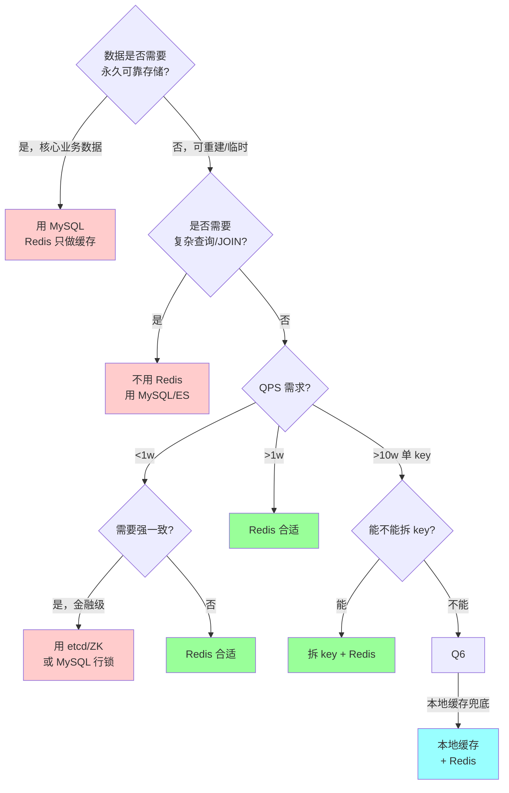

# Redis 设计边界与取舍

> 资深面试的"反问题"：**Redis 什么时候不该用？** 能把边界讲清楚的人，才是真懂 Redis 的人。
>
> 本篇聚焦设计取舍：Redis 的能力边界、与其他中间件的职责区分、危险反模式、"为什么不能当数据库"。

---

## 一、为什么这篇很重要

```
初级面试:    能讲"Redis 是什么、怎么用"
中级面试:    能讲"Redis 的原理和坑"
资深面试:    能讲"什么时候不用 Redis / 为什么不用 / 用什么代替"

设计题的本质是取舍，不是堆技术。
把 Redis 当成万能锤子的人永远过不了 P7。
```

**一句话**：Redis 是**性能加速层和协调工具**，不是**业务数据的主存储**，不是**可靠消息系统**，不是**强一致协调服务**。

---

## 二、Redis 适合做什么

### 2.1 核心场景（真正的强项）

| 场景 | 为什么适合 |
| --- | --- |
| **热数据缓存** | 内存读 < 1ms / 穿透时有 DB 兜底 |
| **计数器 / 统计** | INCR 原子 + 无锁 + 持久化 |
| **排行榜** | ZSet O(log N) 范围查询 + 有序 |
| **限流器** | Lua 脚本原子 + 高 QPS |
| **会话存储** | KV + TTL 天然契合 |
| **分布式锁（弱一致）** | SET NX + 看门狗 + 性能够 |
| **Feed Timeline** | 写扩散 + ZSet Top N |
| **去重 / 存在性** | Bitmap / Bloom / HLL |
| **Pub/Sub 轻量广播** | 实时通知 / 缓存失效 |
| **地理位置** | GEO + Sorted Set |
| **秒杀 / 抢红包** | Lua 脚本原子扣减 |

### 2.2 共同特征

```
✓ 数据量可控（通常 < 100GB）
✓ 可重建（从 DB / 计算恢复）
✓ 需要低延迟（ms 级）
✓ 读多于写（或者写少量但要求高 QPS）
✓ 弱一致可接受
```

---

## 三、Redis 不适合做什么

### 3.1 绝对禁区

| 场景 | 为什么不适合 | 用什么 |
| --- | --- | --- |
| **业务主存储** | 内存贵 / 持久化不可靠 / 数据模型弱 | MySQL / PG |
| **强一致事务** | 事务不支持回滚 / Cluster 不跨 slot 事务 | MySQL / TiDB |
| **可靠消息队列（事务 / 顺序 / 回溯）** | 无强一致保证 / 回溯能力弱 | Kafka / RocketMQ |
| **大容量存储（TB 级）** | 内存成本 > 磁盘 100x | SSD-based DB |
| **复杂查询（JOIN / 聚合）** | 无查询引擎 / 无二级索引 | MySQL / ES / ClickHouse |
| **强一致分布式锁** | Redlock 有争议 / 主从切换丢锁 | etcd / ZK |
| **Leader 选举（金融级）** | 不是共识系统 | etcd / ZK |
| **OLAP 分析** | 无列存 / 无向量化执行 | ClickHouse / Doris |
| **全文搜索** | 无倒排 / 无分词 | ES / Solr |
| **超大对象存储** | 单 value 限 512MB / HGETALL 会阻塞 | OSS / S3 |

### 3.2 灰色地带（能用但要小心）

```
分布式锁:
  弱一致 OK（比如秒杀 / 定时任务去重）
  强一致不要用（比如扣钱 / 状态机）

消息队列:
  轻量广播 OK（Pub/Sub 不落盘 / 可丢）
  Stream 比 Pub/Sub 强但仍不如 Kafka 可靠
  事务消息 / 顺序消息 / 回溯 → 用 Kafka/RocketMQ

会话存储:
  短会话 OK（JWT 黑名单 / 临时 token）
  长期用户数据不要放（内存贵 + 丢了没地方找）
```

---

## 四、Redis vs 其他中间件

### 4.1 Redis vs MySQL

```
职责:
  MySQL: 业务数据真相（source of truth）
  Redis: 加速 MySQL 读取

谁先谁后（写路径）:
  ✓ 先写 MySQL → 再删 Redis（Cache-Aside）
  ✗ 先写 Redis → 再写 MySQL（MySQL 挂了数据丢）

数据丢失对比:
  MySQL 丢数据 = 事故
  Redis 丢数据 = 回源 DB 重建（只是慢一点）
```

| 维度 | Redis | MySQL |
| --- | --- | --- |
| 存储介质 | 内存 | 磁盘 |
| 持久化 | RDB/AOF（有时间窗）| WAL + fsync（强保证）|
| 事务 | 单命令原子 / Lua / MULTI 弱 | ACID 完整 |
| 查询 | K/V + 简单索引 | SQL + 优化器 + 索引 |
| 容量 | GB 级 | TB 级 |
| 一致性 | 最终一致 | 强一致（单机）|
| 典型延迟 | < 1ms | 1-10ms |

**结论**：Redis 是 MySQL 的**加速器**，不是**替代品**。

### 4.2 Redis vs MQ（Kafka / RocketMQ / RabbitMQ）

```
Redis Pub/Sub:
  ✗ 不持久化（订阅者没连就丢）
  ✗ 无消费者组
  ✗ 无 ACK / 重试
  ✓ 延迟极低（ms）
  → 只能用于：缓存失效广播 / 实时通知（可丢）

Redis Stream (5.0+):
  ✓ 持久化
  ✓ 消费者组 XREADGROUP + XACK
  ✗ 回溯能力弱（XADD MAXLEN 裁剪）
  ✗ 跨 Cluster 节点的 Stream 不好做
  → 可用于：轻量队列（< 万级 TPS / 不要求严格顺序）

Kafka / RocketMQ:
  ✓ 海量消息 / 分区顺序 / 回溯 / 事务消息 / 延迟消息
  → 真正的业务消息总线
```

| 维度 | Redis Pub/Sub | Redis Stream | Kafka | RocketMQ |
| --- | --- | --- | --- | --- |
| 持久化 | ❌ | ✓ | ✓✓ | ✓✓ |
| 消费者组 | ❌ | ✓ | ✓✓ | ✓✓ |
| 顺序 | ❌ | 单 Stream | 分区级 | 分区级 |
| 回溯 | ❌ | 有限 | 完整 | 完整 |
| 吞吐 | 高 | 中 | 极高 | 高 |
| 事务消息 | ❌ | ❌ | Outbox | **原生** |
| 延迟消息 | 弱 | 弱 | 需扩展 | **原生** |
| 典型场景 | 缓存失效 | 轻量队列 | 大数据 / 日志 | 业务消息 |

**经验法则**：
- 万级 TPS 以下 + 可丢 → Pub/Sub
- 万级 TPS + 不想引入 Kafka → Stream
- 十万级以上 / 严格可靠 → Kafka / RocketMQ

### 4.3 Redis vs etcd / ZK

```
Redis Redlock:
  - 性能好（10w QPS）
  - 理论有争议（Martin Kleppmann 反驳）
  - 主从切换 + GC 停顿 → 可能丢锁
  - 适合：弱一致场景（秒杀 / 定时任务 / 限流）

etcd / ZK:
  - 共识协议（Raft / ZAB）
  - 强一致保证
  - 性能有限（1w / 5k QPS）
  - 适合：Leader 选举 / 配置协调 / 强一致锁

金融场景:
  绝对不用 Redis 锁。
  用 etcd + Fencing Token + 业务幂等兜底。
```

| 维度 | Redis | etcd | ZooKeeper |
| --- | --- | --- | --- |
| 一致性模型 | 最终一致 | 强一致（Raft）| 强一致（ZAB）|
| 性能 | 10 万 QPS | 1 万 QPS | 5 千 QPS |
| 数据模型 | KV + 丰富结构 | KV + Watch | 树形 + Watch |
| 典型用途 | 缓存 / 弱锁 | K8s 配置 / 协调 | 老牌协调服务 |
| 故障切换 | 有丢数据窗口 | Raft 选举 | ZAB 选举 |
| 网络分区 | AP | CP | CP |

**口诀**：性能 → Redis，强一致 → etcd/ZK，**业务永远加幂等兜底**。

### 4.4 Redis vs 本地缓存（sync.Map / Ristretto / BigCache）

```
本地缓存优势:
  ✓ 零网络（ns 级）
  ✓ 不打网络带宽
  ✓ Redis 挂也能跑

本地缓存劣势:
  ✗ 多实例不一致（N 份拷贝）
  ✗ 进程重启丢失
  ✗ 内存空间受限（进程内存）
  ✗ 更新慢（只能 TTL 过期或消息通知）

实战是组合:
  L1 本地（短 TTL 5-30s）+ L2 Redis（长 TTL 5-30min）+ L3 DB
```

| 维度 | sync.Map | Ristretto | BigCache | Redis |
| --- | --- | --- | --- | --- |
| 延迟 | ns | ns | ns | sub-ms |
| 跨实例一致 | ❌ | ❌ | ❌ | ✓ |
| 容量 | 堆内存 | 堆内存 + LFU | 堆外内存 | 独立进程 |
| TTL | 无（要手写）| 有 | 有 | 有 |
| 统计 | 无 | 命中率 / 淘汰 | 简单 | 丰富 |
| 典型用途 | 临时 map | 热点镜像 | 大量小对象 | 中心缓存 |

**经验**：超热点（> 1w QPS 单 key）**必须**本地缓存镜像，否则 Redis 单分片打爆。

### 4.5 Redis vs 专门领域数据库

| 需求 | 选型 | 为什么不用 Redis |
| --- | --- | --- |
| 时序数据 | InfluxDB / Prometheus TSDB / TDengine | 压缩 + 降采样 + 窗口聚合 |
| 全文搜索 | Elasticsearch | 倒排 + 分词 + 评分 |
| 图数据 | Neo4j / NebulaGraph | 图遍历 / 路径算法 |
| 列式分析 | ClickHouse / Doris | 列存 + 向量化 |
| 对象存储 | OSS / S3 / MinIO | 大文件 / 低成本 |
| 文档 | MongoDB | 嵌套 JSON + 二级索引 |

---

## 五、为什么 Redis 不能当数据库

### 5.1 五个致命弱点

```
1. 持久化有数据丢失窗口
   RDB 快照间隔（默认分钟级）
   AOF everysec 也有 1 秒窗口
   fsync always 性能下降 80%

2. 数据模型弱
   没有 schema / 外键 / 约束
   没有 JOIN / 聚合 / 子查询
   没有二级索引

3. 事务弱
   MULTI/EXEC 不支持回滚
   Cluster 不跨 slot 事务
   Lua 脚本出错只部分执行

4. 故障切换有丢数据风险
   主从异步复制：主挂 → 新主上任 → 老主恢复 → 数据丢
   脑裂场景更严重

5. 内存贵
   存 1TB 数据 = 1TB 内存
   MySQL 存 1TB = 1TB 磁盘 + 几 GB 缓存
   成本差 10-100x
```

### 5.2 具体反例

```go
// ❌ 错误：把用户资料只存 Redis
rdb.HSet(ctx, "user:123", map[string]interface{}{
    "name": "Alice", "balance": 1000, "phone": "...",
})
// 后果：
//   - Redis 挂了（主从切换）→ 部分写丢失 → 用户余额错乱
//   - 想查"所有手机号是 X 的用户" → 全 SCAN 崩溃
//   - 想加"余额 > 100 且注册 > 30 天" 条件 → 做不到

// ✅ 正确：MySQL 存主数据，Redis 缓存热数据
db.Query("SELECT * FROM users WHERE id=?", 123)
rdb.Get(ctx, "user:123")  // 只是加速
```

### 5.3 "Redis 持久化能替代 MySQL 吗"

```
不能。即使配 AOF appendfsync always:

1. fsync 性能降 80%，失去 Redis 快的意义
2. 仍然只是日志，没有 schema / 查询 / 约束
3. AOF 文件可能损坏（非 ACID 级）
4. 重启恢复慢（几 GB AOF 重放要几分钟）

结论:
  Redis 持久化是为"重启不丢（太多）"设计的，
  不是为"数据永久可靠"设计的。
```

---

## 六、最危险的反模式（生产事故来源）

### 反模式 1：无 TTL 的 Set

```go
rdb.Set(ctx, key, value, 0)  // 永不过期
```

**后果**：内存无限涨 → OOM → maxmemory-policy 触发淘汰 → **热数据可能被淘汰**。

**正确**：
```go
rdb.Set(ctx, key, value, 1*time.Hour)  // 永远带 TTL
```

### 反模式 2：KEYS * / SMEMBERS 大集合

```go
rdb.Keys(ctx, "*")  // 阻塞 Redis 秒级
```

**后果**：单线程被占满，所有客户端超时。

**正确**：SCAN / HSCAN / SSCAN 游标迭代。

### 反模式 3：把 Redis 当队列（Pub/Sub 关键业务）

```
订阅者断连 → 消息全丢 → 业务数据不一致
```

**正确**：关键消息走 Kafka / RocketMQ。

### 反模式 4：HGETALL 大 Hash

```
100 万 field 的 Hash → HGETALL 一次返回几 MB
→ 主线程阻塞 → 其他客户端全超时
→ 网络带宽打满 → 级联故障
```

**正确**：HSCAN 分批 / 拆 Hash。

### 反模式 5：单 key 热点

```
"libevent/epoll" 单线程 + 单 slot 单 key
→ 10w QPS 全打到一个分片
→ 单分片 CPU 100% + 集群整体无压力
```

**正确**：
- 本地缓存镜像
- Key 分片（`item:{hash_user_id % 10}:xxx`）
- 多副本读

### 反模式 6：Cluster 跨 slot 操作

```go
rdb.MGet(ctx, "a", "b", "c")  // 不在同 slot → CROSSSLOT 错误
```

**正确**：Hash Tag `{user:123}:name`, `{user:123}:age` 强制同 slot。

### 反模式 7：Lua 脚本超时

```lua
-- 跑 10w 次的循环
for i=1, 100000 do
    redis.call("SET", ...)
end
-- → 主线程阻塞几秒
-- → 整个 Redis 不可用
```

**正确**：Lua 保持 **微秒级**执行，大批量拆客户端多次调用。

### 反模式 8：配 maxmemory = 主机内存

```
maxmemory = 64GB（机器 64GB）
→ Redis 自己占 90% + COW fork + jemalloc 碎片
→ OOM killer 把 Redis 干掉
```

**正确**：
- `maxmemory = 物理内存 * 0.6-0.7`
- 留空间给 COW / fork / 系统
- `vm.overcommit_memory=1`

### 反模式 9：用过期删除清理业务数据

```
依赖 EXPIRE 定期清理订单表 / 日志表
→ 过期是惰性 + 抽样，不保证精确时间
→ 业务认为到期清，实际还在
```

**正确**：业务数据用 DB + 定时任务明确清理。

### 反模式 10：把 Redis 当事务协调器

```go
// ❌ 用 Redis 分布式锁做转账
lock.Lock()
bankA.Decr(100)
bankB.Incr(100)
lock.Unlock()
// 锁超时 / 主从切换丢锁 → 重复转账 / 丢钱
```

**正确**：跨业务事务走 TCC / Saga / 事务消息。

---

## 七、决策树：什么时候该用 Redis



---

## 八、典型"过度依赖 Redis"的故障案例

### 案例 1：Redis 挂了，订单系统瘫痪

```
设计:
  所有用户会话 + 购物车 + 订单临时数据 都在 Redis
  没有 DB 兜底

故障:
  Redis 主从切换（主挂 30 秒）
  → 会话全失效 → 用户全退出
  → 购物车清空 → 客诉爆炸
  → 订单数据丢 → 无法对账

根因:
  把 Redis 当主存储，没有降级路径

改进:
  - 会话：JWT（无状态）或 MySQL + Redis 缓存
  - 购物车：MySQL 持久化，Redis 缓存
  - 订单：MySQL 核心，Redis 不参与
```

### 案例 2：Redis 队列丢消息

```
设计:
  Pub/Sub 做订单创建通知 → 发短信 + 发券 + 更新积分

故障:
  下游消费服务重启 30 秒
  → Pub/Sub 没订阅者 → 消息全丢
  → 用户没收到短信 + 券没发 + 积分没加

根因:
  关键业务用 Pub/Sub（不持久化）

改进:
  关键通知走 Kafka / RocketMQ
  Redis Pub/Sub 只用于可丢场景（缓存失效）
```

### 案例 3：Redis 锁丢失导致重复扣款

```
设计:
  Redis SETNX 锁 + TTL 10s → 扣款逻辑

故障:
  业务执行超过 10s（第三方 API 慢）
  → 锁超时自动释放
  → 另一个请求拿到锁 → 重复扣款
  或者：主从切换，新主没有锁记录 → 重复拿锁

根因:
  Redis 锁非强一致 + 没有 Fencing Token

改进:
  - 业务层幂等（唯一订单号 + DB 唯一索引）
  - Fencing Token 版本号
  - 关键业务用 etcd 锁
```

---

## 九、容量 / 成本视角

### 9.1 什么时候"Redis 太贵"

```
成本对比（云上）:
  MySQL: ~0.5 元 / GB·月（SSD 存储）
  Redis: ~50-100 元 / GB·月（内存）
  差距: 100-200x

阈值:
  < 10GB:   Redis 无压力
  10-100GB: 需要评估 ROI
  > 100GB:  必须冷热分层 / 淘汰策略
  > 500GB:  考虑换 SSD-based KV（如 Pika / KeyDB / TiKV）
```

### 9.2 冷热分层

```
方案:
  Redis:  热数据（最近 7 天访问）
  SSD KV: 温数据（30 天内）
  DB:     冷数据（历史全量）

工具:
  Redis-on-Flash (Redis Enterprise)
  Pika（360 开源，磁盘版 Redis）
  KeyDB / DragonflyDB（多线程 Redis 替代）
```

---

## 十、面试表达模板

### 10.1 "你们为什么用 Redis"

```
Redis 在我们系统里承担三个角色：

1. 热数据缓存
   - 读路径 Cache-Aside
   - 减 DB 压力 90%+
   - P99 从 50ms → 5ms

2. 协调工具
   - 分布式锁（弱一致场景）
   - 限流（Lua 原子）
   - 幂等 Token

3. 特定数据结构
   - 排行榜 ZSet
   - 计数器 INCR
   - 会话 Hash + TTL

但我们也明确知道 Redis 的边界：
  - 业务主数据永远在 MySQL
  - 关键消息走 Kafka，不走 Pub/Sub
  - 金融级锁用 etcd
  - 大对象走 OSS
```

### 10.2 "Redis 能不能当数据库"

```
不能。三个角度讲清楚：

1. 存储模型:
   Redis 是 KV 结构，没有 schema / JOIN / 索引
   复杂查询做不了

2. 持久化:
   AOF / RDB 都有数据丢失窗口
   主从异步复制有丢数据风险
   不适合承载业务真相（source of truth）

3. 成本:
   内存贵磁盘 100x
   TB 级数据 Redis 成本不可接受

Redis 是缓存和协调工具，业务数据一定有 DB 兜底。
只有极端场景（纯 KV + 数据量小 + 可重建）才会单独用 Redis。
```

### 10.3 "为什么不 Redis 全家桶"

```
滥用 Redis 的典型代价：

1. Redis 挂了业务全挂（SPOF）
2. 内存成本爆炸
3. 每个场景都遇到 Redis 的能力边界（不支持事务 / 查询 / 强一致）
4. 运维复杂（Cluster 扩缩容 / 迁移 / 故障演练）

好的系统 = MySQL + Redis + Kafka + etcd + ES 各司其职
不是 = Redis 一把梭
```

---

## 十一、面试加分点

- **Redis 不是数据库** 一句话说清
- **Pub/Sub 不持久化 / Stream 有限持久化 / Kafka 真消息队列** 三者边界
- **Redlock 有争议 + Fencing Token 兜底**（Martin Kleppmann）
- **MySQL 是真相 / Redis 是加速** 主次关系
- **本地缓存 + Redis 组合** 应对超热点
- **金融不用 Redis 锁**（太多坑）
- **大对象走 OSS + Redis 存引用**
- **冷热分层**（Pika / Redis-on-Flash）
- **Redis 成本 ~100x MySQL** 有概念
- **10 大反模式** 能举 5 个以上
- **知道何时不用 Redis**（反选能力）

---

## 十二、口袋速查表

```
❓ 要不要用 Redis？

YES:
  □ QPS 高（> 1k）
  □ 数据可重建
  □ 低延迟要求（< 5ms）
  □ 弱一致可接受
  □ 容量 < 100GB

NO（用替代）:
  □ 业务真相 → MySQL / TiDB
  □ 复杂查询 → MySQL / ES
  □ 强一致 → etcd / ZK
  □ 可靠消息 → Kafka / RocketMQ
  □ 大对象 → OSS
  □ 时序 → InfluxDB / TDengine
  □ OLAP → ClickHouse
  □ 图 → Neo4j

配合（强烈推荐）:
  Redis + MySQL   (Cache-Aside)
  Redis + Kafka   (Redis 算 + Kafka 存)
  Redis + 本地缓存 (L1/L2 多级)
  Redis + etcd    (Redis 性能 + etcd 兜底强一致)
```

---

## 十三、关联阅读

```
本目录:
- 01-architecture.md          Redis 为什么快（强项）
- 05-cache-patterns.md        缓存模式的边界
- 06-distributed-lock.md      锁的一致性争议
- 09-production-cases.md      真实事故案例
- 11-multi-tier-cache.md      本地 + Redis 组合
- 20-go-redis-best-practices.md Go SDK 落地
- 21-senior-interview-answers.md 答题模板

跨模块:
- 03-mysql/00-mysql-map.md    MySQL 能力
- 05-message-queue/00-mq-map.md MQ 能力对比
- 06-distributed/04-lock.md   三方锁对比
- 06-distributed/03-transaction.md 分布式事务
```
