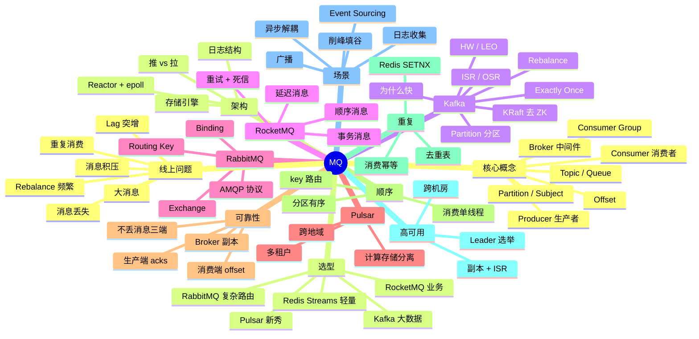
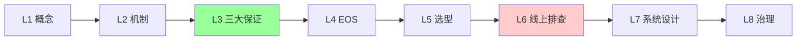
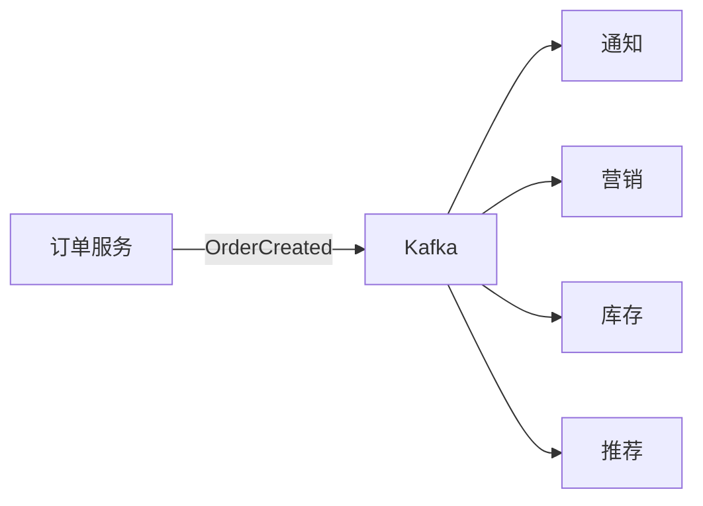
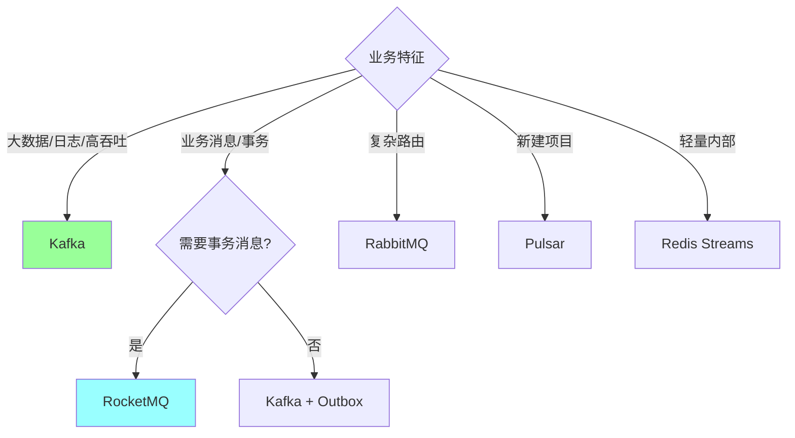
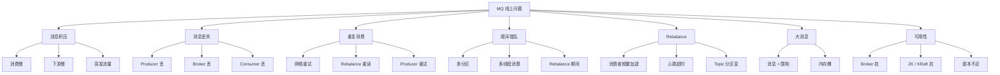
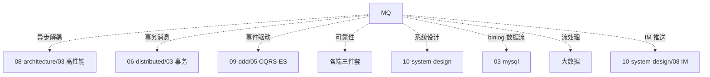

# 消息队列知识地图

> MQ 是后端**异步解耦 / 削峰 / 广播 / 事件驱动**的核心中间件。资深面试常深挖 Kafka / RocketMQ 原理 + 可靠性 + 顺序 + 重复 + 选型。
>
> 这份地图是 05-message-queue 目录的总览：知识树 / 题型分类 / 学习路径 / 选型决策 / 排查地图 / 答题方式

---

## 一、整体知识树



---

## 二、后端视角的 MQ

| MQ 能力 | 后端解决的问题 |
| --- | --- |
| 异步解耦 | 生产/消费独立演化，响应快 10x |
| 削峰填谷 | 突发流量缓冲，下游平稳处理 |
| 广播 / 发布订阅 | 一份消息多消费者（订单 → 通知/营销/库存）|
| 顺序保证 | 同一 key 同一分区（订单状态机）|
| 事务消息 | 业务+消息原子（替代 Outbox）|
| 延迟消息 | 30 分钟未支付自动取消 / 重试退避 |
| 死信队列 | 隔离失败消息 / 人工介入 |
| 高吞吐 | Kafka 百万 QPS / 顺序写盘 |
| 持久化 | 重启不丢 / 可重放 |
| 重放 | 数据迁移 / Bug 修复后回填 |
| Exactly Once | 流处理一致性（Kafka EOS）|
| 跨地域复制 | MirrorMaker / Pulsar Geo |

---

## 三、能力分层（资深 Go 后端）

```text
L1 概念
  Producer/Consumer/Broker/Topic/Partition/Offset/Consumer Group

L2 机制
  Kafka 顺序写 / PageCache / 零拷贝 / 批量 / 压缩 / 分区并行
  Pull vs Push / 长轮询
  ISR / HW / LEO / Rebalance

L3 三大保证
  不丢: acks=all + RF=3 + min.insync=2 + 手动 commit
  不重: 消费幂等（去重表 / 唯一索引）
  顺序: 同 key 路由同分区 + 单线程消费

L4 Exactly Once
  Producer 幂等 + 事务消息 + 消费端事务

L5 选型
  Kafka 大数据日志 / RocketMQ 业务交易 / RabbitMQ 复杂路由 / Pulsar 新秀

L6 线上问题
  消息积压 / Rebalance / 重复 / 丢失 / 大消息 / 主从切换

L7 系统设计
  MQ + DB + Redis 组合解决业务（秒杀 / 订单 / IM / 推荐）

L8 治理
  容量规划 / 监控告警 / 跨地域 / 多租户
```



---

## 四、题型分类

### 4.1 基础题（P5）

```
□ MQ 解决什么问题？
□ Kafka / RabbitMQ / RocketMQ 区别？
□ Topic / Partition / Consumer Group 是什么？
□ Producer / Consumer / Broker 角色？
□ Pull vs Push 区别？
```

对应：[01](01-architecture.md) / [06](06-comparison.md)

### 4.2 中级题（P6）

```
□ Kafka 为什么快？6 大原因
□ 主从复制 + ISR / OSR / HW / LEO
□ Rebalance 触发条件 + 影响
□ 消息积压怎么办？
□ 不丢消息三端方案
□ 不重复消费 / 幂等
□ 顺序消息（key 路由）
□ Producer acks 三种
□ Consumer offset 提交（自动 vs 手动）
```

对应：[01](01-architecture.md) / [02](02-reliability.md) / [03](03-order-and-dedup.md) / [04](04-ha-replication.md) / [05](05-consumer-rebalance.md)

### 4.3 资深题（P7+）

```
□ Kafka 零拷贝（sendfile）原理
□ HW vs LEO 推进 + 副本切换一致性
□ Kafka Exactly Once 完整实现
□ RocketMQ 事务消息 half message + 回查
□ RocketMQ 延迟消息 18 级别 + 5.x 任意精确
□ Outbox 模式 vs 事务消息
□ 大消息处理（拆分 / 压缩 / OSS 引用）
□ 跨地域复制（MirrorMaker / Pulsar Geo）
□ Kafka KRaft 去 ZK
□ Pulsar 计算存储分离
□ 自研 MQ 设计
```

对应：[01](01-architecture.md) / [02](02-reliability.md) / [03](03-order-and-dedup.md) / [04](04-ha-replication.md) / [05](05-consumer-rebalance.md)

### 4.4 综合系统设计（P7-P8）

```
□ 设计订单状态变更通知系统（MQ + 多消费者）
□ 设计延迟队列（30 分钟未支付自动取消）
□ 设计排行榜实时更新（流处理）
□ 大促订单异步处理（削峰）
□ 跨地域消息同步（多活）
□ Event Sourcing + CQRS（基于 MQ）
```

对应：[07](07-scenarios.md) + [../10-system-design/16-high-concurrency-scenarios](../10-system-design/16-high-concurrency-scenarios.md)

### 4.5 线上排查题

```
□ 消息积压 1 亿条怎么处理？
□ 消费端 lag 突增定位
□ 重复消费导致业务错乱
□ 消息丢失 + 业务损失对账
□ Rebalance 频繁导致消费停顿
□ Kafka 单分区热点
□ 大消息导致 broker OOM
```

对应：[02](02-reliability.md) + [05](05-consumer-rebalance.md) + [07](07-scenarios.md)

---

## 五、目录文件全览

| # | 文件 | 重点 |
| --- | --- | --- |
| 01 | [架构](01-architecture.md) | Kafka 全景 / 为什么快 / Producer-Broker-Consumer / Partition / ISR |
| 02 | [可靠性](02-reliability.md) | 三端不丢消息 / acks / 副本 / commit |
| 03 | [顺序与去重](03-order-and-dedup.md) | 顺序保证 / 幂等消费 / 去重表 / EOS |
| 04 | [HA 与复制](04-ha-replication.md) | ISR / Leader 选举 / 跨机房 / 半同步 |
| 05 | [消费者 Rebalance](05-consumer-rebalance.md) | 触发条件 / 影响 / 增量 Rebalance / Static Membership |
| 06 | [对比](06-comparison.md) | Kafka / RocketMQ / RabbitMQ / Pulsar 选型 |
| 07 | [场景](07-scenarios.md) | 异步解耦 / 削峰 / 广播 / 事务消息 / 延迟队列 |

---

## 六、MQ 在系统设计中的角色

### 6.1 异步解耦（最常用）



效果：响应从 500ms → 50ms。

### 6.2 削峰填谷

```
秒杀:
  10 万 QPS / 秒 → MQ → 后端按 1 千 QPS 处理
  100 秒平稳消化
```

详见 [10-system-design/03-seckill-system](../10-system-design/03-seckill-system.md)。

### 6.3 事务消息（业务 + 消息原子）

```
RocketMQ 事务消息:
  half message → 本地事务 → COMMIT/ROLLBACK → 回查

替代 Outbox 模式
```

详见 [11-distributed/11-newsql-tcc-frameworks](../06-distributed/11-newsql-tcc-frameworks.md) + [09-ddd/05-cqrs-eventsourcing](../09-ddd/05-cqrs-eventsourcing.md)。

### 6.4 延迟消息

```
30 分钟未支付自动取消:
  生产时设 delay=30min
  RocketMQ 18 级别 / 5.x 任意精确

替代定时扫表（性能差）
```

### 6.5 数据流（CDC）

```
binlog → Canal / Debezium → Kafka
→ 多个消费者（搜索 ES / 缓存 Redis / 数仓）
```

事件驱动架构核心。

### 6.6 IM / 推送

```
消息推送:
  IM 服务 → Kafka → 推送服务（FCM / APNS）
  按用户分区保顺序
```

### 6.7 日志收集

```
应用日志 → Filebeat → Kafka → Logstash → ES
```

经典 ELK 替代方案。

### 6.8 流处理

```
Kafka + Flink / Spark Streaming
- 实时计算
- Window 聚合
- Exactly Once
```

---

## 七、选型决策

### 7.1 决策树



### 7.2 选型对比表

| | Kafka | RocketMQ | RabbitMQ | Pulsar | Redis Streams |
| --- | --- | --- | --- | --- | --- |
| **吞吐** | 极高（百万） | 高（10 万） | 中（万级） | 高 | 高 |
| **延迟** | ms | ms | μs | ms | μs |
| **顺序** | 分区级 | 分区级 | 队列级 | 分区级 | 流级 |
| **事务消息** | 跨分区事务 | **强（half message）** | 弱 | 支持 | 弱 |
| **延迟消息** | ❌（需扩展） | **原生 18 级别** | 插件 | 原生 | 弱 |
| **持久化** | 强（log） | 强 | 中 | 强 | 弱 |
| **多租户** | 弱 | 中 | 中 | **强** | 弱 |
| **跨地域** | MirrorMaker | DLedger | Federation | **原生** | - |
| **生态** | 大数据强 | 阿里业务强 | 老牌业务 | 后起新秀 | Redis 生态 |
| **代表用户** | LinkedIn / 字节 | 阿里 / 美团 | 金融 / 老业务 | StreamNative | 轻量场景 |
| **国内活跃** | 中 | **极高** | 中 | 增长中 | 中 |

### 7.3 实战推荐

```
日志 / 数据流 / 大数据      → Kafka
业务消息 + 事务 / 延迟      → RocketMQ
复杂路由 / 老业务            → RabbitMQ
新项目 + 多租户 + 跨地域    → Pulsar
轻量内部 / 已有 Redis        → Redis Streams
```

---

## 八、线上问题分类地图



### 8.1 排查工具

```bash
# Kafka
# 看 lag
kafka-consumer-groups.sh --describe --group X
# 重置 offset
kafka-consumer-groups.sh --reset-offsets --to-earliest --execute
# Topic 信息
kafka-topics.sh --describe --topic X
# 监控
Kafka Manager / Burrow / Cruise Control / Conduktor

# RocketMQ
# 控制台直接看
rocketmq-console
mqadmin commands

# 通用
Prometheus + kafka_exporter
```

### 8.2 典型问题应急

**消息积压 1 亿条**：
```
临时方案:
  1. 临时扩消费者实例（受分区数限制）
  2. 临时增加分区（kafka-topics.sh --alter）
  3. 新建临时 Topic 多分区，写一个搬运消费者
  4. 跳过非关键消息（紧急）

根因:
  消费慢 / 下游慢 / 突发流量
```

**消息丢失（生产损失）**：
```
1. 立即开启 acks=all + min.insync=2
2. 打开自动 commit → 改手动
3. 加监控（Producer ack 失败 / Consumer commit 失败）
4. 对账兜底
```

**重复消费导致重复扣款**：
```
1. 紧急加幂等（去重表 / Redis SETNX）
2. 业务订单号唯一索引
3. 已扣款的回滚补偿
4. 长期：消费端必须幂等
```

详见 [02-reliability](02-reliability.md) + [03-order-and-dedup](03-order-and-dedup.md) + [05-consumer-rebalance](05-consumer-rebalance.md)。

---

## 九、学习路径推荐

### 9.1 入门 → 资深（5 周）

```
Week 1: 基础
  01 架构（Kafka 全景）
  06 选型对比

Week 2: 三大保证
  02 可靠性（不丢消息）
  03 顺序与去重

Week 3: 高可用
  04 复制 + HA
  05 Rebalance

Week 4: 实战
  07 场景（事务消息 / 延迟队列 / 削峰）
  + 自己跑 Kafka 集群

Week 5: 综合
  ../99-meta/mq-20.md（速记）
  ../10-system-design/16-high-concurrency-scenarios.md
```

### 9.2 面试前 1 周冲刺

```
Day 1: 99-meta/mq-20.md
Day 2: 01 架构（Kafka 为什么快）
Day 3: 02 可靠性 + 03 顺序去重
Day 4: 05 Rebalance + 07 场景
Day 5: 06 选型对比
Day 6: 综合实战 + 故障案例
Day 7: 模拟面试
```

### 9.3 大厂特化

```
字节系 / 大数据公司:
  Kafka 深度（KRaft / Exactly Once / Tiered Storage）
  + Pulsar 新趋势

阿里系:
  RocketMQ 精通（事务消息 / DLedger / 5.x 新特性）
  + Seata 联动

金融:
  Kafka / RocketMQ + 强一致 + 对账
  + 跨地域复制
```

---

## 十、答题模板

### 10.1 概念题（"Kafka 为什么快"）

```
6 大原因（背下来）:
1. 顺序写磁盘（vs 随机写 100x）
2. PageCache（OS 缓存命中）
3. 零拷贝（sendfile，避免内核↔用户拷贝）
4. 批量（Producer 批量 + Broker 批量写）
5. 压缩（Snappy / LZ4 / zstd）
6. 分区并行（多分区 = 多并发）

加分:
- HDD 顺序写比内存随机写快
- sendfile 仅 2 次 DMA 拷贝
- KRaft 去 ZK 减少协调开销
```

### 10.2 设计题（"延迟队列怎么设计"）

```
4 步:
1. 需求: 30 分钟未支付自动取消订单

2. 方案对比:
   - 定时扫表（性能差）
   - Redis ZSet + 定时拉（中等）
   - RocketMQ 延迟消息（首选）
   - 时间轮（自研）

3. RocketMQ 实现:
   - producer 发消息时设 delayLevel = 16（30min）
   - consumer 收到 → 检查订单状态 → 取消
   - 消费幂等（订单已支付不取消）

4. 取舍:
   - 18 级别 vs 任意精确（5.x 推荐）
   - 大量延迟消息内存占用
```

### 10.3 排查题（"消息积压 1 亿条"）

```
4 步:
1. 现象: lag 1 亿，消费速度跟不上
2. 排查:
   - 看每分区 lag（不只总）
   - 看消费者 CPU / IO / GC
   - 看下游 RT
3. 临时方案:
   - 临时扩消费者实例
   - 临时增分区
   - 新建临时 Topic + 搬运消费者
4. 根因:
   - 消费慢（优化代码 / 异步处理）
   - 下游慢（缓存 / 批量）
   - 突发流量（限流 / 削峰）
```

### 10.4 取舍题（"事务消息 vs Outbox"）

```
3 步:
1. 都解决: 业务+消息原子性

2. 区别:
   - 事务消息: MQ 内置（half + 回查），与 MQ 耦合
   - Outbox: 业务自实现（业务表 + outbox 表同事务），与 DB 耦合

3. 选择:
   - 用 RocketMQ → 事务消息
   - 用 Kafka / 通用 → Outbox
   - 极致解耦 → CDC（监听 binlog 发 MQ）
```

---

## 十一、面试表达

```text
MQ 面试题不是孤立的命令记忆，而是后端异步 / 解耦 / 流处理的核心。

我把 MQ 知识分成 8 层：
- L1 概念（Topic / Partition / Consumer Group）
- L2 机制（顺序写 / PageCache / 零拷贝 / 批量）
- L3 三大保证（不丢 / 不重 / 顺序）
- L4 Exactly Once（Producer 幂等 + 事务 + 消费端事务）
- L5 选型（Kafka / RocketMQ / RabbitMQ / Pulsar）
- L6 线上排查（积压 / Rebalance / 重复 / 丢失）
- L7 系统设计（异步 / 削峰 / 广播 / 事务消息）
- L8 治理（容量 / 跨地域 / 多租户）

回答时优先讲机制 + 代价，结合实战场景。
排查题按"现象 → 工具 → 临时止血 → 根因 → 长期改进"流程。
设计题按"需求 → 方案对比 → 选定方案 → 取舍"四步走。
```

---

## 十二、常见误区

### 误区 1：Kafka 单分区可以多消费者并行

错。**同 Group 内分区独占消费**。多消费者无效。

### 误区 2：MQ 一定能保证不丢

错。**必须三端配合**（生产 acks=all / Broker RF=3+min=2 / 消费手动 commit + 幂等）。

### 误区 3：MQ 能保证 Exactly Once

部分错。Kafka EOS 仅在**特定条件下**（同 Topic / 同事务），跨服务 EOS 仍要业务幂等。

### 误区 4：消息有序就要单分区

错。**单分区性能差**。用 key 路由（同业务 key 同分区）即可保证业务序。

### 误区 5：积压只能加消费者

错。受**分区数**限制。多消费者 > 分区数无效。要么扩分区，要么搬运 Topic。

### 误区 6：Kafka 用作业务消息

部分错。**不支持事务消息 / 延迟消息**。业务复杂场景用 RocketMQ。

### 误区 7：RabbitMQ 性能等于 Kafka

错。RabbitMQ 万级 QPS / Kafka 百万 QPS。**业务路由用 RabbitMQ，吞吐用 Kafka**。

### 误区 8：消息一定要持久化

错。**轻量场景**（如缓存失效广播）用 Redis Pub/Sub 不持久化也 OK。

---

## 十三、与其他模块的关系



跨模块查找：[../99-meta/01-cross-topic-index](../99-meta/01-cross-topic-index.md)

---

## 十四、面试加分点

- **Kafka 6 大快**（顺序写 / PageCache / 零拷贝 / 批量 / 压缩 / 分区）背下来
- **不丢消息三端方案**（acks=all + RF=3+min=2 + 手动 commit）
- **顺序保证 = 同 key 同分区 + 单线程消费**
- **重复消费要业务幂等**（去重表 / 唯一索引 / Redis SETNX）
- **EOS 不是万能**（跨服务仍要幂等）
- **Rebalance 频繁** → Static Membership + 增量 Rebalance（2.4+）
- **积压三招**：扩消费者 / 加分区 / 搬运 Topic
- **事务消息 vs Outbox** 适用场景区分
- **Kafka KRaft 去 ZK** 是新趋势
- **Pulsar 计算存储分离** 是后起新秀
- **CDC（binlog → MQ）** 是事件驱动架构标配
- **跨地域复制** MirrorMaker / DLedger / Pulsar Geo
- **大消息走 OSS 引用** 不要硬塞
- **死信队列**必备（避免坏消息死循环）

---

## 十五、推荐阅读路径

```
入门:
  □ Kafka 官方文档（Producer/Consumer 概念）
  □ 《Apache Kafka 实战》Neha Narkhede
  □ 05-message-queue/01-03

进阶:
  □ 《Kafka 权威指南》第 2 版
  □ RocketMQ 官方文档
  □ 05-message-queue/04-07
  □ 99-meta/mq-20

资深:
  □ 《深入理解 Kafka》朱忠华
  □ Kafka KIP（改进提案）
  □ Pulsar / Apache 论文
  □ Confluent 博客

实战:
  □ 自己部署 Kafka + ZK / KRaft 集群
  □ 跑 producer / consumer benchmark
  □ 演练 Rebalance / 故障切换
  □ 实现一次完整的事务消息
```

---

## 十六、与 99-meta 的关联

```
速记题集: 99-meta/mq-20.md（20 题）
跨主题索引: 99-meta/01-cross-topic-index.md
综合实战: 10-system-design/16-high-concurrency-scenarios.md
事务相关: 06-distributed/03-transaction.md + 11-newsql-tcc-frameworks.md
```
