# 消息队列 · 架构与核心原理

> Kafka 整体架构 / Topic-Partition-Segment / 为什么这么快（零拷贝 + 顺序写 + PageCache + 批处理 + 分区并行 + 压缩）

## 一、整体架构

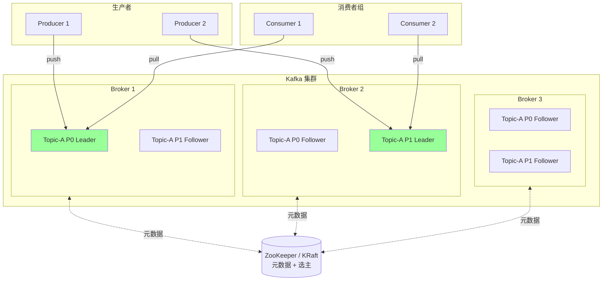

### 1.1 核心概念

| 概念 | 含义 |
| --- | --- |
| **Producer** | 生产者，发送消息 |
| **Consumer** | 消费者，拉取消息 |
| **Consumer Group** | 消费者组，组内分摊分区，组间广播 |
| **Broker** | Kafka 服务节点 |
| **Topic** | 消息主题（逻辑分类） |
| **Partition** | 分区，Topic 的物理拆分单位（**并行度单位**） |
| **Replica** | 副本，每个分区有 1 主 N 从 |
| **Leader / Follower** | 分区主从。读写都走 Leader，Follower 只复制 |
| **ISR** | In-Sync Replicas，与 Leader 数据同步的副本集合 |
| **Offset** | 消息在分区内的偏移量（位置） |
| **Segment** | 分区的物理文件单元（默认 1GB） |
| **Controller** | 集群中一个 Broker 担任，负责管理元数据和选主 |

### 1.2 Topic / Partition / Segment 三层

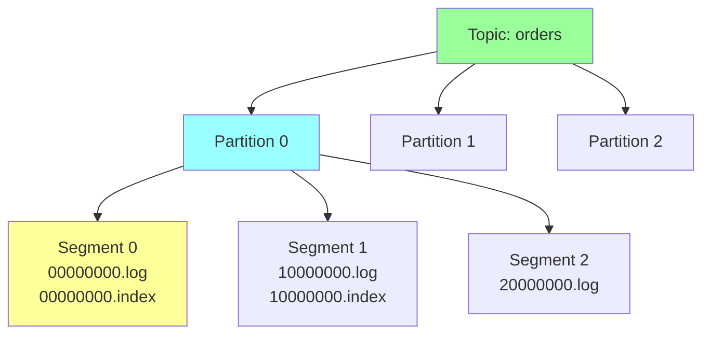

- **Topic** 是逻辑概念
- **Partition** 是物理拆分（一个 Topic 的消息分散到多个 partition）
- **Segment** 是 Partition 内的文件单元（按大小或时间滚动，默认 1GB）

每个 Segment 含：
- `.log`：消息数据（顺序追加）
- `.index`：稀疏索引（offset → 文件位置）
- `.timeindex`：时间索引

### 1.3 写入流程

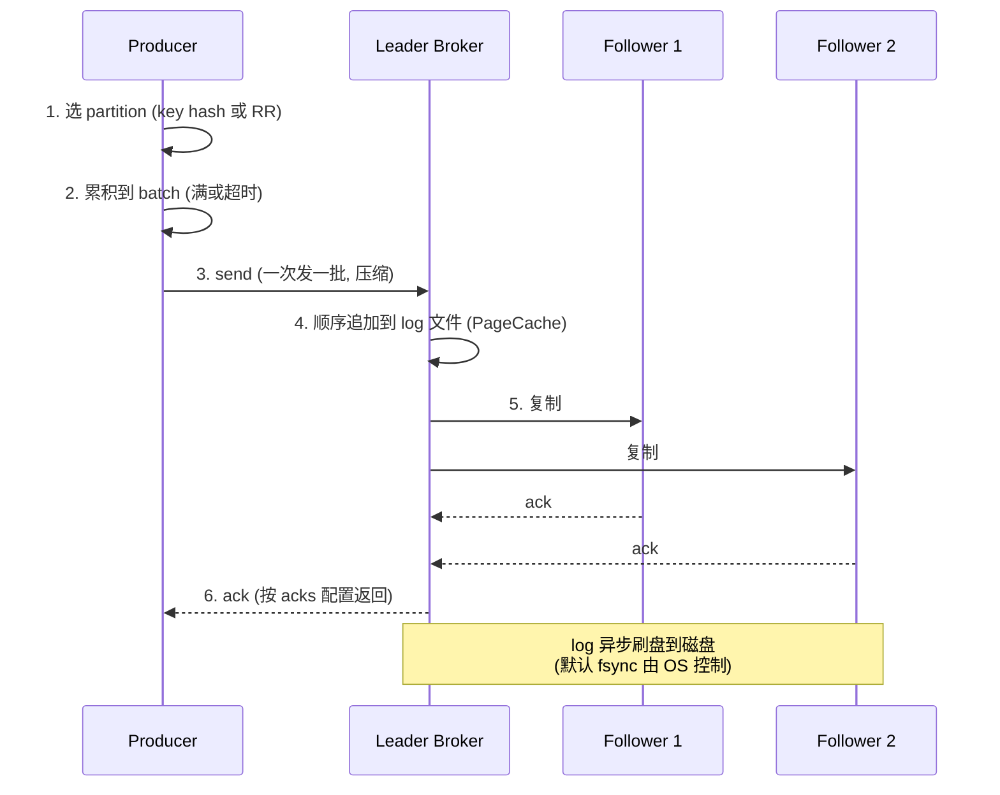

### 1.4 读取流程

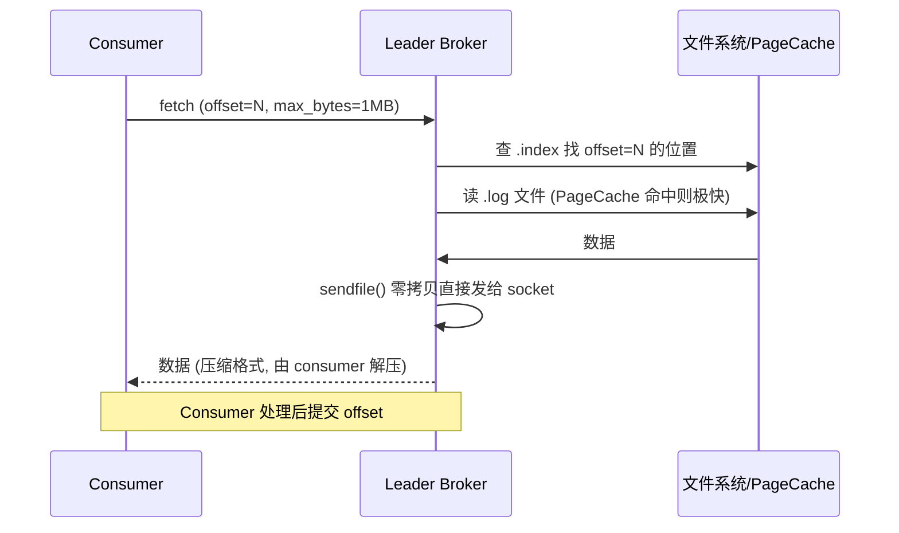

## 二、Kafka 为什么这么快（核心高频题）

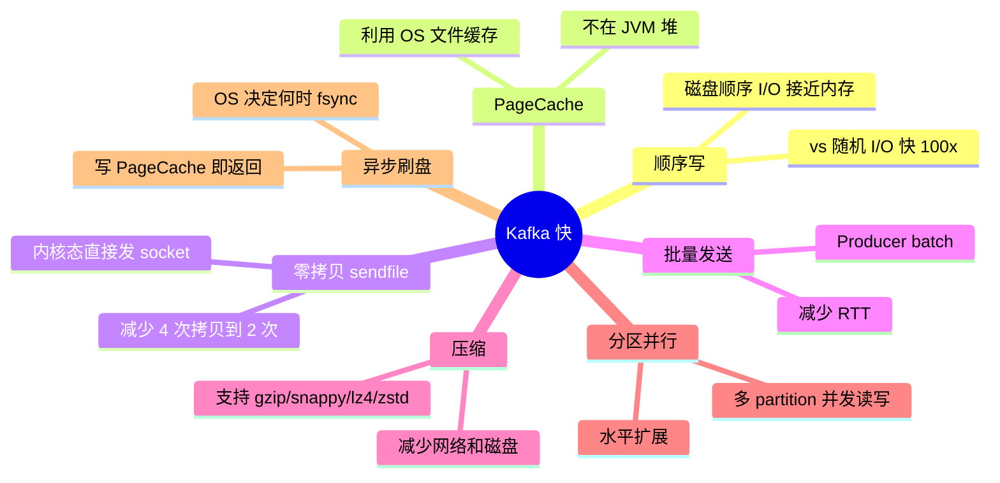

### 2.1 顺序写（最关键）

**误区**：磁盘慢。
**真相**：**磁盘随机 I/O 慢，顺序 I/O 接近内存**。

```
机械硬盘:
- 随机 I/O:  ~100 IOPS, ~1 MB/s
- 顺序 I/O:  ~500 MB/s

SSD:
- 随机 I/O:  ~50K IOPS
- 顺序 I/O:  ~3 GB/s
```

Kafka 设计：**消息只追加到 log 末尾**（append-only），从不修改、不随机读。

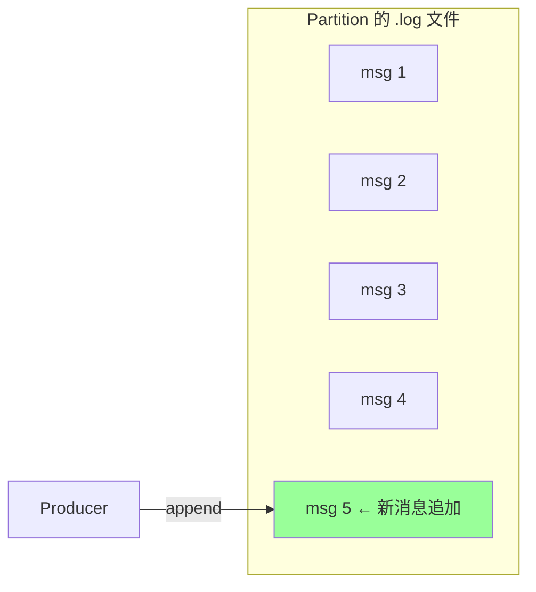

带来的好处：
- 顺序写 → 接近内存速度
- 文件不删（按时间/大小过期整段删）→ 无碎片
- 索引简单（offset → 文件位置，二分查找）

### 2.2 PageCache（操作系统页缓存）

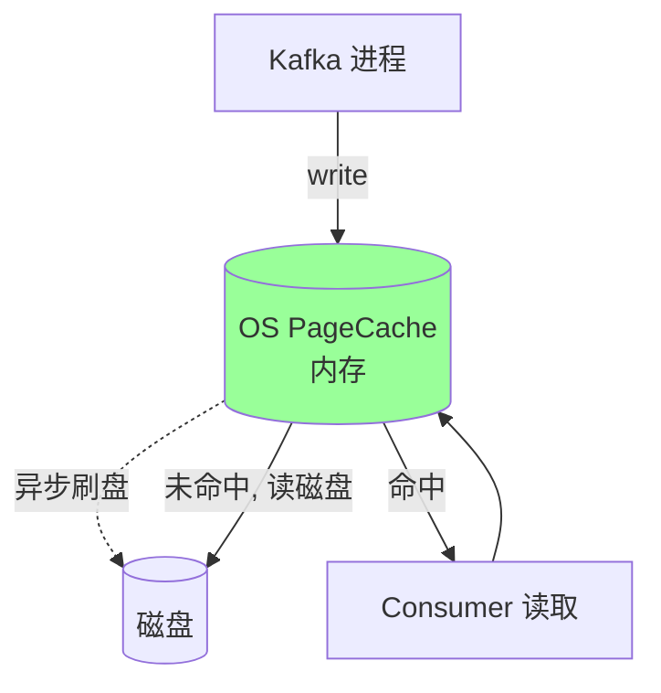

**关键设计**：
- 写入直接写 PageCache（OS 管理），**不立即刷盘**
- 读取优先 PageCache（命中则不读磁盘）
- 大量消息读写都在内存中完成

**为什么不用应用层缓存（如 JVM 堆）？**
- PageCache 是 OS 管理，**不占进程堆**（GC 友好）
- 进程重启 PageCache 仍在
- 多个进程可共享
- OS 已经高度优化（预读、回写策略）

### 2.3 零拷贝（Zero-Copy / sendfile）

#### 传统读发流程（4 次拷贝）

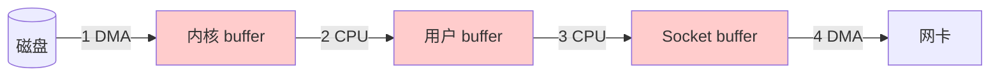

4 次数据拷贝 + 4 次上下文切换（用户态↔内核态）。

#### Kafka 零拷贝（2 次拷贝）

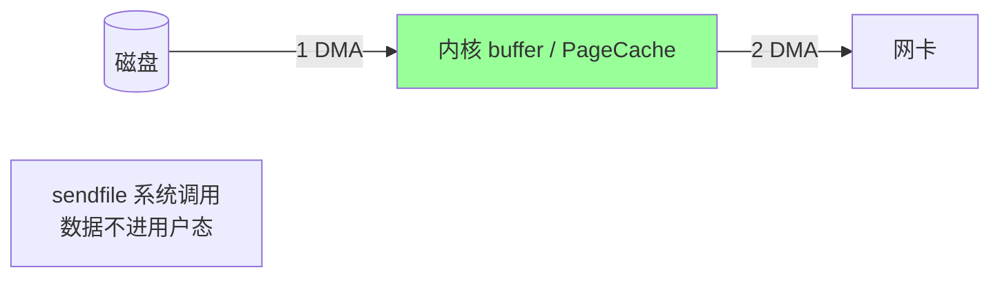

**`sendfile()` 系统调用**：
- 数据从 PageCache 直接 DMA 到网卡
- 不经过用户态（不用读到 Kafka 进程的内存）
- 减少 2 次拷贝 + 上下文切换

适用：消息原样转发（生产者写入啥就发给消费者啥，不修改内容）。Kafka 原始消息体不动，符合 sendfile 模型。

> 实际操作系统还有 `splice` / `mmap+write` 等，sendfile 是 Kafka 主用。

### 2.4 批量发送（Batch）

**生产者**：

```
linger.ms=5         # 等 5ms 凑批次
batch.size=16384    # 16KB 满批就发
```

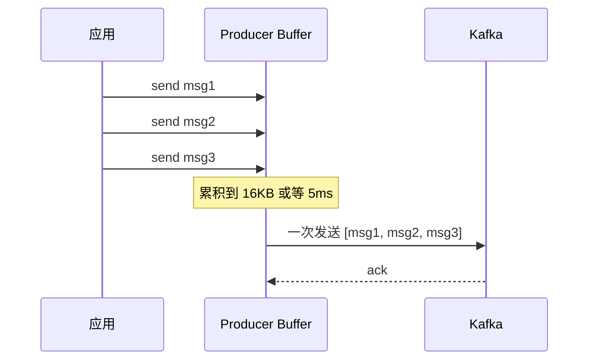

**好处**：
- 1 次网络 RTT 发 N 条消息
- 1 次 ack，吞吐 ×N
- 配合压缩（批内压缩比单条好）

**代价**：单条 RT 略增加（最多 linger.ms）。

**消费者**：

```
fetch.min.bytes=1
fetch.max.bytes=50MB
max.poll.records=500
```

每次 fetch 拉一批（默认 50MB / 500 条）。

### 2.5 压缩

```
compression.type=snappy   # 推荐 (lz4/zstd 也常用)
```

| 算法 | 压缩比 | CPU |
| --- | --- | --- |
| gzip | 高 | 高 |
| snappy | 中 | 低 |
| lz4 | 中 | 低 |
| zstd | **高** | **低** |

**zstd 现代首选**：压缩比和 lz4 接近，但比 snappy 高。

**Kafka 的压缩特点**：
- **批级压缩**（一批整体压缩，比单条压缩比高）
- **端到端**：Producer 压缩 → Broker 不解压保存 → Consumer 解压
- 减少网络 + 磁盘

### 2.6 分区并行

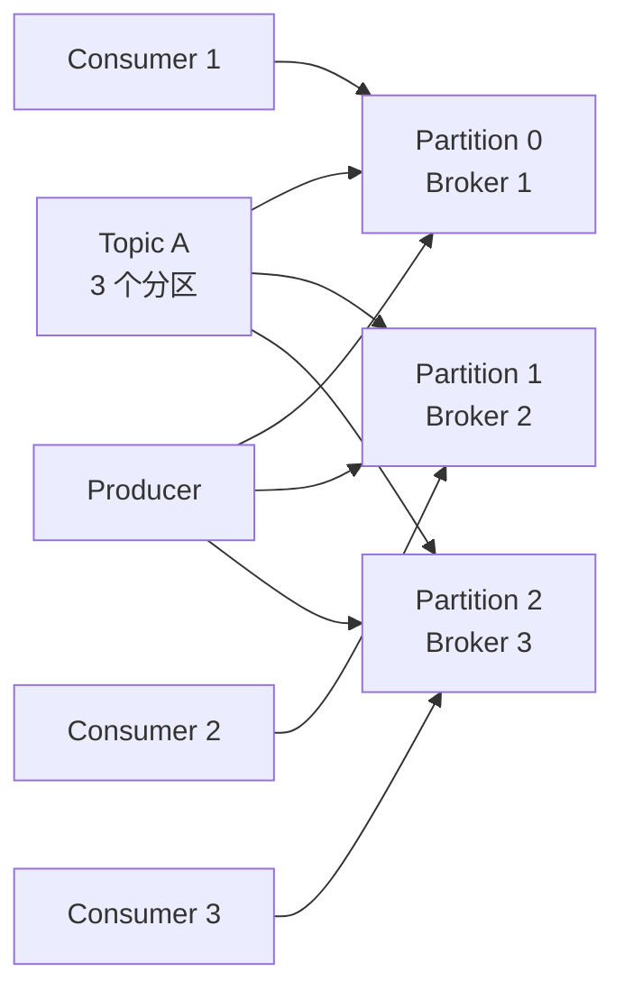

- 一个 Topic 的写入分散到 N 个 broker（水平扩展）
- 一个消费者组内 N 个消费者并行消费（每个负责一个 partition）
- **吞吐 ≈ 单 partition 吞吐 × 分区数**

### 2.7 异步刷盘

```
log.flush.interval.messages=Long.MAX  # 不主动刷 (默认)
log.flush.interval.ms=Long.MAX
```

**默认依赖 OS 刷盘**：
- 写 PageCache 立即返回（极快）
- OS 根据脏页比例 / 时间 决定何时 fsync 到磁盘
- 一般数秒到几十秒

**代价**：机器突然断电（不是进程崩）可能丢未刷盘数据。**Kafka 靠副本保证可靠**，不靠单机 fsync。

详见 `02-reliability.md`。

### 2.8 总结：5 大核心 + 配套优化

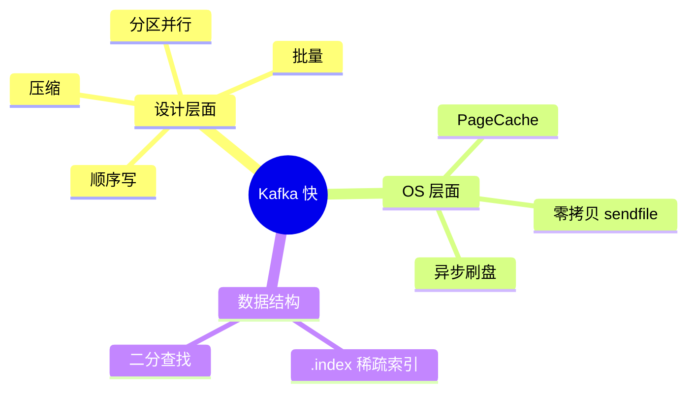

## 三、Kafka 选主与元数据管理

### 3.1 ZooKeeper 时代（2.x 及之前）

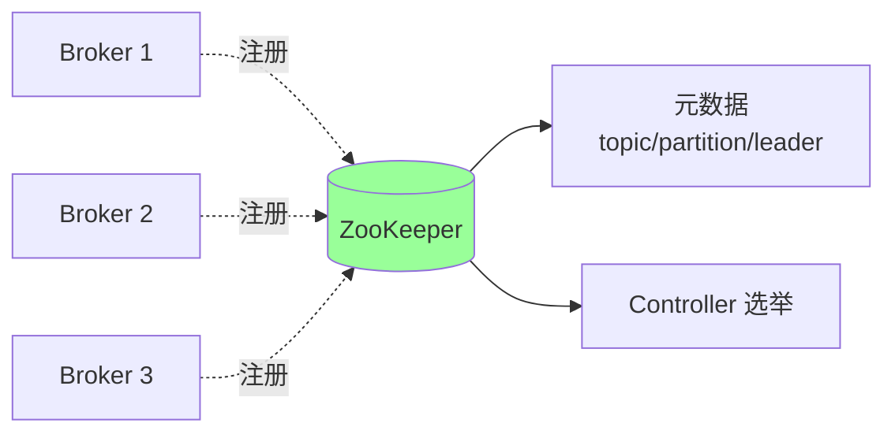

**ZK 的职责**：
- Broker 注册（临时节点）
- Topic 元数据存储
- Controller 选举（一个 Broker 当 Controller，管 partition leader 选举）
- ISR 列表
- 配置

**痛点**：
- ZK 是外部依赖（运维复杂）
- ZK 性能瓶颈（大集群元数据多）
- 选主慢

### 3.2 KRaft 时代（2.8+ 实验，3.3+ 生产可用）

Kafka 自己用 Raft 替代 ZK：

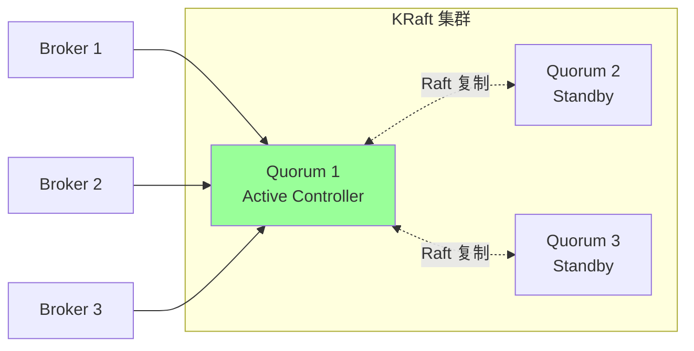

**优势**：
- **去 ZK 依赖**
- 元数据扩展性更好（百万级 partition 可行）
- 重启恢复更快
- 运维简化

**Kafka 4.0** 完全移除 ZK 支持。

## 四、Topic / Partition 设计

### 4.1 partition 数量怎么定？

**考虑因素**：
- **吞吐**：一个 partition 几十~几百 MB/s，按总吞吐 / 单 partition 算
- **消费者并发度**：一个消费者组里**消费者数 ≤ partition 数**（多余的消费者闲置）
- **副本开销**：partition × 副本数 = broker 上总分区数（太多影响性能）

**经验**：
- 小 topic：3~6 partition
- 中 topic：10~30 partition
- 大 topic：50~100 partition
- 单 broker 总 partition < 4000（性能拐点）

### 4.2 partition 选择策略

Producer 发消息时怎么选 partition？

```
1. 指定 partition: 直接用
2. 有 key: hash(key) % partitions (同 key 同 partition, 保证顺序)
3. 无 key:
   - Kafka 2.4 前: round-robin
   - Kafka 2.4+: sticky partitioner (一段时间发同一个, 攒批好压缩)
```

### 4.3 副本数

**通常 3**（1 leader + 2 follower）：
- 容忍 1 个副本挂
- 跨 rack 部署提高容灾
- 副本太多浪费存储和带宽

## 五、Segment 与索引

### 5.1 Segment 结构

每个 partition 是一个目录：

```
/kafka-logs/orders-0/
├── 00000000000000000000.log         # 起始 offset 0 的 segment
├── 00000000000000000000.index       # 稀疏索引
├── 00000000000000000000.timeindex
├── 00000000000000123456.log         # 起始 offset 123456
├── 00000000000000123456.index
└── ...
```

文件名 = 该 segment 的起始 offset。

### 5.2 滚动条件

```
log.segment.bytes=1073741824        # 1GB 满了滚
log.roll.ms=604800000                # 7 天到了滚
```

满任一条件 → 关闭当前 segment，开新 segment。

### 5.3 稀疏索引

```
.index 内容:
offset    file_position
0         0
4         4096
8         8192
```

每**几条消息**才记一次索引（不是每条），节省空间。

**查找过程**：
1. 二分查找 .index 找到最近的 offset
2. 从对应位置顺序扫描 .log 找精确消息

### 5.4 日志清理

两种策略：

#### 删除策略（默认）

```
log.retention.hours=168              # 保留 7 天
log.retention.bytes=-1               # 不限大小
log.cleanup.policy=delete
```

按时间或大小删过期 segment。

#### 压缩策略（log compaction）

```
log.cleanup.policy=compact
```

保留每个 key 的**最新值**，旧值删除。

适合：状态快照（如配置、用户最新位置）。

## 六、性能数据（参考）

| 配置 | 吞吐 |
| --- | --- |
| 单 broker 单 partition | 100 MB/s ~ 500 MB/s |
| 单 broker 多 partition | 1 GB/s+ |
| 单 partition QPS | 10w+ |
| 集群（10 broker, 100 partition） | 10 GB/s+ |

实际取决于：消息大小、副本数、压缩、磁盘类型、网卡。

## 七、高频面试题

**Q1：Kafka 为什么这么快？**

7 大原因（最高频题）：
1. **顺序写**：append-only，磁盘顺序 I/O 接近内存
2. **PageCache**：写读都走 OS 缓存，不进 JVM 堆
3. **零拷贝**：sendfile 减少数据拷贝（4 → 2 次）
4. **批量**：生产者攒批 + 消费者拉批
5. **压缩**：批内压缩（snappy/lz4/zstd）
6. **分区并行**：水平扩展，多 broker 多 partition
7. **异步刷盘**：写 PageCache 即返回，OS 决定刷盘

**Q2：什么是零拷贝？**

传统流程：磁盘 → 内核 buf → 用户 buf → socket buf → 网卡（4 次拷贝）。

**Kafka 用 sendfile**：磁盘 → PageCache → 网卡（2 次 DMA 拷贝，无用户态）。

减少 CPU 拷贝 + 上下文切换 → 大幅提升吞吐。

**Q3：Kafka 用 PageCache 不用 JVM 堆缓存？**

- **不占 JVM 堆**：避免 GC 压力（Kafka 只用很小的堆，几 GB 即可）
- **进程重启缓存仍在**：PageCache 是 OS 的
- **多进程共享**
- **OS 已高度优化**：预读、回写、淘汰

> Kafka 几乎所有数据操作都在 PageCache 中完成。

**Q4：Topic / Partition / Replica 是什么关系？**

```
Topic (逻辑) → 分成 N 个 Partition (物理) → 每个 Partition 有 M 个 Replica (副本)
```

- Topic 是消息分类
- Partition 是并行单位（吞吐扩展）
- Replica 是高可用单位（容错）

**Q5：partition 数量怎么定？**

按以下计算：
- 目标吞吐 / 单 partition 吞吐
- 消费者数量（最多 = partition 数）
- 副本因子（partition × 副本数 = broker 上总分区）

经验：小 topic 3~6，中 10~30，大 50~100。单 broker 不超 4000 partition。

**Q6：Kafka 的消息存储结构？**

```
Topic
└── Partition
    └── Segment (按大小/时间滚动, 默认 1GB / 7 天)
        ├── .log         (消息数据)
        ├── .index       (稀疏索引: offset → 位置)
        └── .timeindex   (时间索引)
```

查找：先二分 .index 找最近 offset，再顺序扫 .log。

**Q7：顺序写为什么快？**

- 磁盘随机 I/O：~100 IOPS（HDD）/ ~50K（SSD）
- 磁盘顺序 I/O：~500 MB/s（HDD）/ ~3 GB/s（SSD）

差**几个数量级**。Kafka 全程顺序追加，从不随机写，速度接近内存。

**Q8：Kafka 不依赖 ZK 后用什么？**

**KRaft 模式**（2.8 实验，3.3 生产可用，4.0 完全移除 ZK）：
- Kafka 自己用 Raft 协议
- Controller 用 Quorum 选举
- 元数据存在 Kafka 自己的内部 topic

优势：去外部依赖、扩展性更好、运维简化。

**Q9：为什么 Kafka 写入不立即 fsync？**

为了性能。fsync 慢（ms 级），写 PageCache 是 ns 级。

**靠副本保证可靠**：即使单机断电丢数据，其他副本仍有。

`acks=all` 确保多数副本写入 PageCache 后才返回，即使所有副本同时断电（极小概率）才会丢。

**Q10：Kafka 和 Redis 的设计差异？**

| | Kafka | Redis |
| --- | --- | --- |
| 用途 | 消息队列 | 内存数据库 |
| 数据存储 | 磁盘（顺序写） | 内存 |
| 持久化 | 默认开 | 可选 |
| 顺序保证 | 分区内 | - |
| 消费模式 | 拉模式 | 推/拉 |
| 多消费者 | 消费者组（一消息一消费者）+ 多组广播 | List 单消费 / Pub-Sub 广播 |
| 数据保留 | 按时间/大小 | TTL / 淘汰 |

## 八、面试加分点

- 强调"顺序写 + PageCache + 零拷贝"是 Kafka 三大杀手锏
- 零拷贝具体是 `sendfile` 系统调用
- PageCache 不在 JVM 堆，不影响 GC
- 顺序写让磁盘性能接近内存
- 分区是并行度单位
- segment 文件名是起始 offset
- 索引是稀疏的（不是每条都记）
- KRaft 替代 ZK 是趋势
- 异步刷盘 + 副本 = 性能 + 可靠的平衡
- Kafka 设计哲学：**简单、批量、顺序**
