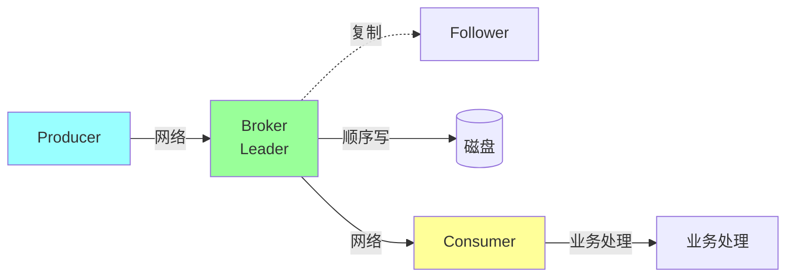
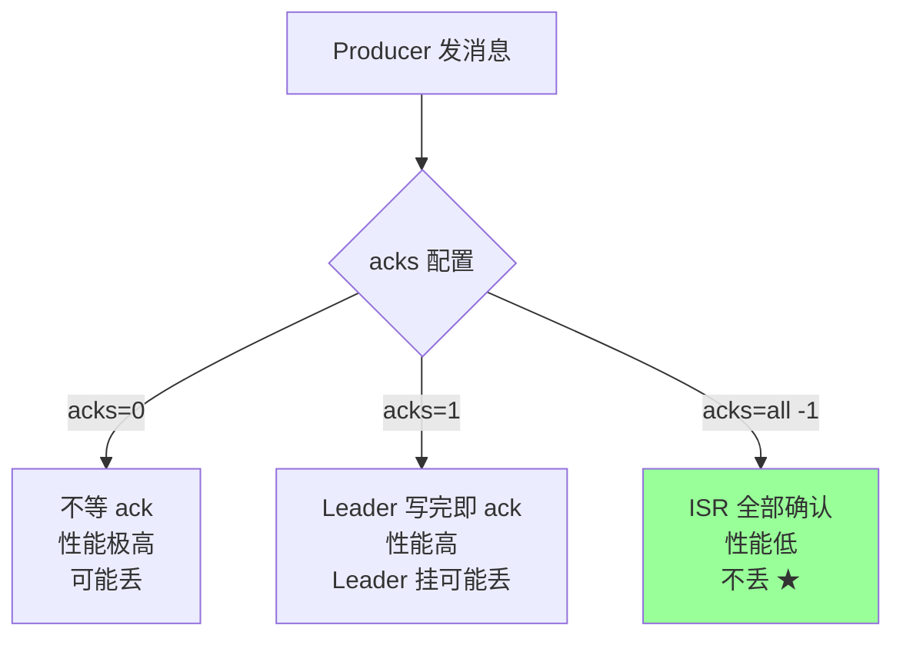
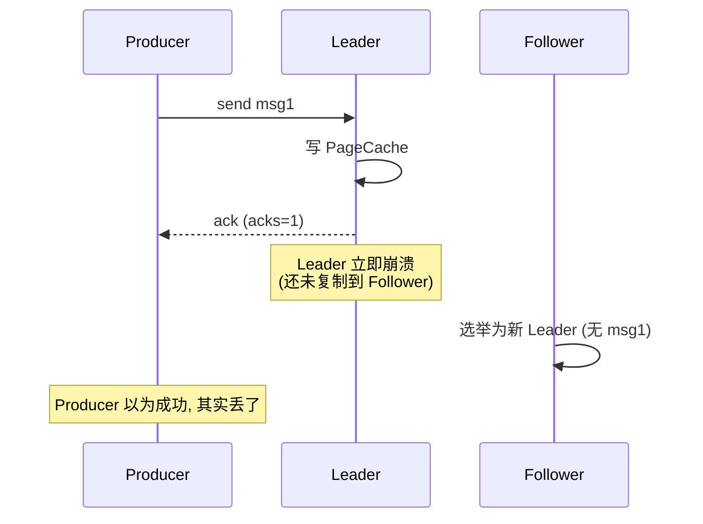
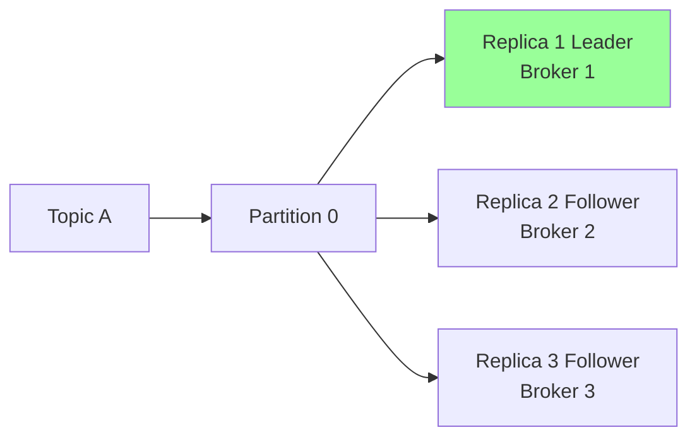
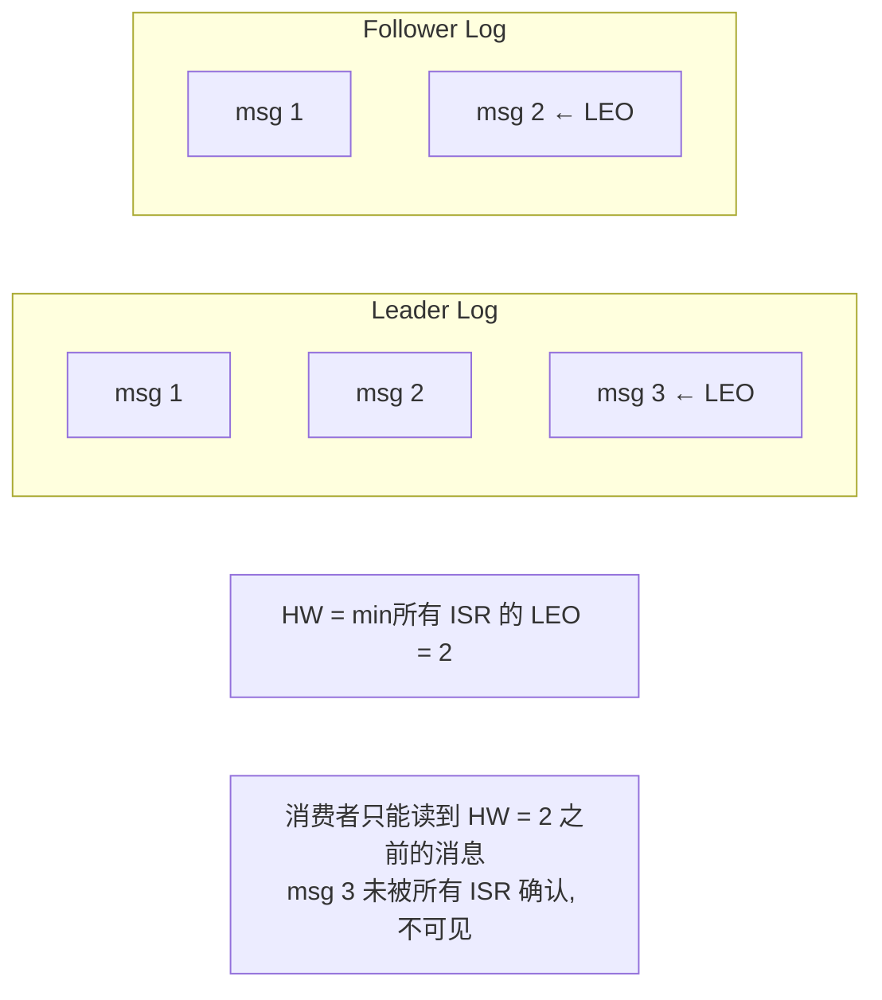
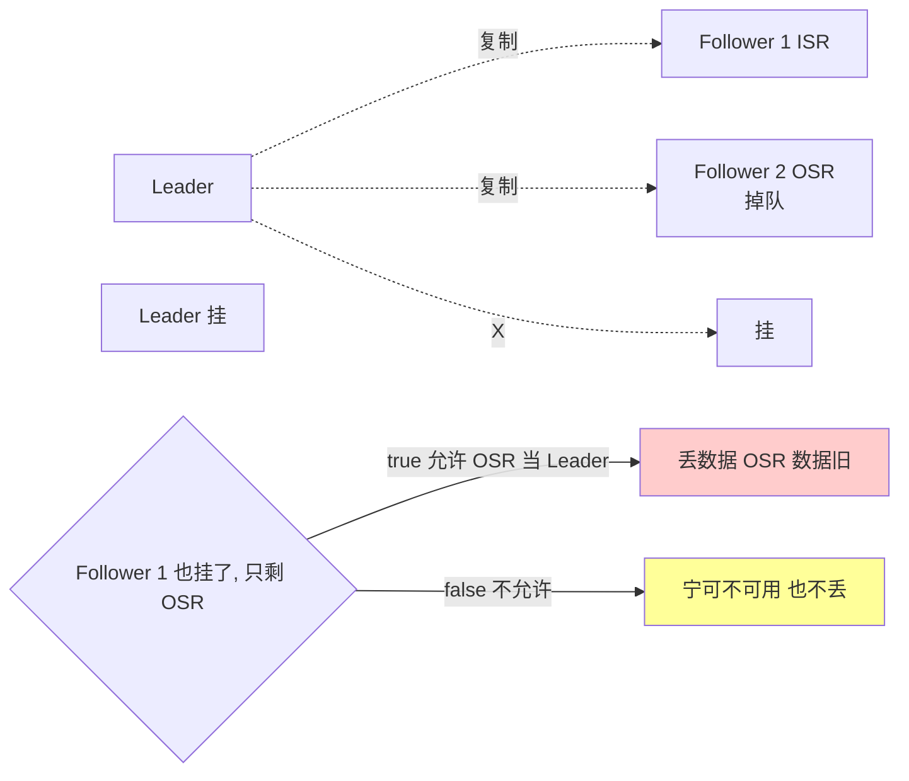
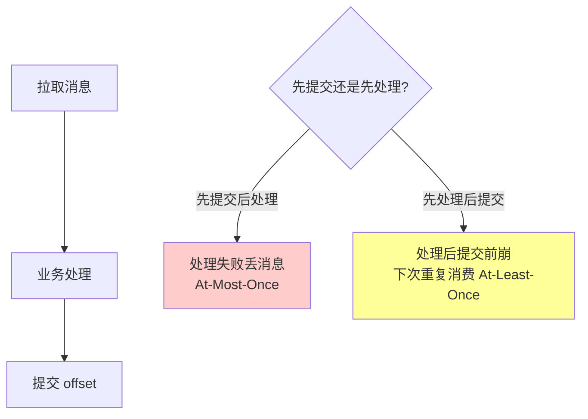
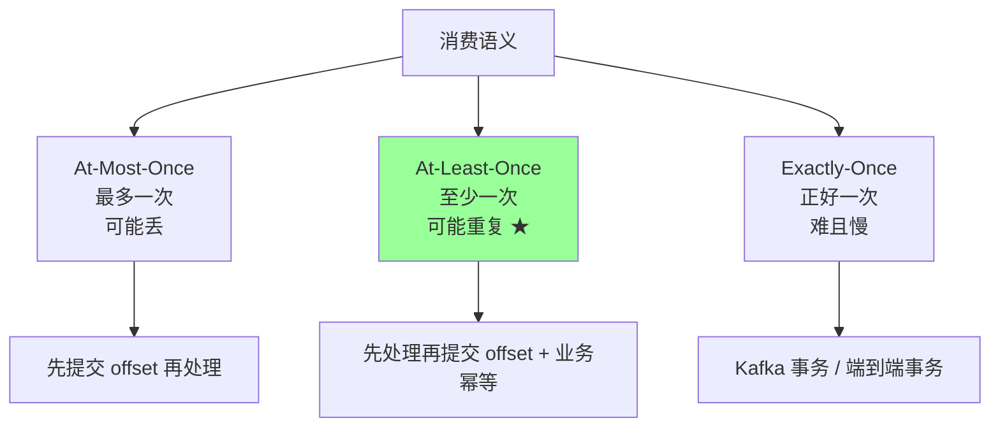
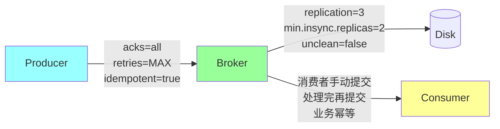

# 消息队列 · 消息可靠性

> 不丢消息全链路（生产 → 存储 → 消费）/ acks 三种 / min.insync.replicas / 消费者 offset 提交时机 / 三种语义

## 一、消息全链路与丢失风险



每一段都可能丢消息：

| 环节 | 丢失原因 |
| --- | --- |
| **生产者** | 发送失败未重试 / 异步发送进程崩 / 不等 ack |
| **网络** | 网络抖动丢包 |
| **Broker 接收** | Leader 写 PageCache 但断电、未复制就挂 |
| **Broker 复制** | Leader 挂时 Follower 还没复制 |
| **Broker 存储** | 异步刷盘期间机器崩 |
| **消费者拉取** | 网络丢失（Kafka 有 offset，可重拉） |
| **消费者处理** | 处理前提交 offset，处理时崩 |

**保证不丢需要全链路设计**。

## 二、生产者端

### 2.1 acks 三种级别（最关键）



| `acks` | 含义 | 性能 | 可靠 |
| --- | --- | --- | --- |
| **0** | 发出去就完，**不等任何 ack** | 极高 | 极差 |
| **1** | Leader 写完 PageCache 即返回 | 高 | 一般 |
| **all / -1** | **ISR 所有副本**确认才返回 | 低 | 最高 |

**生产推荐 `acks=all`**。

### 2.2 acks=1 的丢失场景



**修复**：用 `acks=all`。

### 2.3 acks=all 还可能丢吗

可能。如果 ISR 缩成只有 Leader（其他 Follower 都掉队），`acks=all` 等价于 `acks=1`。

**修复**：配合 `min.insync.replicas=2`：

```
acks=all
min.insync.replicas=2  # 至少 2 个副本在 ISR 才允许写
```

ISR 不足 2 时，Producer 直接报错（`NotEnoughReplicasException`），让业务感知。

### 2.4 重试

```
retries=Integer.MAX_VALUE        # 重试次数（默认 0!）
retry.backoff.ms=100              # 退避
delivery.timeout.ms=120000        # 总超时 (含重试)
```

⚠️ **默认 retries=0** 不重试，必须改大。

### 2.5 幂等生产者

```
enable.idempotence=true
```

开启后：
- Producer 自动加 PID + sequence number
- Broker 去重，防止网络重试导致重复
- **At-Least-Once → Exactly-Once（在 producer-broker 这一段）**

依赖：`acks=all`、`max.in.flight.requests.per.connection ≤ 5`、`retries > 0`。

详见 03。

### 2.6 同步 vs 异步发送

```go
// 异步: 高吞吐, 进程崩可能丢 buffer 中的消息
producer.Send(msg, callback)

// 同步: 等 ack, 慢但确定
result, err := producer.Send(msg).Get()  // 阻塞等
```

**异步 + 重要消息**：进程崩前要 flush。

```go
producer.Flush(timeout)  // 等所有未发送消息完成
producer.Close()
```

### 2.7 生产者最佳实践

```
acks=all
retries=Integer.MAX_VALUE  # 或较大值
enable.idempotence=true
max.in.flight.requests.per.connection=5
delivery.timeout.ms=120000
```

应用层：
- 异步发送加 callback 处理失败
- 关闭前 `flush()`
- 失败的消息进 DB 兜底，定时补发

## 三、Broker 端

### 3.1 副本机制



**只有 Leader 处理读写，Follower 异步复制 Leader**。

### 3.2 ISR（In-Sync Replicas）

ISR = 与 Leader 数据**同步**的副本集合（含 Leader）。

```
replica.lag.time.max.ms=30000  # Follower 30s 没追上 → 从 ISR 移除
```

只有 ISR 里的副本能被选为新 Leader。

### 3.3 高水位（HW, High Watermark）



- **LEO（Log End Offset）**：每个副本的下一条要写的 offset
- **HW（High Watermark）**：所有 ISR 的最小 LEO，**消费者只能读到 HW 之前**的消息

**作用**：保证消费者只读到已被多数副本确认的消息。即使 Leader 挂，新 Leader 也至少有 HW 之前的全部数据。

### 3.4 Broker 配置（不丢消息）

```
default.replication.factor=3      # 副本数 (默认 1!)
min.insync.replicas=2             # 至少 2 副本同步才允许写
unclean.leader.election.enable=false  # 禁止非 ISR 副本当选 Leader
```

#### unclean.leader.election



**禁用 unclean**：分区可能短暂不可用，但不丢数据（推荐）。

### 3.5 刷盘策略

```
log.flush.interval.messages=Long.MAX_VALUE   # 默认不主动刷
log.flush.interval.ms=Long.MAX_VALUE
```

**默认依赖 OS 刷盘**：性能极高但**单机断电丢未刷盘数据**。

Kafka 的策略：**不靠单机 fsync 保证可靠，靠副本**。`acks=all` + `min.insync.replicas=2` 即使一台机器断电，其他副本仍有数据。

要更安全可改 `log.flush.interval.messages=1`（每条都 fsync），但性能下降数十倍。

## 四、消费者端

### 4.1 offset 提交时机（关键）



### 4.2 三种语义



**实战 99% 用 At-Least-Once + 业务幂等**。

### 4.3 自动提交 vs 手动提交

```
enable.auto.commit=true        # 自动 (默认)
auto.commit.interval.ms=5000   # 5s 提交一次
```

**自动提交问题**：
- 5s 内拉了 100 条，处理 30 条时崩 → 提交了的 100 条都不再消费 → **丢 70 条**
- 或反过来：5s 内提交后才处理 → 处理时崩 → 重复消费

**生产推荐：手动提交**。

```go
for {
    msgs := consumer.Poll(timeout)
    for _, msg := range msgs {
        process(msg)
    }
    consumer.CommitSync()  // 处理完才提交
}
```

### 4.4 同步 vs 异步提交

```go
consumer.CommitSync()    // 阻塞等 broker ack, 慢但可靠
consumer.CommitAsync()   // 异步提交, 快但失败不重试
```

**最佳实践**：

```go
// 平时异步, 关闭前同步兜底
defer consumer.CommitSync()

for {
    msgs := consumer.Poll(timeout)
    for _, msg := range msgs {
        process(msg)
    }
    consumer.CommitAsync()  // 大多场景
}
```

### 4.5 业务处理失败怎么办

```go
for _, msg := range msgs {
    if err := process(msg); err != nil {
        // 选项 1: 重试 (本地多次)
        // 选项 2: 写入死信队列 (失败队列)
        // 选项 3: 不提交 offset, 下次重投
    }
}
```

详见 07-scenarios。

### 4.6 消费者最佳实践

```
enable.auto.commit=false
session.timeout.ms=30000
max.poll.interval.ms=300000   # 两次 poll 最大间隔, 超过被踢
max.poll.records=500
```

业务：
- **手动提交**（处理完再提交）
- **业务幂等**（重复消费不出错）
- **失败有兜底**（重试 / 死信队列）

## 五、不丢消息完整方案



### 5.1 生产者侧

```
acks=all
retries=Integer.MAX_VALUE
enable.idempotence=true
max.in.flight.requests.per.connection=5
delivery.timeout.ms=120000
```

**业务**：
- 异步 + callback 处理失败
- Flush 后再 Close
- 失败消息进 DB 定时补发

### 5.2 Broker 侧

```
default.replication.factor=3
min.insync.replicas=2
unclean.leader.election.enable=false
```

### 5.3 消费者侧

```
enable.auto.commit=false
isolation.level=read_committed   # 事务消息时
```

**业务**：
- 处理完才提交 offset
- 业务幂等（去重表 / 状态机 / 唯一键）
- 失败兜底（重试 / 死信）

## 六、典型坑

### 坑 1：用默认 retries=0

```
[默认] retries=0 → 网络抖动一次就丢
[修复] retries=Integer.MAX_VALUE
```

### 坑 2：acks=1 满足不了不丢

`acks=1` Leader 写完即返回，Leader 立即挂可能丢。**生产用 `acks=all`**。

### 坑 3：副本数=1

```
[默认] default.replication.factor=1 → 单副本, broker 挂全丢
[生产] replication.factor=3
```

### 坑 4：min.insync.replicas=1

`acks=all` 但 ISR 缩到 1 时等于 `acks=1`。**配合 min.insync.replicas=2**。

### 坑 5：开启 unclean.leader.election

ISR 都挂时允许 OSR 当 Leader → **数据丢失**。生产关闭。

代价：分区可能短暂不可用。**可用性 vs 可靠性的取舍**，金融场景必关。

### 坑 6：自动提交 offset

```
[默认] enable.auto.commit=true → 处理失败也提交了, 消息丢
[生产] enable.auto.commit=false + 手动提交
```

### 坑 7：先提交 offset 再处理

```go
consumer.CommitSync()  // 错: 提交了
process(msg)            // 然后处理时崩 → 消息没处理就提交了, 丢
```

**修复**：先处理再提交。

### 坑 8：处理慢导致 rebalance

```
max.poll.interval.ms=300000   # 默认 5 分钟
```

业务处理超过 5 分钟 → 被踢出消费者组 → rebalance → offset 提交失败 → 下次重新消费同样的消息（重复）。

**修复**：
- 减小 `max.poll.records`（每次拉少点）
- 处理放异步队列（不阻塞 poll）
- 必要时 `pause/resume`

### 坑 9：异步发送进程崩

```go
producer.SendAsync(msg)  // 在 buffer 里
os.Exit(0)                // buffer 没 flush, 丢
```

**修复**：

```go
defer func() {
    producer.Flush(30 * time.Second)
    producer.Close()
}()
```

### 坑 10：消费者重启 offset 丢失

新消费者组首次消费：

```
auto.offset.reset=latest   # 默认: 从最新开始 (跳过历史)
auto.offset.reset=earliest # 从最早开始 (重消费所有)
```

**生产改 latest** 或按业务定。`none` 直接报错（适合不能允许跳过的场景）。

## 七、高频面试题

**Q1：怎么保证 Kafka 不丢消息？（最高频）**

**全链路三段保证**：

**生产者**：
```
acks=all
retries=Integer.MAX_VALUE
enable.idempotence=true
```

**Broker**：
```
replication.factor=3
min.insync.replicas=2
unclean.leader.election.enable=false
```

**消费者**：
```
enable.auto.commit=false
+ 手动提交 (处理完再提)
+ 业务幂等
+ 失败兜底 (重试/死信)
```

**Q2：acks 三种级别？**

| acks | 行为 | 性能 | 丢失风险 |
| --- | --- | --- | --- |
| 0 | 不等 ack | 极高 | 极高 |
| 1 | Leader 写完即 ack | 高 | Leader 挂可能丢 |
| all | ISR 全部确认 | 低 | 最低 |

生产 `acks=all` + `min.insync.replicas=2`。

**Q3：min.insync.replicas 是什么？**

至少 N 个副本在 ISR 才允许 `acks=all` 的写入。

**作用**：防止 ISR 缩到 1 时 `acks=all` 退化成 `acks=1`，保证至少 N 个副本有数据。

通常 `min.insync.replicas=2`（3 副本配置下）。

**Q4：什么是 ISR / HW / LEO？**

- **ISR (In-Sync Replicas)**：与 Leader 同步的副本集合。Leader 挂时只能从 ISR 选新 Leader
- **LEO (Log End Offset)**：每个副本的下一条要写的 offset
- **HW (High Watermark)**：所有 ISR 副本的最小 LEO，**消费者只能读到 HW 之前**的消息

```
Leader LEO=10, Follower1 LEO=8, Follower2 LEO=9
HW = min(10, 8, 9) = 8
消费者最多读到 offset 7
```

**Q5：unclean.leader.election 是什么？**

```
unclean.leader.election.enable=true   # 允许 OSR (掉队的) 当 Leader
unclean.leader.election.enable=false  # 禁止 (生产推荐)
```

ISR 全挂时：
- **允许**：OSR 上位，丢失部分数据，分区可用
- **禁止**：分区不可用，等 ISR 中的副本恢复

**可用性 vs 可靠性的 trade-off**。金融关，互联网看业务。

**Q6：消费者三种语义？**

- **At-Most-Once**：先提交 offset 再处理。崩了消息丢。
- **At-Least-Once**：先处理再提交。崩了重复。**最常用**。
- **Exactly-Once**：Kafka 事务 / 端到端事务。复杂。

实战：**At-Least-Once + 业务幂等** ≈ Exactly-Once 效果。

**Q7：消费者 offset 何时提交？**

| 时机 | 优劣 |
| --- | --- |
| 自动定时（默认 5s） | 简单，**有丢/重风险** |
| 同步手动（每次处理完）| 可靠，慢 |
| 异步手动（每次处理完）| 快，失败不重试 |
| 同步 + 异步混合 | 推荐，平时异步关闭前同步 |

**生产推荐手动提交**。

**Q8：消费者重启后从哪开始消费？**

按已提交的 offset 继续。

如果**没有已提交 offset**（新消费者组）：

```
auto.offset.reset=latest    # 从最新, 跳过历史 (默认)
auto.offset.reset=earliest  # 从最早, 重消费所有
auto.offset.reset=none       # 报错
```

**Q9：Producer 异步发送丢消息怎么办？**

进程崩前 buffer 中的消息会丢。

**修复**：
1. Close 前 `flush()`
2. callback 中处理失败：写 DB 兜底，定时补发
3. 关键消息用同步发送

**Q10：业务处理慢导致 rebalance 丢/重消息？**

`max.poll.interval.ms=300000`（5 分钟），超过被踢出消费者组。

**修复**：
- 减小 `max.poll.records`（每次拉少点）
- 处理逻辑放异步（不阻塞 poll）
- 必要时 `consumer.pause()` 暂停拉取

**Q11：Kafka 副本同步流程？**

```
1. Producer 写 Leader (acks 配置决定何时返回)
2. Leader 把消息追加到 log
3. Followers 通过 fetch 请求拉数据 (像消费者)
4. Followers 写入自己的 log
5. Leader 根据所有 Follower 的 LEO 更新 HW
6. 消费者只能看到 HW 之前的消息
```

**异步复制**，但 acks=all 等于半同步（等 ISR 确认）。

**Q12：怎么保证不丢的同时性能不太差？**

```
acks=all                              # 必须
min.insync.replicas=2                  # 配合
enable.idempotence=true                # 几乎无开销
linger.ms=10                            # 攒批 10ms
batch.size=32768                        # 32KB 批次
compression.type=lz4                   # 压缩

# Broker 异步刷盘 (默认), 靠副本保证可靠
```

吞吐与单 acks=1 差距通常 < 30%。

## 八、面试加分点

- 不丢消息是**全链路问题**：生产 + Broker + 消费三段
- `acks=all + min.insync.replicas=2 + replication.factor=3` 是标配
- **min.insync.replicas 和 acks 配合**才有意义（单独 acks=all 不够）
- `unclean.leader.election=false` 可靠性优先
- `enable.idempotence=true` 解决 Producer-Broker 重复
- **消费者手动提交**是关键
- **At-Least-Once + 业务幂等** 是实战主流
- `auto.offset.reset` 默认 latest 可能跳过历史
- 消费者**先处理再提交**（不是反过来）
- `max.poll.interval` 防业务处理慢被踢
- Kafka 不靠 fsync，靠**副本 + acks**保证可靠
- 异步发送必须在 Close 前 flush
