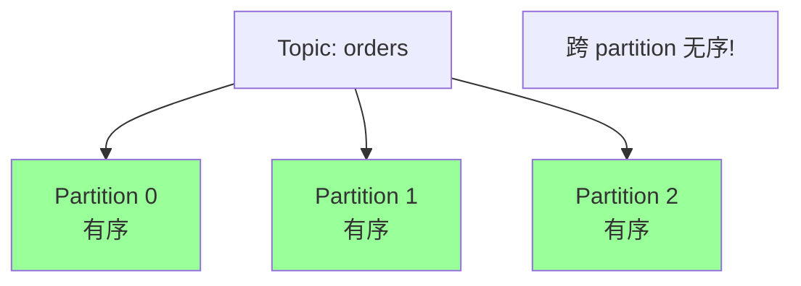
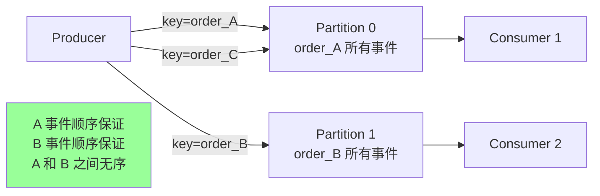
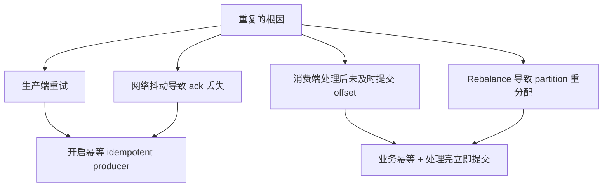
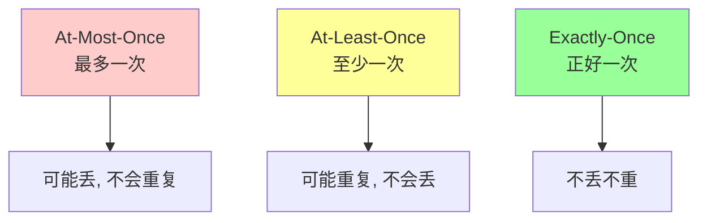
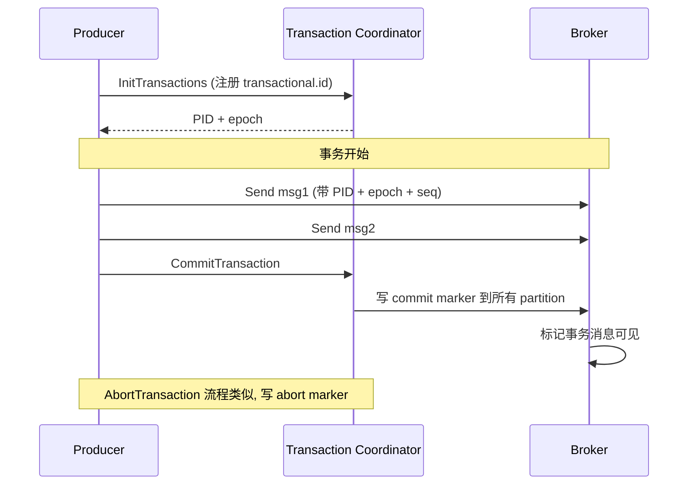
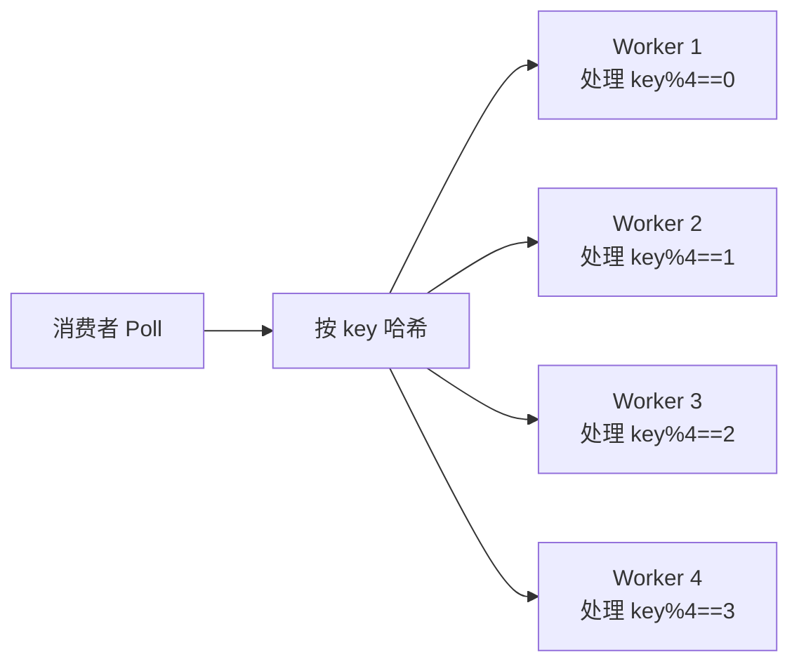
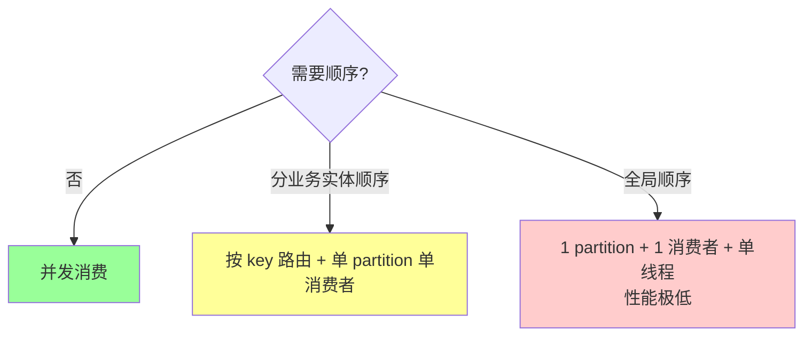

# 消息队列 · 消息顺序与重复

> 分区内有序 / 全局有序方案 / 重复消费根因 / 幂等设计 5 种 / Exactly Once 三种语义实现

## 一、消息顺序

### 1.1 Kafka 顺序保证

**Kafka 只保证分区内有序，不保证 Topic 全局有序**。



### 1.2 为什么是分区内有序

- **写入**：Producer 写到某个 partition，partition 内顺序追加
- **读取**：Consumer 按 offset 顺序读

跨 partition 没有时间戳协调，**无法保证全局顺序**。

### 1.3 实现方式

#### 同一业务实体顺序：用 key 路由

```go
producer.Send(&Message{
    Topic: "orders",
    Key:   []byte(orderID),  // 同 orderID 一定到同 partition
    Value: data,
})
```

`hash(key) % partitions` → 同 key 同 partition → **同 key 顺序**。

例：
- 订单 A 的所有事件（创建/付款/发货）顺序处理
- 订单 B 和订单 A 之间不需要顺序



### 1.4 全局顺序

**只能用 1 个 partition**：

```bash
kafka-topics --create --partitions 1 ...
```

代价：
- **吞吐受限**（单 partition QPS 几十万）
- **消费者组只能 1 个消费者**
- **失去并行**

**99% 不需要全局顺序**。需要时往往是设计问题，应改为按业务实体（key）顺序。

### 1.5 顺序保证的破坏

#### 破坏 1：Producer 重试 + 多 in-flight

```
Producer 发 msg1 → 网络失败
Producer 发 msg2 → 成功 → broker 写入
Producer 重试 msg1 → 成功 → broker 写入
顺序变成 msg2, msg1 (错!)
```

**修复**：

```
max.in.flight.requests.per.connection=1   # 一次只允许 1 个未确认请求
# 或开启幂等性 (Kafka 自动保证 5 个 in-flight 内的顺序)
enable.idempotence=true
```

#### 破坏 2：消费者多线程处理

```go
for _, msg := range msgs {
    go process(msg)  // 多 g 并发, 顺序错乱!
}
```

**修复**：
- **单 g 顺序处理**（牺牲并发）
- **按 key 哈希到不同 worker**（保 key 顺序，整体并发）

```go
workers := make([]chan Message, n)
for i := 0; i < n; i++ {
    workers[i] = make(chan Message, 100)
    go func(ch <-chan Message) {
        for msg := range ch {
            process(msg)
        }
    }(workers[i])
}

for _, msg := range msgs {
    idx := hash(msg.Key) % n
    workers[idx] <- msg  // 同 key 到同 worker
}
```

#### 破坏 3：rebalance

消费者退出 → partition 重新分配 → 新消费者从已提交 offset 开始 → **可能与未提交的消息重叠**。

如果业务依赖严格顺序：
- 提交 offset 要及时（每条提交 / 处理一批就提交）
- 业务幂等（重复也不出错）

## 二、消息重复

### 2.1 重复的根因



### 2.2 生产端重复

```
Producer 发消息 → broker 写成功 → ack 网络丢失 → Producer 超时重试 → broker 收到第二份
```

**修复**：

```
enable.idempotence=true
```

Kafka 给 Producer 分配 PID + 每条消息 sequence number，broker 去重。

### 2.3 消费端重复

最常见。处理消息和提交 offset 之间任何崩溃都会导致重复：

```
消费 msg → 处理 msg → 提交 offset
              ↑
          这里崩 → 下次重新消费同样的 msg
```

**修复**：业务幂等。

### 2.4 业务幂等（详见 distributed/08）

5 种方式：

#### 方式 1：唯一 ID + 去重表

```sql
CREATE TABLE consumed (
    msg_id VARCHAR(64) PRIMARY KEY,
    consumed_at TIMESTAMP
);

-- 消费时
INSERT INTO consumed (msg_id) VALUES (?);
-- 唯一约束失败 → 已消费, 跳过
```

#### 方式 2：状态机

```sql
UPDATE orders SET status='paid' WHERE id=? AND status='unpaid';
-- 已 paid 时 update 不影响行数, 重复消息无副作用
```

#### 方式 3：乐观锁

```sql
UPDATE products SET stock=stock-1, version=version+1
WHERE id=? AND version=?;
```

#### 方式 4：Redis SETNX

```bash
SET dedup:msg_id 1 NX EX 86400
# 成功 → 处理; 失败 → 已消费
```

#### 方式 5：天然幂等

`SET x=1`、`DELETE WHERE id=?` 多次执行同结果。

## 三、Exactly-Once 三种语义

### 3.1 三种语义对比



| 语义 | 实现 | 适用 |
| --- | --- | --- |
| At-Most-Once | 简单（先提交 offset） | 容忍丢的统计 |
| At-Least-Once | **主流**（处理后提交 + 业务幂等） | 99% 业务 |
| Exactly-Once | 复杂（Kafka 事务 / 端到端） | 严格不丢不重 |

### 3.2 Kafka 事务（Exactly-Once 实现）

#### Kafka 0.11+ 引入事务 API

```go
producer.InitTransactions()

producer.BeginTransaction()
producer.Send(msg1)
producer.Send(msg2)
producer.SendOffsetsToTransaction(offsets, consumerGroup)  // consume-process-produce 场景
producer.CommitTransaction()  // 或 AbortTransaction
```

#### 工作机制



**消费端**：

```
isolation.level=read_committed   # 只读已提交事务的消息 (默认 read_uncommitted)
```

### 3.3 Exactly-Once 三种实现

#### 实现 1：幂等 Producer + 业务幂等

```
enable.idempotence=true   # Producer 端去重
+ 业务幂等 (去重表 / 状态机)
= 端到端 Exactly-Once
```

**简单常用**。99% 场景够用。

#### 实现 2：Kafka 事务（多消息原子）

适合：
- 一次发送多条消息要原子（要么都成要么都不成）
- consume-process-produce（消费 + 处理 + 再发）

```go
// consume-process-produce
producer.BeginTransaction()
for _, msg := range pollMsgs {
    result := process(msg)
    producer.Send(resultTopic, result)
}
producer.SendOffsetsToTransaction(offsets, groupID)
producer.CommitTransaction()
```

要么全部消费 + 处理 + 输出 + 提交 offset 都成功，要么全部回滚。

#### 实现 3：端到端事务

应用层做：消费 + 处理 + 输出（DB / 下游）+ 提交 offset。

通常用**外部 DB 的事务 + 业务幂等**：

```go
db.Begin()
process(msg)            // 写 DB
saveOffset(msg.offset)  // offset 也存到 DB
db.Commit()
// 不提交 Kafka 的 offset, 用 DB 中的 offset
// 重启时从 DB 读 offset 继续消费
```

### 3.4 Exactly-Once 的代价

- **吞吐降低**（事务协调开销）
- **延迟增加**（提交事务才可见）
- **复杂度高**

**99% 场景用 At-Least-Once + 业务幂等**就够了。

## 四、生产端顺序保证

### 4.1 默认行为

```
max.in.flight.requests.per.connection=5   # 默认 5
```

允许 5 个未确认请求并发。某个失败重试可能导致顺序错乱。

### 4.2 严格顺序

```
max.in.flight.requests.per.connection=1
```

一次只允许 1 个 in-flight，**性能差**（吞吐 ↓ 5x）。

### 4.3 推荐：开启幂等

```
enable.idempotence=true
# 自动 max.in.flight ≤ 5 时仍保证顺序
# acks=all, retries=Integer.MAX_VALUE 也自动配置
```

幂等 Producer 内部用 sequence number，broker 按序号校验，重试也不会乱序。

### 4.4 同步发送（极致顺序）

```go
result, err := producer.Send(msg).Get()  // 阻塞等
```

发完一条等 ack 再发下一条。**慢但严格顺序**。

## 五、消费端顺序保证

### 5.1 单线程消费

```go
for {
    msgs := consumer.Poll()
    for _, msg := range msgs {
        process(msg)         // 串行
        commit(msg.offset)   // 处理完才提交
    }
}
```

**简单但慢**（无法利用 CPU）。

### 5.2 按 key 多 worker



```go
workers := make([]chan Message, n)
for i := 0; i < n; i++ {
    ch := make(chan Message, 100)
    workers[i] = ch
    go worker(ch)
}

for {
    msgs := consumer.Poll()
    for _, msg := range msgs {
        workers[hash(msg.Key) % n] <- msg
    }
    // 等所有 worker 处理完再提交 (复杂!)
}
```

**问题**：
- 如何知道所有 worker 处理完？需要协调
- 部分 worker 失败怎么办？

### 5.3 顺序消费的取舍



## 六、典型场景

### 6.1 订单状态变更

```
事件: 订单创建 → 付款 → 发货 → 确认收货
要求: 同一订单的事件顺序处理
```

**方案**：用 `orderID` 作为 key，同订单到同 partition，单消费者顺序处理。

不同订单可并行（多 partition）。

### 6.2 银行流水

```
要求: 用户的所有转账按时间顺序
```

**方案**：用 `userID` 作为 key。

### 6.3 业务无顺序需求

如点赞、评论、统计 → 不需要 key，随机 partition，最大并发。

## 七、典型坑

### 坑 1：以为 Kafka 全局有序

Kafka **只保证分区内有序**。要全局必须 1 partition（性能拉胯）。

### 坑 2：用 key 但 key 倾斜

```
所有消息 key="default" → 全部到同一 partition → 单 partition 热点 + 其他 partition 闲置
```

**修复**：合理设计 key 分布。

### 坑 3：消费者多线程破坏顺序

```go
for _, msg := range msgs {
    go process(msg)  // 错!
}
```

**修复**：单线程或按 key 路由。

### 坑 4：默认 max.in.flight 5 + 重试 = 顺序错乱

**修复**：开 `enable.idempotence=true` 或 `max.in.flight=1`。

### 坑 5：以为 Exactly-Once 没成本

Kafka 事务有性能损耗。简单场景用 **At-Least-Once + 幂等** 就好。

### 坑 6：消费者重复消费用 Redis 去重但没设 TTL

```go
rdb.Set(ctx, "dedup:"+msgID, 1, 0)  // 永不过期 → 内存爆
```

**修复**：设合理 TTL（如 24h）。

### 坑 7：去重表无索引

```sql
SELECT * FROM consumed WHERE msg_id=?  -- 无索引慢
```

**修复**：UNIQUE 索引或 PRIMARY KEY。

### 坑 8：rebalance 期间重复

rebalance → partition 重分配 → 新消费者从已提交 offset 开始 → 之前未提交的消息被重新消费。

**修复**：业务幂等是兜底。

## 八、高频面试题

**Q1：Kafka 怎么保证消息顺序？**

**只保证分区内有序**。

实现：
- 同一业务实体用同一 key（`hash(key) % partitions` 路由）
- 全局顺序需要 1 partition（性能差，少用）

**Q2：消息怎么会重复？**

3 个根因：
1. **生产端**：发送成功但 ack 丢失 → 重试 → broker 收到两份
2. **消费端**：处理后未及时提交 offset → 重启重消费
3. **Rebalance**：partition 重新分配，未提交 offset 的消息重消费

**Q3：怎么去重 / 实现幂等？**

5 种方式：
1. **唯一 ID + 去重表**（UNIQUE 约束）
2. **状态机**（WHERE status=...）
3. **乐观锁**（version 字段）
4. **Redis SETNX**
5. **天然幂等**（SET / DELETE）

实战：唯一 ID + 状态机组合。

**Q4：三种消费语义？**

| | 实现 | 适用 |
| --- | --- | --- |
| At-Most-Once | 先提交 offset 再处理 | 容忍丢 |
| **At-Least-Once** | 先处理再提交 | **99% 业务** |
| Exactly-Once | Kafka 事务 / 端到端 | 严格不丢不重 |

**At-Least-Once + 业务幂等** ≈ Exactly-Once 效果。

**Q5：Kafka 事务怎么实现 Exactly-Once？**

```
1. Producer 注册 transactional.id, 拿到 PID + epoch
2. BeginTransaction
3. Send 多条消息 (带 PID + epoch + sequence)
4. SendOffsetsToTransaction (consume-process-produce 场景)
5. CommitTransaction (Coordinator 写 commit marker 到各 partition)

Consumer: isolation.level=read_committed 只读已提交
```

**Q6：怎么开启 Producer 幂等？**

```
enable.idempotence=true
```

自动配置：
- `acks=all`
- `retries=Integer.MAX_VALUE`
- `max.in.flight.requests.per.connection ≤ 5`

Kafka 内部用 PID + sequence number 去重。

**Q7：消费者多线程处理破坏顺序怎么办？**

3 种方案：
1. **单线程**：简单但慢
2. **按 key 路由到不同 worker**：保 key 顺序 + 整体并发
3. **不要求顺序**：直接并发

按业务需求选。

**Q8：max.in.flight=5 为什么会破坏顺序？**

允许 5 个未确认请求并发。如果第 1 个失败重试，第 2-5 个先成功，重试的第 1 个后到 → 顺序乱。

**修复**：
- `max.in.flight=1`（性能差）
- `enable.idempotence=true`（broker 按 sequence 号去重 + 排序，性能好）

**Q9：Rebalance 怎么影响顺序和重复？**

**顺序**：partition 换消费者，消费起点从已提交 offset 开始。如果已提交点和实际处理点有差距 → 重复。

**重复**：处理但未提交 offset 的消息会被重新消费。

**修复**：业务幂等 + 及时提交 offset。

**Q10：怎么保证业务侧端到端 Exactly-Once？**

实战方案：
1. **幂等 Producer**：`enable.idempotence=true`
2. **Broker**：`acks=all`、`min.insync.replicas=2`
3. **Consumer**：手动提交 offset + 业务幂等

或用 **Kafka 事务**：`producer.transactional.id` + `consumer.isolation.level=read_committed`。

**Q11：什么场景必须严格顺序？**

- **金融流水**：转账顺序错会导致余额错
- **状态机**：订单状态必须按顺序流转
- **审计日志**：时间顺序

**不需要**严格顺序：统计、日志、通知、推荐。

**Q12：怎么处理消息重复？**

**接收端必须幂等**。常见：
1. 唯一 ID + 去重表
2. 业务状态检查
3. Redis SETNX 去重

**关键**：去重逻辑要原子（避免并发下两个请求都通过去重检查）。

## 九、面试加分点

- **Kafka 只保证分区内有序**（不是 Topic 全局）
- 用 key 路由保证业务实体内顺序（最常用）
- 全局顺序 = 1 partition = 性能损失
- Producer 重试 + max.in.flight=5 默认会破坏顺序
- `enable.idempotence=true` 解决 Producer 重试重复 + 顺序
- **At-Least-Once + 业务幂等** 是 99% 场景的最佳实践
- Kafka 事务实现端到端 Exactly-Once 但有性能成本
- Consumer `isolation.level=read_committed` 配合 Kafka 事务
- 业务幂等 5 种方式（去重表 / 状态机 / 乐观锁 / Redis / 天然）
- **去重 Key 要选业务唯一标识**（msg_id / order_id 等）
- Rebalance 期间会有重复（兜底是幂等）
