# 消息队列 · 高可用与副本

> 副本机制 / ISR vs OSR / HW 与 LEO / Leader 选举 / Controller / 故障转移 / 数据一致性

## 一、副本机制

### 1.1 为什么需要副本

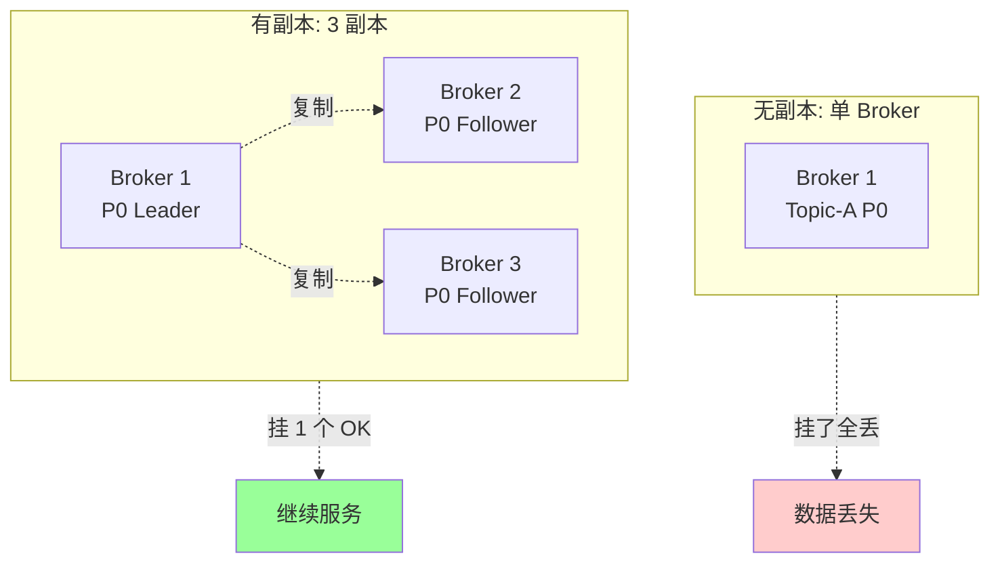

副本目的：
- **容错**：单机挂不丢数据
- **高可用**：自动故障转移
- **可选读扩展**（Kafka 默认不让读 Follower，3.4+ 支持就近读）

### 1.2 配置

```
default.replication.factor=3   # 默认副本数 (生产推荐)
```

3 副本 = 1 Leader + 2 Follower。可容忍 1 个副本挂。

### 1.3 副本分布策略

Kafka 自动把 partition 的副本分散到不同 Broker：

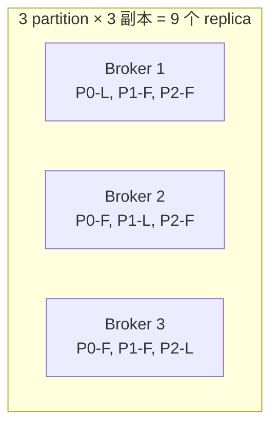

**rack-aware**（机架感知）：可配置避免副本都在同机架。

```
broker.rack=rack1
```

`replica.selector.class=RackAwareReplicaSelector`

## 二、ISR / OSR

### 2.1 ISR 概念

**ISR (In-Sync Replicas)**：与 Leader **数据同步**的副本集合（含 Leader 自己）。

**OSR (Out-of-Sync Replicas)**：掉队的副本（不含 Leader）。

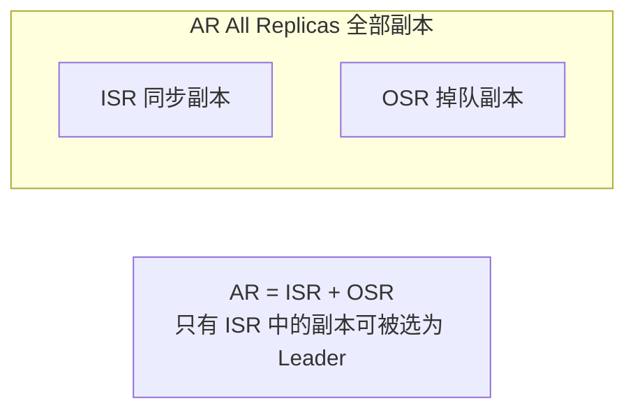

### 2.2 ISR 判定

```
replica.lag.time.max.ms=30000   # Follower 30s 没追上 Leader → 移出 ISR
```

**注意**：以前还有 `replica.lag.max.messages`（按消息数判断），0.9 后移除（消息数容易因突发流量误判）。

### 2.3 ISR 动态变化

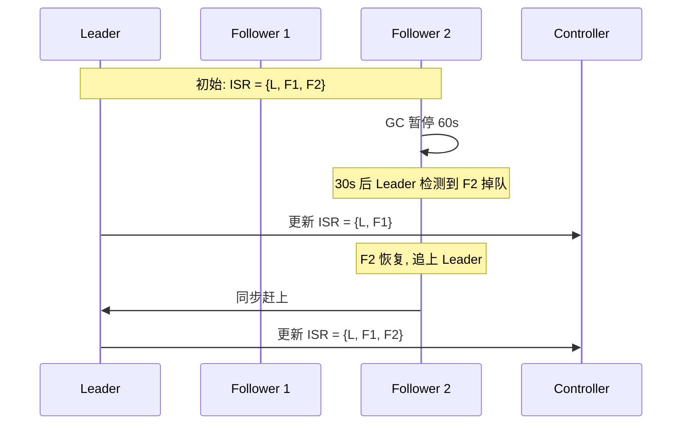

### 2.4 ISR 与 Quorum 的差异

#### Raft / Paxos：Quorum

需要**多数派**确认（如 3 副本要 2 个确认）。

#### Kafka：ISR

灵活动态。N 副本时：
- 全部健康：ISR=N，acks=all 等所有
- 部分掉队：ISR 减小，acks=all 只等剩余
- 极端：ISR=1（只有 Leader），acks=all 等价 acks=1

**优势**：不强制多数派，灵活适应慢节点。
**劣势**：可能 ISR 缩到 1（用 `min.insync.replicas` 兜底）。

```
min.insync.replicas=2   # 至少 2 个副本在 ISR 才允许 acks=all 写入
```

## 三、HW 和 LEO

### 3.1 概念

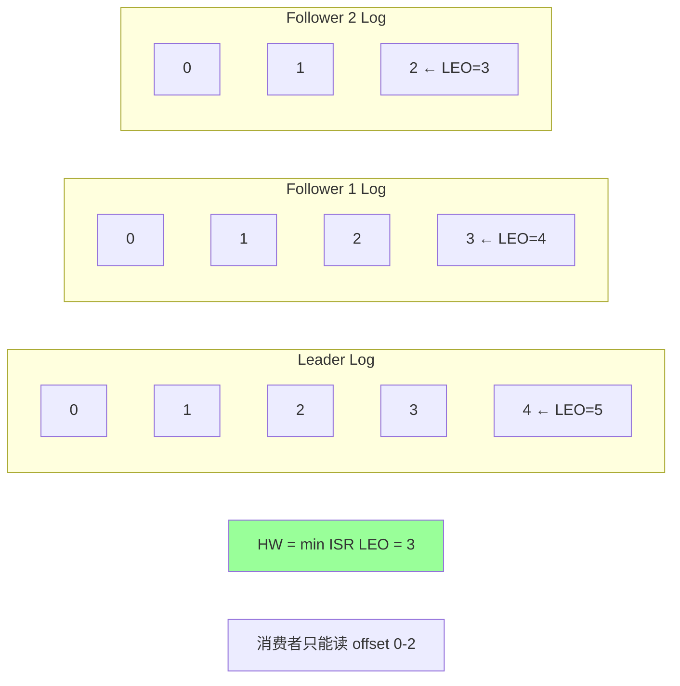

- **LEO (Log End Offset)**：每个副本下一条要写的 offset（实际是已写到的位置 + 1）
- **HW (High Watermark)**：所有 ISR 副本的最小 LEO，**消费者只能读到 HW - 1**

### 3.2 HW 推进

```
Leader 收到新消息 → LEO+1
Follower fetch 拉到 → 自己 LEO+1, 上报给 Leader
Leader 收到所有 ISR 的 LEO 上报 → 更新 HW = min(所有 ISR LEO)
```

### 3.3 为什么要 HW

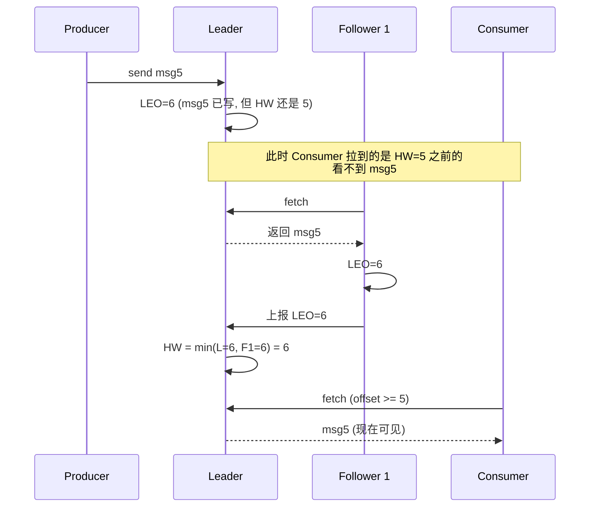

**HW 保证消费者只看到已被 ISR 多数副本确认的消息**。即使 Leader 挂，新 Leader 的数据 ≥ HW，消费者已读的消息不会丢。

### 3.4 Leader Epoch（修复 HW 缺陷）

老版本 Kafka 用 HW 截断 Follower 日志，**有数据丢失风险**。0.11 引入 **Leader Epoch**：

```
Epoch:  1, 1, 1, 2, 2, 3
Offset: 0, 1, 2, 3, 4, 5
```

每次 Leader 切换 epoch+1，记录在每条消息中。新 Leader 当选时不依赖 HW 截断，依赖 epoch 边界。

避免某些 corner case 下的数据不一致。**3.0+ 默认开启**。

## 四、Leader 选举

### 4.1 Controller

集群中**一个 Broker 担任 Controller**：
- 管理 partition leader 选举
- 处理 broker 上下线
- 通知其他 broker 元数据变更

Controller 自身用 ZK（或 KRaft）选举：

#### ZK 模式
所有 broker 抢 ZK 的 `/controller` 临时节点，抢到的就是 Controller。

#### KRaft 模式
专用的 Controller Quorum（3 或 5 个），用 Raft 选 Active Controller。

### 4.2 Partition Leader 选举

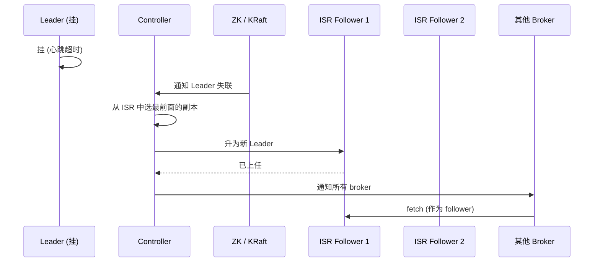

**选举规则**（默认）：
- 从 **ISR** 中选择
- ISR 中**第一个存活**的副本（按 AR 顺序）
- 不要求 LEO 最大（因为 ISR 内 LEO 差距很小）

### 4.3 unclean.leader.election

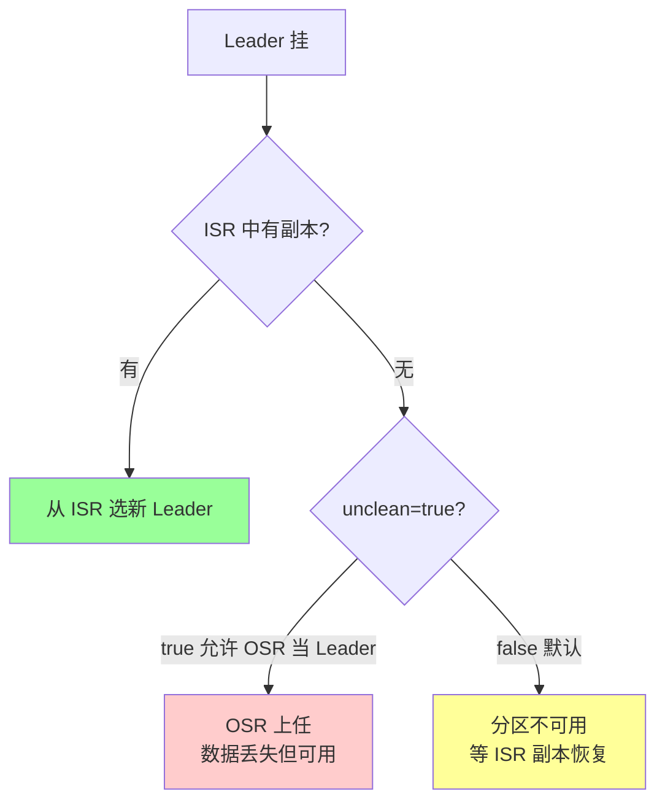

**生产推荐 false**：宁可短暂不可用，也不丢数据。

代价：所有 ISR 副本都挂时，分区彻底不可用直到至少 1 个 ISR 副本恢复。

### 4.4 选举时间

- 心跳检测：默认 6s（`replica.lag.time.max.ms`）
- Controller 处理：1 秒级
- 总恢复时间：约 10~20 秒

KRaft 模式下更快（去 ZK 依赖）。

## 五、故障转移流程

### 5.1 完整流程

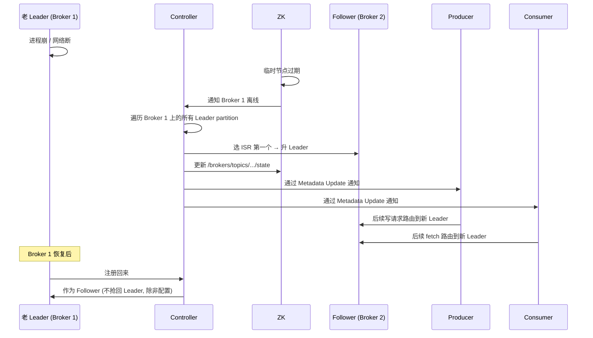

### 5.2 自动 Leader 平衡

集群运行久了，Leader 可能集中在少数 Broker（不均衡）。

```
auto.leader.rebalance.enable=true
leader.imbalance.check.interval.seconds=300
leader.imbalance.per.broker.percentage=10
```

定期把 Leader **优先副本**（preferred replica）选为 Leader，重新平衡。

或手动：

```bash
kafka-leader-election --bootstrap-server xxx --election-type preferred --all-topics
```

### 5.3 数据一致性保证

#### 已 ack 的消息会丢吗？

`acks=all` + `min.insync.replicas=2` + `unclean=false`：
- ack 时至少 2 个副本（含 Leader）有数据
- Leader 挂时新 Leader 来自 ISR，必有数据
- **不会丢**

#### 哪些消息会丢？

- `acks=1`：Leader 挂时未复制的会丢
- `acks=0`：网络丢包就丢
- `unclean=true`：所有 ISR 都挂时 OSR 上位丢数据
- `min.insync.replicas=1`：ISR 缩到 1 时退化为 acks=1

## 六、Broker 上下线

### 6.1 优雅下线

```bash
# 关闭前先转移 Leader
kafka-server-stop.sh    # 内部会触发 controlled shutdown
```

`controlled.shutdown.enable=true`（默认）：
1. 通知 Controller 准备下线
2. Controller 把该 Broker 上的 Leader 都转移到其他副本
3. 再关闭进程

避免下线瞬间所有 Leader 失效（短暂不可用）。

### 6.2 上线

新 Broker 启动：
1. 注册到 ZK / KRaft
2. Controller 通知其他 Broker
3. 作为 Follower 开始拉取数据
4. 追上后加入 ISR
5. 可能被选为 Leader（preferred replica election）

## 七、副本同步详解

### 7.1 Pull 模式

Follower **主动 pull** Leader（不是 Leader push）：

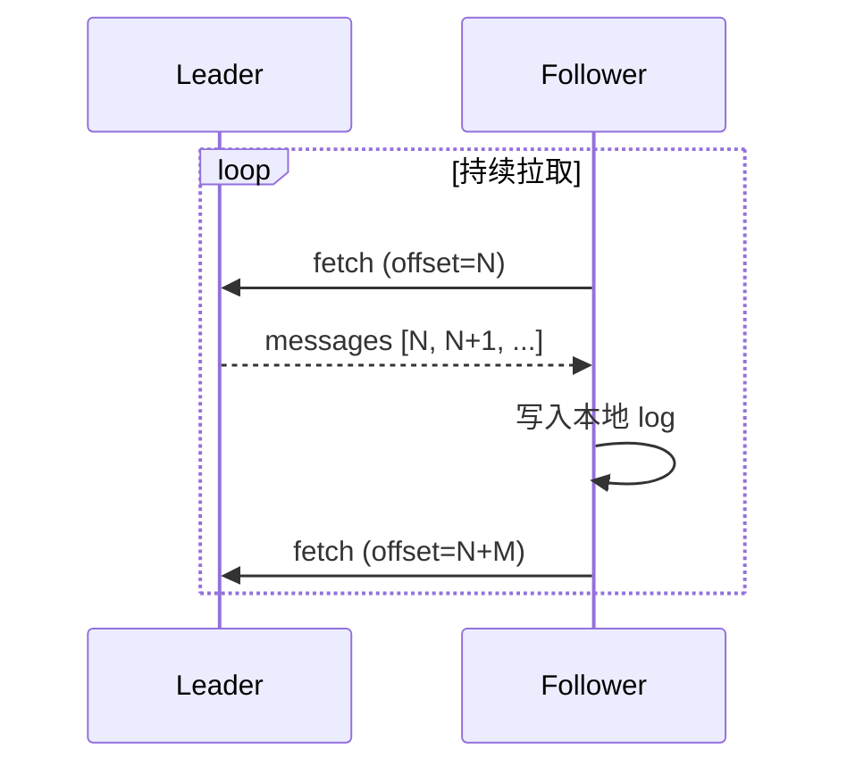

**为什么 Pull 不 Push**：
- Push 需要 Leader 知道 Follower 状态（复杂）
- Pull 让 Follower 按自己速度（不超载）
- Pull 可以批量（高吞吐）
- Consumer 也用 Pull，统一模型

### 7.2 同步与异步

Kafka 复制是**异步**的（Leader 不等 Follower）。但 `acks=all` 让 Producer **等待 ISR 全部确认**才返回，效果上是半同步。

### 7.3 副本同步的延迟

正常：几 ms
高负载：几十 ms 到秒级
故障：被踢出 ISR

监控 `kafka_log_replication_lag`。

## 八、跨数据中心高可用

### 8.1 单集群跨机房

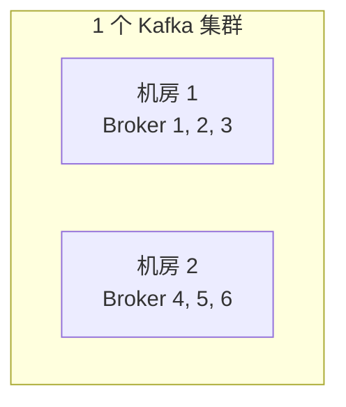

**问题**：跨机房同步延迟（几十 ms）→ ISR 频繁变化。

**适用**：同城（< 5ms 延迟）。

### 8.2 多集群 + MirrorMaker

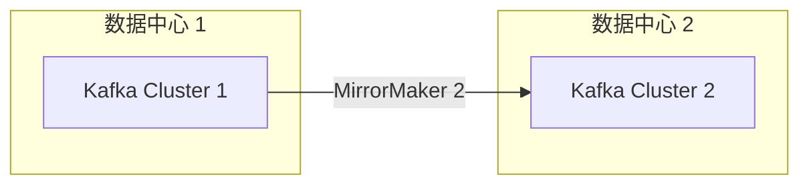

**MirrorMaker** 是 Kafka 自带的跨集群复制工具。

适用：异地灾备、跨地域。

## 九、典型坑

### 坑 1：副本数=1

`default.replication.factor=1`（默认）→ 单点，broker 挂全丢。**生产用 3**。

### 坑 2：min.insync.replicas=1

退化为 `acks=1`。**配合 acks=all 用 min.insync.replicas=2**。

### 坑 3：unclean=true 默认在某些版本

旧版默认 true，丢数据风险。**显式设 false**。

### 坑 4：ISR 频繁变化

Follower 频繁掉出 ISR：
- 网络抖动
- GC 长暂停
- 磁盘 IO 满
- `replica.lag.time.max.ms` 太小

**修复**：监控 + 调参 + 解决底层问题。

### 坑 5：所有副本在同一机架

机架交换机挂 → 所有副本不可达。**修复**：`broker.rack` 配置 + rack-aware 分配。

### 坑 6：Controller 挂导致选举慢

ZK 模式下 Controller 挂 → 新 Controller 重新加载所有元数据 → 大集群可能几分钟。

**修复**：用 KRaft（更快）。

### 坑 7：Broker 强杀（kill -9）不优雅

直接 kill 不走 controlled shutdown → 所有 Leader 突然失效，分区短暂不可用。

**修复**：`kill -TERM` 或 `systemctl stop`，触发优雅关闭。

### 坑 8：副本同步慢导致积压

某 Follower 慢 → 长期掉出 ISR → ISR 缩水 → 风险增加。

**修复**：检查该 Follower（磁盘？网络？GC？）。

## 十、高频面试题

**Q1：Kafka 怎么实现高可用？**

3 副本 + ISR 机制 + 自动故障转移：
- **副本**：1 Leader + N Follower，分布在不同 Broker
- **ISR**：与 Leader 同步的副本集合
- **acks=all + min.insync.replicas=2**：保证写入多副本
- **Leader 挂**：从 ISR 选新 Leader
- **unclean=false**：不允许 OSR 当 Leader（保数据不丢）

**Q2：什么是 ISR？**

In-Sync Replicas，与 Leader 数据同步的副本集合（含 Leader）。

判定：`replica.lag.time.max.ms`（默认 30s）内追上 Leader 的副本在 ISR。

只有 ISR 中的副本能被选为新 Leader。

**Q3：Kafka 用 ISR 不用 Quorum 的好处？**

| | Quorum (Raft) | ISR (Kafka) |
| --- | --- | --- |
| 写要求 | 多数派确认 (N/2+1) | ISR 全部确认 (动态) |
| 容忍故障 | (N-1)/2 个 | N-1 个 (理论) |
| 慢节点影响 | 大 (要等多数) | 小 (慢节点踢出 ISR) |

ISR 灵活：慢节点踢出后不影响整体写入速度。

代价：ISR 可能缩到 1（用 `min.insync.replicas` 兜底）。

**Q4：HW 和 LEO 区别？**

- **LEO**：每个副本下一条要写的 offset（已写位置 + 1）
- **HW**：所有 ISR 的最小 LEO，**消费者只能读到 HW - 1**

HW 保证消费者只读到已被多数副本确认的消息。

**Q5：Leader 怎么选举？**

1. Controller 检测到 Leader 挂（心跳超时）
2. 从 ISR 中选**第一个存活**的副本（按 AR 顺序）
3. 通知所有 Broker 更新元数据
4. Producer / Consumer 路由到新 Leader

**生产配置**：`unclean.leader.election.enable=false`（不允许非 ISR 副本当选）。

**Q6：unclean.leader.election 是什么？**

ISR 全挂时是否允许 OSR 副本当 Leader：
- `true`：允许，**丢数据**但分区可用
- `false`：不允许，分区不可用直到 ISR 副本恢复

**生产推荐 false**（可靠性优先）。

**Q7：Controller 是什么？**

集群中一个 Broker 担任 Controller，负责：
- 管理 partition leader 选举
- 处理 Broker 上下线
- 通知集群元数据变更

ZK 模式下抢 ZK 临时节点选举；KRaft 模式下专用 Controller Quorum 用 Raft 选举。

**Q8：副本同步是 Pull 还是 Push？**

**Pull**。Follower 主动从 Leader 拉取（像消费者）。

好处：
- Follower 按自己速度，不超载
- 可以批量（高吞吐）
- 简单（Leader 不需要管理 Follower 状态）
- 与 Consumer 模型统一

**Q9：跨机房 Kafka 怎么部署？**

- **同城**（<5ms）：单集群跨机房，副本分散
- **异地**：多集群 + MirrorMaker 复制
- **混合**：同城单集群 + 异地复制

跨机房延迟会让 ISR 不稳定，慎用。

**Q10：Broker 上下线影响？**

**优雅下线**（`controlled.shutdown.enable=true`）：
1. 通知 Controller
2. 该 Broker 上的 Leader 转移到其他副本
3. 再关进程
影响：几秒不可用

**强杀**（kill -9）：所有 Leader 突然失效，partition 不可用直到选举完成（~10 秒）。

**Q11：Kafka 选举为什么不用多数派（Quorum）？**

- 多数派要等更多副本（性能差）
- 容忍故障数少（3 副本只能挂 1，要 2 个挂就不可用）
- 慢节点影响大

ISR 机制：慢节点动态踢出，不影响写入速度。代价是 ISR 可能缩到 1（用 `min.insync.replicas` 兜底）。

**Q12：怎么手动触发 Leader 平衡？**

```bash
kafka-leader-election --bootstrap-server xxx --election-type preferred --all-topics
```

或开 `auto.leader.rebalance.enable=true` 让 Kafka 定期自动平衡。

## 十一、面试加分点

- **副本数 3 是平衡**（容忍 1 个挂 + 不浪费）
- **ISR vs Quorum 的设计差异**（Kafka 灵活，多数派死板）
- `min.insync.replicas=2` 防 ISR 缩到 1
- `unclean.leader.election=false` 可靠性优先
- HW 保证消费者读已确认数据
- **Leader Epoch** 修复了 HW 老版本的数据丢失问题
- Pull 模式让 Follower 按自己速度
- Controller 是集群大脑（ZK 选 / KRaft 选）
- 优雅下线 vs 强杀的区别
- 跨机房用 MirrorMaker（不是单集群跨机房）
- 副本分布**rack-aware** 防机架级故障
