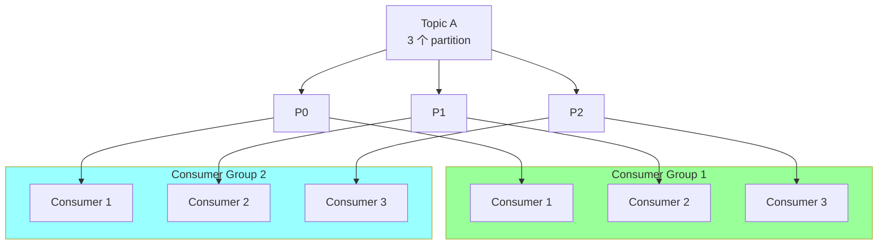
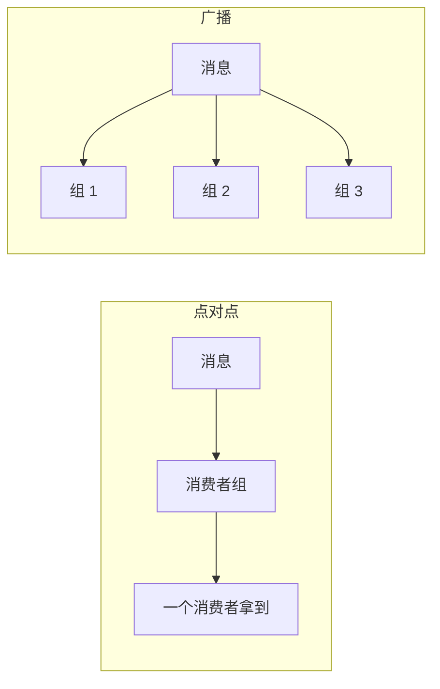
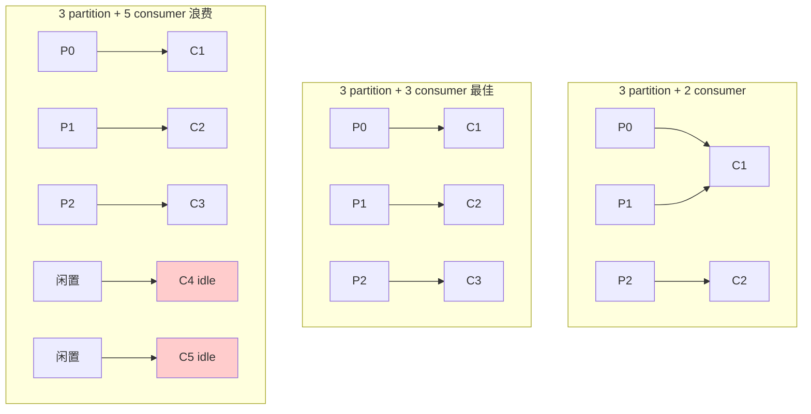
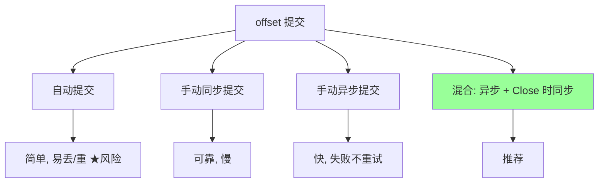
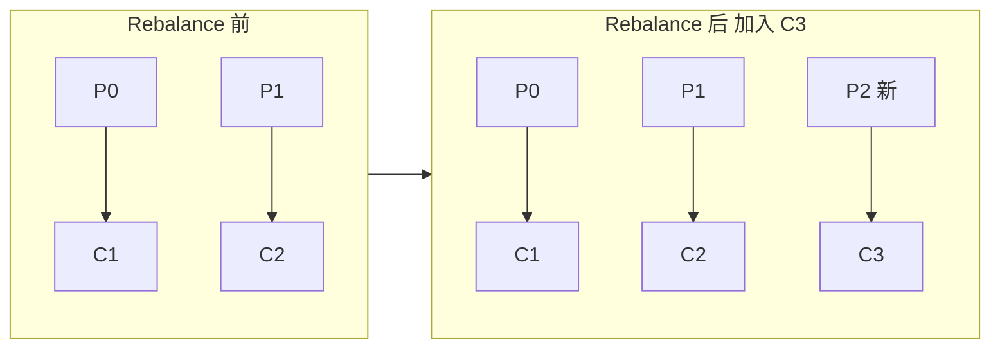
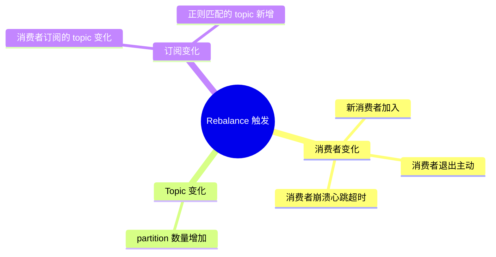
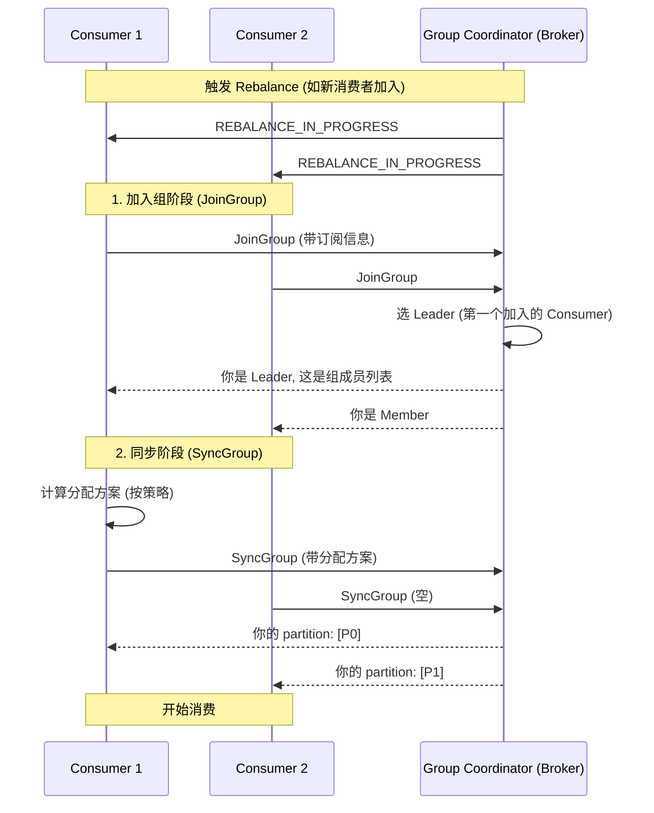
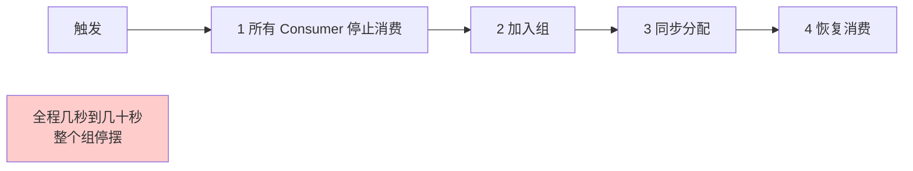

# 消息队列 · 消费者与 Rebalance

> 消费者组（点对点 + 广播）/ offset 管理 / Rebalance 触发与影响 / 分配策略 / 心跳与会话 / 消费模式

## 一、消费者组

### 1.1 核心概念



**规则**：
- 一个 partition **只能被组内一个消费者**消费（点对点）
- 不同消费者组**各自独立消费**（广播）
- 一个消费者**可以消费多个 partition**

### 1.2 消费模式

| 模式 | 实现 |
| --- | --- |
| **点对点** | 1 个消费者组 → 消息分摊给组内消费者 |
| **广播** | N 个消费者组 → 每组都收到全部消息 |



### 1.3 消费者数 vs 分区数

```
N partition + M consumer in 1 group:
- M < N: 部分 consumer 消费多个 partition
- M = N: 一一对应 (最佳)
- M > N: 多余的 consumer 闲置
```



**结论**：消费者数 ≤ 分区数。要扩展消费能力先扩分区。

## 二、offset 管理

### 2.1 offset 是什么

每个 partition 的消息有唯一 offset（从 0 递增）。Consumer 通过 commit offset 记录"消费到哪了"。

```
Partition 0: [msg0] [msg1] [msg2] [msg3] [msg4]
                                    ^
                              committed offset=3
                              下次从 offset=3 开始消费
```

### 2.2 offset 存储

#### 老版本（< 0.9）

存在 ZooKeeper。每次提交都要写 ZK，性能差。

#### 新版本（≥ 0.9）

存在 Kafka 自己的内部 topic：`__consumer_offsets`（默认 50 partition）。

```
key:   (group_id, topic, partition)
value: offset, metadata
```

### 2.3 提交方式



#### 自动提交

```
enable.auto.commit=true             # 默认
auto.commit.interval.ms=5000        # 5 秒
```

每 5s 自动提交。**风险**：
- 拉了 100 条，处理 30 条时崩 → 提交了的算消费过了 → **丢 70 条**
- 或自动提交后才处理 → 处理时崩 → **重复**

#### 手动同步

```go
consumer.CommitSync()   // 阻塞等 broker ack
```

**优点**：可靠（失败有错误返回）
**缺点**：慢，影响吞吐

#### 手动异步

```go
consumer.CommitAsync(callback)   // 不等
```

**优点**：快
**缺点**：失败不重试（可能丢提交）

#### 混合（推荐）

```go
defer consumer.CommitSync()  // 关闭前同步兜底

for {
    msgs := consumer.Poll(timeout)
    process(msgs)
    consumer.CommitAsync()   // 平时异步
}
```

### 2.4 提交时机

```go
// 错: 先提交后处理 (At-Most-Once)
consumer.CommitSync()
process(msg)  // 崩了消息丢

// 对: 先处理后提交 (At-Least-Once)
process(msg)
consumer.CommitSync()  // 崩了重复消费 → 业务幂等
```

详见 02 / 03。

### 2.5 offset 重置

新消费者组首次消费 / 已提交 offset 不存在时：

```
auto.offset.reset=latest    # 从最新开始 (默认, 跳过历史)
auto.offset.reset=earliest  # 从最早开始 (重消费所有)
auto.offset.reset=none      # 报错
```

**生产**：按业务定。容忍丢历史 → latest；要回放 → earliest。

### 2.6 手动指定 offset

```go
consumer.Seek(partition, offset)        # 跳到指定位置
consumer.SeekToBeginning(partitions)    # 从头
consumer.SeekToEnd(partitions)          # 到末尾
```

用于：消息回放、跳过损坏消息、调试。

## 三、Rebalance（重平衡）

### 3.1 什么是 Rebalance

消费者组内**重新分配 partition** 的过程。



### 3.2 触发条件



### 3.3 Rebalance 流程



### 3.4 Rebalance 的代价



**问题**：
- **整组停摆**：所有 Consumer 都不能消费
- **重复消费**：未提交 offset 的消息重新消费
- **业务延迟**：积压

### 3.5 Rebalance 协议演进

#### Eager Rebalance（旧版）

所有 Consumer **释放所有 partition** → 重新分配。简单但代价大。

#### Cooperative Rebalance（2.4+）

**增量式**：只重新分配变化的 partition，其他不变。

```
旧分配: C1=[P0,P1], C2=[P2,P3]
新增 C3:
  Eager: 全部释放, 重分 → C1=[P0], C2=[P1,P2], C3=[P3]
  Cooperative: 只释放需要的 → C1=[P0], C2=[P2,P3], C3=[P1]
```

减少不必要的 partition 暂停。

启用：

```
partition.assignment.strategy=org.apache.kafka.clients.consumer.CooperativeStickyAssignor
```

### 3.6 静态成员（Static Membership, 2.3+）

```
group.instance.id=consumer-1   # 静态 ID
```

短暂离线（如重启）**不触发 Rebalance**：
- 老版本：消费者断 → Rebalance → 消费者回来 → 又 Rebalance
- 静态：消费者断（在 session.timeout 内回来）→ 不 Rebalance

适合：消费者频繁重启 / 滚动升级场景。

## 四、心跳与会话

### 4.1 心跳机制

Consumer 后台线程定期发心跳给 Coordinator：

```
heartbeat.interval.ms=3000       # 心跳间隔 (默认 3s)
session.timeout.ms=45000         # 会话超时 (默认 45s)
```

Coordinator 在 `session.timeout.ms` 内没收到心跳 → 判定 Consumer 挂 → 触发 Rebalance。

### 4.2 max.poll.interval.ms

```
max.poll.interval.ms=300000   # 默认 5 分钟
```

两次 `poll()` 调用最大间隔。超过 → Consumer 被踢出组（业务处理太慢）。

**和 session.timeout 区别**：
- session.timeout：心跳超时（后台线程）
- max.poll.interval：业务处理超时（主线程）

### 4.3 配置建议

```
heartbeat.interval.ms=3000        # 1/3 of session.timeout
session.timeout.ms=10000           # 调小可以更快检测挂
max.poll.interval.ms=300000        # 业务处理时长上限
max.poll.records=500               # 每次拉的消息数
```

**原则**：
- session.timeout 设到能容忍的检测延迟
- max.poll.interval 至少能处理完 max.poll.records 条消息

## 五、Partition 分配策略

```
partition.assignment.strategy=...
```

### 5.1 RangeAssignor（默认）

按 topic 内 partition 范围分配：

```
Topic: orders, P0~P5
Consumer: C1, C2, C3

分配:
C1 = [P0, P1]    (前 2 个)
C2 = [P2, P3]
C3 = [P4, P5]
```

**问题**：多个 topic 时，C1 总是拿前几个 → **不均衡**。

### 5.2 RoundRobinAssignor

所有 topic 的所有 partition 排在一起，轮流分配：

```
P0 → C1, P1 → C2, P2 → C3, P3 → C1, ...
```

更均衡，但订阅 topic 不同的 consumer 不能用。

### 5.3 StickyAssignor（推荐）

尽量保持 partition 分配不变（rebalance 时变化最小），同时保证均衡。

减少 rebalance 时的 partition 移动，减少缓存失效等开销。

### 5.4 CooperativeStickyAssignor（2.4+）

Sticky + Cooperative Rebalance（增量式）。**新项目首选**。

## 六、Group Coordinator

### 6.1 概念

每个 Consumer Group 对应一个 **Group Coordinator**（某个 Broker）。

负责：
- 接收消费者心跳
- 触发和协调 Rebalance
- 存储 offset（写入 `__consumer_offsets`）

### 6.2 Coordinator 选择

```
hash(group_id) % 50 = partition_id
__consumer_offsets 的 partition_id 的 Leader 所在 Broker = Coordinator
```

通过 group_id 哈希到 `__consumer_offsets` 的某个 partition，该 partition 的 Leader 就是 Coordinator。

## 七、消费者三种模式（业务）

### 7.1 单线程消费

```go
for {
    msgs := consumer.Poll(timeout)
    for _, msg := range msgs {
        process(msg)
    }
    consumer.CommitSync()
}
```

**优点**：简单、保证顺序
**缺点**：吞吐受限

### 7.2 多线程并行（破坏顺序）

```go
for {
    msgs := consumer.Poll(timeout)
    var wg sync.WaitGroup
    for _, msg := range msgs {
        wg.Add(1)
        go func(m Message) {
            defer wg.Done()
            process(m)
        }(msg)
    }
    wg.Wait()  // 等所有处理完
    consumer.CommitSync()
}
```

**优点**：吞吐高
**缺点**：破坏顺序

### 7.3 按 key 路由到固定 worker（推荐）

```go
workers := make([]chan Message, n)
for i := 0; i < n; i++ {
    workers[i] = make(chan Message, 100)
    go func(ch <-chan Message) {
        for msg := range ch {
            process(msg)
        }
    }(workers[i])
}

for {
    msgs := consumer.Poll(timeout)
    for _, msg := range msgs {
        idx := hash(msg.Key) % n
        workers[idx] <- msg  // 同 key 同 worker, 保 key 顺序
    }
    // 等所有 worker 处理完才提交 (复杂!)
    consumer.CommitSync()
}
```

兼顾吞吐和 key 内顺序。

### 7.4 异步处理 + 异步提交（高吞吐）

```go
for {
    msgs := consumer.Poll(timeout)
    for _, msg := range msgs {
        asyncQueue <- msg  // 异步处理
    }
    // 不等异步处理完就提交 (At-Most-Once)
    consumer.CommitAsync()
}
```

**风险**：业务幂等 + 异步处理失败要兜底。

## 八、典型坑

### 坑 1：自动提交导致丢消息

```
[默认] enable.auto.commit=true 每 5s 自动提交
拉 100 条, 处理 30 条时崩 → 提交了的 100 条不再消费 → 丢 70 条
```

**修复**：手动提交。

### 坑 2：消费者数 > partition 数

多余消费者闲置浪费资源。**修复**：先扩 partition。

### 坑 3：业务处理慢导致 Rebalance

```
max.poll.interval.ms=300000   # 5 分钟
```

业务处理超过 5 分钟 → 被踢 → Rebalance → 重复消费。

**修复**：
- 减小 `max.poll.records`
- 处理改异步
- 必要时调大 `max.poll.interval`

### 坑 4：Rebalance 风暴

某个 Consumer 频繁 GC → 心跳跟不上 → 被踢 → Rebalance → 又被踢 → 循环。

**修复**：
- 优化 GC
- 调大 `session.timeout`
- 用静态成员（`group.instance.id`）

### 坑 5：手动提交但忘了

```go
for {
    msgs := consumer.Poll()
    process(msgs)
    // 没提交! → 重启会重新消费
}
```

### 坑 6：异步提交失败被忽略

```go
consumer.CommitAsync()  // 失败默默丢弃
```

**修复**：

```go
consumer.CommitAsync(func(offsets, err) {
    if err != nil { log.Errorf("commit failed: %v", err) }
})
```

### 坑 7：消费者订阅 topic 不一致

```
C1 订阅 [A]
C2 订阅 [A, B]
```

RangeAssignor / RoundRobinAssignor 不支持。**修复**：组内消费者订阅一致，或用 Sticky。

### 坑 8：消费者退出没清理

进程被 kill -9 → 没主动 leaveGroup → 等 session.timeout 才被踢 → Rebalance 延迟。

**修复**：
- 优雅退出 `consumer.Close()`
- 调小 session.timeout

### 坑 9：在 Rebalance 期间提交 offset

Rebalance 期间提交可能失败（ILLEGAL_GENERATION）。

**修复**：用 `ConsumerRebalanceListener` 在 Rebalance 前提交：

```go
listener := &RebalanceListener{
    onPartitionsRevoked: func(partitions) {
        consumer.CommitSync()  // Rebalance 前最后提交
    },
}
consumer.Subscribe(topics, listener)
```

### 坑 10：消费积压（lag 高）

监控 `consumer-lag`：未消费消息数。

**应对**：
- 增加消费者（前提：partition 够多）
- 优化处理速度
- 加 partition 提高并发上限
- 紧急情况：跳过历史 offset（重置到 latest）

## 九、高频面试题

**Q1：什么是消费者组？**

多个 Consumer 组成一个 Group：
- 组内：partition 分摊（点对点）
- 组间：广播（每组都收到全部消息）

一个 partition **只能被组内一个 Consumer** 消费。

**Q2：消费者数和分区数关系？**

```
M consumers, N partitions:
M < N: 部分 consumer 多个 partition
M = N: 一一对应 (最佳)
M > N: 多余 consumer 闲置
```

**结论**：消费者数 ≤ 分区数。扩消费能力先扩 partition。

**Q3：offset 存哪？**

`__consumer_offsets` 内部 topic（50 partition）。
key = (group_id, topic, partition)，value = offset。

老版本（<0.9）存 ZK。

**Q4：什么是 Rebalance？什么时候触发？**

消费者组内重新分配 partition。

触发条件：
1. 新 Consumer 加入
2. Consumer 退出（主动 / 心跳超时 / 处理超时）
3. Topic partition 数量变化
4. 订阅 topic 变化

**Q5：Rebalance 的影响？**

- **整组停摆**（几秒到几十秒）
- **重复消费**（未提交 offset 的消息）
- **业务延迟**

**减少影响**：
- 用 `CooperativeStickyAssignor`（增量式）
- 用静态成员（`group.instance.id`）
- 调优心跳和处理时长

**Q6：Cooperative Rebalance 是什么？**

老版本（Eager）：所有 Consumer **释放全部 partition** → 重分配。

Cooperative（2.4+）：**增量式**只移动变化的 partition，其他不变。

减少 partition 暂停时间和缓存失效。

**Q7：static membership 是什么？**

```
group.instance.id=consumer-1
```

赋予 Consumer 固定 ID。短暂离线（session.timeout 内回来）**不触发 Rebalance**。

适合频繁重启 / 滚动升级。

**Q8：partition 分配策略有哪些？**

| 策略 | 特点 |
| --- | --- |
| Range（默认） | 按 topic 范围分，多 topic 时不均衡 |
| RoundRobin | 全部 partition 轮询，要求订阅一致 |
| **Sticky** | 尽量保持原分配，rebalance 移动最少 |
| **CooperativeSticky** | Sticky + Cooperative，**推荐** |

**Q9：心跳机制？**

```
heartbeat.interval.ms=3000   # 心跳间隔
session.timeout.ms=45000     # 多久没心跳判挂
max.poll.interval.ms=300000  # 两次 poll 最大间隔
```

session.timeout 是后台心跳线程，max.poll.interval 是业务处理超时。

**Q10：怎么手动指定 offset？**

```go
consumer.Seek(partition, offset)
consumer.SeekToBeginning(partitions)
consumer.SeekToEnd(partitions)
```

用于回放、跳过损坏消息、调试。

**Q11：消费积压怎么处理？**

监控 `consumer_lag`：

应对：
- **临时**：增加 Consumer 实例（前提 partition 够）
- **优化**：处理逻辑改异步 / 批量
- **扩容**：加 partition（一次性）
- **紧急**：跳过历史（reset offset 到 latest）

**Q12：消费者组 Coordinator 怎么选？**

```
hash(group_id) % __consumer_offsets.partitions = partition_id
该 partition 的 Leader Broker = Coordinator
```

通过 group_id 哈希到 `__consumer_offsets` 的某 partition。

## 十、面试加分点

- 消费者数 ≤ 分区数（扩消费先扩 partition）
- offset 存 `__consumer_offsets`（不是 ZK）
- **手动提交 + 业务幂等** 是 At-Least-Once 标配
- 自动提交是 At-Most-Once 风险（默认 5s 间隔）
- Rebalance 整组停摆是最大痛点
- Cooperative Rebalance 是增量式优化
- 静态成员避免短暂离线触发 Rebalance
- CooperativeStickyAssignor 是新项目首选
- session.timeout vs max.poll.interval 区别
- 消费积压 = lag 监控核心指标
- 多线程处理破坏顺序，按 key 路由是折中方案
- Coordinator 选择基于 group_id 哈希到 `__consumer_offsets`
