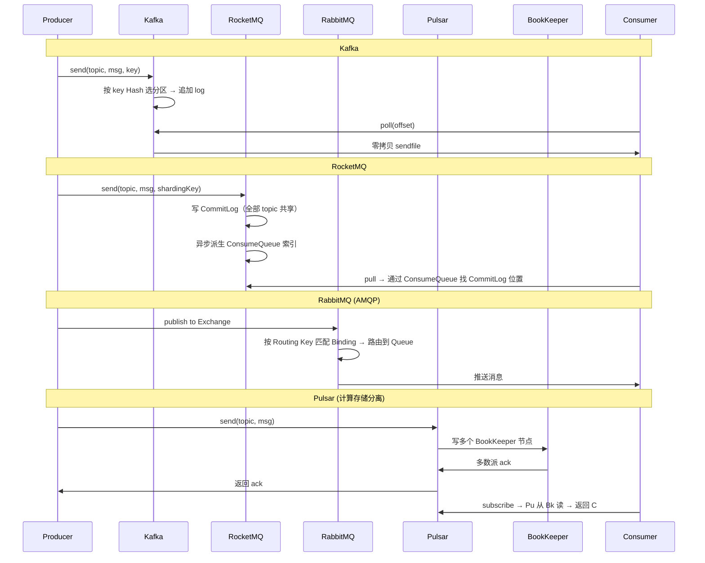
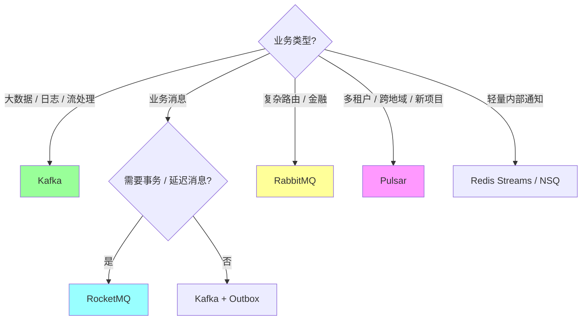
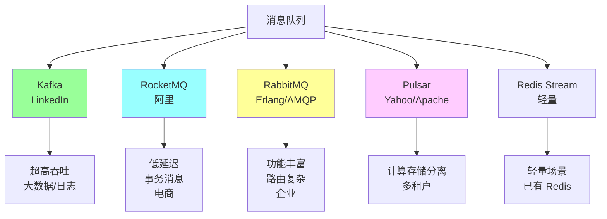
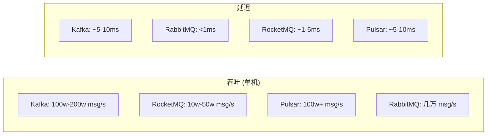
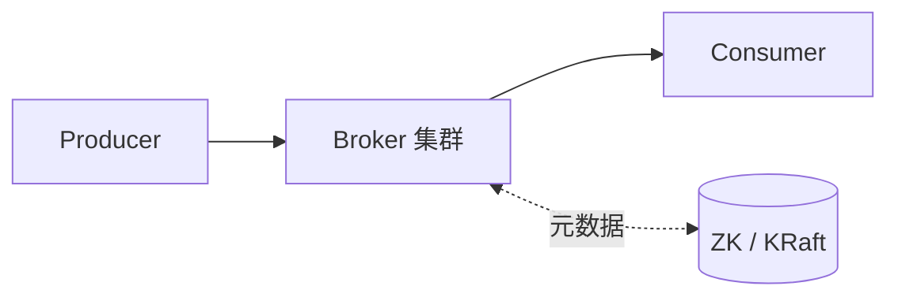
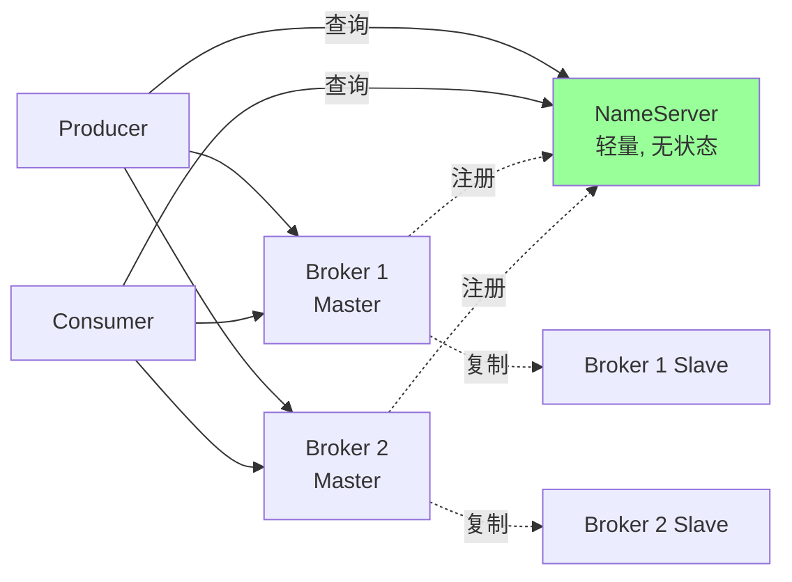
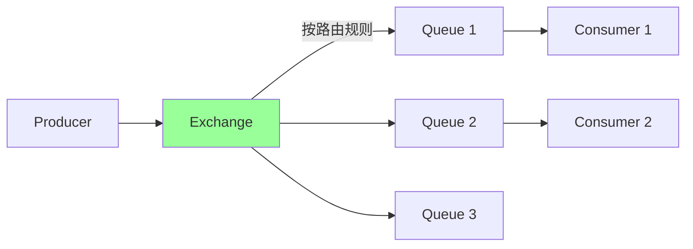
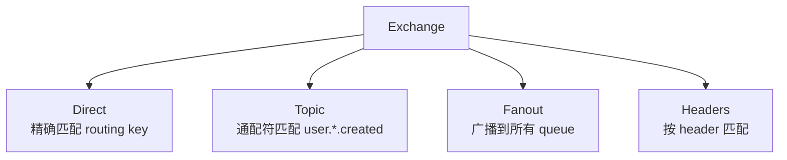
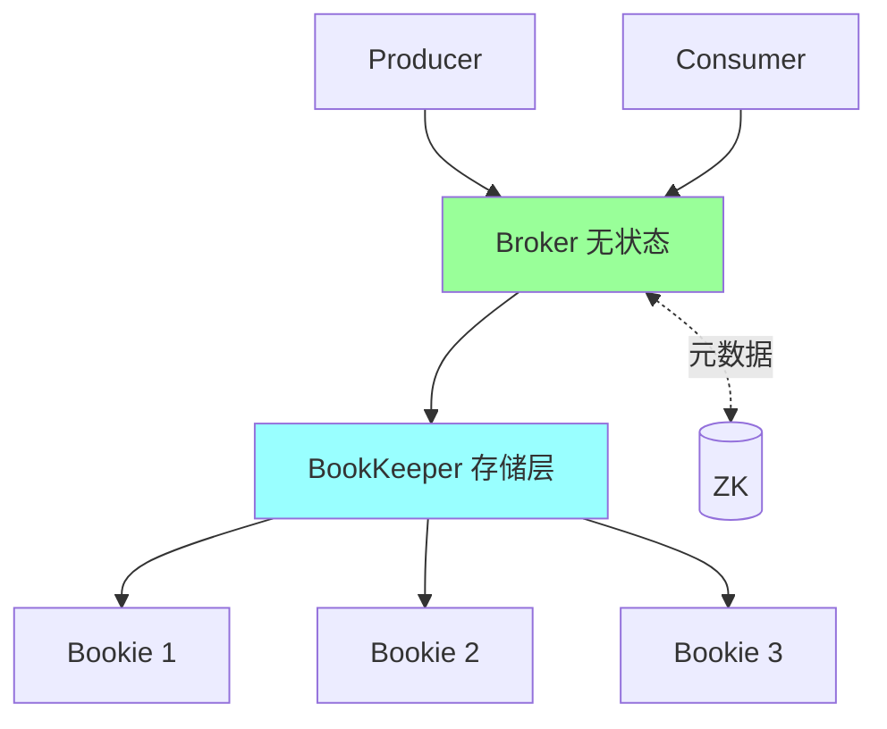
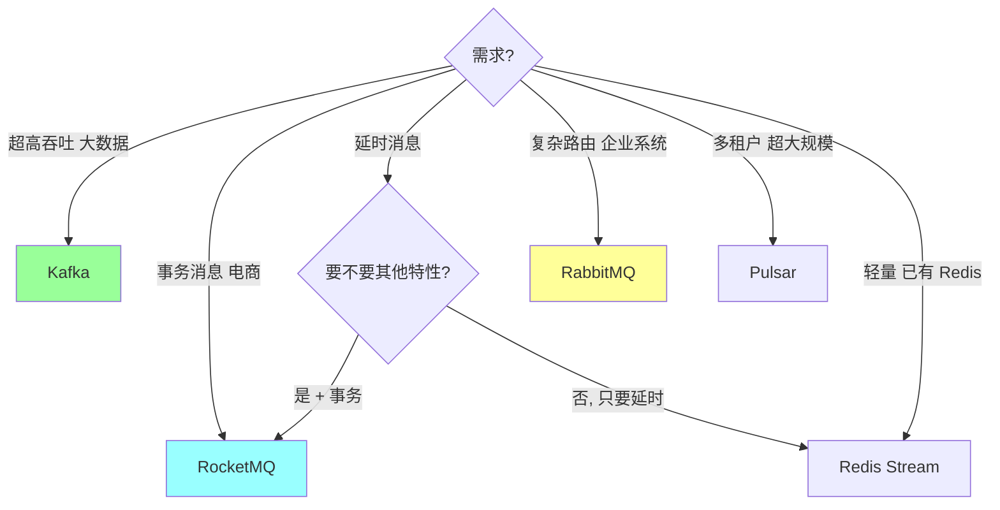

# 消息队列 · 选型对比

> Kafka / RocketMQ / RabbitMQ / Pulsar / NSQ / Redis Stream 横向对比 + 场景选型

## 〇、多概念对比：4 大主流 MQ（D 模板）

### 一句话定位

| MQ | 一句话定位 |
| --- | --- |
| **Kafka** | **大数据流处理**首选，顺序写 + 零拷贝 + 分区并行，单机 100w+ QPS，**业务消息能力弱** |
| **RocketMQ** | **业务消息**首选，**事务消息 + 延迟消息 + 顺序消息**原生支持，阿里出品 |
| **RabbitMQ** | **复杂路由**首选，AMQP 协议 + Exchange + Binding，老牌可靠，**吞吐中等（万级）** |
| **Pulsar** | **多租户 + 跨地域**首选，计算存储分离（Broker + BookKeeper），**新秀**，运维复杂 |

### 多维度对比（17 维度，必背）

| 维度 | Kafka | RocketMQ | RabbitMQ | Pulsar |
| --- | --- | --- | --- | --- |
| **出品方** | LinkedIn → Apache | 阿里 → Apache | Pivotal（VMware）| StreamNative → Apache |
| **协议** | 自定义二进制 | 自定义 | **AMQP 0.9.1**（标准）| 自定义二进制 |
| **架构** | Broker 集群（KRaft / ZK）| NameServer + Broker | Broker（Erlang）| Broker + BookKeeper（计算存储分离）|
| **单机吞吐** | **100w+ QPS / 600MB+** | 10w QPS | 万级 QPS | 80w+ QPS |
| **延迟** | ms 级 | ms 级 | **μs 级（最低）** | ms 级 |
| **顺序保证** | 分区级 | 分区级 + Sharding Key | 队列级 | 分区级 |
| **事务消息** | 跨分区事务（EOS）| ✅ **原生 Half + 回查** | 弱（AMQP tx 性能差）| 支持 |
| **延迟消息** | ❌ 需扩展 | ✅ **18 级 / 5.x 任意精确** | 插件 | 原生 |
| **持久化** | 强（日志文件）| 强（CommitLog）| 中 | 强（BookKeeper）|
| **消息回溯** | **强（按 offset / 时间戳）** | 支持 | 弱 | 支持 |
| **多租户** | 弱 | 中 | 中 | ✅ **强（Namespace）** |
| **跨地域复制** | MirrorMaker（外挂）| DLedger / Replicator | Federation 插件 | ✅ **原生 Geo-Replication** |
| **运维复杂度** | 中（ZK / KRaft）| 中 | 低 | **高（两层架构）** |
| **生态成熟度** | **极强**（Flink/Spark/Connect）| 阿里业务强 | 老牌广泛 | 后起新秀 |
| **国内活跃度** | 中 | **极高** | 中（金融）| 增长中 |
| **客户端 Go 支持** | kafka-go / sarama | rocketmq-client-go | streadway/amqp | pulsar-client-go |
| **代表用户** | LinkedIn / 字节 / Uber | 阿里 / 美团 / 滴滴 | 金融 / 老牌业务 | 腾讯 / Yahoo |

### 协作时序对比（同一消息发送 → 消费）



### 职责分层架构对比

```
Kafka（存储计算耦合）:
  Producer/Consumer
       ↓
  Broker 集群（每 broker 既存日志又处理请求）
       ↓
  ZooKeeper / KRaft（元数据）

RocketMQ（NameServer 路由）:
  Producer/Consumer
       ↓
  NameServer（轻量路由，不存数据）
       ↓
  Broker 集群（CommitLog + Queue）

Pulsar（计算存储分离 - 关键创新）:
  Producer/Consumer
       ↓
  Broker 层（无状态计算 - 不存数据）
       ↓
  BookKeeper 层（分布式存储 - Ledger 多副本）

  优势: Broker 重启不影响数据，扩展容易
  代价: 两层都要运维，复杂度高
```

### 缺一不可分析（每个 MQ 不可替代的场景）

| 假设 | 后果 |
| --- | --- |
| **没 Kafka** | 大数据流 / 日志收集没合适方案（吞吐百万 + 长期保存 + 重放）|
| **没 RocketMQ** | 业务事务消息要自实现 Outbox，延迟消息要外挂方案 |
| **没 RabbitMQ** | 金融复杂路由（fanout/topic/direct/headers）失去优雅方案 |
| **没 Pulsar** | 多租户 SaaS + 跨地域容灾失去最佳实践 |

### 性能数据（生产参考）

```
Kafka:     单 Broker 600 MB/s 吞吐 / 100w+ QPS（小消息）/ P99 50-100ms（acks=all）
RocketMQ:  单 Broker 200 MB/s / 10w QPS / P99 10-50ms
RabbitMQ:  单 Broker 10 MB/s / 1-5w QPS / P99 < 1ms（最低延迟）
Pulsar:    单 Broker 500 MB/s / 80w+ QPS / P99 5-20ms
```

### 怎么选（场景决策树）



**实战推荐表**：

| 场景 | 首选 | 备选 |
| --- | --- | --- |
| 用户行为日志 / 监控指标 | **Kafka** | Pulsar |
| 电商订单 / 支付 / 业务消息 | **RocketMQ** | Kafka + Outbox |
| 金融交易复杂路由 | **RabbitMQ** | RocketMQ |
| SaaS 多租户 | **Pulsar** | RocketMQ |
| 跨地域多活 | **Pulsar** | RocketMQ DLedger |
| 缓存失效广播 | **Redis Pub/Sub** | Kafka（重）|
| 轻量任务队列 | **Redis Streams** / NSQ | RabbitMQ |
| 数据同步 / CDC | **Kafka** + Canal/Debezium | Pulsar |

### 反模式（生产不要踩）

```
❌ Kafka 用于业务事务消息 → 复杂（需自实现 Outbox）
❌ Kafka 用于延迟消息 → 不原生（需外挂 / 时间轮）
❌ RabbitMQ 用于大数据流 → 吞吐撑不住（万级 vs 百万级）
❌ RocketMQ 用于全球流处理 → 生态弱（Flink / Spark 集成差）
❌ Pulsar 用于小团队 / 简单业务 → 运维复杂度太高
❌ Redis Pub/Sub 用于关键业务 → 不持久化，订阅者断开消息丢
```

### 一句话总结（D 模板专属）

> 4 大 MQ 的核心选型是 **"业务特征决定，没有最好只有最合适"**：
> **Kafka 大数据**（吞吐百万 + 顺序写 + 零拷贝 + 重放强）+ **RocketMQ 业务**（事务 + 延迟 + 顺序原生）+ **RabbitMQ 路由**（AMQP 复杂路由 + 低延迟）+ **Pulsar 多租户跨地域**（计算存储分离）。
> **缺一不可**：Kafka 替代不了 RocketMQ 的事务消息，RabbitMQ 替代不了 Kafka 的百万吞吐，Pulsar 替代不了 Kafka 的生态。
> **国内现状**：80% 互联网用 Kafka + RocketMQ 组合（Kafka 数据流 + RocketMQ 业务）。

---

## 一、五大主流 MQ 速览



## 二、核心维度对比

### 2.1 总览表

| 维度 | Kafka | RocketMQ | RabbitMQ | Pulsar |
| --- | --- | --- | --- | --- |
| **语言** | Scala/Java | Java | Erlang | Java |
| **协议** | 自研 | 自研（兼容部分 JMS） | AMQP / MQTT / STOMP | 自研 + Kafka 兼容 |
| **吞吐** | **极高** 100w+/s | 高 10w+/s | 中 几万/s | 极高 |
| **延迟** | ms 级 | **ms 级（更稳）** | μs~ms 级 | ms 级 |
| **持久化** | 磁盘（顺序写） | 磁盘 | 磁盘可选 | 磁盘 |
| **顺序消息** | 分区内 | 全局可（牺牲性能）| Queue 内 | 分区内 |
| **事务消息** | 支持（2PC） | **支持（半消息）★** | 弱支持 | 支持 |
| **延时消息** | 不直接支持 | **支持（18 级）** | 插件 | 支持 |
| **死信队列** | 自实现 | 内置 | 内置 | 内置 |
| **消息回溯** | offset 任意位置 | offset / 时间戳 | 不直接支持 | 支持 |
| **多副本** | ISR | DLedger（Raft） | 镜像队列 | BookKeeper |
| **协调** | ZK / KRaft | NameServer（轻量） | 集群内置 | ZK |
| **路由** | 简单（Topic-Partition） | 简单 | **强大（Exchange）** | Topic |
| **消费模式** | 拉 | 拉 + 长轮询 | 推（推荐）/ 拉 | 拉 + 推 |
| **存储模型** | 每 partition 独立日志 | CommitLog 共用 | 队列独立 | 计算存储分离（BookKeeper） |
| **集群规模** | 几百到几千 | 几百 | 几十 | 几千 |
| **社区/生态** | **极活跃** | 活跃（国内） | 活跃 | 增长中 |
| **典型用户** | LinkedIn / Netflix / Uber | 阿里 / 国内大厂 | 银行 / 企业 | Yahoo / Tencent |

### 2.2 性能对比



**经验值**（实际取决于消息大小、副本、压缩等）：
- **吞吐**：Kafka ≈ Pulsar > RocketMQ > RabbitMQ
- **延迟**：RabbitMQ < RocketMQ < Kafka ≈ Pulsar
- **稳定性**：Kafka, RocketMQ 在国内大量验证

## 三、Kafka

### 3.1 架构

详见 `01-architecture.md`。



### 3.2 优势

- **吞吐冠军**（顺序写 + 零拷贝 + PageCache）
- **生态最强**（Spark / Flink / Kafka Connect / Streams）
- **大规模验证**（LinkedIn 处理万亿级消息）
- **简单**：Topic-Partition 模型清晰

### 3.3 劣势

- **延迟略高**（ms 级，对比 RabbitMQ μs 级）
- **延时消息不直接支持**（要业务实现）
- **事务有但复杂**
- **运维**：ZK 时代复杂（KRaft 改善）

### 3.4 适用

- **大数据 / 日志收集**（ELK 中间件）
- **流式计算**（Flink + Kafka）
- **超高吞吐**（>10w QPS）
- **数据管道**（Kafka Connect）
- **事件溯源**

## 四、RocketMQ

### 4.1 架构



### 4.2 特色

- **NameServer**：轻量元数据服务（替代 ZK）
- **CommitLog**：所有 Topic 消息写一个 log（顺序写更极致）
- **ConsumeQueue**：每个 Topic-Queue 一个索引
- **半消息（事务）**：业内最经典实现
- **延时消息**：18 个级别（1s~2h）开箱即用

### 4.3 优势

- **国内大厂背书**（阿里双 11 千亿级消息）
- **事务消息成熟**（半消息 + 回查）
- **延时消息开箱**
- **低延迟稳定**
- **运维比 Kafka 简单**（NameServer 比 ZK 轻）

### 4.4 劣势

- **吞吐不如 Kafka**（10w vs 100w 量级）
- **国际生态不如 Kafka**
- **Kafka 兼容工具多**

### 4.5 适用

- **电商订单**（事务消息）
- **金融交易**（低延迟可靠）
- **延时业务**（超时关单、定时通知）
- **国内项目**（中文文档、国内社区）

## 五、RabbitMQ

### 5.1 架构



### 5.2 Exchange 类型



**RabbitMQ 强大的路由能力**：
- 复杂路由规则
- 一对多、多对一、星型、广播 都支持
- 适合企业级复杂场景

### 5.3 优势

- **协议标准**（AMQP 0.9.1）
- **路由灵活**（Exchange 多种类型）
- **延迟低**（μs 级）
- **管理界面友好**
- **多语言支持完善**

### 5.4 劣势

- **吞吐受限**（Erlang 单机几万 QPS）
- **持久化性能差**
- **集群扩展性弱**（不适合大规模）
- **顺序消息只在 queue 内**

### 5.5 适用

- **传统企业**（银行、保险）
- **复杂路由**（多 Exchange / 多 Queue）
- **低吞吐 + 低延迟**
- **遗留系统对接**（AMQP）

## 六、Pulsar

### 6.1 架构（计算存储分离）



**核心创新**：
- **Broker 无状态**：只处理消息分发，不持久化
- **BookKeeper 存储**：分布式日志存储（条带化）
- **元数据**：ZooKeeper

**优势**：
- 扩容只加 Broker 或 Bookie，不需要 rebalance（vs Kafka）
- 多租户原生支持
- 计算和存储独立扩展

### 6.2 特色

- **多租户**：tenant / namespace / topic 三层
- **跨地域复制**（Geo-Replication）
- **分层存储**：热数据 SSD + 冷数据 S3
- **Kafka 兼容**（Kafka-on-Pulsar）

### 6.3 劣势

- **架构复杂**（3 个组件 ZK + Broker + BookKeeper）
- **运维门槛高**
- **国内生态弱于 Kafka / RocketMQ**

### 6.4 适用

- **多租户 SaaS**
- **超大规模 + 频繁扩缩容**
- **跨地域复制**
- **冷热数据分离**

## 七、其他 MQ

### 7.1 NSQ

- Go 实现
- 简单分布式
- 适合中小规模、Go 生态

### 7.2 Kafka Streams / KSQL

不是 MQ，是 Kafka 之上的流计算。

### 7.3 Redis Stream（5.0+）

详见 `04-redis/02-data-structures.md`。

- 轻量级 MQ
- 适合：已有 Redis、不想引入新组件、消息量中等

vs 真正 MQ：
- **优点**：复用 Redis、低延迟
- **缺点**：内存限制、不适合超大规模

### 7.4 NATS

- Go 实现
- 极致低延迟
- 默认不持久化（JetStream 后支持）

## 八、选型决策



### 实战决策

#### 互联网 + 大数据 → Kafka
- 日志、流式数据
- 全球化，生态强
- 例：LinkedIn / Netflix / Uber

#### 国内电商 → RocketMQ
- 事务消息成熟
- 延时消息开箱
- 双 11 验证
- 例：阿里 / 京东 / 美团

#### 企业 / 银行 → RabbitMQ
- 复杂路由
- AMQP 标准
- 低吞吐高可靠
- 例：银行核心系统

#### 多租户 SaaS → Pulsar
- 原生多租户
- 计算存储分离
- 例：腾讯 / Yahoo

#### 小项目 / 轻量 → Redis Stream / NSQ
- 不想多组件
- 中小规模

## 九、典型场景对比

### 9.1 日志收集

**Kafka 一统天下**。
原因：超高吞吐、生态完善（ELK、Filebeat、Flink）、流式处理。

### 9.2 订单 / 支付（事务）

**RocketMQ 首选**（半消息）。
Kafka 也行（事务 API）但实现复杂。

### 9.3 延时任务

**RocketMQ**（18 级开箱）或 **Redis ZSet**（轻量）。
Kafka 不直接支持，业务实现复杂。

### 9.4 IM / 推送

**RabbitMQ**（低延迟、路由灵活）或 **Kafka**（大规模）。

### 9.5 微服务事件总线

**Kafka**（事件溯源、回放）或 **RocketMQ**（事务可靠）。

### 9.6 流计算

**Kafka**（Flink / Spark / Streams 集成最好）。

## 十、迁移与共存

### 10.1 Kafka → RocketMQ / 反之

成本高（API 不兼容、客户端重写）。
中间方案：用 **Kafka Connect** 或 **MirrorMaker** 跨集群复制。

### 10.2 多 MQ 共存

大公司常见：
- Kafka 做数据管道 + 流计算
- RocketMQ 做业务事务消息
- RabbitMQ 处理传统业务

## 十一、典型坑

### 坑 1：盲目跟风用 Kafka

业务只有 1000 QPS、需要事务消息 → Kafka 不是最佳。**RocketMQ** 更合适。

### 坑 2：用 RabbitMQ 做大数据

吞吐撑不住 → 死循环优化。**改 Kafka**。

### 坑 3：用 Kafka 实现延时消息

实现复杂（要单独 topic、扫描）。**用 RocketMQ** 或 **Redis ZSet**。

### 坑 4：评估时只看吞吐

也要看：
- 延迟稳定性
- 运维复杂度
- 团队熟悉度
- 生态工具
- 社区活跃度

### 坑 5：低估运维

Kafka 的 ZK + Broker，Pulsar 的 ZK + Broker + BookKeeper → 运维成本高。
小团队选 RocketMQ / RabbitMQ 简单。

### 坑 6：迁移代价

不同 MQ API / 模型差异大，迁移要重写客户端 + 数据迁移。
**初期就选对**，避免后期切换。

## 十二、高频面试题

**Q1：Kafka 和 RocketMQ 怎么选？**

| 维度 | Kafka | RocketMQ |
| --- | --- | --- |
| 吞吐 | 极高 | 高 |
| 事务消息 | 支持但复杂 | **半消息成熟** |
| 延时消息 | 不直接支持 | **18 级开箱** |
| 国内生态 | 中 | **强** |
| 国际生态 | 强 | 中 |

**总结**：
- 大数据 / 日志：Kafka
- 国内电商 / 事务：RocketMQ

**Q2：Kafka 和 RabbitMQ 区别？**

| | Kafka | RabbitMQ |
| --- | --- | --- |
| 模型 | Topic-Partition | Exchange-Queue |
| 路由 | 简单 | **复杂强大** |
| 吞吐 | 极高 | 中 |
| 延迟 | ms | μs |
| 持久化 | 默认强 | 可选 |

**Kafka 大数据，RabbitMQ 企业级路由**。

**Q3：为什么 Kafka 比 RabbitMQ 快？**

- 顺序写 + PageCache + 零拷贝
- 批量 + 压缩
- 分区并行
- 没有复杂路由逻辑

详见 `01-architecture.md`。

**Q4：RocketMQ 的事务消息怎么实现？**

**半消息 + 回查**：

```
1. Producer 发半消息 (broker 暂存, consumer 不可见)
2. 执行本地事务
3. 提交/回滚:
   - commit → 半消息可见
   - rollback → 半消息删除
4. 未知 (App 崩):
   - Broker 定时回查 → checkLocalTx → commit/rollback
```

详见 `06-distributed/03-transaction.md`。

**Q5：Kafka 的 Exactly-Once 怎么实现？**

3 种方式：
1. **幂等 Producer**：`enable.idempotence=true`
2. **Kafka 事务**：`producer.transactional.id`
3. **业务幂等**：At-Least-Once + 去重表 / 状态机

实战 99% 用第 3 种。

**Q6：Pulsar 的优势？**

- **计算存储分离**：扩容更灵活
- **多租户原生**：tenant/namespace/topic
- **跨地域复制**
- **Kafka 兼容**

适合超大规模 + 多租户场景。

**Q7：Redis Stream 和 Kafka 区别？**

| | Redis Stream | Kafka |
| --- | --- | --- |
| 持久化 | 内存为主 | 磁盘 |
| 吞吐 | 万 QPS | 100w QPS |
| 规模 | 中小 | 超大 |
| 运维 | 已有 Redis | 独立集群 |
| 消费者组 | 支持 | 支持 |

**Stream 适合中小规模 + 已有 Redis**，Kafka 适合大规模专门场景。

**Q8：RabbitMQ 的 Exchange 类型？**

- **Direct**：精确匹配 routing key
- **Topic**：通配符（`*` / `#`）
- **Fanout**：广播
- **Headers**：按 header 匹配

灵活路由是 RabbitMQ 优势。

**Q9：什么场景用 Kafka 不合适？**

- **延时消息**：需要业务实现，复杂
- **复杂路由**：Kafka 是 Topic-Partition 简单模型
- **事务消息**：复杂（用 RocketMQ）
- **超低延迟**（< 1ms）：用 RabbitMQ
- **小规模 + 已有 Redis**：用 Stream

**Q10：怎么评估 MQ 性能？**

指标：
- **吞吐**：msg/s 和 MB/s
- **延迟**：P50 / P99
- **稳定性**：长时间压测延迟分布
- **故障恢复**：节点挂后多久恢复
- **资源**：CPU / 内存 / 磁盘 IO / 网络

工具：
- Kafka 自带 `kafka-producer-perf-test`、`kafka-consumer-perf-test`
- OpenMessaging Benchmark（标准化）

## 十三、面试加分点

- 选型不只看吞吐，要看**延迟、事务、延时、生态、运维**
- **Kafka 大数据，RocketMQ 业务事务，RabbitMQ 企业路由**
- RocketMQ 事务消息（半消息 + 回查）是国内电商标配
- Pulsar 计算存储分离是未来趋势
- Redis Stream 适合轻量场景
- 大公司常**多 MQ 共存**（不同场景用不同 MQ）
- Kafka 在国际更主流，RocketMQ 在国内更主流
- RabbitMQ 适合复杂路由（4 种 Exchange）
- 评估前先**压测自己的场景**
- 团队熟悉度也是选型因素
