# 消息队列 · 场景实战

> 削峰填谷 / 异步解耦 / 事务消息 / 延时消息 / 死信队列 / 重试 / 消息积压 / 实战架构

## 一、MQ 三大典型用途

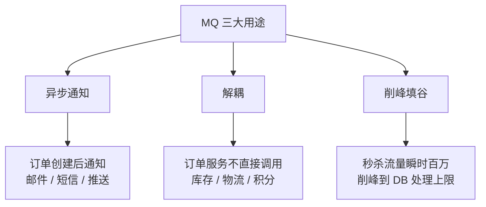

## 二、削峰填谷

### 2.1 场景

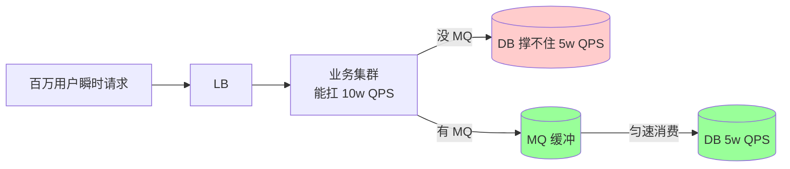

**核心**：MQ 把瞬时洪峰转换为持续平稳处理。

### 2.2 实战：秒杀

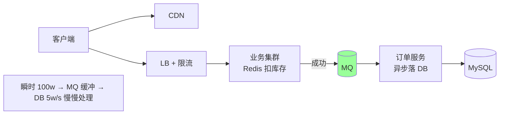

**关键**：
- 前端缓冲（Redis 库存 + Lua 扣减）
- MQ 异步化（写订单不阻塞）
- DB 按自己速度消费

详见 `04-redis/08-scenarios.md` 秒杀章节。

### 2.3 注意

- **MQ 容量**：要够大（够长时间峰值）
- **消费能力**：长期 < 平均生产速率会积压
- **业务能容忍延迟**：秒杀需要异步给用户"成功提交"反馈，真实结果稍后

## 三、异步解耦

### 3.1 场景：订单服务

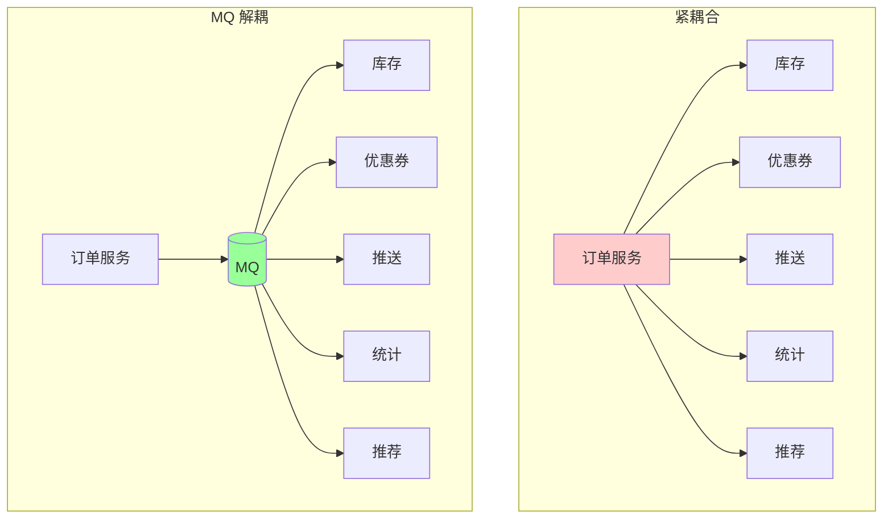

### 3.2 解耦的好处

- **订单服务不需要知道下游有谁**（订阅模型）
- **下游慢/挂不影响订单**
- **新增订阅方不用改订单代码**
- **下游可独立扩缩容**

### 3.3 代价

- **最终一致**（不再强一致）
- **业务幂等**必须（重复消费）
- **延迟**（异步处理）
- **链路复杂**（出问题更难定位）

### 3.4 适用场景

- **关键路径强一致** → 同步调用
- **非关键路径** → MQ 异步（推送、统计、推荐、日志）

## 四、事务消息

### 4.1 问题

```
update DB 成功 → 发 MQ 失败 → 业务和消息不一致
```

或：

```
发 MQ 成功 → update DB 失败 → 消息发了但业务没成功
```

### 4.2 解决方案

#### 方案 1：本地消息表（详见 `06-distributed/03-transaction.md`）

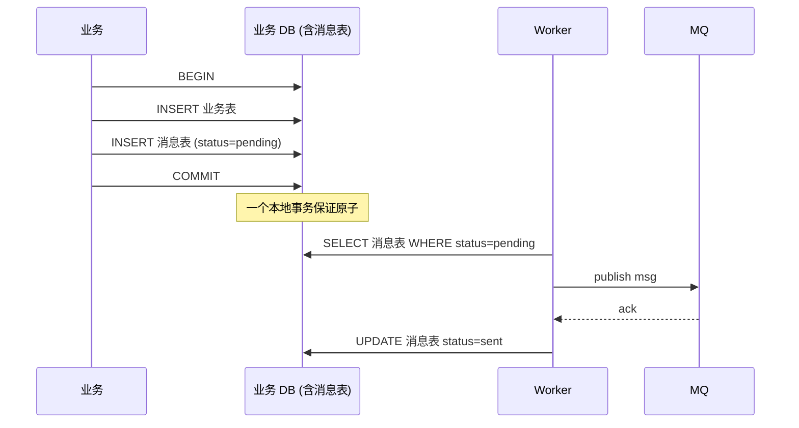

**通用方案**，不依赖特定 MQ。

#### 方案 2：RocketMQ 事务消息（半消息）

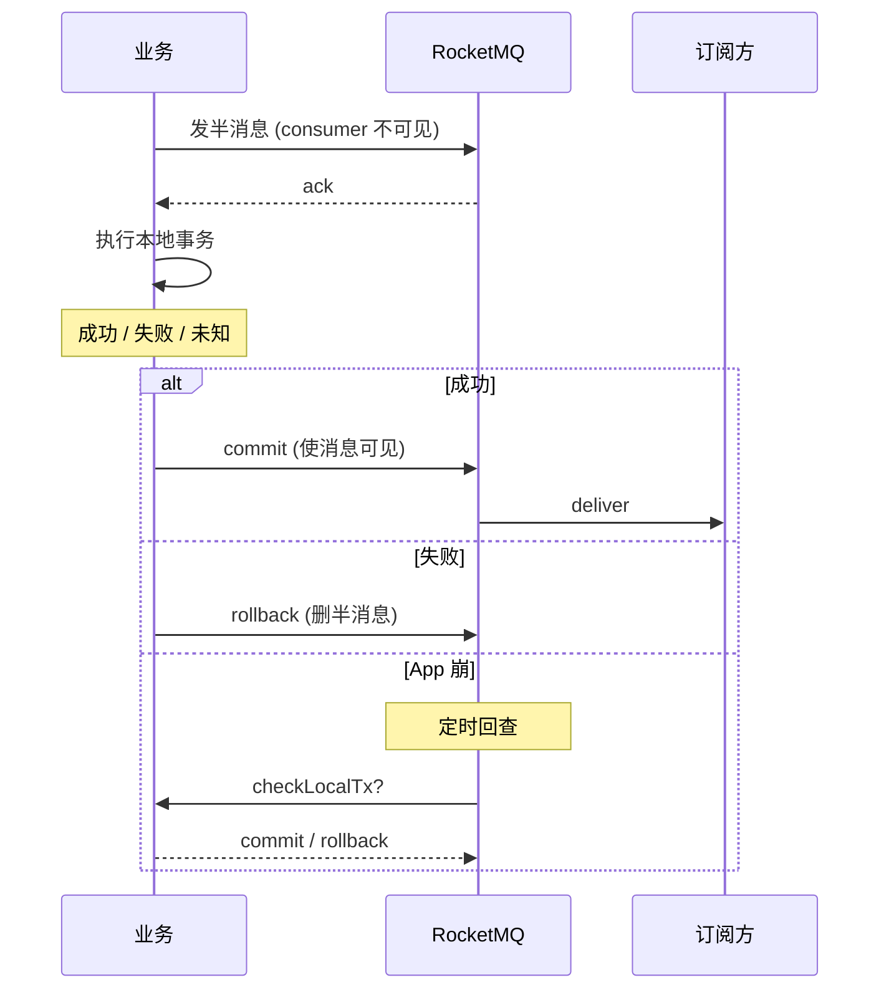

**优势**：MQ 内置，业务代码简洁。
**仅 RocketMQ 支持**。

#### 方案 3：Kafka 事务

跨多个分区原子写。详见 `03-order-and-dedup.md`。

```go
producer.InitTransactions()
producer.BeginTransaction()
producer.Send(msg1)
producer.Send(msg2)
producer.SendOffsetsToTransaction(...)
producer.CommitTransaction()
```

## 五、延时消息

### 5.1 应用场景

- 订单 30 分钟未支付自动取消
- 24 小时后提醒
- 失败任务 5 分钟后重试
- 定时通知

### 5.2 RocketMQ 延时消息（最简单）

```java
Message msg = new Message("topic", body);
msg.setDelayTimeLevel(3);  // 3 = 10s, 4 = 30s, 18 = 2h
producer.send(msg);
```

**18 个固定级别**：1s, 5s, 10s, 30s, 1m, 2m, 3m, 4m, 5m, 6m, 7m, 8m, 9m, 10m, 20m, 30m, 1h, 2h。

只能选预设级别，不能任意时间。RocketMQ 5.0 支持任意时间。

### 5.3 Kafka 实现延时（业务自实现）

Kafka **不直接支持**。常见方案：

#### 方案 1：分级 Topic

按延时长度建多个 topic：`delay_5s`, `delay_30s`, `delay_5m`, `delay_30m`, `delay_2h`...

每个 topic 一个消费者，等到时间再投递到目标 topic。

#### 方案 2：扫描 ZSet

```go
// 用 Redis ZSet 存延时任务
ZADD delay_queue <execTime> <msg>

// Worker 每秒扫描
items := ZRANGEBYSCORE delay_queue 0 now
for _, item := range items {
    ZREM delay_queue item
    kafka.Send(targetTopic, item)
}
```

详见 `04-redis/08-scenarios.md`。

#### 方案 3：DB 表

```sql
CREATE TABLE delay_tasks (
    id BIGINT,
    execute_at TIMESTAMP,
    payload TEXT,
    INDEX idx_exec (execute_at)
);

-- Worker
SELECT * FROM delay_tasks WHERE execute_at <= NOW() LIMIT 100;
```

简单可靠但 DB 压力大。

### 5.4 选型

| 方案 | 优点 | 缺点 |
| --- | --- | --- |
| RocketMQ 延时 | 开箱即用 | 仅固定级别（5.0 前） |
| Redis ZSet | 灵活 | 需要 Worker |
| DB 表 | 简单 | DB 压力 |
| 时间轮（自实现） | 高效 | 复杂 |

## 六、死信队列（DLQ）

### 6.1 概念


消费多次失败的消息进 DLQ，避免无限重试拖垮系统，同时不丢消息。

### 6.2 RabbitMQ 死信

```
x-dead-letter-exchange: 当消息死信时投递到的 exchange
x-dead-letter-routing-key: 路由 key
```

死信触发：
- 消费者 nack（reject）
- TTL 过期
- 队列满

### 6.3 RocketMQ 死信

消费失败重试 16 次（默认）→ 自动转到 `%DLQ%group_name` 死信 Topic。

可订阅死信 Topic 处理。

### 6.4 Kafka 死信（业务自实现）

```go
for _, msg := range msgs {
    if err := process(msg); err != nil {
        retryCount++
        if retryCount > 5 {
            kafka.Send("dlq_topic", msg)  // 进 DLQ
            commitOffset()
            continue
        }
        // 不提交 offset, 让消息重新消费 (可能要 sleep)
    }
}
```

或用 [Kafka Connect Dead Letter Queue](https://docs.confluent.io/platform/current/connect/concepts.html#dead-letter-queue)。

### 6.5 死信处理

死信 ≠ 丢弃，要：
- **告警**：超阈值通知运维
- **人工分析**：为什么失败？数据格式？业务 bug？
- **修复后重投**：手动从 DLQ 取出重发到正常 topic

## 七、消息重试

### 7.1 重试策略

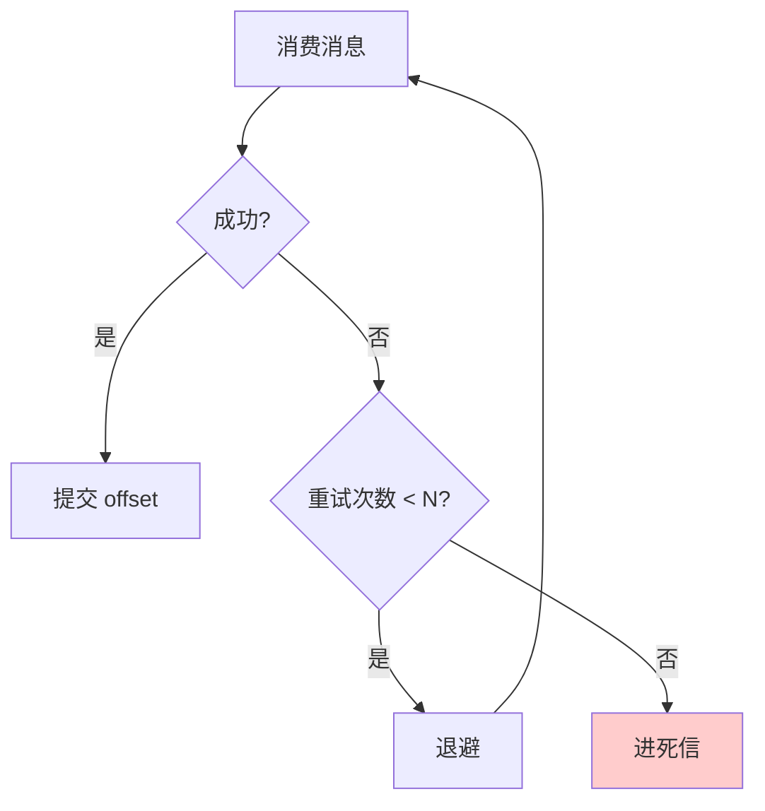

### 7.2 退避策略

```
1 次失败: 立即重试或 1s 后
2 次失败: 5s
3 次失败: 30s
...
最多 N 次后进 DLQ
```

实现：

```go
backoffs := []time.Duration{1*time.Second, 5*time.Second, 30*time.Second, 1*time.Minute, 5*time.Minute}

for retry := 0; retry < len(backoffs); retry++ {
    if err := process(msg); err == nil { break }
    if retry == len(backoffs)-1 {
        kafka.Send("dlq", msg)
        break
    }
    time.Sleep(backoffs[retry])
}
```

### 7.3 RocketMQ 重试

消费失败 return RECONSUME_LATER：

```java
public ConsumeConcurrentlyStatus consumeMessage(...) {
    if (failed) {
        return ConsumeConcurrentlyStatus.RECONSUME_LATER;
    }
    return ConsumeConcurrentlyStatus.CONSUME_SUCCESS;
}
```

RocketMQ 自动按 18 级延时重试（1s ~ 2h），16 次后进死信。

### 7.4 Kafka 重试

无内置，业务实现：
- 本地重试（带退避）
- 重试 topic（独立 topic，错开消费）
- 死信 topic

### 7.5 重试坑

#### 坑 1：无限重试

某条消息永远失败 → 阻塞所有后续消息。
**修复**：限次数 + 死信。

#### 坑 2：重试间隔太短

下游慢恢复不过来 + 重试加压 = 雪崩。
**修复**：退避（指数）。

#### 坑 3：阻塞性重试影响其他消息

```go
for _, msg := range msgs {
    for {
        if process(msg) == nil { break }
        time.Sleep(1*time.Second)  // 这条卡住, 其他消息不消费
    }
}
```

**修复**：失败的消息丢到重试 topic 或 DLQ，继续处理其他。

## 八、消息积压

### 8.1 现象

```
consumer_lag 持续升高
积压消息百万级
业务延迟越来越大
```

### 8.2 根因

- 消费速度 < 生产速度
- 消费者挂了几个
- 消费逻辑突然变慢（下游慢、bug）
- 流量突增

### 8.3 应对

#### 方案 1：紧急扩消费者

```
当前 10 个 consumer, 30 个 partition
扩到 30 个 consumer, partition 充分利用
```

**前提**：partition 数 ≥ 消费者数。partition 不够要先扩。

#### 方案 2：扩 partition（一次性）

```bash
kafka-topics --alter --partitions 100
```

⚠️ **partition 只能加不能减**。加了之后 hash key 路由可能变（非顺序敏感场景没事）。

#### 方案 3：临时跳过历史

```bash
# 重置 offset 到 latest, 跳过历史消息 (历史的不消费了)
kafka-consumer-groups --reset-offsets --to-latest --execute
```

**慎用**：会丢历史消息。仅用于"老数据没用了"场景。

#### 方案 4：业务降级

- 关闭非核心订阅方
- 降低消费复杂度（先简单处理后补）

#### 方案 5：批量消费

```
max.poll.records=1000   # 每次拉 1000 条
process(batch)           # 批量处理 (DB 批量插入)
```

### 8.4 预防

- 监控 consumer_lag（关键指标）
- 容量规划（partition + 消费者）
- 消费逻辑高效（避免锁内 IO、N+1 等）
- 业务幂等（允许暂时不消费）
- 异步处理（不阻塞 poll）

## 九、消息丢失追查

### 9.1 现象

「我发了消息但消费方没收到」

### 9.2 排查步骤

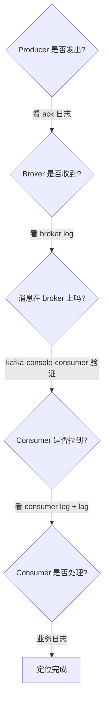

### 9.3 工具

```bash
# 看 broker 上 topic 的 offset 范围
kafka-run-class kafka.tools.GetOffsetShell --bootstrap-server xxx --topic xxx

# 直接消费（排查发送是否成功）
kafka-console-consumer --bootstrap-server xxx --topic xxx --from-beginning

# 看消费组 lag
kafka-consumer-groups --describe --group xxx

# 看 broker 日志
tail -f /var/log/kafka/server.log
```

### 9.4 定位结果

- Producer 没发出 → 业务代码 / 发送配置
- Broker 没收到 → 网络 / Broker 故障
- Consumer 没拉到 → 订阅 / 分配 / 消费组
- Consumer 拉到但没处理 → 业务代码 bug

## 十、典型架构模式

### 10.1 事件驱动架构

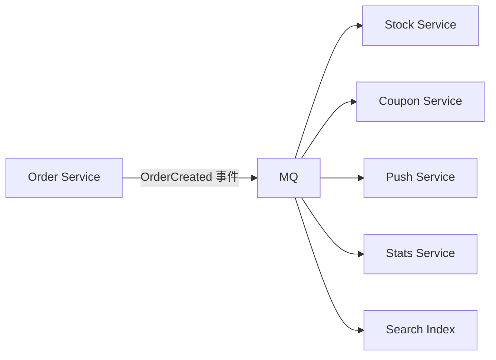

业务通过事件交互，订阅 / 发布解耦。

### 10.2 CQRS（命令查询分离）

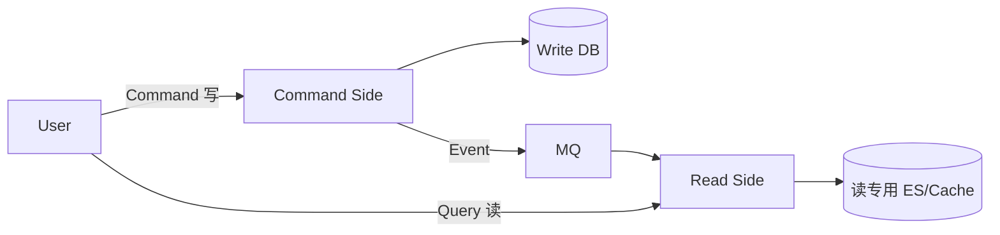

读写分离 + 异步同步。

### 10.3 Event Sourcing（事件溯源）

不存当前状态，存所有事件。当前状态 = 重放所有事件。

```
Account: balance=100
事件流:
  + AccountCreated (balance=0)
  + Deposit 50 (balance=50)
  + Deposit 30 (balance=80)
  + Deposit 20 (balance=100)
```

适合审计、回放、时光机查询。

### 10.4 数据管道

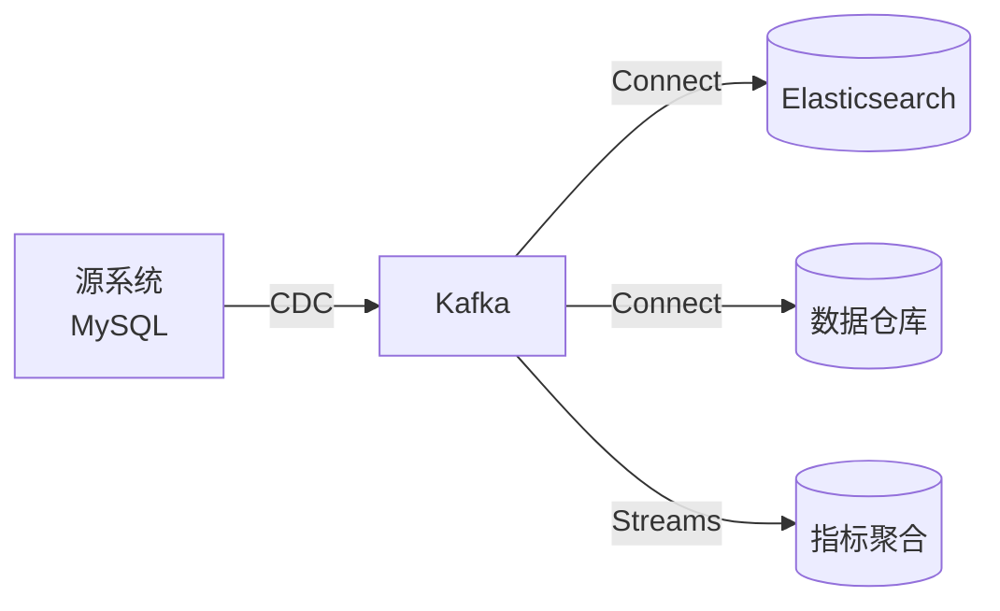

Kafka 作为数据中枢，把 OLTP 数据流向 OLAP / 搜索 / 分析。

## 十一、综合实战：订单系统

### 11.1 架构

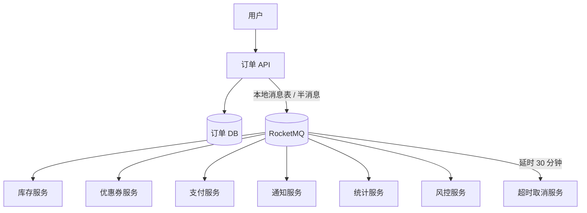

### 11.2 关键设计

| 关注点 | 方案 |
| --- | --- |
| 事务 | RocketMQ 半消息 / 本地消息表 |
| 顺序 | 同 orderID 用同 key, 同 partition |
| 不丢 | acks=all + 副本 + 手动提交 + 幂等 |
| 不重 | 业务幂等 (orderID 唯一约束 + 状态机) |
| 延时 | RocketMQ 延时消息 (30min 取消) |
| 失败 | 重试 + 死信 + 告警 |
| 监控 | lag / 错误率 / 处理时长 |

## 十二、典型坑

### 坑 1：消息发出去就不管

```go
producer.SendAsync(msg)
// 不处理 callback, 失败也不知道
```

**修复**：处理 callback 写日志 + DB 兜底。

### 坑 2：消费者处理失败但提交 offset

```go
process(msg)  // 失败
consumer.CommitSync()  // 仍然提交 → 消息丢
```

**修复**：失败不提交，进 DLQ。

### 坑 3：用 MQ 替代 RPC

业务强一致需求强行用 MQ → 复杂度爆炸 + 延迟 + 排错难。

**修复**：强一致用同步 RPC，最终一致才用 MQ。

### 坑 4：MQ 消息体太大

```
100MB 的图片直接放 message body
```

撑爆 MQ + 网络阻塞。

**修复**：大文件存 OSS / S3，message 只放 URL。

### 坑 5：忘记清理死信

死信堆积无限增长。
**修复**：定期处理死信 + 监控告警。

### 坑 6：多个消费者订阅但不同消费组

预期：一个消息所有消费者都收到（广播）
实际：用了同一消费组 → 只有一个消费者收到（点对点）

**修复**：广播用不同 group_id。

### 坑 7：消费速度跟不上生产

短期：扩消费者 + 加 partition
长期：优化消费逻辑（异步、批量）

### 坑 8：跨机房复制延迟

MirrorMaker 跨机房复制延迟几百 ms 是正常的。
**业务**：不要假设异地副本立即一致。

## 十三、高频面试题

**Q1：MQ 三大用途？**

- **异步**：非关键路径异步处理（推送、统计）
- **解耦**：上下游通过 MQ 解耦（订阅模式）
- **削峰**：瞬时洪峰用 MQ 缓冲，匀速消费

**Q2：怎么实现延时消息？**

- **RocketMQ**：内置 18 级（1s~2h）开箱即用
- **Kafka**：业务自实现（分级 topic / Redis ZSet / DB 扫描）
- **Redis ZSet**：score 是执行时间戳，定时扫描
- **时间轮**：高效但复杂

**Q3：怎么处理消息积压？**

紧急：
- 扩消费者（前提：partition 够）
- 扩 partition（一次性）
- 跳过历史 offset（慎用）
- 业务降级

长期：
- 优化消费逻辑
- 监控 lag
- 容量规划

**Q4：死信队列是什么？怎么用？**

消费多次失败的消息进 DLQ，避免拖垮系统。

- **RocketMQ**：自动 16 次后进 `%DLQ%group`
- **RabbitMQ**：x-dead-letter-exchange 配置
- **Kafka**：业务自实现（重试到上限发到 dlq topic）

DLQ 不是丢弃，要监控 + 人工处理 + 修复后重投。

**Q5：消息不丢失 + 不重复 + 顺序怎么同时保证？**

完整方案：

**不丢**：acks=all + min.insync.replicas=2 + 副本 + 手动提交 + 幂等
**不重**：业务幂等（去重表 / 状态机）
**顺序**：同 key 路由 + 单消费者 + 单线程

详见 02 / 03。

**Q6：怎么实现事务消息？**

- **本地消息表**（通用）：业务和消息表同 DB 事务，Worker 轮询发 MQ
- **RocketMQ 半消息**：半消息 + 回查
- **Kafka 事务**：Producer 事务 API

**Q7：MQ 选型怎么决定？**

- **大数据 / 日志** → Kafka
- **国内电商 / 事务** → RocketMQ
- **企业 / 复杂路由** → RabbitMQ
- **多租户超大规模** → Pulsar
- **轻量已有 Redis** → Redis Stream

详见 06。

**Q8：为什么用 MQ 解耦？解耦的代价？**

**好处**：
- 上下游独立部署 / 扩缩容
- 新增订阅方不改老代码
- 下游慢/挂不影响上游

**代价**：
- 最终一致（不是强一致）
- 业务幂等必须
- 异步延迟
- 链路复杂排错难

强一致需求**不要**用 MQ。

**Q9：怎么追查消息丢失？**

逐段排查：
1. Producer 是否发出（callback 日志）
2. Broker 是否收到（kafka-console-consumer 验证）
3. Consumer 是否拉到（看 lag）
4. Consumer 是否处理（业务日志 + trace_id）

**Q10：MQ 适合什么不适合什么？**

适合：
- 异步任务
- 解耦微服务
- 削峰
- 数据管道
- 事件驱动架构
- 日志收集
- 流式处理

不适合：
- **强一致需求**（用 RPC + 事务）
- **极低延迟**（< 1ms）
- **大文件传输**（用 OSS）
- **复杂查询**（不是 DB）

## 十四、面试加分点

- **削峰**是 MQ 最经典价值（电商秒杀必用）
- **本地消息表**是通用事务方案（不依赖 MQ）
- **RocketMQ 半消息** vs **Kafka 事务** 各有适用
- 死信队列 ≠ 丢弃，要监控 + 处理
- 消费积压**先扩消费者再扩 partition**（partition 不能减）
- **业务幂等**是 MQ 系统的根基（At-Least-Once 标配）
- 大文件**别放 message body**（用 OSS + URL）
- 强一致用 RPC，**最终一致才用 MQ**
- 监控 lag 是核心指标
- 灰度时 MQ 可用 tag / header 做流量分发
- 跨机房用 MirrorMaker / Connect 复制（不要单集群跨机房）
