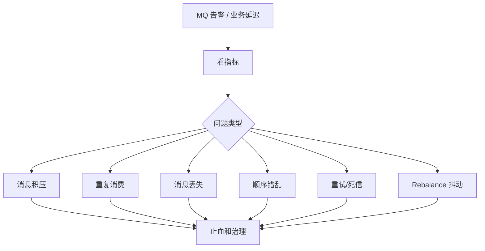

# 消息队列线上案例与排查

> MQ 线上问题重点看：消息是否丢、是否重复、是否积压、是否乱序、是否重试放大，以及消费端是否幂等。

## 一、排查总入口



核心指标：

- Topic QPS。
- 生产失败率。
- 消费 lag。
- 消费失败率。
- 重试次数。
- 死信数量。
- 消费耗时 P99。
- Rebalance 次数。
- Broker 磁盘、网络、ISR。

## 二、案例 1：消息积压

### 现象

- 消费 lag 持续增长。
- 业务状态延迟更新。
- 下游 DB/Redis 压力升高。
- 消费者 CPU 不一定高，可能卡在下游。

### 常见原因

- 消费逻辑慢。
- 下游 DB 慢。
- 消费者实例数不足。
- 分区数太少，扩容消费者无效。
- 单条消息处理太重。
- 重试消息反复失败。
- Rebalance 频繁。

### 排查

```text
看 topic lag
看 consumer group 状态
看分区数和消费者数
看消费耗时 P99
看下游 DB/Redis/RPC
看失败重试和死信
```

### 处理

- 临时扩容消费者，但要确认分区数足够。
- 跳过或隔离毒消息。
- 批量消费和批量写入。
- 优化下游 SQL/RPC。
- 降低非核心消费逻辑。
- 增加分区并重新规划 key。

### 面试表达

```text
消息积压我不会只说扩容消费者，因为消费者数超过分区数后没有收益。
我会先看 lag、分区数、消费者数、消费耗时和下游依赖，判断瓶颈在消费逻辑、分区并行度还是下游。
```

## 三、案例 2：重复消费

重复来源：

- 生产者重试。
- Broker 重试。
- 消费成功但 offset 提交失败。
- 消费超时被重新投递。
- Rebalance 后分区被其他消费者接管。

治理核心：

```text
消费者必须幂等
```

常见幂等方式：

- 业务唯一键。
- 幂等表。
- 状态机条件更新。
- Redis setnx 短期去重。
- 数据库唯一索引。

示例：

```sql
UPDATE orders
SET status = 'PAID'
WHERE order_id = ? AND status = 'UNPAID';
```

## 四、案例 3：消息丢失

丢失链路：


每段都可能丢：

| 阶段 | 风险 | 解决 |
| --- | --- | --- |
| 生产者 | 发送失败未处理 | ack、重试、错误记录 |
| Broker | 副本不足、刷盘丢 | acks/all、ISR、持久化 |
| 消费者 | 先提交 offset 后处理失败 | 处理成功后提交 |
| 业务落库 | DB 写失败但消息确认 | 本地事务、重试、死信 |

关键原则：

```text
宁可重复，不可无声丢失。
重复靠幂等解决，丢失靠可靠链路和补偿解决。
```

## 五、案例 4：顺序消息错乱

顺序消息成立条件：

- 同一业务 key 发到同一分区/队列。
- 同一分区单消费者顺序消费。
- 消费失败处理不能破坏顺序。

常见错误：

- 订单消息随机分区。
- 同一订单多个消费者并发处理。
- 失败消息丢到重试队列后后续消息先执行。

处理：

- 按 `order_id` 分区。
- 单 key 串行处理。
- 失败阻塞或局部暂停。
- 业务状态机兜底。

## 六、案例 5：毒消息和死信队列

毒消息：

```text
某条消息每次消费都失败
导致不断重试，占用消费能力
```

处理：

- 限制最大重试次数。
- 进入死信队列。
- 告警。
- 人工或补偿任务处理。
- 修复后支持重新投递。

死信队列不是垃圾桶，要有：

- 监控。
- 查询。
- 重放。
- 标记处理状态。
- 责任人。

## 七、案例 6：Rebalance 抖动

现象：

- 消费停顿。
- lag 抖动。
- 重复消费增加。
- 消费者频繁加入/退出。

原因：

- 消费太慢超过 max poll interval。
- 消费者频繁重启。
- 网络抖动。
- 扩缩容太频繁。

治理：

- 控制单批消费时间。
- 调整 poll 参数。
- 平滑扩缩容。
- 消费逻辑异步化但注意 offset。
- 监控 rebalance 次数。

## 八、常见坑

- 以为 MQ 保证绝对不重复。
- 先提交 offset，再处理业务。
- 消费者扩容超过分区数还期待吞吐提升。
- 重试无上限，故障时放大流量。
- 顺序消息没有按业务 key 分区。
- 死信队列没有监控和重放能力。
- 事务消息当成强一致事务。

## 九、面试表达

```text
MQ 线上问题我会先看 lag、生产失败率、消费失败率、重试、死信、分区数、消费者数和下游耗时。
消息积压不一定靠扩容解决，要看分区并行度和下游瓶颈。
MQ 通常保证至少一次投递，所以消费者必须幂等；消息丢失要从生产者、Broker、消费者和业务落库四段排查。
顺序消息要保证同一业务 key 到同一分区，并且失败处理不能破坏顺序。
```

