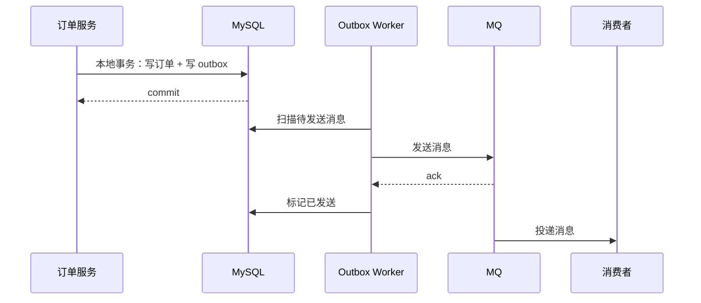

# 事务消息与 Outbox 模式

> 本地事务 + MQ 的核心问题是：数据库提交和消息发送不是一个原子操作。Outbox 模式用“本地事务写业务表和消息表”来保证最终一致。

## 一、问题背景

典型场景：

```text
订单创建成功
  -> 发送消息扣库存
  -> 发送消息发优惠券
  -> 发送消息通知用户
```

问题：

```text
DB 提交成功，MQ 发送失败怎么办？
MQ 发送成功，DB 提交失败怎么办？
消费者重复消费怎么办？
消息一直失败怎么办？
```

## 二、错误做法

### 先写 DB，再发 MQ

```text
写 DB 成功
发 MQ 失败
结果：业务状态已变，但下游不知道
```

### 先发 MQ，再写 DB

```text
发 MQ 成功
写 DB 失败
结果：下游收到不存在或未提交的数据
```

所以需要最终一致方案。

## 三、Outbox 模式

核心思想：

```text
在同一个本地事务里：
  写业务表
  写 outbox 消息表

事务提交后：
  后台任务扫描 outbox
  发送 MQ
  成功后标记已发送
```



## 四、Outbox 表设计

示例：

```sql
CREATE TABLE outbox_message (
    id BIGINT PRIMARY KEY,
    biz_type VARCHAR(64) NOT NULL,
    biz_id VARCHAR(128) NOT NULL,
    topic VARCHAR(128) NOT NULL,
    message_key VARCHAR(128) NOT NULL,
    payload JSON NOT NULL,
    status VARCHAR(32) NOT NULL,
    retry_count INT NOT NULL DEFAULT 0,
    next_retry_time DATETIME NOT NULL,
    created_at DATETIME NOT NULL,
    updated_at DATETIME NOT NULL,
    UNIQUE KEY uk_biz_msg (biz_type, biz_id, message_key),
    KEY idx_status_retry (status, next_retry_time)
);
```

状态：

- `INIT`：待发送。
- `SENDING`：发送中。
- `SENT`：已发送。
- `FAILED`：超过重试次数。

## 五、发送任务设计

关键点：

- 批量扫描。
- 状态抢占，避免多 worker 重复发送。
- 发送失败重试。
- 指数退避。
- 超过次数进失败表或告警。
- 发送 MQ 成功后标记 `SENT`。

抢占示例：

```sql
UPDATE outbox_message
SET status = 'SENDING'
WHERE id = ? AND status = 'INIT';
```

只有更新成功的 worker 才能发送。

## 六、消息重复怎么办

Outbox 仍可能重复发送：

```text
MQ 发送成功
标记 SENT 失败
Worker 重试
消息重复进入 MQ
```

所以消费者必须幂等。

消费者幂等方式：

- 消费记录表。
- 业务唯一键。
- 状态机条件更新。
- Redis 短期去重。

示例：

```sql
INSERT INTO consumed_message(message_id, consumer_group)
VALUES (?, ?);
```

插入成功才处理，唯一键冲突说明处理过。

## 七、RocketMQ 事务消息

RocketMQ 事务消息流程：

```text
发送 half message
执行本地事务
提交 commit / rollback
Broker 回查事务状态
```

适合：

- 需要 Broker 帮忙处理事务状态回查。
- 使用 RocketMQ 生态。

注意：

- 不是分布式强一致事务。
- 本地事务状态查询要可靠。
- 消费端仍要幂等。

## 八、Outbox vs 事务消息

| 维度 | Outbox | RocketMQ 事务消息 |
| --- | --- | --- |
| 中间件依赖 | 通用 | 依赖 RocketMQ |
| 本地事务 | 业务表 + 消息表同事务 | 本地事务 + Broker 半消息 |
| 可靠性 | 由 DB 和扫描任务保证 | 由 Broker 回查机制保证 |
| 复杂度 | 需要 outbox 表和 worker | 需要实现事务回查 |
| 适用 | 通用最终一致 | RocketMQ 体系 |

## 九、对账和补偿

最终一致必须有对账。

对账内容：

- 订单已创建，但库存未扣。
- 支付已成功，但订单未更新。
- 优惠券已核销，但订单取消。
- outbox 长时间未发送。
- 消息进入死信队列。

补偿方式：

- 重新发送 MQ。
- 直接调用下游补偿接口。
- 状态修复。
- 人工处理。

## 十、常见坑

- 以为发 MQ 成功就等于业务一致。
- Outbox 没有唯一键，重复写消息。
- Worker 没有抢占，多个实例重复发送。
- 消费端不幂等。
- 没有死信和告警。
- 没有对账，失败消息长期堆积。
- payload 没有版本，后续结构变更导致无法消费。

## 十一、面试表达

```text
本地事务和 MQ 发送不是原子操作，所以我不会简单写完 DB 就直接发 MQ。
通用方案是 Outbox：在本地事务里同时写业务表和消息表，提交后由 worker 扫描发送，失败可重试。
Outbox 仍可能重复发送，所以消费者必须幂等，并且要有死信、告警、对账和补偿。
如果使用 RocketMQ，也可以用事务消息，但它解决的是最终一致，不是强一致分布式事务。
```

