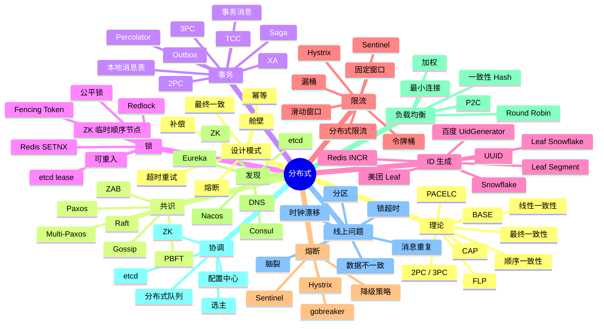
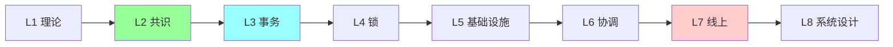
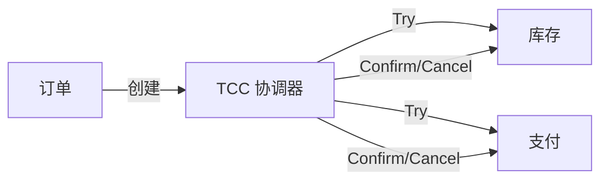
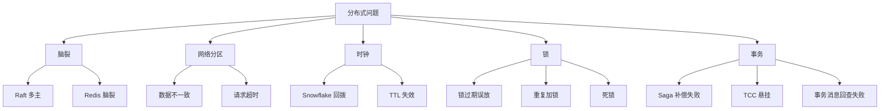
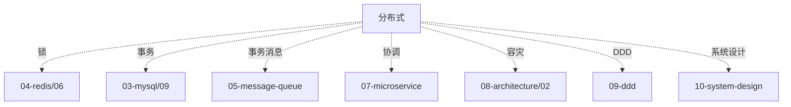

# 分布式系统知识地图

> 分布式系统是后端**资深面试的分水岭**。CAP / 一致性协议 / 事务 / 锁 / 限流 / ID / 发现 / 协调，每个专题都能独立问一整场。
>
> 这份地图是 06-distributed 目录的总览：知识树 / 题型分类 / 学习路径 / 系统设计角色 / 排查地图 / 答题方式

---

## 一、整体知识树



---

## 二、后端视角的分布式

| 分布式能力 | 后端解决的问题 |
| --- | --- |
| CAP 权衡 | 系统设计核心取舍（CP / AP）|
| Raft 共识 | 数据强一致（etcd / TiKV / Kafka KRaft）|
| 分布式事务 | 跨服务业务一致（订单 / 支付 / 库存）|
| 分布式锁 | 跨进程互斥（秒杀 / 定时任务单实例）|
| 分布式 ID | 全局唯一 + 趋势递增（订单号 / 用户 ID）|
| 限流熔断 | 保护下游 / 防雪崩 |
| 服务发现 | 微服务动态注册 / 探活 |
| 负载均衡 | 分流 + 容灾 |
| 协调服务 | 选主 / 配置 / 协作 |
| 幂等 | 重试安全 / 防重复 |
| 补偿 | 最终一致实现 |
| Outbox / CDC | 业务与消息原子 |

---

## 三、能力分层（资深 Go 后端）

```text
L1 理论
  CAP / BASE / ACID 概念、线性/最终一致

L2 共识
  Paxos 思想 / Raft 详解 / ZAB / 选主

L3 分布式事务
  2PC / 3PC / XA / TCC / Saga / Outbox / 事务消息

L4 分布式锁
  Redis / etcd / ZK 三方对比 / Fencing / 可重入

L5 基础设施
  ID 生成 / 限流熔断 / 服务发现 / 负载均衡

L6 协调与治理
  etcd / ZK 选主 / 配置中心 / 分布式队列

L7 线上问题
  脑裂 / 分区 / 重复 / 丢失 / 不一致排查

L8 系统设计
  跨地域多活 / 单元化 / 容灾 / 同城双活
```



---

## 四、题型分类

### 4.1 基础题（P5）

```
□ CAP 三选二？
□ ACID vs BASE
□ 分布式锁有哪些实现？
□ UUID / Snowflake 区别？
□ 限流算法？令牌桶 vs 漏桶？
```

对应：[01](01-theory.md) / [04](04-lock.md) / [05](05-id-generation.md) / [06](06-rate-limit-circuit.md)

### 4.2 中级题（P6）

```
□ Raft 完整流程（选主 + 日志复制）
□ 分布式事务 2PC / TCC / Saga 对比
□ 分布式锁 Redis / etcd / ZK 对比
□ Snowflake 时钟回拨怎么办？
□ 一致性 Hash 虚拟节点
□ 熔断器状态机
□ Nacos vs Consul vs Eureka
□ Outbox 模式怎么实现？
```

对应：[02](02-consensus.md) / [03](03-transaction.md) / [04](04-lock.md) / [05](05-id-generation.md) / [06](06-rate-limit-circuit.md) / [07](07-service-discovery-lb.md)

### 4.3 资深题（P7+)

```
□ Paxos / Multi-Paxos / Raft 区别
□ FLP 不可能定理 + PACELC
□ Percolator 模型（TiDB / Spanner）
□ TCC 空回滚 / 悬挂 / 幂等
□ Saga 补偿顺序 + 隔离性弱化
□ Redlock 争议（Martin Kleppmann 反驳）
□ Fencing Token 的必要性
□ etcd 和 ZK 的 Watch 机制
□ 美团 Leaf / 百度 UidGenerator 原理
□ 分布式限流 Lua + Redis-Cell
□ 自研分布式事务框架
```

对应：[02](02-consensus.md) / [03](03-transaction.md) / [04](04-lock.md) / [09](09-coordination-services.md) / [11](11-newsql-tcc-frameworks.md)

### 4.4 综合系统设计（P7-P8）

```
□ 设计订单系统的分布式事务
□ 设计跨地域多活架构
□ 设计秒杀系统（锁 + 限流 + 事务）
□ 设计单元化架构（蚂蚁 LDC）
□ 设计分布式任务调度系统
□ 设计全局唯一 ID 服务
```

对应：[10](10-distributed-lock-cases.md) / [11](11-newsql-tcc-frameworks.md) + [../10-system-design/16-high-concurrency-scenarios](../10-system-design/16-high-concurrency-scenarios.md)

### 4.5 线上排查题

```
□ 脑裂怎么排查？
□ 分布式锁失效导致重复扣款
□ 时钟漂移导致 Snowflake 重复 ID
□ Raft 选主抖动
□ 网络分区下的数据不一致
□ Saga 补偿失败怎么办？
```

对应：[10](10-distributed-lock-cases.md)

---

## 五、目录文件全览

| # | 文件 | 重点 |
| --- | --- | --- |
| 01 | [理论](01-theory.md) | CAP / BASE / ACID / 一致性模型 / FLP / PACELC |
| 02 | [共识](02-consensus.md) | Paxos / Raft / ZAB / 选主 / 日志复制 |
| 03 | [事务](03-transaction.md) | 2PC / 3PC / TCC / Saga / Outbox / 事务消息 |
| 04 | [锁](04-lock.md) | Redis / etcd / ZK 三方对比 / Redlock / Fencing |
| 05 | [ID 生成](05-id-generation.md) | UUID / Snowflake / Leaf / 时钟回拨 |
| 06 | [限流熔断](06-rate-limit-circuit.md) | 4 大算法 / Hystrix / Sentinel / gobreaker |
| 07 | [发现 + LB](07-service-discovery-lb.md) | Nacos / Consul / Eureka / 一致性 Hash / P2C |
| 08 | [设计模式](08-design-patterns.md) | 舱壁 / 熔断 / 超时 / 重试 / 幂等 |
| 09 | [协调服务](09-coordination-services.md) | etcd / ZK 使用场景 + 对比 |
| 10 | [分布式锁案例](10-distributed-lock-cases.md) | 真实生产案例 |
| 11 | [NewSQL + TCC 框架](11-newsql-tcc-frameworks.md) | Percolator / Seata / Hmily / DTM |

---

## 六、在系统设计中的角色

### 6.1 订单系统（跨服务事务）



### 6.2 秒杀（锁 + 限流 + ID）

```
Redis 锁 + 限流 + Snowflake ID + Lua 扣减
```

### 6.3 微服务（发现 + 治理）

```
Nacos 注册 → 客户端 LB → Sentinel 限流 → Hystrix 熔断
```

### 6.4 任务调度（选主）

```
etcd 选主 → 单实例调度 → 故障切主
```

### 6.5 跨地域多活

```
单元化（LDC）+ 异地多活 + 数据路由 + 同步
```

---

## 七、线上问题分类地图



---

## 八、学习路径推荐

### 8.1 入门 → 资深（6 周）

```
Week 1: 理论
  01 CAP / BASE / 一致性模型

Week 2: 共识
  02 Raft（重点）+ Paxos

Week 3: 事务
  03 2PC/TCC/Saga + 11 框架

Week 4: 锁
  04 Redis / etcd / ZK

Week 5: 基础设施
  05 ID + 06 限流熔断 + 07 发现 LB

Week 6: 综合
  08 模式 + 09 协调 + 10 案例
```

### 8.2 面试前 1 周冲刺

```
Day 1: CAP + Raft
Day 2: 分布式事务 5 种方案
Day 3: 分布式锁三方对比
Day 4: ID + 限流 + 熔断
Day 5: 发现 + LB + 协调
Day 6: 系统设计综合
Day 7: 模拟面试
```

---

## 九、答题模板

### 9.1 概念题（"CAP 怎么选"）

```
3 步:
1. 定义: Consistency / Availability / Partition Tolerance
2. 只能三选二（P 必选 → 选 C 或 A）
3. 实际:
   - CP: etcd / ZK / HBase（强一致）
   - AP: Eureka / Cassandra / Redis Cluster（高可用）
   - PACELC: 无 P 时也要在 Latency 和 Consistency 间选
```

### 9.2 设计题（"分布式事务怎么选"）

```
4 步:
1. 一致性要求:
   - 强一致 + 短事务 → XA / 2PC
   - 最终一致 + 跨服务 → TCC
   - 业务流程长 → Saga
   - 简单异步 → Outbox / 事务消息

2. 代价:
   - 2PC 阻塞 + 资源锁
   - TCC 侵入业务
   - Saga 隔离弱

3. 选型:
   - 有 RocketMQ → 事务消息
   - 用 Seata → TCC
   - 跨多库 → Saga

4. 兜底:
   - 幂等 + 对账
```

### 9.3 取舍题（"分布式锁选 Redis 还是 etcd"）

```
3 步:
1. 一致性:
   - 偶发不一致可接受 → Redis
   - 强一致 → etcd / ZK

2. 性能:
   - Redis 10w QPS
   - etcd 1w QPS
   - ZK 5k QPS

3. 配套:
   - 业务幂等 + Fencing Token
   - 不依赖锁绝对正确
```

---

## 十、面试表达

```text
分布式系统 8 层：
- L1 理论（CAP / 一致性模型）
- L2 共识（Paxos / Raft）
- L3 事务（2PC / TCC / Saga）
- L4 锁（Redis / etcd / ZK）
- L5 基础设施（ID / 限流 / 熔断 / 发现）
- L6 协调（etcd / ZK 选主）
- L7 线上排查（脑裂 / 分区 / 不一致）
- L8 系统设计（多活 / 单元化）

回答优先讲取舍 + 代价。
分布式"没有银弹"，都是权衡。
```

---

## 十一、常见误区

### 误区 1：CAP 三选二

部分错。**P 必选**（分布式网络分区不可避免）。实际是 CP vs AP。

### 误区 2：Redlock 绝对安全

错。Martin Kleppmann 论证理论缺陷（GC 停顿 / 时钟漂移）。

### 误区 3：2PC 能保证强一致

部分错。协调者宕机 → 阻塞 / 不一致。3PC 也有问题。

### 误区 4：Raft = Paxos 简化版

错。Raft 是**可理解的**共识算法，不是简化 Paxos。

### 误区 5：最终一致 = 不一致

错。**最终一致**是有明确保证的一致性模型，只是窗口存在。

### 误区 6：分布式锁能替代数据库唯一索引

错。锁用于**互斥访问**，唯一索引用于**防重**。需要配合。

### 误区 7：Snowflake 完全不冲突

错。**时钟回拨**会生成重复 ID。必须处理（等待 / 切机器 / 异常）。

---

## 十二、与其他模块的关系



跨模块查找：[../99-meta/01-cross-topic-index](../99-meta/01-cross-topic-index.md)

---

## 十三、面试加分点

- **CAP 选 P** 不是三选二
- **Raft 详解**（选主 + 日志复制 + 安全性）
- **Percolator 模型**（TiDB / Spanner 基础）
- **TCC 三大坑**（空回滚 / 悬挂 / 幂等）
- **Saga 补偿顺序 + 隔离弱化**
- **Redlock 争议**（Martin Kleppmann）
- **Fencing Token 必要性**
- **Redis / etcd / ZK 锁三方对比表**
- **Snowflake 时钟回拨**解法（等待 / 切机器）
- **分布式限流 Lua**（原子性）
- **gRPC + Consul / Nacos 实战**
- **单元化架构**（蚂蚁 LDC）
- **PACELC**（不止 CAP）

---

## 十四、推荐阅读路径

```
入门:
  □ 《Designing Data-Intensive Applications》
  □ Raft 论文
  □ 06-distributed/01-04

进阶:
  □ 《Database Internals》
  □ Percolator / Spanner / Calvin 论文
  □ 06-distributed/05-10

资深:
  □ Martin Kleppmann 博客
  □ Jepsen 测试报告
  □ TiDB / CockroachDB 博客
  □ 06-distributed/11

实战:
  □ 自己实现 Raft（MIT 6.824）
  □ 部署 etcd + ZK 实操
  □ 跑 Seata / DTM Demo
```

---

## 十五、与 99-meta 的关联

```
跨主题索引: 99-meta/01-cross-topic-index.md（锁 / 事务 / 一致性专题）
综合实战:   10-system-design/16-high-concurrency-scenarios.md
事务深度:   06-distributed/11-newsql-tcc-frameworks.md
```
