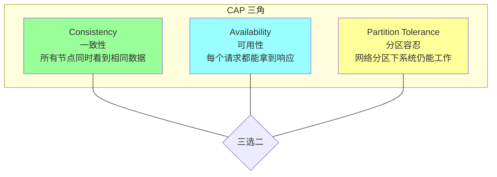
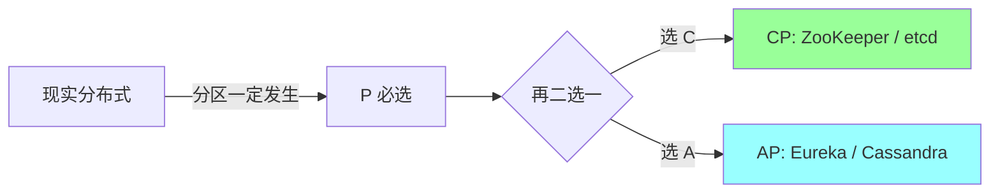
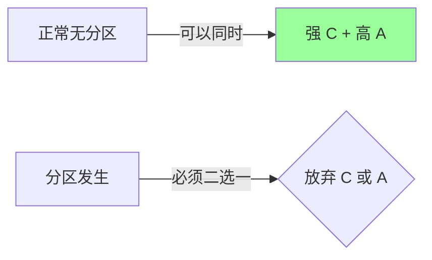
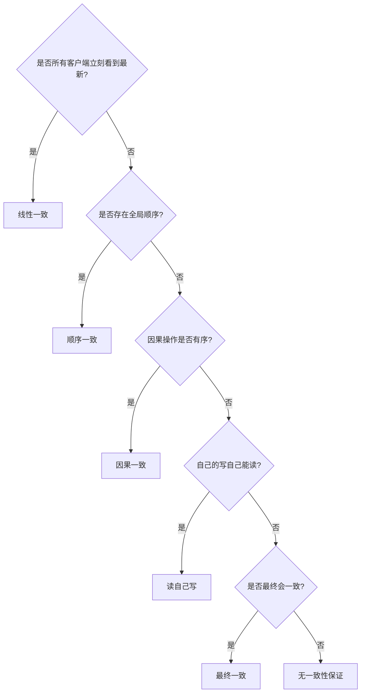
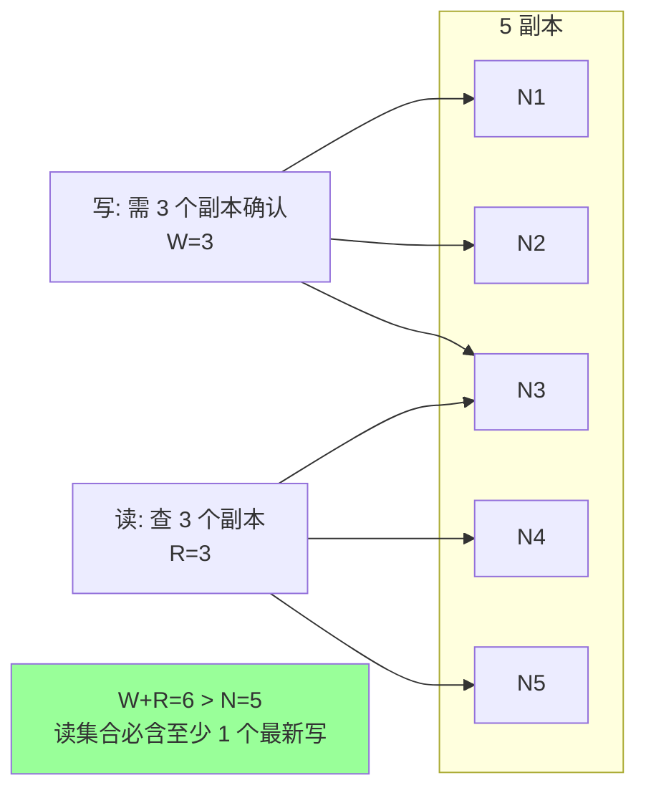
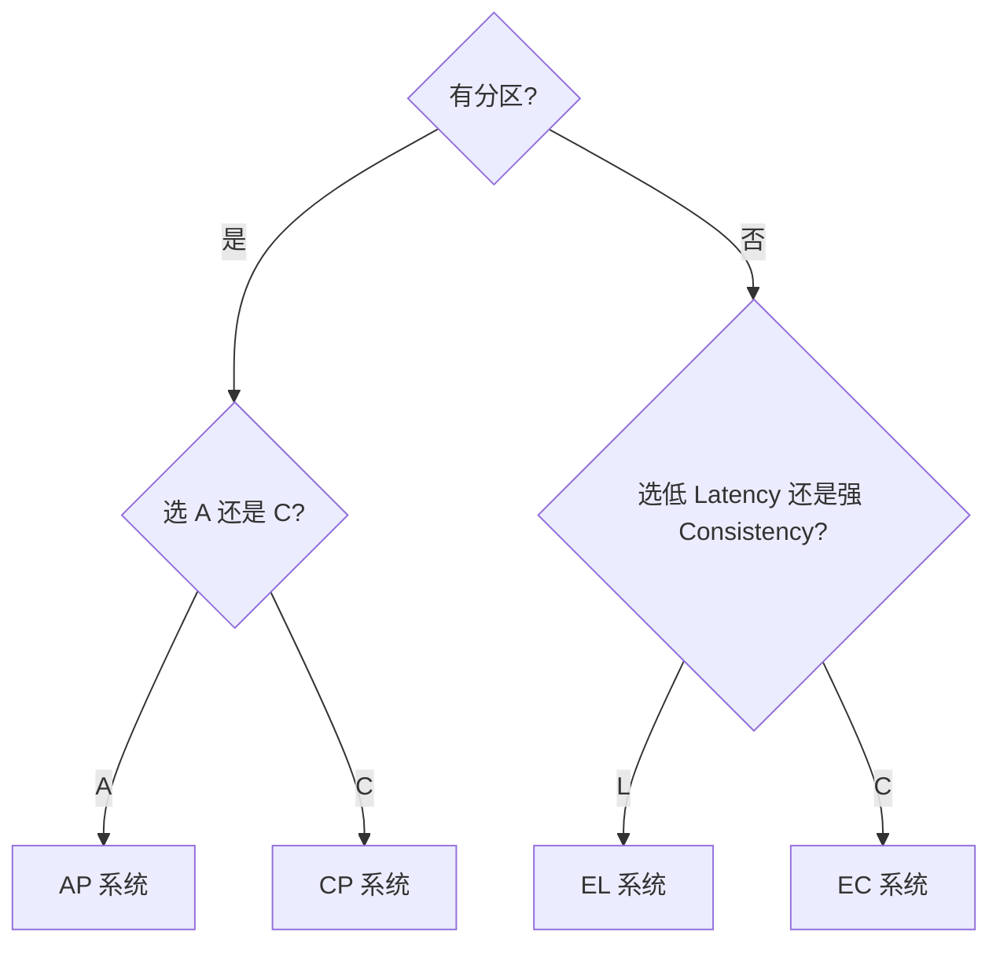
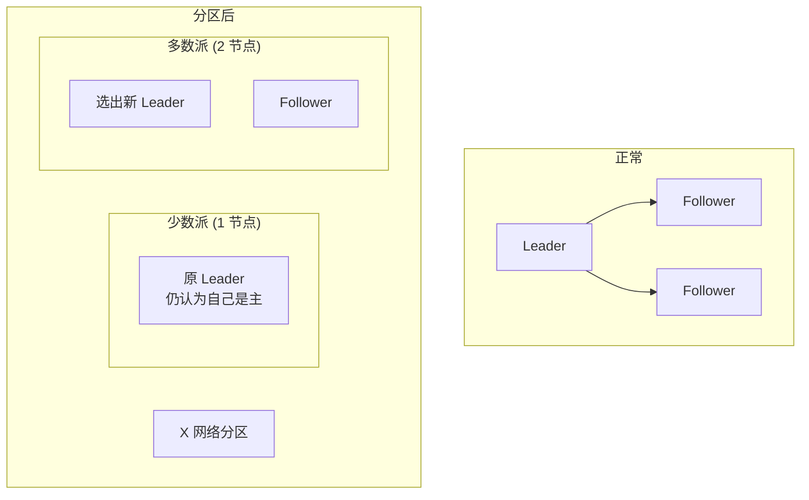

# 分布式 · 理论基础

> CAP 三选二 / BASE 最终一致 / 一致性模型谱系 / FLP 不可能 / Quorum 多数派 / PACELC 进阶版

## 一、CAP 定理（最高频）

### 1.1 三个属性



**Brewer 1998 提出，2000 形式化**：在网络分区时，**强一致性 C 和可用性 A 必须二选一**。

### 1.2 为什么必须选 P

**分布式系统中网络分区不可避免**：
- 机房断网
- 路由器故障
- 网线被挖断
- TCP 抖动 / 丢包

**单机系统不存在 P**（没有"分区"），所以单机讨论 CAP 没意义。



### 1.3 CP 与 AP 实战

#### CP 系统（一致性优先）

**分区时停止服务**，保证看到的数据一致。

代表：
- **ZooKeeper**：注册中心、配置中心、协调
- **etcd**：k8s 元数据
- **HBase**：列式存储
- **Redis Cluster**（部分场景）

例：ZK 集群分区，少数派节点不能响应（拒绝服务）。

#### AP 系统（可用性优先）

**分区时继续服务**，可能返回旧数据，分区恢复后**最终一致**。

代表:
- **Eureka**：Netflix 注册中心
- **Cassandra**：列式 NoSQL
- **DynamoDB**：AWS KV 存储
- **CouchDB**：文档数据库

例：Eureka 分区时继续提供注册查询，可能拿到过期实例（短暂不准但可用）。

### 1.4 误区与精确表述

CAP 是"分区时的二选一"，**不是任何时候都要放弃 C 或 A**：



正常情况两者都能要。**分区是稀有事件**，但发生时必须有预案。

### 1.5 CP/AP 选型

| 场景 | 选 |
| --- | --- |
| 银行账户余额 | CP（不能错） |
| 服务注册中心 | 多数 AP（短暂老数据 OK） |
| 配置中心 | 偏 CP（配置不能不一致） |
| 商品库存 | CP（防超卖） |
| 商品详情缓存 | AP（旧数据可接受） |
| 订单状态 | CP（不能丢/错） |
| 用户头像 | AP（短暂不一致 OK） |

## 二、BASE 理论

```
Basically Available  基本可用
Soft state           软状态(允许中间态)
Eventual consistency 最终一致
```

**BASE = 反 ACID**。互联网架构妥协实践。

### 2.1 三要素

#### Basically Available（基本可用）

允许**响应时间损失**或**功能损失**，但服务不挂：
- 服务慢（双 11 加载几秒）→ 但能用
- 部分功能降级（评论关闭，下单可用）

#### Soft State（软状态）

允许系统**存在中间状态**，不要求实时一致：
- 订单"处理中"
- 缓存与 DB 的延迟不一致

#### Eventual Consistency（最终一致）

经过一段时间后，数据**最终达到一致**。具体时间因系统而异（毫秒到分钟）。

### 2.2 ACID vs BASE

| | ACID | BASE |
| --- | --- | --- |
| 一致性 | 强一致 | 最终一致 |
| 可用性 | 优先一致 | 优先可用 |
| 性能 | 低（事务锁） | 高（异步） |
| 复杂度 | 简单（事务）| 复杂（业务幂等等） |
| 适用 | 单机 DB / 金融 | 互联网分布式 |

### 2.3 实战取舍

- **支付/转账**：ACID（DB 事务）
- **订单状态变更**：BASE（消息驱动 + 幂等）
- **库存**：CP + 强一致（防超卖）
- **评论/点赞**：BASE（最终一致）

## 三、一致性模型（必懂谱系）

### 3.1 强度谱系


### 3.2 强一致（Strong / Linearizable Consistency）

**最严格**：所有操作看起来像是在**单点**按时间顺序执行。

特点：
- 写入完成后，**所有后续读**（包括其他客户端）立刻看到新值
- 全局有"真实时间"
- **代价**：性能差，可用性低

实现：Paxos / Raft 类共识算法 + 多数派读写。

例：ZooKeeper、etcd、Spanner。

### 3.3 顺序一致（Sequential）

操作有**全局顺序**，但不要求和真实时间一致。

例：A 在 10:00 写 x=1，B 在 10:01 读 x=0 是允许的（只要全局看 B 在 A 前面）。

弱于线性一致，强于因果一致。

### 3.4 因果一致（Causal）

**有因果关系的操作**保持顺序，无关的可乱序。

例：A 发了"问题"，B 发了"答案"（依赖 A）。所有节点看到时"问题"必在"答案"前。但跟"今天天气好"无关，可乱序。

### 3.5 读自己写（Read-Your-Writes）

我写了 x=1，**我自己**立刻能读到 x=1（其他人可能晚点）。

例：你发朋友圈，自己刷新看到，朋友可能 2 秒后才看到。

### 3.6 单调读（Monotonic Read）

读到 v1 后，再读不会读到比 v1 更老的值（不会"回退"）。

例：你看到余额 100 了，再刷新不会突然变 80（实际是 80，但你已经看过 100，不能回退）。

### 3.7 最终一致（Eventual Consistency）

**最弱**：经过足够时间，所有副本最终达到相同值。中间任何不一致都允许。

代表：DNS、社交网络、CDN。

### 3.8 用什么衡量一致性



## 四、FLP 不可能定理

### 4.1 表述

> 在**异步网络模型**下，**只要有一个节点可能失效**，就**不存在**可以保证在有限时间内达成共识的算法。

—— Fischer, Lynch, Paterson, 1985

### 4.2 含义

**理论上 100% 可靠的共识不存在**。Paxos / Raft 等也只是"高概率"达成共识，不是绝对保证。

### 4.3 实践绕过

- **同步假设**：用超时机制（"超过 T 秒认为对方挂了"）
- **随机化**：随机重试避免活锁
- **故障检测器**：心跳 + 超时（如 Raft 的 election timeout 随机化）

### 4.4 启示

任何共识系统都**必须有超时**，否则可能永远卡住。
工程上接受"概率达成"，实测可靠性已足够。

## 五、Quorum（多数派）

### 5.1 NWR 模型

```
N = 副本总数
W = 写需要确认的副本数
R = 读需要查询的副本数
```

**条件**：`W + R > N` → 强一致



**原理**：W 个副本和 R 个副本必有交集（鸽笼原理），交集里至少 1 个有最新数据。

### 5.2 典型配置

| 场景 | N | W | R | 特点 |
| --- | --- | --- | --- | --- |
| 强一致 + 读写均衡 | 3 | 2 | 2 | W+R=4 > 3 |
| 写少读多 | 3 | 3 | 1 | 读极快 |
| 写多读少 | 3 | 1 | 3 | 写极快 |
| 高可用最终一致 | 3 | 1 | 1 | W+R=2 < 3，最终一致 |

### 5.3 Cassandra 实战

```sql
-- 写: ALL / QUORUM / ONE / ANY
INSERT INTO users (id, name) VALUES (1, 'alice') USING CONSISTENCY QUORUM;

-- 读
SELECT * FROM users WHERE id=1 USING CONSISTENCY QUORUM;
```

QUORUM = N/2 + 1。

### 5.4 Quorum 在 Raft / Paxos 中

- Raft 多数派提交日志
- Paxos prepare/accept 都要多数派
- 选举多数派同意

**为什么是多数？**
- 不能是少数：会出现两个不交的"少数派" → 脑裂
- 不能是 1：单点故障
- 多数派任何两个一定相交 → 不可能选出两个 leader

## 六、PACELC（CAP 进阶）

### 6.1 痛点

CAP 只描述**分区时**的取舍，**正常时**呢？

### 6.2 表述

> If Partition (P): Choose A or C
> Else (E): Choose Latency (L) or Consistency (C)



### 6.3 系统分类

| 系统 | P-A/C | E-L/C |
| --- | --- | --- |
| ZooKeeper | PC | EC |
| etcd | PC | EC |
| Spanner | PC | EC（用 TrueTime） |
| Cassandra | PA | EL |
| DynamoDB | PA | EL |
| MongoDB | PA / PC（可配） | EL / EC |
| MySQL（主从） | PA（主挂从顶上） | EL（异步复制） |

PACELC 比 CAP 更精确，因为正常时间 >> 分区时间。

## 七、典型分布式问题

### 7.1 脑裂（Split-Brain）

网络分区导致**多个节点都认为自己是主**：



**防御**：要求**多数派**才能成为/保持 leader（少数派的老 leader 主动降级）。Raft / Paxos / ZK 都靠这个。

### 7.2 时钟问题

物理时钟永远不同步（NTP 也有几十 ms 误差）。

**解决**：
- **逻辑时钟**：Lamport Timestamp（事件偏序）
- **向量时钟**：每个节点维护各自计数（因果关系）
- **混合时钟**：Hybrid Logical Clock（HLC）
- **TrueTime**：Google Spanner（GPS + 原子钟，区间表示时间）

### 7.3 拜占庭问题（Byzantine Generals）

节点可能**作恶**（不只是挂掉，还乱发消息）。

- **Crash Fault Tolerance (CFT)**：节点只挂不作恶。Paxos / Raft 属于这类。**容忍 N/2 节点挂**
- **Byzantine Fault Tolerance (BFT)**：节点可能作恶。PBFT / 区块链。**容忍 N/3 节点作恶**

互联网公司一般是 CFT（自家机器，不会作恶），区块链才需要 BFT。

## 八、高频面试题

**Q1：什么是 CAP？为什么不能 3 个都满足？**

CAP = Consistency / Availability / Partition Tolerance。**分区发生时**，强一致性和可用性必须二选一。

证明：分区后两个子网无法通信。要 C → 必须等对方同步（不能立刻响应，违反 A）；要 A → 立刻响应可能返回旧值（违反 C）。

**Q2：CP 和 AP 系统怎么选？**

| 场景 | 选 |
| --- | --- |
| 数据准确性 > 一切（金融/库存） | CP |
| 服务可用性 > 一切（注册中心/缓存） | AP |
| 强一致 + 高可用（Spanner 等） | 用 Paxos/Raft + 多副本，正常时都满足 |

**Q3：BASE 是什么？和 ACID 关系？**

BASE = Basically Available + Soft state + Eventual consistency。

是 ACID 的"软化版"：放弃强一致换高可用。互联网分布式系统的主流选择。

ACID 适合单机 DB / 金融，BASE 适合大规模互联网业务。

**Q4：一致性模型从强到弱？**

线性一致 > 顺序一致 > 因果一致 > 读自己写 > 单调读 > 最终一致

强度越高 → 性能越低、复杂度越高。

**Q5：什么是最终一致？要多久？**

经过足够时间副本最终一致。具体时间：
- 单机房同步复制：毫秒级
- 跨机房异步复制：秒级
- 跨地域：分钟级

业务可接受范围：通常秒级以内 OK。

**Q6：FLP 不可能定理是什么？**

异步网络下，只要可能有 1 个节点挂，就不存在保证在有限时间内达成共识的算法。

**实际工程**：用超时 + 随机化绕过。所以 Raft 等共识算法都依赖**心跳超时**和**随机选举超时**。

**Q7：什么是 Quorum？为什么 W+R>N 就强一致？**

Quorum：写至少 W 个副本，读至少 R 个副本。

`W+R>N` 时，写集合和读集合必有交集（鸽笼原理）。读取时，至少有 1 个副本带着最新写入数据。

典型：N=3, W=2, R=2（QUORUM）。

**Q8：脑裂怎么防？**

**多数派原则**：只有获得 N/2+1 票的节点才能成为/保持 leader。少数派节点（即使是老 leader）必须降级。

实现：Raft 的 leader 心跳超时 + 选举投票多数派。

**Q9：拜占庭和非拜占庭故障区别？**

- **非拜占庭（CFT）**：节点只会挂，不会乱发消息。Paxos/Raft 容忍 ⌊N/2⌋ 个节点挂
- **拜占庭（BFT）**：节点可能作恶（伪造消息）。PBFT / 区块链。容忍 ⌊N/3⌋ 个节点作恶

互联网公司用 CFT 即可。区块链需要 BFT。

**Q10：分布式系统的时钟问题？**

物理时钟不可靠（NTP 有偏差，闰秒等）。所以分布式系统不依赖物理时钟做关键决策。

替代：
- **逻辑时钟**（Lamport）：标识事件偏序
- **向量时钟**：识别因果关系
- **TrueTime**（Spanner）：GPS + 原子钟，给时间一个误差区间

**Q11：什么时候用强一致，什么时候用最终一致？**

| 用强一致 | 用最终一致 |
| --- | --- |
| 金融账户 | 评论/点赞 |
| 库存扣减 | 浏览记录 |
| 配置变更 | 用户头像 |
| 关键状态机（订单状态） | 推荐内容 |
| 计数（精确） | UV/PV（近似） |

**Q12：CAP 的"P"在单机系统有意义吗？**

没有。单机不存在网络分区。CAP 是分布式系统的概念。
单机 DB 直接讨论 ACID 即可。

## 九、面试加分点

- **CAP 是分区时的取舍，不是任何时候**（澄清最大误解）
- 网络分区是稀有事件但必须有预案
- BASE 是反 ACID 但不是放弃一致性，是放弃强一致换可用
- 一致性谱系能说出 5~6 种（线性 → 最终）
- FLP 不可能定理 + 工程上用超时绕过
- Quorum W+R>N 的鸽笼原理证明
- 脑裂靠多数派
- 物理时钟不可靠，分布式系统用逻辑时钟
- CFT vs BFT 区别（互联网 CFT，区块链 BFT）
- PACELC 比 CAP 更精确（区分分区时和正常时）
