# 分布式 · 共识算法

> Paxos / Raft（Leader选举 + 日志复制 + 安全性）/ ZAB / Gossip / 拜占庭容错 / 实战对比

## 一、共识问题

**共识（Consensus）**：多个节点对某个值达成一致。

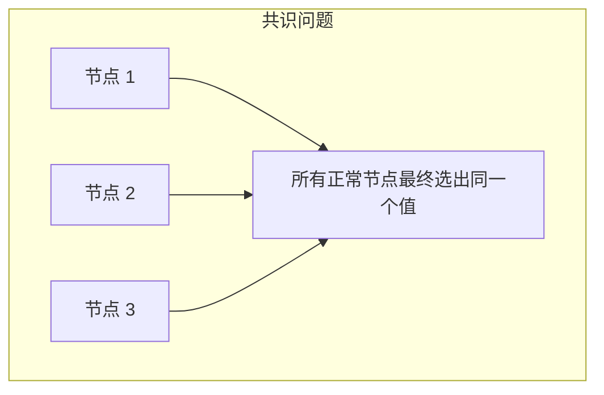

**约束**：
- 部分节点可能挂
- 网络可能丢包/重排
- 不同节点看到的事件顺序可能不同
- 必须**最终一致**

典型应用：
- **选 leader**（Raft / ZAB）
- **复制日志**（K8s etcd / TiKV）
- **元数据**（HDFS NameNode HA）
- **配置同步**（ZooKeeper）

## 二、Paxos（理论祖师）

### 2.1 角色

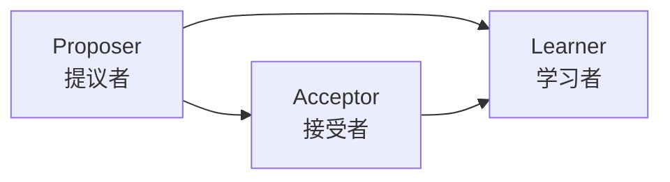

- **Proposer**：发起提案
- **Acceptor**：投票决定接受/拒绝
- **Learner**：学习已决议的值

### 2.2 两阶段

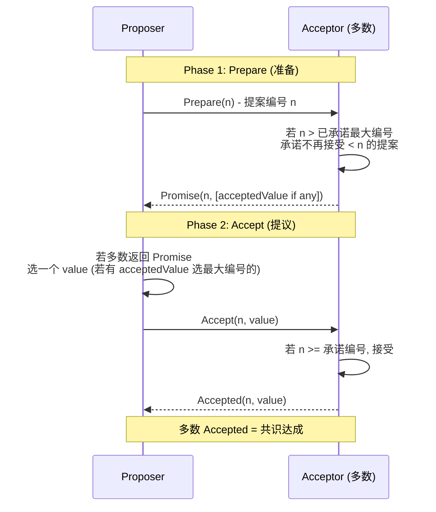

**关键**：
- 两阶段都需要**多数派**同意
- **提案编号 n** 严格递增（全局唯一）
- 一旦多数 Acceptor 接受了某 value，**未来所有提案必须保留这个 value**

### 2.3 为什么 Paxos 是"难"的

- **论文晦涩**：Lamport 用希腊议会做比喻
- **变种众多**：Basic Paxos / Multi-Paxos / Fast Paxos / Cheap Paxos
- **工程实现复杂**：完整 Multi-Paxos 工程化需大量细节（Leader、日志、成员变更）

→ **生产几乎不直接用 Basic Paxos**，多用 **Raft** 或基于 Paxos 的工业级实现（如 Google Chubby）。

### 2.4 Multi-Paxos

Basic Paxos 一次只能决定**一个值**。Multi-Paxos = 选出固定 Leader 后跳过 Phase 1，连续决定多个值（日志序列）。

→ 这就是 **Raft 的雏形**。

## 三、Raft（生产首选）

### 3.0 核心提炼（5 段式）

#### 核心机制（4 条必背）

1. **Leader 唯一**：所有写请求只走 Leader，Leader 串行化所有操作（避免冲突）
2. **任期 Term + 选举超时**：每个任期最多一个 Leader，Follower 超时未收到心跳就发起选举
3. **多数派提交（Quorum）**：日志被复制到 N/2+1 节点才算 committed，保证不丢
4. **状态机一致性**：所有节点按相同顺序 apply 已 committed 的日志 → 数据最终一致

#### 核心本质（必懂）

> Raft 的本质是**用 Leader 串行化 + 多数派同步换强一致性**：
>
> - **为什么有 Leader**：解决 Paxos 多角色协调难的问题，简化为"Leader 决策 + Followers 跟随"
> - **为什么多数派**：N 个节点容忍 (N-1)/2 个故障（5 节点容忍 2 个挂）
> - **为什么会丢可用性**：网络分区时少数派无 Leader → 拒绝写 → CAP 选 CP
>
> **核心保证**：
> - **安全性**：已 committed 的日志永不丢失（即使 Leader 切换）
> - **活性**：只要多数派存活，集群最终能选出 Leader 并继续工作
>
> **代价**：性能 ~1-2 万 QPS（受 Leader 单点 + 网络往返限制），不适合极高 QPS。

#### 完整流程（面试必背）

```
1. 选举（Election）:
   - 集群启动 / Leader 失联 → Follower 等 election timeout（150-300ms 随机）
   - 超时未收到心跳 → 自己变 Candidate，term++，给自己投票
   - 向其他节点发 RequestVote RPC
   - 收到多数派投票 → 变 Leader → 发心跳广播
   - 任期内多个 Candidate → 票数分裂 → 重新 timeout 重选

2. 日志复制（Log Replication）:
   - Client → Leader 写请求
   - Leader 追加日志（uncommitted）
   - Leader 并行发 AppendEntries RPC 给所有 Followers
   - Followers 写本地日志后回复
   - 多数派回复成功 → Leader 标记日志为 committed
   - Leader apply 到状态机 → 返回 Client 成功
   - 后续心跳告知 Followers 该日志已 committed → Followers apply

3. 安全性保证:
   - 选举限制: 只有日志最新的 Candidate 才能当选（防数据丢失）
   - 提交规则: Leader 只能提交当前任期的日志（防覆盖已提交）
   - 日志匹配: 相同 index + term 的日志 = 内容相同，且之前所有日志也相同

4. 异常路径:
   - Leader 挂 → 选新 Leader（election timeout 内完成）
   - Follower 挂 → Leader 重试 AppendEntries 直到节点恢复
   - 网络分区 → 少数派无 Leader 不可用，多数派正常工作
   - 脑裂 → 老 Leader 在少数派侧无法获得多数派 ack → 写挂起 → 新 Leader 选出后老 Leader 收到更高 term → 自动降级
```

#### 4 条核心机制 - 逐点讲透

##### 1. Leader 唯一（强 Leader 模型）

```
为什么强 Leader:
  Paxos 多角色（Proposer/Acceptor/Learner）协调复杂
  Raft 简化: 只有 Leader 提议，Followers 接受

  好处:
  - 所有写串行化 → 简单可推理
  - 状态机日志严格有序
  - 实现门槛低（vs Paxos）

代价:
  Leader 单点性能瓶颈（写吞吐受限）
  Leader 挂 → election timeout 内不可用（毫秒级）
```

##### 2. 任期 + 选举超时（避免脑裂）

```
Term 单调递增:
  每次选举 term++
  消息带 term，老 term 自动降级为 Follower

选举超时随机化（150-300ms）:
  避免多个 Follower 同时变 Candidate 导致票数分裂

心跳间隔 << 选举超时:
  Leader 心跳 50ms，超时 150-300ms
  保证正常情况下 Leader 不被误判
```

##### 3. 多数派提交（Quorum）

```
为什么是多数派 (N/2+1):
  - 任意两个多数派必有交集（鸽巢原理）
  - 即使 (N-1)/2 个节点挂，仍能形成多数派
  - 防止"两个 Leader 都能写"的脑裂

容错能力:
  3 节点: 容忍 1 挂
  5 节点: 容忍 2 挂
  7 节点: 容忍 3 挂
  → 节点越多容错越好但性能越差

为什么不是全部:
  全部同步 = 任一节点挂全集群不可用
  → 失去"高可用"意义
```

##### 4. 状态机一致性

```
日志 vs 状态机:
  日志: 操作序列（append + commit）
  状态机: 应用日志后的实际数据

保证:
  - 所有节点按相同顺序 apply 已 committed 的日志
  - 同样的初始状态 + 同样的日志序列 → 同样的最终状态
  - 即使节点重启，重放日志即可恢复

应用:
  - etcd: Raft 日志 → KV 状态机
  - TiKV: Raft 日志 → RocksDB 状态机
  - Kafka KRaft: Raft 日志 → 元数据状态机
```

#### 一句话总结

> Raft 共识的核心是：**Leader 唯一 + 任期 Term + 多数派提交 + 状态机一致性**，
> 本质是**用 Leader 串行化简化 Paxos**，用多数派同步换强一致（CP）。
> 安全性（已提交不丢）通过"选举限制 + 提交规则"保证；
> 活性（最终能选出 Leader）通过"超时随机化 + 任期递增"保证。
> 适合**强一致 + 中等 QPS**场景（etcd / TiKV / Kafka KRaft），极高 QPS 用 AP 系统（Cassandra）。

---

### 3.1 设计哲学：可理解性

> "Raft 是为了可理解而设计的 Paxos"
> —— Diego Ongaro 博士论文

把共识拆成 3 个独立子问题：

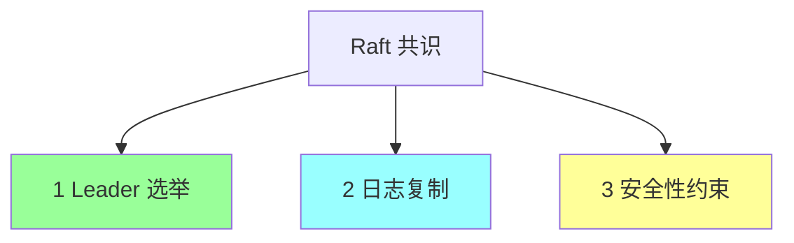

### 3.2 三种角色

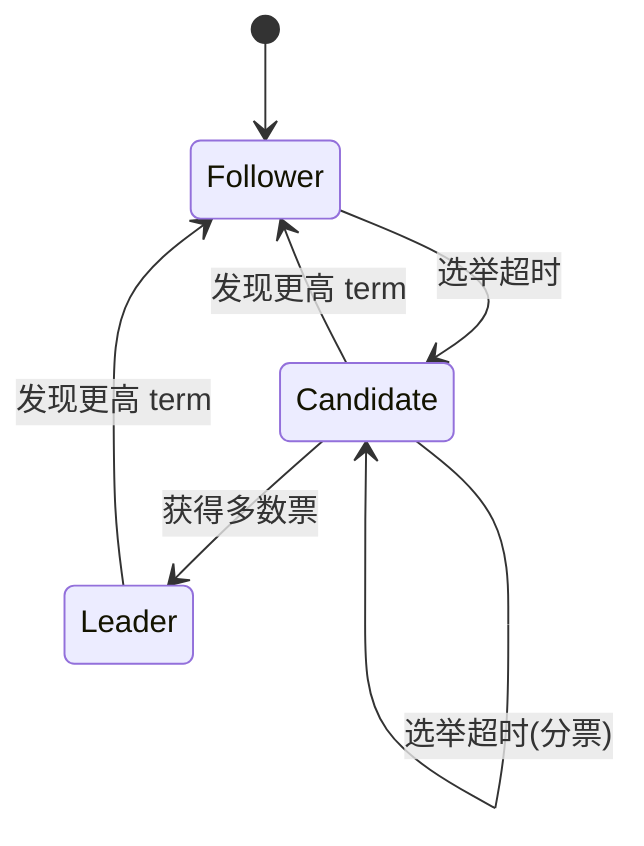

- **Follower**：被动响应，不主动发请求
- **Candidate**：竞选 Leader
- **Leader**：发心跳 + 处理写请求 + 复制日志

### 3.3 任期（Term）

**逻辑时钟**：每次选举 term+1。每个 term 最多 1 个 Leader（可能没有）。

```
Term:  [1] [2]  [3]  [4]  [5] ...
       L   L↓ E L   L↓  E L
              (E = 选举期, 可能选不出)
```

任何 RPC 都带 term，**收到更高 term 的节点立即降级 Follower**。

### 3.4 Leader 选举

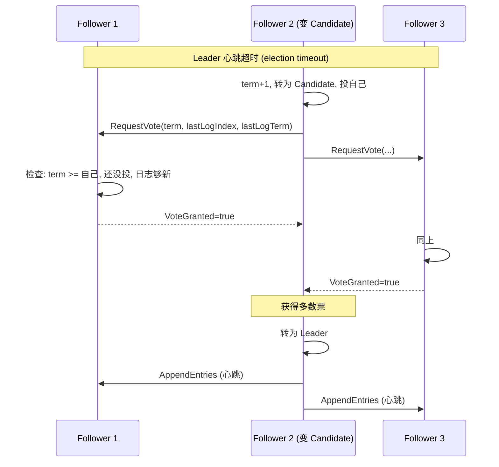

**选举超时**：每个 Follower 随机 150~300ms（**避免分票**）。

**投票规则**（关键）：
1. 一个 term 一票（先到先得）
2. **Candidate 日志必须不旧于自己**（否则不投）—— 保证 Leader 包含所有已提交日志

### 3.5 日志复制

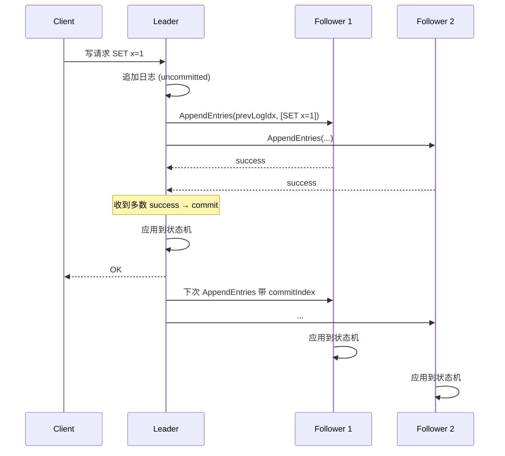

**两阶段**：
1. **Replicate**：Leader 写本地 + 发给 Follower
2. **Commit**：多数确认后，Leader 应用到状态机，回复客户端
3. Follower 后续心跳带 `commitIndex`，按需应用

### 3.6 日志匹配性质

**关键不变量**：如果两个日志在某 index 处的 term 相同，则**该 index 之前的所有日志都相同**。

→ Leader 通过 `prevLogIndex/prevLogTerm` 检查 Follower。不匹配则 Follower 拒绝，Leader 回退一格再试，直到找到匹配点，覆盖之后的所有日志。

### 3.7 安全性约束

为了保证已提交的日志不丢：

#### 选举限制

Candidate 的日志必须**不旧于多数派**才能当选。"不旧于" = 最后一条日志的 term 更大，或 term 相等但 index 更大。

→ 保证当选 Leader 包含所有已提交日志。

#### 提交规则

Leader 只能**直接 commit 当前 term 的日志**。前任 term 的日志只能通过当前 term 的日志间接提交（防止 Figure 8 异常）。

### 3.8 成员变更（Joint Consensus）

集群成员变更（如 3 节点 → 5 节点）有脑裂风险（新旧多数派可能不交）。

**Joint Consensus**（两阶段）：
1. 进入 `C(old, new)` 状态：要求**新旧多数派都同意**
2. 切换到 `C(new)`：仅新多数派

或简化的**单步成员变更**（Raft 论文附录）：每次只增/减 1 个节点，新旧多数派必交。

### 3.9 Raft 实现

| 实现 | 语言 | 用途 |
| --- | --- | --- |
| etcd/raft | Go | etcd / k8s 内置 |
| hashicorp/raft | Go | Consul / Nomad |
| TiKV/raft-rs | Rust | TiDB |
| Apache Ratis | Java | Ozone |

## 四、ZAB（ZooKeeper Atomic Broadcast）

ZK 自研的协议，类似 Raft 但更早（2007 vs 2014）。

### 4.1 两个模式


### 4.2 ZXID

64 位单调递增 ID = `epoch (32位) + counter (32位)`：
- 高 32 位是 leader 任期（类似 Raft term）
- 低 32 位是该任期内的事务计数

每次选举 epoch+1（counter 重置）。

### 4.3 Leader 选举（Fast Leader Election）

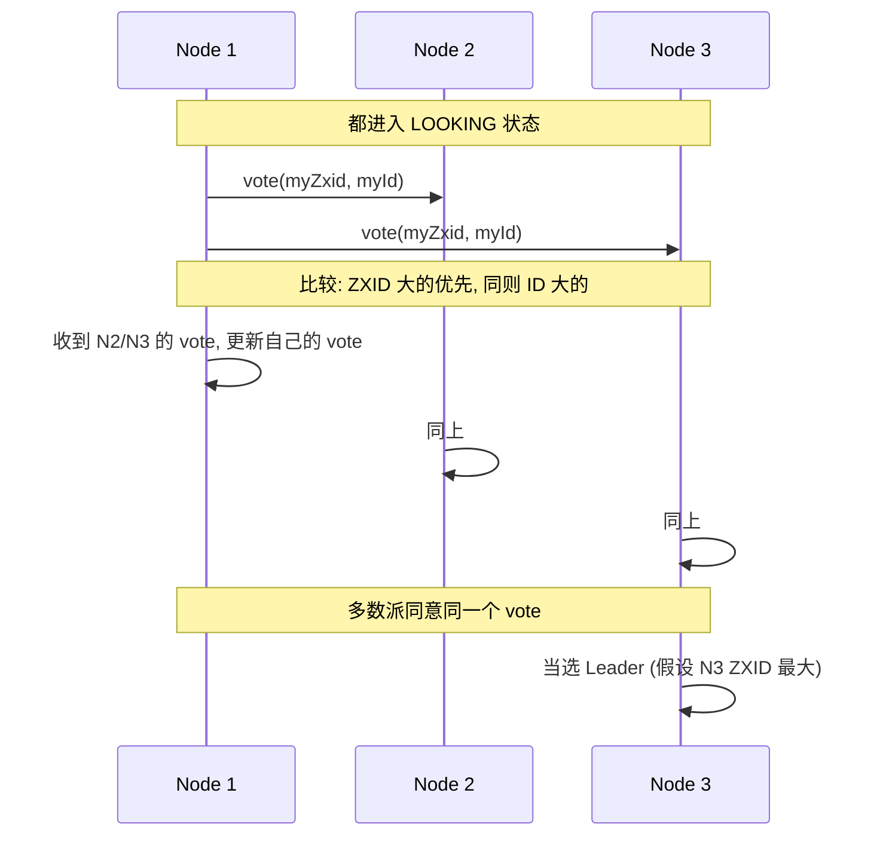

### 4.4 vs Raft

| | Raft | ZAB |
| --- | --- | --- |
| 选主依据 | term + 日志新旧 | epoch + ZXID |
| 日志名称 | log | transaction |
| 应用 | etcd / Consul / TiKV | ZooKeeper |
| 设计 | 单纯共识 | 集成 ZK 业务（顺序广播） |

ZAB 概念上和 Raft 类似，**实现细节不同**。互联网现在新系统多选 Raft（更易理解、生态好）。

## 五、Gossip（流言协议）

### 5.1 核心思想

像传染病：每个节点定期**随机选几个邻居**，交换状态。最终所有节点状态收敛。

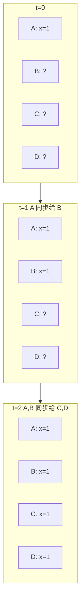

### 5.2 特点

| 优点 | 缺点 |
| --- | --- |
| 去中心化 | **最终一致**（不强一致） |
| 高扩展（O(log N) 收敛） | 收敛延迟（秒到分钟级） |
| 容错强（部分节点挂不影响） | 网络流量随节点数线性增长 |
| 实现简单 | 不适合关键决策 |

### 5.3 应用

- **Redis Cluster**：节点间状态、slot 映射
- **Cassandra**：节点状态、ring topology
- **Consul**：节点健康检查
- **CockroachDB**：节点元信息
- **Bitcoin/区块链**：交易广播

### 5.4 vs Paxos/Raft

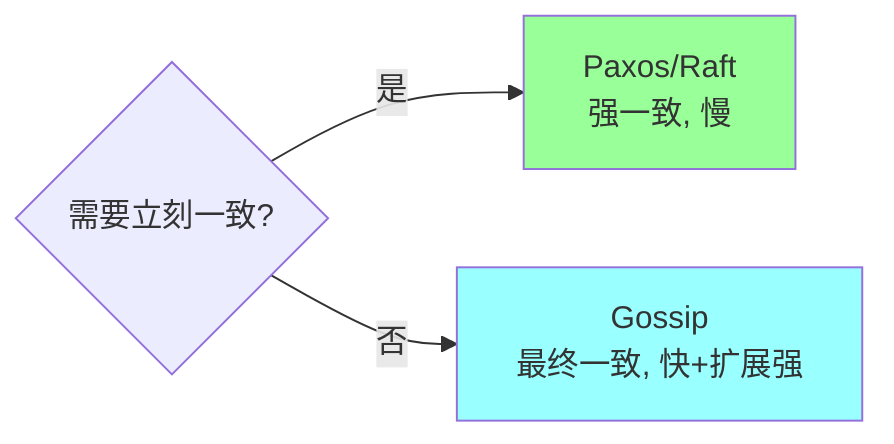

## 六、拜占庭容错（BFT）

### 6.1 拜占庭将军问题

> N 个将军围攻一座城。必须协同进攻（一起进/一起退）。
> 中间通信靠信使，可能被截获/伪造。
> 部分将军可能是叛徒（发假消息）。
> **如何让忠诚将军达成一致？**

—— Lamport 1982

### 6.2 Crash Fault vs Byzantine Fault

| | CFT | BFT |
| --- | --- | --- |
| 节点行为 | 只挂，不作恶 | 可能作恶（假消息） |
| 容错门槛 | ⌊N/2⌋（多数派） | ⌊N/3⌋（三分之一） |
| 算法 | Paxos / Raft / ZAB | PBFT / PoW / PoS |
| 应用 | 公司内部集群 | 区块链、跨组织系统 |

### 6.3 PBFT（实用拜占庭容错）

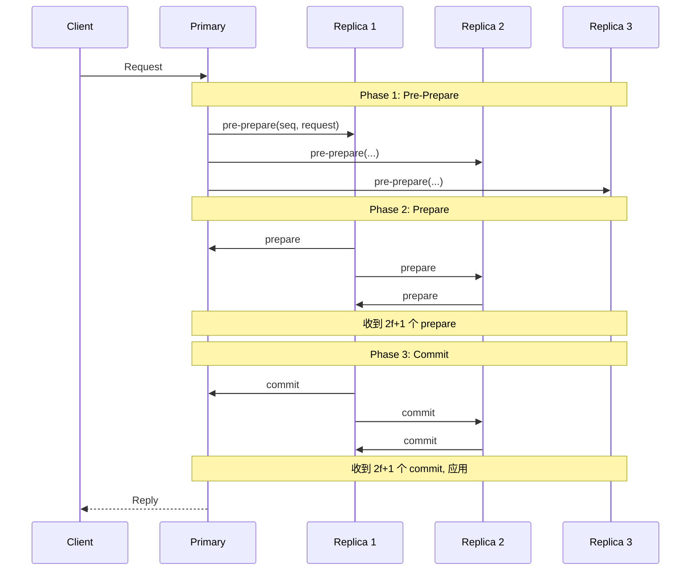

3 阶段 + 多次广播。复杂度 O(N²) 消息，**不适合大规模**。

### 6.4 区块链共识

| 算法 | 思路 |
| --- | --- |
| **PoW** Proof of Work | 算力竞争（Bitcoin） |
| **PoS** Proof of Stake | 持币质押（Ethereum 2.0） |
| **DPoS** Delegated PoS | 选代表（EOS） |
| **PBFT** | 多数派共识（联盟链） |

互联网公司基本不用区块链共识，了解即可。

## 七、典型实战场景

### 7.1 etcd / k8s 元数据

K8s 所有元数据存 etcd。etcd 用 **Raft**：
- 3/5 节点集群
- 强一致：API Server 读写都走 etcd Raft
- 节点挂还能继续（多数派活着）

### 7.2 ZooKeeper 配置中心

ZK 用 **ZAB**：
- 配置变更走 ZAB 广播
- 客户端通过 watch 感知变更
- 集群一致

### 7.3 TiKV 分布式存储

TiKV 用 **Raft**：每个数据范围（Region）一个 Raft 组。Region 分裂时新建 Raft 组。

### 7.4 Redis Cluster

slot 路由 + 故障转移用 **Gossip**（不强一致，最终一致）。

## 八、高频面试题

**Q1：Paxos 和 Raft 区别？**

| | Paxos | Raft |
| --- | --- | --- |
| 提出 | 1989 (Lamport) | 2014 (Ongaro) |
| 设计目标 | 通用共识 | **可理解性** |
| 角色 | Proposer/Acceptor/Learner | Leader/Follower/Candidate |
| Leader | Multi-Paxos 才有 | 必有 |
| 阶段拆分 | 不明确 | 明确 3 块（选举/复制/安全） |
| 工程实现 | 复杂 | 相对简单 |
| 应用 | Google Chubby / Spanner | etcd / Consul / TiKV |

**生产首选 Raft**（除非有遗留 Paxos 系统）。

**Q2：Raft 怎么选 Leader？**

```
1. Follower 心跳超时 (随机 150~300ms 防分票)
2. term+1, 转 Candidate, 给自己投票
3. 向所有节点发 RequestVote
4. 节点投票规则:
   - term >= 自己
   - 该 term 还没投过票
   - Candidate 日志 >= 自己
5. 获得多数票 → Leader, 立刻发心跳
6. 收到更高 term → 降级 Follower
```

**关键**：随机超时防分票；日志新旧检查保证 Leader 含所有已提交日志。

**Q3：Raft 怎么复制日志？**

```
1. Leader 收到客户端写, 追加本地日志 (uncommitted)
2. Leader 通过 AppendEntries RPC 发给所有 Follower
3. Follower 检查 prevLogIndex/Term 匹配后追加
4. 多数 Follower 成功 → Leader commit, 应用状态机, 回复客户端
5. 后续心跳带 commitIndex, Follower 按需应用
```

**Q4：Raft 怎么处理日志冲突？**

Leader 通过 `prevLogIndex/prevLogTerm` 检查。Follower 不匹配则拒绝，Leader 把 nextIndex 减 1 重试，直到找到匹配点，**强制覆盖** Follower 之后的日志。

依据 Leader Append-Only：Leader 永不修改/删除自己的日志，所以以 Leader 为准。

**Q5：脑裂时 Raft 怎么办？**

举例 5 节点分成 2:3：
- 少数派（2）：选不出 Leader（拿不到多数票），无法服务写
- 多数派（3）：能选 Leader，正常服务
- 老 Leader 在少数派 → 收到更高 term 时降级
- 网络恢复 → 少数派的旧日志被多数派覆盖

**靠多数派原则天然防脑裂**。

**Q6：Raft 多数派挂了怎么办？**

5 节点挂 3 个：
- 写：不可用（拿不到多数票 commit）
- 读：可能能读到老数据（看实现，etcd 默认 linearizable read 也不可用）

**只能等节点恢复**。所以 Raft 集群推荐**奇数节点（3/5/7）**，平衡可用性和成本。

**Q7：ZAB 和 Raft 区别？**

| | Raft | ZAB |
| --- | --- | --- |
| 时间 | 2014 | 2007 (与 ZK 一起) |
| 任期标识 | term | epoch |
| 日志 ID | index | ZXID (64bit) |
| 模式 | 选举 + 复制（连续）| 显式分恢复模式 + 广播模式 |
| 应用 | etcd / Consul | ZooKeeper |

理念相似，实现不同。**新项目几乎都选 Raft**。

**Q8：Gossip 怎么工作？什么时候用？**

每个节点定期随机选几个邻居交换状态。**最终一致**，O(log N) 轮收敛。

适合：
- 节点状态/元信息（不要求强一致）
- 大规模集群（数千节点）
- 容错强（部分节点挂不影响整体）

例：Redis Cluster、Cassandra、Consul。

**不适合**：关键决策（如 leader 选举），用 Raft。

**Q9：什么是拜占庭容错？什么时候需要？**

拜占庭容错 = 容忍**作恶**节点（伪造消息）。

需要 BFT：
- 不可信环境（公链区块链）
- 跨组织系统（多个不互信公司协作）
- 容错门槛 ⌊N/3⌋

**互联网公司内部不需要**（自家机器，CFT 即 Paxos/Raft 够用）。容错门槛 ⌊N/2⌋。

**Q10：为什么 Raft 节点数推荐奇数？**

- **多数派门槛**：3 → 2，4 → 3，5 → 3。
- 4 节点容忍 1 个挂（和 3 节点一样），但成本高（多 1 节点）
- 5 节点容忍 2 个挂（比 3 节点强）
- 偶数节点存在"分票"边缘情况

最常见：**3、5、7**。生产 5 个比较平衡。

**Q11：CFT 容忍多少节点？BFT 呢？**

- **CFT**：容忍 ⌊(N-1)/2⌋ 个挂（即多数派活着）
  - 3 节点：容忍 1
  - 5 节点：容忍 2
  - 7 节点：容忍 3

- **BFT**：容忍 ⌊(N-1)/3⌋ 个作恶
  - 4 节点：容忍 1
  - 7 节点：容忍 2

BFT 更严格，因为要识别假消息需要"超 2/3 多数"。

**Q12：Raft 实现里的关键数据结构？**

```go
type Raft struct {
    // 持久化状态 (写入磁盘)
    currentTerm int
    votedFor    int     // 该 term 投给谁
    log         []Entry

    // 易失状态
    commitIndex int     // 已提交位置
    lastApplied int     // 已应用到状态机位置
    state       State   // Follower/Candidate/Leader

    // Leader 才有
    nextIndex  []int    // 对每个 follower, 下一个要发的日志 index
    matchIndex []int    // 对每个 follower, 已知复制到的最高 index
}
```

`currentTerm`、`votedFor`、`log` **必须持久化**，节点重启后保留。

## 九、面试加分点

- 强调 Raft 是"为可理解而设计"，把共识拆成 3 块
- 说出"随机选举超时" 防分票
- 说出"日志匹配性质" 简化复制
- 说出"Leader 不能直接 commit 前任 term 日志"（Figure 8 问题）
- 区分 Term 是逻辑时钟，不是物理时钟
- ZK 用 ZAB 不是 Raft（虽然类似）
- Gossip 是 AP，Paxos/Raft 是 CP
- BFT 容错门槛 N/3，CFT 是 N/2
- 拜占庭只在不信任环境（区块链）需要
- 节点奇数推荐（容错率高 + 成本低）
- 提到 Multi-Paxos 是 Raft 的雏形
- 知道 etcd/raft、hashicorp/raft 是主流实现
