# 分布式 · 分布式事务

> 2PC / 3PC / TCC / Saga / 本地消息表 / 最大努力通知 / 对账兜底 / Seata / 选型

## 〇、多概念对比：5 大分布式事务方案（D 模板）

### 一句话定位

| 方案 | 一句话定位 |
| --- | --- |
| **2PC / XA** | 强一致 **同步阻塞**，DB 自动协调，简单但**性能差 + 单点故障 + 数据不一致风险** |
| **TCC** | Try-Confirm-Cancel 三接口，强一致 + 业务**深度侵入**（每接口拆 3 个），资金类首选 |
| **Saga** | 长流程业务**逐步执行 + 失败补偿**，编排式 / 协调式两种，**最终一致** |
| **本地消息表（Outbox）** | 业务表 + 消息表**同事务**写 → 后台扫表发 MQ，**通用 + 最常用** |
| **事务消息（RocketMQ）** | Half Message + 本地事务 + 回查，**仅 RocketMQ 原生**，业务侵入小 |

### 多维度对比（17 维度，必背）

| 维度 | 2PC/XA | TCC | Saga | 本地消息表 | 事务消息 |
| --- | --- | --- | --- | --- | --- |
| **一致性** | **强一致** | 强一致 | 最终一致 | 最终一致 | 最终一致 |
| **隔离性** | 强（DB 锁）| 弱（业务自实现）| 弱（中间状态可见）| 弱 | 弱 |
| **性能** | **低（同步阻塞）** | 中 | 高 | 高 | 高 |
| **业务侵入度** | 低（DB 自动）| **极高**（3 接口 + 幂等 + 空回滚 + 悬挂）| 中（每步补偿）| 中（消息表）| 低 |
| **框架要求** | DB 支持 XA | Seata/Hmily/DTM | Seata Saga / 自实现 | 通用 | **仅 RocketMQ** |
| **协调者** | TM（事务管理器）| TM | 编排者（Orchestrator）| 后台 Worker | MQ Broker |
| **失败恢复** | 协调者驱动回滚 | Cancel 反向操作 | Compensate 反向操作 | Worker 重试 | Broker 回查 |
| **跨服务** | ⚠️（XA 跨库）| ✅ 跨服务 | ✅ 跨服务 | ✅ 跨服务 | ✅ 跨服务 |
| **跨数据库（异构）** | ❌（要求 XA）| ✅ | ✅ | ✅ | ✅ |
| **业务接口个数** | 1（DB 自动）| **3（Try/Confirm/Cancel）** | 2（执行 + 补偿）| 1 + 消息消费 | 1 + 回查 |
| **典型坑** | 协调者宕机阻塞 | 空回滚 + 悬挂 + 幂等 | 补偿失败 / 隔离弱 | 消息丢失 / 重复 | 回查接口实现 |
| **可观测性** | DB 日志 | Seata 控制台 | 编排者日志 | 消息表（直接查 DB）| MQ + 业务表 |
| **回滚能力** | DB 原生 | 业务 Cancel | 业务 Compensate | 不能（依赖兜底）| 不能 |
| **业内使用** | 蚂蚁 DTS（少）| 资金类（少）| 长流程（中）| **最广泛** | RocketMQ 用户 |
| **学习曲线** | 低 | **极高** | 中 | 低 | 低 |
| **运维成本** | 中 | 高 | 中 | 低 | 中 |
| **代表场景** | 银行跨库扣款 | 资金 / 余额扣减 | 订单状态流转 | 跨服务通知 / 数据同步 | 注册发邮件 / 发券 |

### 协作时序对比（同一业务"下单 + 扣库存"）

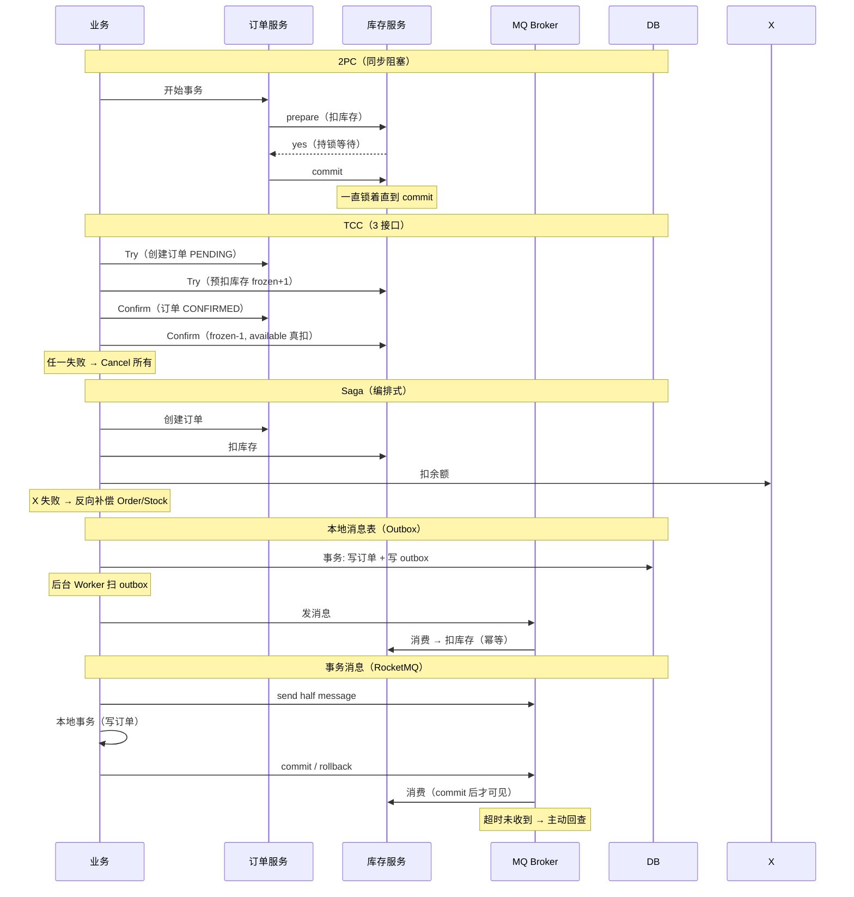

### 职责分层 / 架构定位

```
强一致（CP）阵营 - 同步阻塞:
  2PC / XA
  └── 由 DB 引擎驱动（XA 协议）
  └── 协调者是事务管理器（TM）
  └── 适用: 跨 DB 短事务、银行级别

  TCC
  └── 业务层手动实现 3 接口
  └── 协调者: Seata TC / Hmily / DTM
  └── 适用: 资金类、必须强一致

最终一致（AP）阵营 - 异步补偿:
  Saga
  └── 业务侧实现"正向 + 补偿"
  └── 编排者: 业务层（Choreography）/ 中心化（Orchestration）
  └── 适用: 长流程（订单 / 履约 / 售后）

  本地消息表（Outbox）
  └── DB 本地事务保证业务 + 消息原子
  └── Worker 异步推 MQ
  └── 适用: 跨服务通信、数据同步、所有 MQ 通用

  事务消息（RocketMQ）
  └── MQ Broker 充当协调者
  └── Half Message + 业务回查接口
  └── 适用: RocketMQ 用户的最简方案
```

### 缺一不可分析

| 假设 | 后果 |
| --- | --- |
| **没 2PC** | 跨库强一致短事务无标准方案（XA 是标准）|
| **没 TCC** | 资金类业务无法做"强一致 + 高性能"组合 |
| **没 Saga** | 长流程业务（订单状态机）退化为"全 try-catch + 手动回滚"|
| **没本地消息表** | 跨服务通信失去**通用的可靠方案**（不依赖特定 MQ）|
| **没事务消息** | RocketMQ 用户失去**最简业务接入**方式 |
| **没对账兜底** | 任何方案都不能 100% 一致，金融业务必死 |

### 怎么选（决策树 - 必背）

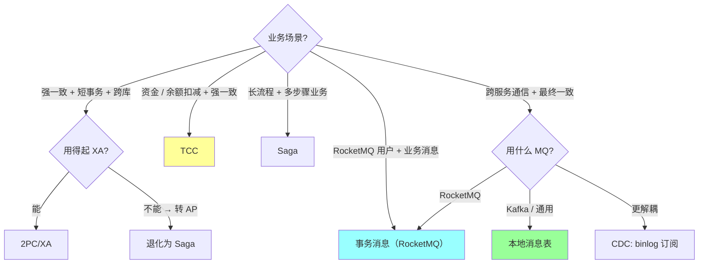

**实战推荐（业内主流）**：

| 场景 | 推荐方案 | 理由 |
| --- | --- | --- |
| 银行跨库扣账 | **TCC** | 资金 + 强一致 + 必须可控 |
| 电商下单 → 扣库存 → 减优惠券 | **Saga + 业务幂等** | 长流程 + 失败补偿 |
| 订单创建 → 发送通知 | **本地消息表 / Outbox** | 通用最简 |
| 注册成功 → 发券 / 发邮件 | **事务消息（RocketMQ）** | 业务接入最简 |
| 数据库同步到 ES / ClickHouse | **CDC（Canal/Debezium）→ Kafka** | 业务零侵入 |
| 金融严谨级别 | **多方案 + 实时对账 + T+1 对账** | 任何方案都要兜底 |

### 反模式（必避）

```
❌ 把分布式事务当"魔法"用 → 一切问题都靠分布式事务
   实际: 90% 场景"业务幂等 + 重试 + 对账"就够了

❌ 在跨服务调用上用 2PC/XA
   跨服务用 XA 几乎不可能（要求所有服务用同一协调者 + 持长事务锁）

❌ 用 TCC 处理"无法 Cancel"的业务
   例: 发短信、发邮件 → 已经发出去不能撤回
   → 应该用最大努力通知 + 对账

❌ Saga 没设计好补偿顺序
   补偿失败导致中间状态 → 业务死锁

❌ 本地消息表的消息表和业务表不在同一 DB
   两个事务 → 失去原子性 → 失去意义

❌ 事务消息的回查接口实现错
   忘记返回 commit/rollback → MQ 反复回查 → 消息卡住

❌ 没有对账系统
   金融场景任何分布式事务都不够，必须 T+1 / 实时对账兜底
```

### 业务幂等（所有方案的兜底）

```
重点: 无论哪种方案，业务侧必须幂等

实现方式:
  1. 业务唯一 ID（订单号 / 流水号）
  2. DB 唯一索引（兜底防重复插入）
  3. 状态机 + 前置条件（UPDATE WHERE status=expected）
  4. Redis SETNX 短时去重

为什么必须幂等:
  - 任何分布式事务都可能"消息重发 / 回调重试"
  - 不幂等 → 重复扣款 / 重复发货
  - 幂等让所有方案都"重试安全"
```

### 一句话总结（D 模板专属）

> 5 大分布式事务方案的核心是 **"一致性 vs 性能 vs 侵入度"三维取舍**：
> **强一致**走 2PC/TCC（同步 + 性能损失 + 侵入高）；
> **最终一致**走 Saga / 本地消息表 / 事务消息（异步 + 性能好 + 侵入小）；
> **业内主流**：80% 业务用**本地消息表 / 事务消息 + 业务幂等**，资金类用 TCC，长流程用 Saga。
> **缺一不可**：5 大方案各自不可替代（强一致 TCC 替代不了 / 长流程 Saga 替代不了 / 通用消息 Outbox 替代不了）。
> **共同基石**：**业务幂等 + 对账兜底**（没对账的分布式事务都是耍流氓）。

---

## 一、分布式事务的本质

**单机事务**：DB 提供 ACID（用 redo/undo log + 锁实现）。
**分布式事务**：跨多个数据源/服务，要么都成功要么都失败。

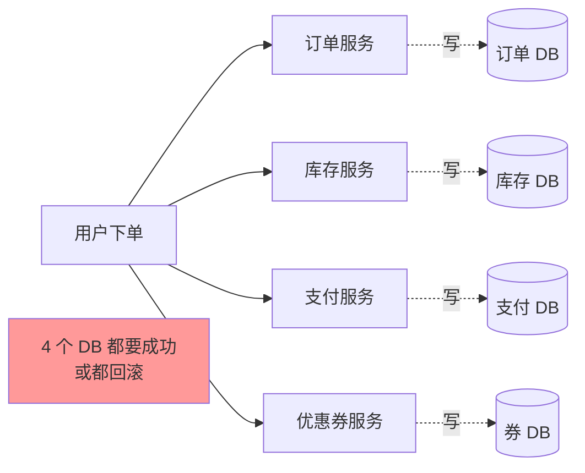

**为什么难**：
- 跨网络（任何一步可能超时/失败）
- 各 DB 不知道全局状态
- CAP 限制（强一致 vs 可用性）

## 二、方案全景

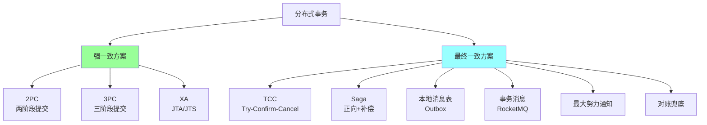

## 三、2PC（两阶段提交）

### 3.1 流程

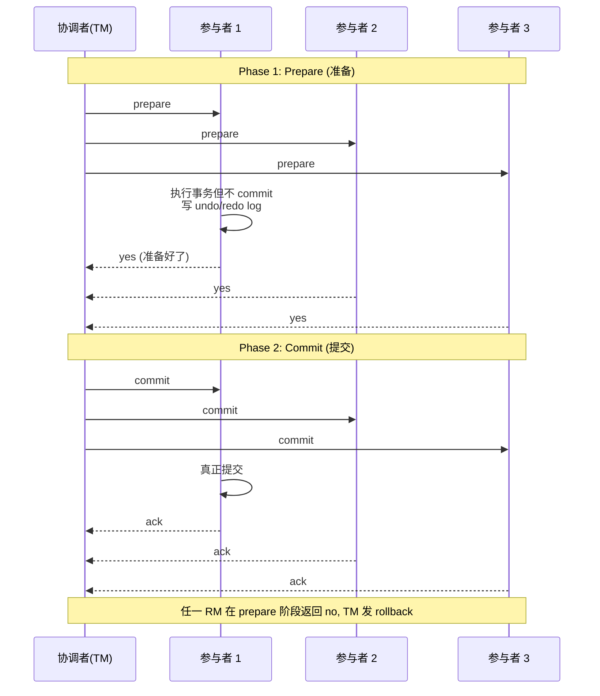

### 3.2 优缺点

**优点**：
- **强一致**
- 实现简单（依赖 DB 的 XA 接口）

**缺点**：
- **同步阻塞**：prepare 后所有 RM 持有锁等 commit
- **协调者单点**：TM 挂了，RM 不知道 commit 还是 rollback，资源被锁死
- **数据不一致**：commit 阶段部分 RM 收到、部分没收到
- **性能差**：多轮网络 + 锁等待

### 3.3 应用

- **数据库 XA 事务**：MySQL XA、Oracle XA
- **消息队列事务**：基本不用（性能差）
- **互联网生产几乎不用 2PC**

## 四、3PC（三阶段提交）

### 4.1 改进

在 2PC 前加一个 **CanCommit** 阶段（轻量询问），减少长时间锁：

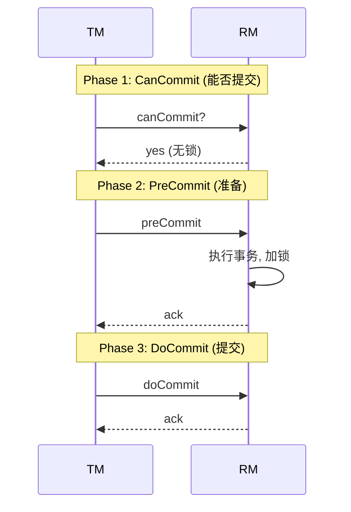

### 4.2 改进点

- **CanCommit 不加锁**：先问意愿，避免无谓的资源占用
- **超时机制**：RM 在 PreCommit 后等 doCommit 超时 → 自动 commit（假设 TM 已经决定 commit）

### 4.3 局限

- **更复杂**
- **超时假设可能错**（TM 实际决定 rollback，RM 自己 commit 了）
- **生产几乎不用**

## 五、TCC（Try-Confirm-Cancel）

### 5.1 流程

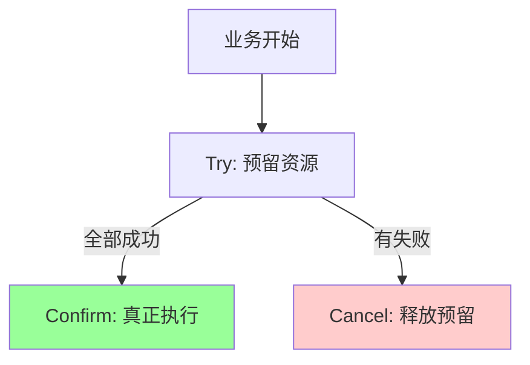

每个服务实现 3 个接口：
- **Try**：检查 + 预留资源（**冻结**而非真正修改）
- **Confirm**：真正提交（用预留资源）
- **Cancel**：取消预留（释放资源）

### 5.2 例子：转账（A→B 100 元）

```
Try:
- A: 冻结 100 元 (frozen += 100, 但 balance 不变)
- B: 预留入账记录

Confirm:
- A: balance -= 100, frozen -= 100
- B: 真正入账

Cancel:
- A: frozen -= 100 (释放冻结)
- B: 删除预留记录
```

### 5.3 关键约束

- **Try 必须可被回滚**（通过 Cancel）
- **Confirm/Cancel 必须幂等**（可能被重复调用）
- **Confirm/Cancel 必须最终成功**（重试到成功，否则数据不一致）

### 5.4 优缺点

**优点**：
- **强一致**（最终）
- **性能比 2PC 好**（Try 不长时间持锁）
- **业务可控**（应用层实现）

**缺点**：
- **业务侵入大**：每个操作要拆 3 个接口
- **开发成本高**
- **幂等设计复杂**

### 5.5 适用

- 强一致 + 高并发场景：金融、电商核心交易
- Hmily / Seata TCC 是常见实现

## 六、Saga 模式

### 6.1 思路

把长事务拆成**多个本地事务**，每个有对应**补偿操作**。任一失败时**反向执行已完成的补偿**。

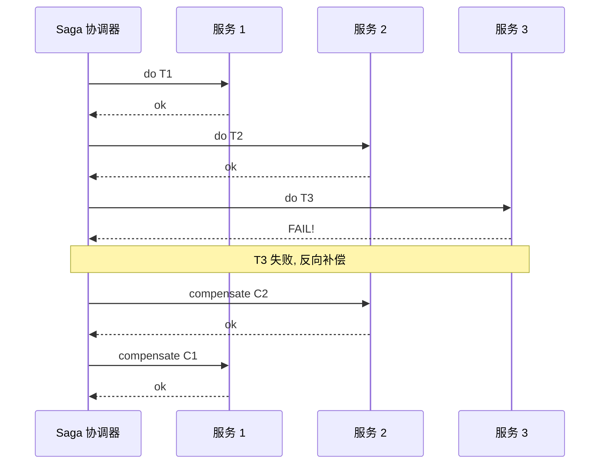

### 6.2 两种执行模式

#### 编排式（Choreography）
没有中央协调器，**事件驱动**。每个服务监听上游事件 → 执行 → 发自己的事件。


**优点**：松耦合
**缺点**：难追踪整体状态

#### 编排式（Orchestration）
有**中央协调器**（如 Camunda、Seata Saga），统一管控。

**优点**：流程清晰、可追踪
**缺点**：协调器是单点

### 6.3 vs TCC

| | Saga | TCC |
| --- | --- | --- |
| Try 阶段 | **直接执行**（不预留） | 预留资源 |
| 补偿 | 业务级反向操作 | Cancel 释放预留 |
| 中间状态 | 用户可见 | 不可见（冻结） |
| 隔离性 | 弱 | 强 |
| 适用 | 长事务（订单、物流） | 强一致（资金） |

### 6.4 例子：订单创建（Saga）

```
正向:
1. 创建订单
2. 扣库存
3. 扣款
4. 通知物流

任意失败的补偿:
4 失败 → 退款 → 加库存 → 取消订单
3 失败 → 加库存 → 取消订单
2 失败 → 取消订单
1 失败 → 直接结束
```

### 6.5 局限

- **缺乏隔离**：执行中其他事务能看到中间状态
- **补偿不一定完美**：反向操作可能也失败（补偿的补偿？）
- **业务侵入**：要为每个操作设计补偿

## 七、本地消息表（Outbox Pattern）

### 7.1 思路

利用**本地事务**保证"业务变更"和"消息发送"的原子性。

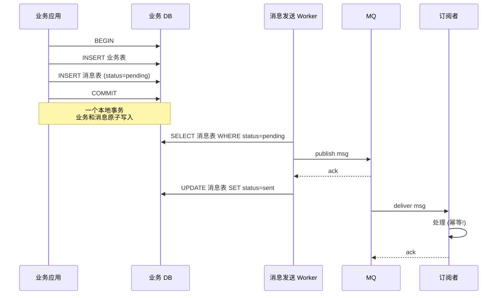

### 7.2 关键点

- 消息表和业务表**在同一 DB**（保证本地事务原子）
- Worker 定时扫描 pending 消息发到 MQ
- 失败重试（直到成功）
- 订阅者**必须幂等**

### 7.3 优缺点

**优点**：
- **简单可靠**
- 不依赖 DB 的 XA
- 业务侵入小

**缺点**：
- 消息表 IO（每次业务多写一条）
- Worker 需要定时扫描（延迟）
- 业务和消息表耦合（必须同 DB）

### 7.4 适用

最常见的最终一致方案。**互联网公司广泛使用**。

## 八、事务消息（RocketMQ 特有）

### 8.1 流程

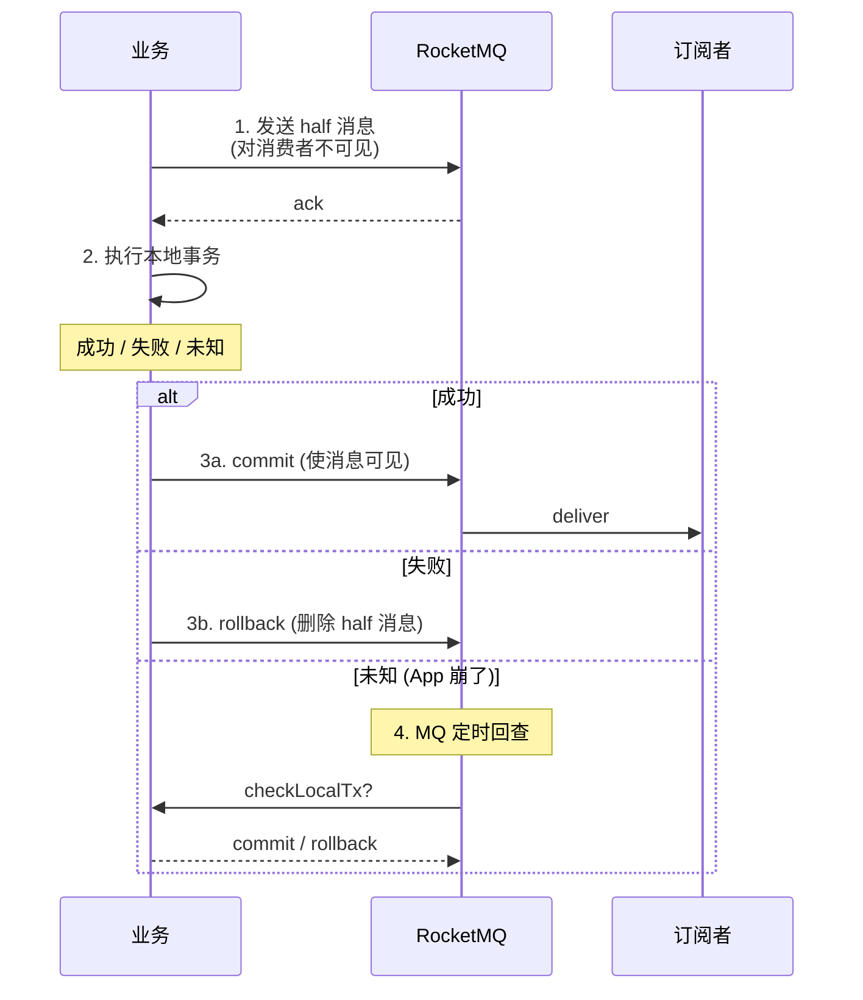

### 8.2 优势

- **不需要消息表**
- MQ 内置半消息和回查机制
- 业务代码简洁

### 8.3 适用

- 用 RocketMQ 的场景
- 不想自己维护消息表

## 九、最大努力通知

### 9.1 思路

**不保证强一致**，只保证发送方"努力通知"。常用于**对外通知**（支付回调、短信）。

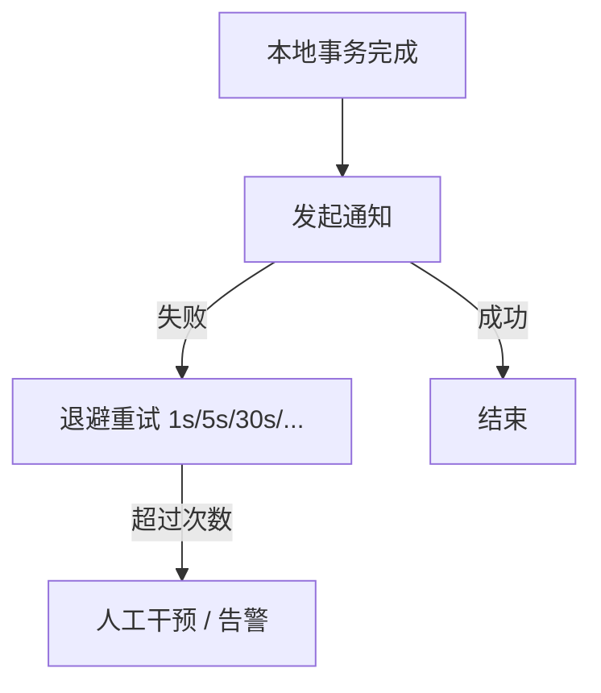

### 9.2 特点

- 对方接收方需要提供**幂等接口**
- 配套**对账机制**（兜底）
- 适合非关键路径

### 9.3 例子

- 微信/支付宝支付成功回调商户
- 订单创建后通知物流

## 十、对账兜底

### 10.1 思路

**任何分布式事务方案都不是 100% 可靠**。最终用对账（reconciliation）兜底：定时跑批，对比两个系统的数据，发现不一致 → 修复或告警。

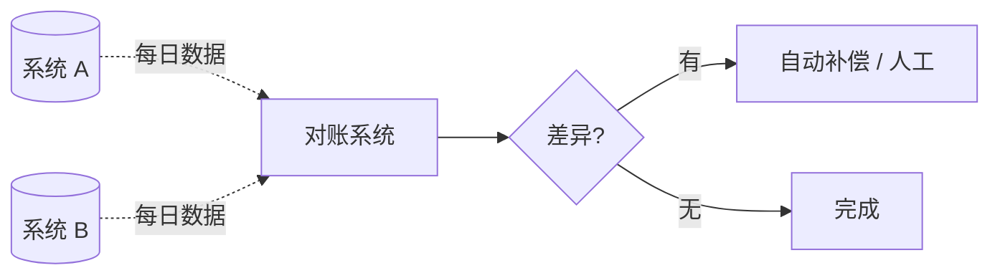

### 10.2 适用

- 金融系统（银行、支付）必须有对账
- 重要业务的最终一致兜底

## 十一、Seata 框架

阿里开源的分布式事务中间件，支持四种模式：

| 模式 | 一致性 | 业务侵入 | 适用 |
| --- | --- | --- | --- |
| **AT** (Auto Transaction) | 最终一致 | 极小 | 简单 CRUD（自动生成回滚 SQL） |
| **TCC** | 强一致 | 大 | 强一致需求（资金） |
| **Saga** | 最终一致 | 中 | 长事务（订单流程） |
| **XA** | 强一致 | 小 | 传统 DB |

**AT 模式**是 Seata 特色：通过解析 SQL 自动生成"反向 SQL"作为回滚（无需业务实现 Cancel）。

## 十二、选型决策

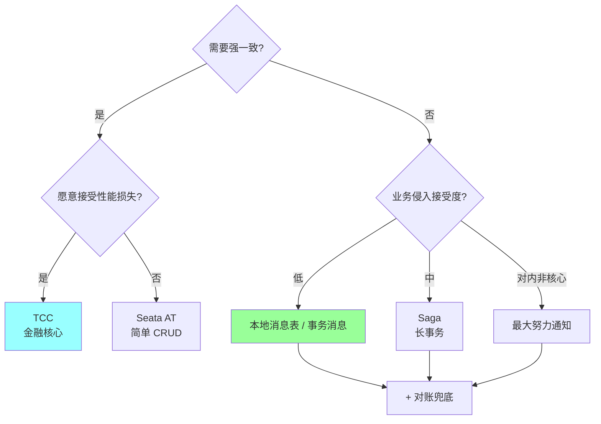

### 实战常用顺序

1. **本地消息表 + MQ + 幂等**：覆盖 80% 场景
2. **TCC**：金融、库存等强一致场景
3. **Saga**：复杂业务流程
4. **对账**：所有重要数据兜底

## 十三、踩坑

### 坑 1：以为 2PC 能解决一切

2PC 性能差 + 协调者单点 + 资源占用长。**互联网生产几乎不用**。

### 坑 2：Confirm/Cancel/补偿不幂等

```
Confirm 调用 → 网络抖动 → 重试 Confirm → 余额扣两次
```

**修复**：所有补偿/确认接口加**幂等控制**（去重表 / 状态机）。

### 坑 3：本地消息表的消息丢失

```
INSERT 业务 → INSERT 消息 → COMMIT
                                ↓
                            Worker 扫描发 MQ → 失败...
                                                  ↓
                                              status 一直 pending
                                                  ↓
                                              人工干预?
```

**修复**：失败重试 + 告警 + 时长监控。

### 坑 4：消息消费失败

订阅者处理失败 → MQ 重投 → 又失败 → 死信。

**修复**：
- 消费方加重试（带退避）
- 死信队列 → 告警 + 人工
- 业务幂等（重投不出错）

### 坑 5：补偿失败

Saga 中第 3 步失败，回退第 2 步补偿也失败 → 数据残留。

**修复**：
- 补偿无限重试（直到成功）
- 监控补偿失败 → 告警人工
- 设计阶段考虑"补偿是否一定能成功"（如已发货怎么补偿？）

### 坑 6：忽略最终一致的延迟

用户下单后立刻查订单 → 还没创建（异步）→ 体验差。

**修复**：
- 业务接受短暂不一致（前端 loading）
- 或同步部分（创建订单同步，扣款异步）

### 坑 7：补偿覆盖不全

订单流程：创建 → 库存 → 支付 → 物流。
设计了支付补偿（退款），但物流补偿（撤销）没设计 → 物流出错没法回滚到下单前。

**修复**：每一步都要有补偿设计。

### 坑 8：分布式事务取代不了对账

任何方案都有边缘 case。**重要业务必须有对账**（每天 / 每小时跑批）。

## 十四、高频面试题

**Q1：分布式事务有哪些方案？**

| 方案 | 一致性 | 性能 | 复杂度 | 适用 |
| --- | --- | --- | --- | --- |
| 2PC | 强 | 差 | 低 | 几乎不用 |
| 3PC | 强 | 中 | 中 | 几乎不用 |
| TCC | 强（最终）| 好 | 高 | 金融 |
| Saga | 最终 | 好 | 中 | 长事务 |
| 本地消息表 | 最终 | 好 | 低 | **最常用** |
| 事务消息 | 最终 | 好 | 低 | 用 RocketMQ |
| 最大努力通知 | 最终 | 极好 | 低 | 对外通知 |

**Q2：2PC 为什么生产不用？**

- **同步阻塞**：prepare 后锁资源等 commit，吞吐低
- **协调者单点**：TM 挂了 RM 不知所措
- **数据不一致风险**：commit 阶段部分成功
- **不适合服务化**：跨服务调用太重

**Q3：TCC 的核心？**

3 个接口：
- **Try**：预留资源（冻结）
- **Confirm**：真正提交
- **Cancel**：释放预留

约束：Try 可回滚、Confirm/Cancel 幂等、最终成功。

**Q4：Saga 和 TCC 区别？**

| | TCC | Saga |
| --- | --- | --- |
| 第一步 | 预留资源 | 直接执行 |
| 中间状态 | 不可见（冻结） | 可见 |
| 隔离性 | 强 | 弱 |
| 业务侵入 | 大（3 接口） | 中（补偿） |
| 适用 | 强一致（资金） | 长流程（订单） |

**Q5：本地消息表怎么实现？**

```
1. 业务 DB 加一张消息表
2. 业务事务里同时 INSERT 消息表 (status=pending)
3. Worker 定时扫描 pending → 发 MQ → 更新 status=sent
4. 订阅者幂等处理
5. 失败重试 + 死信告警
6. 配套对账兜底
```

**关键**：业务和消息表**同一个 DB**（保证本地事务原子）。

**Q6：怎么保证消息不重复消费？幂等怎么做？**

接收方加幂等控制：
- **去重表**：唯一 ID + UNIQUE 约束
- **状态机**：检查当前状态再决策（如订单 status=已付款，再付款请求直接返回 OK）
- **乐观锁**：UPDATE ... WHERE version=N
- **token / nonce**：请求带唯一 token

```sql
INSERT INTO dedup (msg_id) VALUES ('abc');  -- 唯一约束
-- 失败说明已处理过, 直接返回成功
```

**Q7：事务消息（RocketMQ）和本地消息表区别？**

| | 事务消息 | 本地消息表 |
| --- | --- | --- |
| 实现 | MQ 内置半消息 + 回查 | 业务 DB 加消息表 + Worker |
| 业务代码 | 简单 | 略复杂 |
| 依赖 | 必须 RocketMQ | 任意 MQ |
| 监控 | MQ 监控 | 自己监控 |

效果一致，看用什么 MQ。

**Q8：分布式事务能 100% 一致吗？**

**不能**。
- 网络永远可能故障
- 某些边缘 case 需要人工介入
- 真正的金融系统也是"对账兜底"补不一致

互联网业务接受**最终一致 + 对账兜底**。

**Q9：怎么设计幂等？**

策略：
1. **天然幂等**：Set 操作、删除操作（删一次和多次效果一样）
2. **业务唯一 ID**：去重表
3. **状态机**：根据当前状态决定能否执行
4. **乐观锁**：版本号
5. **分布式锁**：同时只一个执行

业务推荐**状态机 + 唯一 ID**组合。

**Q10：补偿失败了怎么办？**

补偿必须**最终成功**。失败方案：
1. **退避重试**（指数退避，最多 N 次）
2. **死信队列**（重试到上限进死信）
3. **告警**（运维介入）
4. **人工补偿**（最后手段）

设计补偿时考虑"是否可能永远失败"（如外部系统已下线）→ 人工 + 监控兜底。

## 十五、面试加分点

- **2PC 生产不用**（同步阻塞 + 协调者单点）
- 互联网首选**本地消息表 + 幂等**
- TCC 强一致但业务侵入大，金融核心场景
- Saga 适合长事务，缺隔离性
- **任何方案都需要对账兜底**
- 幂等是分布式事务的根基（不只是锁）
- 区分"协调式" Saga 和"编排式" Saga
- 事务消息是 RocketMQ 特色
- 最大努力通知配合**对方提供幂等接口**
- 业务上**先尝试避免分布式事务**（合并到单服务）
