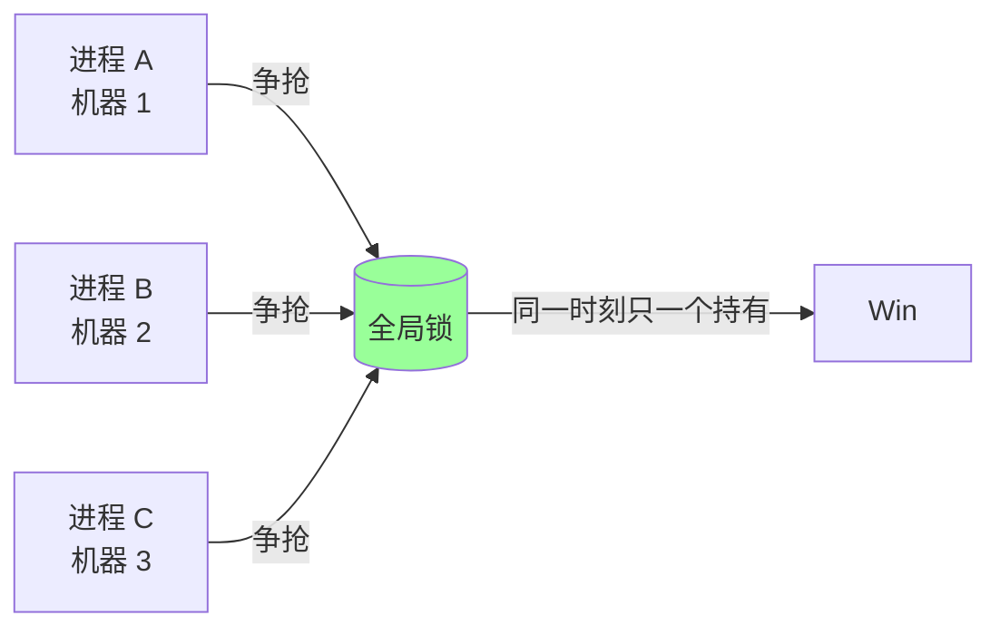
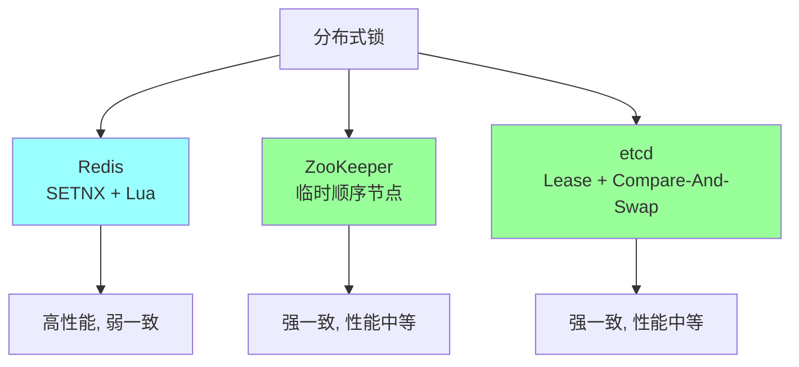
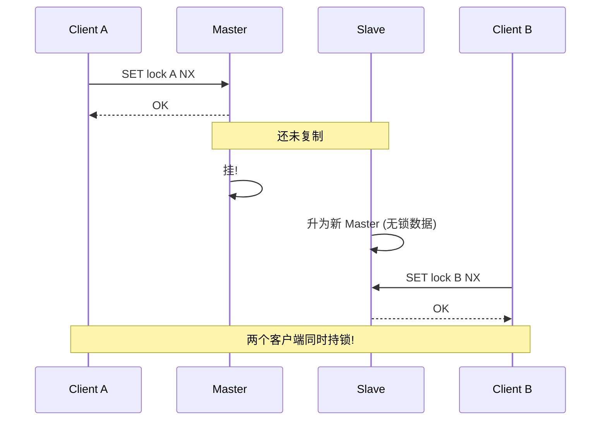
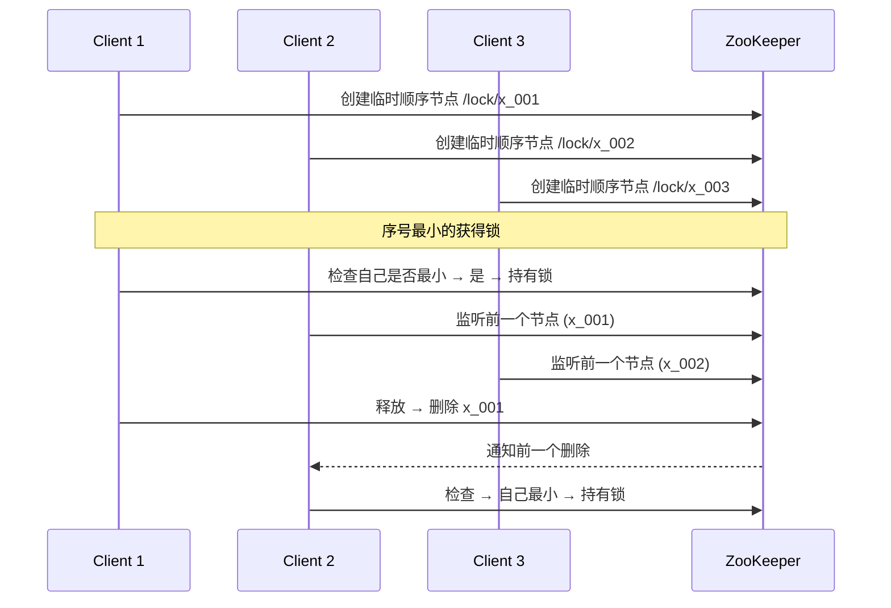
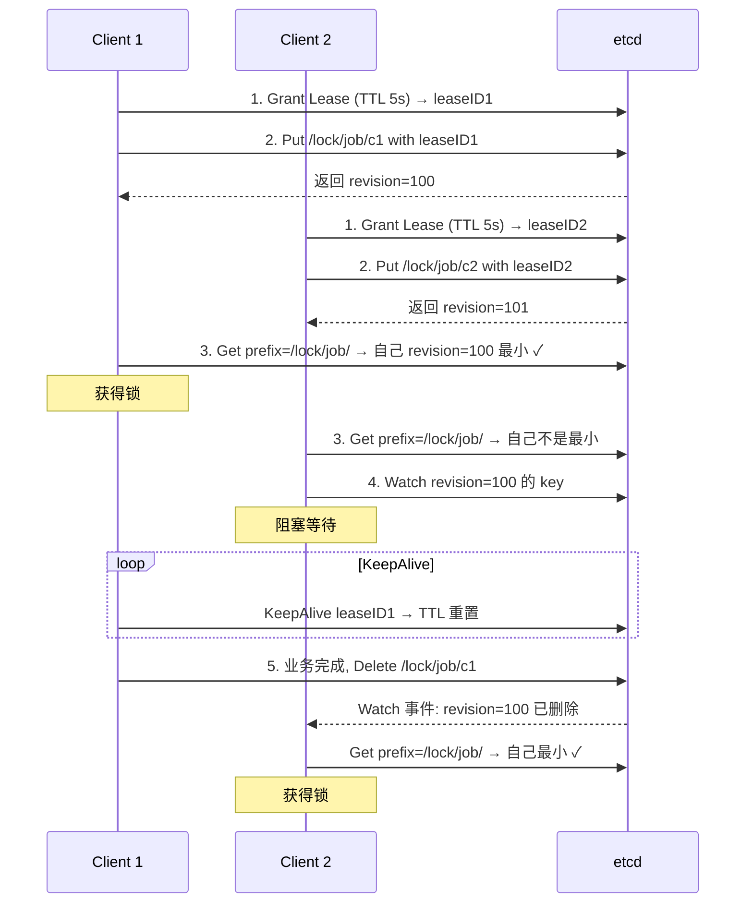
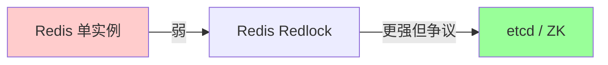
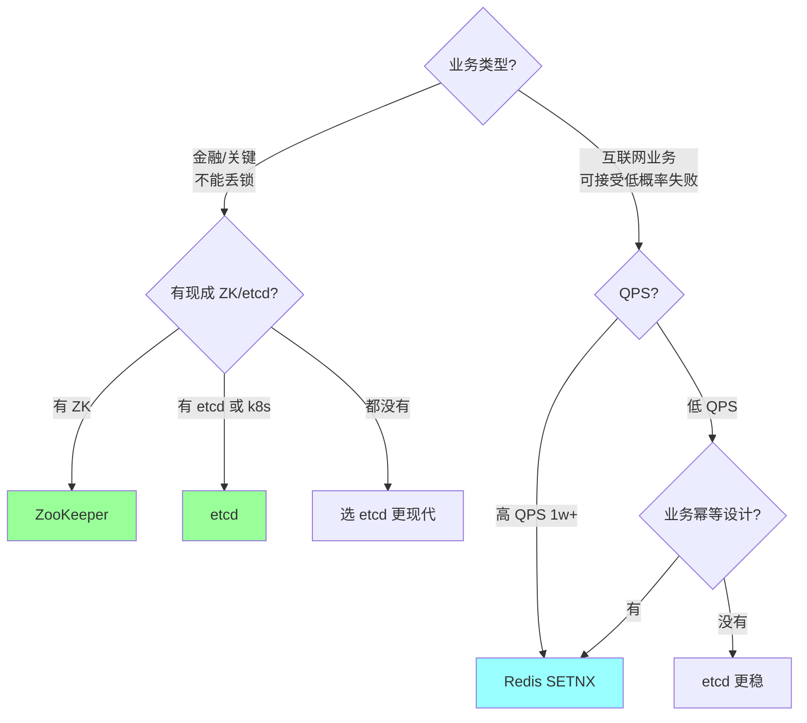
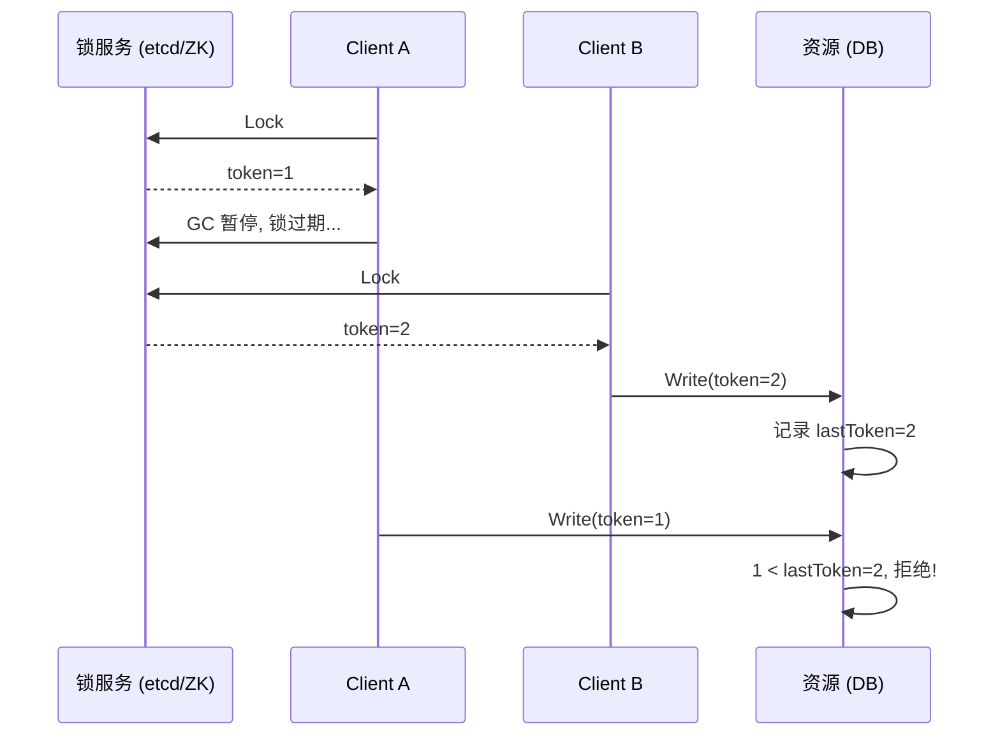

# 分布式 · 分布式锁（对比）

> Redis / ZooKeeper / etcd 三种主流实现的横向对比 / 一致性 vs 性能 / 适用场景 / 选型决策

> Redis 锁的细节实现见 `04-redis/06-distributed-lock.md`，本篇侧重**对比与选型**

## 一、为什么需要分布式锁



**典型场景**：
- **防超卖**：扣库存
- **定时任务防多跑**：多实例同时跑
- **缓存重建**：singleflight，防击穿
- **保护资源唯一性**：抢主、单点服务选举

## 二、核心要求

无论哪种实现，分布式锁都要满足：

| 特性 | 含义 |
| --- | --- |
| **互斥** | 同一时刻只一个客户端持有 |
| **防死锁** | 客户端崩溃 → 锁能自动释放 |
| **加锁解锁同主** | A 加的 B 不能解 |
| **可重入**（可选） | 同一线程多次加锁 |
| **公平**（可选） | 按申请顺序获得 |
| **可靠** | 网络故障下仍正确 |

## 三、三种主流实现



## 四、Redis 实现

### 4.1 核心机制（4 条必背）

1. **原子加锁** - `SET key value NX PX ttl`：**互斥 + 自动过期**三合一原子操作（防 SETNX + EXPIRE 两步非原子）
2. **唯一持有者标识** - `value` 是 UUID + 客户端 ID：解锁时校验，**防误解别人的锁**
3. **Lua 原子解锁** - GET 校验 + DEL 在同一个 Lua 脚本里：**防 GET 后被抢、DEL 错锁**
4. **看门狗续约** - 后台 goroutine 定时 PEXPIRE：**防业务超过 TTL 锁被自动释放**（Redisson / redsync）

### 4.2 核心本质（必懂）

> **Redis 主从是异步复制**，存在复制延迟，主从切换瞬间锁数据丢失。
> 这是 **CAP 里牺牲强一致性（C）、保证可用性（A）的必然**，不是 bug。

也就是说：Redis 分布式锁**永远不可能完美强一致**，因为 Redis 本身就是 AP 系统。

→ 要强一致 → 用 etcd / ZooKeeper（CP 系统）
→ 用 Redis 锁 → 业务必须接受**极小概率**的并发持锁 → 所以**业务幂等是兜底**

### 4.3 完整流程（面试必背）

```
1. 加锁:
   SET lock:order:123 <UUID> NX PX 30000
   - NX: 不存在才设
   - PX 30000: 30 秒超时
   - <UUID>: 唯一标识

2. 启动看门狗（业务时长不可控时）:
   后台 goroutine 每 10 秒（TTL/3）执行一次:
     EVAL "if GET == val then PEXPIRE end" → 续 30s

3. 业务执行:
   ... do work ...

4. 解锁（Lua 原子）:
   EVAL "
     if redis.call('GET', KEYS[1]) == ARGV[1] then
       return redis.call('DEL', KEYS[1])
     else
       return 0
     end
   " 1 lock:order:123 <UUID>

5. 异常路径:
   - 客户端崩溃 → 看门狗停 → TTL 到期 → 锁自动释放
   - GC 暂停 35s（TTL 30s）→ 锁过期 → 别人拿到锁 → A 恢复后 GET 校验失败 → 不会误解
   - 主从切换 → 极小概率两个客户端同时持锁 → 业务幂等兜底
```

### 4.4 三大典型问题（不是 bug，是必然代价）

#### 问题 1：主从异步复制丢锁（CAP 牺牲 C 的必然）



**根因**：Redis 主从异步复制 → CAP 选了 AP → 必然现象。

#### 问题 2：客户端 GC / 业务超时

```
T0: A 加锁 (TTL 30s)
T1: A GC 暂停 35s
T2: 锁过期, B 拿到锁
T3: A 恢复, 不知道锁丢了, 继续操作 → 业务冲突
```

**缓解**：看门狗续约 + 业务幂等。
**真正根治**：Fencing Token（见第十章）。

#### 问题 3：时钟漂移影响 TTL

不同节点时钟不一致，TTL 可能误判。Redlock 算法尤其敏感（依赖时钟同步）。

### 4.5 Redlock（多节点版）+ 争议

为防主从问题，使用 N 个**独立** Redis（不主从）多数派同意才算成功。

详见 [`../04-redis/06-distributed-lock.md`](../04-redis/06-distributed-lock.md)。

**Martin Kleppmann 批评**：
- 依赖**时钟一致性**（NTP 跳变会破坏正确性）
- 依赖**进程不暂停**（GC、虚拟机迁移会让客户端误以为还持有）
- 不比单实例 SETNX 强多少

**antirez 反驳**：时钟假设在生产合理，GC 暂停问题任何锁都有。

**结论**：Redlock 工程价值有限，业内用得不多（实现复杂、收益有限）。

### 4.6 适用场景

- ✓ **互联网业务**（容忍极低概率失败 + 业务幂等兜底）
- ✓ **高 QPS 锁竞争**（10w QPS+）
- ✓ **秒杀 / 防重复提交 / 定时任务防多实例执行**
- ✗ **金融 / 资金类强一致**（不接受任何丢锁）

### 4.7 一句话总结

> Redis 分布式锁的本质是：**SET NX PX 原子加锁 + UUID 标识 + Lua 原子解锁 + 看门狗续约**，
> 但因 Redis 主从异步复制（**CAP 牺牲 C**），主从切换瞬间会丢锁，
> 所以**适合互联网业务的"弱一致 + 高性能"场景，不适合金融 / 核心资金类强一致场景**。
> 配合**业务幂等 + Fencing Token**做兜底，是生产可用方案。

## 五、ZooKeeper 实现

### 5.1 核心机制（4 条必背）

1. **强一致性（ZAB 协议）** - 写成功 = 多数派同步完成，主从切换不丢锁
2. **临时节点（Ephemeral Node）** - 客户端会话断开 → 节点自动删除 → 锁自动释放（防死锁）
3. **顺序节点（Sequential Node）** - 每个客户端拿到全局唯一递增序号，**实现公平锁**（先来先得）
4. **Watch 监听前驱节点** - 等待时不轮询，监听上一个节点的删除事件 → **避免惊群效应**

### 5.2 核心本质（必懂）

> ZooKeeper 基于 **ZAB 协议（一种类 Paxos 共识）**，是天然的 **CP 系统**。
> 写成功 = 多数派持久化完成，主从切换**不会丢锁**。
>
> 加上"临时节点 + 会话感知"机制，客户端崩溃时节点自动清理，**比 Redis 锁更安全**。

→ 比 Redis 锁强一致：ZAB 共识保证
→ 比 etcd 锁老牌：Hadoop 生态早期标配
→ 性能比 etcd 略低（写流程更重）

### 5.3 完整流程（面试必背）



**6 步流程**：

```
1. 客户端在 /lock/<resource> 下创建临时顺序节点（如 /lock/order/x_001）
2. ZK 返回该节点的序号
3. 查询 /lock/order/ 下所有子节点，序号最小者获得锁
4. 未获得锁的客户端 watch 前驱节点（不是所有节点，避免惊群）
5. 锁释放（节点删除），下一个客户端收到事件 → 自己变最小 → 获得锁
6. 客户端崩溃 → 会话失效 → 临时节点自动删除 → 锁自动释放
```

### 5.4 4 条核心机制 - 逐点讲透

#### 1. ZAB 协议（强一致保证）

类似 Paxos / Raft 的共识算法。所有写请求由 Leader 接收，**广播到多数派持久化**后才返回成功。
主从切换由 ZAB 自动处理，**不会丢已提交的锁**。

#### 2. 临时节点（防死锁）

`CreateMode.EPHEMERAL` 创建的节点：
- 与客户端的 ZK 会话绑定
- 会话断开（崩溃 / 网络分区超时）→ ZK 自动删除节点
- 完美解决"客户端崩溃锁不释放"的死锁问题

**注意**：会话超时时间（默认 30s）影响锁释放速度。

#### 3. 顺序节点（公平锁）

`CreateMode.EPHEMERAL_SEQUENTIAL` 自动加全局唯一递增序号。
排队按序号顺序，**严格 FIFO，无饥饿**。

#### 4. Watch 监听前驱（避免惊群）

```
错误做法（惊群）:
  所有等待者都 watch 同一个锁节点
  锁释放时所有客户端被唤醒 → 重新竞争 → CPU 抖动

正确做法（链式）:
  每个客户端只 watch 前一个节点
  锁释放只唤醒下一个客户端
  → 高效、有序
```

### 5.5 优缺点

**优点**：
- 强一致（ZAB 共识）
- 天然防死锁（临时节点）
- 公平（序号）
- 会话感知（崩溃自动释放）
- 支持 watch 阻塞等待

**缺点**：
- 性能差（写走 ZAB 共识）：单集群 ~万 QPS
- 运维复杂：3 / 5 节点 ZK 集群
- 客户端会话失效检测较慢（默认 30s）
- 不适合高 QPS 场景

### 5.6 适用场景

- ✓ **不能丢锁的金融 / 关键资源**
- ✓ **低频高可靠**：选主、配置变更
- ✓ **已有 ZK 集群**（Hadoop / Kafka 生态）
- ✗ 高 QPS 场景（性能瓶颈）

### 5.7 实现示例

```java
// Java - Curator
InterProcessMutex lock = new InterProcessMutex(client, "/locks/myresource");
lock.acquire();
try {
    // do work
} finally {
    lock.release();
}
```

Go 用 `go-zookeeper/zk` 自己实现，或用 Curator-go。

### 5.8 一句话总结

> ZK 分布式锁的核心是：**基于 ZAB 强一致协议，使用临时顺序节点实现自动释放 + 公平锁，
> 通过监听前驱节点避免惊群**，会话感知保证客户端崩溃自动释放，
> 是金融 / 选主 / 关键资源场景的可靠选择，但性能和现代化 API 不如 etcd。

## 六、etcd 实现

### 6.1 核心机制（4 条必背）

1. **强一致性（Raft 协议）** - 写成功 = 多数派同步完成，**主从切换不丢锁**（解决 Redis 主从丢锁问题的根本）
2. **Lease 租约（自动过期）** - 客户端持续 KeepAlive 续约，崩溃 → Lease 到期 → key 自动删除（防死锁）
3. **Revision 全局唯一递增序号** - 每个 key 都有 revision，最小者获得锁，**实现严格公平锁（先来先得）**
4. **Prefix 前缀 + Watch 监听** - 等待者 watch 前一个 revision 的 key，锁释放即收到事件，**高效、不轮询、不惊群**

### 6.2 核心本质（必懂）

> etcd 天生强一致：**写成功 = 所有节点（多数派）同步完成**。
> 不会出现 Redis 主从切换丢锁的问题。
>
> 这是它**比 Redis 分布式锁更安全、更适合金融 / 支付 / 核心业务**的根本原因。

→ 强一致 = Raft 共识保证
→ 自动续约 = Lease KeepAlive
→ 公平锁 = Revision 全局递增
→ 高效等待 = Prefix + Watch

### 6.3 完整流程（面试必背）



**6 步流程**：

```
1. 客户端创建一个 Lease（TTL 5-30s），带 lease 创建临时 key:
   /lock/job/<client-id>

2. etcd 返回该 key 的全局 revision

3. 查询 /lock/job/ 下所有子节点:
   - revision 最小者 → 获得锁
   - 否则 → 进入等待

4. 未获得锁的客户端 watch 前一个 revision 的 key:
   - 不轮询、不浪费 CPU
   - 链式监听，避免惊群

5. 持锁期间:
   - 后台 KeepAlive 持续续约 lease
   - KeepAlive 失败 → 客户端假死，主动放弃锁

6. 释放路径:
   - 正常: Delete key
   - 异常: 客户端崩溃 → Lease 过期 → key 自动删除 → 锁自动释放
   - 下一个 watch 者收到事件 → 获得锁
```

### 6.4 4 条核心机制 - 逐点讲透

#### 1. Raft 协议（解决 Redis 主从丢锁问题）

```
Redis 主从（异步复制）:
  Master 写成功 → 立刻返回 → 还没复制到 Slave
  Master 挂 → Slave 升 → 锁丢失
  → CAP 选 AP，必然现象

etcd Raft:
  Leader 写 → 同步到多数派 → 多数派持久化后才返回成功
  Leader 挂 → Raft 选新 Leader → 已提交的锁不会丢
  → CAP 选 CP
```

**本质**：写入语义不同。Redis 是"快但弱一致"，etcd 是"慢但强一致"。

#### 2. Lease 租约：锁自动释放，避免死锁

```
Lease (Time To Live)：
  客户端创建锁时绑定一个 Lease（如 TTL = 5s）
  客户端必须持续 KeepAlive（每 1-2s 一次）

正常情况:
  KeepAlive 成功 → TTL 不断重置 → 锁持有

异常情况:
  客户端崩溃 / 网络断 → KeepAlive 停止
  → 5s 后 Lease 到期
  → etcd 自动删除所有绑定该 Lease 的 key
  → 锁自动释放
```

**完美解决**："客户端崩溃锁卡死"问题，无需 Redis 看门狗那种侵入性方案。

#### 3. Revision 全局唯一递增序号：实现公平锁

```
etcd 内部维护一个全局 revision 计数器:
  - 每次写入 → revision++
  - 全局唯一、严格递增
  - 不会重复

抢锁时:
  - 大家都创建 /lock/job/ 下的子节点
  - 各自拿到不同的 revision（如 c1=100, c2=101, c3=102）
  - revision 最小者获得锁
  - 等待者按 revision 排队

→ 严格公平 FIFO，不会出现饥饿
```

#### 4. Prefix 前缀 + Watch 监听：高效等待锁

```
etcd 的 Watch 是事件驱动的:
  客户端注册 watch → 服务端推送事件 → 客户端收到 → 处理

锁等待场景:
  - C2（revision=101）watch revision=100 的 key
  - C1 释放锁（删除 key）
  - etcd 推送 DELETE 事件给 C2
  - C2 收到 → 重新查询 prefix → 自己最小 → 获得锁

优势:
  ✓ 不轮询（节省 CPU 和网络）
  ✓ 实时（事件级延迟）
  ✓ 不惊群（链式监听，每次只唤醒下一个）
```

### 6.5 优缺点

**优点**：
- 强一致（Raft）
- 天然防死锁（Lease 自动过期）
- 天然续约（KeepAlive 持续保持）
- 公平锁（Revision）
- 高效等待（Prefix + Watch）
- API 现代化（txn / compare-and-swap / lease）
- k8s 生态原生

**缺点**：
- 性能中等（不如 Redis，比 ZK 略好）：~万 QPS
- 运维复杂：etcd 集群（3 / 5 / 7 节点）
- 学习曲线（API 比 ZK 多）

### 6.6 适用场景

- ✓ **k8s 生态内**（k8s 本身用 etcd）
- ✓ **金融 / 支付 / 核心业务**（强一致）
- ✓ **公平锁需求**（Revision 天然支持）
- ✓ **跨数据中心场景**（Raft 容灾好）
- ✗ 极高 QPS 场景（用 Redis）

### 6.7 实现示例

```go
import "go.etcd.io/etcd/client/v3/concurrency"

// 1. 创建 session（绑定 lease）
session, _ := concurrency.NewSession(client, concurrency.WithTTL(30))
defer session.Close()  // 会撤销 lease，释放锁

// 2. 创建 mutex
mu := concurrency.NewMutex(session, "/lock/myresource")

// 3. 加锁（会阻塞直到获得）
if err := mu.Lock(ctx); err != nil {
    return err
}
defer mu.Unlock(ctx)

// 4. 业务逻辑
// ... do work ...
```

`concurrency` 包内部已经处理了 Lease / Revision / Watch，开箱即用。

### 6.8 一句话总结

> etcd 分布式锁的核心是：**基于 Raft 强一致性，使用 Lease 实现自动过期，
> 通过全局唯一 Revision 实现公平锁，利用 Prefix + Watch 实现高效等待**，
> **完全解决了 Redis 主从复制丢锁的问题**，是生产上**最可靠的分布式锁实现**，
> 适合金融 / 支付 / k8s 生态等强一致场景。

## 七、横向对比

### 7.1 综合表

| 维度 | Redis | ZooKeeper | etcd |
| --- | --- | --- | --- |
| **一致性** | 弱（主从异步） | 强（ZAB） | 强（Raft） |
| **性能** | **极高**（10w+） | 中（~1w） | 中（~1w） |
| **可用性** | 高 | 中（多数派要在） | 中（多数派要在） |
| **防死锁** | TTL | 临时节点 | Lease |
| **续约** | 看门狗（自实现） | 会话心跳（自动） | KeepAlive（自动） |
| **公平锁** | 复杂（要队列） | 天然（顺序节点） | 自实现 |
| **可重入** | 复杂（要 Hash 计数） | Curator 支持 | 自实现 |
| **运维** | 简单 | 复杂 | 复杂 |
| **生态** | 极好 | 老牌成熟 | 现代（k8s 系） |
| **适用** | 大多数业务 | 强一致 + 已有 ZK | 强一致 + k8s 生态 |

### 7.2 性能对比（粗略）

```
Redis     单实例 ~10w QPS
etcd      集群 ~1w QPS
ZooKeeper 集群 ~5k QPS
```

QPS 差 1~2 个数量级。

### 7.3 一致性对比



## 八、选型决策树



### 实战建议

- **互联网常规业务**：Redis SETNX + 业务幂等（兜底）
- **金融 / 强一致**：etcd / ZooKeeper
- **k8s 内部应用**：etcd（已经在用）
- **大数据生态**：ZooKeeper（Hadoop / Kafka 在用）

## 九、防御性设计：业务幂等是兜底

**任何分布式锁都不能 100% 防异常**：
- Redis 主从切换丢锁
- 客户端 GC 暂停超过 TTL
- 网络分区导致脑裂
- ZK/etcd 集群整体故障

**唯一可靠的兜底**：**业务幂等设计**。

```go
// 即使锁失效, 多个 client 都执行, 也不会出错
func deduct(orderID string, amount int) error {
    // 检查订单状态（幂等）
    order := db.Get(orderID)
    if order.Status == "paid" {
        return nil  // 已扣过, 直接返回成功
    }

    // 用唯一 ID + DB 行锁
    db.Begin()
    defer db.Commit()
    db.Update("UPDATE orders SET status='paid' WHERE id=? AND status='unpaid'", orderID)
    db.Update("UPDATE balance SET amount=amount-? WHERE user_id=?", amount, userID)
}
```

**先想能不能业务幂等，能就不用分布式锁**。

## 十、栅栏 token（Fencing Token）

### 10.1 问题

```
T0: A 拿到锁, token=1
T1: A GC 暂停, 锁过期
T2: B 拿到锁, token=2
T3: A 恢复, 不知道锁丢了, 调用资源
T4: B 调用资源
→ 资源同时被两个调用?
```

### 10.2 方案

**资源服务**根据 token 单调递增校验：



资源服务保留 lastToken，**拒绝 token 小于等于 lastToken 的请求**。

### 10.3 局限

- 资源服务必须支持 token 校验
- 适合数据库写入（用 version 字段）
- 不适合外部不可控资源（HTTP 调用）

## 十一、典型坑

### 坑 1：用 SETNX 但忘记 TTL

```bash
SETNX lock 1   # 没 TTL, 客户端崩溃 = 死锁
```

**修复**：`SET lock 1 NX PX 30000`。

### 坑 2：解锁不验证持有者

```bash
DEL lock   # 删了别人的!
```

**修复**：Lua 检查 value + DEL。

### 坑 3：业务时长不可控不用看门狗

```
TTL=10s, 业务 30s → 第 10s 锁过期, 别人拿到
```

**修复**：看门狗续约（每 TTL/3 续）+ 业务幂等。

### 坑 4：以为分布式锁能保证强一致

任何分布式锁都不能 100%。**业务必须幂等**。

### 坑 5：ZK 客户端会话失效检测晚

ZK 客户端断网，sessionTimeout=30s 后才被 ZK 删节点 → 这 30s 内别人拿不到锁。

**修复**：合理设 sessionTimeout（通常 10~30s）。

### 坑 6：etcd lease 续约失败被忽略

KeepAlive 失败客户端没处理 → 实际锁已过期但客户端以为还持有。

**修复**：监听 KeepAlive 错误，发现失效立即停止业务。

### 坑 7：Redlock 时钟问题

不同 Redis 节点时钟不一致 → TTL 计算错乱。**生产用 NTP 同步 + 容忍误差**。

## 十二、高频面试题

**Q1：Redis / ZK / etcd 分布式锁怎么选？**

| 场景 | 推荐 |
| --- | --- |
| 互联网常规业务 | **Redis**（高性能） |
| 金融 / 强一致 | **etcd / ZK** |
| k8s 内部 | **etcd** |
| Hadoop / Kafka 生态 | **ZooKeeper** |
| 已有的中间件 | 用现有 |

**Q2：Redis 分布式锁的缺陷？**

1. **主从异步复制丢锁**：主挂从顶上没锁数据
2. **客户端 GC / 业务超时**：锁过期被别人拿
3. **时钟漂移**：影响 TTL 判断
4. **不公平**：高竞争下饿死部分客户端

**应对**：业务幂等 + 看门狗 + Redlock（争议）。

**Q3：ZK 分布式锁怎么实现？**

```
1. 在 /lock 下创建临时顺序节点 /lock/x_001
2. 获取 /lock 下所有节点, 检查自己是否最小
3. 是 → 持有锁
   不是 → 监听比自己小一号的节点 (前驱)
4. 收到前驱删除通知 → 重复 2
5. 释放: 删除自己的节点 (会话断开自动删)
```

**关键**：临时节点防死锁，顺序节点防惊群（只监听前驱）。

**Q4：etcd 分布式锁怎么实现？**

```
1. Grant Lease (TTL 30s) → leaseID
2. Put key=lock value=clientID with leaseID, condition: 不存在
3. 成功 → 持锁; 失败 → 监听 key 变化, 收到 delete 后重试
4. 持锁期间 KeepAlive 续约
5. 释放: Delete key (或客户端断开 lease 过期自动删)
```

**关键**：Lease 防死锁 + KeepAlive 续约。

**Q5：为什么 ZK 锁性能不如 Redis？**

ZK 写操作要走 **ZAB 共识**（多数派同意），每次加锁 = 创建节点 = 写。共识需要多轮 RPC + 持久化，单集群 ~5k QPS。

Redis 单实例无共识，写操作 ns 级，~10w+ QPS。

**Q6：Redlock 是什么？为什么有争议？**

Redlock：在 N 个独立 Redis 上加锁，多数派成功才算获取。解决主从切换丢锁。

争议（Kleppmann）：依赖时钟同步 + 客户端不暂停。极端情况仍可能多人持锁。

**实际**：互联网业务 SETNX 已够（接受低概率失败 + 业务幂等）。

**Q7：客户端 GC 暂停超过 TTL 怎么办？**

任何分布式锁都不能完美防御。三层兜底：

1. **看门狗续约**：减少超时概率
2. **业务幂等**：即使锁失效重复执行也不出错
3. **栅栏 token**：资源服务校验单调递增 token

**Q8：分布式锁能 100% 保证互斥吗？**

**不能**。
- Redis：主从、GC、时钟问题
- ZK / etcd：会话过期可能延迟，集群整体故障

**业务幂等是唯一可靠的兜底**。

**Q9：可重入锁怎么实现？**

需要记录"持有者 + 重入次数"。Redis 用 Hash：

```lua
if not exists or owner == self then
    HINCRBY count 1
    HSET owner self
    PEXPIRE ttl
    return 1
end
return 0
```

释放时 count-1，归零再 DEL。

**Q10：公平锁怎么实现？**

ZK 天然公平（顺序节点 + 监听前驱）。
Redis 需要队列（List/ZSet）维护申请顺序，复杂。

实战很少需要公平锁（公平 = 慢）。

## 十三、面试加分点

- 区分"性能"和"一致性"是核心 trade-off
- 强调"任何分布式锁都不能 100% 互斥，业务幂等是兜底"
- 知道 Redis 主从异步复制是根本问题
- ZK 临时顺序节点 + 监听前驱（不是所有都监听同一节点，防惊群）
- etcd Lease + KeepAlive 是现代设计
- 栅栏 token 解决 GC 暂停问题
- Redlock 争议（Kleppmann vs antirez）
- 选型从"业务能否容忍丢锁"切入
- 提到 Curator（ZK）/ go-redsync（Redis）/ etcd concurrency 包
- **能用业务幂等避免锁就不用锁**
