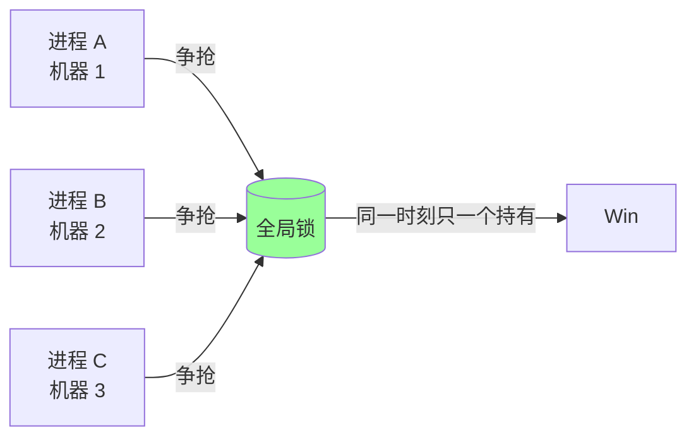
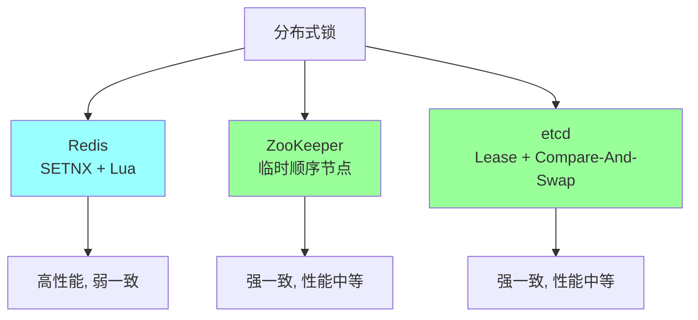
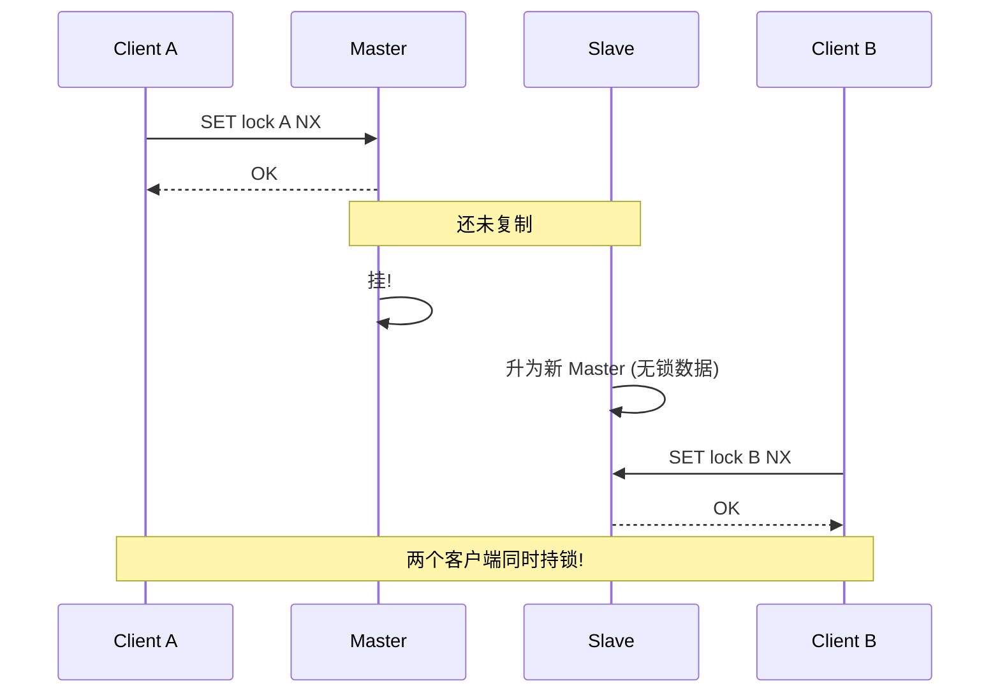
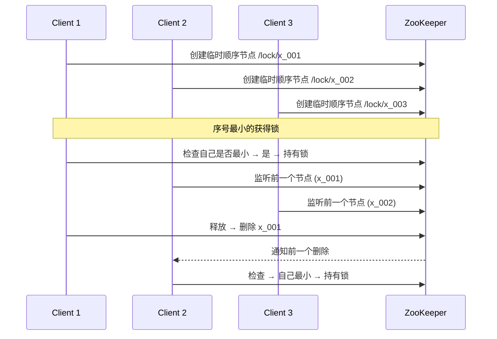
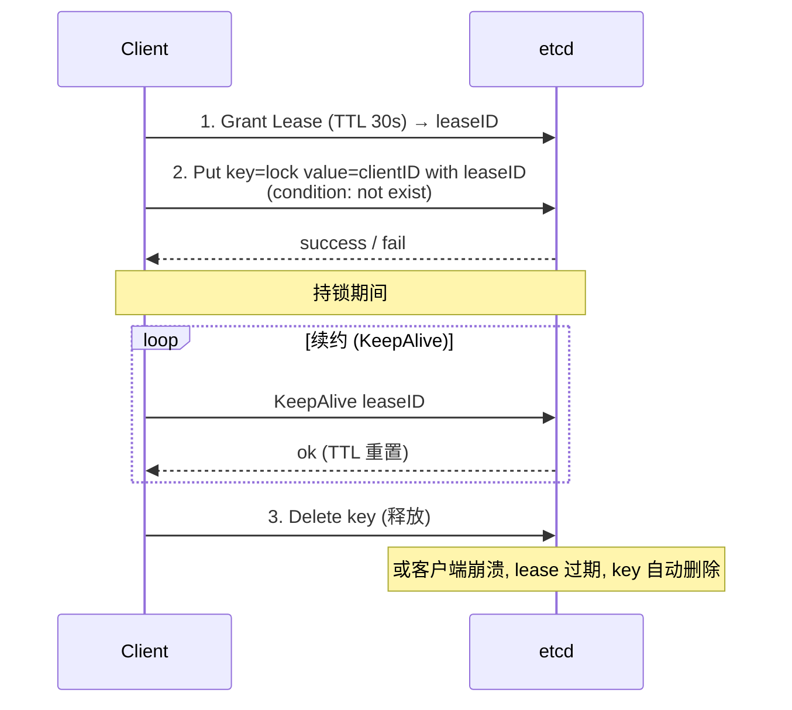
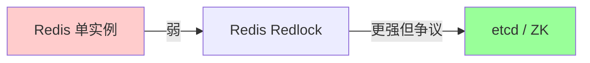
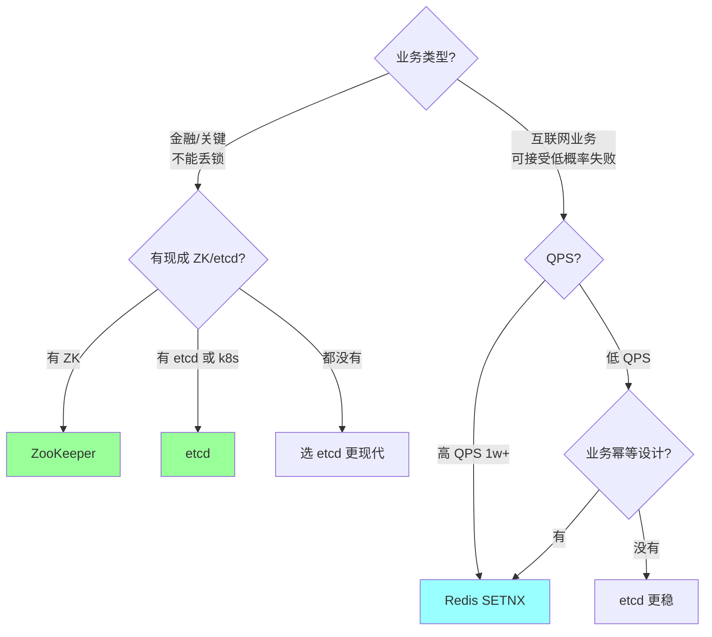
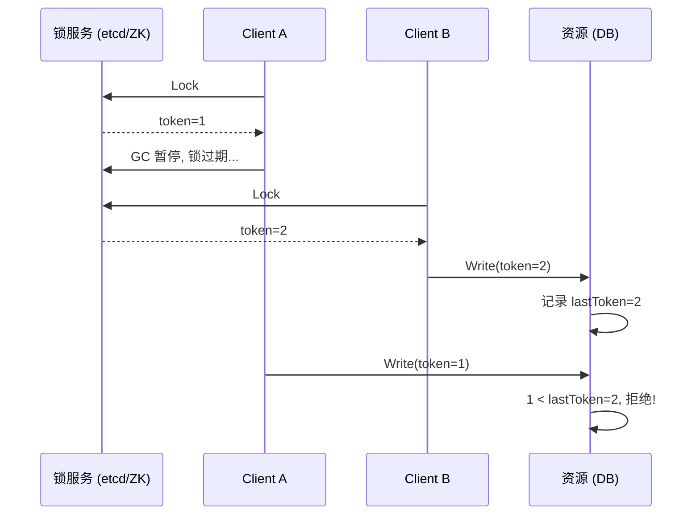

# 分布式 · 分布式锁（对比）

> Redis / ZooKeeper / etcd 三种主流实现的横向对比 / 一致性 vs 性能 / 适用场景 / 选型决策

> Redis 锁的细节实现见 `04-redis/06-distributed-lock.md`，本篇侧重**对比与选型**

## 一、为什么需要分布式锁



**典型场景**：
- **防超卖**：扣库存
- **定时任务防多跑**：多实例同时跑
- **缓存重建**：singleflight，防击穿
- **保护资源唯一性**：抢主、单点服务选举

## 二、核心要求

无论哪种实现，分布式锁都要满足：

| 特性 | 含义 |
| --- | --- |
| **互斥** | 同一时刻只一个客户端持有 |
| **防死锁** | 客户端崩溃 → 锁能自动释放 |
| **加锁解锁同主** | A 加的 B 不能解 |
| **可重入**（可选） | 同一线程多次加锁 |
| **公平**（可选） | 按申请顺序获得 |
| **可靠** | 网络故障下仍正确 |

## 三、三种主流实现



## 四、Redis 实现

### 4.1 核心命令

```bash
SET lock <unique_id> NX PX 30000   # 加锁: 原子
EVAL "if GET == val then DEL"      # 解锁: Lua 原子
```

### 4.2 优点

- **性能极高**（单 redis 10w+ QPS）
- **实现简单**
- 生态成熟（Redisson、redsync）

### 4.3 缺点（关键）

#### 缺点 1：主从异步复制丢锁



#### 缺点 2：客户端 GC / 业务超时

```
T0: A 加锁 (TTL 30s)
T1: A GC 暂停 35s
T2: 锁过期, B 拿到锁
T3: A 恢复, 不知道锁丢了, 继续操作 → 业务冲突
```

**缓解**：看门狗续约 + 业务幂等。

#### 缺点 3：时钟漂移影响 TTL

不同节点时钟不一致，TTL 可能误判。

### 4.4 Redlock（多节��）

为防主从问题，使用 N 个独立 Redis（不主从），多数派同意才算成功。

详见 `04-redis/06-distributed-lock.md`。

**争议**：依赖时钟同步 + 客户端不暂停，不比单实例强多少（Martin Kleppmann 批评）。

### 4.5 适用

- **大多数业务场景**（互联网允许低概率失败）
- 高 QPS 锁竞争

## 五、ZooKeeper 实现

### 5.1 核心机制：临时顺序节点



### 5.2 关键性质

- **临时节点**：客户端断开 → 节点自动删除（防死锁）
- **顺序节点**：每个 client 拿到唯一递增序号
- **监听前驱**：避免"惊群效应"（不是所有客户端监听同一节点）

### 5.3 优点

- **强一致**（基于 ZAB 共识）
- **天然防死锁**（临时节点）
- **公平**（序号决定）
- **会话感知**（崩溃自动释放）
- **支持 watch**：阻塞等待锁释放

### 5.4 缺点

- **性能差**（写操作走 ZAB 共识，慢）：单集群 ~万 QPS
- **运维复杂**：需要 ZK 集群（一般 3 或 5 节点）
- **不适合高 QPS 场景**

### 5.5 适用

- **不能丢锁的场景**（金融、关键资源）
- **低频高可靠**：选主、配置变更
- **已有 ZK 集群**

### 5.6 实现：Curator

```java
InterProcessMutex lock = new InterProcessMutex(client, "/locks/myresource");
lock.acquire();
try {
    // do work
} finally {
    lock.release();
}
```

Go 用 `go-zookeeper/zk` 自己实现，或用 Curator-go。

## 六、etcd 实现

### 6.1 核心机制：Lease + Compare-And-Swap



### 6.2 优点

- **强一致**（基于 Raft）
- **天然防死锁**（Lease 自动过期）
- **天然续约**（KeepAlive 持续保持）
- **API 现代**：watch、txn、compare-and-swap

### 6.3 缺点

- **性能中等**（不如 Redis，比 ZK 略好）：~万 QPS
- **运维复杂**：etcd 集群

### 6.4 适用

- **k8s 生态内**（k8s 本身用 etcd）
- 强一致 + 现代 API
- 配合 Raft 强一致需求

### 6.5 实现示例

```go
import "go.etcd.io/etcd/client/v3/concurrency"

session, _ := concurrency.NewSession(client, concurrency.WithTTL(30))
defer session.Close()

mu := concurrency.NewMutex(session, "/lock/myresource")
mu.Lock(ctx)
defer mu.Unlock(ctx)
// do work
```

`concurrency` 包提供高层 API。

## 七、横向对比

### 7.1 综合表

| 维度 | Redis | ZooKeeper | etcd |
| --- | --- | --- | --- |
| **一致性** | 弱（主从异步） | 强（ZAB） | 强（Raft） |
| **性能** | **极高**（10w+） | 中（~1w） | 中（~1w） |
| **可用性** | 高 | 中（多数派要在） | 中（多数派要在） |
| **防死锁** | TTL | 临时节点 | Lease |
| **续约** | 看门狗（自实现） | 会话心跳（自动） | KeepAlive（自动） |
| **公平锁** | 复杂（要队列） | 天然（顺序节点） | 自实现 |
| **可重入** | 复杂（要 Hash 计数） | Curator 支持 | 自实现 |
| **运维** | 简单 | 复杂 | 复杂 |
| **生态** | 极好 | 老牌成熟 | 现代（k8s 系） |
| **适用** | 大多数业务 | 强一致 + 已有 ZK | 强一致 + k8s 生态 |

### 7.2 性能对比（粗略）

```
Redis     单实例 ~10w QPS
etcd      集群 ~1w QPS
ZooKeeper 集群 ~5k QPS
```

QPS 差 1~2 个数量级。

### 7.3 一致性对比



## 八、选型决策树



### 实战建议

- **互联网常规业务**：Redis SETNX + 业务幂等（兜底）
- **金融 / 强一致**：etcd / ZooKeeper
- **k8s 内部应用**：etcd（已经在用）
- **大数据生态**：ZooKeeper（Hadoop / Kafka 在用）

## 九、防御性设计：业务幂等是兜底

**任何分布式锁都不能 100% 防异常**：
- Redis 主从切换丢锁
- 客户端 GC 暂停超过 TTL
- 网络分区导致脑裂
- ZK/etcd 集群整体故障

**唯一可靠的兜底**：**业务幂等设计**。

```go
// 即使锁失效, 多个 client 都执行, 也不会出错
func deduct(orderID string, amount int) error {
    // 检查订单状态（幂等）
    order := db.Get(orderID)
    if order.Status == "paid" {
        return nil  // 已扣过, 直接返回成功
    }

    // 用唯一 ID + DB 行锁
    db.Begin()
    defer db.Commit()
    db.Update("UPDATE orders SET status='paid' WHERE id=? AND status='unpaid'", orderID)
    db.Update("UPDATE balance SET amount=amount-? WHERE user_id=?", amount, userID)
}
```

**先想能不能业务幂等，能就不用分布式锁**。

## 十、栅栏 token（Fencing Token）

### 10.1 问题

```
T0: A 拿到锁, token=1
T1: A GC 暂停, 锁过期
T2: B 拿到锁, token=2
T3: A 恢复, 不知道锁丢了, 调用资源
T4: B 调用资源
→ 资源同时被两个调用?
```

### 10.2 方案

**资源服务**根据 token 单调递增校验：



资源服务保留 lastToken，**拒绝 token 小于等于 lastToken 的请求**。

### 10.3 局限

- 资源服务必须支持 token 校验
- 适合数据库写入（用 version 字段）
- 不适合外部不可控资源（HTTP 调用）

## 十一、典型坑

### 坑 1：用 SETNX 但忘记 TTL

```bash
SETNX lock 1   # 没 TTL, 客户端崩溃 = 死锁
```

**修复**：`SET lock 1 NX PX 30000`。

### 坑 2：解锁不验证持有者

```bash
DEL lock   # 删了别人的!
```

**修复**：Lua 检查 value + DEL。

### 坑 3：业务时长不可控不用看门狗

```
TTL=10s, 业务 30s → 第 10s 锁过期, 别人拿到
```

**修复**：看门狗续约（每 TTL/3 续）+ 业务幂等。

### 坑 4：以为分布式锁能保证强一致

任何分布式锁都不能 100%。**业务必须幂等**。

### 坑 5：ZK 客户端会话失效检测晚

ZK 客户端断网，sessionTimeout=30s 后才被 ZK 删节点 → 这 30s 内别人拿不到锁。

**修复**：合理设 sessionTimeout（通常 10~30s）。

### 坑 6：etcd lease 续约失败被忽略

KeepAlive 失败客户端没处理 → 实际锁已过期但客户端以为还持有。

**修复**：监听 KeepAlive 错误，发现失效立即停止业务。

### 坑 7：Redlock 时钟问题

不同 Redis 节点时钟不一致 → TTL 计算错乱。**生产用 NTP 同步 + 容忍误差**。

## 十二、高频面试题

**Q1：Redis / ZK / etcd 分布式锁怎么选？**

| 场景 | 推荐 |
| --- | --- |
| 互联网常规业务 | **Redis**（高性能） |
| 金融 / 强一致 | **etcd / ZK** |
| k8s 内部 | **etcd** |
| Hadoop / Kafka 生态 | **ZooKeeper** |
| 已有的中间件 | 用现有 |

**Q2：Redis 分布式锁的缺陷？**

1. **主从异步复制丢锁**：主挂从顶上没锁数据
2. **客户端 GC / 业务超时**：锁过期被别人拿
3. **时钟漂移**：影响 TTL 判断
4. **不公平**：高竞争下饿死部分客户端

**应对**：业务幂等 + 看门狗 + Redlock（争议）。

**Q3：ZK 分布式锁怎么实现？**

```
1. 在 /lock 下创建临时顺序节点 /lock/x_001
2. 获取 /lock 下所有节点, 检查自己是否最小
3. 是 → 持有锁
   不是 → 监听比自己小一号的节点 (前驱)
4. 收到前驱删除通知 → 重复 2
5. 释放: 删除自己的节点 (会话断开自动删)
```

**关键**：临时节点防死锁，顺序节点防惊群（只监听前驱）。

**Q4：etcd 分布式锁怎么实现？**

```
1. Grant Lease (TTL 30s) → leaseID
2. Put key=lock value=clientID with leaseID, condition: 不存在
3. 成功 → 持锁; 失败 → 监听 key 变化, 收到 delete 后重试
4. 持锁期间 KeepAlive 续约
5. 释放: Delete key (或客户端断开 lease 过期自动删)
```

**关键**：Lease 防死锁 + KeepAlive 续约。

**Q5：为什么 ZK 锁性能不如 Redis？**

ZK 写操作要走 **ZAB 共识**（多数派同意），每次加锁 = 创建节点 = 写。共识需要多轮 RPC + 持久化，单集群 ~5k QPS。

Redis 单实例无共识，写操作 ns 级，~10w+ QPS。

**Q6：Redlock 是什么？为什么有争议？**

Redlock：在 N 个独立 Redis 上加锁，多数派成功才算获取。解决主从切换丢锁。

争议（Kleppmann）：依赖时钟同步 + 客户端不暂停。极端情况仍可能多人持锁。

**实际**：互联网业务 SETNX 已够（接受低概率失败 + 业务幂等）。

**Q7：客户端 GC 暂停超过 TTL 怎么办？**

任何分布式锁都不能完美防御。三层兜底：

1. **看门狗续约**：减少超时概率
2. **业务幂等**：即使锁失效重复执行也不出错
3. **栅栏 token**：资源服务校验单调递增 token

**Q8：分布式锁能 100% 保证互斥吗？**

**不能**。
- Redis：主从、GC、时钟问题
- ZK / etcd：会话过期可能延迟，集群整体故障

**业务幂等是唯一可靠的兜底**。

**Q9：可重入锁怎么实现？**

需要记录"持有者 + 重入次数"。Redis 用 Hash：

```lua
if not exists or owner == self then
    HINCRBY count 1
    HSET owner self
    PEXPIRE ttl
    return 1
end
return 0
```

释放时 count-1，归零再 DEL。

**Q10：公平锁怎么实现？**

ZK 天然公平（顺序节点 + 监听前驱）。
Redis 需要队列（List/ZSet）维护申请顺序，复杂。

实战很少需要公平锁（公平 = 慢）。

## 十三、面试加分点

- 区分"性能"和"一致性"是核心 trade-off
- 强调"任何分布式锁都不能 100% 互斥，业务幂等是兜底"
- 知道 Redis 主从异步复制是根本问题
- ZK 临时顺序节点 + 监听前驱（不是所有都监听同一节点，防惊群）
- etcd Lease + KeepAlive 是现代设计
- 栅栏 token 解决 GC 暂停问题
- Redlock 争议（Kleppmann vs antirez）
- 选型从"业务能否容忍丢锁"切入
- 提到 Curator（ZK）/ go-redsync（Redis）/ etcd concurrency 包
- **能用业务幂等避免锁就不用锁**
