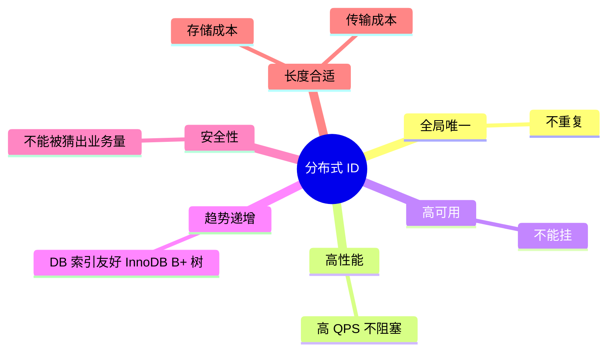
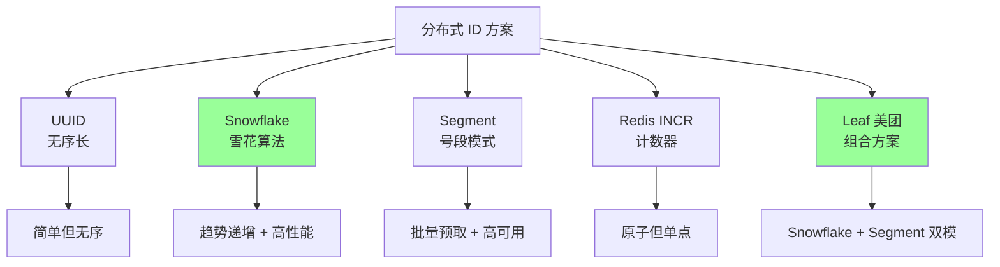
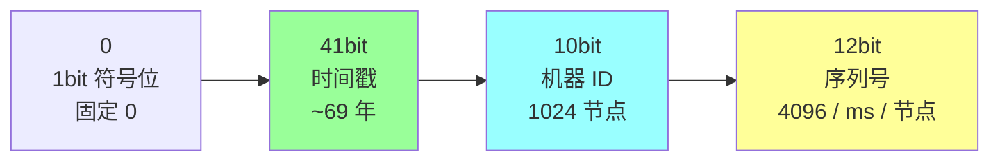
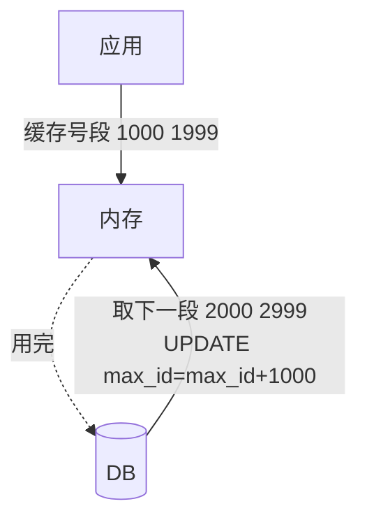
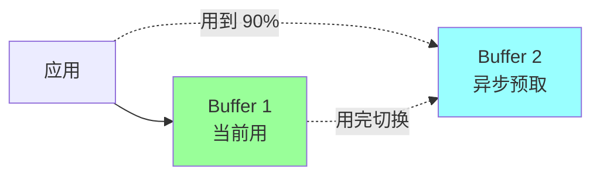
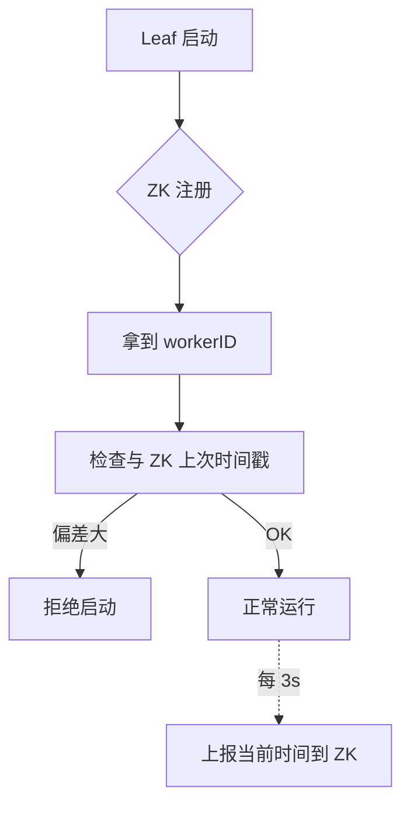
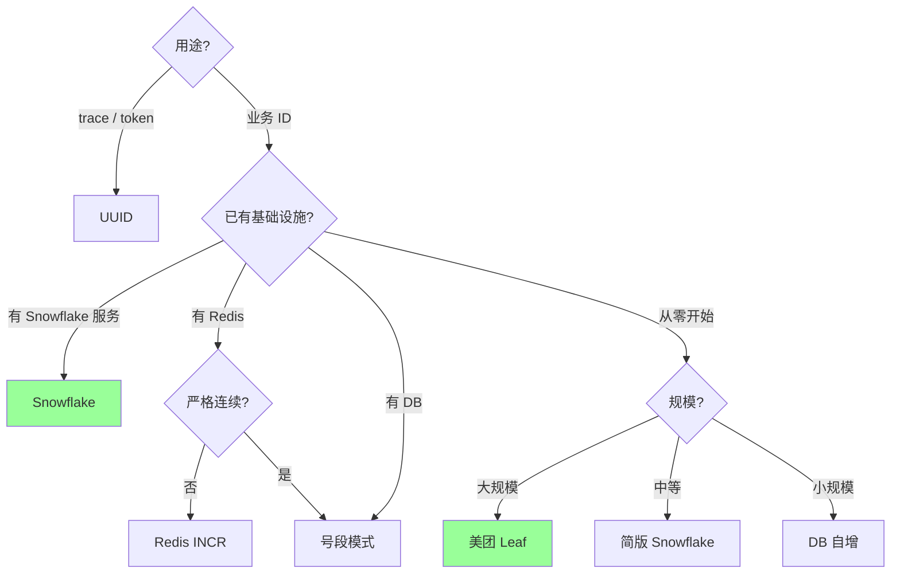

# 分布式 · 分布式 ID

> UUID / 雪花算法（Snowflake） / 号段模式（Segment） / 美团 Leaf / Redis INCR / 时钟回拨问题 / 选型

## 一、为什么需要分布式 ID

### 1.1 单机 ID 的问题

- DB 自增（`AUTO_INCREMENT`）：分库分表后**多个表生成同样的 ID** → 冲突
- 单 DB 自增：成为**单点瓶颈**
- 业务横跨多 DB：无法用 DB 主键当全局 ID

### 1.2 核心要求



**最关键 3 条**：唯一 + 高性能 + 高可用。

### 1.3 应用场景

- **订单号**
- **用户 ID**
- **消息 ID**
- **trace ID**
- **业务凭证号**

## 二、5 大方案全景



## 三、UUID（最简单）

### 3.1 格式

```
550e8400-e29b-41d4-a716-446655440000   # 36 字符 (含 4 个 "-")
128 bit
```

### 3.2 5 种版本

| Version | 算法 | 特点 |
| --- | --- | --- |
| v1 | 时间 + MAC | 暴露 MAC |
| v2 | 类似 v1 + POSIX UID | 少用 |
| v3 | 命名空间 + 名字 (MD5) | 确定性 |
| **v4** | **完全随机** | **最常用** |
| v5 | 命名空间 + 名字 (SHA-1) | 确定性 |

实战 99% 用 v4。

### 3.3 优缺点

**优点**：
- **本地生成**（无中心化）
- **无冲突**（128 bit 几乎不可能撞）
- 实现简单

**缺点**：
- **太长**（36 字符）
- **完全无序** → 作为 InnoDB 主键导致**B+ 树页频繁分裂**，性能差
- **不可读**（不能从 ID 看出业务信息）

### 3.4 适用

- **trace ID**（短期、不入库）
- **临时凭证**（token、nonce）
- **不要做 DB 主键**

```go
import "github.com/google/uuid"
id := uuid.NewString()  // "550e8400-e29b-41d4-a716-446655440000"
```

## 四、Snowflake（雪花算法，主流）

### 4.1 64 bit 结构

```
| 1 bit  | 41 bit              | 10 bit            | 12 bit       |
| 符号位 | 毫秒级时间戳         | 机器 ID           | 序列号        |
| 0      | 自定义起点起 ms     | 5 数据中心 + 5 机器 | 同一 ms 内序号 |
```



### 4.2 容量

- **时间**：41 bit ms ≈ 69 年（从自定义起点）
- **机器**：1024 个节点（5+5 拆法可改）
- **每节点每 ms**：4096 个 ID
- **总 QPS**：1024 × 4096 × 1000 = **42 亿 / 秒**

### 4.3 实现

```go
type Snowflake struct {
    mu       sync.Mutex
    epoch    int64    // 起点时间戳 ms
    nodeID   int64    // 机器 ID
    seq      int64    // 序列号
    lastTime int64
}

func (s *Snowflake) NextID() (int64, error) {
    s.mu.Lock()
    defer s.mu.Unlock()

    now := time.Now().UnixMilli()
    if now < s.lastTime {
        return 0, errors.New("clock moved backwards")
    }
    if now == s.lastTime {
        s.seq = (s.seq + 1) & 0xFFF  // 12 bit max
        if s.seq == 0 {
            // 当前 ms 用完, 等下一 ms
            for now <= s.lastTime { now = time.Now().UnixMilli() }
        }
    } else {
        s.seq = 0
    }
    s.lastTime = now

    id := ((now - s.epoch) << 22) | (s.nodeID << 12) | s.seq
    return id, nil
}
```

### 4.4 优点

- **趋势递增**（高位是时间，B+ 树插入友好）
- **本地生成**（无网络 IO）
- **高性能**（单机 400w QPS）
- **64 bit**（Long 类型，比 UUID 短）

### 4.5 缺点：时钟回拨

**致命问题**：服务器时钟回拨（NTP 同步、闰秒、运维误操作）。

```
T0: now=100, 生成 ID=...100|node|seq
T1: 时钟回拨, now=99
T2: 想生成 ID=...99|node|seq → 与 T0 的 ID 可能冲突!
```

**处理方案**：

#### 方案 1：拒绝服务（最严格）

```go
if now < lastTime {
    return error  // 拒绝, 等时钟追上
}
```

简单但**回拨严重时长时间不可用**。

#### 方案 2：等待追上

```go
if now < lastTime {
    sleep(lastTime - now)
}
```

回拨小（几 ms）时可接受。回拨大就阻塞太久。

#### 方案 3：用扩展位

```go
// 序列号腾出 1~2 bit 当 "回拨次数"
if now < lastTime {
    rollbackCount++
    use rollbackCount as part of ID
}
```

每次回拨用更高的 rollbackCount，保证 ID 不冲突。

#### 方案 4：Leaf-Snowflake（美团方案）

机器 ID 从 ZK 获取，启动时检查时钟与其他节点偏差，超阈值拒绝启动。

### 4.6 机器 ID 分配

10 bit = 1024 节点。怎么分配？

| 方案 | 描述 |
| --- | --- |
| **配置文件** | 启动时手动指定 |
| **ZK** | 从 ZK 顺序节点拿 ID |
| **DB** | 启动注册到 DB 拿 ID |
| **k8s** | 用 pod 序号 |

实战推荐 ZK / DB / k8s，避免人工管理出错（同 ID 冲突）。

### 4.7 适用

- **订单号、消息 ID、用户 ID 等核心 ID**
- 高并发场景
- 互联网主流方案

## 五、号段模式（Segment）

### 5.1 思路

每次从 DB 取一段 ID（如 1000 个），缓存到本地，慢慢用。用完再取下一段。



### 5.2 DB 表

```sql
CREATE TABLE id_segment (
    biz_tag VARCHAR(64) PRIMARY KEY,
    max_id  BIGINT NOT NULL,
    step    INT NOT NULL DEFAULT 1000,
    update_at TIMESTAMP
);
```

### 5.3 取段逻辑

```sql
BEGIN;
UPDATE id_segment SET max_id = max_id + step WHERE biz_tag = 'order';
SELECT max_id FROM id_segment WHERE biz_tag = 'order';
COMMIT;
-- 应用拿到 [max_id - step + 1, max_id]
```

### 5.4 优缺点

**优点**：
- **趋势递增**
- **DB 压力小**（每 N 个 ID 才访问一次 DB）
- **简单可靠**

**缺点**：
- **DB 是单点**（虽然访问少）
- **重启浪费 ID**（缓存的段直接丢）
- **首次取段慢**（缓存用完时同步取下一段）

### 5.5 双 buffer 优化（Leaf）



当前 buffer 用到 90% 时**异步**预取下一段到 buffer 2。用完无缝切换。**避免取段时阻塞**。

## 六、Redis INCR

```bash
INCR id:order   # 原子自增
```

### 6.1 优缺点

**优点**：
- **简单**
- **原子**
- **趋势递增**
- **性能好**（10w+ QPS）

**缺点**：
- **依赖 Redis**（挂了不可用）
- **持久化问题**：AOF/RDB 故障可能丢号
- **集群分散**：用 Cluster 时不同 slot 的 INCR 可能不连续

### 6.2 实战

```go
// 加日期防累加
key := "id:order:" + time.Now().Format("20060102")
id, _ := rdb.Incr(ctx, key).Result()
fullID := dateStr + fmt.Sprintf("%010d", id)  // 20240101_0000000001
```

### 6.3 适用

- **简单业务**
- **已有 Redis 集群**
- **不严格连续可接受**（如订单号）

## 七、美团 Leaf

### 7.1 两种模式

#### Leaf-Segment（号段模式）
- 双 buffer 预取
- DB 高可用（主从）
- 适合 ID 不严格连续

#### Leaf-Snowflake
- 雪花算法 + ZK 分配 workerID
- ZK 检查时钟偏差防回拨
- 适合无中心化生成

### 7.2 Leaf-Snowflake 关键点



启动检查 + 周期上报 → 防止时钟回拨问题。

## 八、其他方案

### 8.1 数据库自增（基础）

```sql
CREATE TABLE seq (id BIGINT AUTO_INCREMENT PRIMARY KEY, stub CHAR(1));
INSERT INTO seq (stub) VALUES ('a');
SELECT LAST_INSERT_ID();
```

**单点瓶颈**，几乎不直接用。

### 8.2 双 DB 步长

```sql
-- DB1: 起始 1, 步长 2 → 1, 3, 5, 7...
-- DB2: 起始 2, 步长 2 → 2, 4, 6, 8...
```

防单点 + 翻倍性能。但扩展性差（加 DB 要改步长）。

### 8.3 Twitter 原生 Snowflake

Twitter 退役了内部用的，开源了。Java 实现。
现在多数公司基于此自研。

### 8.4 百度 UidGenerator

基于 Snowflake，从 DB 分配 workerID。

### 8.5 滴滴 TinyID

DB 号段模式 + 双 buffer。

## 九、横向对比

| 方案 | 唯一 | 趋势递增 | 性能 | 高可用 | 长度 | 时钟敏感 | 适用 |
| --- | --- | --- | --- | --- | --- | --- | --- |
| UUID | ✓ | ✗ | 极高 | 完美 | 长 | ✗ | trace、token |
| Snowflake | ✓ | ✓ | 极高 | 单机可用 | 64bit | **是** | 主流业务 |
| 号段 | ✓ | ✓ | 高（双 buffer） | 依赖 DB | 自定义 | ✗ | 中等并发 |
| Redis INCR | ✓ | ✓ | 高 | 依赖 Redis | 自定义 | ✗ | 简单业务 |
| Leaf-Snowflake | ✓ | ✓ | 极高 | 高（ZK 兜底） | 64bit | 防回拨 | 大规模 |
| Leaf-Segment | ✓ | ✓ | 高 | 高（双 buffer） | 自定义 | ✗ | 大规模 |

## 十、选型决策



### 实战推荐

- **大公司**：自研 Snowflake / 直接用 Leaf
- **中型公司**：Snowflake + ZK 分配 workerID
- **小项目**：Redis INCR 或号段模式
- **不入库的临时 ID**：UUID v4

## 十一、常见坑

### 坑 1：UUID 当 InnoDB 主键

UUID 完全无序 → B+ 树页频繁分裂 → 写入性能差 + 索引膨胀。

**修复**：UUID 不当主键，或改 ulid（带时间排序）/ uuid v7（草案）。

### 坑 2：Snowflake 没处理时钟回拨

```
T0: id1 = ts100|node|seq0
T1: 时钟回拨到 99
T2: id2 = ts99|node|seq0 → 与 id1 不冲突但顺序乱
T3: 时钟到 100
T4: id3 = ts100|node|seq1 → 仍可能 OK
但极端情况 (回拨大) 可能与历史 ID 冲突
```

**修复**：拒绝服务 / 等待 / 用扩展位 / Leaf 方案。

### 坑 3：机器 ID 重复

两台服务器配置了同样的 workerID → 生成相同 ID。

**修复**：自动分配（ZK / DB / k8s），不手动配。

### 坑 4：号段步长太大或太小

- 太大（10000）：重启浪费多
- 太小（10）：DB 压力大

**修复**：根据 QPS 调，常见 1000~10000。

### 坑 5：Redis INCR 用 Cluster

不同 slot 的 INCR 不连续。

**修复**：单实例（Cluster 中用 hash tag 固定到一个 slot）。

### 坑 6：暴露业务量

订单号严格连续 → 竞争对手通过订单号增长率猜业务量。

**修复**：
- 加随机扰动
- 用雪花算法（高位时间 + 低位序号，难直接推算）
- 业务号外面包装层（display_id 是另一套规则）

### 坑 7：ID 和业务字段耦合

```
order_id = 时间戳 + 商户ID + 序列号
```

将业务信息塞进 ID。**问题**：商户 ID 改了 → 所有 ID 失效。

**修复**：ID 独立，业务字段放表里。

## 十二、高频面试题

**Q1：分布式 ID 有哪些方案？**

| 方案 | 适用 |
| --- | --- |
| UUID | trace / token |
| Snowflake | **主流业务 ID** |
| 号段模式 | DB 兜底 |
| Redis INCR | 简单场景 |
| Leaf | 大规模 |
| DB 自增 | 单库 |

**Q2：UUID 为什么不能当 DB 主键？**

UUID 完全随机无序 → InnoDB B+ 树插入时**页频繁分裂**：
- 写入性能差（每次插入可能改多个页）
- 索引膨胀
- 16B 也比 BIGINT (8B) 占空间

**修复**：用 Snowflake / ulid / uuid v7（带时间）。

**Q3：Snowflake 的 64 bit 怎么分？**

```
1 bit 符号 + 41 bit 时间戳 + 10 bit 机器 + 12 bit 序号
```

- 41 bit ms ≈ 69 年
- 10 bit = 1024 机器
- 12 bit = 4096 / ms / 机器
- 总 QPS = 4 亿 / 秒（远超需求）

**Q4：Snowflake 时钟回拨怎么处理？**

回拨原因：NTP、闰秒、运维误操作。

方案：
1. **拒绝服务**：等时钟追上
2. **小回拨等待**：sleep 几 ms
3. **扩展位**：用序号腾 bit 当回拨次数
4. **Leaf 方案**：启动检查 + ZK 周期上报

**Q5：号段模式怎么实现？**

```sql
UPDATE id_seg SET max_id = max_id + step WHERE biz='order';
SELECT max_id FROM id_seg WHERE biz='order';
```

应用拿 [max_id-step+1, max_id]，本地缓存使用。用完再取下段。

**优化**：双 buffer 预取（用到 90% 异步预取下段，避免阻塞）。

**Q6：UUID v4 vs Snowflake 怎么选？**

| | UUID v4 | Snowflake |
| --- | --- | --- |
| 长度 | 36 字符 | 64 bit (~19 数字) |
| 顺序 | 无序 | 有序 |
| 中心化 | 无 | 需机器 ID 分配 |
| 时钟依赖 | 无 | 有（回拨问题） |
| DB 主键 | ❌ | ✓ |
| 适用 | trace / token | 业务主键 |

**Q7：分布式 ID 怎么保证全局唯一？**

- **UUID**：依赖随机性 (128 bit 几乎不可能撞)
- **Snowflake**：时间戳 + 机器 ID + 序号组合，机器 ID 唯一即唯一
- **DB**：DB 自增天然唯一
- **Redis INCR**：原子单调递增

**Q8：ID 趋势递增为什么重要？**

InnoDB B+ 树主键索引是**有序**的：
- 趋势递增 → 新数据插在末尾，**不分裂页**
- 完全无序（UUID）→ 插中间，**频繁分裂**，性能差

订单号、消息 ID 等高频写入的表必须用趋势递增 ID。

**Q9：怎么分配 Snowflake 的机器 ID？**

| 方案 | 优缺点 |
| --- | --- |
| 配置文件 | 简单，易出错 |
| ZK 顺序节点 | 自动唯一，依赖 ZK |
| DB 注册 | 自动唯一，依赖 DB |
| k8s pod 序号 | k8s 内部最自然 |
| MAC + IP hash | 可能冲突 |

实战 ZK / DB 自动分配。

**Q10：怎么防止 ID 暴露业务量？**

- 加随机扰动（高位 + 噪声）
- 用 Snowflake（不像 INCR 那样严格连续）
- 业务展示号（display_id）和内部 ID 分开
- 加密（如 hashids）

## 十三、面试加分点

- 强调**UUID 不能当 InnoDB 主键**（B+ 树分裂）
- 知道 Snowflake 的 bit 分配（1+41+10+12）
- **时钟回拨**是 Snowflake 必谈点
- 美团 Leaf 双模 + 双 buffer
- 号段模式的"用到 90% 异步预取"
- 机器 ID 自动分配（不手动配）
- 区分"业务 ID"和"trace ID"（用途不同）
- 提到 ulid / uuid v7（解决 UUID 无序问题）
- 知道大公司常自研（淘宝 TDDL ID、美团 Leaf、滴滴 TinyID）
- ID 不应耦合业务信息（独立设计）
