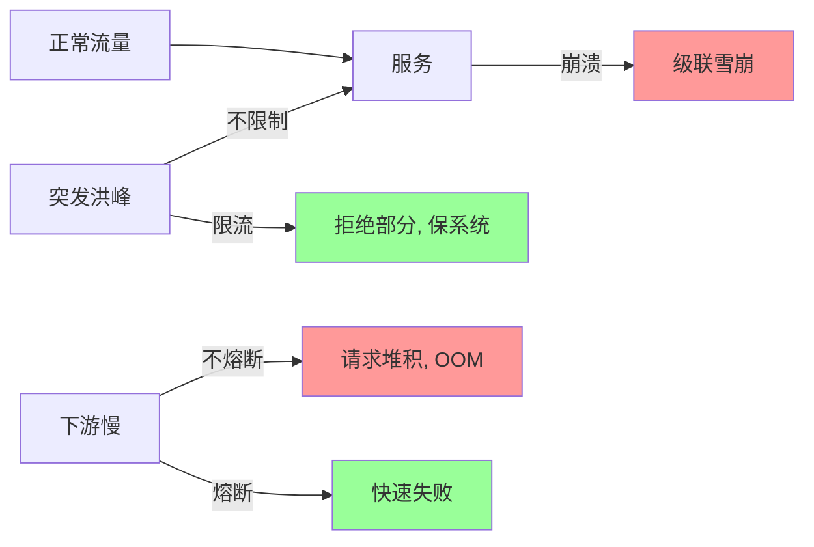
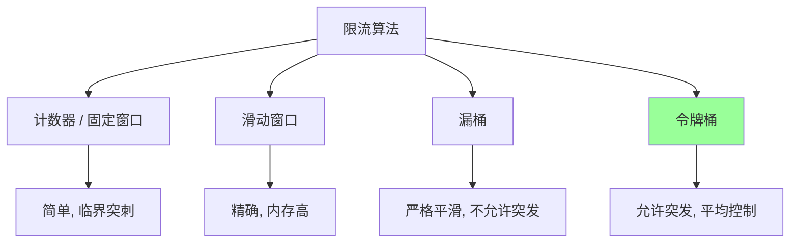
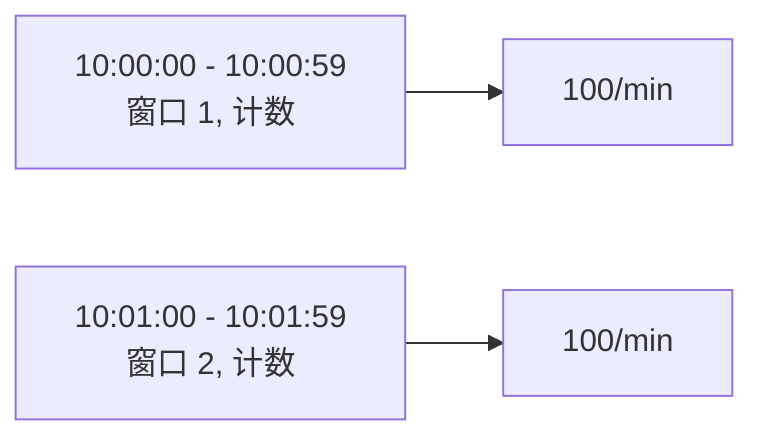
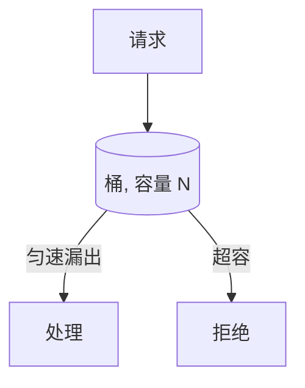
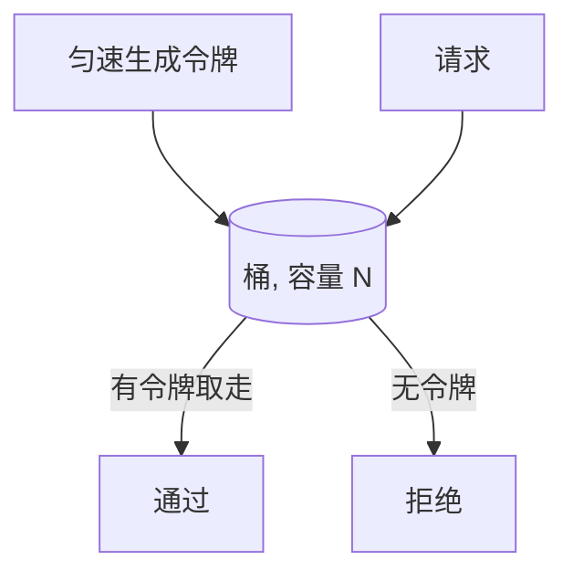
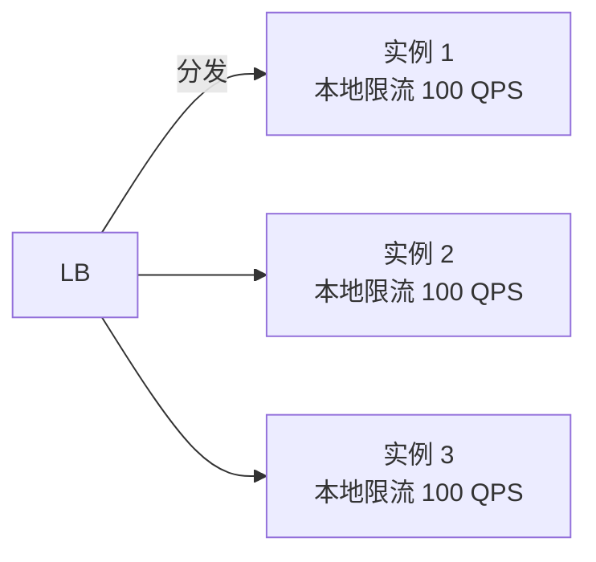
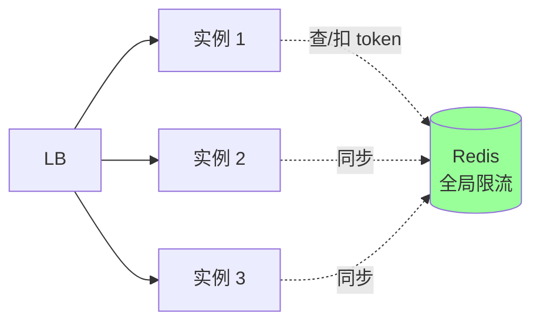
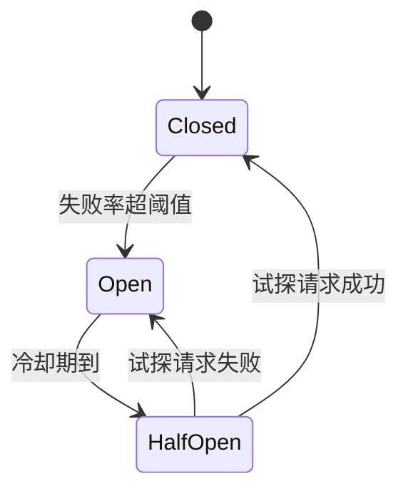
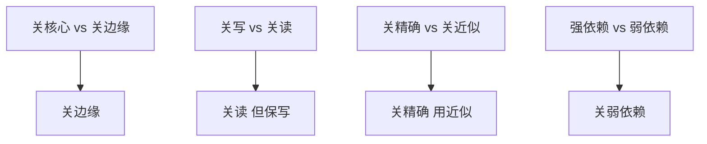
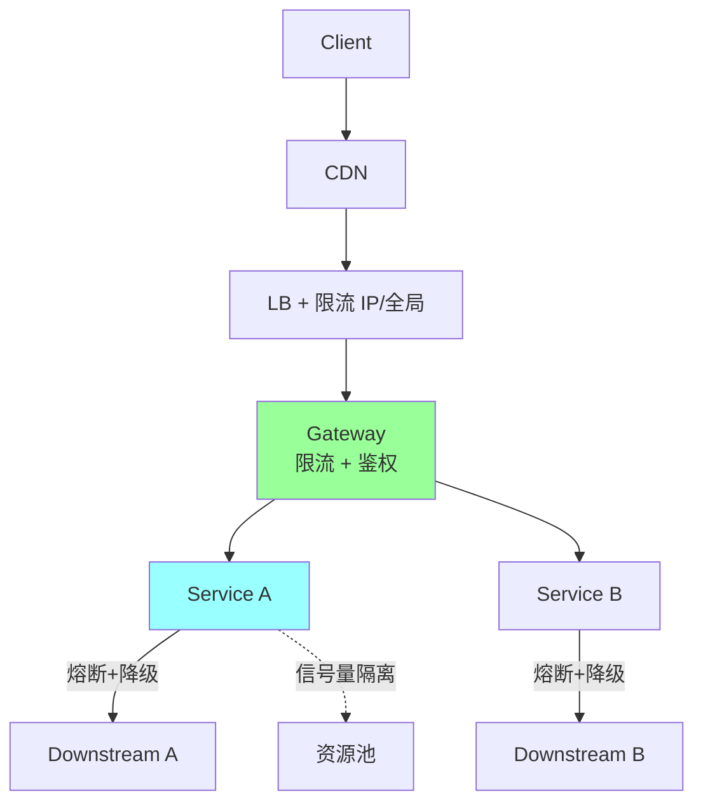

# 分布式 · 限流熔断降级

> 服务治理四件套：限流（4 算法）+ 熔断（三态机）+ 降级 + 隔离 / 单机 vs 分布式 / Sentinel / Hystrix / 实战

## 一、为什么需要



服务治理 4 件套：
- **限流（Rate Limit）**：限制请求速率
- **熔断（Circuit Breaker）**：下游异常时快速失败
- **降级（Degrade）**：保护核心，关闭/简化非核心
- **隔离（Isolation）**：防止某个慢调用拖垮整个进程

## 二、限流（4 种算法）

### 2.1 算法对比



### 2.2 固定窗口



```go
func allow(userID int64) bool {
    key := fmt.Sprintf("limit:%d:%d", userID, time.Now().Unix()/60)
    count := atomic.AddInt64(counter[key], 1)
    return count <= 100
}
```

**临界突刺问题**：59 秒和 1 分 0 秒之间 200 次都允许（瞬时 2x 流量）。

### 2.3 滑动窗口


把固定窗口拆成 N 个小格，按比例计算：

```
当前时间在格子 [40, 50] 中
左半 = 上一窗口的最后 60% (50-100% 部分)
右半 = 当前窗口已用部分
total = 左半流量 * weight + 右半流量
```

或用 Redis ZSet 存请求时间戳（精确版）：

```lua
-- KEYS[1]=key, ARGV={now, window_ms, limit}
local now = tonumber(ARGV[1])
redis.call('ZREMRANGEBYSCORE', KEYS[1], 0, now - tonumber(ARGV[2]))
local count = redis.call('ZCARD', KEYS[1])
if count < tonumber(ARGV[3]) then
    redis.call('ZADD', KEYS[1], now, now)
    redis.call('EXPIRE', KEYS[1], math.ceil(ARGV[2] / 1000))
    return 1
end
return 0
```

**优点**：精确无突刺
**缺点**：内存高（每请求一个 ZSet 元素）

### 2.4 漏桶



**严格平滑**：不管来多快，都按固定速率出。**不允许突发**。

```go
type LeakyBucket struct {
    capacity int
    rate     float64  // 每秒漏多少
    water    float64
    lastTime time.Time
    mu       sync.Mutex
}

func (b *LeakyBucket) Allow() bool {
    b.mu.Lock()
    defer b.mu.Unlock()
    now := time.Now()
    leaked := b.rate * now.Sub(b.lastTime).Seconds()
    b.water = math.Max(0, b.water-leaked)
    b.lastTime = now
    if b.water+1 > float64(b.capacity) {
        return false
    }
    b.water++
    return true
}
```

### 2.5 令牌桶（最常用）



**允许突发**：桶里攒了令牌可一次消耗。
**Go 标准库**：`golang.org/x/time/rate`

```go
import "golang.org/x/time/rate"

limiter := rate.NewLimiter(100, 200)  // 100 token/s, 桶容量 200
if !limiter.Allow() { return ErrTooMany }
```

### 2.6 算法对比

| 算法 | 实现 | 突发 | 精确 | 内存 | 适用 |
| --- | --- | --- | --- | --- | --- |
| 固定窗口 | 极简 | 否 | 差 | 极小 | 粗略限制 |
| 滑动窗口 | 中 | 否 | 高 | 高 | 精确限制 |
| 漏桶 | 中 | **否** | 高 | 小 | 严格平滑（流量整形） |
| 令牌桶 | 中 | **是** | 高 | 小 | **大多场景** |

## 三、单机 vs 分布式限流

### 3.1 单机限流



每个实例独立限流。

**优点**：简单、无依赖
**缺点**：
- LB 不均匀时部分节点先达上限
- 总 QPS 不准确（理论 300 实际可能 280）
- 不能跨机器协同

**适用**：粗略保护单机资源（CPU、内存）。

### 3.2 分布式限流



所有实例共享一个 Redis（或专用限流服务）。

**实现**：Redis + Lua 原子扣减：

```lua
-- 令牌桶 (前面已展示)
```

**优点**：精确全局限流
**缺点**：
- **每次请求一次 Redis 调用**（增加 RT）
- Redis 是单点（虽可集群）
- 网络抖动影响

**适用**：精确控制全局 QPS（如对外 API）。

### 3.3 混合方案

**单机限流**先扛一批 + **分布式限流**做总配额：

```
1. 单机本地令牌桶 (100 QPS) → 大多请求过这里, 性能高
2. 超过本地限制 → 分布式限流再决策
```

或者**预分配**：分布式限流给每个实例分配本地配额，定期再均衡。

## 四、熔断（Circuit Breaker）

### 4.1 三态机



| 状态 | 行为 |
| --- | --- |
| **Closed（关闭，正常）** | 正常通过请求，统计失败率 |
| **Open（开启，熔断）** | 直接拒绝，不调下游 |
| **HalfOpen（半开）** | 放少量请求试探，根据结果决定回 Closed 或 Open |

### 4.2 关键参数

```
统计窗口: 10 秒
最少请求数: 20    (防止小样本误判)
失败率阈值: 50%
冷却期: 60 秒    (Open → HalfOpen)
半开试探数: 5
```

**逻辑**：
- 10 秒内请求 ≥ 20 次 且 失败率 ≥ 50% → 熔断
- 熔断后 60 秒内全部拒绝
- 60 秒后进入半开，放 5 个请求试探
- 5 个都成功 → 恢复 Closed
- 任一失败 → 回 Open，再等 60 秒

### 4.3 sony/gobreaker（Go 简洁实现）

```go
import "github.com/sony/gobreaker"

cb := gobreaker.NewCircuitBreaker(gobreaker.Settings{
    Name:        "downstream",
    MaxRequests: 5,                         // 半开时最多请求数
    Interval:    10 * time.Second,          // 统计窗口
    Timeout:     60 * time.Second,          // Open → HalfOpen 冷却
    ReadyToTrip: func(counts gobreaker.Counts) bool {
        return counts.Requests >= 20 &&
            float64(counts.TotalFailures)/float64(counts.Requests) >= 0.5
    },
})

result, err := cb.Execute(func() (any, error) {
    return callDownstream(ctx, req)
})
if err == gobreaker.ErrOpenState { /* 已熔断 */ }
```

### 4.4 Hystrix 风格 vs 自适应

#### Hystrix（固定阈值）
- 滑动窗口 + 失败率阈值
- 阈值难调（业务波动大时频繁切换）

#### Sentinel / 自适应熔断
- **基于响应时间**：RT 超阈值的请求比例 > 50%
- **慢调用比例**：慢请求占比超阈值
- **异常比例**：异常请求占比

更智能，避免误判。

### 4.5 熔断 vs 限流

| | 限流 | 熔断 |
| --- | --- | --- |
| 触发 | 请求量超阈值 | 下游异常率超阈值 |
| 目的 | 保护**自己**不被压垮 | 保护**自己 + 下游**不被拖垮 |
| 状态 | 无状态 | 三态机 |
| 恢复 | 流量降 → 自动放行 | 冷却 → 半开 → 试探 |

## 五、降级

### 5.1 主动降级

业务紧急时**主动关闭非核心功能**：

- 双 11 关闭"商品评论"，保下单
- 流量大关闭"个性化推荐"，用通用列表
- 故障时返回兜底数据

```go
if config.IsDegraded("comment") {
    return defaultComment  // 兜底
}
return getComment(productID)
```

### 5.2 自动降级（与熔断结合）

下游异常时降级返回兜底：

```go
result, err := cb.Execute(func() (any, error) {
    return callDownstream(ctx, req)
})
if err != nil {
    return getFallback()  // 降级
}
```

### 5.3 降级原则



例：
- 评论挂 → 不影响下单（弱依赖）
- 推荐挂 → 用默认列表（近似）
- 缓存挂 → 直接读 DB（降级）

### 5.4 降级 vs 熔断

| | 降级 | 熔断 |
| --- | --- | --- |
| 主动 / 被动 | 主动 / 自动均可 | 自动 |
| 目的 | 保核心功能可用 | 保自己不被拖垮 |
| 应对 | 配置开关 + 兜底 | 三态机 |

降级是**结果**，熔断是**手段**之一。

## 六、隔离

### 6.1 为什么需要

某个下游慢 → 调用线程/g 堆积 → **进程其他功能也响应慢**（共用线程池/资源）。

### 6.2 信号量隔离

每个下游独立的信号量，限制并发数：

```go
sem := make(chan struct{}, 50)  // 最多 50 并发到下游 A

func callA() {
    sem <- struct{}{}
    defer func() { <-sem }()
    return downstreamA.Call()
}
```

**优点**：轻量
**缺点**：调用方仍是同一线程/g（慢调用阻塞调用方）

### 6.3 线程池隔离（Hystrix 默认）

每个下游独立线程池：

```
ThreadPool A: 10 个线程, 队列 50
ThreadPool B: 20 个线程, 队列 100
```

调用 A 慢 → 只影响 ThreadPool A，不影响 B。

**优点**：完全隔离
**缺点**：线程切换开销 + 上下文丢失

Go 用 g 替代线程，开销极小：

```go
type Pool struct {
    workers chan struct{}
}

func (p *Pool) Submit(f func()) error {
    select {
    case p.workers <- struct{}{}:
        go func() {
            defer func() { <-p.workers }()
            f()
        }()
        return nil
    default:
        return ErrPoolFull
    }
}
```

### 6.4 进程级隔离

不同业务部署在不同进程/容器，资源隔离：

- 核心业务（下单）独占机器
- 边缘业务（统计）共享机器

防止一个业务的内存/CPU 异常影响其他。

### 6.5 实例级隔离

热点接口的下游单独部署：

```
普通 API 调用 → 商品服务（共享）
秒杀 API 调用 → 商品服务-秒杀专用集群（独立）
```

防止秒杀流量影响普通业务。

## 七、Sentinel（阿里）

### 7.1 特点

国产服务治理框架，支持：
- 限流（QPS / 线程数）
- 熔断（响应时间、异常比例、异常数）
- 系统自适应保护（CPU / load / 入口 QPS）
- 热点参数限流
- 集群限流（分布式）

### 7.2 核心模型：资源 + 规则

```go
import "github.com/alibaba/sentinel-golang/api"

// 加载规则
flow.LoadRules([]*flow.Rule{{
    Resource: "downstream",
    Threshold: 100,                  // 100 QPS
    StatIntervalInMs: 1000,
    ControlBehavior: flow.Reject,
}})

// 检查
e, b := api.Entry("downstream")
if b != nil {
    // 被限流
    return ErrLimited
}
defer e.Exit()

// 业务逻辑
return callDownstream()
```

### 7.3 vs Hystrix

| | Sentinel | Hystrix |
| --- | --- | --- |
| 维护 | 阿里维护 | 已不维护（Netflix 弃） |
| 隔离 | 信号量 | 线程池 + 信号量 |
| 限流 | 多种（QPS/线程数/热点参数） | 简单 |
| 自适应 | CPU/load/入口 QPS | 无 |
| 控制台 | 有 | Turbine |
| 支持语言 | Java / Go / C++ | 主要 Java |

新项目首选 Sentinel（或 resilience4j on Java）。

## 八、go-zero 自适应

go-zero 内置：

### 8.1 自适应熔断（Google SRE 风格）

```
拒绝概率 = max(0, (requests - K * accepts) / (requests + 1))
```

- requests = 总请求数
- accepts = 成功数
- K = 敏感度（默认 1.5）

成功率高 → 拒绝概率 0；失败上升 → 拒绝概率上升。

**优势**：不需要配置阈值，自动调节。

### 8.2 自适应限流

基于 CPU + 队列长度，自动 shed 流量。

```yaml
shedding: true
cpuThreshold: 900   # CPU 90% 触发
```

## 九、实战架构



**层层防护**：
1. **CDN/WAF**：拦明显恶意
2. **LB**：粗限流 + 防 DDoS
3. **Gateway**：用户级 / API 级精细限流
4. **Service 层**：业务级限流 + 熔断
5. **下游调用**：熔断 + 降级 + 隔离

## 十、典型坑

### 坑 1：限流粒度太粗

```
对整个 API 限流 100 QPS → 一个用户疯狂刷把额度占了
```

**修复**：按用户 / IP / API 多维限流。

### 坑 2：限流粒度太细

```
按用户 + API + IP + 设备号 4 维 → key 爆炸, Redis OOM
```

**修复**：选关键维度（通常用户 + API）。

### 坑 3：熔断阈值不合理

```
失败率 10% 就熔断 → 业务波动一下就熔断, 频繁切换
```

**修复**：
- 50%~70% 失败率
- 加最少请求数门槛（小样本不熔断）
- 用自适应熔断

### 坑 4：降级返回错误数据

```
降级返回 nil → 前端崩
```

**修复**：降级数据要符合业务预期（空列表 / 默认值 / 缓存兜底）。

### 坑 5：降级不可恢复

```
开关人工开了忘记关 → 长期降级
```

**修复**：降级开关有自动恢复机制 + 监控告警。

### 坑 6：限流后客户端疯狂重试

被限流 → 客户端立即重试 → 加重压力。

**修复**：
- 客户端用退避重试
- 服务端返回 `Retry-After` header
- 服务端拒绝时不要返回 5xx（导致重试），返回 429

### 坑 7：熔断打开但下游已恢复

不知道下游已恢复 → 一直熔断。

**修复**：HalfOpen 状态主动试探。

### 坑 8：分布式限流 Redis 挂了

所有限流逻辑失效，可能放过去打爆下游。

**修复**：
- Redis 高可用（Cluster）
- 降级到本地限流
- 监控 Redis 健康

## 十一、高频面试题

**Q1：限流 4 种算法对比？**

| | 突发 | 平滑 | 适用 |
| --- | --- | --- | --- |
| 固定窗口 | ✗ | ✗ | 粗略 |
| 滑动窗口 | ✗ | ✓ | 精确 |
| 漏桶 | ✗ | ✓ | 整形 |
| 令牌桶 | **✓** | ✓ | **大多数** |

**Q2：单机限流 vs 分布式限流？**

| | 单机 | 分布式 |
| --- | --- | --- |
| 实现 | 简单 | 复杂 |
| 精度 | 不准（受 LB 影响） | 准 |
| 性能 | 高 | 低（Redis IO） |
| 依赖 | 无 | Redis/限流服务 |
| 适用 | 单机资源保护 | 全局 QPS 控制 |

混合方案：单机本地扛大头 + 分布式做总配额。

**Q3：熔断三态机？**

```
Closed (正常)
 ↓ 失败率超阈值
Open (拒绝所有)
 ↓ 冷却期到
HalfOpen (放少量试探)
 ↓ 全成功
Closed
 ↓ 任一失败
Open (再等冷却)
```

**Q4：熔断和限流区别？**

- **限流**：保护**自己**不被流量压垮（来多少 vs 能处理多少）
- **熔断**：保护**自己 + 下游**不被异常拖垮（下游慢/挂时快速失败）

熔断有状态机，限流无状态。

**Q5：什么场景需要降级？**

- 流量过大（双 11）→ 关非核心
- 下游故障 → 返回兜底（缓存/默认值）
- 资源紧张 → 简化功能

降级 ≠ 熔断：降级是结果（用兜底），熔断是手段（快速失败）。

**Q6：怎么实现滑动窗口限流？**

ZSet + Lua（详见 [04-redis/08-scenarios.md](../04-redis/08-scenarios.md)）。
或固定窗口的滑动版本：拆 N 个小格，按比例计算。

**Q7：自适应熔断怎么工作？**

Google SRE 算法：

```
拒绝概率 = max(0, (requests - K*accepts) / (requests + 1))
```

成功率高 → 拒绝概率 0；失败上升 → 概率上升。**不需要配阈值**。

**Q8：限流后怎么响应？**

返回 **HTTP 429 Too Many Requests** + `Retry-After` header（告诉客户端多久后重试）。

不要返回 5xx（客户端可能立即重试）。

**Q9：怎么防止重试风暴？**

- **客户端退避**：1s → 2s → 4s → 8s（指数退避）
- **抖动**：避免所有客户端同时重试
- **重试上限**：3~5 次
- **服务端返回 Retry-After**

**Q10：服务治理 4 件套是？**

- **限流**：限制请求速率
- **熔断**：下游异常时快速失败
- **降级**：保核心，关边缘
- **隔离**：防止某个下游拖垮整个进程

四者结合，构成完整的服务保护体系。

## 十二、面试加分点

- 4 种限流算法说出**令牌桶最常用**（允许突发）
- 滑动窗口比固定窗口精确（无突刺）
- 熔断三态：Closed / Open / HalfOpen
- 自适应熔断（Google SRE）vs 固定阈值（Hystrix）
- 降级原则：关弱依赖、用近似、兜底数据
- 隔离方式：信号量、线程池、进程、实例
- 单机限流 vs 分布式限流的 trade-off
- 限流返回 429 不是 5xx
- 客户端退避防雪崩
- Sentinel / gobreaker / go-zero 是 Go 生态主流
- "保护自己 vs 保护下游"是熔断和限流的本质区别
