# 分布式 · 服务发现与负载均衡

> 服务注册发现（CP vs AP）/ 主流注册中心对比 / LB 算法（含一致性 Hash）/ 健康检查 / 客户端 vs 服务端 LB

## 一、为什么需要服务发现

### 1.1 单体 → 微服务

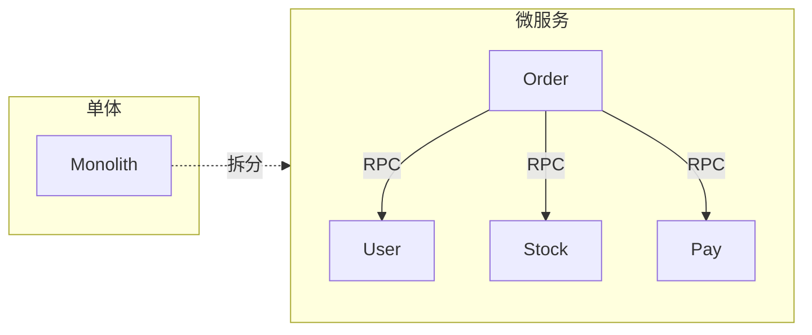

**问题**：
- 服务实例**动态变化**（扩缩容、故障、迁移）
- 调用方**怎么知道下游 IP**？
- IP 改了**怎么自动感知**？

**硬编码 IP 不可行**。

### 1.2 服务发现解决

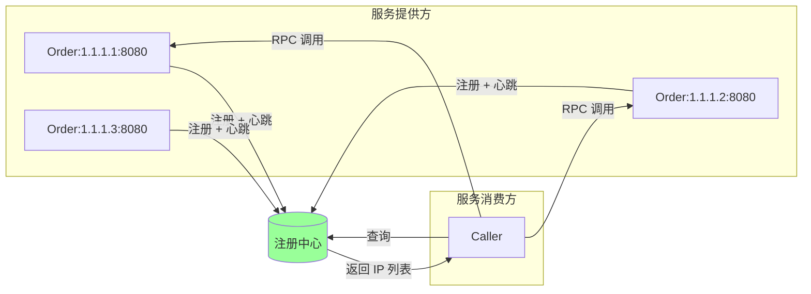

- **服务方启动**：注册自己（IP+port+元数据）
- **服务方退出**：注销
- **服务方运行中**：心跳
- **消费方**：查询某服务的所有可用实例
- **健康检查**：注册中心定期检查实例存活

## 二、主流注册中心对比

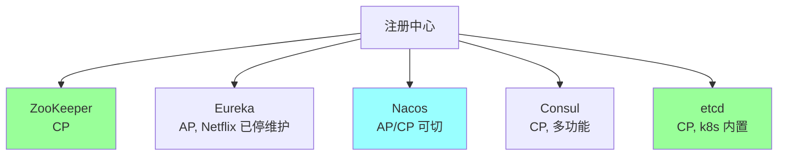

### 2.1 对比表

| | ZooKeeper | Eureka | Nacos | Consul | etcd |
| --- | --- | --- | --- | --- | --- |
| **CAP** | CP | AP | AP/CP（可切） | CP | CP |
| **共识** | ZAB | 自研 | 自研 + Raft | Raft | Raft |
| **性能** | 中 | 高 | 高 | 中 | 中 |
| **健康检查** | 临时节点 | 心跳 | 心跳/HTTP/TCP | 多种 | 心跳 |
| **额外功能** | 协调原语 | - | 配置中心 | KV/DNS/服务网格 | KV |
| **生态** | Hadoop | Spring Cloud | Spring Cloud / 国产 | HashiCorp | k8s |
| **维护** | 老牌活跃 | **已停维护** | 阿里活跃 | HashiCorp | CNCF |

### 2.2 选型

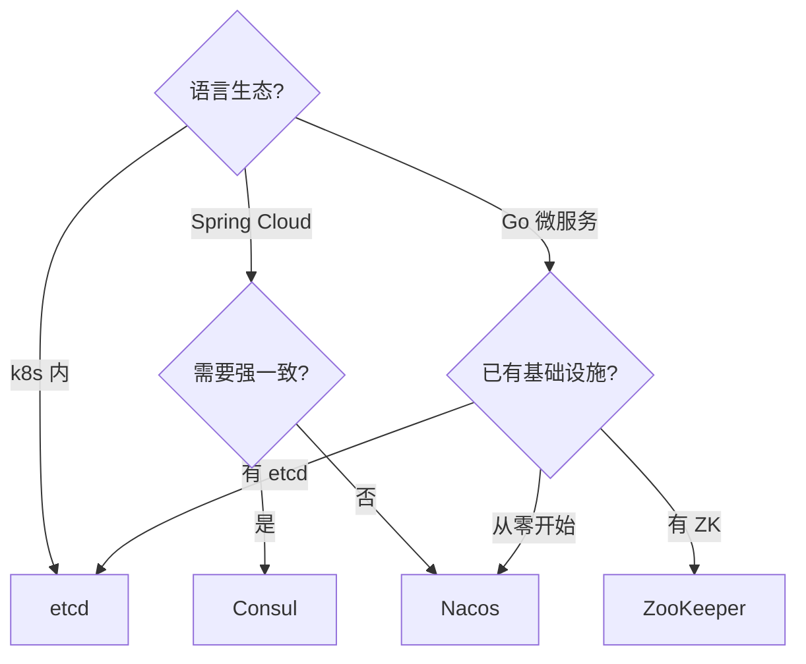

### 2.3 CP vs AP 选择

**CP（强一致优先）**：
- 注册信息绝对准确
- 分区时**少数派不可用**（拿不到注册列表）
- 适合：金融、关键系统

**AP（可用性优先）**：
- 注册信息可能短暂不一致
- 分区时仍可服务（用本地缓存的列表）
- 适合：互联网业务（容忍短暂不准）

**互联网多选 AP**：服务发现"短暂不准"问题不大（调用方可重试），"不可用"问题大（服务发现挂全栈不可用）。

### 2.4 Eureka 为什么 AP 有意义

Netflix 设计：注册中心**优先保证可用**，避免成为故障点。

机制：
- **客户端缓存**：本地缓存注册列表，注册中心挂了仍可调用
- **自我保护**：节点心跳异常超阈值时**进入保护模式**（不注销实例，宁可放过陌生 IP 也不踢健康实例）
- **最终一致**：节点间异步同步

代价：可能短暂调用到已下线实例（要靠客户端重试 + 熔断）。

## 三、负载均衡（LB）

### 3.1 客户端 vs 服务端 LB

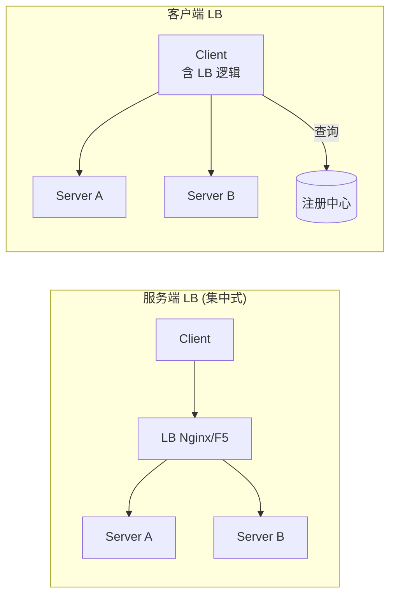

#### 服务端 LB
- **代表**：Nginx / HAProxy / F5 / ALB
- **优点**：客户端无感、易管理
- **缺点**：多一跳延迟、LB 是单点（虽可集群）
- **适用**：HTTP API 网关、TCP 负载

#### 客户端 LB
- **代表**：Ribbon / gRPC client / go-zero / Kratos
- **优点**：少一跳、灵活（按业务定制）
- **缺点**：客户端复杂、规则更新难统一
- **适用**：内部 RPC 调用

**实战**：内部 RPC 用客户端 LB，外部 HTTP 用服务端 LB。

### 3.2 主流 LB 算法

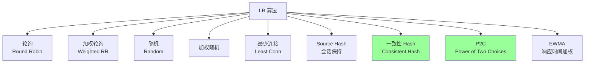

### 3.3 算法详解

#### 轮询（Round Robin）

```
Server A → Server B → Server C → Server A → ...
```

简单。**前提**：所有 server 配置相同。

#### 加权轮询（Weighted RR）

按权重分配：

```
Server A (weight=3) → 3 次
Server B (weight=2) → 2 次
Server C (weight=1) → 1 次
```

适合**异构机器**（配置不同）。

**Nginx 实现**：平滑加权 RR（Smooth Weighted），避免短期内某 server 集中被打。

#### 最少连接（Least Connections）

选当前**连接数最少**的 server：

```
Server A: 10 conn
Server B: 5 conn  ← 选这个
Server C: 8 conn
```

适合**长连接 / 处理时间差异大**的场景。

#### Source Hash（IP/会话哈希）

按客户端 IP / sessionID hash → 同一客户端总是路由到同一 server。

**用途**：会话保持（不需要分布式 session）。
**缺点**：流量倾斜（大客户压一台）。

#### 一致性 Hash（重头戏）

详见后文。

#### P2C（Power of Two Choices）

随机选 2 个 server，比较负载（连接数 / 平均 RT），选轻的：

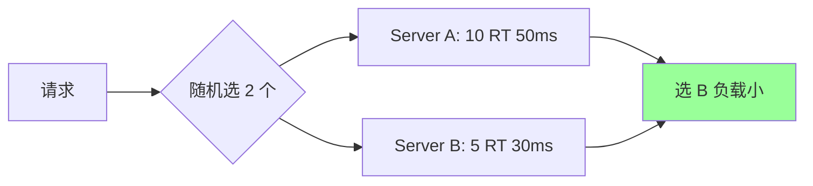

**优势**：
- O(1)（不需要全局排序）
- 期望 O(log log n) 不平衡（数学证明）

**应用**：go-zero、Twitter Finagle、kratos 默认。

#### EWMA（响应时间加权移动平均）

用历史 RT 预测节点性能，慢的少分流量。

```
ewma(t) = α * rt(t) + (1-α) * ewma(t-1)
```

适合 RT 差异大的场景。

### 3.4 算法选型

| 场景 | 算法 |
| --- | --- |
| 同构 + 短连接 | Round Robin |
| 异构机器 | Weighted RR |
| 长连接 | Least Conn |
| 需要会话保持 | Source Hash |
| 缓存命中率优化 | **Consistent Hash** |
| 实例性能差异大 | **P2C / EWMA** |
| 简单兜底 | Random |

## 四、一致性 Hash

### 4.1 解决什么问题

普通 Hash 分配（`hash(key) % N`）的问题：

```
N=3 时: hash(k) % 3 = 0/1/2
N 加到 4: hash(k) % 4 = 0/1/2/3
```

**几乎所有 key 的归属都变了** → 缓存几乎全失效，回源风暴。

### 4.2 思路：Hash 环

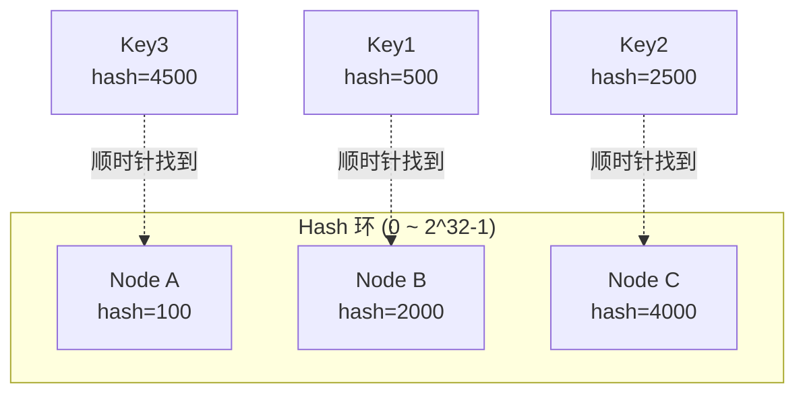

- 节点和 key 都 hash 到 0~2^32 的环上
- key 顺时针找到第一个节点
- **加节点只影响相邻范围**

### 4.3 加节点的影响

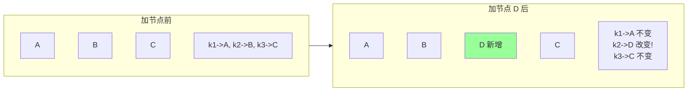

只有 D 和 B 之间的 key 受影响。**减少了缓存失效**。

### 4.4 数据倾斜问题

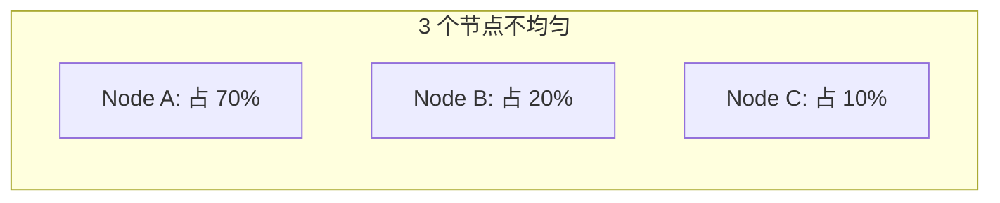

节点 hash 不均匀 → 流量倾斜。

### 4.5 虚拟节点（Virtual Node）

每个真实节点对应**多个虚拟节点**（如 150 个），均匀分布在环上：

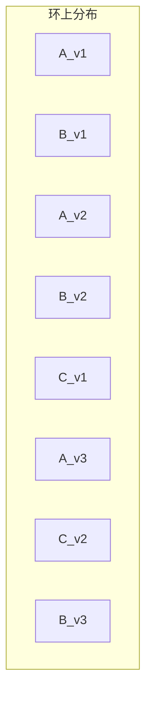

虚拟节点越多，分布越均匀（150 个虚拟节点足够）。

### 4.6 应用

- **Memcached / Redis 集群**：客户端分片
- **CDN 节点选择**
- **DHT**（Bittorrent / Cassandra）
- **服务网格的会话保持**（如 nginx upstream consistent_hash）

### 4.7 实现示例

```go
type ConsistentHash struct {
    nodes    map[uint32]string  // hash → node
    keys     []uint32           // 排序的 hash
    replicas int                // 每个节点的虚拟节点数
}

func (c *ConsistentHash) Add(node string) {
    for i := 0; i < c.replicas; i++ {
        h := hash(node + "#" + strconv.Itoa(i))
        c.nodes[h] = node
        c.keys = append(c.keys, h)
    }
    sort.Slice(c.keys, func(i, j int) bool { return c.keys[i] < c.keys[j] })
}

func (c *ConsistentHash) Get(key string) string {
    if len(c.keys) == 0 { return "" }
    h := hash(key)
    idx := sort.Search(len(c.keys), func(i int) bool { return c.keys[i] >= h })
    if idx == len(c.keys) { idx = 0 }  // 环
    return c.nodes[c.keys[idx]]
}
```

## 五、健康检查

### 5.1 三种方式

#### 心跳（Heartbeat）

服务方主动上报：

```
Service → Registry: "我还活着" (每 5s)
Registry: 30s 没收到 → 摘除
```

**优点**：服务方知道自己状态
**缺点**：网络抖动可能误判

#### TCP 探活

注册中心主动连：

```
Registry → telnet Service:port → 通即活
```

**优点**：简单
**缺点**：连接通不代表服务正常（可能僵死）

#### HTTP 探活

```
Registry → GET /health → 200 即活
```

**优点**：能反映业务健康（连 DB 等）
**缺点**：业务方要实现 /health

#### 多重探活（推荐）

心跳 + HTTP，结合判断。

### 5.2 健康检查粒度

```
- TCP 通 = 进程在
- /health 200 = 端口能响应
- /health 含业务检查 (DB/Redis 连通) = 业务可用
```

按需选择，太粗会保留僵死实例，太细会误删健康实例（DB 抖动）。

### 5.3 优雅下线

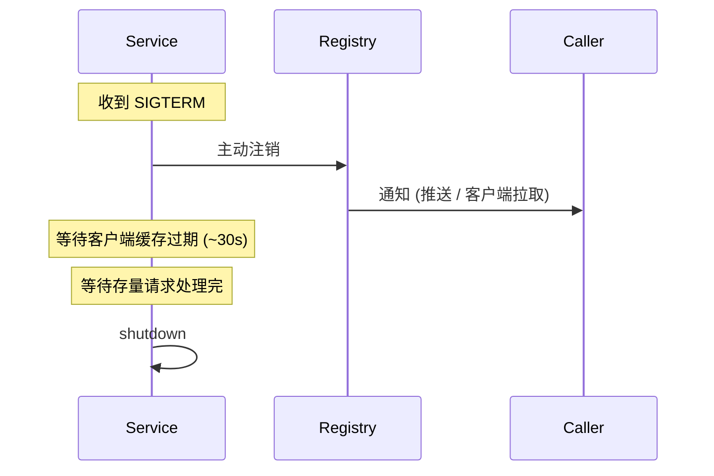

**关键**：
- **先注销再退出**（避免新请求打过来）
- **等待时间 > 客户端缓存过期**
- **等待存量请求完成**

## 六、客户端 LB 实战

### 6.1 流程

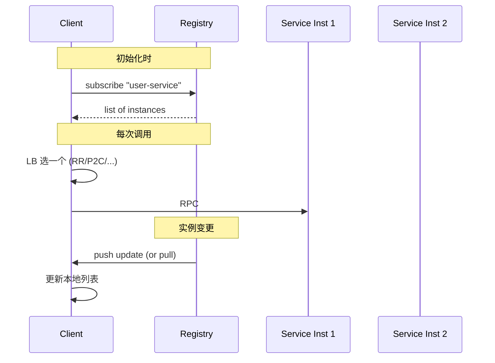

### 6.2 关键点

- **本地缓存**：注册中心挂了仍可调用
- **变更感知**：watch / 长轮询 / 推送
- **健康过滤**：踢已知失败的实例
- **失败重试**：自动切到其他实例

### 6.3 gRPC client LB

```go
conn, _ := grpc.Dial(
    "etcd:///user-service",
    grpc.WithDefaultServiceConfig(`{
        "loadBalancingConfig": [{"round_robin":{}}]
    }`),
)
```

支持：round_robin、pick_first（失败切换）。复杂策略需自定义 balancer。

### 6.4 go-zero 实战

```yaml
UserRpc:
    Etcd:
        Hosts: [127.0.0.1:2379]
        Key: user.rpc
```

go-zero 默认用 P2C 算法，自动从 etcd 获取实例。

## 七、典型坑

### 坑 1：服务实例下线但仍被调用

实例挂了但注册中心还没摘除（心跳超时还没到）→ 调用方仍调用。

**修复**：
- 客户端**失败重试**（自动切其他实例）
- 客户端**主动健康检查**（不全信注册中心）
- 优雅下线（先注销再退出）

### 坑 2：注册中心挂全瘫痪

CP 注册中心（ZK/etcd）多数派挂 → 所有客户端拿不到列表 → 全瘫痪。

**修复**：
- 客户端**本地缓存**注册列表
- 选 AP 注册中心（Eureka / Nacos AP）

### 坑 3：客户端缓存太久

服务实例已挂还在用旧缓存 → 大量失败。

**修复**：
- 缓存 TTL 合理（30s ~ 2min）
- watch 实时更新
- 客户端定期主动拉

### 坑 4：一致性 Hash 没用虚拟节点

3 个真实节点 → 流量极不均匀。

**修复**：每个节点 100~200 个虚拟节点。

### 坑 5：LB 算法选错

长连接业务用了 RR → 长连接堆积到几台机器（短期看 RR 平均，但长连接不释放）。

**修复**：长连接用 Least Conn。

### 坑 6：服务发现 + LB 混淆

```
[误解]: 服务发现 = LB
[正解]: 服务发现 = 知道有哪些实例; LB = 选哪个调
```

两者配合：发现拿列表 → LB 选一个。

### 坑 7：客户端 LB 不考虑权重

机器配置差异大但 RR 平均分流 → 弱机器先挂。

**修复**：用加权算法 + 注册时上报机器规格。

## 八、高频面试题

**Q1：服务发现的核心？**

- 服务方启动时**注册**（IP/port/元数据）
- 服务方周期**心跳**保持注册
- 消费方**订阅**服务，缓存列表
- 实例变更**推送**给消费方
- **健康检查**踢死实例

**Q2：CP 注册中心 vs AP 注册中心？**

| | CP (ZK/etcd) | AP (Eureka/Nacos AP) |
| --- | --- | --- |
| 一致性 | 强 | 最终 |
| 分区时 | 少数派不可用 | 都可服务（可能旧数据） |
| 适用 | 金融关键 | 互联网业务 |

互联网多选 AP（短暂不准 < 注册中心挂）。

**Q3：Eureka 自我保护是什么？**

Eureka 检测到节点心跳异常**超过阈值**（默认 15 分钟内 < 期望心跳数 85%）时进入"保护模式"：
- **不再剔除**任何实例（即使心跳超时）
- 宁可保留可能已死的实例，也不踢健康的

**目的**：网络分区时避免误踢。代价：客户端可能调到死实例（靠重试 + 熔断兜底）。

**Q4：一致性 Hash 解决什么问题？**

普通 hash %N 在加减节点时**几乎所有 key 都要重新分配** → 缓存大面积失效。

一致性 Hash 把节点和 key 映射到环上，加减节点**只影响相邻范围**。

虚拟节点解决数据倾斜（每节点多个虚拟点均匀分布）。

**Q5：LB 算法 RR / 最少连接 / 一致性 Hash 怎么选？**

- **RR / 加权 RR**：同构 / 异构机器，请求短均匀
- **最少连接**：长连接、处理时间差异大
- **Source Hash**：会话保持
- **一致性 Hash**：缓存命中优化（如分片缓存）
- **P2C**：动态感知节点压力

**Q6：P2C（Power of 2 Choices）原理？**

随机选 2 个节点，比较负载（连接数 / 平均 RT），选轻的。

**优势**：
- O(1) 计算
- 数学证明期望 O(log log n) 不平衡（远超 RR 的 O(log n)）

go-zero、Twitter Finagle、Kratos 默认用此算法。

**Q7：客户端 LB vs 服务端 LB 怎么选？**

| | 客户端 LB | 服务端 LB |
| --- | --- | --- |
| 多一跳 | 否 | 是 |
| 灵活 | 高（按业务定制） | 中 |
| 复杂度 | 客户端复杂 | 客户端简单 |
| 适用 | 内部 RPC | 外部 HTTP / 跨语言 |

**实战**：内部 gRPC 客户端 LB，外部 HTTP 服务端 LB（Nginx / ALB）。

**Q8：怎么实现优雅下线？**

```
1. 收到 SIGTERM
2. 注册中心注销自己 (不再被新请求路由)
3. 等待客户端缓存过期 (~30s)
4. 拒绝新请求
5. 处理完存量请求
6. 关闭连接, 退出
```

**关键**：先注销再退出，给客户端发现"我下线了"的时间。

**Q9：注册中心挂了怎么办？**

- **客户端本地缓存**：仍可用上次拿到的列表（继续调用）
- **降级到固定 IP**：兜底配置
- **告警 + 紧急恢复**

绝不能**直接全瘫**。

**Q10：服务网格（Service Mesh）和服务发现关系？**

服务网格（Istio / Linkerd）把服务发现 + LB + 熔断等**下沉到 Sidecar**（如 Envoy）：
- 业务代码无感
- 集中管控（流量、安全、监控）
- 跨语言统一

实质上**取代了客户端 LB**，但服务发现（注册中心）仍需要。

## 九、面试加分点

- 区分"服务发现"（拿列表）和"LB"（选实例）
- CP/AP 选型从"注册中心挂能否容忍"切入
- Eureka 自我保护防误踢
- 一致性 Hash 必须配合**虚拟节点**
- P2C 算法的数学优势（O(log log n) 不平衡）
- 客户端 LB 最关键的是**本地缓存兜底**
- 优雅下线的关键是"先注销再退出"
- 服务网格是客户端 LB 的演进
- Eureka 已停维护，新项目选 Nacos / Consul / etcd
- LB 算法选型从"机器同构 / 异构 / 长短连接 / 性能差异"切入
