# 分布式 · 分布式设计模式

> 幂等 / 重试退避 / 补偿 / 灰度 / 流量回放 / 链路追踪 / 雪崩防护 / 数据一致性兜底

## 一、模式全景

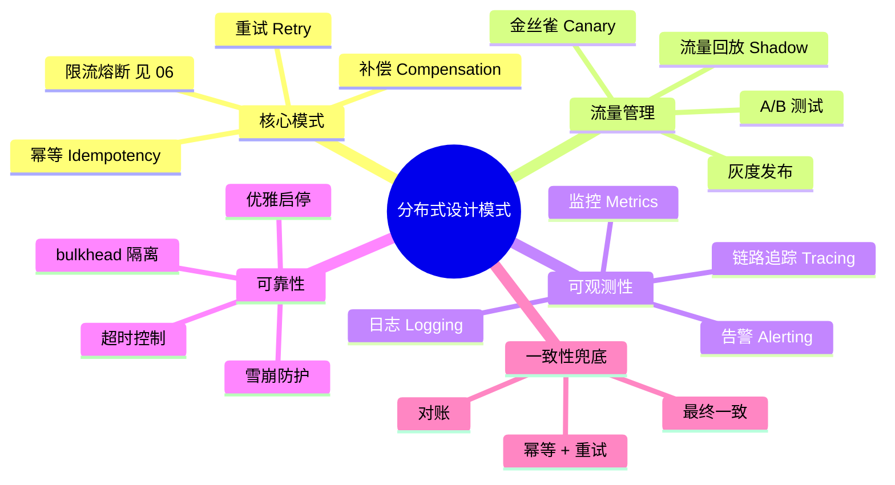

## 二、幂等（Idempotency，最重要）

### 2.1 定义

> 同一操作执行 N 次和执行 1 次的效果相同。

### 2.2 为什么必须幂等

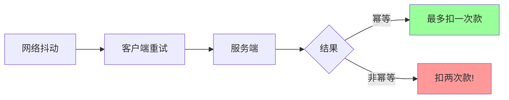

分布式系统中**任何远程调用都可能重试**：
- 网络抖动 → 客户端重试
- MQ 重投 → 消费方重复处理
- 用户重复点击
- 系统重启后未完成任务重跑

**幂等是分布式系统的根基**。

### 2.3 5 种实现方式

#### 方式 1：天然幂等

某些操作**本身就是幂等**：
- `SET x = 1`（多次设置同样的值）
- `DELETE WHERE id = 1`（删一次和多次效果一样）
- 状态置位（active 多次置 active）

#### 方式 2：唯一 ID + 去重表

```sql
CREATE TABLE dedup (
    request_id VARCHAR(64) PRIMARY KEY,
    created_at TIMESTAMP
);
```

```go
func process(reqID string, action func() error) error {
    _, err := db.Exec("INSERT INTO dedup (request_id) VALUES (?)", reqID)
    if isDupKey(err) {
        return nil  // 已处理过, 直接返回成功
    }
    return action()
}
```

**关键**：UNIQUE 约束保证只有一个能插入，其他直接返回。

#### 方式 3：状态机

```go
// 订单状态机
order := getOrder(id)
if order.Status == "paid" {
    return nil  // 已支付, 重复请求直接成功
}
if order.Status != "unpaid" {
    return ErrInvalidStatus
}
db.Exec("UPDATE orders SET status='paid' WHERE id=? AND status='unpaid'", id)
// WHERE status='unpaid' 保证并发安全
```

只允许特定状态间转换，重复请求通过状态检查识别。

#### 方式 4：乐观锁（版本号）

```sql
UPDATE products SET stock=stock-1, version=version+1
WHERE id=? AND version=?
```

并发时只有 version 匹配的能 update，其他失败重试。

#### 方式 5：Token / Nonce

请求前先获取 token：

```
1. Client: GET /token → server 返回 unique token
2. Client: POST /pay  with token → server 检查 + 标记 used
3. Server: 同一 token 第二次请求 → 拒绝
```

防止表单重复提交。

### 2.4 幂等实战例子

#### 转账接口

```go
func transfer(reqID string, from, to int64, amount int) error {
    // 1. 幂等检查
    _, err := db.Exec("INSERT INTO transfer_log (req_id) VALUES (?)", reqID)
    if isDupKey(err) {
        return queryResult(reqID)  // 返回上次结果
    }

    // 2. 状态机转账
    return db.Transaction(func(tx *Tx) error {
        var fromBal, toBal int
        tx.QueryRow("SELECT balance FROM accounts WHERE id=? FOR UPDATE", from).Scan(&fromBal)
        if fromBal < amount {
            return ErrInsufficient
        }
        tx.Exec("UPDATE accounts SET balance=balance-? WHERE id=?", amount, from)
        tx.Exec("UPDATE accounts SET balance=balance+? WHERE id=?", amount, to)
        return nil
    })
}
```

### 2.5 选型

| 场景 | 方式 |
| --- | --- |
| 简单赋值/删除 | 天然幂等 |
| 业务操作（下单、扣款） | **唯一 ID + 去重表** |
| 状态变更 | 状态机 |
| 并发更新 | 乐观锁 |
| 表单提交 | Token |

实战推荐：**唯一 ID + 去重表 + 状态机**组合。

## 三、重试

### 3.1 何时重试

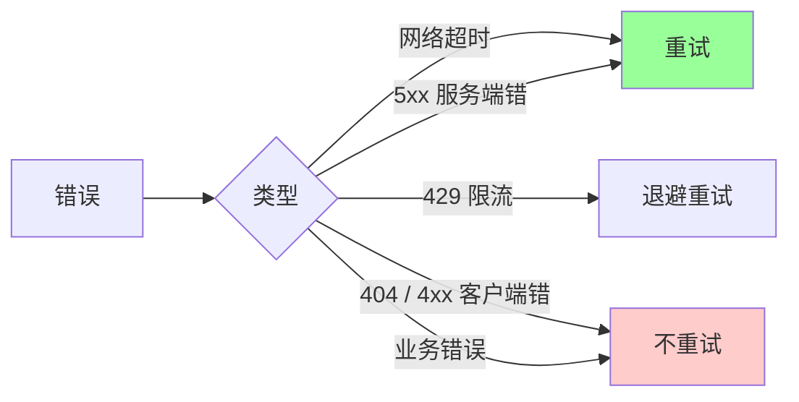

**可重试**：超时、连接失败、5xx、429。
**不可重试**：4xx（客户端错误，重试也是错）、业务错误。

### 3.2 重试风暴

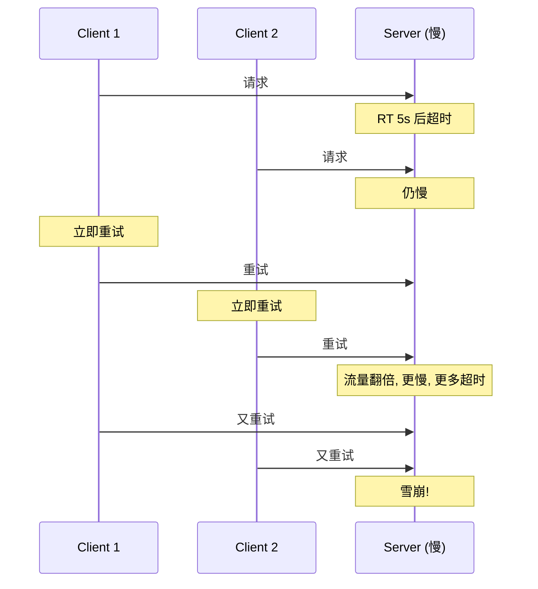

### 3.3 退避策略

#### 立即重试（最差）

```
fail → retry immediately → fail → retry...
```

打爆下游。

#### 固定间隔

```
fail → wait 1s → retry → wait 1s → retry...
```

简单但所有客户端同步重试，仍可能并发雪崩。

#### 指数退避（Exponential Backoff）

```
fail → wait 1s → fail → wait 2s → fail → wait 4s → fail → wait 8s → ...
```

```go
backoff := time.Second
for i := 0; i < maxRetries; i++ {
    err := call()
    if err == nil { return nil }
    if !shouldRetry(err) { return err }
    time.Sleep(backoff)
    backoff *= 2
}
```

#### 抖动（Jitter）

指数退避 + 随机扰动：

```go
sleep := backoff + time.Duration(rand.Int63n(int64(backoff)))
```

避免**所有客户端同时重试**（thundering herd）。

#### 完整版

```go
func retryWithBackoff(ctx context.Context, fn func() error) error {
    backoff := 100 * time.Millisecond
    maxBackoff := 30 * time.Second

    for i := 0; i < 5; i++ {
        err := fn()
        if err == nil { return nil }
        if !shouldRetry(err) { return err }

        // 指数退避 + 抖动
        jitter := time.Duration(rand.Int63n(int64(backoff)))
        sleep := backoff + jitter

        select {
        case <-time.After(sleep):
        case <-ctx.Done():
            return ctx.Err()
        }

        backoff *= 2
        if backoff > maxBackoff { backoff = maxBackoff }
    }
    return ErrMaxRetries
}
```

### 3.4 防雪崩组合拳


5 件套缺一不可：
1. **退避**：指数 + 上限
2. **抖动**：避免同时重试
3. **次数上限**：3~5 次
4. **熔断**：连续失败短路
5. **幂等**：重试不出错

### 3.5 客户端 vs 服务端重试

- **客户端重试**：自己决定
- **服务端重试**（如反向代理）：⚠️ 被代理服务必须幂等

如 Nginx 配置 `proxy_next_upstream`：失败时切换到下个 upstream。如果 POST 接口非幂等，可能扣两次款。

## 四、补偿（Compensation）

详见 `03-transaction.md` Saga 模式。

### 4.1 补偿原则

- **业务级反向操作**（不是 DB rollback）
- **幂等**（重试到成功）
- **最终成功**（重试 + 死信 + 人工兜底）

### 4.2 例子

```
正向: 创建订单 → 扣库存 → 扣款 → 发货
失败补偿:
- 发货失败 → 退款 → 加库存 → 取消订单
- 扣款失败 → 加库存 → 取消订单
- 扣库存失败 → 取消订单
```

设计阶段必须为每一步设计补偿。

## 五、灰度发布（Canary Deployment）

### 5.1 思路

新版本先**小流量**验证，没问题再全量。

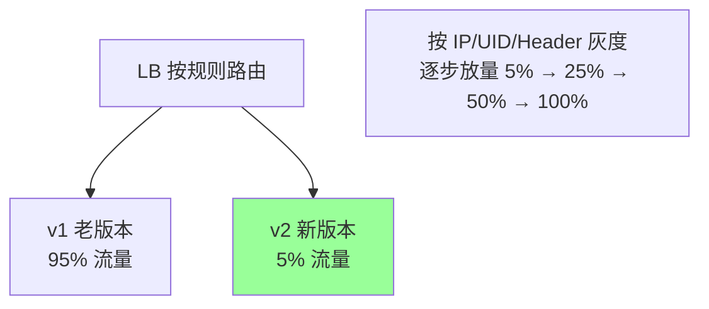

### 5.2 灰度维度

- **按比例**：5% 流量到新版本
- **按用户**：内部员工先用
- **按地理**：先在某个机房上
- **按 Header**：客户端带特定 header 的走新版

### 5.3 实战流程

1. **预发环境**：先在 staging 验证
2. **少量灰度**：5% 流量 + 监控
3. **观察指标**：错误率、RT、业务指标
4. **逐步放量**：25% → 50% → 100%
5. **回滚**：异常指标超阈值自动回滚

### 5.4 蓝绿部署 vs 灰度

| | 蓝绿 | 灰度 |
| --- | --- | --- |
| 切换 | 全量瞬时切 | 渐进 |
| 资源 | 双倍（两个全量集群） | 1.x 倍 |
| 风险 | 切换瞬间影响所有 | 影响一小部分 |
| 适用 | 不允许新老共存 | 大多场景 |

## 六、流量回放（Shadow Traffic）

### 6.1 思路

把生产流量**复制**一份打到新系统，但**不返回结果**给用户：


### 6.2 用途

- 重构前验证新实现
- 性能压测
- 数据迁移验证

### 6.3 注意

- 副作用**必须隔离**（新系统不能写真实 DB）
- 资源开销（多一份处理）
- 工具：goReplay、tcpcopy

## 七、链路追踪（Tracing）

### 7.1 为什么需要

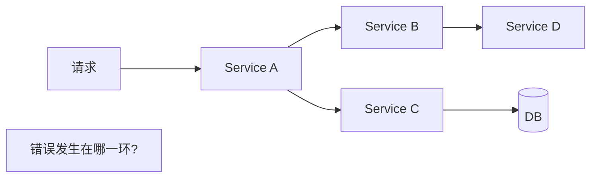

微服务链路深，排障需要**串联**整个调用链。

### 7.2 核心概念

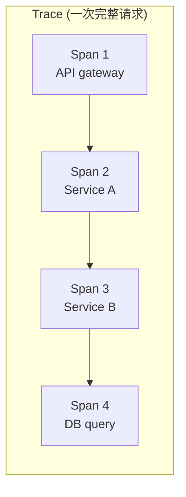

- **Trace**：一次完整调用链
- **Span**：链路中的一个节点（一个服务的一次操作）
- **Trace ID**：贯穿整个 trace 的唯一 ID
- **Span ID**：每个 span 的 ID
- **Parent Span ID**：父 span 的 ID（建立树形关系）

### 7.3 上下文透传

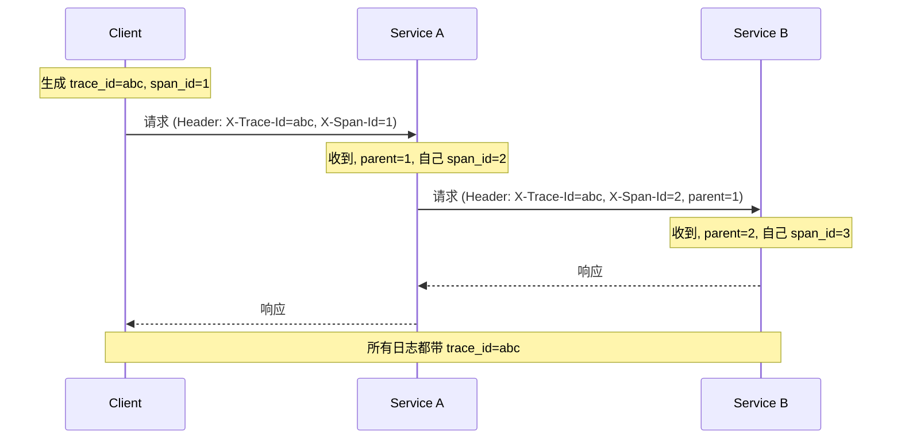

### 7.4 主流方案

| 方案 | 特点 |
| --- | --- |
| **OpenTelemetry** | CNCF 标准，统一 metrics/logs/traces |
| Zipkin | Twitter 出品 |
| Jaeger | Uber 出品，CNCF |
| SkyWalking | 国产，APM 完整 |
| Pinpoint | 韩国出品 |

新项目选 **OpenTelemetry**（事实标准）。

### 7.5 实战集成

```go
import "go.opentelemetry.io/otel"

tracer := otel.Tracer("user-service")
ctx, span := tracer.Start(ctx, "GetUser")
defer span.End()

span.SetAttributes(
    attribute.Int64("user_id", id),
)

// 调用下游, ctx 自动传 trace 信息
resp, err := downstream.Call(ctx, req)
```

## 八、监控指标（Metrics）

### 8.1 RED 方法（API/服务监控）

```
Rate    QPS
Errors  错误率
Duration RT 分布 (P50/P95/P99)
```

### 8.2 USE 方法（资源监控）

```
Utilization  使用率 (CPU/内存)
Saturation   饱和度 (队列长度)
Errors       错误数
```

### 8.3 业务指标（重要）

- 订单创建率
- 支付成功率
- 用户活跃度
- 关键路径转化

业务指标比技术指标更早反映问题。

### 8.4 主流方案

- **Prometheus + Grafana**：主流
- **InfluxDB + Grafana**：时序
- **Datadog**：商业 SaaS
- **OpenTelemetry**：标准

```go
// Prometheus 指标
import "github.com/prometheus/client_golang/prometheus"

var requestDuration = prometheus.NewHistogramVec(
    prometheus.HistogramOpts{
        Name:    "http_request_duration_seconds",
        Buckets: prometheus.DefBuckets,
    },
    []string{"method", "path", "status"},
)

// 中间件
defer requestDuration.WithLabelValues(method, path, status).Observe(elapsed.Seconds())
```

### 8.5 告警

- **黄金指标**：RED + 业务核心
- **告警阈值**：基于历史 baseline，不是拍脑袋
- **分级**：P0（立即）/ P1（小时）/ P2（工作时间）
- **告警风暴**：聚合相似告警

## 九、雪崩防护

### 9.1 雪崩链

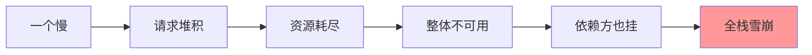

### 9.2 防御组合

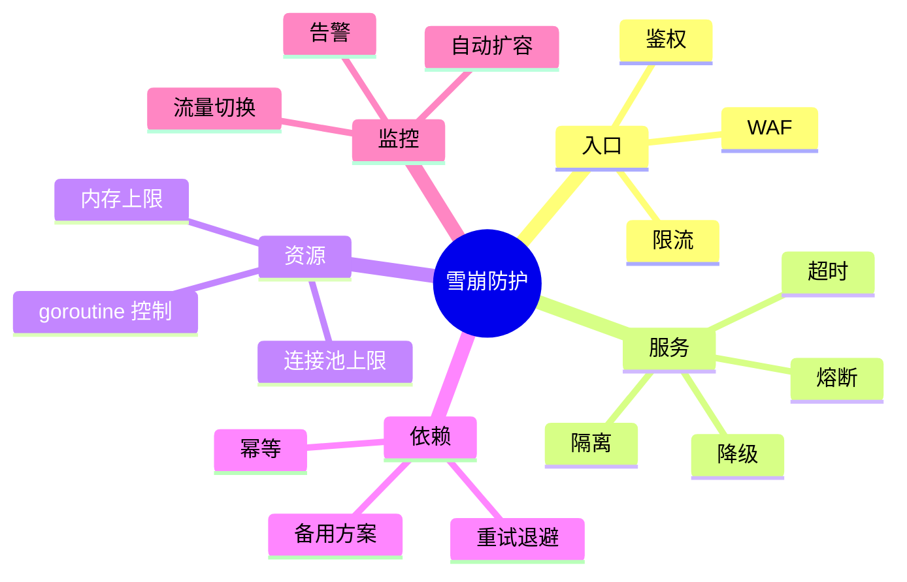

详见 `06-rate-limit-circuit.md`。

## 十、超时控制

### 10.1 超时链

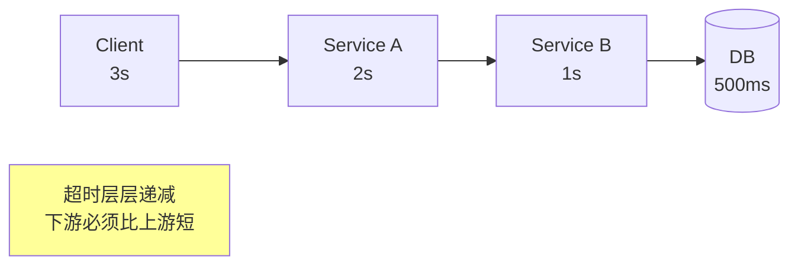

**原则**：下游超时 < 上游超时，留余量给重试和兜底。

### 10.2 ctx 透传

```go
func handler(ctx context.Context, req Req) (Resp, error) {
    ctx, cancel := context.WithTimeout(ctx, 2*time.Second)
    defer cancel()

    return callDownstream(ctx, req)  // 透传 ctx
}
```

ctx 超时所有下游调用自动停止。

### 10.3 超时常见错

```go
// 错: 超时设置不一致
client1.Timeout = 5*time.Second
client2.Timeout = 10*time.Second  // 串行调用 client1+client2 总共 15s
upstream timeout 5s → 总会超时
```

**修复**：从入口超时开始倒推每层。

## 十一、其他重要模式

### 11.1 隔离（Bulkhead）

不同业务用不同资源池，防止互相影响。详见 `06-rate-limit-circuit.md`。

### 11.2 自愈（Self-Healing）

- 实例挂 → k8s 自动重启
- 节点挂 → 重新调度
- 流量异常 → 自动扩容
- 错误率高 → 自动回滚

### 11.3 多活（Multi-Active）

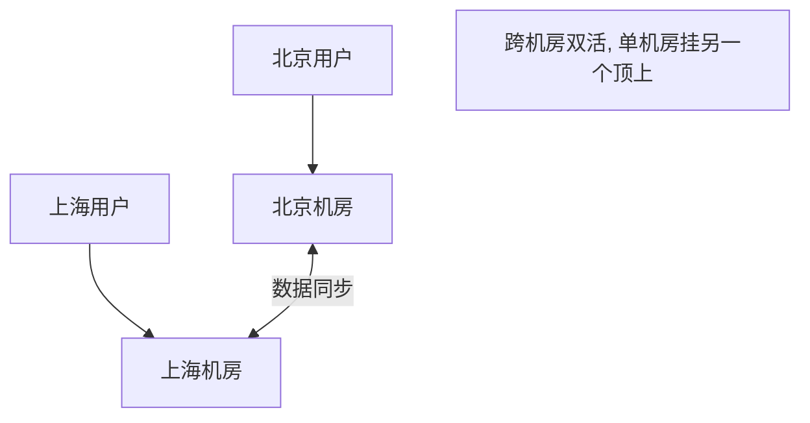

- **同城双活**：< 5ms 延迟
- **异地多活**：> 30ms，需要容忍延迟
- **数据同步**：DB 同步、缓存同步、状态同步

### 11.4 故障演练（Chaos Engineering）

主动注入故障，检验系统容错：
- 杀一个实例
- 阻断网络
- CPU/内存压满
- DB 慢

工具：Chaos Mesh / Chaos Monkey。

### 11.5 蓝绿 / 金丝雀

见第 5 节灰度。

## 十二、可观测性三件套

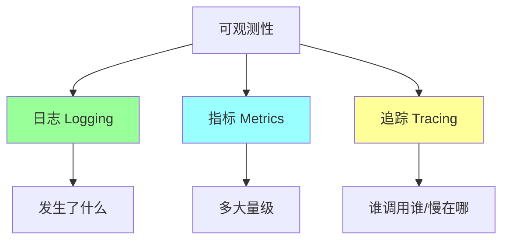

| | 日志 | 指标 | 追踪 |
| --- | --- | --- | --- |
| **维度** | 详细文本 | 数值时序 | 调用链 |
| **存储** | ELK / Loki | Prometheus | Jaeger |
| **查询** | 全文搜索 | 聚合 / 趋势 | 追踪关联 |
| **用途** | 排查具体错误 | 监控告警 | 性能瓶颈定位 |

**实战**：三者用 trace_id 关联，formed 一致的可观测性。

## 十三、典型坑

### 坑 1：以为有重试就万事大吉

```go
for i := 0; i < 3; i++ {
    if err := call(); err == nil { return nil }
}
```

立即重试 + 不退避 + 不抖动 → **打爆下游**。

### 坑 2：幂等做错

```go
// 检查 + 操作不原子
if !exists(orderID) {
    create(orderID)  // 并发下两个请求都看到不存在, 都 create
}
```

**修复**：UNIQUE 约束 + INSERT ON DUPLICATE 一步原子。

### 坑 3：超时不传递

```go
ctx, _ := context.WithTimeout(parent, 1*time.Second)
go func() {
    callDownstream(context.Background())  // 用了新 ctx, 超时丢了
}()
```

**修复**：`callDownstream(ctx)`。

### 坑 4：监控只看技术指标

CPU/内存正常但订单转化掉了 → 监控不知道。

**修复**：必加业务指标。

### 坑 5：trace_id 没贯穿

```go
// 服务 A
log.Info("got request")  // 没带 trace_id

// 服务 B
log.Info("processing")   // 没带 trace_id
```

**修复**：日志中间件统一注入 trace_id。

### 坑 6：灰度比例不均

```
按用户 ID 取模 → 老用户都在 v2, 新用户都在 v1
```

**修复**：随机灰度（或多维度）。

### 坑 7：补偿不完整

```
Saga: 步骤 1 → 2 → 3
设计了 1 和 2 的补偿, 没设计 3 的
```

**修复**：每步都要补偿。

### 坑 8：告警风暴

下游慢 → 100 个服务全告警 → SRE 看不过来。

**修复**：告警聚合 + 分级 + 抑制规则。

## 十四、高频面试题

**Q1：分布式系统怎么保证幂等？**

5 种方式：
1. **天然幂等**（SET / DELETE）
2. **唯一 ID + 去重表**（UNIQUE 约束）
3. **状态机**（WHERE status=...）
4. **乐观锁**（version）
5. **Token / Nonce**（一次性令牌）

**最常用**：唯一 ID + 状态机组合。

**Q2：怎么防止重试风暴？**

5 件套：
1. **指数退避**（1s → 2s → 4s）
2. **抖动**（避免同时重试）
3. **次数上限**（3~5）
4. **熔断**（连续失败短路）
5. **幂等**（重试不出错）

**Q3：什么样的错误可以重试？**

可重试：
- 网络超时
- 连接失败
- 5xx 服务端错误
- 429 限流（带 Retry-After）

不可重试：
- 4xx 客户端错误（参数错、未授权）
- 业务错误（库存不足）

**Q4：灰度怎么发？**

```
1. 预发环境验证
2. 5% 流量灰度 + 监控
3. 观察 1~24 小时无异常
4. 25% → 50% → 100%
5. 异常自动回滚
```

灰度维度：用户 / IP / 地域 / Header。

**Q5：链路追踪怎么实现？**

核心：**trace_id 贯穿调用链**。

```
Client 生成 trace_id → Header 透传 → 每层服务记录带 trace_id 的 log/span
→ 上报 Jaeger/Zipkin → 关联展示
```

OpenTelemetry 是标准，go-zero / kratos 内置支持。

**Q6：监控应该看哪些指标？**

**RED**（API）：
- Rate (QPS)
- Errors (错误率)
- Duration (RT P95/P99)

**USE**（资源）：
- Utilization (使用率)
- Saturation (饱和度)
- Errors (错误数)

**业务指标**：转化率、订单成功率（最早反映问题）。

**Q7：怎么做雪崩防护？**

入口：限流 + 鉴权
服务：熔断 + 隔离 + 超时 + 降级
资源：连接池 + g 控制 + 内存上限
依赖：重试退避 + 幂等
监控：告警 + 自动扩容

详见 `06-rate-limit-circuit.md`。

**Q8：超时链怎么设计？**

下游 < 上游：

```
Client (3s) → Service A (2s) → Service B (1s) → DB (500ms)
```

每层留余量给重试和兜底。

**Q9：补偿失败怎么办？**

补偿必须**最终成功**：
- 退避重试（最多 N 次）
- 死信队列（重试到上限）
- 告警 + 人工

设计阶段考虑"补偿是否一定能成功"（如外部已下线？）→ 提前规划。

**Q10：可观测性三件套？**

- **Logging**：发生了什么（详细文本）
- **Metrics**：多大量级（数值聚合）
- **Tracing**：谁调用谁（链路关联）

三者用 trace_id 关联。OpenTelemetry 是统一标准。

**Q11：分布式系统设计的第一原则是？**

**幂等**。任何远程调用都可能重试，不幂等就会出错。

其次：超时、监控、降级。

**Q12：怎么实现不停机发布？**

- **蓝绿**：双集群切换
- **滚动更新**：k8s 默认，逐步替换实例
- **金丝雀**：少量流量先试

配合**优雅停机**（先注销 → 等存量请求 → 退出）。

## 十五、面试加分点

- **幂等是分布式系统根基**（首先考虑）
- 重试 5 件套：退避 + 抖动 + 上限 + 熔断 + 幂等
- 超时层层递减（下游 < 上游）
- 监控必含**业务指标**（不只 CPU/内存）
- 链路追踪用 OpenTelemetry 标准
- 灰度按 5% → 25% → 50% → 100% 渐进
- 蓝绿 vs 灰度 vs 金丝雀的区别
- 故障演练是验证容错的最好方式
- 可观测性三件套用 trace_id 串联
- 分布式系统不可能 100% 可靠，**对账兜底必备**
- 业务上**先想能不能避开分布式**（合并到单服务）
