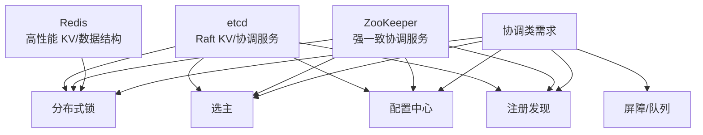
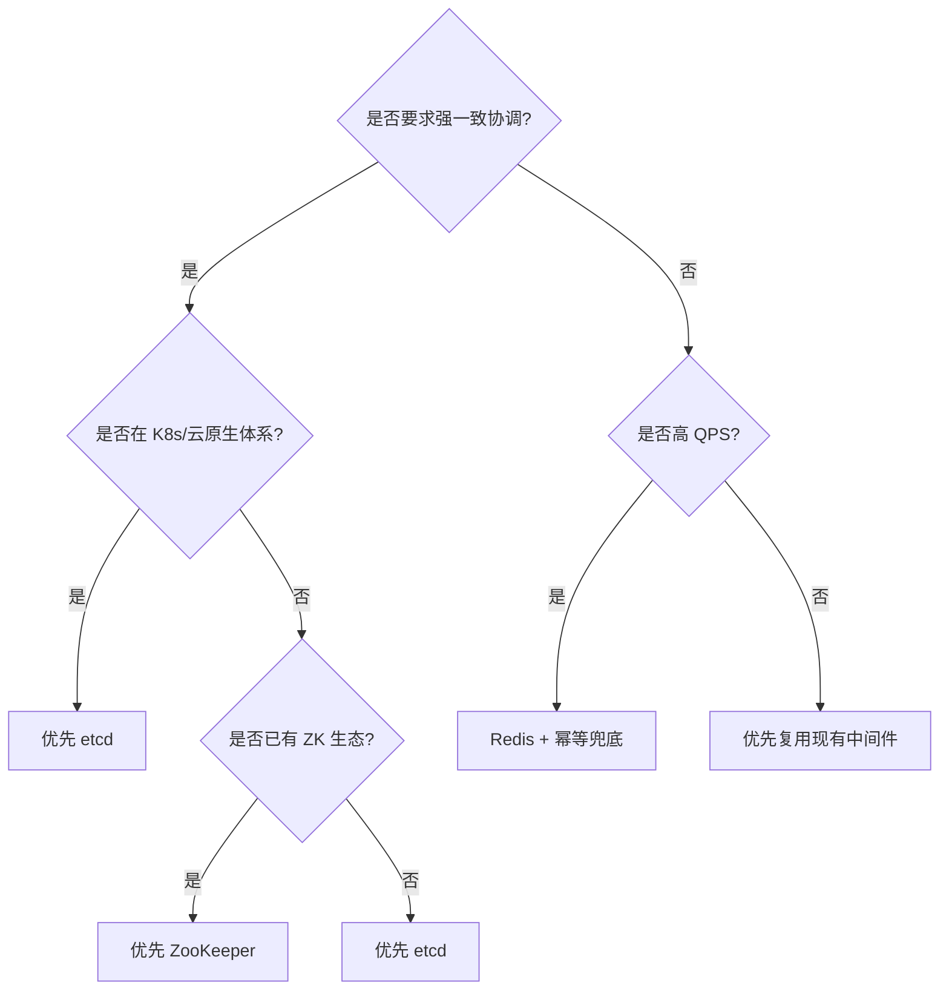

# Redis、ZooKeeper、etcd 对比与协调服务

> Redis、ZooKeeper、etcd 都能做“协调”，但它们的设计目标不同：Redis 偏高性能缓存，ZooKeeper/etcd 偏强一致协调服务。

## 一、先说结论

| 场景 | 推荐 | 原因 |
| --- | --- | --- |
| 高 QPS、允许业务幂等兜底的锁 | Redis | 性能高、接入简单 |
| 强一致分布式锁 | etcd / ZooKeeper | 基于 Raft/ZAB，有线性一致能力 |
| Kubernetes 生态 | etcd | K8s 原生依赖 etcd |
| Hadoop/Kafka 老生态 | ZooKeeper | 历史生态成熟 |
| 服务注册发现 | etcd / ZooKeeper / Nacos | 需要 watch、租约、健康感知 |
| 配置中心 | etcd / ZooKeeper / Nacos | 需要版本、watch、变更通知 |
| Leader 选举 | etcd / ZooKeeper | 需要强一致和租约/session |
| 缓存和计数 | Redis | 数据结构丰富、吞吐高 |

面试里不要说“哪个最好”，要说：

```text
Redis 更像高性能数据结构服务；
ZooKeeper / etcd 更像强一致协调服务；
选型要看一致性要求、QPS、生态、运维成本和业务兜底能力。
```

## 二、三者定位



## 三、核心机制对比

| 维度 | Redis | ZooKeeper | etcd |
| --- | --- | --- | --- |
| 核心定位 | 内存 KV / 数据结构 | 分布式协调 | 强一致 KV / 协调 |
| 一致性 | 单主强，主从异步复制有窗口 | ZAB，强一致 | Raft，强一致 |
| 数据模型 | String/Hash/List/ZSet 等 | 树形 znode | 扁平 KV + prefix |
| 临时机制 | TTL | 临时节点 + session | lease |
| 监听机制 | Pub/Sub、Keyspace 通知，不适合强依赖 | Watch | Watch |
| 事务能力 | Lua / MULTI | 多操作有限 | Txn + Compare-And-Swap |
| 典型性能 | 高 | 中 | 中 |
| 运维复杂度 | 低到中 | 中到高 | 中到高 |
| 生态 | 缓存、计数、限流 | Hadoop/Kafka 老生态 | K8s/云原生 |

## 四、一致性差异

### Redis

Redis 单主写入很快，但常见主从复制是异步的。

问题：

```text
Client A 在 Master 上加锁成功
Master 还没复制给 Slave 就宕机
Slave 被提升为 Master
Client B 又加锁成功
```

这就是 Redis 锁在强一致场景里的根本风险。

### ZooKeeper

ZooKeeper 使用 ZAB 协议，写入经过 Leader 和多数派确认。

特点：

- znode 树形结构。
- 临时节点绑定 session。
- 顺序节点天然适合公平锁。
- watch 适合配置、注册发现、锁等待。

### etcd

etcd 使用 Raft，提供强一致 KV。

特点：

- KV + prefix 适合服务发现和配置。
- lease 适合临时 key。
- watch 适合变更通知。
- Txn/CAS 适合原子条件更新。

## 五、协调场景对比

### 1. 分布式锁

| 实现 | 方式 | 优点 | 风险 |
| --- | --- | --- | --- |
| Redis | `SET key value NX PX` + Lua 解锁 | 快、简单 | 主从切换丢锁、TTL 过期、GC 暂停 |
| ZooKeeper | 临时顺序节点 | 公平、强一致、session 自动释放 | 性能较低、运维复杂 |
| etcd | lease + txn/CAS | 强一致、API 现代、续约明确 | 性能不如 Redis、运维成本 |

选择：

- 普通业务锁：Redis + 幂等兜底。
- 关键资源互斥：etcd / ZooKeeper + fencing token。
- 选主类锁：etcd / ZooKeeper。

### 2. 服务注册发现

需要能力：

- 实例临时注册。
- 健康失效自动摘除。
- watch 实例变化。
- 客户端本地缓存。

Redis 能做，但不是首选。更推荐：

- etcd：云原生、K8s 生态。
- ZooKeeper：老生态成熟。
- Nacos/Eureka：面向微服务场景更完整。

### 3. 配置中心

需要能力：

- 配置版本。
- watch 变更。
- 灰度发布。
- 回滚。
- 权限和审计。

etcd/ZooKeeper 能做底层存储，但完整配置中心通常还需要：

- 控制台。
- 权限。
- 灰度规则。
- 发布历史。
- 客户端 SDK。

### 4. Leader 选举

要求：

- 同一时刻只有一个 Leader。
- Leader 失联后能自动释放。
- 其他节点能感知变化。

推荐：

- ZooKeeper 临时顺序节点。
- etcd lease + campaign。

不推荐 Redis 做强一致选主，除非业务能接受异常并有兜底。

## 六、典型场景

### 场景 1：定时任务多实例防重复执行

如果只是防止普通任务重复跑：

```text
Redis 锁 + TTL + 任务幂等
```

如果任务影响资金、账务、库存：

```text
etcd/ZK 选主或锁 + fencing token + 幂等表
```

### 场景 2：库存扣减

不要只依赖分布式锁。

更稳的设计：

```text
Redis 预扣库存
  -> MQ 异步下单
  -> DB 条件更新兜底
  -> 对账补偿
```

核心是数据库条件更新和幂等，不是锁本身。

### 场景 3：配置变更通知

Redis Pub/Sub 丢消息风险较高，客户端断线期间可能错过通知。

更适合：

- etcd watch + revision。
- ZooKeeper watch + 重新读取。
- 专业配置中心。

## 七、选型决策



## 八、常见坑

- 用 Redis 做强一致选主，却没有 fencing token。
- 以为有分布式锁就不需要业务幂等。
- 用 Redis Pub/Sub 做可靠配置通知。
- ZooKeeper watch 触发一次后忘记重新注册。
- etcd watch 不处理 revision compact。
- 把协调服务当数据库存大对象。
- 把高频业务写入打到 ZooKeeper/etcd。
- 忽略多数派系统的可用性：3 节点挂 2 个就不可写。

## 九、面试表达

```text
Redis、ZooKeeper、etcd 的核心区别不是都能不能加锁，而是设计目标不同。
Redis 偏高性能 KV，适合高 QPS、可通过业务幂等兜底的场景；ZooKeeper 和 etcd 是强一致协调服务，更适合选主、配置、注册发现和关键资源锁。
如果是普通防重复任务，我可以用 Redis 锁；如果是资金、库存、选主这种强一致场景，我更倾向 etcd/ZK，并配合 fencing token 和业务幂等。
选型时我会看一致性要求、QPS、生态、运维成本，以及异常时业务是否能兜底。
```

