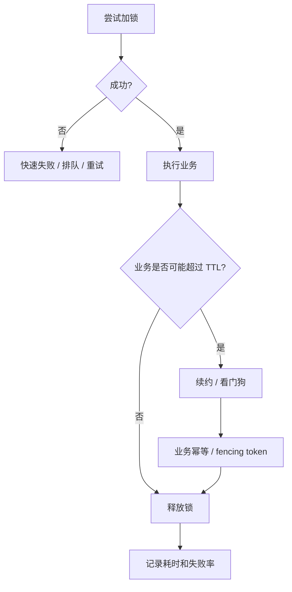
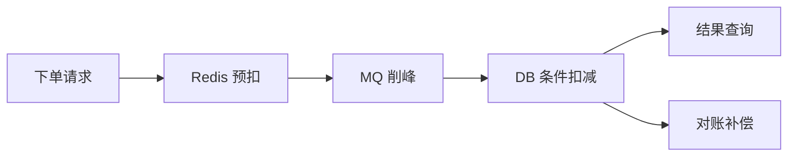
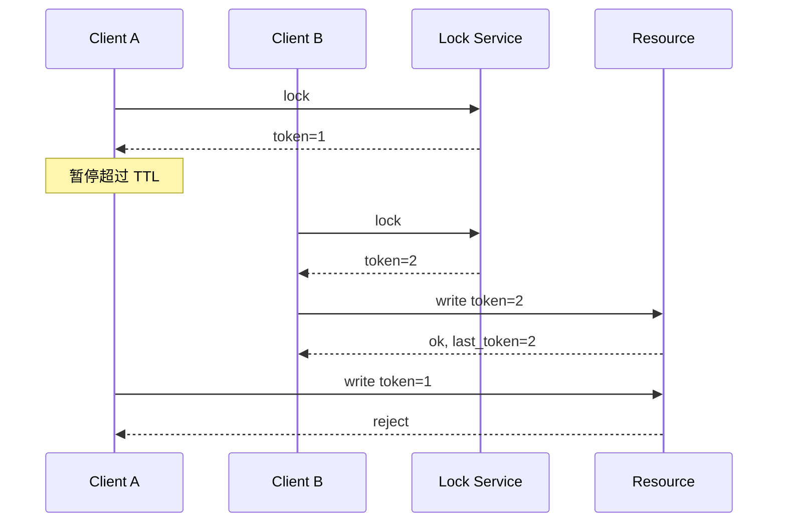

# 分布式锁场景、坑与工程实践

> 分布式锁不是银弹。正确姿势是：先判断是否真的需要锁，再设计 TTL、续约、幂等、fencing token、降级和监控。

## 一、先判断要不要用锁

很多场景不用锁也能解决：

| 目标 | 更推荐方式 |
| --- | --- |
| 防重复提交 | 幂等 key + 唯一索引 |
| 防订单重复支付 | 状态机 + 条件更新 |
| 防库存超卖 | DB 条件扣减 / Redis 预扣 + DB 兜底 |
| 防缓存击穿 | singleflight / mutex / 热点保护 |
| 定时任务单实例运行 | Leader 选举 / 调度平台 |

判断原则：

```text
能用数据库唯一约束、状态机、CAS、幂等解决，就不要先上分布式锁。
```

## 二、分布式锁的完整链路



一把工程上可用的锁至少要考虑：

- 锁 key 怎么设计。
- value 是否唯一。
- TTL 多长。
- 是否需要续约。
- 解锁是否校验持有者。
- 加锁失败怎么办。
- 锁失效后业务如何兜底。
- 是否需要 fencing token。
- 监控哪些指标。

## 三、场景 1：防重复提交

常见需求：

- 用户连续点击。
- 网关重试。
- 客户端超时后重发。

更推荐：

```text
request_id / idempotency_key
  -> 幂等表
  -> 唯一索引
  -> 状态复用
```

不要优先用分布式锁，因为：

- 锁过期后仍可能重复。
- 锁服务故障会影响主链路。
- 幂等才是最终兜底。

面试表达：

```text
防重复提交我优先用幂等 key 和唯一索引，而不是分布式锁。
分布式锁只能降低并发进入概率，不能替代最终一致的业务幂等。
```

## 四、场景 2：定时任务防多跑

多实例部署时，定时任务可能重复执行。

普通任务：

```text
Redis lock:job:{job_name}
TTL > 任务预估最长时间
任务自身幂等
```

关键任务：

```text
etcd / ZK leader election
任务执行记录表
任务分片
失败重试和补偿
```

常见坑：

- TTL 设太短，任务没跑完锁过期。
- 任务卡死，TTL 太长导致长时间不执行。
- 加锁失败直接丢任务，没有补偿。
- 没有任务执行记录，无法判断是否跑过。

## 五、场景 3：缓存击穿重建

目标：

```text
热点 key 过期
大量请求同时打到 DB
```

常见方案：

```text
请求发现缓存 miss
  -> 尝试抢重建锁
  -> 抢到锁：查 DB 并回填缓存
  -> 没抢到：短暂等待、返回旧值、降级
```

注意：

- 锁粒度要到 key 级别。
- 热点 key 可以逻辑过期。
- 可以返回 stale 数据保护 DB。
- 重建失败要避免大量请求继续穿透。

## 六、场景 4：库存扣减

不要把“防超卖”完全寄托在锁上。

更稳链路：



DB 兜底：

```sql
UPDATE sku_stock
SET stock = stock - 1
WHERE sku_id = ? AND stock > 0;
```

如果影响资金或库存，必须有：

- 幂等订单号。
- 条件更新。
- 状态机。
- 对账和补偿。
- 失败回滚库存。

## 七、场景 5：订单状态流转

错误做法：

```text
用锁保证同一订单同一时刻只有一个操作
```

更稳做法：

```sql
UPDATE orders
SET status = 'PAID'
WHERE order_id = ? AND status = 'UNPAID';
```

订单状态机要保证：

- 状态只能合法流转。
- 重复回调幂等。
- 并发更新只有一个成功。
- 失败可以补偿。

锁可以降低并发冲突，但状态机和条件更新才是核心。

## 八、场景 6：Leader 选举

适合：

- 主备任务。
- 单 leader 调度。
- 集群管理。

推荐：

- ZooKeeper 临时顺序节点。
- etcd campaign / election。

不建议：

- Redis 单点锁做强一致 leader。

原因：

- 主从切换可能丢锁。
- GC 暂停可能导致旧 leader 继续工作。
- 没有 fencing token 时资源无法识别旧 leader。

## 九、关键坑

### 1. 锁没有 TTL

客户端崩溃后死锁。

修复：

```text
SET key value NX PX ttl
```

### 2. 解锁没有校验 value

A 的锁过期，B 拿到锁，A 执行 `DEL key` 把 B 的锁删了。

修复：

```text
Lua: if get(key) == value then del(key)
```

### 3. TTL 小于业务耗时

业务还没执行完，锁过期，其他客户端进入。

修复：

- 预估 P99 耗时。
- 看门狗续约。
- 业务幂等。
- fencing token。

### 4. GC / STW 导致锁过期

```text
A 持锁
A STW 30s
锁 TTL 10s 过期
B 拿锁
A 恢复后继续写
```

修复：

- fencing token。
- 资源侧版本校验。
- 业务状态机。

### 5. 只依赖锁，不做幂等

任何锁都有异常窗口。

最终兜底：

- 唯一索引。
- 状态机。
- 条件更新。
- 幂等表。
- 对账补偿。

### 6. 锁粒度太粗

```text
lock:stock
```

所有商品抢一把锁，吞吐很低。

更好：

```text
lock:stock:{sku_id}
lock:order:{order_id}
lock:cache:{key}
```

## 十、fencing token

fencing token 是单调递增版本号。



适合：

- DB 写入。
- 文件写入前有元数据版本。
- 调度命令有版本号。

不适合：

- 不支持版本校验的外部系统。
- 无法控制资源侧逻辑的场景。

## 十一、监控指标

分布式锁要监控：

- 加锁成功率。
- 加锁耗时。
- 加锁失败次数。
- 锁持有时间。
- 续约失败次数。
- 解锁失败次数。
- 业务执行耗时 P99。
- 锁 key 热点。

异常信号：

- 锁等待时间持续升高。
- 某个 key 加锁失败率很高。
- 续约失败后业务仍继续执行。
- 锁持有时间超过 TTL。

## 十二、面试表达

```text
我不会一上来就用分布式锁，而是先看能不能用唯一索引、状态机、CAS 或幂等表解决。
如果必须用锁，Redis 适合高 QPS 普通业务，但要有 TTL、唯一 value、Lua 解锁、看门狗和幂等兜底。
如果是选主、资金、库存这类强一致场景，我更倾向 etcd/ZK，并配合 fencing token，避免旧持有者在锁过期后继续写。
工程上还要监控加锁耗时、失败率、持有时间、续约失败和热点 key。
```

