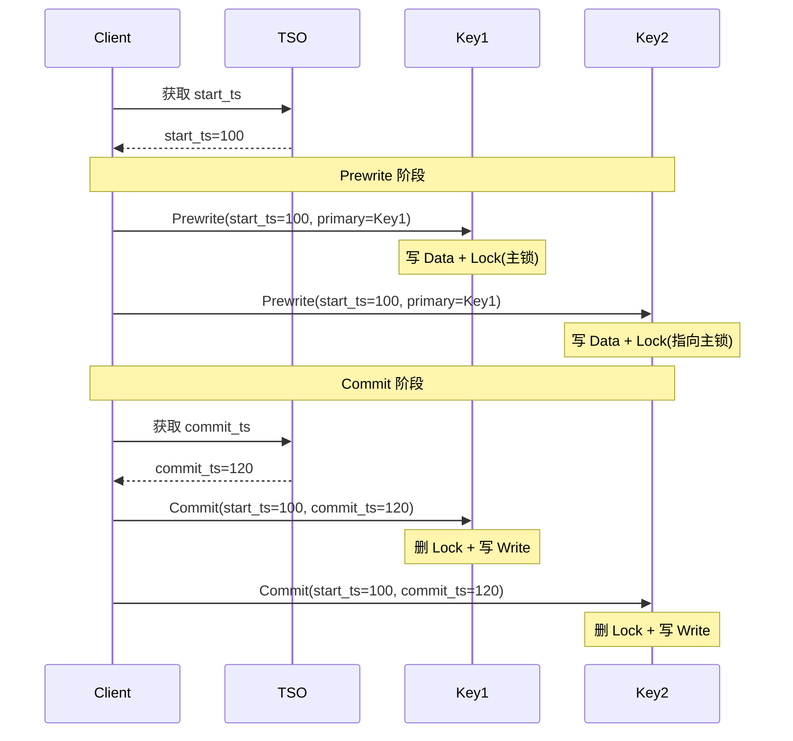
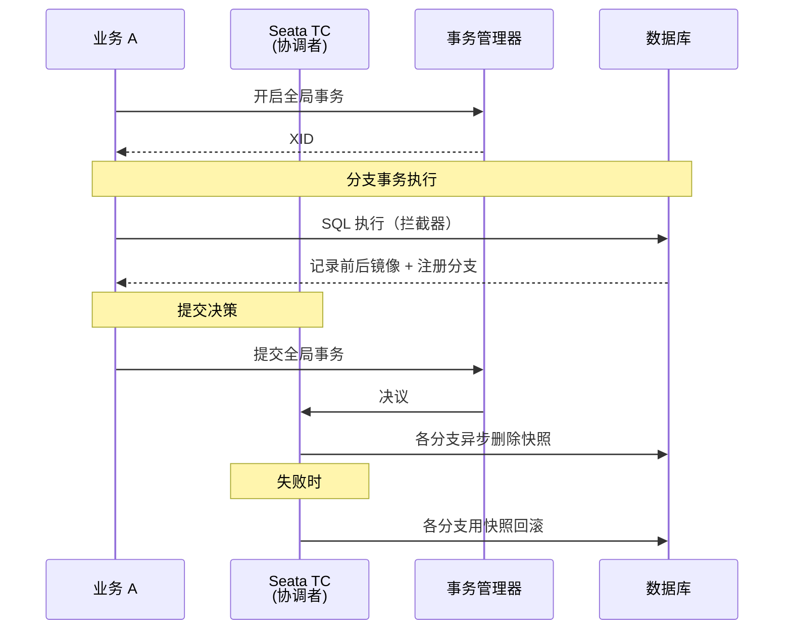
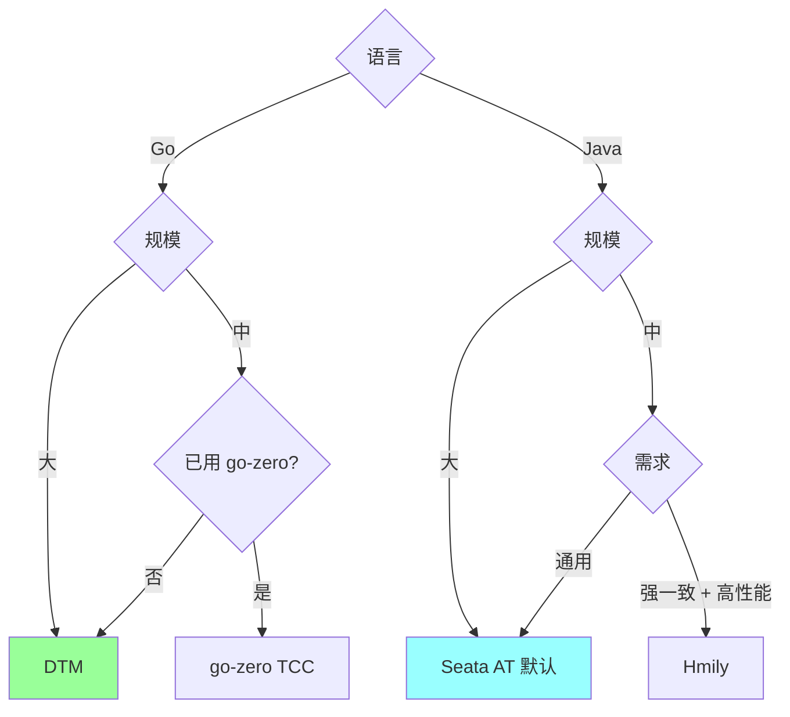
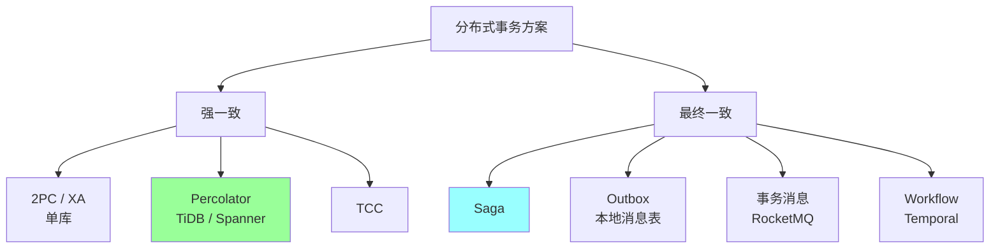

# NewSQL Percolator 模型 + TCC 框架对比

> 深化 [distributed/03-transaction](../06-distributed/03-transaction.md)：TiDB / CockroachDB / Spanner 的分布式事务原理（Percolator 模型）+ TCC 主流框架（Seata / Hmily / DTM）实战对比
>
> 资深工程师必懂：分布式事务的现代实现 + 框架选型

---

## 一、Percolator 模型（Google 论文）

### 1.1 是什么

> **Percolator** = Google 2010 年论文，基于 BigTable 实现强一致跨行事务的方案。**TiDB / CockroachDB / TiKV / YugabyteDB** 都用此模型或变种。

**核心创新**：
- **分布式 2PC + MVCC + 时间戳**
- **去中心化事务管理**（不需要 TM 单点）
- **乐观并发控制**

### 1.2 关键概念

```
TSO (Timestamp Oracle): 全局时间戳分配器（保证时间单调递增）
MVCC: 多版本并发控制
Lock + Write + Data 三列：每行数据有 3 列存储不同含义
```

### 1.3 三列存储

| 列 | 含义 | 内容 |
| --- | --- | --- |
| **Data** | 数据列 | 真实数据（按时间戳版本） |
| **Lock** | 锁列 | 锁信息（事务 ID + 主锁位置） |
| **Write** | 写记录列 | 已提交事务的指针 |

### 1.4 事务流程



### 1.5 关键设计

#### 1. 主锁（Primary Lock）

```
事务的所有 key 中选一个为主锁
其他 key 的锁指向主锁

提交时:
1. 主锁先提交（成功 = 整个事务成功）
2. 其他锁异步清理（指向主锁，从主锁状态判断）

崩溃恢复:
- 主锁未提交 → 整事务回滚
- 主锁已提交 → 其他锁异步提交
```

#### 2. MVCC 读

```
读 key (read_ts)：
1. 找 Write 列：commit_ts <= read_ts 的最新一条
2. 用 Write 找到对应 Data 版本
3. 返回数据
```

读不阻塞写，写不阻塞读。

#### 3. 冲突检测

```
Prewrite 时:
- 检查 Lock 列：是否被其他事务锁定
- 检查 Write 列：是否有 commit_ts > start_ts 的提交

如果冲突 → 回滚
```

### 1.6 优缺点

**优点**：
- **无单点 TM**（去中心化）
- **强一致**（线性一致性）
- **MVCC 读不阻塞**
- **悲观锁可选**（行级，类似 MySQL）

**缺点**：
- 写冲突时回滚成本高
- TSO 是潜在瓶颈（PD 集群）
- 锁清理需要后台进程
- 长事务影响 GC

### 1.7 vs 传统 2PC

| | 传统 2PC | Percolator |
| --- | --- | --- |
| 协调者 | 集中式 TM | 去中心化（主锁） |
| 单点故障 | 有 | 无 |
| 性能 | 低 | 较高 |
| 一致性 | 强 | 强 |
| 实现复杂度 | 中 | 高 |

---

## 二、TiDB 事务实战

### 2.1 TiDB 事务模式

```
乐观事务（默认 < 4.0）:
  - 提交时检测冲突
  - 适合冲突少
  - 写多冲突高时退化

悲观事务（4.0+ 默认）:
  - 类似 MySQL 行锁
  - 加锁阻塞其他事务
  - 适合冲突多
```

### 2.2 配置

```sql
-- 乐观事务
SET tidb_txn_mode='optimistic';

-- 悲观事务
SET tidb_txn_mode='pessimistic';

-- 大事务
SET tidb_constraint_check_in_place=0;
SET tidb_mem_quota_query=4 << 30;
```

### 2.3 大事务限制

```
TiDB 大事务限制（5.0 之前）:
  单事务 ≤ 100MB
  单事务 ≤ 30 万 key

5.0+ 放宽到 1 GB

> 1GB 仍然不行，要拆分
```

### 2.4 隔离级别

```
TiDB 默认: SI (Snapshot Isolation)
  - 等价于 RR
  - 不阻塞读
  - 写偏序可能（write skew）

可选 RC：set tx_isolation = 'READ-COMMITTED'
```

### 2.5 与 MySQL 区别

| | MySQL | TiDB |
| --- | --- | --- |
| 默认隔离 | RR | SI（≈ RR） |
| 锁 | 行锁 | 行锁（悲观）/ 提交时检测（乐观） |
| 并发 | 中 | 高 |
| 大事务 | 限制少 | 1GB / 30万 key |
| 跨节点 | 不支持 | 支持 |
| 自动分片 | 否 | 是（Region） |

### 2.6 实战陷阱

```
❌ 长事务（持锁久）→ 影响 GC
❌ 大事务 → 内存爆 / 超限制
❌ 高冲突场景用乐观 → 频繁重试
✅ 查询少用 SELECT *（影响 SI snapshot）
✅ 用 BATCH INSERT 替代大量 INSERT
✅ 跨表更新尽量同事务
```

---

## 三、Spanner / CockroachDB 简介

### 3.1 Spanner（Google）

```
Spanner = Google 全球分布式 SQL DB

关键技术:
  - TrueTime API（GPS + 原子钟，时间不确定 < 7ms）
  - Paxos 复制
  - 跨地域强一致

事务:
  - 只读: 单 timestamp 快照读
  - 读写: 2PC + Paxos
  - 全球一致

代价:
  - 写延迟受 commit-wait 影响（需要等时间不确定窗口）
```

### 3.2 CockroachDB

```
CockroachDB = 开源版 "Spanner Lite"

关键技术:
  - HLC（Hybrid Logical Clock，逻辑+物理混合时钟）
  - Raft 复制
  - 类似 Percolator 的事务

特点:
  - 兼容 PostgreSQL 协议
  - 原生分布式
  - 自动分片（Range）
```

### 3.3 TiDB vs CockroachDB vs Spanner

| | TiDB | CockroachDB | Spanner |
| --- | --- | --- | --- |
| 时间戳 | TSO 中心化 | HLC 去中心化 | TrueTime（硬件） |
| 协议兼容 | MySQL | PostgreSQL | 自有 |
| 复制 | Raft | Raft | Paxos |
| 跨地域 | 支持 | 强项 | 强项（全球） |
| 开源 | ✅ | ✅ | ❌ |
| 主要场景 | OLTP / HTAP | OLTP | 全球业务 |

---

## 四、TCC 框架对比

### 4.1 主流框架

| | Seata | Hmily | DTM | go-zero（自带） |
| --- | --- | --- | --- | --- |
| 厂商 | 阿里 | 国产 | 国产 Go | 好未来 |
| 语言 | Java | Java | **Go** | Go |
| 事务模式 | AT / TCC / SAGA / XA | TCC / SAGA | TCC / SAGA / 消息 / XA / 二阶段消息 | TCC / Saga |
| 业务侵入 | AT 低 / TCC 高 | TCC 高 | 中 | TCC 高 |
| 性能 | 中 | 高 | **极高**（Go） | 中 |
| 国内活跃 | **极高** | 中 | 中 | 中 |
| 文档 | 完善 | 一般 | 完善 | 一般 |

### 4.2 Seata（阿里）

**4 种模式**：

#### AT 模式（自动事务）

```
原理:
1. 业务 SQL 执行前先记录"前镜像"（快照）
2. 业务 SQL 执行后记录"后镜像"
3. 出错时用前镜像回滚

特点:
  - 业务无侵入（自动生成回滚日志）
  - 仅支持关系型 DB
  - 全局锁（隔离性问题）

适合: 普通 CRUD
```

#### TCC 模式

```
Try / Confirm / Cancel 三阶段
业务侵入大但隔离性好

适合: 强隔离需求（如金融转账）
```

#### Saga 模式

```
状态机驱动的长事务
基于 Seata Saga 编排

适合: 长流程、低一致需求
```

#### XA 模式

```
传统 2PC + DB 原生 XA 接口

适合: 强一致 + 性能不敏感
```

### 4.3 Seata AT 模式深入

**关键流程**：


**痛点**：
- 全局锁（性能瓶颈）
- 异步删除快照（短期空间占用）
- 复杂 SQL 不支持

### 4.4 Hmily

```
特点:
  - 高性能 TCC（无中心协调）
  - 异步执行 Confirm / Cancel
  - 支持 Spring Cloud / Dubbo

适合: 高并发 TCC 场景
```

### 4.5 DTM（Go 生态首选）

**特点**：
```
- Go 语言原生
- 多语言客户端（Go / Java / PHP / Python）
- 支持模式: TCC / Saga / 消息 / XA / 二阶段消息
- 高性能（Go 协程模型）
- 简单易上手
```

**TCC 示例（Go）**：
```go
import "github.com/dtm-labs/client/dtmcli"

func TransferOut(req *gin.Context) {
    body := dtmcli.MustGetTccContextBody(req)
    // Try: 冻结 100 元
    db.Exec("UPDATE accounts SET balance=balance-?, frozen=frozen+? WHERE id=?",
        body.Amount, body.Amount, body.From)
    req.JSON(200, gin.H{"success": true})
}

func TransferOutConfirm(req *gin.Context) {
    body := dtmcli.MustGetTccContextBody(req)
    // Confirm: 解冻 + 扣减
    db.Exec("UPDATE accounts SET frozen=frozen-? WHERE id=?",
        body.Amount, body.From)
    req.JSON(200, gin.H{"success": true})
}

func TransferOutCancel(req *gin.Context) {
    body := dtmcli.MustGetTccContextBody(req)
    // Cancel: 解冻 + 还原
    db.Exec("UPDATE accounts SET balance=balance+?, frozen=frozen-? WHERE id=?",
        body.Amount, body.Amount, body.From)
    req.JSON(200, gin.H{"success": true})
}

// 发起事务
gid := dtmcli.MustGenGid("http://dtm:36789/api/dtmsvr")
err := dtmcli.TccGlobalTransaction("http://dtm:36789/api/dtmsvr", gid, func(tcc *dtmcli.Tcc) error {
    _, err := tcc.CallBranch(req, "http://api/transOut", "http://api/transOutConfirm", "http://api/transOutCancel")
    return err
})
```

### 4.6 go-zero 自带

```
内置 TCC / Saga 支持
适合 go-zero 项目（已用此框架）

特点:
  - 集成度高
  - 没有专门的协调中心（用 etcd）
```

### 4.7 选型决策



**实战建议**：
- **Java + 大厂** → Seata（业内事实标准）
- **Go 项目** → DTM
- **简单业务 / 单 DB** → 不用框架，业务层 TCC + 对账
- **金融** → Seata XA / 自研

---

## 五、TCC 实战痛点

### 5.1 三个必须解决的问题

#### 问题 1：空回滚

```
场景:
  Try 没执行（网络超时 / 崩溃）
  Cancel 来了 → 回滚什么？

解决:
  Cancel 检查 Try 是否执行过
  - 维护事务日志表
  - Cancel 前查日志
```

#### 问题 2：悬挂

```
场景:
  Cancel 先到（Try 网络慢被卡）
  Try 后到 → 资源被占用

解决:
  Try 前检查是否已经 Cancel
  Cancel 标记 → Try 看到标记后跳过
```

#### 问题 3：幂等

```
场景:
  Confirm / Cancel 重试多次

解决:
  Confirm / Cancel 都要幂等
  - 用唯一事务 ID
  - 状态机迁移（已确认不再确认）
```

### 5.2 实战 SQL 示例

```sql
-- 事务日志表
CREATE TABLE tx_log (
    xid VARCHAR(50) PRIMARY KEY,
    branch_id VARCHAR(50),
    state TINYINT,  -- 1: TRY 完成 / 2: CONFIRM 完成 / 3: CANCEL 完成
    UNIQUE KEY (xid, branch_id)
);

-- Try 执行前
INSERT INTO tx_log (xid, branch_id, state) VALUES (?, ?, 1)
ON DUPLICATE KEY UPDATE state=state;  -- 已存在不变（幂等）

-- 业务 Try
UPDATE accounts SET balance=balance-?, frozen=frozen+?
WHERE id=? AND balance>=?;

-- Confirm 检查 Try 是否执行
SELECT state FROM tx_log WHERE xid=? AND branch_id=?;
-- state=1 → 执行 Confirm
-- state=2 → 已 confirm，跳过（幂等）
-- 不存在 → 空回滚问题

-- Cancel 检查
SELECT state FROM tx_log WHERE xid=? AND branch_id=?;
-- state=1 → 执行 Cancel
-- state=3 → 已 cancel，跳过
-- 不存在 → 空回滚（写一条 state=3 防止 Try 后到）
```

---

## 六、二阶段消息（DTM 特色）

```
传统流程:
  本地事务 → 发 MQ
  问题: 本地成功但 MQ 失败 → 不一致

DTM 二阶段消息:
  Phase 1: 本地事务 + 准备消息（DTM 记录）
  Phase 2: 本地成功 → DTM 投递消息

特点:
  - 类 RocketMQ 事务消息但通用
  - 可对接任意 MQ
  - 业务无侵入
```

---

## 七、新方案：Saga + Workflow 引擎

### 7.1 Temporal / Cadence

```
基于 Workflow 编程模型
- 写代码定义 workflow
- 框架处理重试 / 持久化 / 失败补偿
- 适合复杂业务流程
```

**Temporal 示例**：
```go
func OrderWorkflow(ctx workflow.Context, orderID string) error {
    // 步骤 1: 创建订单
    err := workflow.ExecuteActivity(ctx, CreateOrderActivity, orderID).Get(ctx, nil)
    if err != nil { return err }

    // 步骤 2: 扣减库存
    err = workflow.ExecuteActivity(ctx, DeductStockActivity, orderID).Get(ctx, nil)
    if err != nil {
        // 自动补偿
        workflow.ExecuteActivity(ctx, CancelOrderActivity, orderID)
        return err
    }

    // 步骤 3: 支付
    err = workflow.ExecuteActivity(ctx, PaymentActivity, orderID).Get(ctx, nil)
    if err != nil {
        workflow.ExecuteActivity(ctx, RestoreStockActivity, orderID)
        workflow.ExecuteActivity(ctx, CancelOrderActivity, orderID)
        return err
    }

    return nil
}
```

**优势**：
- Workflow 代码即文档
- 自动持久化状态
- 失败重试 / 补偿框架处理
- 时间旅行调试

**劣势**：
- 框架重
- 学习曲线陡
- 部署运维复杂

### 7.2 适合场景

```
✅ 复杂业务流程（5+ 步骤）
✅ 长时间运行（小时-天）
✅ 需要可审计
✅ 跨服务编排

❌ 简单 2-3 步事务
❌ 性能敏感
❌ 团队不熟
```

---

## 八、对比总览



### 8.1 选型矩阵

| 场景 | 推荐方案 |
| --- | --- |
| 单 DB 内 | DB 事务（ACID） |
| 跨多个 MySQL | TCC / Saga / Outbox |
| 跨多 DB 强一致 | TiDB / Spanner（NewSQL） |
| 业务+消息原子 | Outbox / RocketMQ 事务消息 |
| 跨服务长流程 | Saga / Temporal |
| 金融 / 强隔离 | TCC + 对账 |
| Go 生态 | DTM |
| Java 生态 | Seata |

---

## 九、实战经验

### 9.1 不要硬塞分布式事务

```
✅ 优先方案:
  1. 拆服务时按聚合根（DDD）保单聚合事务
  2. 跨聚合用事件最终一致
  3. 实在不行才用框架

❌ 反模式:
  1. 简单业务上 Seata（杀鸡用牛刀）
  2. 强行所有跨服务都强一致
```

### 9.2 兜底是必须

```
任何分布式事务方案 + 对账 = 完整闭环

定时对账（T+1）+ 实时对账（关键链路）
发现不一致 → 告警 → 人工/自动修复
```

### 9.3 监控

```
- 事务成功率
- 平均耗时
- 重试次数
- 补偿次数
- 悬挂事务
```

---

## 十、面试 / 实战高频问

### Q1: TiDB 怎么实现分布式事务？

**答**：
- 基于 Percolator 模型
- 分布式 2PC + MVCC + TSO 时间戳
- 主锁机制（去中心化）
- Raft 复制
- 默认 SI 隔离

### Q2: Percolator 模型核心？

**答**：
- 三列存储（Data/Lock/Write）
- 主锁（Primary Lock）→ 去中心化
- TSO 全局时间戳
- 乐观并发控制

### Q3: TiDB vs MySQL 选型？

**答**：
- 单 DB 够用 → MySQL（简单 + 生态成熟）
- 数据 > 10 亿 + 强一致 → TiDB
- 跨地域 → CockroachDB / Spanner
- 团队熟悉度也重要

### Q4: Seata AT vs TCC 选哪个？

**答**：
- AT：业务无侵入，普通 CRUD 用
- TCC：业务侵入大，但隔离性好（金融）

### Q5: TCC 三个必解问题？

**答**：
- **空回滚**（Try 没执行 Cancel 来）
- **悬挂**（Cancel 先到 Try 后到）
- **幂等**（重试多次）

都靠**事务日志表**解决。

### Q6: DTM vs Seata？

**答**：
- DTM：Go 原生 + 多语言 + 多模式
- Seata：Java 强 + 阿里背书 + AT 模式独特

### Q7: Outbox vs 事务消息？

**答**：
- Outbox：业务自实现，与 DB 耦合，通用
- RocketMQ 事务消息：MQ 内置，与 MQ 耦合，方便

### Q8: 强一致一定要分布式事务吗？

**答**：
- 不一定
- 业务幂等 + 对账 也能保最终一致
- 强一致代价高，按需用

### Q9: Temporal 适合什么？

**答**：
- 复杂多步业务流程
- 长时间运行（小时-天）
- 需要可审计 / 时间旅行调试

### Q10: 你做过的分布式事务实战？

**答**（结构化）：
- 业务背景
- 选型理由（vs 其他方案）
- 实施细节（防空回滚 / 悬挂 / 幂等）
- 问题 + 解决
- 量化结果（成功率 / 延迟）

---

## 十一、推荐阅读

```
论文:
  □ 《Large-scale Incremental Processing Using Distributed Transactions and Notifications》(Percolator)
  □ 《Spanner: Google's Globally-Distributed Database》

文档:
  □ TiDB 文档（事务模型）
  □ CockroachDB 文档
  □ Seata 文档
  □ DTM 文档
  □ Temporal 文档

文章:
  □ 《How TiDB transaction works》PingCAP 博客
  □ 《Saga Pattern》Microservices.io
```

---

## 十二、面试加分点

- **Percolator 模型**：去中心化 2PC + MVCC + TSO（TiDB 核心）
- **TiDB 默认 SI**（≈ MySQL RR）
- **Seata AT vs TCC vs Saga vs XA** 各自适合场景
- **DTM 是 Go 生态首选**
- **Temporal / Cadence** 适合复杂 workflow
- **TCC 三大必解**：空回滚 / 悬挂 / 幂等
- **业务 + 对账** 是兜底
- **不要为强一致而强一致**，最终一致 + 对账 = 商业级
- **分布式事务监控**必备：成功率 / 重试 / 悬挂数
- 真实案例：阿里 Seata / 字节 ByteTSO / TiDB 内部
