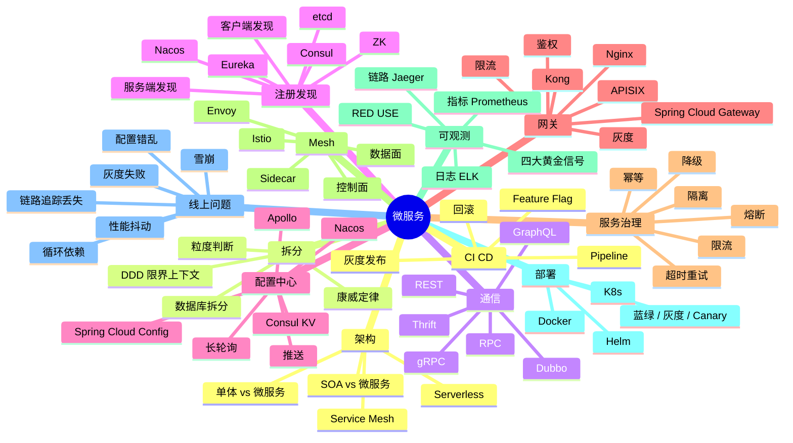
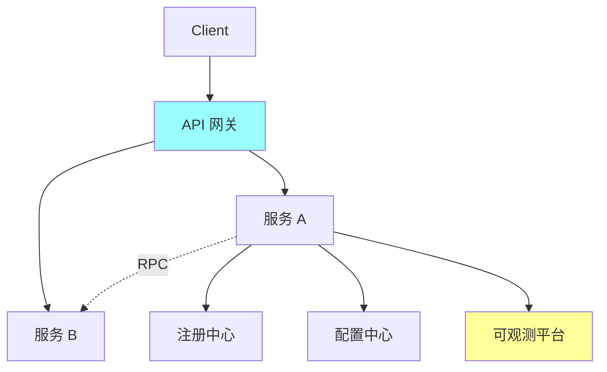
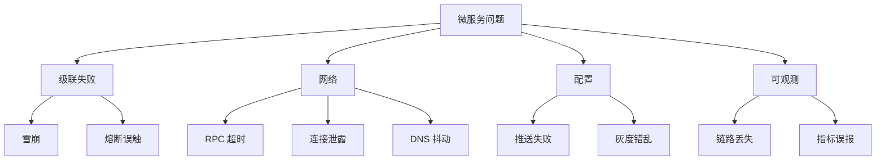
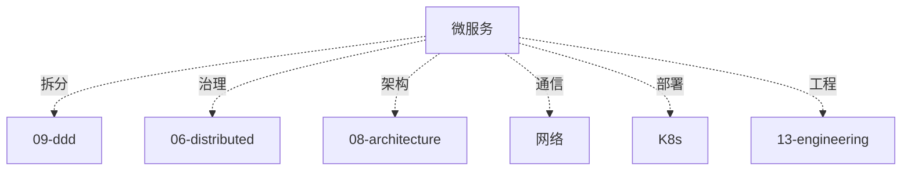

# 微服务知识地图

> 微服务是后端**架构进阶的核心阵地**。服务拆分 / 注册发现 / 配置中心 / 网关 / RPC / Mesh / 可观测 / 治理，每个都是专题。
>
> 这份地图是 07-microservice 目录的总览：知识树 / 题型分类 / 学习路径 / 系统设计角色 / 排查地图 / 答题方式

---

## 一、整体知识树



---

## 二、后端视角的微服务

| 微服务能力 | 后端解决的问题 |
| --- | --- |
| 服务拆分 | 团队独立演化 / 技术栈灵活 |
| RPC 通信 | 高性能远程调用（gRPC 10x REST）|
| 注册发现 | 动态扩缩容 + 探活 |
| 配置中心 | 动态参数 + 降级开关 |
| API 网关 | 统一入口 / 鉴权 / 限流 / 路由 |
| 服务治理 | 限流熔断降级 / 防雪崩 |
| Service Mesh | 治理能力下沉 / 业务零侵入 |
| 可观测 | 指标 + 日志 + 链路三件套 |
| 容器化 | 标准化部署 / 弹性伸缩 |
| CI/CD | 快速迭代 / 灰度 / 回滚 |
| 混沌工程 | 故障演练 / 提升韧性 |

---

## 三、能力分层（资深 Go 后端）

```text
L1 概念
  单体/SOA/微服务/Mesh 演进、拆分原则

L2 通信
  RPC / gRPC / Dubbo / REST / GraphQL

L3 注册发现 + 配置
  Nacos / Consul / Eureka / etcd 对比 + 长轮询 / 推送

L4 网关 + 治理
  APISIX / Kong / Gateway 限流熔断降级

L5 Mesh
  Istio / Envoy / Sidecar 架构

L6 可观测
  Prometheus / Jaeger / ELK / OpenTelemetry

L7 线上问题
  雪崩 / 级联失败 / 链路丢失 / 性能抖动

L8 工程实践
  CI/CD / 灰度 / 混沌工程 / SRE
```


---

## 四、题型分类

### 4.1 基础题（P5）

```
□ 单体 vs 微服务优缺点
□ 服务怎么拆？
□ RPC vs REST
□ 注册中心是什么
□ 网关的作用
```

对应：[01](01-overview.md) / [02](02-registry-discovery.md) / [04](04-api-gateway.md) / [05](05-rpc-frameworks.md)

### 4.2 中级题（P6）

```
□ Nacos vs Consul vs Eureka 对比
□ 配置中心长轮询原理
□ API 网关三大能力
□ gRPC 四种调用模式
□ 熔断器状态机
□ 限流 + 降级 + 熔断 区别
□ 分布式链路追踪原理
□ Prometheus + Grafana 监控
```

对应：[02](02-registry-discovery.md) / [03](03-config-center.md) / [04](04-api-gateway.md) / [05](05-rpc-frameworks.md) / [07](07-observability-governance.md)

### 4.3 资深题（P7+）

```
□ Service Mesh 架构（数据面 + 控制面）
□ Istio + Envoy 完整流程
□ xDS 协议（LDS / CDS / EDS / RDS）
□ Sidecar 注入 + 流量劫持
□ gRPC 负载均衡（客户端 LB / xDS）
□ Nacos 推拉结合 + 长轮询实现
□ 配置灰度发布
□ 多集群 Mesh
□ OpenTelemetry 统一可观测
□ 自研微服务框架
```

对应：[05](05-rpc-frameworks.md) / [06](06-service-mesh.md) / [07](07-observability-governance.md)

### 4.4 综合系统设计（P7-P8）

```
□ 设计一个微服务架构
□ 单体到微服务改造
□ 设计 API 网关（限流 + 鉴权 + 灰度）
□ 设计可观测系统
□ Service Mesh 落地方案
□ 多集群多活架构
```

对应：[04](04-api-gateway.md) / [06](06-service-mesh.md) + [../10-system-design](../10-system-design/README.md)

### 4.5 线上排查题

```
□ 雪崩怎么应急？
□ 链路追踪丢失怎么排查？
□ 注册中心挂了影响范围？
□ 配置推送失败怎么办？
□ 网关性能抖动定位
□ gRPC 连接泄露
```

对应：[07](07-observability-governance.md) + [../13-engineering/00-troubleshooting-runbook](../13-engineering/00-troubleshooting-runbook.md)

---

## 五、目录文件全览

| # | 文件 | 重点 |
| --- | --- | --- |
| 01 | [概览](01-overview.md) | 单体 vs 微服务 / 拆分原则 / 康威定律 |
| 02 | [注册发现](02-registry-discovery.md) | Nacos / Consul / Eureka / etcd / ZK |
| 03 | [配置中心](03-config-center.md) | Nacos / Apollo / 长轮询 / 推送 |
| 04 | [API 网关](04-api-gateway.md) | APISIX / Kong / 限流 / 鉴权 / 灰度 |
| 05 | [RPC 框架](05-rpc-frameworks.md) | gRPC / Dubbo / Thrift / Kitex |
| 06 | [Service Mesh](06-service-mesh.md) | Istio / Envoy / Sidecar / xDS |
| 07 | [可观测与治理](07-observability-governance.md) | Prometheus / Jaeger / 黄金信号 / RED |

---

## 六、在系统设计中的角色

### 6.1 微服务架构标配



### 6.2 Service Mesh

```
业务容器 + Sidecar（Envoy）
↓
控制面（Istiod）下发配置 xDS
↓
数据面劫持流量 + 治理
```

### 6.3 可观测三大支柱

```
Metrics: Prometheus + Grafana
Logs:    ELK / Loki
Traces:  Jaeger / Tempo / OpenTelemetry
```

---

## 七、线上问题分类地图



---

## 八、学习路径推荐

### 8.1 入门 → 资深（5 周）

```
Week 1: 概览 + 拆分
  01 overview

Week 2: 发现配置
  02 registry + 03 config

Week 3: 网关 + RPC
  04 gateway + 05 rpc

Week 4: Mesh
  06 mesh

Week 5: 可观测
  07 observability
```

### 8.2 面试前 1 周冲刺

```
Day 1: 单体 vs 微服务 + 拆分
Day 2: 注册发现 + 配置中心
Day 3: 网关 + RPC
Day 4: Mesh + xDS
Day 5: 可观测 + 治理
Day 6: 系统设计综合
Day 7: 模拟面试
```

---

## 九、答题模板

### 9.1 概念题（"什么时候拆微服务"）

```
3 步:
1. 康威定律: 系统架构反映组织结构
2. 拆分信号:
   - 团队 > 10 人
   - 单体构建 > 10 分钟
   - 一个模块挂拖垮全局
   - 技术栈想多元化
3. 代价:
   - 运维复杂度激增
   - 分布式事务
   - 网络延迟
   - 定位问题难
```

### 9.2 设计题（"设计 API 网关"）

```
4 步:
1. 核心能力: 路由 / 鉴权 / 限流 / 熔断 / 监控 / 灰度
2. 选型: APISIX / Kong / Gateway / 自研
3. 架构:
   - L4 LB → L7 Gateway → 微服务
   - 插件化扩展
4. 难点:
   - 插件性能（Lua / WASM）
   - 配置热更新
   - 限流精确度
```

### 9.3 取舍题（"Mesh 还是 SDK"）

```
3 步:
1. SDK 模式:
   - 性能好（无 Sidecar）
   - 多语言难统一
2. Mesh 模式:
   - 业务零侵入
   - 多语言天然统一
   - 性能有损耗（+1 跳）
3. 选择:
   - 小团队单语言 → SDK
   - 大团队多语言 → Mesh
```

---

## 十、面试表达

```text
微服务 8 层：
- L1 概念（拆分 + 演进）
- L2 通信（RPC / gRPC）
- L3 发现配置（Nacos / Consul）
- L4 网关治理（限流熔断降级）
- L5 Mesh（Istio / Envoy）
- L6 可观测（黄金信号）
- L7 线上排查
- L8 工程（CI/CD / 灰度 / 混沌）

重点讲拆分代价 + 治理体系。
```

---

## 十一、常见误区

### 误区 1：微服务 = 现代架构

错。**合适最重要**。小团队单体够用。微服务是规模大了的选择。

### 误区 2：拆得越细越好

错。过细导致**分布式泥潭**。按业务边界 + 团队 + DDD 拆。

### 误区 3：Mesh 是银弹

错。Mesh 增加复杂度 + 性能损耗。**小团队没必要**。

### 误区 4：有了熔断就不会雪崩

错。熔断只是一层。还要**限流 + 隔离 + 降级 + 超时**组合。

### 误区 5：微服务必须 K8s

错。VM + Ansible 也能跑微服务。K8s 是**运维利器**不是前提。

### 误区 6：OpenTelemetry 替代 Jaeger

部分错。OTel 是**标准协议**，Jaeger 是**后端存储**，两者配合。

---

## 十二、与其他模块的关系



跨模块查找：[../99-meta/01-cross-topic-index](../99-meta/01-cross-topic-index.md)

---

## 十三、面试加分点

- **拆分三驱动力**（业务 / 组织 / 技术）
- **Nacos 推拉结合**（长轮询 + 推送）
- **gRPC 四种模式**（Unary / Server Stream / Client Stream / Bidi）
- **xDS 协议家族**（LDS / CDS / EDS / RDS）
- **Sidecar 透明流量劫持**（iptables / eBPF）
- **四大黄金信号**（Latency / Traffic / Errors / Saturation）
- **RED / USE 方法**
- **OpenTelemetry** 统一标准
- **灰度发布** 三种方式（蓝绿 / Canary / Ring）
- **混沌工程** + Chaos Mesh
- **无侵入可观测**（Sidecar 模式）
- **微服务 vs Serverless** 演进
- **SRE 四大支柱**（SLI / SLO / SLA / 错误预算）

---

## 十四、推荐阅读路径

```
入门:
  □ 《微服务架构设计模式》
  □ 07-microservice/01-04

进阶:
  □ 《Istio 实战指南》
  □ 《Cloud Native Go》
  □ 07-microservice/05-06

资深:
  □ 《SRE Google 运维解密》
  □ Envoy / Istio 源码
  □ OpenTelemetry spec
  □ 07-microservice/07

实战:
  □ K8s 集群实操
  □ 部署 Nacos + APISIX + gRPC
  □ Istio 部署 + 流量治理
  □ Prometheus + Jaeger 搭建
```

---

## 十五、与 99-meta 的关联

```
跨主题索引: 99-meta/01-cross-topic-index.md
综合实战:   10-system-design/16-high-concurrency-scenarios.md
工程体系:   13-engineering/00-troubleshooting-runbook.md
```
