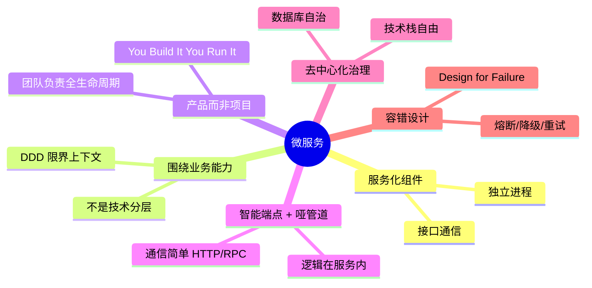
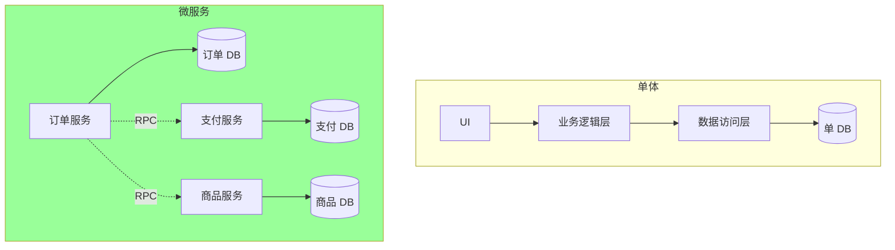
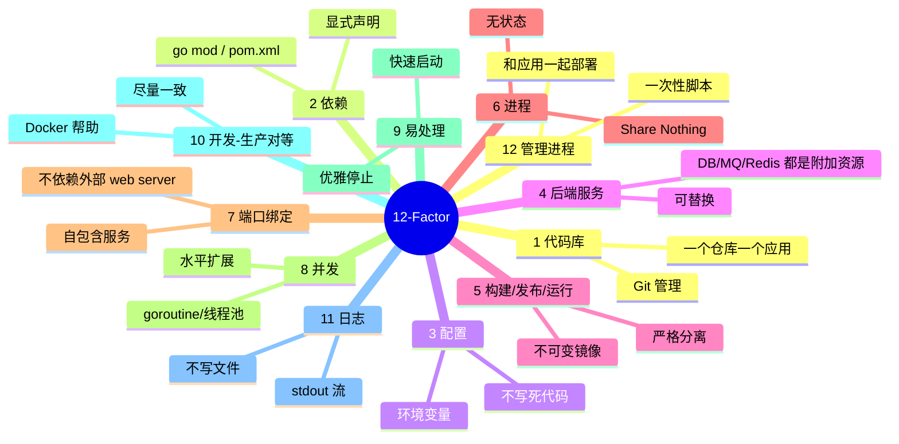
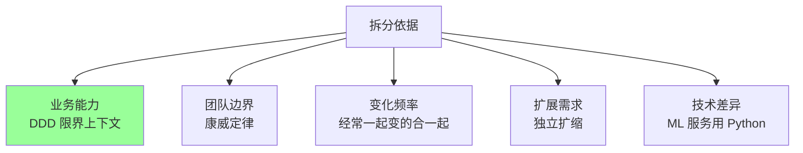
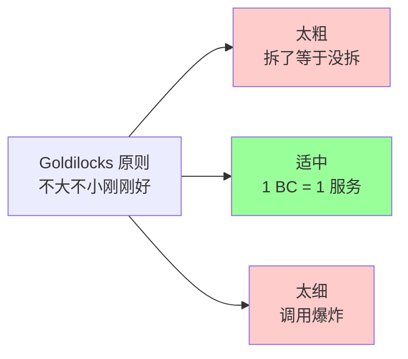
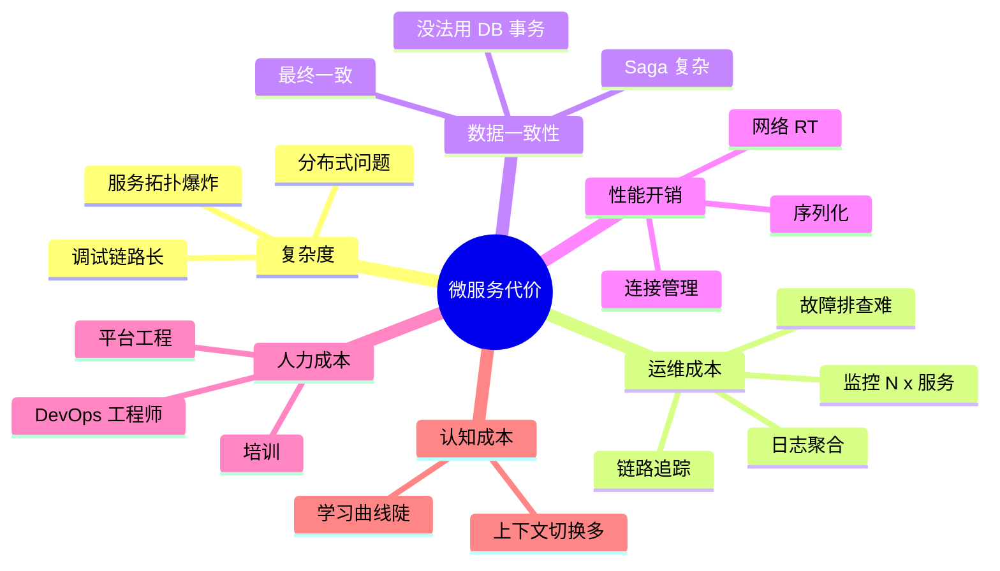
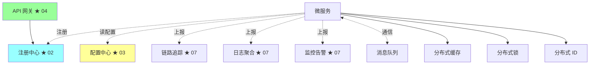
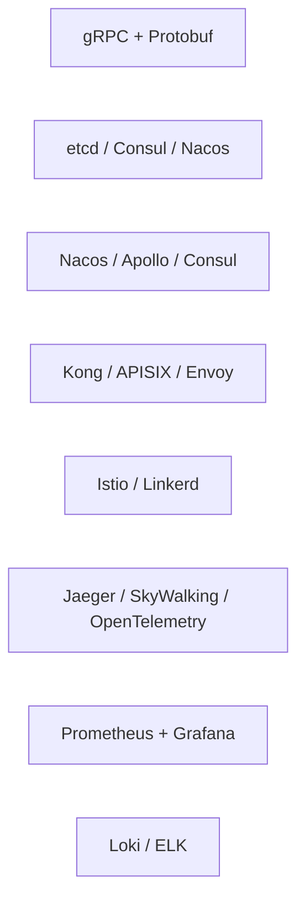
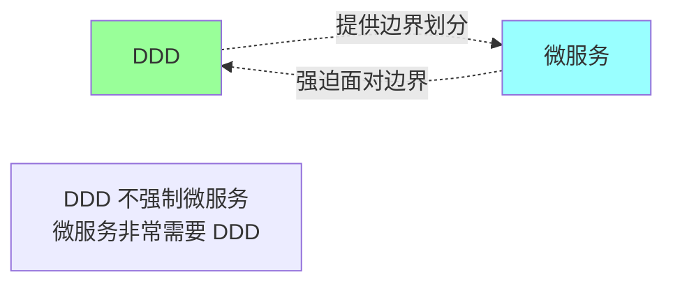
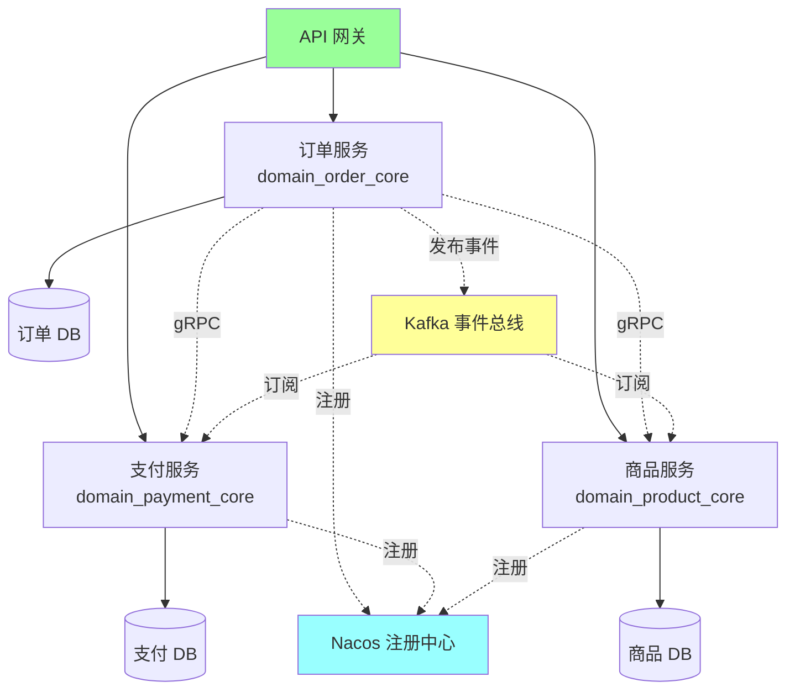

# 微服务 · 概述

> 定义 / 12-Factor App / 拆分原则 / 与 SOA 区别 / 微服务的代价 / 与 DDD 的关系

> 战略层（边界划分）见 09-ddd/01；演进层见 08-architecture/01；本篇聚焦**微服务作为方法论 + 工程实践**

## 一、什么是微服务

### 1.1 定义（Martin Fowler 2014）

> **微服务架构 = 把单一应用拆成一组小服务，每个跑在自己的进程里，通过轻量级机制通信（通常是 HTTP API），围绕业务能力组织，独立部署，可以用不同技术栈。**

### 1.2 6 大特征



### 1.3 与单体的对比



| 维度 | 单体 | 微服务 |
| --- | --- | --- |
| 部署 | 整体 | 独立 |
| 技术栈 | 统一 | 异构可选 |
| 数据库 | 共享 | 各自独立 |
| 通信 | 进程内函数调用 | RPC / HTTP |
| 扩展 | 整体扩 | 按服务扩 |
| 故障 | 全挂 | 局部 |
| 团队 | 一个团队 | 多团队各自负责 |

### 1.4 与 SOA 的区别

| | SOA | 微服务 |
| --- | --- | --- |
| 通信 | ESB 中心化 | 点对点（注册中心） |
| 协议 | SOAP / XML（重） | HTTP / gRPC（轻） |
| 数据 | 共享 DB 常见 | 一服务一库 |
| 治理 | 集中（ESB） | 分布式（SDK / Sidecar） |
| 粒度 | 粗（业务系统级） | 细（业务能力级） |
| 部署 | 经常协调发布 | 独立发布 |
| 技术 | 统一规范 | 异构自由 |

**本质**：微服务 = "**SOA 去 ESB + 细粒度 + 一服务一库 + DevOps**"。

详见 [08-architecture/01-evolution.md](../08-architecture/01-evolution.md)。

## 二、12-Factor App（云原生应用准则）

> Heroku 提出的 12 条云原生应用准则，**微服务的事实标准**



### 2.1 实战清单

```
□ 一仓库一服务 (但 monorepo 也行)
□ 依赖声明清晰 (go.mod / package.json / pom.xml)
□ 配置走环境变量或配置中心，不写死
□ DB/Redis 通过 URL 配置，可换可重连
□ 镜像构建一次，多环境复用 (dev/staging/prod 用同一镜像)
□ 应用无状态，状态外置 (Session 走 Redis)
□ 应用自带 HTTP server，不依赖 Tomcat
□ 横向扩展靠加 pod，不靠加进程内线程
□ SIGTERM 信号处理：停接新请求 + 等在途请求处理完
□ 开发用 Docker Compose，生产用 K8s，逻辑一致
□ 日志写 stdout，由 K8s/Docker 收集
```

## 三、拆分原则

### 3.1 拆分依据（再次强调 DDD）



详见 [09-ddd/01-strategic-design.md](../09-ddd/01-strategic-design.md)。

### 3.2 拆分粒度



**经验法则**：
- 一个服务 = 一个 BC（限界上下文）
- 服务数 ≈ 团队数 × 2-3
- 跨服务调用层级 < 3 层
- 服务 LOC < 几万行（不是越小越好）

### 3.3 拆分时机

```
✅ 该拆的信号:
  - 部署冲突频繁（>= 2 个团队改同一仓库）
  - 编译/启动 > 1 分钟
  - 模块需要独立扩缩（如秒杀 vs 后台）
  - 业务边界已通过 DDD 划清楚

❌ 不该拆的信号:
  - 业务还没验证（PMF 之前）
  - 团队 < 50 人
  - 没有 CI/CD/监控/链路基建
  - "听说大厂都用"
```

### 3.4 拆分顺序


**经验**：
- **从外向内**：先拆耦合少的边缘服务（如通知、搜索）
- **充分验证**：每拆一个跑稳定 1-2 月再拆下一个
- **数据先行**：DB 拆分比应用拆分更难，提前规划
- **绝不大爆炸**：宁可 2 年慢拆，不要 2 周强拆

详见 [09-ddd/01-strategic-design.md](../09-ddd/01-strategic-design.md) + 08-architecture/01。

## 四、微服务的真实代价

### 4.1 收益

```
✅ 独立部署 → 发版自由
✅ 独立扩缩 → 资源精准
✅ 团队自治 → 协作效率
✅ 技术自由 → 选型灵活
✅ 容错隔离 → 局部故障
```

### 4.2 代价（常被忽略）



**Sam Newman 在《微服务设计》原话**：
> "**微服务不是免费午餐**。如果你不愿意接受运维复杂度的提升，就不要上微服务。"

### 4.3 计算 ROI

```
微服务收益 = 部署独立性 + 扩缩独立性 + 团队自治
微服务成本 = 运维复杂度 + 分布式难题 + 学习曲线

微服务 ROI 适合公式:
  当 团队规模 > 50 人 + 业务复杂度高 + 有 DevOps 基础

否则 ROI < 0，应该用 Modular Monolith
```

## 五、微服务的核心组件



| 组件 | 作用 | 本系列 |
| --- | --- | --- |
| API 网关 | 入口路由 / 鉴权 / 限流 | 04 |
| 注册中心 | 服务发现 | 02 |
| 配置中心 | 配置下发 | 03 |
| RPC 框架 | 服务间通信 | 05 |
| Service Mesh | 治理下沉 | 06 |
| 链路追踪 | 调用链 | 07 |
| 日志聚合 | 集中查询 | 07 |
| 监控告警 | 指标 + 报警 | 07 |
| 消息队列 | 异步解耦 | 05-message-queue |
| 分布式缓存 | 性能优化 | 04-redis |
| 分布式锁 | 并发控制 | 06-distributed/04 |
| 分布式 ID | 全局唯一 | 06-distributed/05 |

## 六、技术栈对比

### 6.1 Go 微服务生态

| 框架 | 厂商 | 特点 |
| --- | --- | --- |
| **Kitex** | 字节 | 高性能 RPC，Thrift/Protobuf |
| **Hertz** | 字节 | 高性能 HTTP |
| **go-zero** | 好未来开源 | 全套 + 代码生成 |
| **Kratos** | B 站开源 | DDD 风格 + Wire |
| **Go Micro** | 老牌 | 灵活但生态衰退 |
| **gRPC + 自组件** | 通用 | 灵活，自己组合 |

**实战推荐**：
- 字节系或自研倾向 → Kitex + Hertz
- 快速业务起步 → go-zero
- DDD 项目 → Kratos
- 标准开放生态 → gRPC + Etcd + Prometheus

### 6.2 Java 微服务生态

| 框架 | 特点 |
| --- | --- |
| **Spring Cloud** | 老牌全家桶 |
| **Spring Cloud Alibaba** | + Nacos / Sentinel / Seata |
| **Dubbo** | 阿里系 RPC |
| **Quarkus** | 云原生 + GraalVM |
| **Micronaut** | 编译期注入 |

### 6.3 跨语言通用



## 七、与 DDD 的关系



**典型对应**：
- **限界上下文 (BC)** → 微服务
- **聚合** → 服务内的核心模型
- **领域事件** → 服务间的集成事件
- **防腐层 (ACL)** → 服务调用的适配器
- **应用服务** → 服务的对外接口

详见 [09-ddd/](../09-ddd/) 全套。

## 八、ddd_order_example 微服务化思路

如果把现有项目（订单单体）拆成微服务：



**演进路径**：
```
T0: 当前单体 (洋葱架构 + 多个 BC 包)
T1: Modular Monolith (严格按 BC 隔离，加防腐层接口)
T2: 接入注册中心 + 配置中心
T3: 拆出 Product 服务（边缘）→ ACL 接入
T4: 拆出 Payment 服务（次核心）→ Saga 替代跨聚合事务
T5: 订单服务保持核心
T6: 接入 Service Mesh + 链路追踪
T7: 全链路可观测性闭环
```

**关键改造**：
- 跨服务通信：函数调用 → gRPC
- 跨服务事务：DB 事务 → Saga + 事件
- 数据库：共享 schema → 各自独立 DB
- 商品服务：内部接口 → 防腐层 + 真实 RPC

详见 [09-ddd/06-go-implementation.md](../09-ddd/06-go-implementation.md)。

## 九、典型反模式

### 反模式 1：分布式单体

```
拆了多服务，但必须按固定顺序部署
改一个服务要同步改 3 个
跨服务"事务"硬塞
→ 看似微服务实质单体
```

**修复**：DDD 战略 + 集成事件解耦。

### 反模式 2：微服务粒度过细

```
把每个表/接口都拆成独立服务
→ 100 个服务，跨服务调用 5-10 层
→ 链路追踪都看不全
```

**修复**：按 BC 拆，不按表拆。

### 反模式 3：共享数据库

```
多个服务直连同一 DB
→ schema 改动牵连多个服务
→ 失去微服务的独立性
```

**修复**：一服务一库；跨服务用 RPC 或事件。

### 反模式 4：忽略运维基建

```
没有监控/链路/日志聚合，直接拆微服务
→ 出问题完全摸不着头脑
```

**修复**：基建先行，再拆。

### 反模式 5：盲目追求技术栈自由

```
"反正可以异构"→ 团队 5 个服务用了 5 种语言
→ 没人能读懂全部代码 → 维护灾难
```

**修复**：技术栈应该收敛（1-2 种），异构是手段不是目的。

### 反模式 6：把 SOA 当微服务

```
保留 ESB + SOAP + 共享 DB → 改了个名字叫微服务
```

**修复**：去 ESB + 一服务一库 + 轻量协议。

### 反模式 7：忽略 DDD

```
微服务边界乱划 → 服务间强耦合 → 改一个连改 N 个
```

**修复**：DDD 战略设计先行。

## 十、面试高频题

**Q1：什么是微服务？6 大特征？**

围绕业务能力组织的小服务，独立进程，轻量通信（HTTP/RPC），独立部署，可异构。

6 特征：服务化组件 / 围绕业务能力 / 产品而非项目 / 智能端点哑管道 / 去中心化 / 容错设计。

**Q2：微服务 vs SOA 区别？**

| | SOA | 微服务 |
| --- | --- | --- |
| 通信 | ESB 中心化 | 点对点 |
| 协议 | SOAP/XML | HTTP/gRPC |
| 数据 | 共享 DB | 一服务一库 |
| 治理 | 集中 | 分布式 |

本质：**去 ESB + 细粒度 + 一服务一库 + DevOps**。

**Q3：12-Factor 是什么？**

云原生应用 12 条准则：代码库 / 依赖 / 配置 / 后端服务 / 构建发布运行 / 进程 / 端口 / 并发 / 易处理 / 开发生产对等 / 日志 / 管理进程。

**核心**：无状态、可替换、可伸缩、可观测。

**Q4：什么时候该拆微服务？**

✅ 团队 > 50、业务复杂、模块需独立扩缩、有 DevOps 基础、DDD 边界清晰。

❌ 团队小、业务未验证、没基建、追求"现代感"。

**Q5：微服务的真实代价？**

- 运维复杂度（N x 服务）
- 分布式问题（一致性 / CAP）
- 性能开销（网络 / 序列化）
- 学习曲线陡

Sam Newman：**微服务不是免费午餐**。

**Q6：微服务怎么拆才合理？**

按 BC 拆（DDD 限界上下文）：
- 一个服务 = 一个 BC
- 服务数 ≈ 团队数 × 2-3
- 调用层级 < 3 层
- 从边缘到核心顺序拆

**Q7：分布式单体怎么发现？**

- 必须按顺序部署
- 改一个连改 N 个
- 跨服务事务硬塞
- BC 边界模糊

**Q8：微服务一定要一服务一库吗？**

**理想是**。但实战可妥协：
- 严格派：必须一服务一库
- 务实派：共享 DB 但严格按 schema 隔离

跨库事务用 Saga / 事件最终一致。

**Q9：微服务和 DDD 什么关系？**

DDD 战略提供**边界划分方法**，微服务提供**实施手段**。

- 限界上下文 → 微服务
- 聚合 → 服务内核心模型
- 领域事件 → 集成事件
- 防腐层 → 调用适配器

DDD 不强制微服务，但**微服务非常需要 DDD**。

**Q10：微服务核心组件有哪些？**

API 网关 / 注册中心 / 配置中心 / RPC 框架 / Service Mesh / 链路追踪 / 日志聚合 / 监控告警 / 消息队列 / 分布式缓存 / 分布式锁 / 分布式 ID。

每个组件都要有方案才能跑微服务。

## 十一、面试加分点

- 微服务 = **去 ESB + 细粒度 + 一服务一库 + DevOps**（与 SOA 区别要清楚）
- **12-Factor App** 是云原生事实标准
- **Goldilocks 原则**：不大不小刚刚好
- **服务数 ≈ 团队数 × 2-3**（康威定律）
- **从外向内拆**：边缘 → 次核心 → 核心
- **微服务非免费午餐**（Sam Newman），运维成本要算清楚
- **DDD + 微服务** 是组合拳，缺一不可
- **Modular Monolith** 是微服务过渡期的理想形态
- 大厂技术栈：阿里 Dubbo+Nacos / 字节 Kitex+Hertz / 通用 gRPC+etcd
- **一服务一库**是原则，不是教条
- **基建先行**（监控/链路/日志），再拆服务
- 真正的微服务化是 **2-3 年项目**，不是 2 周的事
